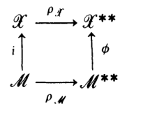

# III. Banach Spaces

# CHAPTER III

# Banach Spaces

The concept of a Banach space is a generalization of Hilbert space. A Banach space assumes that there is a norm on the space relative to which the space is complete, but it is not assumed that the norm is defined in terms of an inner product. There are many examples of Banach spaces that are not Hilbert spaces, so that the generalization is quite useful.

## §1. Elementary Properties and Examples

<!-- BEGIN BACKGROUND BG-III.block1 -->

### Definition BG-III.1. The topological vocabulary in the examples

A topology is a collection of open sets closed under arbitrary unions and finite intersections and containing the empty set and the whole space. A neighborhood of a point contains an open set containing it. A map is continuous when inverse images of open sets are open; a bijection is a **homeomorphism** when it and its inverse are continuous. A space is **Hausdorff** if distinct points have disjoint neighborhoods, and **locally compact** here means that every point has a neighborhood with compact closure. A subspace inherits intersections with open sets of its ambient space. The discrete topology makes every subset open. Compactness always means the open-cover definition, not a sequential characterization unless a metric is available.

### Lemma BG-III.2. Compact-set facts needed for $C_0(X)$

A continuous image of a compact space is compact. A compact subset of a Hausdorff space is closed. A closed subset of a compact space is compact. A scalar continuous function on a compact space is bounded and attains its maximum modulus.

**Proof.** Pull back an open cover along the continuous map and use a finite subcover. To separate a point $x$ outside a compact set $K$, choose for each $y\in K$ disjoint neighborhoods of $x$ and $y$; finitely many of the latter cover $K$, and the intersection of the corresponding neighborhoods of $x$ misses $K$. This proves closedness. Add the complement of a closed subset to any cover of it to prove its compactness. The scalar image is compact and therefore bounded (use the cover by radius-$n$ balls) and closed. Its supremum modulus is attained by taking a sequence approaching the supremum and a convergent subsequence in that bounded closed subset of $\mathbb R^2$. $\square$

### Corollary BG-III.3. Completing the proof that $C_0(X)$ is closed

A continuous $f$ for which $\{|f|\geq\varepsilon\}$ is compact for every positive $\varepsilon$ is bounded. If $f_n\in C_0(X)$ converge uniformly to $f$, then $f\in C_0(X)$.

**Proof.** Outside the compact set $\{|f|\geq1\}$ the modulus is less than one, and on that set it is bounded by the previous lemma. A uniform limit is continuous by BG-I.4, whose neighborhood proof works on arbitrary topological domains. For fixed $\varepsilon$, choose $n$ with $\|f_n-f\|_\infty<\varepsilon/2$. Then $\{|f|\geq\varepsilon\}\subseteq\{|f_n|\geq\varepsilon/2\}$. The smaller set is closed by continuity, so it is a **closed** subset of a compact set, hence compact. An arbitrary subset of a compact space need not be compact; this closedness is the implicit step in Proposition 1.7. $\square$

### Theorem BG-III.4. Hölder, Minkowski, and completeness of $L^p$

For $1<p<\infty$ and $1/p+1/q=1$, $\int|fg|\leq\|f\|_p\|g\|_q$. Also $\|f+g\|_p\leq\|f\|_p+\|g\|_p$, and $L^p$ is complete for $1\leq p\leq\infty$.

**Proof.** Minimizing $a^p/p-ab+b^q/q$ as a function of $a\geq0$ gives Young's inequality $ab\leq a^p/p+b^q/q$. Normalize $|f|$ and $|g|$ to norm one and integrate to obtain Hölder. For $p=1,q=\infty$ the essential bound gives the same estimate directly. The inequality $|f+g|^p\leq2^{p-1}(|f|^p+|g|^p)$ first ensures integrability. Then

$$
\|f+g\|_p^p\leq\int(|f|+|g|)|f+g|^{p-1}
\leq(\|f\|_p+\|g\|_p)\|f+g\|_p^{p-1};
$$

divide unless the latter norm is zero. The endpoint triangle inequalities are immediate.

For finite $p$, given a Cauchy sequence choose a subsequence with $\|f_{n_{k+1}}-f_{n_k}\|_p\leq2^{-k}$. Minkowski bounds the $L^p$ norm of $\sum_{k\leq N}|f_{n_{k+1}}-f_{n_k}|$ by one; monotone convergence gives an a.e. finite sum in $L^p$. Thus the telescoping series defines $f$ a.e.; Fatou gives $\|f-f_{n_k}\|_p\leq\sum_{j\geq k}2^{-j}$, and the whole sequence converges by its Cauchy property. For $p=\infty$, discard the countable union of null sets on which any of the pairwise essential-norm bounds fails. On what remains the Cauchy sequence is uniformly Cauchy, so its uniform limit is measurable and essentially bounded, and convergence is in essential-supremum norm. $\square$

### Lemma BG-III.5. Completeness of the differentiable-function examples

The spaces $C^{(n)}[0,1]$ and $W_p^n[0,1]$ in Examples 1.10–1.11 are complete in their displayed norms.

**Proof.** In the first case a Cauchy sequence has uniform derivative limits $f_m^{(j)}\to g_j$ for $0\leq j\leq n$. Pass to the limit in $f_m^{(j)}(x)=f_m^{(j)}(0)+\int_0^x f_m^{(j+1)}$; uniform convergence permits passage under the integral. Thus $g_j'=g_{j+1}$ and $g_0$ is the required limit.

For an absolutely continuous $u$ on $[0,1]$, integration of $|u(x)|\leq|u(t)|+\int_0^1|u'|$ over $t$ gives

$$
\|u\|_\infty\leq\|u\|_1+\|u'\|_1\leq\|u\|_p+\|u'\|_p.
$$

Consequently, for a Cauchy sequence in $W_p^n$, derivatives of orders $0,\ldots,n-1$ are uniformly Cauchy, while the order-$n$ derivatives converge to some $g\in L^p$. Passing to the limit in the integral representation of the order-$(n-1)$ derivative gives $u^{(n-1)}(x)=u^{(n-1)}(0)+\int_0^xg$; convergence of these integrals is uniform since $L^p\subset L^1$ on this interval. The lower derivative identities pass to the limit as in the first case. The Lebesgue fundamental theorem makes $u^{(n-1)}$ absolutely continuous with derivative $g$ a.e. All derivatives therefore converge in the specified norms. $\square$
<!-- END BACKGROUND BG-III.block1 -->

**1.1. Definition.** If $\mathcal{X}$ is a vector space over $\mathbb{F}$, a *seminorm* is a function $p:\mathcal{X}\to[0,\infty)$ having the properties:

(a) $p(x+y)\leq p(x)+p(y)$ for all $x,y$ in $\mathcal{X}$.

(b) $p(\alpha x)=|\alpha|p(x)$ for all $\alpha$ in $\mathbb{F}$ and $x$ in $\mathcal{X}$.

It follows from (b) that $p(0)=0$. A *norm* is a seminorm $p$ such that

(c) $x=0$ if $p(x)=0$.

Usually a norm is denoted by $\|\cdot\|$.

The norm on a Hilbert space is a norm. Also, the norm on $\mathcal{B}(\mathcal{H})$ is a norm.

If $\mathcal{X}$ has a norm, then $d(x,y)=\|x-y\|$ defines a metric on $\mathcal{X}$.

**1.2. Definition.** A *normed space* is a pair $(\mathcal{X},\|\cdot\|)$, where $\mathcal{X}$ is a vector space and $\|\cdot\|$ is a norm on $\mathcal{X}$. A *Banach space* is a normed space that is complete with respect to the metric defined by the norm.

**1.3. Proposition.** *If $\mathcal{X}$ is a normed space, then*

(a) *the function $\mathcal{X}\times\mathcal{X}\to\mathcal{X}$ defined by $(x,y)\mapsto x+y$ is continuous;*

(b) *the function $\mathbb{F}\times\mathcal{X}\to\mathcal{X}$ defined by $(\alpha,x)\mapsto\alpha x$ is continuous.*

**Proof.** If $x_n\to x$ and $y_n\to y$, then $\|(x_n+y_n)-(x+y)\|=\|(x_n-x)+(y_n-y)\|\leq\|x_n-x\|+\|y_n-y\|\to0$ as $n\to\infty$. This proves (a). The proof of (b) is left to the reader. $\blacksquare$

The next lemma is quite useful.

**1.4. Lemma.** *If $p$ and $q$ are seminorms on a vector space $\mathcal{X}$, then the following statements are equivalent.*

(a) $p(x)\leq q(x)$ *for all* $x$. (*That is,* $p\leq q$.)

(b) $\{x\in\mathcal{X}:q(x)<1)\}\subseteq\{x\in\mathcal{X}:p(x)<1\}$.

(b′) $p(x)<1$ *whenever* $q(x)<1$.

(c) $\{x:q(x)\leq1\}\subseteq\{x:p(x)\leq1\}$.

(c′) $p(x)\leq1$ *whenever* $q(x)\leq1$.

(d) $\{x:q(x)<1\}\subseteq\{x:p(x)\leq1\}$.

(d′) $p(x)\leq1$ *whenever* $q(x)<1$.

**Proof.** It is clear that (b) and (b′), (c) and (c′), and (d) and (d′) are equivalent. It is also clear that (a) implies all of the remaining conditions and that both (b) and (c) imply (d). It remains to show that (d) implies (a).

Assume that (d) holds and put $q(x)=\alpha$. If $\varepsilon>0$, then $q((\alpha+\varepsilon)^{-1}x)=(\alpha+\varepsilon)^{-1}\alpha<1$. By (d), $1\geq p((\alpha+\varepsilon)^{-1}x)=(\alpha+\varepsilon)^{-1}p(x)$, so $p(x)\leq\alpha+\varepsilon=q(x)+\varepsilon$. Letting $\varepsilon\to0$ shows (a). $\blacksquare$

If $\|\cdot\|_1$ and $\|\cdot\|_2$ are two norms on $\mathcal{X}$, they are said to be *equivalent norms* if they define the same topology on $\mathcal{X}$.

**1.5. Proposition.** *If $\|\cdot\|_1$ and $\|\cdot\|_2$ are two norms on $\mathcal{X}$, then these norms are equivalent if and only if there are positive constants $c$ and $C$ such that*

$$
c\|x\|_1\leq\|x\|_2\leq C\|x\|_1
$$

*for all $x$ in $\mathcal{X}$.*

**Proof.** Suppose there are constants $c$ and $C$ such that $c\|x\|_1\leq\|x\|_2\leq C\|x\|_1$ for all $x$ in $\mathcal{X}$. Fix $x_0$ in $\mathcal{X}$, $\varepsilon>0$. Then

$$
\{x\in\mathcal{X}:\|x-x_0\|_1<\varepsilon/C\}\subseteq
\{x\in\mathcal{X}:\|x-x_0\|_2<\varepsilon\},
$$

$$
\{x\in\mathcal{X}:\|x-x_0\|_2<c\varepsilon\}\subseteq
\{x\in\mathcal{X}:\|x-x_0\|_1<\varepsilon\}.
$$

This shows that the two topologies are the same. Now assume that the two norms are equivalent. Hence $\{x:\|x\|_1<1\}$ is an open neighborhood of $0$ in the topology defined by $\|\cdot\|_2$. Therefore there is an $r>0$ such that $\{x:\|x\|_2<r\}\subseteq\{x:\|x\|_1<1\}$. If $q(x)=r^{-1}\|x\|_2$ and $p(x)=\|x\|_1$, the preceding lemma implies $\|x\|_1\leq r^{-1}\|x\|_2$ or $c\|x\|_1\leq\|x\|_2$, where $c=r$. The other inequality is left to the reader. $\blacksquare$

There are two types of properties of a Banach space: those that are topological and those that are metric. The metric properties depend on the

precise norm; the topological ones depend only on the equivalence class of norms (see Exercise 4).

**1.6. Example.** Let $X$ be any Hausdorff space (all spaces in this book are assumed to be Hausdorff unless the contrary is specified) and let $C_b(X)=$ all continuous functions $f:X\to\mathbb F$ such that $\|f\|\equiv\sup\{|f(x)|:x\in X\}<\infty$. For $f,g$ in $C_b(X)$, define $(f+g):X\to\mathbb F$ by $(f+g)(x)=f(x)+g(x)$; for $\alpha$ in $\mathbb F$ define $(\alpha f)(x)=\alpha f(x)$. Then $C_b(X)$ is a Banach space.

The proofs of the statements in (1.6) are all routine except, perhaps, for the fact that $C_b(X)$ is complete. To see this, let $\{f_n\}$ be a Cauchy sequence in $C_b(X)$. So if $\varepsilon>0$, there is an integer $N_\varepsilon$ such that for $n,m\geqslant N_\varepsilon$,
$\varepsilon>\|f_n-f_m\|=\sup\{|f_n(x)-f_m(x)|:x\in X\}$. In particular, for any $x$ in $X$, $|f_n(x)-f_m(x)|\leqslant\|f_n-f_m\|<\varepsilon$ when $n,m\geqslant N_\varepsilon$. So $\{f_n(x)\}$ is a Cauchy sequence in $\mathbb F$. Let $f(x)=\lim_{n\to\infty}f_n(x)$ if $x\in X$. Now fix $x$ in $X$. If $n,m\geqslant N_\varepsilon$, then $|f(x)-f_n(x)|\leqslant|f(x)-f_m(x)|+\|f_m-f_n\|<|f(x)-f_m(x)|+\varepsilon$. Letting $m\to\infty$ gives that $|f(x)-f_n(x)|\leqslant\varepsilon$ when $n\geqslant N_\varepsilon$. This is independent of $x$. Hence $\|f-f_n\|\leqslant\varepsilon$ for $n\geqslant N_\varepsilon$.

What has been just shown is that $\|f-f_n\|\to0$ as $n\to\infty$. Note that this implies that $f_n(x)\to f(x)$ uniformly on $X$. It is standard that $f$ is continuous. Also, $\|f\|\leqslant\|f-f_n\|+\|f_n\|<\infty$. Hence $f\in C_b(X)$ and so $C_b(X)$ is complete.

Note that a linear subspace $\mathcal Y$ of a Banach space $\mathcal X$ that is topologically closed is also a Banach space if it has the norm of $\mathcal X$.

**1.7. Proposition.** *If $X$ is a locally compact space and $C_0(X)=$ all continuous functions $f:X\to\mathbb F$ such that for all $\varepsilon>0$, $\{x\in X:|f(x)|\geqslant\varepsilon\}$ is compact, then $C_0(X)$ is a closed subspace of $C_b(X)$ and hence is a Banach space.*

**Proof.** That $C_0(X)$ is a linear manifold in $C_b(X)$ is left as an exercise. It will only be shown that $C_0(X)$ is closed in $C_b(X)$. Let $\{f_n\}\subseteq C_0(X)$ and suppose $f_n\to f$ in $C_b(X)$. If $\varepsilon>0$, there is an integer $N$ such that $\|f_n-f\|<\varepsilon/2$; that is, $|f_n(x)-f(x)|<\varepsilon/2$ for all $n\geqslant N$ and $x$ in $X$. If $|f(x)|\geqslant\varepsilon$, then $\varepsilon\leqslant|f(x)-f_n(x)+f_n(x)|\leqslant\varepsilon/2+|f_n(x)|$ for $n\geqslant N$; so $|f_n(x)|\geqslant\varepsilon/2$ for $n\geqslant N$. Thus, $\{x\in X:|f(x)|\geqslant\varepsilon\}\subseteq\{x\in X:|f_N(x)|\geqslant\varepsilon/2\}$ so that $f\in C_0(X)$. ■

The space $C_0(X)$ is the set of continuous functions on $X$ that *vanish at infinity*. If $X=\mathbb R$, then $C_0(\mathbb R)=$ all of the continuous functions $f:\mathbb R\to\mathbb F$ such that $\lim_{x\to\pm\infty}f(x)=0$. If $X$ is compact, $C_0(X)=C_b(X)\equiv C(X)$.

If $I$ is any set, then give $I$ the discrete topology. Hence $I$ becomes locally compact. Also any function on $I$ is continuous. Rather than $C_b(I)$, the customary notation is $\ell^\infty(I)$. That is, $\ell^\infty(I)=$ all bounded functions $f:I\to\mathbb F$ with $\|f\|=\sup\{|f(i)|:i\in I\}$. $c_0(I)$ consists of all functions $f:I\to\mathbb F$ such that for every $\varepsilon>0$, $\{i\in I:|f(i)|\geqslant\varepsilon\}$ is finite. If $I=\mathbb N$, the usual notation for these spaces is $\ell^\infty$ and $c_0$. Note that $\ell^\infty$ consists of all bounded sequences of scalars and $c_0$ consists of all sequences that converge to 0.

**1.8. Example.** If $(X,\Omega,\mu)$ is a measure space and $1\leq p\leq\infty$, then $L^p(X,\Omega,\mu)$ is a Banach space.

The preceding example is usually proved in courses on integration and no proof is given here.

**1.9. Example.** Let $I$ be a set and $1\leq p<\infty$. Define $\ell^p(I)$ to be the set of all functions $f:I\to\mathbf F$ such that $\sum\{|f(i)|^p:i\in I\}<\infty$; and define $\|f\|_p=(\sum\{|f(i)|^p:i\in I\})^{1/p}$. Then $\ell^p(I)$ is a Banach space. If $I=\mathbf N$, then $\ell^p(\mathbf N)=\ell^p$.

If $\Omega=$ all subsets of $I$ and for each $\Delta$ in $\Omega$, $\mu(\Delta)=$ the number of points in $\Delta$ if $\Delta$ is finite and $\mu(\Delta)=\infty$ otherwise, then $\ell^p(I)=L^p(I,\Omega,\mu)$. So the statement in (1.9) is a consequence of the one in (1.8).

**1.10. Example.** Let $n\geq1$ and let $C^{(n)}[0,1]=$ the collection of functions $f:[0,1]\to\mathbf F$ such that $f$ has $n$ continuous derivatives. Define $\|f\|=\sup_{0\leq k\leq n}\{\sup\{|f^{(k)}(x)|:0\leq x\leq1\}\}$. Then $C^{(n)}[0,1]$ is a Banach space.

**1.11. Example.** Let $1\leq p<\infty$ and $n\geq1$ and let $W_p^n[0,1]=$ the functions $f:[0,1]\to\mathbf F$ such that $f$ has $n-1$ continuous derivatives, $f^{(n-1)}$ is absolutely continuous, and $f^{(n)}\in L^p[0,1]$. For $f$ in $W_p^n[0,1]$, define

$$
\|f\|=\sum_{k=0}^{n}\left[\int_0^1|f^{(k)}(x)|^p\,dx\right]^{1/p}.
$$

Then $W_p^n[0,1]$ is a Banach space.

The following is a useful fact about seminorms.

**1.12. Proposition.** If $p$ is a seminorm on $\mathcal X$, $|p(x)-p(y)|\leq p(x-y)$ for all $x,y$ in $\mathcal X$. If $\|\cdot\|$ is a norm, then $|\|x\|-\|y\||\leq\|x-y\|$ for all $x,y$ in $\mathcal X$.

**Proof.** Of course, the inequality for norms is a consequence of the one for seminorms. Note that if $x,y\in\mathcal X$, $p(x)=p(x-y+y)\leq p(x-y)+p(y)$, so $p(x)-p(y)\leq p(x-y)$. Similarly, $p(y)-p(x)\leq p(x-y)$. ■

There is the concept of “isomorphism” for the category of Banach spaces.

**1.13. Definition.** If $\mathcal X$ and $\mathcal Y$ are normed spaces, $\mathcal X$ and $\mathcal Y$ are *isometrically isomorphic* if there is a surjective linear isometry from $\mathcal X$ onto $\mathcal Y$.

The term *isomorphism* in Banach space theory is reserved for linear bijections $T:\mathcal X\to\mathcal Y$ that are homeomorphisms.

**EXERCISES**

1. Complete the proof of Proposition 1.3.
2. Complete the proof of Proposition 1.5.

   
3. For $1\leq p<\infty$ and $x=(x_1,\ldots,x_d)$ in $\mathbb F^d$, define $\|x\|_p\equiv\left[\sum_{j=1}^d|x_j|^p\right]^{1/p}$; define $\|x\|_\infty\equiv\sup\{|x_j|:1\leq j\leq d\}$. Show that all of these norms are equivalent. For $1\leq p,q\leq\infty$, what are the best constants $c$ and $C$ such that $c\|x\|_p\leq\|x\|_q\leq C\|x\|_p$ for all $x$ in $\mathbb F^d$?

4. If $1\leq p\leq\infty$ and $\|\cdot\|_p$ is defined on $\mathbb R^2$ as in Exercise 3, graph $\{x\in\mathbb R^2:\|x\|_p=1\}$. Note that if $1<p<\infty$, $\|x\|_p=\|y\|_p=1$, and $x\neq y$, then for $0<t<1$, $\|tx+(1-t)y\|_p<1$. The same cannot be said for $p=1,\infty$.

5. Let $c$ = the set of all sequences $\{\alpha_n\}_1^\infty$, $\alpha_n$ in $\mathbb F$, such that $\lim\alpha_n$ exists. Show that $c$ is a closed subspace of $l^\infty$ and hence is a Banach space.

6. Let $X=\{n^{-1}:n\geq1\}\cup\{0\}$. Show that $C(X)$ and the space of $c$ of Exercise 5 are isometrically isomorphic.

   (a) Show that if $1\leq p<\infty$ and $I$ is an infinite set, then $l^p(I)$ has a dense set of the same cardinality as $I$.

   (b) Show that if $1\leq p<\infty$, $l^p(I)$ and $l^p(J)$ are isometrically isomorphic if and only if $I$ and $J$ have the same cardinality.

7. If $l^\infty(I)$ and $l^\infty(J)$ are isometrically isomorphic, do $I$ and $J$ have the same cardinality?

8. Show that $l^\infty$ is not separable.

9. Complete the proof of Proposition 1.7.

10. Verify the statements in Example 1.10.

11. Verify the statements in Example 1.11.

12. Let $X$ be locally compact and let $X_\infty=X\cup\{\infty\}$ be the one-point compactification of $X$. Show that $C_0(X)$ and $\{f\in C(X_\infty):f(\infty)=0\}$, with the norm it inherits as a subspace of $C(X_\infty)$, are isometrically isomorphic Banach spaces.

13. Let $X$ be locally compact and define $C_c(X)$ to be the continuous functions $f:X\to\mathbb F$ such that $\operatorname{spt}f\equiv\operatorname{cl}\{x\in X:f(x)\neq0\}$ is compact ($\operatorname{spt}f$ is the *support* of $f$). Show that $C_c(X)$ is dense in $C_0(X)$.

14. If $W_p^n[0,1]$ is defined as in Example 1.11 and $f\in W_p^n[0,1]$, let $\lvert\!\lvert\!\lvert f\rvert\!\rvert\!\rvert\equiv\left[\int|f(x)|^p\,dx\right]^{1/p}+\left[\int|f^{(n)}(x)|^p\,dx\right]^{1/p}$. Show that $\lvert\!\lvert\!\lvert\cdot\rvert\!\rvert\!\rvert$ is equivalent to the norm defined on $W_p^n[0,1]$.

15. Let $\mathcal X$ be a normed space and let $\widehat{\mathcal X}$ be its completion as a metric space. Show that $\widehat{\mathcal X}$ is a Banach space.

16. Show that the norm on $C([0,1])=C_b([0,1])$ does not come from an inner product by showing that it does not satisfy the parallelogram law.

## §2. Linear Operators on Normed Spaces

<!-- BEGIN BACKGROUND BG-III.block2 -->

### Lemma BG-III.6. Why an operator space is complete

If $Y$ is Banach, $\mathcal B(X,Y)$ is Banach, whether or not $X$ is complete.

**Proof.** For an operator-norm Cauchy sequence $A_n$, each $(A_nx)$ is Cauchy because $\|A_nx-A_mx\|\leq\|A_n-A_m\|\|x\|$. Define $Ax=\lim A_nx$. Limits give linearity. Since Cauchy sequences are bounded, $M=\sup_n\|A_n\|<\infty$, and $\|Ax\|\leq M\|x\|$. If $\|A_n-A_m\|\leq\varepsilon$ for $m,n\geq N$, let $m\to\infty$ in the pointwise bound to get $\|(A_n-A)x\|\leq\varepsilon\|x\|$. Taking the supremum over the unit ball proves operator-norm convergence. This proof also explains completeness of the dual $X^*$ in §5. $\square$
<!-- END BACKGROUND BG-III.block2 -->

This section gathers together a few pertinent facts and examples concerning linear operators on normed spaces. A fuller study of operators on Banach spaces will be pursued later.

The proof of the first result is similar to that of Proposition I.3.1 and is left to the reader. [Also see (II.1.1).] $\mathcal{B}(\mathcal{X},\mathcal{Y})=$ all continuous linear transformations $A:\mathcal{X}\to\mathcal{Y}$.

**2.1. Proposition.** *If $\mathcal{X}$ and $\mathcal{Y}$ are normed spaces and $A:\mathcal{X}\to\mathcal{Y}$ is a linear transformation, the following statements are equivalent.*

(a) $A\in\mathcal{B}(\mathcal{X},\mathcal{Y})$.

(b) $A$ is continuous at $0$.

(c) $A$ is continuous at some point.

(d) There is a positive constant $c$ such that $\|Ax\|\leq c\|x\|$ for all $x$ in $\mathcal{X}$.

*If $A\in\mathcal{B}(\mathcal{X},\mathcal{Y})$ and*

$$
\|A\|=\sup\{\|Ax\|:\|x\|\leq 1\},
$$

*then*

$$
\begin{aligned}
\|A\|&=\sup\{\|Ax\|:\|x\|=1\}\\
&=\sup\{\|Ax\|/\|x\|:x\ne 0\}\\
&=\inf\{c>0:\|Ax\|\leq c\|x\|\text{ for }x\text{ in }\mathcal{X}\}.
\end{aligned}
$$

$\|A\|$ is called the *norm* of $A$ and $\mathcal{B}(\mathcal{X},\mathcal{Y})$ becomes a normed space if addition and scalar multiplication are defined pointwise. $\mathcal{B}(\mathcal{X},\mathcal{Y})$ is a Banach space if $\mathcal{Y}$ is a Banach space (Exercise 1). A continuous linear operator is also called a *bounded linear operator*.

The following examples are reminiscent of those that were given in Section II.1.

**2.2. Example.** If $(X,\Omega,\mu)$ is a $\sigma$-finite measure space and $\phi\in L^\infty(X,\Omega,\mu)$, define $M_\phi:L^p(X,\Omega,\mu)\to L^p(X,\Omega,\mu)$, $1\leq p\leq\infty$, by $M_\phi f=\phi f$ for all $f$ in $L^p(X,\Omega,\mu)$. Then $M_\phi\in\mathcal{B}(L^p(X,\Omega,\mu))$ and $\|M_\phi\|=\|\phi\|_\infty$.

**2.3. Example.** If $(X,\Omega,\mu)$, $k$, $c_1$, and $c_2$ are as in Example II.1.6 and $1\leq p\leq\infty$, then $K:L^p(\mu)\to L^p(\mu)$, defined by

$$
(Kf)(x)=\int k(x,y)f(y)\,d\mu(y)
$$

for all $f$ in $L^p(\mu)$ and $x$ in $X$, is a bounded operator on $L^p(\mu)$ and $\|K\|\leq c_1^{1/q}c_2^{1/p}$, where $1/p+1/q=1$.

**2.4. Example.** If $X$ and $Y$ are compact spaces and $\tau:Y\to X$ is a continuous map, define $A:C(X)\to C(Y)$ by $(Af)(y)=f(\tau(y))$. Then $A\in\mathcal{B}(C(X),C(Y))$ and $\|A\|=1$.

## EXERCISES

1. Show that for $\mathcal{B}(\mathcal{X},\mathbb{F})\ne(0)$, $\mathcal{B}(\mathcal{X},\mathcal{Y})$ is a Banach space if and only if $\mathcal{Y}$ is a Banach space.

   
2. Let $\mathcal X$ be a normed space, let $\mathcal Y$ be a Banach space, and let $\widehat{\mathcal X}$ be the completion of $\mathcal X$. Show that if $\rho:\mathcal B(\widehat{\mathcal X},\mathcal Y)\to\mathcal B(\mathcal X,\mathcal Y)$ is defined by $\rho(A)=A|_{\mathcal X}$, then $\rho$ is an isometric isomorphism.

3. If $(X,\Omega,\mu)$ is a $\sigma$-finite measure space, $\phi:X\to\mathbb F$ is an $\Omega$-measurable function, $1\leq p\leq\infty$, and $\phi f\in L^p(\mu)$ whenever $f\in L^p(\mu)$, then show that $\phi\in L^\infty(\mu)$.

4. Verify the statements in Example 2.2.

5. Verify the statements in Example 2.3.

6. Verify the statements in Example 2.4.

7. Let $A$ and $\tau$ be as in Example 2.4. (a) Give necessary and sufficient conditions on $\tau$ that $A$ be injective. (b) Give such a condition that $A$ be surjective. (c) Give such a condition that $A$ be an isometry. (d) If $X=Y$, show that $A^2=A$ if and only if $\tau$ is a retraction.

8. (Wilansky [1951]) Assume that $A:\mathcal X\to\mathcal Y$ is an additive mapping (that is, $A(x_1+x_2)=A(x_1)+A(x_2)$ for all $x_1$ and $x_2$ in $\mathcal X$) and show that conditions (b), (c), and (d) in Proposition 2.1 are equivalent to the continuity of $A$.

## §3. Finite Dimensional Normed Spaces

<!-- BEGIN BACKGROUND BG-III.block3 -->

### Lemma BG-III.7. Compactness identifies two topologies

A continuous bijection from a compact space onto a Hausdorff space is a homeomorphism. In particular, two Hausdorff topologies on the same compact set agree if one is finer than the other and compactness holds for the finer topology.

**Proof.** A closed subset of the domain is compact, so its image is compact and hence closed in the Hausdorff target by BG-III.2. Thus the bijection is closed, which means its inverse is continuous. Apply this to the identity map for the last assertion. This is the compactness step in the source's proof of Theorem 3.1. Alternatively, after proving $\|x\|\leq C\|x\|_\infty$, minimize the positive continuous function $x\mapsto\|x\|$ on the compact coordinate unit sphere; its positive minimum gives the reverse norm inequality. $\square$
<!-- END BACKGROUND BG-III.block3 -->

In functional analysis it is always good to see what significance a concept has for finite dimensional spaces.

**3.1. Theorem.** *If $\mathcal X$ is a finite dimensional vector space over $\mathbb F$, then any two norms on $\mathcal X$ are equivalent.*

**Proof.** Let $\{e_1,\ldots,e_d\}$ be a Hamel basis for $\mathcal X$. For $x=\sum_{j=1}^{d}x_je_j$, define $\|x\|_\infty\equiv\max\{|x_j|:1\leq j\leq d\}$. It is left to the reader to verify that $\|\cdot\|_\infty$ is a norm. Let $\|\cdot\|$ be any norm on $\mathcal X$. It will be shown that $\|\cdot\|$ and $\|\cdot\|_\infty$ are equivalent.

If $x=\sum_j x_je_j$, then $\|x\|\leq\sum_j|x_j|\|e_j\|\leq C\|x\|_\infty$, when $C=\sum_j\|e_j\|$. To show the other inequality, let $\mathcal T$ be the topology defined on $\mathcal X$ by $\|\cdot\|_\infty$ and let $\mathcal U$ be the topology defined on $\mathcal X$ by $\|\cdot\|$. Put $B=\{x\in\mathcal X:\|x\|_\infty\leq1\}$. The first part of the proof implies $\mathcal T\supseteq\mathcal U$. Since $B$ is $\mathcal T$-compact and $\mathcal T\supseteq\mathcal U$, $B$ is $\mathcal U$-compact and the relativizations of the two topologies to $B$ agree. Let $A=\{x\in\mathcal X:\|x\|_\infty<1\}$. Since $A$ is $\mathcal T$-open, it is open in $(B,\mathcal U)$. Hence there is a set $U$ in $\mathcal U$ such that $U\cap B=A$. Thus $0\in U$ and there is an $r>0$ such that $\{x\in\mathcal X:\|x\|<r\}\subseteq U$. Hence

$$
\|x\|<r\text{ and }\|x\|_\infty\leq1\text{ implies }\|x\|_\infty<1. \tag{3.2}
$$

**Claim.** $\|x\|<r$ implies $\|x\|_\infty<1$.

Let $\|x\|<r$ and put $x=\sum_jx_je_j$, $\alpha=\|x\|_\infty$. So $\|x/\alpha\|_\infty=1$ and $x/\alpha\in B$. If

$\alpha\geqslant 1$, then $\|x/\alpha\|<r/\alpha\leqslant r$, and hence $\|x/\alpha\|_{\infty}<1$ by (3.2), a contradiction. Thus $\|x\|_{\infty}=\alpha<1$ and the claim is established.

By Lemma 1.4, $\|x\|_{\infty}\leqslant r^{-1}\|x\|$ for all $x$ and so the proof is complete. $\blacksquare$

**3.3. Proposition.** *If $\mathcal X$ is a normed space and $\mathcal M$ is a finite dimensional linear manifold in $\mathcal X$, then $\mathcal M$ is closed.*

**Proof.** Using a Hamel basis $\{e_1,\ldots,e_n\}$ for $\mathcal M$, define a norm $\|\cdot\|_{\infty}$ on $\mathcal M$ as in the proof of Theorem 3.1. It is easy to see that $\mathcal M$ is complete with respect to this new norm. But then Theorem 3.1 implies that $\mathcal M$ is complete with respect to its original norm and hence must be a closed subspace of $\mathcal X$. $\blacksquare$

**3.4. Proposition.** *Let $\mathcal X$ be a finite dimensional normed space and let $\mathcal Y$ be any normed space. If $T:\mathcal X\to\mathcal Y$ is a linear transformation, then $T$ is continuous.*

**Proof.** Since all norms on $\mathcal X$ are equivalent and $T:\mathcal X\to\mathcal Y$ is continuous with respect to one norm on $\mathcal X$ precisely when it is continuous with respect to any equivalent norm, we may assume that $\|\sum_{j=1}^{d}\xi_j e_j\|=\max\{|\xi_j|:1\leqslant j\leqslant d\}$, where $\{e_j\}$ is a Hamel basis for $\mathcal X$. Thus, for $x=\sum_j\xi_j e_j$, $\|Tx\|=\|\sum_j\xi_jTe_j\|\leqslant\sum_j|\xi_j|\|Te_j\|\leqslant C\|x\|$, where $C=\sum_j\|Te_j\|$. By (2.1), $T$ is continuous. $\blacksquare$

**Exercises**

1. Show that if $\mathcal X$ is a locally compact normed space, then $\mathcal X$ is finite dimensional. (This same result, due to F Riesz, is valid in the more general topological vector spaces—see IV.1.1 for the definition. For a nice proof of this look at Pitcairn [1966].)

2. Show that $\|\cdot\|_{\infty}$ defined in the proof of Theorem 3.1 is a norm.

## §4. Quotients and Products of Normed Spaces

<!-- BEGIN BACKGROUND BG-III.block4 -->

### Lemma BG-III.8. Infima in quotient norms need not be attained

The formula $p(x+M)=\inf_{m\in M}\|x+m\|$ is a well-defined seminorm, and is a norm exactly when $M$ is closed. If $p(x+M)<r$, some representative has norm less than $r$; one must not assume a representative realizes the infimum.

**Proof.** Changing $x$ by an element of $M$ does not change its coset or the set over which the infimum is taken. For any $\varepsilon>0$ choose representatives of $x+M$ and $y+M$ with norms less than their respective infima plus $\varepsilon$. Add them, apply the triangle inequality, and let $\varepsilon\downarrow0$. Scaling proves homogeneity (handle scalar zero separately). Finally $p(x+M)=0$ iff $x\in\overline M$, so definiteness is equivalent to $M=\overline M$. If $p(x+M)<r$, the definition of infimum supplies the desired strict inequality. This is why the quotient map sends the **open** unit ball onto the open unit ball; an analogous assertion for closed balls needs extra hypotheses. $\square$

### Lemma BG-III.9. Summable errors and completeness

In a Banach space, $\sum\|u_n\|<\infty$ implies convergence of $\sum u_n$. Conversely this series property implies completeness. If $\|v_{k+1}-v_k\|\leq C2^{-k}$, then $(v_k)$ is Cauchy.

**Proof.** For partial sums, the distance between terms $m$ and $n>m$ is at most $\sum_{j=m+1}^n\|u_j\|$, which tends to zero; completeness gives the limit. Conversely, from a Cauchy sequence choose a subsequence $x_{n_k}$ whose successive distances are at most $2^{-k}$. Its telescoping difference series converges by hypothesis, hence the subsequence converges and so does the whole Cauchy sequence. The final assertion follows from $\|v_l-v_k\|\leq C\sum_{j=k}^{l-1}2^{-j}$. These are the two implicit convergence steps in the quotient-completeness proof. $\square$
<!-- END BACKGROUND BG-III.block4 -->

Let $\mathcal X$ be a normed space, let $\mathcal M$ be a linear manifold in $\mathcal X$, and let $Q:\mathcal X\to\mathcal X/\mathcal M$ be the natural map $Qx=x+\mathcal M$. We want to make $\mathcal X/\mathcal M$ into a normed space, so define

$$
\|x+\mathcal M\|=\inf\{\|x+y\|:y\in\mathcal M\}. \tag{4.1}
$$

Note that because $\mathcal M$ is a linear space, $\|x+\mathcal M\|=\inf\{\|x-y\|:y\in\mathcal M\}=\operatorname{dist}(x,\mathcal M)$, the distance from $x$ to $\mathcal M$. It is left to the reader to show that (4.1) defines a seminorm on $\mathcal X/\mathcal M$. But if $\mathcal M$ is not closed in $\mathcal X$, (4.1) cannot define a norm. (Why?) If, however, $\mathcal M$ is closed, then (4.1) does define a norm.

**4.2. Theorem.** *If $\mathcal M\leqslant\mathcal X$ and $\|x+\mathcal M\|$ is defined as in (4.1), then $\|\cdot\|$ is a norm on $\mathcal X/\mathcal M$. Also:*

(a) *$\|Q(x)\|\leqslant\|x\|$ for all $x$ in $\mathcal X$ and hence $Q$ is continuous.*

(b) *If $\mathcal X$ is a Banach space, then so is $\mathcal X/\mathcal M$.*

(c) A subset $W$ of $\mathcal{X}/\mathcal{M}$ is open relative to the norm if and only if $Q^{-1}(W)$ is open in $\mathcal{X}$.

(d) If $U$ is open in $\mathcal{X}$, then $Q(U)$ is open in $\mathcal{X}/\mathcal{M}$.

**Proof.** It is left as an exercise to show that (4.1) defines a norm on $\mathcal{X}/\mathcal{M}$. To show (a), $\|Q(x)\|=\|x+\mathcal{M}\|\leq\|x\|$ since $0\in\mathcal{M}$; $Q$ is therefore continuous by (2.1).

(b) Let $\{x_n+\mathcal{M}\}$ be a Cauchy sequence in $\mathcal{X}/\mathcal{M}$. There is a subsequence $\{x_{n_k}+\mathcal{M}\}$ such that

$$
\|(x_{n_k}+\mathcal{M})-(x_{n_{k+1}}+\mathcal{M})\|
=\|x_{n_k}-x_{n_{k+1}}+\mathcal{M}\|<2^{-k}.
$$

Let $y_1=0$. Choose $y_2$ in $\mathcal{M}$ such that

$$
\|x_{n_1}-x_{n_2}+y_2\|
\leq\|x_{n_1}-x_{n_2}+\mathcal{M}\|+2^{-1}
<2\cdot2^{-1}.
$$

Choose $y_3$ in $\mathcal{M}$ such that

$$
\|(x_{n_2}+y_2)-(x_{n_3}+y_3)\|
\leq\|x_{n_2}-x_{n_3}+\mathcal{M}\|+2^{-2}
<2\cdot2^{-2}.
$$

Continuing, there is a sequence $\{y_k\}$ in $\mathcal{M}$ such that

$$
\|(x_{n_k}+y_k)-(x_{n_{k+1}}+y_{k+1})\|<2\cdot2^{-k}.
$$

Thus $\{x_{n_k}+y_k\}$ is a Cauchy sequence in $\mathcal{X}$ (Why?). Since $\mathcal{X}$ is complete, there is an $x_0$ in $\mathcal{X}$ such that $x_{n_k}+y_k\to x_0$ in $\mathcal{X}$. By (a), $x_{n_k}+\mathcal{M}=Q(x_{n_k}+y_k)\to Qx_0=x_0+\mathcal{M}$. Since $\{x_n+\mathcal{M}\}$ is a Cauchy sequence, $x_n+\mathcal{M}\to x_0+\mathcal{M}$ and $\mathcal{X}/\mathcal{M}$ is complete (Exercise 3).

(c) If $W$ is open in $\mathcal{X}/\mathcal{M}$, then $Q^{-1}(W)$ is open in $\mathcal{X}$ because $Q$ is continuous. Now assume that $W\subseteq\mathcal{X}/\mathcal{M}$ and $Q^{-1}(W)$ is open in $\mathcal{X}$. Let $r>0$ and put $B_r=\{x\in\mathcal{X}:\|x\|<r\}$. It will be shown that $Q(B_r)=\{x+\mathcal{M}:\|x+\mathcal{M}\|<r\}$. In fact, if $\|x\|<r$, then $\|x+\mathcal{M}\|\leq\|x\|<r$. On the other hand, if $\|x+\mathcal{M}\|<r$, then there is a $y$ in $\mathcal{M}$ such that $\|x+y\|<r$. Thus $x+\mathcal{M}=Q(x+y)\in Q(B_r)$. If $x_0+\mathcal{M}\in W$, then $x_0\in Q^{-1}(W)$. Since $Q^{-1}(W)$ is open, there is an $r>0$ such that $x_0+B_r=\{x:\|x-x_0\|<r\}\subseteq Q^{-1}(W)$. The preceding argument now implies that $W=QQ^{-1}(W)\supseteq Q(x_0+B_r)=\{x+\mathcal{M}:\|x-x_0+\mathcal{M}\|<r\}$. Hence $W$ is open.

(d) If $U$ is open in $\mathcal{X}$, then $Q^{-1}(Q(U))=U+\mathcal{M}\equiv\{u+y:u\in U,\ y\in\mathcal{M}\}=\bigcup\{U+y:y\in\mathcal{M}\}$. Each $U+y$ is open, so $Q^{-1}(Q(U))$ is open in $\mathcal{X}$. By (c), $Q(U)$ is open in $\mathcal{X}/\mathcal{M}$. $\blacksquare$

Because $Q$ is an open map [part (d)], it does not follow that $Q$ is a closed map (Exercise 4).

**4.3. Proposition.** *If $\mathcal{X}$ is a normed space, $\mathcal{M}\leq\mathcal{X}$, and $\mathcal{N}$ is a finite dimensional subspace of $\mathcal{X}$, then $\mathcal{M}+\mathcal{N}$ is a closed subspace of $\mathcal{X}$.*

**Proof.** Consider $\mathcal{X}/\mathcal{M}$ and the quotient map $Q:\mathcal{X}\to\mathcal{X}/\mathcal{M}$. Since $\dim Q(\mathcal{N})\leq\dim\mathcal{N}<\infty$, $Q(\mathcal{N})$ is closed in $\mathcal{X}/\mathcal{M}$. Since $Q$ is continuous $Q^{-1}(Q(\mathcal{N}))$ is closed in $\mathcal{X}$; but $Q^{-1}(Q(\mathcal{N}))=\mathcal{M}+\mathcal{N}$. $\blacksquare$

Now for the product or direct sum of normed spaces. Here there is a difficulty because, unlike Hilbert space, there is no canonical way to proceed. Suppose $\{\mathcal X_i:i\in I\}$ is a collection of normed spaces. Then $\prod\{\mathcal X_i:i\in I\}$ is a vector space if the linear operations are defined coordinatewise. The idea is to put a norm on a linear subspace of this product.

Let $\|\cdot\|$ denote the norm on each $\mathcal X_i$. For $1\leq p<\infty$, define

$$
\bigoplus_p\mathcal X_i\equiv
\left\{x\in\prod_i\mathcal X_i:\|x\|\equiv
\left[\sum_i\|x(i)\|^p\right]^{1/p}<\infty\right\}.
$$

Define

$$
\bigoplus_\infty\mathcal X_i\equiv
\left\{x\in\prod_i\mathcal X_i:\|x\|\equiv
\sup_i\|x(i)\|<\infty\right\}.
$$

If $\{\mathcal X_1,\mathcal X_2,\ldots\}$ is a sequence of normed spaces, define

$$
\bigoplus_0\mathcal X_n\equiv
\left\{x\in\prod_{n=1}^{\infty}\mathcal X_n:\|x(n)\|\to0\right\};
$$

give $\bigoplus_0\mathcal X_n$ the norm it has as a subspace of $\bigoplus_\infty\mathcal X_n$.

The proof of the next proposition is left as an exercise.

**4.4. Proposition.** Let $\{\mathcal X_i:i\in I\}$ be a collection of normed spaces and let $\mathcal X=\bigoplus_p\mathcal X_i$, $1\leq p\leq\infty$.

(a) $\mathcal X$ is a normed space and the projection $P_i:\mathcal X\to\mathcal X_i$ is a continuous linear map with $\|P_i(x)\|\leq\|x\|$ for each $x$ in $\mathcal X$.

(b) $\mathcal X$ is a Banach space if and only if each $\mathcal X_i$ is a Banach space.

(c) Each projection $P_i$ is an open map of $\mathcal X$ onto $\mathcal X_i$.

A similar result holds for $\bigoplus_0\mathcal X_n$, but the formulation and proof of this is left to the reader.

## EXERCISES

1. Show that if $\mathcal M\leq\mathcal X$, then (4.1) defines a norm on $\mathcal X/\mathcal M$.

2. Prove that $\mathcal X$ is a Banach space if and only if whenever $\{x_n\}$ is a sequence in $\mathcal X$ such that $\sum\|x_n\|<\infty$, then $\sum_{n=1}^{\infty}x_n$ converges in $\mathcal X$.

3. Show that if $(X,d)$ is a metric space and $\{x_n\}$ is a Cauchy sequence such that there is a subsequence $\{x_{n_k}\}$ that converges to $x_0$, then $x_n\to x_0$.

4. Find a Banach space $\mathcal X$ and a closed subspace $\mathcal M$ such that the natural map $Q:\mathcal X\to\mathcal X/\mathcal M$ is not a closed map. Can the natural map ever be a closed map?

5. Prove the converse of (4.2b): If $\mathcal X$ is a normed space, $\mathcal M\leq\mathcal H$, and both $\mathcal M$ and $\mathcal X/\mathcal M$ are complete, then $\mathcal X$ is complete. (This is an example of what is called a “two-out-of-three” result. If any two of $\mathcal X$, $\mathcal M$, and $\mathcal X/\mathcal M$ are complete, so is the third.)

6. Let $\mathcal M=\{x\in\ell^p:x(2n)=0\text{ for all }n\}$, $1\leq p\leq\infty$. Show that $\ell^p/\mathcal M$ is isometrically isomorphic to $\ell^p$.

   
7. Let $X$ be a normal locally compact space and $F$ a closed subset of $X$. If $\mathcal M\equiv\{f\in C_0(X):f(x)=0\text{ for all }x\text{ in }F\}$, then $C_0(X)/\mathcal M$ is isometrically isomorphic to $C_0(F)$.

8. Prove Proposition 4.4.

9. Formulate and prove a version of Proposition 4.4 for $\bigoplus_0\mathcal X_n$.

10. If $\{\mathcal X_1,\ldots,\mathcal X_n\}$ is a finite collection of normed spaces and $1\leq p\leq\infty$, show that the norms on $\bigoplus_p\mathcal X_k$ are all equivalent.

11. Here is an abstraction of Proposition 4.4. Suppose $\{\mathcal X_i:i\in I\}$ is a collection of normed spaces and $Y$ is a normed space contained in $\mathbb F^I$. Define $\mathcal X\equiv\{x\in\prod_i\mathcal X_i:\text{ there is a }y\text{ in }Y\text{ with }\|x(i)\|\leq y(i)\text{ for all }i\}$. If $x\in\mathcal X$, define $\|x\|\equiv\inf\{\|y\|:\|x(i)\|\leq y(i)\text{ for all }i\}$. Then $(\mathcal X,\|\cdot\|)$ is a normed space. Give necessary and sufficient conditions on $Y$ that each of the parts of (4.4) be valid for $\mathcal X$.

12. Let $\mathcal X$ be a normed space and $\mathcal M\leq\mathcal X$. (a) If $\mathcal X$ is separable, so is $\mathcal X/\mathcal M$. (b) If $\mathcal X/\mathcal M$ and $\mathcal M$ are separable, then $\mathcal X$ is separable. (c) Give an example such that $\mathcal X/\mathcal M$ is separable but $\mathcal X$ is not.

13. Let $\{\mathcal X_i:i\in I\}$ be a collection of non-zero normed spaces. For $1\leq p<\infty$, put $\mathcal X=\bigoplus_p\mathcal X_i$. Show that $\mathcal X$ is separable if and only if $I$ is countable and each $\mathcal X_i$ is separable. Show that $\bigoplus_\infty\mathcal X_i$ is separable if and only if $I$ is finite and each $\mathcal X_i$ is separable.

14. Show that $\bigoplus_0\mathcal X_n$ is separable if and only if each $\mathcal X_n$ is separable.

15. Let $J\subseteq I$, and $\mathcal X\equiv\bigoplus_p\{\mathcal X_i:i\in I\}$, $\mathcal M\equiv\{x\in\mathcal X:x(j)=0\text{ for }j\text{ in }J\}$. Show that $\mathcal X/\mathcal M$ is isometrically isomorphic to $\bigoplus_p\{\mathcal X_j:j\in J\}$.

16. Let $\mathcal H$ be a Hilbert space and suppose $\mathcal M\leq\mathcal H$. Show that if $Q:\mathcal H\to\mathcal H/\mathcal M$ is the natural map, then $Q:\mathcal M^\perp\to\mathcal H/\mathcal M$ is an isometric isomorphism.

## §5. Linear Functionals

<!-- BEGIN BACKGROUND BG-III.block5 -->

### Definition BG-III.10. Complex measures and total variation

A finite complex measure is a countably additive complex-valued set function. Its **total variation** is the positive measure

$$
|\mu|(E)=\sup\left\{\sum_j|\mu(E_j)|:(E_j)\text{ is a finite measurable partition of }E\right\},
\qquad \|\mu\|=|\mu|(X).
$$

Absolute continuity $\nu\ll\mu$ for complex measures means $|\nu|\ll|\mu|$: every $|\mu|$-null set is $|\nu|$-null. A Borel measure is defined on the $\sigma$-algebra generated by open sets. Regularity means approximation of measure by compact subsets and open supersets, with the precise locally compact conventions given in [Appendix C](appendix-c.md). The Radon–Nikodym theorem represents an absolutely continuous measure by an integrable density; a proof is included in that appendix's background additions. The $L^p$ representation proofs are in [Appendix B](appendix-b.md). Read those appendices alongside the representation theorems below rather than treating these as unexplained new forms of linear algebra.

### Lemma BG-III.11. Integration against a complex measure

For integrable $f$, $|\int f\,d\mu|\leq\int|f|\,d|\mu|$. In particular, uniform convergence on a finite-measure space permits passage under the integral. If $d\mu=u\,d\nu$ for positive $\nu$ and $u\in L^1(\nu)$, then $d|\mu|=|u|\,d\nu$.

**Proof.** For $f=\sum a_j\chi_{E_j}$ on disjoint sets, $|\int f\,d\mu|\leq\sum|a_j||\mu(E_j)|\leq\sum|a_j||\mu|(E_j)$. Approximation by simple functions in $L^1(|\mu|)$ proves the general assertion. Hence $|\int(f_n-f)d\mu|\leq\|f_n-f\|_\infty\|\mu\|$. For the density assertion, every partition gives $\sum_j|\int_{E_j}u\,d\nu|\leq\int_E|u|d\nu$. To obtain the reverse inequality, approximate $u$ in $L^1(\nu|_E)$ by a simple $s$; the partition into its level sets has sum at least $\int_E|s|d\nu-\int_E|u-s|d\nu\geq\int_E|u|d\nu-2\int_E|u-s|d\nu$. Let the error tend to zero. $\square$

### Lemma BG-III.12. The phase convention in duality

For $1<p<\infty$, $g\in L^q$ and $g\ne0$, the functional $F_g(f)=\int fg$ has norm $\|g\|_q$.

**Proof.** Hölder gives the upper bound. Put $f=\overline{\operatorname{sgn}g}|g|^{q-1}/\|g\|_q^{q-1}$, where $\operatorname{sgn}g=g/|g|$ off its zero set and zero on that set. Since $(q-1)p=q$, this $f$ has norm one and $\int fg=\|g\|_q$. Thus the map $g\mapsto F_g$ is linear, whereas the Hilbert-space map $g\mapsto\langle\cdot,g\rangle$ is conjugate-linear. The surjectivity of this identification is the separate representation theorem proved in Appendix B; Hölder alone does not prove it. $\square$
<!-- END BACKGROUND BG-III.block5 -->

Let $\mathcal X$ be a vector space over $\mathbb F$. A *hyperplane* in $\mathcal X$ is a linear manifold $\mathcal M$ in $\mathcal X$ such that $\dim(\mathcal X/\mathcal M)=1$. If $f:\mathcal X\to\mathbb F$ is a linear functional and $f\ne0$, then $\ker f$ is a hyperplane. In fact, $f$ induces an isomorphism between $\mathcal X/\ker f$ and $\mathbb F$. Conversely, if $\mathcal M$ is a hyperplane, let $Q:\mathcal X\to\mathcal X/\mathcal M$ be the natural map and let $T:\mathcal X/\mathcal M\to\mathbb F$ be an isomorphism. Then $f\equiv T\circ Q$ is a linear functional on $\mathcal X$ and $\ker f=\mathcal M$.

Suppose now that $f$ and $g$ are linear functionals on $\mathcal X$ such that $\ker f=\ker g$. Let $x_0\in\mathcal X$ such that $f(x_0)=1$; so $g(x_0)\ne0$. If $x\in\mathcal X$ and $\alpha=f(x)$, then $x-\alpha x_0\in\ker f=\ker g$. So $0=g(x)-\alpha g(x_0)$, or $g(x)=(g(x_0))\alpha=(g(x_0))f(x)$. Thus $g=\beta f$ for a scalar $\beta$. This is summarized as follows.

**5.1. Proposition.** *A linear manifold in $\mathcal X$ is a hyperplane if and only if it is the kernel of a non-zero linear functional. Two linear functionals have the same kernel if and only if one is a non-zero multiple of the other.*

Hyperplanes in a normed space fall into one of two categories.

**5.2. Proposition.** *If $\mathcal X$ is a normed space and $\mathcal M$ is a hyperplane in $\mathcal X$, then either $\mathcal M$ is closed or $\mathcal M$ is dense.*

**Proof.** Consider $\operatorname{cl}\mathcal M$, the closure of $\mathcal M$. By Proposition 1.3, $\operatorname{cl}\mathcal M$ is a linear manifold in $\mathcal X$. Since $\mathcal M\subseteq\operatorname{cl}\mathcal M$ and $\dim\mathcal X/\mathcal M=1$, either $\operatorname{cl}\mathcal M=\mathcal M$ or $\operatorname{cl}\mathcal M=\mathcal X$. $\blacksquare$

If $\mathcal X=c_0$ and $f:\mathcal X\to\mathbf F$ is defined by $f(\alpha_1,\alpha_2,\ldots)=\alpha_1$, then $\ker f=\{(\alpha_n)\in c_0:\alpha_1=0\}$ is closed in $c_0$. To get an example of a dense hyperplane, let $\mathcal X=c_0$ and let $e_n$ be the element of $c_0$ such that $e_n(k)=0$ if $k\ne n$ and $e_n(n)=1$. (It is best to think of $c_0$ as a collection of functions on $\mathbb N$.) Let $x_0(n)=1/n$ for all $n$; so $x_0\in c_0$ and $\{x_0,e_1,e_2,\ldots\}$ is a linearly independent set in $c_0$. Let $\mathcal B$ = a Hamel basis in $c_0$ which contains $\{x_0,e_1,e_2,\ldots\}$. Put $\mathcal B=\{x_0,e_1,e_2,\ldots\}\cup\{b_i:i\in I\}$, $b_i\ne x_0$ or $e_n$ for any $i$ or $n$. Define $f:c_0\to\mathbf F$ by $f(\alpha_0x_0+\sum_{n=1}^{\infty}\alpha_ne_n+\sum_i\beta_ib_i)=\alpha_0$. (Remember that in the preceding expression at most a finite number of the $\alpha_n$ and $\beta_i$ are not zero.) Since $e_n\in\ker f$ for all $n\geq1$, $\ker f$ is dense but clearly $\ker f\ne c_0$.

The dichotomy that exists for hyperplanes should be reflected in a dichotomy for linear functionals.

**5.3. Theorem.** *If $\mathcal X$ is a normed space and $f:\mathcal X\to\mathbf F$ is a linear functional, then $f$ is continuous if and only if $\ker f$ is closed.*

**Proof.** If $f$ is continuous, $\ker f=f^{-1}(\{0\})$ and so $\ker f$ must be closed. Assume now that $\ker f$ is closed and let $Q:\mathcal X\to\mathcal X/\ker f$ be the natural map. By (4.2), $Q$ is continuous. Let $T:\mathcal X/\ker f\to\mathbf F$ be an isomorphism; by (3.4), $T$ is continuous. Thus, if $g=T\circ Q:\mathcal X\to\mathbf F$, $g$ is continuous and $\ker f=\ker g$. Hence (5.1) $f=\alpha g$ for some $\alpha$ in $\mathbf F$ and so $f$ is continuous. $\blacksquare$

If $f:\mathcal X\to\mathbf F$ is a linear functional, then $f$ is a linear transformation and so Proposition 2.1 applies. Continuous linear functionals are also called *bounded linear functionals* and

$$
\|f\|\equiv\sup\{|f(x)|:\|x\|\leq1\}.
$$

The other formulas for $\|f\|$ given in (2.1) are also valid here. Let $\mathcal X^*\equiv$ the collection of all bounded linear functionals on $\mathcal X$. If $f,g\in\mathcal X^*$ and $\alpha\in\mathbf F$, define $(\alpha f+g)(x)=\alpha f(x)+g(x)$; $\mathcal X^*$ is called the *dual space* of $\mathcal X$. Note that $\mathcal X^*=\mathcal B(\mathcal X,\mathbf F)$.

**5.4. Proposition.** *If $\mathcal X$ is a normed space, $\mathcal X^*$ is a Banach space.*

**Proof.** It is left as an exercise for the reader to show that $\mathcal X^*$ is a normed space. To show that $\mathcal X^*$ is complete, let $B=\{x\in\mathcal X:\|x\|\leq1\}$. If $f\in\mathcal X^*$, define $\rho(f):B\to\mathbf F$ by $\rho(f)(x)=f(x)$; that is, $\rho(f)$ is the restriction of $f$ to $B$. Note that $\rho:\mathcal X^*\to C_b(B)$ is a linear isometry. Thus to show that $\mathcal X^*$ is complete,

it suffices, since $C_b(B)$ is complete (1.6), to show that $\rho(\mathcal X^*)$ is closed. Let $\{f_n\}\subseteq\mathcal X^*$ and suppose $g\in C_b(B)$ such that $\|\rho(f_n)-g\|\to0$ as $n\to\infty$. Let $x\in\mathcal X$. If $\alpha,\beta\in\mathbb F$, $\alpha,\beta\ne0$, such that $\alpha x,\beta x\in B$, then $\alpha^{-1}g(\alpha x)=\lim\alpha^{-1}f_n(\alpha x)=\lim\beta^{-1}f_n(\beta x)=\beta^{-1}g(\beta x)$. Define $f:\mathcal X\to\mathbb F$ by letting $f(x)=\alpha^{-1}g(\alpha x)$ for any $\alpha\ne0$ such that $\alpha x\in B$. It is left as an exercise for the reader to show that $f\in\mathcal X^*$ and $\rho(f)=g$. $\blacksquare$

Compare the preceding result with Exercise 2.1.

It should be emphasized that it is not assumed in the preceding proposition that $\mathcal X$ is complete. In fact, if $\mathcal X$ is a normed space and $\widehat{\mathcal X}$ is its completion (Exercise 1.16), then $\mathcal X^*$ and $\widehat{\mathcal X}^{\,*}$ are isometrically isomorphic (Exercise 2.2).

**5.5. Theorem.** *Let $(X,\Omega,\mu)$ be a measure space and let $1<p<\infty$. If $1/p+1/q=1$ and $g\in L^q(X,\Omega,\mu)$, define $F_g:L^p(\mu)\to\mathbb F$ by*

$$
F_g(f)=\int fg\,d\mu.
$$

*Then $F_g\in L^p(\mu)^*$ and the map $g\mapsto F_g$ defines an isometric isomorphism of $L^q(\mu)$ onto $L^p(\mu)^*$.*

Since this theorem is often proved in courses in measure and integration, the proof of this result, as well as the next two, is contained in the Appendix. See Appendix B for the proofs of (5.5) and (5.6).

**5.6. Theorem.** *If $(X,\Omega,\mu)$ is a $\sigma$-finite measure space and $g\in L^\infty(X,\Omega,\mu)$, define $F_g:L^1(\mu)\to\mathbb F$ by*

$$
F_g(f)=\int fg\,d\mu.
$$

*Then $F_g\in L^1(\mu)^*$ and the map $g\mapsto F_g$ defines an isometric isomorphism of $L^\infty(\mu)$ onto $L^1(\mu)^*$.*

Note that when $p=2$ in Theorem 5.5, there is a little difference between (5.5) and (I.3.5) owing to the absence of a complex conjugate in (5.5). Also, note that (5.6) is false if the measure space is not assumed to be $\sigma$-finite (Exercise 3).

If $X$ is a locally compact space, $M(X)$ denotes the space of all $\mathbb F$-valued regular Borel measures on $X$ with the total variation norm. See Appendix C for the definitions as well as the proof of the next theorem.

**5.7. Riesz Representation Theorem.** *If $X$ is a locally compact space and $\mu\in M(X)$, define $F_\mu:C_0(X)\to\mathbb F$ by*

$$
F_\mu(f)=\int f\,d\mu.
$$

*Then $F_\mu\in C_0(X)^*$ and the map $\mu\to F_\mu$ is an isometric isomorphism of $M(X)$ onto $C_0(X)^*$.*

There are special cases of these theorems that deserve to be pointed out.

**5.8. Example.** The dual of $c_0$ is isometrically isomorphic to $l^1$. In fact, $c_0=C_0(\mathbb N)$, if $\mathbb N$ is given the discrete topology, and $l^1=M(\mathbb N)$.

**5.9. Example.** The dual of $l^1$ is isometrically isomorphic to $l^\infty$. In fact, $l^1=L^1(\mathbb N,2^{\mathbb N},\mu)$, where $\mu(\Delta)=$ the number of points in $\Delta$. Also, $l^\infty=L^\infty(\mathbb N,2^{\mathbb N},\mu)$.

**5.10. Example.** If $1<p<\infty$, the dual of $l^p$ is $l^q$, where $1=1/p+1/q$.

What is the dual of $L^\infty(X,\Omega,\mu)$? There are two possible representations. One is to identify $L^\infty(X,\Omega,\mu)^*$ with the space of finitely additive measures defined on $\Omega$ that are “absolutely continuous” with respect to $\mu$ and have finite total variation (see Dunford and Schwartz [1958], p. 296). Another representation is to obtain a compact space $Z$ such that $L^\infty(X,\Omega,\mu)$ is isometrically isomorphic to $C(Z)$ and then use the Riesz Representation Theorem. This will be done later in this book (VIII.2.1).

What is the dual of $M(X)$? For this, define $L^\infty(M(X))$ as the set of all $F$ in $\prod\{L^\infty(\mu):\mu\in M(X)\}$ such that if $\mu\ll\nu$, then $F(\mu)=F(\nu)$ a.e. $[\mu]$. This is an inverse limit of the spaces $L^\infty(\mu)$, $\mu$ in $M(X)$.

**5.11. Lemma.** *If $F\in L^\infty(M(X))$, then*

$$
\|F\|\equiv\sup_\mu\|F(\mu)\|_\infty<\infty.
$$

**Proof.** If $\|F\|=\infty$, then there is a sequence $\{\mu_n\}$ in $M(X)$ such that $\|F(\mu_n)\|_\infty\geq n$. Let $\mu=\sum_{n=1}^\infty 2^{-n}|\mu_n|/\|\mu_n\|$. Then $\mu_n\ll\mu$ for all $n$, so $F(\mu_n)=F(\mu)$ a.e. $[\mu_n]$ for each $n$. Hence $\|F(\mu)\|_\infty\geq\|F(\mu_n)\|_\infty\geq n$ for each $n$, a contradiction. ■

**5.12. Theorem.** *If $X$ is locally compact and $F\in L^\infty(M(X))$, define $\Phi_F:M(X)\to\mathbb F$ by*

$$
\Phi_F(\mu)=\int F(\mu)\,d\mu.
$$

*Then $\Phi_F\in M(X)^*$ and the map $F\mapsto\Phi_F$ is an isometric isomorphism of $L^\infty(M(X))$ onto $M(X)^*$.*

**Proof.** It is easy to see that $\Phi_F$ is linear. Also, $|\Phi_F(\mu)|\leq\int|F(\mu)|\,d|\mu|\leq\|F(\mu)\|_\infty\|\mu\|\leq\|F\|\|\mu\|$. Thus $\Phi_F\in M(X)^*$ and $\|\Phi_F\|\leq\|F\|$.

Now fix $\Phi$ in $M(X)^*$. If $\mu\in M(X)$ and $f\in L^1(|\mu|)$, then $\nu=f\mu\in M(X)$. (That is, $\nu(\Delta)=\int_\Delta f\,d\mu$ for every Borel set $\Delta$.) Also $\|\nu\|=\int|f|\,d|\mu|$. In fact, the

Radon–Nikodym Theorem can be interpreted as an identification (isometrically isomorphic) of $L^1(|\mu|)$ with $\{\eta\in M(X):\eta\ll|\mu|\}$. Thus $f\mapsto\Phi(f\mu)$ is a linear functional on $L^1(|\mu|)$ and $|\Phi(f\mu)|\leq\|\Phi\|\int|f|\,d|\mu|$. Hence there is an $F(\mu)$ in $L^\infty(|\mu|)$ such that $\Phi(f\mu)=\int fF(\mu)\,d\mu$ for every $f$ in $L^1(|\mu|)$ and $\|F(\mu)\|_\infty\leq\|\Phi\|$. (We have been a little nonchalant about using $\mu$ or $|\mu|$, but what was said is perfectly correct. Fill in the details.) In particular, taking $f=1$ gives $\Phi(\mu)=\int F(\mu)\,d\mu$. It must be shown that $F\in L^\infty(M(X))$; it then follows that $\Phi=\Phi_F$ and $\|\Phi_F\|\geq\|F\|_\infty$.

To show that $F\in L^\infty(M(X))$, let $\mu$ and $\nu$ be measures such that $\nu\ll\mu$. By the Radon–Nikodym Theorem, there is an $f$ in $L^1(|\mu|)$ such that $\nu=f\mu$. Hence if $g\in L^1(|\nu|)$, then $gf\in L^1(|\mu|)$ and $\int g\,d\nu=\int gf\,d\mu$. Thus,
$$
\int gF(\nu)\,d\nu
=\Phi(g\nu)
=\Phi(gf\mu)
=\int gfF(\mu)\,d\mu
=\int gF(\mu)\,d\nu.
$$
So $F(\nu)=F(\mu)$ a.e. $[\nu]$ and $F\in L^\infty(M(X))$. ■

## Exercises

1. Complete the proof of Proposition 5.4.

2. Show that $\mathcal{X}^*$ is a normed space.

3. Give an example of a measure space $(X,\Omega,\mu)$ that is not $\sigma$-finite for which the conclusion of Theorem 5.6 is false.

4. Let $\{\mathcal{X}_i:i\in I\}$ be a collection of normed spaces. If $1\leq p<\infty$, show that the dual space of $\bigoplus_p\mathcal{X}_i$ is isometrically isomorphic to $\bigoplus_q\mathcal{X}_i^*$, where $1/p+1/q=1$.

5. If $\mathcal{X}_1,\mathcal{X}_2,\ldots$ are normed spaces, show that $(\bigoplus_0\mathcal{X}_n)^*$ is isometrically isomorphic to $\bigoplus_1\mathcal{X}_n^*$.

6. Let $n\geq1$ and let $C^{(n)}[0,1]$ be defined as in Example 1.10. Show that
   $$
   \|f\|=\sum_{k=0}^{n-1}|f^{(k)}(0)|+\sup\{|f^{(n)}(x)|:0\leq x\leq1\}
   $$
   is an equivalent norm on $C^{(n)}[0,1]$. Show that $L\in(C^{(n)}[0,1])^*$ if and only if there are scalars $\alpha_0,\alpha_1,\ldots,\alpha_{n-1}$ and a measure $\mu$ on $[0,1]$ such that
   $$
   L(f)=\sum_{k=0}^{n-1}\alpha_k f^{(k)}(0)+\int f^{(n)}\,d\mu.
   $$
   If $C^{(n)}[0,1]$ is given this new norm, find a formula for $\|L\|$ in terms of $|\alpha_0|,|\alpha_1|,\ldots,|\alpha_{n-1}|$, and $\|\mu\|$?

7. Give $\mathcal{X}=C([0,1])$ the norm $\|f\|=\int|f(t)|\,dt$ and define $L:\mathcal{X}\to F$ by $L(f)=f(\tfrac12)$. Show directly (without using Theorem 5.6) that $L$ is not bounded. Now prove this as a consequence of (5.6).

## §6. The Hahn–Banach Theorem

<!-- BEGIN BACKGROUND BG-III.block6 -->

### Lemma BG-III.13. Reconstructing a complex functional from its real part

If $f:X\to\mathbb R$ is real-linear on a complex vector space, $F(x)=f(x)-if(ix)$ is complex-linear and has real part $f$. It is the only complex-linear functional with that real part.

**Proof.** Additivity and real homogeneity are immediate. Moreover $F(ix)=f(ix)-if(-x)=iF(x)$; together these imply homogeneity for every complex scalar. If $G$ is complex-linear with real part $f$, then $f(ix)=\operatorname{Re}(iG(x))=-\operatorname{Im}G(x)$, so $G=F$. To control its modulus by a complex seminorm $p$, choose a scalar $\alpha$ of modulus one with $\alpha F(x)=|F(x)|$. Then $|F(x)|=\operatorname{Re}F(\alpha x)=f(\alpha x)\leq p(\alpha x)=p(x)$. This is the phase-rotation step in the complex Hahn–Banach theorem, not an appeal to complex differentiation. $\square$

### Lemma BG-III.14. The chain-union step for extending functionals

For a chain of compatible functional extensions $(M_i,f_i)$, the union $M=\bigcup_iM_i$ is a linear manifold and $F(x)=f_i(x)$ for $x\in M_i$ is well-defined and linear. If every $f_i\leq q$, then $F\leq q$.

**Proof.** Two given vectors lie together in the larger of their two domains, so their linear combinations lie in that domain and the functional identities hold there. If a vector lies in two domains, compatibility makes the two values identical. Domination is checked in any domain containing the vector. This verifies every hypothesis needed to apply the Zorn principle recalled as BG-I.15. The one-dimensional lemma in the source then excludes a proper maximal domain. $\square$
<!-- END BACKGROUND BG-III.block6 -->

The Hahn–Banach Theorem is one of the most important results in mathematics. It is used so often it is rightly considered as a cornerstone of functional analysis. It is one of those theorems that when it or one of its immediate consequences is used, it is used without quotation or reference and the reader is assumed to realize that it is being invoked.

**6.1. Definition.** If $\mathcal{X}$ is a vector space, a *sublinear functional* is a function

$q:\mathcal X\to\mathbb R$ such that

(a) $q(x+y)\leq q(x)+q(y)$ for all $x,y$ in $\mathcal X$;  
(b) $q(\alpha x)=\alpha q(x)$ for $x$ in $\mathcal X$ and $\alpha\geq 0$.

Note that every seminorm is a sublinear functional, but not conversely. In fact, it should be emphasized that a sublinear functional is allowed to assume negative values and that (b) in the definition only holds for $\alpha\geq 0$.

**6.2. The Hahn–Banach Theorem.** *Let $\mathcal X$ be a vector space over $\mathbb R$ and let $q$ be a sublinear functional on $\mathcal X$. If $\mathcal M$ is a linear manifold in $\mathcal X$ and $f:\mathcal M\to\mathbb R$ is a linear functional such that $f(x)\leq q(x)$ for all $x$ in $\mathcal M$, then there is a linear functional $F:\mathcal X\to\mathbb R$ such that $F|_{\mathcal M}=f$ and $F(x)\leq q(x)$ for all $x$ in $\mathcal X$.*

Note that the substance of the theorem is not that the extension exists but that an extension can be found that remains dominated by $q$. Just to find an extension, let $\{e_i\}$ be a Hamel basis for $\mathcal M$ and let $\{y_j\}$ be vectors in $\mathcal X$ such that $\{e_i\}\cup\{y_j\}$ is a Hamel basis for $\mathcal X$. Now define $F:\mathcal X\to\mathbb R$ by $F(\sum_i\alpha_i e_i+\sum_j\beta_j y_j)=\sum_i\alpha_i f(e_i)=f(\sum_i\alpha_i e_i)$. This extends $f$. If $\{\gamma_j\}$ is any collection of real numbers, then $F(\sum_i\alpha_i e_i+\sum_j\beta_j y_j)=f(\sum_i\alpha_i e_i)+\sum_j\beta_j\gamma_j$ is also an extension of $f$. Moreover, any extension of $f$ has this form. The difficulty is that we must find one of these extensions that is dominated by $q$.

Before proving the theorem, let’s see some of its immediate corollaries. The first is an extension of the theorem to complex spaces. For this a lemma is needed. Note that if $\mathcal X$ is a vector space over $\mathbb C$, it is also a vector space over $\mathbb R$. Also, if $f:\mathcal X\to\mathbb C$ is $\mathbb C$-linear, then $\operatorname{Re}f:\mathcal X\to\mathbb R$ is $\mathbb R$-linear. The following lemma is the converse of this.

**6.3. Lemma.** *Let $\mathcal X$ be a vector space over $\mathbb C$.*

(a) *If $f:\mathcal X\to\mathbb R$ is an $\mathbb R$-linear functional, then $\tilde f(x)=f(x)-if(ix)$ is a $\mathbb C$-linear functional and $f=\operatorname{Re}\tilde f$.*

(b) *If $g:\mathcal X\to\mathbb C$ is $\mathbb C$-linear, $f=\operatorname{Re}g$, and $\tilde f$ is defined as in (a), then $\tilde f=g$.*

(c) *If $p$ is a seminorm on $\mathcal X$ and $f$ and $\tilde f$ are as in (a), then $|f(x)|\leq p(x)$ for all $x$ if and only if $|\tilde f(x)|\leq p(x)$ for all $x$.*

(d) *If $\mathcal X$ is a normed space and $f$ and $\tilde f$ are as in (a), then $\|f\|=\|\tilde f\|$.*

**Proof.** The proofs of (a) and (b) are left as an exercise. To prove (c), suppose $|\tilde f(x)|\leq p(x)$. Then $f(x)=\operatorname{Re}\tilde f(x)\leq|\tilde f(x)|\leq p(x)$. Also, $-f(x)=\operatorname{Re}\tilde f(-x)\leq|\tilde f(-x)|\leq p(x)$. Hence $|f(x)|\leq p(x)$. Now assume that $|f(x)|\leq p(x)$. Choose $\theta$ such that $\tilde f(x)=e^{i\theta}|\tilde f(x)|$. Hence $|\tilde f(x)|=\tilde f(e^{-i\theta}x)=\operatorname{Re}\tilde f(e^{-i\theta}x)=f(e^{-i\theta}x)\leq p(e^{-i\theta}x)=p(x)$.

Part (d) is an easy application of (c). $\blacksquare$

**6.4. Corollary.** *Let $\mathcal X$ be a vector space, let $\mathcal M$ be a linear manifold in $\mathcal X$, and let $p:\mathcal X\to[0,\infty)$ be a seminorm. If $f:\mathcal M\to\mathbb F$ is a linear functional such that*

$|f(x)|\leqslant p(x)$ for all $x$ in $\mathcal M$, then there is a linear functional $F:\mathcal X\to\mathbb F$ such that $F|_{\mathcal M}=f$ and $|F(x)|\leqslant p(x)$ for all $x$ in $\mathcal X$.

**Proof.** *Case 1: $\mathbb F=\mathbb R$.* Note that $f(x)\leqslant |f(x)|\leqslant p(x)$ for $x$ in $\mathcal M$. By (6.2) there is an extension $F:\mathcal X\to\mathbb R$ of $f$ such that $F(x)\leqslant p(x)$ for all $x$. Hence $-F(x)=F(-x)\leqslant p(-x)=p(x)$. Thus $|F|\leqslant p$.

*Case 2: $\mathbb F=\mathbb C$.* Let $f_1=\operatorname{Re}f$. By (6.3c), $|f_1|\leqslant p$. By Case 1, there is an $\mathbb R$-linear functional $F_1:\mathcal X\to\mathbb R$ such that $F_1|_{\mathcal M}=f_1$ and $|F_1|\leqslant p$. Let $F(x)=F_1(x)-iF_1(ix)$ for all $x$ in $\mathcal X$. By (6.3c), $|F|\leqslant p$. Clearly, $F|_{\mathcal M}=f$. $\blacksquare$

**6.5. Corollary.** *If $\mathcal X$ is a normed space, $\mathcal M$ is a linear manifold in $\mathcal X$, and $f:\mathcal M\to\mathbb F$ is a bounded linear functional, then there is an $F$ in $\mathcal X^*$ such that $F|_{\mathcal M}=f$ and $\|F\|=\|f\|$.*

**Proof.** Use Corollary 6.4 with $p(x)=\|f\|\|x\|$. $\blacksquare$

**6.6. Corollary.** *If $\mathcal X$ is a normed space, $\{x_1,x_2,\ldots,x_d\}$ is a linearly independent subset of $\mathcal X$, and $\alpha_1,\alpha_2,\ldots,\alpha_d$ are arbitrary scalars, then there is an $f$ in $\mathcal X^*$ such that $f(x_j)=\alpha_j$ for $1\leqslant j\leqslant d$.*

**Proof.** Let $\mathcal M=$ the linear span of $x_1,\ldots,x_d$ and define $g:\mathcal M\to\mathbb F$ by $g(\sum_j\beta_jx_j)=\sum_j\beta_j\alpha_j$. So $g$ is linear. Since $\mathcal M$ is finite dimensional, $g$ is continuous. Let $f$ be a continuous extension of $g$ to $\mathcal X$. $\blacksquare$

**6.7. Corollary.** *If $\mathcal X$ is a normed space and $x\in\mathcal X$, then*

$$
\|x\|=\sup\{|f(x)|:f\in\mathcal X^*\text{ and }\|f\|\leqslant 1\}.
$$

*Moreover, this supremum is attained.*

**Proof.** Let $\alpha=\sup\{|f(x)|:f\in\mathcal X^*\text{ and }\|f\|\leqslant 1\}$. If $f\in\mathcal X^*$ and $\|f\|\leqslant 1$, then $|f(x)|\leqslant\|f\|\|x\|\leqslant\|x\|$; hence $\alpha\leqslant\|x\|$. Now let $\mathcal M=\{\beta x:\beta\in\mathbb F\}$, define $g:\mathcal M\to\mathbb F$ by $g(\beta x)=\beta\|x\|$. Then $g\in\mathcal M^*$ and $\|g\|=1$. By Corollary 6.5, there is an $f$ in $\mathcal X^*$ such that $\|f\|=1$ and $f(x)=g(x)=\|x\|$. $\blacksquare$

This introduces a certain symmetry in the definitions of the norms in $\mathcal X$ and $\mathcal X^*$ that will be explored later (§11).

**6.8. Corollary.** *If $\mathcal X$ is a normed space, $\mathcal M\leqslant\mathcal X$, $x_0\in\mathcal X\setminus\mathcal M$, and $d=\operatorname{dist}(x_0,\mathcal M)$, then there is an $f$ in $\mathcal X^*$ such that $f(x_0)=1$, $f(x)=0$ for all $x$ in $\mathcal M$, and $\|f\|=d^{-1}$.*

**Proof.** Let $Q:\mathcal X\to\mathcal X/\mathcal M$ be the natural map. Since $\|x_0+\mathcal M\|=d$, by the preceding corollary there is a $g$ in $(\mathcal X/\mathcal M)^*$ such that $g(x_0+\mathcal M)=d$ and $\|g\|=1$. Let $f=d^{-1}g\circ Q:\mathcal X\to\mathbb F$. Then $f$ is continuous, $f(x)=0$ for $x$ in $\mathcal M$, and $f(x_0)=1$. Also, $|f(x)|=d^{-1}|g(Q(x))|\leqslant d^{-1}\|Q(x)\|\leqslant d^{-1}\|x\|$; hence $\|f\|\leqslant d^{-1}$. On the other hand, $\|g\|=1$ so there is a sequence $\{x_n\}$ such

that $|g(x_n+\mathcal M)|\to 1$ and $\|x_n+\mathcal M\|<1$ for all $n$. Let $y_n\in\mathcal M$ such that $\|x_n+y_n\|<1$. Then $|f(x_n+y_n)|=d^{-1}|g(x_n+\mathcal M)|\to d^{-1}$, so $\|f\|=d^{-1}$. ■

To prove the Hahn–Banach Theorem, we first show that we can extend the functional to a space of one dimension more.

**6.9. Lemma.** *Suppose the hypothesis of (6.2) is satisfied and, in addition, $\dim\mathcal X/\mathcal M=1$. Then the conclusion of (6.2) is valid.*

**Proof.** Fix $x_0$ in $\mathcal X\setminus\mathcal M$; so $\mathcal X=\mathcal M\vee\{x_0\}=\{tx_0+y:t\in\mathbb R,\ y\in\mathcal M\}$. For the moment assume that the extension $F:\mathcal X\to\mathbb R$ of $f$ exists with $F\leq q$. Let’s see what $F$ must look like. Put $\alpha_0=F(x_0)$. If $t>0$ and $y_1\in\mathcal M$, then $F(tx_0+y_1)=t\alpha_0+f(y_1)\leq q(tx_0+y_1)$. Hence $\alpha_0\leq-t^{-1}f(y_1)+t^{-1}q(tx_0+y_1)=-f(y_1/t)+q(x_0+y_1/t)$ for every $y_1$ in $\mathcal M$. Since $y_1/t\in\mathcal M$, this gives that.

$$
\alpha_0\leq-f(y_1)+q(x_0+y_1)
\tag*{6.10}
$$

for all $y_1$ in $\mathcal M$. Also note that if $\alpha_0$ satisfies (6.10), then by reversing the preceding argument, it follows that $t\alpha_0+f(y_1)\leq q(tx_0+y_1)$ whenever $t\geq0$.

If $t\geq0$ and $y_2\in\mathcal M$ and if $F$ exists, then $F(-tx_0+y_2)=-t\alpha_0+f(y_2)\leq q(-tx_0+y_2)$. As above, this implies that

$$
\alpha_0\geq f(y_2)-q(-x_0+y_2)
\tag*{6.11}
$$

for all $y_2$ in $\mathcal M$. Moreover, (6.11) is sufficient that $-t\alpha_0+f(y_2)\leq q(-tx_0+y_2)$ for all $t\geq0$ and $y_2$ in $\mathcal M$.

Combining (6.10) and (6.11) we see that we must show that $\alpha_0$ can be chosen satisfying (6.10) and (6.11) simultaneously. Thus we must show that

$$
f(y_2)-q(-x_0+y_2)\leq-f(y_1)+q(x_0+y_1)
\tag*{6.12}
$$

for all $y_1,y_2$ in $\mathcal M$. But this means we want to show that $f(y_1+y_2)\leq q(x_0+y_1)+q(-x_0+y_2)$. But

$$
\begin{aligned}
f(y_1+y_2)&\leq q(y_1+y_2)=q((y_1+x_0)+(-x_0+y_2))\\
&\leq q(y_1+x_0)+q(-x_0+y_2),
\end{aligned}
$$

so (6.12) is satisfied. If $\alpha_0$ is chosen with $\sup\{f(y_2)-q(-x_0+y_2):y_2\in\mathcal M\}\leq\alpha_0\leq\inf\{-f(y_1)+q(x_0+y_1):y_1\in\mathcal M\}$ and $F(tx_0+y)\equiv t\alpha_0+f(y_1)$, $F$ satisfies the conclusion of (6.2). ■

**Proof of the Hahn–Banach Theorem.** Let $\mathcal S$ be the collection of all pairs $(\mathcal M_1,f_1)$, where $\mathcal M_1$ is a linear manifold in $\mathcal X$ such that $\mathcal M_1\supseteq\mathcal M$ and $f_1:\mathcal M_1\to\mathbb R$ is a linear functional with $f_1|_{\mathcal M}=f$ and $f_1\leq q$ on $\mathcal M_1$. If $(\mathcal M_1,f_1)$ and $(\mathcal M_2,f_2)\in\mathcal S$, define $(\mathcal M_1,f_1)\lesssim(\mathcal M_2,f_2)$ to mean that $\mathcal M_1\subseteq\mathcal M_2$ and $f_2|_{\mathcal M_1}=f_1$. So $(\mathcal S,\lesssim)$ is a partially ordered set. Suppose $\mathcal C=\{(\mathcal M_i,f_i):i\in I\}$ is a chain in $\mathcal S$. If $\mathcal N\equiv\bigcup\{\mathcal M_i:i\in I\}$, then the fact that $\mathcal C$ is a chain implies that $\mathcal N$ is a linear manifold. Define $F:\mathcal N\to\mathbb R$ by setting $F(x)=f_i(x)$ if $x\in\mathcal M_i$.

It is easily checked that $F$ is well defined, linear, and satisfies $F\leq q$ on $\mathcal N$. So $(\mathcal N,F)\in\mathcal S$ and $(\mathcal N,F)$ is an upper bound for $\mathcal C$. By Zorn’s Lemma, $\mathcal S$ has a maximal element $(\mathcal Y,F)$. But the preceding lemma implies that $\mathcal Y=\mathcal X$. Hence $F$ is the desired extension. $\blacksquare$

This section concludes with one important consequence of the Hahn–Banach Theorem. It will be generalized later (IV.3.11), but it is used so often it is worth singling out for consideration.

**6.13. Theorem.** *If $\mathcal X$ is a normed space and $\mathcal M$ is a linear manifold in $\mathcal X$, then*

$$
\operatorname{cl}\mathcal M
=\bigcap\{\ker f:f\in\mathcal X^*\text{ and }\mathcal M\subseteq\ker f\}.
$$

**Proof.** Let $\mathcal N=\bigcap\{\ker f:f\in\mathcal X^*\text{ and }\mathcal M\subseteq\ker f\}$. If $f\in\mathcal X^*$ and $\mathcal M\subseteq\ker f$, then the continuity of $f$ implies that $\operatorname{cl}\mathcal M\subseteq\ker f$. Hence $\operatorname{cl}\mathcal M\subseteq\mathcal N$. If $x_0\notin\operatorname{cl}\mathcal M$, then $d=\operatorname{dist}(x_0,\mathcal M)>0$. By Corollary 6.8 there is an $f$ in $\mathcal X^*$ such that $f(x_0)=1$ and $f(x)=0$ for every $x$ in $\mathcal M$. Hence $x_0\notin\mathcal N$. Thus $\mathcal N\subseteq\operatorname{cl}\mathcal M$ and the proof is complete. $\blacksquare$

**6.14. Corollary.** *If $\mathcal X$ is a normed space and $\mathcal M$ is a linear manifold in $\mathcal X$, then $\mathcal M$ is dense in $\mathcal X$ if and only if the only bounded linear functional on $\mathcal X$ that annihilates $\mathcal M$ is the zero functional.*

## Exercises

1. Complete the proof of Lemma 6.3.

2. Give the details of the proof of Corollary 6.5.

3. Show that $c^*$ is isometrically isomorphic to $l^1$. Are $c$ and $c_0$ isometrically isomorphic?

4. If $\mu$ is a Borel measure on $[0,1]$ and $\int x^n\,d\mu(x)=0$ for all $n\geq 0$, show that $\mu=0$.

5. If $n\geq 1$, show that there is a measure $\mu$ on $[0,1]$ such that for every polynomial $p$ of degree at most $n$,
   $$
   \int p\,d\mu=\sum_{k=1}^{n}p^{(k)}(k/n).
   $$

6. If $n\geq 1$, does there exist a measure $\mu$ on $[0,1]$ such that $p'(0)=\int p\,d\mu$ for every polynomial of degree at most $n$?

7. Does there exist a measure $\mu$ on $[0,1]$ such that $\int p\,d\mu=p'(0)$ for every polynomial $p$?

8. Let $K$ be a compact subset of $\mathbb C$ and define $A(K)$ to be $\{f\in C(K):f\text{ is analytic on int }K\}$. (Functions here are complex valued.) Show that if $a\in K$, then there is a probability measure $\mu$ supported on $\partial K$ such that $f(a)=\int f\,d\mu$ for every $f$ in $A(K)$. (A *probability measure* is a nonnegative measure $\mu$ such that $\|\mu\|=1$.)

9. If $K=\operatorname{cl}\mathbb D$ ($\mathbb D=\{|z|<1\}$) and $a\in K$, find the measure $\mu$ whose existence was proved in Exercise 8.

   
10. Let $P=\{p|_{\partial\mathbb D}:p=\text{an analytic polynomial}\}$ and consider $P$ as a manifold in $C(\partial\mathbb D)$. Show that if $\mu$ is a real-valued measure on $\partial\mathbb D$ such that $\int p\,d\mu=0$ for every $p$ in $P$, then $\mu=0$. Give an example of a complex-valued measure $\mu$ such that $\mu\ne0$ but $\int p\,d\mu=0$ for every $p$ in $P$.

## §7*. An Application: Banach Limits

<!-- BEGIN BACKGROUND BG-III.block7 -->

### Lemma BG-III.15. Two approximation details for Banach limits

A bounded monotone real sequence converges. Every bounded scalar function is uniformly approximable by functions taking finitely many values; if its values lie in the closed unit disk, the approximants can also have modulus at most one.

**Proof.** For a decreasing bounded sequence, let $a$ be the infimum of its values. Some term lies below $a+\varepsilon$ and all subsequent terms lie between $a$ and $a+\varepsilon$. For the second assertion, cover the bounded scalar range by finitely many balls of radius $\varepsilon$ whose centers lie in that range, assigning each value to the first center whose ball contains it. The resulting function has finite range and uniform error less than $\varepsilon$; its values stay in the original disk. Applied to sequences, this is the missing finite-valued approximation in the complex case of Theorem 7.1. $\square$
<!-- END BACKGROUND BG-III.block7 -->

If $x=\{x(n)\}\in c$, define $L(x)=\lim x(n)$. Then $L$ is a linear functional, $\|L\|=1$, and, if for $x$ in $c$, $x'$ is defined by $x'=(x(2),x(3),\ldots)$, then $L(x)=L(x')$. Also, if $x\geqslant0$ [that is, $x(n)\geqslant0$ for all $n$], then $L(x)\geqslant0$. In this section it will be shown that these properties of the limit functional can be extended to $l^\infty$. The proof uses the Hahn–Banach Theorem.

**7.1. Theorem.** There is a linear functional $L:l^\infty\to\mathbb F$ such that

(a) $\|L\|=1$.

(b) If $x\in c$, $L(x)=\lim x(n)$.

(c) If $x\in l^\infty$ and $x(n)\geqslant0$ for all $n$, then $L(x)\geqslant0$.

(d) If $x\in l^\infty$ and $x'\equiv(x(2),x(3),\ldots)$, then $L(x)=L(x')$.

**Proof.** First assume $\mathbb F=\mathbb R$; that is, $l^\infty=l_{\mathbb R}^\infty$. If $x\in l^\infty$, let $x'$ denote the element of $l^\infty$ defined in part (d) above. Put $\mathcal M=\{x-x':x\in l^\infty\}$. Note that $(x+\alpha y)'=x'+\alpha y'$ for any $x,y$ in $l^\infty$ and $\alpha$ in $\mathbb R$; hence $\mathcal M$ is a linear manifold in $l^\infty$. Let $1$ denote the sequence $(1,1,1,\ldots)$ in $l^\infty$.

**7.2. Claim.** $\operatorname{dist}(1,\mathcal M)=1$.

Since $0\in\mathcal M$, $\operatorname{dist}(1,\mathcal M)\leqslant1$. Let $x\in l^\infty$; if $(x-x')(n)\leqslant0$ for any $n$, then $\|1-(x-x')\|_\infty\geqslant|1-(x(n)-x'(n))|\geqslant1$. Suppose $0\leqslant(x-x')(n)=x(n)-x'(n)=x(n)-x(n+1)$ for all $n$. Thus $x(n+1)\leqslant x(n)$ for all $n$. Since $x\in l^\infty$, $\alpha=\lim x(n)$ exists. Thus $\lim(x-x')(n)=0$ and $\|1-(x-x')\|_\infty\geqslant1$. This proves the claim.

By Corollary 6.8 there is a linear functional $L:l^\infty\to\mathbb R$ such that $\|L\|=1$, $L(1)=1$, and $L(\mathcal M)=0$. So this functional satisfies (a) and (d) of the theorem. To prove (b), we establish the following.

**7.3. Claim.** $c_0\subseteq\ker L$.

If $x\in c_0$, let $x^{(1)}=x'$ and let $x^{(n+1)}=(x^{(n)})'$ for $n\geqslant1$. Note that $x^{(n+1)}-x=[x^{(n+1)}-x^{(n)}]+\cdots+[x'-x]\in\mathcal M$. Hence $L(x)=L(x^{(n)})$ for all $n\geqslant1$. If $\varepsilon>0$, then let $n$ be such that $|x(m)|<\varepsilon$ for $m>n$. Hence $|L(x)|=|L(x^{(n)})|\leqslant\|x^{(n)}\|_\infty=\sup\{|x(m)|:m>n\}<\varepsilon$. Thus $x\in\ker L$. Condition (b) is now clear.

To show (c), suppose there is an $x$ in $l^\infty$ such that $x(n)\geqslant0$ for all $n$ and $L(x)<0$. If $x$ is replaced by $x/\|x\|_\infty$, it remains true that $L(x)<0$ and it is

also true that $1\geq x(n)\geq 0$ for all $n$. But then $\|1-x\|_\infty\leq 1$ and $L(1-x)=1-L(x)>1$, contradicting (a). Thus (c) holds.

Now assume that $\mathbf F=\mathbf C$. Let $L_1$ be the functional obtained on $l_{\mathbf R}^{\infty}$. If $x\in l_{\mathbf C}^{\infty}$, then $x=x_1+ix_2$ where $x_1,x_2\in l_{\mathbf R}^{\infty}$. Define $L(x)=L_1(x_1)+iL_1(x_2)$. It is left as an exercise to show that $L$ is $\mathbf C$-linear. It’s clear that (b), (c), and (d) hold. It remains to show that $\|L\|=1$.

Let $E_1,\ldots,E_m$ be pairwise disjoint subsets of $\mathbf N$ and let $\alpha_1,\ldots,\alpha_m\in\mathbf C$ with $|\alpha_k|\leq 1$ for all $k$. Put $x=\sum_{k=1}^{m}\alpha_k\chi_{E_k}$; so $x\in l^\infty$ and $\|x\|_\infty\leq 1$. Then $L(x)=\sum_k\alpha_kL(\chi_{E_k})=\sum_k\alpha_kL_1(\chi_{E_k})$. But $L_1(\chi_{E_k})\geq 0$ and $\sum_kL_1(\chi_{E_k})=L_1(\chi_E)$, where $E=\bigcup_kE_k$. Hence $\sum_kL_1(\chi_{E_k})\leq 1$. Because $|\alpha_k|\leq 1$ for all $k$, $|L(x)|\leq 1$. If $x$ is an arbitrary element of $l^\infty$, $\|x\|_\infty\leq 1$, then there is a sequence $\{x_n\}$ of elements of $l^\infty$ such that $\|x_n-x\|_\infty\to 0$, $\|x_n\|_\infty\leq 1$, and each $x_n$ is the type of element of $l^\infty$ just discussed that takes on only a finite number of values (Exercise 3). Clearly, $\|L\|\leq 2$, so $L(x_n)\to L(x)$. Since $|L(x_n)|\leq 1$ for all $n$, $|L(x)|\leq 1$. Hence $\|L\|\leq 1$. Since $L(1)=1$, $\|L\|=1$. ■

A linear functional of the type described in Theorem 7.1 is called a *Banach limit*. They are useful for a variety of things, among which is the construction of representations of the algebra of bounded operators on a Hilbert space.

## Exercises

1. If $L$ is a Banach limit, show that there are $x$ and $y$ in $l^\infty$ such that $L(xy)\neq L(x)L(y)$.

2. Let $X$ be a set and $\Omega$ a $\sigma$-algebra of subsets of $X$. Suppose $\mu$ is a complex-valued countably additive measure defined on $\Omega$ such that $\|\mu\|=\mu(X)<\infty$. Show that $\mu(\Delta)\geq 0$ for every $\Delta$ in $\Omega$. (Though it is difficult to see at this moment, this fact is related to the proof of (c) in Theorem 7.1 for the complex case.)

3. Show that if $x\in l^\infty$, $\|x\|_\infty\leq 1$, then there is a sequence $\{x_n\}$, $x_n$ in $l^\infty$ such that $\|x_n\|_\infty\leq 1$, $\|x_n-x\|_\infty\to 0$, and each $x_n$ takes on only a finite number of values.

## §8*. An Application: Runge’s Theorem

<!-- BEGIN BACKGROUND BG-III.block8 -->
**Complex-analysis reading checkpoint.** Read the [complex-analysis background](background-complex-analysis.md) before this section, especially [Taylor expansions](background-complex-analysis.md#ca-22), the [identity theorem](background-complex-analysis.md#ca-23), [infinity](background-complex-analysis.md#ca-32), and the [compact contour construction](background-complex-analysis.md#ca-64). The local estimates below explain how those tools interact with Hahn–Banach; they do not assume prior study of complex analysis.

### Definition BG-III.16. Components and poles at infinity

A set is **connected** if it is not the union of two disjoint nonempty relatively open subsets. A **component** is a maximal connected subset. Components of an open subset of the plane are open: a disk inside the set about any point is connected and must remain in its component. The extended plane $\mathbb C_\infty=\mathbb C\cup\{\infty\}$ uses $\zeta=1/z$ as coordinate near infinity. A rational function has a pole at infinity when its numerator degree exceeds its denominator degree. Thus allowing poles only at infinity means allowing polynomials, not just constants.

### Lemma BG-III.17. Why the Cauchy transform is analytic off its support

For a finite complex measure supported on compact $K$, set $H(w)=\int_K(z-w)^{-1}d\mu(z)$ off $K$. If $d=\operatorname{dist}(w_0,K)>0$ and $|w-w_0|<d$, then

$$
H(w)=\sum_{n=0}^{\infty}(w-w_0)^n\int_K(z-w_0)^{-n-1}d\mu(z).
$$

Also, for $|w|>R>\sup_K|z|$,

$$
H(w)=-\sum_{n=0}^{\infty}w^{-n-1}\int_Kz^n\,d\mu(z).
$$

**Proof.** Expand $1/(z-w)$ as a geometric series about $w_0$. On $|w-w_0|\leq r<d$ the $n$th term is bounded by $d^{-1}(r/d)^n$ uniformly in $z$. The Weierstrass test and BG-III.11 allow integration term by term. This gives a convergent power series, hence analyticity and $H^{(n)}(w_0)=n!\int(z-w_0)^{-n-1}d\mu$. Expanding instead in $z/w$ gives the second formula. In the coordinate $\zeta=1/w$, it is a convergent power series with zero constant term, proving analyticity at infinity directly. $\square$

### Lemma BG-III.18. The annihilator argument in Runge's theorem

Suppose $\int r\,d\mu=0$ for every rational $r$ whose poles lie in $E$, and $E$ meets each component of $\mathbb C_\infty\setminus K$. Then the Cauchy transform $H$ vanishes on that complement. If $f$ is analytic near $K$, then $\int f\,d\mu=0$.

**Proof.** At a finite $w_0\in E$, all the functions $(z-w_0)^{-n-1}$ are allowed, so every coefficient in BG-III.17 is zero. Hence $H$ vanishes near $w_0$ and, by the identity theorem, on its whole component. If the chosen point is infinity, all polynomial moments vanish and the expansion at infinity gives the same conclusion.

For the last assertion, enclose $K$ in the interior of a finite union of small closed grid squares lying within the domain of $f$, including neighboring squares so that the outer boundary misses $K$. After cancelling oppositely oriented internal edges, the boundary is a finite collection of directed segments, a positive distance from $K$. Cauchy's formula on this polygonal region gives $f(z)=(2\pi i)^{-1}\int_\Gamma f(w)/(w-z)\,dw$ on $K$. One can verify this polygonal version by removing a small square or disk around $z$, applying Cauchy's theorem to the remaining pieces and cancelling internal edges; the small boundary integral tends to $2\pi i f(z)$. The same argument works for regions with holes, whose boundaries have the induced opposite orientation. On $\Gamma\times K$ the denominator is bounded away from zero, the curve has finite length, and $|\mu|(K)<\infty$. Thus the absolute double integral is finite, and Fubini gives

$$
\int_K f(z)d\mu(z)=-\frac1{2\pi i}\int_\Gamma f(w)H(w)\,dw=0.
$$

Finally Hahn–Banach separation says that membership in the closed linear space $R(K,E)$ is equivalent to annihilation by every bounded functional vanishing on it; the Riesz theorem represents those functionals by these measures. This completes the logical bridge from complex analysis to uniform approximation. $\square$
<!-- END BACKGROUND BG-III.block8 -->

The symbol $\mathbf C_\infty$ denotes the extended complex plane.

**8.1. Runge’s Theorem.** *Let $K$ be a compact subset of $\mathbf C$ and let $E$ be a subset of $\mathbf C_\infty\setminus K$ that meets each component of $\mathbf C_\infty\setminus K$. If $f$ is analytic in a neighborhood of $K$, then there are rational functions $f_n$ whose only poles lie in $E$ such that $f_n\to f$ uniformly on $K$.*

The main tool in proving Runge’s Theorem is Theorem 6.13. (A proof that does not use functional analysis can be found on p. 189 of Conway [1978].) To do this, let $R(K,E)$ be the closure in the space $C(K)$ of the rational functions with poles in $E$. By (6.13) and the Riesz Representation Theorem,

it suffices to show that if $\mu\in M(K)$ and $\int g\,d\mu=0$ for each $g$ in $R(K,E)$, then $\int f\,d\mu=0$.

Let $R>0$ and let $\lambda$ be area measure. Pick $\rho>0$ such that $B(0;R)\subseteq B(z;\rho)$ for every $z$ in $K$. Then for $z$ in $K$,

$$
\begin{aligned}
\int_{B(0;R)}|z-w|^{-1}\,d\lambda(w)
&\leq \int_{B(z;\rho)}|z-w|^{-1}\,d\lambda(w)\\
&=\int_0^{2\pi}\int_0^\rho dr\,d\theta=2\pi\rho.
\end{aligned}
$$

If $\mu\in M(K)$, define $\tilde{\mu}\colon\mathbb{C}\to[0,\infty]$ by

$$
\tilde{\mu}(w)=\int\frac{d|\mu|(z)}{|z-w|}
$$

when the integral is finite, and $\tilde{\mu}(w)=\infty$ otherwise. The inequality above implies

$$
\begin{aligned}
\int_{B(0;R)}\tilde{\mu}(w)\,d\lambda(w)
&=\int_{B(0;R)}\int_K\frac{d|\mu|(z)}{|z-w|}\,d\lambda(w)\\
&=\int_K\int_{B(0;R)}\frac{d\lambda(w)}{|z-w|}\,d|\mu|(z)\\
&\leq 2\pi\rho\|\mu\|.
\end{aligned}
$$

Thus $\tilde{\mu}(w)<\infty$ a.e. $[\lambda]$.

**8.2. Lemma.** If $\mu\in M(K)$, then

$$
\hat{\mu}(w)=\int\frac{d\mu(z)}{z-w}
$$

is in $L^1(B(0;R),\lambda)$ for any $R>0$, $\hat{\mu}$ is analytic on $\mathbb{C}_\infty\setminus K$, and $\hat{\mu}(\infty)=0$.

**Proof.** The first statement follows from what came before the statement of this lemma. To show that $\hat{\mu}$ is analytic on $\mathbb{C}_\infty\setminus K$, let $w,w_0\in\mathbb{C}\setminus K$ and note that

$$
\frac{\hat{\mu}(w)-\hat{\mu}(w_0)}{w-w_0}
=\int_K\frac{d\mu(z)}{(z-w)(z-w_0)}.
$$

As $w\to w_0$, $[(z-w)(z-w_0)]^{-1}\to(z-w_0)^{-2}$ uniformly for $z$ in $K$, so that $\hat{\mu}$ has a derivative at $w_0$ and

$$
\frac{d\hat{\mu}}{dw}(w_0)=\int_K(z-w_0)^{-2}\,d\mu(z).
$$

So $\hat{\mu}$ is analytic on $\mathbb{C}\setminus K$. To show that it is analytic at infinity, note that $\hat{\mu}(z)\to0$ as $z\to\infty$, so infinity is a removable singularity. $\blacksquare$

It is not difficult to see that for $w_0$ in $\mathbb{C}\setminus K$,

$$
\left(\frac{d}{dw}\right)^n\hat{\mu}(w_0)
=n!\int (z-w_0)^{-n-1}\,d\mu(z). \tag{8.3}
$$

Also, we can easily find the power series expansion of $\hat{\mu}$ at infinity. Indeed,

$$
\hat{\mu}(w)=\int\frac{1}{z-w}\,d\mu(z)
=-\frac{1}{w}\int\left(1-\frac{z}{w}\right)^{-1}\,d\mu(z).
$$

Choose $w$ near enough to infinity that $|z/w|<1$ for all $z$ in $K$. Then

$$
\begin{aligned}
\hat{\mu}(w)
&=-\frac{1}{w}\sum_{n=0}^{\infty}\int\left(\frac{z}{w}\right)^n\,d\mu(z)\\
&=-\sum_{n=0}^{\infty}\frac{a_n}{w^{n+1}},
\end{aligned}\tag{8.4}
$$

where $a_n=\int z^n\,d\mu(z)$.

Now assume $\mu\in M(K)$ and $\int g\,d\mu=0$ for every rational function $g$ with poles in $E$. Let $U$ be a component of $\mathbb{C}_\infty\setminus K$, and let $w_0\in E\cap U$. If $w_0\ne\infty$, then the hypothesis and (8.3) imply that each derivative of $\hat{\mu}$ at $w_0$ vanishes. Hence $\hat{\mu}\equiv0$ on $U$. If $w_0=\infty$, then (8.4) implies $\hat{\mu}\equiv0$ on $U$. Thus $\hat{\mu}\equiv0$ on $\mathbb{C}_\infty\setminus K$.

If $f$ is analytic on an open set $G$ containing $K$, let $\gamma_1,\ldots,\gamma_n$ be straight-line segments in $G\setminus K$ such that

$$
f(z)=\sum_{k=1}^{n}\frac{1}{2\pi i}\int_{\gamma_k}\frac{f(w)}{w-z}\,dw
$$

for all $z$ in $K$. (See p. 195 of Conway [1978].) Thus

$$
\begin{aligned}
\int_K f(z)\,d\mu(z)
&=\sum_{k=1}^{n}\frac{1}{2\pi i}\int_K\int_{\gamma_k}
\frac{f(w)}{w-z}\,dw\,d\mu(z)\\
&=-\sum_{k=1}^{n}\frac{1}{2\pi i}\int_{\gamma_k}
f(w)\hat{\mu}(w)\,dw
\end{aligned}
$$

by Fubini’s Theorem. But $\hat{\mu}(w)=0$ on $\gamma_k$ $(\subseteq\mathbb{C}\setminus K)$, so $\int f\,d\mu=0$. By (6.13), $f\in R(K,E)$. This proves Runge’s Theorem. $\blacksquare$

**8.5. Corollary.** *If $K$ is compact and $\mathbb{C}\setminus K$ is connected and if $f$ is analytic in a neighborhood of $K$, then there is a sequence of polynomials that converges to $f$ uniformly on $K$.*

## Exercises

1. Let $\mu$ be a compactly supported measure on $\mathbb{C}$ that is boundedly absolutely continuous with respect to area measure. Show that $\hat{\mu}$ is continuous on $\mathbb{C}_\infty$.

2. Let $m=$ Lebesgue measure on $[0,1]$. Show that $\hat{m}$ is not continuous at any point of $[0,1]$.

## §9*. An Application: Ordered Vector Spaces

<!-- BEGIN BACKGROUND BG-III.block9 -->

### Lemma BG-III.19. The finite sublinear envelope in the positive-extension proof

Suppose every $x$ is bounded above and below by elements of $Y$ and $f:Y\to\mathbb R$ is positive. Then $q(x)=\inf\{f(y):y\in Y,\ y\geq x\}$ is real-valued and sublinear, and $q|_Y=f$.

**Proof.** An upper bound $y_1\in Y$ makes the set defining the infimum nonempty. If $y_2\in Y$ is a lower bound for $x$, then every $y\geq x$ satisfies $f(y)\geq f(y_2)$; thus the infimum is finite. For upper bounds $u\geq x$ and $v\geq z$, $u+v\geq x+z$, so $q(x+z)\leq f(u)+f(v)$; approximate both infima to get subadditivity. For $t>0$, upper bounds of $tx$ are exactly $t$ times upper bounds of $x$, giving $q(tx)=tq(x)$. Positivity gives $q(0)=0$. If $x\in Y$, the choice $y=x$ and positivity of $f(y-x)$ give equality $q(x)=f(x)$. This supplies Claim 9.11 and the domination hypothesis needed for Hahn–Banach. $\square$
<!-- END BACKGROUND BG-III.block9 -->

In this section only vector spaces over $\mathbf{R}$ are considered.

There are numerous spaces in which there is a notion of $\leq$ in addition to the vector space structure. The $L^p$ spaces and $C(X)$ are some that spring to mind. The concept of an ordered vector space is an attempt to study such spaces in an abstract setting. The first step is to abstract the notion of the positive elements.

**9.1. Definition.** An *ordered vector space* is a pair $(\mathscr{X},\leq)$ where $\mathscr{X}$ is a vector space over $\mathbf{R}$ and $\leq$ is a relation on $\mathscr{X}$ satisfying

(a) $x\leq x$ for all $x$;  
(b) if $x\leq y$ and $y\leq z$, then $x\leq z$;  
(c) if $x\leq y$ and $z\in\mathscr{X}$, then $x+z\leq y+z$;  
(d) if $x\leq y$ and $\alpha\in[0,\infty)$, then $\alpha x\leq\alpha y$.

Note that it is not assumed that $\leq$ is *antisymmetric*. That is, it is not assumed that if $x\leq y$ and $y\leq x$, then $x=y$.

**9.2. Definition.** If $\mathscr{X}$ is a real vector space, a *wedge* is a nonempty subset $P$ of $\mathscr{X}$ such that

(a) if $x,y\in P$, then $x+y\in P$;  
(b) if $x\in P$ and $\alpha\in[0,\infty)$, then $\alpha x\in P$.

**9.3. Proposition.** *(a) If $(\mathscr{X},\leq)$ is an ordered vector space and $P=\{x\in\mathscr{X}:x\geq0\}$, then $P$ is a wedge. (b) If $P$ is a wedge in the real vector space $\mathscr{X}$ and $\leq$ is defined on $\mathscr{X}$ by declaring $x\leq y$ if and only if $y-x\in P$, then $(\mathscr{X},\leq)$ is an ordered vector space.*

**Proof.** Exercise.

If $(\mathscr{X},\leq)$ is an ordered vector space, $P=\{x\in\mathscr{X}:x\geq0\}$ is called the *wedge of positive elements*. The next result is also left as an exercise.

**9.4. Proposition.** *If $(\mathscr{X},\leq)$ is an ordered vector space and $P$ is the wedge of positive elements, $\leq$ is antisymmetric if and only if $P\cap(-P)=(0)$.*

**9.5. Definition.** A *cone* in $\mathscr{X}$ is a wedge $P$ such that $P\cap(-P)=(0)$.

**9.6. Definition.** If $(\mathscr{X},\leq)$ is an ordered vector space, a subset $A$ of $\mathscr{X}$ is *cofinal* if for every $x\geq0$ in $\mathscr{X}$ there is an $a$ in $A$ such that $a\geq x$. An element $e$ of $\mathscr{X}$ is an *order unit* if for every $x$ in $\mathscr{X}$ there is a positive integer $n$ such that $-ne\leq x\leq ne$.

If $X$ is a compact space $\mathcal{X}=C(X)$, then any non-zero constant function is an order unit. ($f\leq g$ if and only if $f(x)\leq g(x)$ for all $x$.) If $\mathcal{X}=C(\mathbb{R})$, all real-valued continuous functions on $\mathbb{R}$, then $\mathcal{X}$ has no order unit (Exercise 4). If $e$ is an order unit, then $\{ne:n\geq 1\}$ is cofinal.

**9.7. Definition.** If $(\mathcal{X},\leq)$ and $(\mathcal{Y},\leq)$ are ordered vector spaces and $T:\mathcal{X}\to\mathcal{Y}$ is a linear map, then $T$ is *positive* (in symbols $T\geq 0$) if $Tx\geq 0$ whenever $x\geq 0$.

The principal result of this section is the following.

**9.8. Theorem.** *Let $(\mathcal{X},\leq)$ be an ordered vector space and let $\mathcal{Y}$ be a linear manifold in $\mathcal{X}$ that is cofinal. If $f:\mathcal{Y}\to\mathbb{R}$ is a positive linear functional, then there is a positive linear functional $\tilde f:\mathcal{X}\to\mathbb{R}$ such that $\tilde f|_{\mathcal{Y}}=f$.*

**Proof.** Let $P=\{x\in\mathcal{X}:x\geq 0\}$ and put $\mathcal{X}_1=\mathcal{Y}+P-P$. It is easy to see that $\mathcal{X}_1$ is a linear manifold in $\mathcal{X}$. If there is a positive linear functional $g:\mathcal{X}_1\to\mathbb{R}$ that extends $f$, let $\tilde f$ be any linear functional on $\mathcal{X}$ that extends $g$ (use a Hamel basis). If $x\geq 0$, then $x\in P\subseteq\mathcal{X}_1$ so that $\tilde f(x)=g(x)\geq 0$. Hence $\tilde f$ is positive. Thus, we may assume that $\mathcal{X}=\mathcal{Y}+P-P$.

**9.9. Claim.** $\mathcal{X}=\mathcal{Y}+P=\mathcal{Y}-P$.

Let $x\in\mathcal{X}$; so $x=y+p_1-p_2$, $y$ in $\mathcal{Y}$, $p_1,p_2$ in $P$. Since $\mathcal{Y}$ is cofinal there is a $y_1$ in $\mathcal{Y}$ such that $y_1\geq p_1$. Hence $p_1=y_1-(y_1-p_1)\in\mathcal{Y}-P$. Thus $x=y-p_2+p_1\in(\mathcal{Y}-P)+(\mathcal{Y}-P)\subseteq\mathcal{Y}-P$. So $\mathcal{X}=\mathcal{Y}-P$. Also, $\mathcal{X}=-\mathcal{X}=-\mathcal{Y}+P=\mathcal{Y}+P$.

**9.10. Claim.** If $x\in\mathcal{X}$, there are $y_1,y_2$ in $\mathcal{Y}$ such that $y_2\leq x\leq y_1$.

In fact, Claim 9.9 states that we can write $x=y_1-p_1=y_2+p_2$, $p_1,p_2\in P$ and $y_1,y_2\in\mathcal{Y}$. Thus $y_2\leq x\leq y_1$.

By Claim 9.10, it is possible to define for each $x$ in $\mathcal{X}$,

$$
q(x)=\inf\{f(y):y\in\mathcal{Y}\text{ and }y\geq x\}.
$$

**9.11. Claim.** The function $q$ is a sublinear functional on $\mathcal{X}$.

The proof of (9.11) is left as an exercise.

For $y$ in $\mathcal{Y}$, let $y_1\in\mathcal{Y}$ such that $y_1\geq y$. Because $f$ is positive, $f(y)\leq f(y_1)$. Hence $f(y)\leq q(y)$ for all $y$ in $\mathcal{Y}$. The Hahn–Banach Theorem implies that there is a linear functional $\tilde f:\mathcal{X}\to\mathbb{R}$ such that $\tilde f|_{\mathcal{Y}}=f$ and $\tilde f\leq q$ on $\mathcal{X}$. If $x\in P$, then $-x\leq 0$ (and $0\in\mathcal{Y}$). Hence $q(-x)\leq f(0)$. Thus $-\tilde f(x)=\tilde f(-x)\leq q(-x)\leq 0$, or $\tilde f(x)\geq 0$. Therefore $\tilde f$ is positive. ■

**9.12. Corollary.** *Let $(\mathcal{X},\leq)$ be an ordered vector space with an order unit $e$. If $\mathcal{Y}$ is a linear manifold in $\mathcal{X}$ and $e\in\mathcal{Y}$, then any positive linear functional defined on $\mathcal{Y}$ has an extension to a positive linear functional defined on $\mathcal{X}$.*

# Exercises

1. Prove Proposition 9.3.

2. Prove Proposition 9.4.

3. Show that $e$ is an order unit for $(\mathcal{X},\leqslant)$ if and only if for every $x$ in $\mathcal{X}$ there is a $\delta>0$ such that $e\pm tx\geqslant 0$ for $0\leqslant t\leqslant\delta$.

4. Show that $C(\mathbb{R})$, the space of all continuous real-valued functions on $\mathbb{R}$, has no order unit.

5. Prove (9.11).

6. Characterize the order units of $C_b(X)$. Does $C_b(X)$ always have an order unit?

7. Characterize the order units of $C_0(X)$ if $X$ is locally compact. Does $C_0(X)$ always have an order unit?

8. Let $\mathcal{X}=M_2(\mathbb{R})$, the $2\times2$ matrices over $\mathbb{R}$. Define $A$ in $M_2(\mathbb{R})$ to be positive if $A=A^*$ and $\langle Ax,x\rangle\geqslant0$ for all $x$ in $\mathbb{R}^2$. Characterize the order units of $M_2(\mathbb{R})$.

9. If $1\leqslant p<\infty$ and $\mathcal{X}=L^p(0,1)$, define $f\leqslant g$ to mean that $f(x)\leqslant g(x)$ a.e. Show that $\mathcal{X}$ is an ordered vector space that has no order unit.

# §10. The Dual of a Quotient Space and a Subspace

<!-- BEGIN BACKGROUND BG-III.block10 -->

### Lemma BG-III.20. Annihilators are closed; orthogonality is only an analogy

For a closed linear subspace $M$ of a normed space $X$, $M^\perp=\{f\in X^*:f(m)=0\ (m\in M)\}$ is a closed linear subspace of $X^*$. A bounded functional $g$ on $X$ factors through $X/M$ precisely when it vanishes on $M$, and then the induced functional has the same norm.

**Proof.** For each $m$, evaluation satisfies $|f(m)|\leq\|m\|\|f\|$, so its kernel is closed; intersect these kernels. Vanishing on $M$ makes $\widetilde g(x+M)=g(x)$ independent of the representative. The inequality $|g(x)|=|g(x+m)|\leq\|g\|\|x+m\|$ gives $\|\widetilde g\|\leq\|g\|$ on taking the infimum. Conversely $g=\widetilde gQ$ and $\|Q\|\leq1$ give the reverse bound. Here $M^\perp$ lives in the **dual** space, not in $X$; no inner product or orthogonal projection is assumed. $\square$
<!-- END BACKGROUND BG-III.block10 -->

Let $\mathcal{X}$ be a normed space and $\mathcal{M}\leqslant\mathcal{X}$. If $f\in\mathcal{X}^*$, then $f|_{\mathcal{M}}$, the restriction of $f$ to $\mathcal{M}$, belongs to $\mathcal{M}^*$ and $\|f|_{\mathcal{M}}\|\leqslant\|f\|$. According to the Hahn–Banach Theorem, every bounded linear functional on $\mathcal{M}$ is obtainable as the restriction of a functional from $\mathcal{X}^*$. In fact, more can be said.

Note that if $\mathcal{M}^{\perp}\equiv\{g\in\mathcal{X}^*:g(\mathcal{M})=0\}$ (note the analogy with Hilbert space notation); then $\mathcal{M}^{\perp}$ is a closed subspace of the Banach space $\mathcal{X}^*$. Hence $\mathcal{X}^*/\mathcal{M}^{\perp}$ is a Banach space. Moreover, if $f+\mathcal{M}^{\perp}\in\mathcal{X}^*/\mathcal{M}^{\perp}$, then $f+\mathcal{M}^{\perp}$ induces a linear functional on $\mathcal{M}$, namely $f|_{\mathcal{M}}$.

**10.1. Theorem.** *If $\mathcal{M}\leqslant\mathcal{X}$ and $\mathcal{M}^{\perp}\equiv\{g\in\mathcal{X}^*:g(\mathcal{M})=0\}$, then the map $\rho:\mathcal{X}^*/\mathcal{M}^{\perp}\to\mathcal{M}^*$ defined by*

$$
\rho(f+\mathcal{M}^{\perp})=f|_{\mathcal{M}}
$$

*is an isometric isomorphism.*

**Proof.** It is easy to see that $\rho$ is linear and injective. If $f\in\mathcal{X}^*$ and $g\in\mathcal{M}^{\perp}$, then $\|f|_{\mathcal{M}}\|=\|(f+g)|_{\mathcal{M}}\|\leqslant\|f+g\|$. Taking the infimum over all $g$ we get that $\|f|_{\mathcal{M}}\|\leqslant\|f+\mathcal{M}^{\perp}\|$. Suppose $\phi\in\mathcal{M}^*$. The Hahn–Banach Theorem implies that there is an $f$ in $\mathcal{X}^*$ such that $f|_{\mathcal{M}}=\phi$ and $\|f\|=\|\phi\|$. Hence $\phi=\rho(f+\mathcal{M}^{\perp})$ and $\|\phi\|=\|f\|\geqslant\|f+\mathcal{M}^{\perp}\|$. ■

Now consider $\mathcal{X}/\mathcal{M}$; what is $(\mathcal{X}/\mathcal{M})^*$? Let $Q:\mathcal{X}\to\mathcal{X}/\mathcal{M}$ be the natural map. If $f\in(\mathcal{X}/\mathcal{M})^*$, then $f\circ Q\in\mathcal{X}^*$ and $\|f\circ Q\|\leqslant\|f\|$. (Why?) This gives a way of mapping $(\mathcal{X}/\mathcal{M})^*\to\mathcal{X}^*$. What is its image? Is it an isometry?

**10.2. Theorem.** If $\mathcal M\leqslant\mathcal X$ and $Q:\mathcal X\to\mathcal X/\mathcal M$ is the natural map, then $\rho(f)=f\circ Q$ defines an isometric isomorphism of $(\mathcal X/\mathcal M)^*$ onto $\mathcal M^\perp$.

**Proof.** If $f\in(\mathcal X/\mathcal M)^*$ and $y\in\mathcal M$, then $f\circ Q(y)=0$, so $f\circ Q\in\mathcal M^\perp$. Again, it is easy to see that $\rho:(\mathcal X/\mathcal M)^*\to\mathcal M^\perp$ is linear and, as was seen earlier, $\|\rho(f)\|\leqslant\|f\|$. Let $\{x_n+\mathcal M\}$ be a sequence in $\mathcal X/\mathcal M$ such that $\|x_n+\mathcal M\|<1$ and $|f(x_n+\mathcal M)|\to\|f\|$. For each $n$ there is a $y_n$ in $\mathcal M$ such that $\|x_n+y_n\|<1$. Thus $\|\rho(f)\|\geqslant|\rho(f)(x_n+y_n)|=|f(x_n+\mathcal M)|\to\|f\|$, so $\rho$ is an isometry.

To see that $\rho$ is surjective, let $g\in\mathcal M^\perp$; then $g\in\mathcal X^*$ and $g(\mathcal M)=0$. Define $f:\mathcal X/\mathcal M\to\mathbb F$ by $f(x+\mathcal M)=g(x)$. Because $g(\mathcal M)=0$, $f$ is well defined. Also, if $x\in\mathcal X$ and $y\in\mathcal M$, $|f(x+\mathcal M)|=|g(x)|=|g(x+y)|\leqslant\|g\|\|x+y\|$. Taking the infimum over all $y$ gives $|f(x+\mathcal M)|\leqslant\|g\|\|x+\mathcal M\|$. Hence $f\in(\mathcal X/\mathcal M)^*$, $\rho(f)=g$, and $\|f\|\leqslant\|\rho(f)\|$. $\blacksquare$

## §11. Reflexive Spaces

<!-- BEGIN BACKGROUND BG-III.block11 -->

### Lemma BG-III.21. The natural embedding is the relevant map

The map $J:X\to X^{**}$ given by $(Jx)(f)=f(x)$ is linear and isometric. If $X$ is Banach, its image is closed. Reflexivity means that this particular image is all of $X^{**}$.

**Proof.** Evaluation is linear in $f$ and has absolute value at most $\|x\|\|f\|$, so $Jx\in X^{**}$ and $\|Jx\|\leq\|x\|$. Hahn–Banach gives a norm-one functional with $f(x)=\|x\|$ for $x\ne0$, proving equality; the zero case is immediate. Linearity in $x$ follows by evaluation. An isometric image of a complete space is closed by BG-I.17. For $c_0$, the usual dual identifications send $J$ to the ordinary inclusion $c_0\subset\ell^\infty$; the constant sequence one witnesses its failure to be onto. $\square$
<!-- END BACKGROUND BG-III.block11 -->

If $\mathcal X$ is a normed space, then we have seen that $\mathcal X^*$ is a Banach space (5.4). Because $\mathcal X^*$ is a Banach space, it too has a dual space $(\mathcal X^*)^*\equiv\mathcal X^{**}$ and $\mathcal X^{**}$ is a Banach space. Hence $\mathcal X^{**}$ has a dual. Can this be kept up?

Before answering this question, let’s examine a curious phenomenon. If $x\in\mathcal X$, then $x$ defines an element $\hat x$ of $\mathcal X^{**}$; namely, define $\hat x:\mathcal X^*\to\mathbb F$ by

$$
\hat x(x^*)=x^*(x)\tag{11.1}
$$

for every $x^*$ in $\mathcal X^*$. Note that Corollary 6.7 implies that $\|\hat x\|=\|x\|$ for all $x$ in $\mathcal X$. The map $x\to\hat x$ of $\mathcal X\to\mathcal X^{**}$ is called the *natural map* of $\mathcal X$ into its *second dual*.

**11.2. Definition.** A normed space $\mathcal X$ is *reflexive* if $\mathcal X^{**}=\{\hat x:x\in\mathcal X\}$, where $\hat x$ is defined in (11.1).

First note that a reflexive space $\mathcal X$ is isometrically isomorphic to $\mathcal X^{**}$, and hence must be a Banach space. It is not true however, that a Banach space $\mathcal X$ that is isometric to $\mathcal X^{**}$ is reflexive. The definition of reflexivity stipulates that the isometry be the natural embedding of $\mathcal X$ into $\mathcal X^{**}$. In fact, James [1951] gives an example of a nonreflexive space $\mathcal X$ that is isometric to $\mathcal X^{**}$.

**11.3. Example.** If $1<p<\infty$, $L^p(X,\Omega,\mu)$ is reflexive.

**11.4. Example.** $c_0$ is not reflexive. We know that $c_0^*=l^1$, so $c_0^{**}=(l^1)^*=l^\infty$. With these identifications, the natural map $c_0\to c_0^{**}$ is precisely the inclusion map $c_0\to l^\infty$.

A discussion of reflexivity is best pursued after the weak topology is understood (Chapter V). Until that time, we will say *adieu* to reflexivity.

## Exercises

1. Show that $(\mathcal{X}^{*})^{**}$ and $(\mathcal{X}^{**})^{*}$ are equal.

2. Show that for a locally compact space $X$, $C_b(X)$ is reflexive if and only if $X$ is finite.

3. Let $\mathcal{M}\leqslant\mathcal{X}$ and let $\rho_{\mathcal{X}}:\mathcal{X}\to\mathcal{X}^{**}$ and $\rho_{\mathcal{M}}:\mathcal{M}\to\mathcal{M}^{**}$ be the natural maps. If $i:\mathcal{M}\to\mathcal{X}$ is the inclusion map, show that there is an isometry $\phi:\mathcal{M}^{**}\to\mathcal{X}^{**}$ such that the diagram

   

   commutes. Prove that $\phi(\mathcal{M}^{**})=(\mathcal{M}^{\perp})^{\perp}\equiv\{x^{**}\in\mathcal{X}^{**}:x^{**}(\mathcal{M}^{\perp})=0\}$.

4. Use Exercise 3 to show that if $\mathcal{X}$ is reflexive, then any closed subspace of $\mathcal{X}$ is also reflexive. See Yang [1967].

## §12. The Open Mapping and Closed Graph Theorems

<!-- BEGIN BACKGROUND BG-III.block12 -->

### Definition BG-III.22. Category is a topological notion of smallness

A set is **nowhere dense** if the interior of its closure is empty. A **meagre** (first-category) set is a countable union of nowhere dense sets. “Second category” means not meagre. These are not measure-theoretic notions.

### Theorem BG-III.23. Baire category theorem for complete metric spaces

In a complete metric space, a countable intersection of dense open sets is dense. Consequently a nonempty complete metric space cannot be a countable union of closed sets with empty interiors.

**Proof.** Let $U_n$ be dense and open and let $V$ be any nonempty open set. Choose a closed ball $\overline B(x_1,r_1)\subset V\cap U_1$ with $r_1>0$ and $r_1<1/2$. Inductively choose a closed ball $\overline B(x_{n+1},r_{n+1})$ inside $B(x_n,r_n)\cap U_{n+1}$ with $0<r_{n+1}<2^{-n-1}$. Density makes each choice possible. Nesting and shrinking radii make $(x_n)$ Cauchy; its limit exists by completeness and lies in every closed ball. It therefore belongs to $V\cap\bigcap_nU_n$. For the consequence, take complements of the closed sets. More generally the same argument shows no nonempty open set is meagre in a complete metric space. $\square$

### Lemma BG-III.24. The open-mapping proof is a controlled correction series

Let $X$ be Banach, let $Y$ be normed, and let $A:X\to Y$ be bounded and linear. Once $B_Y(0,\delta)\subseteq\overline{A(B_X(0,1))}$ for some $\delta>0$, every $y$ with $\|y\|<\delta/2$ equals $Ax$ for some $\|x\|<1$.

**Proof.** By scaling the closure inclusion, choose $x_1$ with $\|x_1\|<1/2$ and $\|y-Ax_1\|<\delta/4$. Choose $x_2$ with $\|x_2\|<1/4$ reducing the residual below $\delta/8$, and continue with $\|x_n\|<2^{-n}$ and residual norm less than $\delta2^{-n-1}$. The series $x=\sum x_n$ converges in $X$ by BG-III.9, and $\|x\|<1$ (already the first strict inequality supplies a positive margin). Continuity of $A$ gives $Ax=y$. Baire in the source supplies the initial closure inclusion; this correction step removes the closure. Completeness of $Y$ enters through Baire, while completeness of $X$ enters through the correction series. $\square$

### Lemma BG-III.25. The exact sequential test for a closed graph

The graph of a linear $A:X\to Y$ between normed spaces is closed iff $x_n\to0$ and $Ax_n\to y$ imply $y=0$.

**Proof.** If the graph is closed, $(x_n,Ax_n)\to(0,y)$ lies in it, so $y=A0=0$. Conversely, if $(x_n,Ax_n)\to(x,y)$, then $x_n-x\to0$ and $A(x_n-x)\to y-Ax$. The hypothesis gives $y=Ax$. Metric sequential closedness proves the assertion. Notice that one may assume the images converge when testing a closed graph; continuity requires proving that images converge. The closed graph theorem bridges that difference only under its Banach-space hypotheses. $\square$

### Lemma BG-III.26. The subsequence step for multiplication operators

If $f_n\to0$ and $\phi f_n\to g$ in $L^p$, where $\phi$ is finite a.e., then $g=0$ for $1\leq p\leq\infty$.

**Proof.** For finite $p$, choose a single subsequence with $\|f_{n_k}\|_p^p+\|\phi f_{n_k}-g\|_p^p\leq2^{-k}$. Integrating the sum shows both errors tend to zero a.e. Thus $\phi f_{n_k}\to0$ and $\phi f_{n_k}\to g$ on the same full-measure set. For $p=\infty$, discard the countable union of null sets for the essential-supremum error bounds; both norm convergences imply pointwise convergence there. This fills the simultaneous-subsequence detail in the source. In its final norm test the case $p=\infty$ should be read using $\|\chi_E\|_\infty=1$ on positive-measure $E$, not the displayed finite-$p$ formula involving $\mu(E)^{1/p}$. $\square$
<!-- END BACKGROUND BG-III.block12 -->

**12.1. The Open Mapping Theorem.** *If $\mathcal{X},\mathcal{Y}$ are Banach spaces and $A:\mathcal{X}\to\mathcal{Y}$ is a continuous linear surjection, then $A(G)$ is open in $\mathcal{Y}$ whenever $G$ is open in $\mathcal{X}$.*

**Proof.** For $r>0$, let $B(r)=\{x\in\mathcal{X}:\|x\|<r\}$.

**12.2. Claim.** $0\in\operatorname{int}\operatorname{cl}A(B(r))$.

Note that because $A$ is surjective,
$$
\mathcal{Y}
=\bigcup_{k=1}^{\infty}\operatorname{cl}[A(B(kr/2))]
=\bigcup_{k=1}^{\infty}k\operatorname{cl}[A(B(r/2))].
$$
By the Baire Category Theorem, there is a $k\geqslant1$ such that $k\operatorname{cl}[A(B(r/2))]$ has nonempty interior. Thus $V=\operatorname{int}\{\operatorname{cl}[A(B(r/2))]\}\ne\square$. If $y_0\in V$, let $s>0$ such that $\{y\in\mathcal{Y}:\|y-y_0\|<s\}\subseteq V\subseteq\operatorname{cl}A(B(r/2))$. Let $y\in\mathcal{Y}$, $\|y\|<s$. Since $y_0\in\operatorname{cl}A(B(r/2))$, there is a sequence $\{x_n\}$ in $B(r/2)$ such that $A(x_n)\to y_0$. There is also a sequence $\{z_n\}$ in $B(r/2)$ such that $A(z_n)\to y_0+y$. Thus $A(z_n-x_n)\to y$ and $\{z_n-x_n\}\subseteq B(r)$; that is, $\{y\in\mathcal{Y}:\|y\|<s\}\subseteq\operatorname{cl}A(B(r))$. This establishes Claim 12.2.

It will now be shown that

$$
\tag{12.3}
\operatorname{cl}A(B(r/2))\subseteq A(B(r)).
$$

Note that if (12.3) is proved, then Claim 12.2 implies that $0\in\operatorname{int}A(B(r))$ for any $r>0$. From here the theorem is easily proved. Indeed, if $G$ is an open subset of $\mathcal{X}$, then for every $x$ in $G$ let $r_x>0$ such that $B(x;r_x)\subseteq G$. But $0\in\operatorname{int}A(B(r_x))$ and so $A(x)\in\operatorname{int}A(B(x;r_x))$. Thus there is an $s_x>0$ such that $U_x\equiv\{y\in\mathcal{Y}:\|y-A(x)\|<s_x\}\subseteq A(B(x;r_x))$. Therefore $A(G)\supseteq\bigcup\{U_x:x\in G\}$. But $A(x)\in U_x$, so $A(G)=\bigcup\{U_x:x\in G\}$ and hence $A(G)$ is open.

To prove (12.3), fix $y_1$ in $\operatorname{cl}A(B(r/2))$. By (12.2), $0\in\operatorname{int}[\operatorname{cl}A(B(2^{-2}r))]$. Hence
$[y_1-\operatorname{cl}A(B(2^{-2}r))]\cap A(B(r/2))\ne\varnothing$.
Let $x_1\in B(r/2)$ such that $A(x_1)\in[y_1-\operatorname{cl}A(B(2^{-2}r))]$; now $A(x_1)=y_1-y_2$, where $y_2\in\operatorname{cl}A(B(2^{-2}r))$. Using induction, we obtain a sequence $\{x_n\}$ in $\mathscr{X}$ and a sequence $\{y_n\}$ in $\mathscr{Y}$ such that

$$
\tag{12.4}
\left\{
\begin{array}{ll}
\text{(i)} & x_n\in B(2^{-n}r),\\
\text{(ii)} & y_n\in\operatorname{cl}A(B(2^{-n}r)),\\
\text{(iii)} & y_{n+1}=y_n-A(x_n).
\end{array}
\right.
$$

But $\|x_n\|<2^{-n}r$, so $\sum_1^\infty\|x_n\|<\infty$; hence $x=\sum_{n=1}^\infty x_n$ exists in $\mathscr{X}$ and $\|x\|<r$. Also,

$$
\sum_{k=1}^{n}A(x_k)
=\sum_{k=1}^{n}(y_k-y_{k+1})
=y_1-y_{n+1}.
$$

But (12.4ii) implies $\|y_n\|\leqslant\|A\|2^{-n}r$; hence $y_n\to0$. Therefore $y_1=\sum_{k=1}^\infty A(x_k)=A(x)\in A(B(r))$, proving (12.3) and completing the proof of the theorem. $\blacksquare$

The same method used to prove the Open Mapping Theorem can also be used to prove the Tietze Extension Theorem. See Grabiner [1986].

The Open Mapping Theorem has several applications. Here are two important ones.

**12.5. The Inverse Mapping Theorem.** *If $\mathscr{X}$ and $\mathscr{Y}$ are Banach spaces and $A:\mathscr{X}\to\mathscr{Y}$ is a bounded linear transformation that is bijective, then $A^{-1}$ is bounded.*

**Proof.** Because $A$ is continuous, bijective, and open by Theorem 12.1, $A$ is a homeomorphism. $\blacksquare$

**12.6. The Closed Graph Theorem.** *If $\mathscr{X}$ and $\mathscr{Y}$ are Banach spaces and $A:\mathscr{X}\to\mathscr{Y}$ is a linear transformation such that the graph of $A$,

$$
\operatorname{gra}A\equiv
\{x\oplus Ax\in\mathscr{X}\oplus_1\mathscr{Y}:x\in\mathscr{X}\}
$$

is closed, then $A$ is continuous.*

**Proof.** Let $\mathscr{G}=\operatorname{gra}A$. Since $\mathscr{X}\oplus_1\mathscr{Y}$ is a Banach space and $\mathscr{G}$ is closed, $\mathscr{G}$ is a Banach space. Define $P:\mathscr{G}\to\mathscr{X}$ by $P(x\oplus Ax)=x$. It is easy to check that $P$ is bounded and bijective. (Do it). By the Inverse Mapping Theorem, $P^{-1}:\mathscr{X}\to\mathscr{G}$ is continuous. Thus $A:\mathscr{X}\to\mathscr{Y}$ is the composition of the continuous map $P^{-1}:\mathscr{X}\to\mathscr{G}$ and the continuous map of $\mathscr{G}\to\mathscr{Y}$ defined by $x\oplus Ax\mapsto Ax$; $A$ is therefore continuous. $\blacksquare$

Let $\mathscr{X}=$ all functions $f:[0,1]\to\mathbb{F}$ such that the derivative $f'$ exists and is continuous on $[0,1]$. Let $\mathscr{Y}=C[0,1]$ and give both $\mathscr{X}$ and $\mathscr{Y}$ the supremum norm: $\|f\|=\sup\{|f(t)|:t\in[0,1]\}$. So $\mathscr{X}$ is not a Banach space, though $\mathscr{Y}$ is. Define $A:\mathscr{X}\to\mathscr{Y}$ by $Af=f'$. Clearly, $A$ is linear. If $\{f_n\}\subseteq\mathscr{X}$ and

$(f_n,f_n')\to(f,g)$ in $\mathscr X\times\mathscr Y$, then $f_n'\to g$ uniformly on $[0,1]$. Hence

$$
f_n(t)-f_n(0)=\int_0^t f_n'(s)\,ds\to\int_0^t g(s)\,ds.
$$

But $f_n(t)-f_n(0)\to f(t)-f(0)$, so

$$
f(t)=f(0)+\int_0^t g(s)\,ds.
$$

Thus $f'=g$ and gra $A$ is closed. However, $A$ is not bounded. (Why?)

The preceding example shows that the domain of the operator in the Closed Graph Theorem must be assumed to be complete. The next example (due to Alp Eden) shows that the range must also be assumed to be complete.

Let $\mathscr X$ be a separable infinite-dimensional Banach space and let $\{e_i:i\in I\}$ be a Hamel basis for $\mathscr X$ with $\|e_i\|=1$ for all $i$. Note that a Baire Category argument shows that $I$ is uncountable. If $x\in\mathscr X$, then $x=\sum_i\alpha_i e_i$, $\alpha_i\in\mathbb F$, and $\alpha_i=0$ for all but a finite number of $i$ in $I$. Define $\|x\|_1\equiv\sum_i|\alpha_i|$. It is left as an exercise for the reader to show that $\|\cdot\|_1$ is a norm on $\mathscr X$. Since $\|e_i\|=1$ for all $i$, $\|x\|\leq\sum_i|\alpha_i|=\|x\|_1$. Let $\mathscr Y=\mathscr X$ with the norm $\|\cdot\|_1$ and let $T:\mathscr Y\to\mathscr X$ be defined by $T(x)=x$. Note that it was just shown that $T:\mathscr Y\to\mathscr X$ is a contraction. Therefore gra $T$ is closed and hence so is gra $T^{-1}$. But $T^{-1}$ is not continuous because if it were, then $T$ would be a homeomorphism. Since $\mathscr X$ is separable, it would follow that $\mathscr Y$ is separable. But $\mathscr Y$ is not separable. To see this, note that $\|e_i-e_j\|_1=2$ for $i\ne j$ and since $I$ is uncountable, $\mathscr Y$ cannot be separable.

When applying the Closed Graph Theorem, the following result is useful.

**12.7. Proposition.** *If $\mathscr X$ and $\mathscr Y$ are normed spaces and $A:\mathscr X\to\mathscr Y$ is a linear transformation, then gra $A$ is closed if and only if whenever $x_n\to0$ and $Ax_n\to y$, it must be that $y=0$.*

PROOF. Exercise 3.

Note that (12.7) underlines the advantage of the Closed Graph Theorem. To show that $A$ is continuous, it suffices to show that if $x_n\to0$, then $Ax_n\to0$. By (12.7) this is eased by allowing us to assume that $\{Ax_n\}$ is convergent.

It is possible to give a measure-theoretic solution to Exercise 2.3, but here is one using the Closed Graph Theorem. Let $(X,\Omega,\mu)$ be a $\sigma$-finite measure space, $1\leq p\leq\infty$, and $\phi:X\to\mathbb F$ an $\Omega$-measurable function such that $\phi f\in L^p(\mu)$ whenever $f\in L^p(\mu)$. Define $A:L^p(\mu)\to L^p(\mu)$ by $Af=\phi f$. Thus $A$ is linear and well defined. Suppose $f_n\to0$ and $\phi f_n\to g$ in $L^p(\mu)$. If $1\leq p<\infty$, then $f_n\to0$ in measure. By a theorem of Riesz, there is a subsequence $\{f_{n_k}\}$ such that $f_{n_k}(x)\to0$ a.e. $[\mu]$. Hence $\phi(x)f_{n_k}(x)\to0$ a.e. $[\mu]$. This implies $g=0$ and so gra $A$ is closed. If $p=\infty$, then $f_n(x)\to0$ a.e. $[\mu]$ and the same argument implies gra $A$ is closed. By the Closed Graph Theorem, $A$ is bounded. Clearly, it may be assumed that $\|A\|=1$. If $\delta>0$, let $E$ be a measurable subset of

$\{x:|\phi(x)|\geq 1+\delta\}$ with $\mu(E)<\infty$. We want to show that $\mu(E)=0$. But if $f=\chi_E$, then
$$
\mu(E)=\|f\|_p^p\geq\|Af\|_p^p=\|\phi f\|_p^p
=\int_E|\phi|^p\,d\mu\geq(1+\delta)^p\mu(E).
$$
Hence $\mu(E)=0$. Since $E$ was arbitrary it follows that $\phi$ is an essentially bounded function and $\|\phi\|_\infty\leq 1$. $\blacksquare$

**12.8. Definition.** If $\mathcal X,\mathcal Y$ are Banach spaces, an *isomorphism* of $\mathcal X$ and $\mathcal Y$ is a linear bijection $T:\mathcal X\to\mathcal Y$ that is a homeomorphism. Say that $\mathcal X$ and $\mathcal Y$ are *isomorphic* if there is an isomorphism of $\mathcal X$ onto $\mathcal Y$.

Note that the Inverse Mapping Theorem says that a continuous bijection is an isomorphism.

The use of the word “isomorphism” is counter to the spirit of category theory, but it is traditional in Banach space theory.

## Exercises

1. Suppose $\mathcal X$ and $\mathcal Y$ are Banach spaces. If $A\in\mathcal B(\mathcal X,\mathcal Y)$ and $\operatorname{ran}A$ is a second category space, show that $\operatorname{ran}A$ is closed.

2. Give both $C^{(1)}[0,1]$ and $C[0,1]$ the supremum norm. If $A:C^{(1)}[0,1]\to C[0,1]$ is defined by $Af=f'$, show that $A$ is not bounded.

3. Prove Proposition 12.7.

4. Let $\mathcal X$ be a vector space and suppose $\|\cdot\|_1$ and $\|\cdot\|_2$ are two norms on $\mathcal X$ and that $\mathscr T_1$ and $\mathscr T_2$ are the corresponding topologies. Show that if $\mathcal X$ is complete in both norms and $\mathscr T_1\supseteq\mathscr T_2$, then $\mathscr T_1=\mathscr T_2$.

5. Let $\mathcal X$ and $\mathcal Y$ be Banach spaces and let $A\in\mathcal B(\mathcal X,\mathcal Y)$. Show that there is a constant $c>0$ such that $\|Ax\|\geq c\|x\|$ for all $x$ in $\mathcal X$ if and only if $\ker A=(0)$ and $\operatorname{ran}A$ is closed.

6. Let $X$ be compact and suppose that $\mathcal X$ is a Banach subspace of $C(X)$. If $E$ is a closed subset of $X$ such that for every $g$ in $C(E)$ there is an $f$ in $\mathcal X$ with $f|E=g$, show that there is a constant $c>0$ such that for each $g$ in $C(E)$ there is an $f$ in $\mathcal X$ with $f|E=g$ and $\max\{|f(x)|:x\in X\}\leq c\max\{|g(x)|:x\in E\}$.

7. Let $1\leq p\leq\infty$ and suppose $(\alpha_{ij})$ is a matrix such that $(Af)(i)=\sum_{j=1}^{\infty}\alpha_{ij}f(j)$ defines an element $Af$ of $l^p$ for every $f$ in $l^p$. Show that $A\in\mathcal B(l^p)$.

8. Let $(X,\Omega,\mu)$ be a $\sigma$-finite measure space, $1\leq p<\infty$, and suppose that $k:X\times X\to\mathbb F$ is an $\Omega\times\Omega$ measurable function such that for $f$ in $L^p(\mu)$ and a.e. $x$, $k(x,\cdot)f(\cdot)\in L^1(\mu)$ and $(Kf)(x)=\int k(x,y)f(y)\,d\mu(y)$ defines an element $Kf$ of $L^p(\mu)$. Show that $K:L^p(\mu)\to L^p(\mu)$ is a bounded operator.

## §13. Complemented Subspaces of a Banach Space

If $\mathcal X$ is a Banach space and $\mathcal M\leq\mathcal X$, say that $\mathcal M$ is *algebraically complemented* in $\mathcal X$ if there is an $\mathcal N\leq\mathcal X$ such that $\mathcal M\cap\mathcal N=(0)$ and $\mathcal M+\mathcal N=\mathcal X$. Of course, the definition makes sense in a purely algebraic setting, so the requirement that $\mathcal M$ and $\mathcal N$ be closed seems fatuous. Why is it made?

If $\mathcal M$ is a linear manifold in a vector space $\mathcal X$ (a Banach space or not), then a Hamel-basis argument can be fashioned to produce a linear manifold $\mathcal N$ such that $\mathcal M\cap\mathcal N=(0)$ and $\mathcal M+\mathcal N=\mathcal X$. So the requirement in the definition that $\mathcal M$ and $\mathcal N$ be closed subspaces of the Banach space $\mathcal X$ makes the existence problem more interesting. Also, since we are dealing with the category of Banach spaces, all definitions should involve only objects in that category.

If $\mathcal M$ and $\mathcal N$ are algebraically complemented closed subspaces of a normed space $\mathcal X$, then $A:\mathcal M\oplus_1\mathcal N\to\mathcal X$ defined by $A(m\oplus n)=m+n$ is a linear bijection. Also, $\|A(m\oplus n)\|=\|m+n\|\leqslant\|m\|+\|n\|=\|m\oplus n\|$. Hence $A$ is bounded. Say that $\mathcal M$ and $\mathcal N$ are *topologically complemented* if $A$ is a homeomorphism; equivalently, if $\lvert\!\lVert m+n\rVert\!\rvert=\|m\|+\|n\|$ is an equivalent norm. If $\mathcal X$ is a Banach space, then the Inverse Mapping Theorem implies $A$ is a homeomorphism. This proves the following.

**13.1. Theorem.** *If two subspaces of a Banach space are algebraically complementary, then they are topologically complementary.*

This permits us to speak of *complementary subspaces* of a Banach space without modifying the term. The proof of the next result is left to the reader.

**13.2. Theorem.** (a) *If $\mathcal M$ and $\mathcal N$ are complementary subspaces of a Banach space $\mathcal X$ and $E:\mathcal X\to\mathcal X$ is defined by $E(m+n)=m$ for $m$ in $\mathcal M$ and $n$ in $\mathcal N$, then $E$ is a continuous linear operator such that $E^2=E$, $\operatorname{ran}E=\mathcal M$, and $\ker E=\mathcal N$.* (b) *If $E\in\mathcal B(\mathcal X)$ and $E^2=E$, then $\mathcal M=\operatorname{ran}E$ and $\mathcal N=\ker E$ are complementary subspaces of $\mathcal X$.*

If $\mathcal M\leqslant\mathcal X$ and $\mathcal M$ is complemented in $\mathcal X$, its complementary subspace may not be unique. Indeed, finite dimensional spaces furnish the necessary examples.

A result due to R.S. Phillips [1940] is that $c_0$ is not complemented in $l^\infty$. A straightforward proof of this can be found in Whitley [1966]. Murray [1937] showed that $l^p$, $p\ne2$, $p>1$ has *uncomplemented* subspaces. This seems to be the first paper to exhibit uncomplemented subspaces of a Banach space.

Lindenstrauss [1967] showed that if $\mathcal M$ is an infinite dimensional subspace of $l^\infty$ that is complemented in $l^\infty$, then $\mathcal M$ is isomorphic to $l^\infty$. This same result holds if $l^\infty$ is replaced by $l^p$, $1\leqslant p<\infty$, $c$, or $c_0$.

Does there exist a Banach space $\mathcal X$ such that every closed subspace of $\mathcal X$ is complemented? Of course, if $\mathcal X$ is a Hilbert space, then this is true. But are there any Banach spaces that have this property and are not Hilbert spaces? Lindenstrauss and Tzafriri [1971] proved that if $\mathcal X$ is a Banach space and every subspace of $\mathcal X$ is complemented, then $\mathcal X$ is isomorphic to a Hilbert space.

## Exercises

1. If $\mathcal X$ is a vector space and $\mathcal M$ is a linear manifold in $\mathcal X$, show that there is a linear manifold $\mathcal N$ in $\mathcal X$ such that $\mathcal M\cap\mathcal N=(0)$ and $\mathcal M+\mathcal N=\mathcal X$.

2. Let $\mathcal X$ be a Banach space and let $E:\mathcal X\to\mathcal X$ be a linear map such that $E^2=E$ and both $\operatorname{ran}E$ and $\ker E$ are closed. Show that $E$ is continuous.

3. Prove Theorem 13.2.

4. Let $\mathcal X$ be a Banach space and show that if $\mathcal M$ is a complemented subspace of $\mathcal X$, then every complementary subspace is isomorphic to $\mathcal X/\mathcal M$.

5. Let $X$ be a compact set and let $Y$ be a closed subset of $X$. A *simultaneous extension* for $Y$ is a bounded linear map $T:C(Y)\to C(X)$ such that for each $g$ in $C(Y)$, $T(g)|Y=g$. Let $C_0(X\setminus Y)=\{f\in C(X):f(y)=0\text{ for all }y\text{ in }Y\}$. Show that if there is a simultaneous extension for $Y$, then $C_0(X\setminus Y)$ is complemented in $C(X)$.

6. Show that if $Y$ is a closed subset of $[0,1]$, then there is a simultaneous extension for $Y$ (see Exercise 5). (Hint: Write $[0,1]\setminus Y$ as the union of disjoint intervals.)

7. Using the notation of Exercise 5, show that if $Y$ is a retract of $X$, then $C_0(X\setminus Y)$ is complemented in $C(X)$.

## §14. The Principle of Uniform Boundedness

<!-- BEGIN BACKGROUND BG-III.block13 -->

### Theorem BG-III.27. A Baire proof clarifying the quantifiers in uniform boundedness

If $X$ is Banach and $\mathcal A\subset\mathcal B(X,Y)$ satisfies $\sup_{A\in\mathcal A}\|Ax\|<\infty$ for every fixed $x$, then a single $C$ satisfies $\|Ax\|\leq C\|x\|$ for all $A,x$.

**Proof.** Put $E_n=\bigcap_{A\in\mathcal A}\{x:\|Ax\|\leq n\}$. Each is closed and their union is $X$. Baire gives $B(x_0,r)\subset E_N$ for some $N,r>0$. For $\|h\|<r$, both $x_0+h$ and $x_0$ belong to $E_N$, so $\|Ah\|\leq2N$ for every $A$. Put $h=(r/2)x$ for unit $x$ to obtain $\|Ax\|\leq4N/r$, independent of $A$ and $x$. The hypothesis permits a bound depending on $x$; the conclusion is a bound uniform over the unit ball as well as over the family. $\square$

### Corollary BG-III.28. Bounded pointwise convergence against finite measures

If measurable $f_n\to f$ pointwise and $|f_n|\leq M$, then $\int f_n\,d\mu\to\int f\,d\mu$ for every finite complex measure $\mu$.

**Proof.** $|f_n-f|\leq2M$, and this constant is integrable for $|\mu|$ because $|\mu|(X)<\infty$. Dominated convergence and BG-III.11 give convergence of the integrals. This is the converse implication in Proposition 14.7. The finiteness of the measure is essential to this particular domination argument. A bounded pointwise limit of continuous functions need not itself be continuous, so any assertion that the limit belongs to $C_0(X)$ needs that assumption separately. $\square$
<!-- END BACKGROUND BG-III.block13 -->

There are several results that may be called the Principle of Uniform Boundedness (PUB) and all of these are called the PUB by various mathematicians. In this book the PUB will refer to any of the results of this section, though in a formal way the next result plays the role of the founder of the family.

**14.1. Principle of Uniform Boundedness (PUB).** *Let $\mathcal X$ be a Banach space and $\mathcal Y$ a normed space. If $\mathcal A\subseteq\mathcal B(\mathcal X,\mathcal Y)$ such that for each $x$ in $\mathcal X$, $\sup\{\|Ax\|:A\in\mathcal A\}<\infty$, then $\sup\{\|A\|:A\in\mathcal A\}<\infty$.*

**Proof.** (Due to William R. Zame, 1978. Also see J. Hennefeld [1980].) For each $x$ in $\mathcal X$ let $M(x)=\sup\{\|Ax\|:A\in\mathcal A\}$, so $\|Ax\|\leq M(x)$ for all $x$ in $\mathcal X$. Suppose $\sup\{\|A\|:A\in\mathcal A\}=\infty$. Then there is a sequence $\{A_n\}\subseteq\mathcal A$ and a sequence $\{x_n\}$ of vectors in $\mathcal X$ such that $\|x_n\|=1$ and $\|A_nx_n\|>4^n$. Let $y_n=2^{-n}x_n$; thus $\|y_n\|=2^{-n}$ and $\|A_ny_n\|>2^n$.

**14.2. Claim.** There is a subsequence $\{y_{n_k}\}$ such that for $k\geq 1$:

(a) $$\|A_{n_{k+1}}y_{n_{k+1}}\|>1+k+\sum_{j=1}^{k}M(y_{n_j});$$

(b) $$\|y_{n_{k+1}}\|<2^{-k-1}\left[\sup\{\|A_{n_j}\|:1\leq j\leq k\}\right]^{-1}.$$

The proof of (14.2) is by induction. Let $n_1=1$. The induction step is valid since $\|y_n\|\to 0$ and $\|A_ny_n\|\to\infty$. The details are left to the reader.

Since $\sum_k \|y_{n_k}\|<\infty$, $\sum_k y_{n_k}=y$ in $\mathcal{X}$ (here is where the completeness of $\mathcal{X}$ is used.) Now for any $k\geq 1$,

$$
\begin{aligned}
\|A_{n_{k+1}}y\|
&=\left\|\sum_{j=1}^{k}A_{n_{k+1}}y_{n_j}
+A_{n_{k+1}}y_{n_{k+1}}
+\sum_{j=k+2}^{\infty}A_{n_{k+1}}y_{n_j}\right\|\\
&=\left\|A_{n_{k+1}}y_{n_{k+1}}
-\left[-\sum_{j=1}^{k}A_{n_{k+1}}y_{n_j}
-\sum_{j=k+2}^{\infty}A_{n_{k+1}}y_{n_j}\right]\right\|\\
&\geq \|A_{n_{k+1}}y_{n_{k+1}}\|
-\left\|\sum_{j=1}^{k}A_{n_{k+1}}y_{n_j}
+\sum_{j=k+2}^{\infty}A_{n_{k+1}}y_{n_j}\right\|\\
&\geq 1+k+\sum_{j=1}^{k}M(y_{n_j})
-\left[\sum_{j=1}^{k}M(y_{n_j})
+\sum_{j=k+2}^{\infty}\|A_{n_{k+1}}\|\,\|y_{n_j}\|\right]\\
&\geq 1+k-\sum_{j=k+2}^{\infty}2^{-j}\\
&\geq k.
\end{aligned}
$$

That is, $M(y)\geq k$ for all $k$, a contradiction. $\blacksquare$

**14.3. Corollary.** *If $\mathcal{X}$ is a normed space and $A\subseteq\mathcal{X}$, then $A$ is a bounded set if and only if for every $f$ in $\mathcal{X}^{*}$, $\sup\{|f(a)|:a\in A\}<\infty$.*

**PROOF.** Consider $\mathcal{X}$ as a subset of $\mathcal{B}(\mathcal{X}^{*},\mathbb{F})$ $(=\mathcal{X}^{**})$ by letting $\hat{x}(f)=f(x)$ for every $f$ in $\mathcal{X}^{*}$. Since $\mathcal{X}^{*}$ is a Banach space and $\|x\|=\|\hat{x}\|$ for all $x$, the corollary is a special case of the PUB. $\blacksquare$

**14.4. Corollary.** *If $\mathcal{X}$ is a Banach space and $A\subseteq\mathcal{X}^{*}$, then $A$ is a bounded set if and only if for every $x$ in $\mathcal{X}$, $\sup\{|f(x)|:f\in A\}<\infty$.*

**PROOF.** Consider $\mathcal{X}^{*}$ as $\mathcal{B}(\mathcal{X},\mathbb{F})$. $\blacksquare$

Using Corollary 14.3, it is possible to prove the following improvement of (14.1).

**14.5. Corollary.** *If $\mathcal{X}$ is a Banach space and $\mathcal{Y}$ is a normed space and if $\mathcal{A}\subseteq\mathcal{B}(\mathcal{X},\mathcal{Y})$ such that for every $x$ in $\mathcal{X}$ and $g$ in $\mathcal{Y}^{*}$,*

$$
\sup\{|g(A(x))|:A\in\mathcal{A}\}<\infty,
$$

*then $\sup\{\|A\|:A\in\mathcal{A}\}<\infty$.*

**PROOF.** Fix $x$ in $\mathcal{X}$. By the hypothesis and Corollary 14.3, $\sup\{\|A(x)\|:A\in\mathcal{A}\}<\infty$. By (14.1), $\sup\{\|A\|:A\in\mathcal{A}\}<\infty$. $\blacksquare$

A special form of the PUB that is quite useful is the following.

**14.6. The Banach–Steinhaus Theorem.** *If $\mathcal{X}$ and $\mathcal{Y}$ are Banach spaces and*

$\{A_n\}$ is a sequence in $\mathcal{B}(\mathcal{X},\mathcal{Y})$ with the property that for every $x$ in $\mathcal{X}$ there is a $y$ in $\mathcal{Y}$ such that $\|A_nx-y\|\to 0$, then there is an $A$ in $\mathcal{B}(\mathcal{X},\mathcal{Y})$ such that $\|A_nx-Ax\|\to 0$ for every $x$ in $\mathcal{X}$ and $\sup_n\|A_n\|<\infty$.

**Proof.** If $x\in\mathcal{X}$, let $Ax=\lim_{n\to\infty}A_nx$. By hypothesis $A:\mathcal{X}\to\mathcal{Y}$ is defined and it is easy to see that it is linear. To show that $A$ is bounded, note that the PUB implies that there is a constant $M>0$ such that $\|A_n\|\leq M$ for all $n$. If $x\in\mathcal{X}$ and $\|x\|\leq 1$, then for any $n\geq 1$, $\|Ax\|\leq\|Ax-A_nx\|+\|A_nx\|\leq\|Ax-A_nx\|+M$. Letting $n\to\infty$ shows that $\|Ax\|\leq M$ whenever $\|x\|\leq 1$. $\blacksquare$

The Banach–Steinhaus Theorem is a result about sequences, not nets. Note that if $I$ is the identity operator on $\mathcal{X}$ and for each $n\geq 1$, $A_n=n^{-1}I$ and for $n\leq 0$, $A_n=nI$, then $\{A_n:n\in\mathbb{Z}\}$ is a countable net that converges in norm to $0$, but the net is not bounded.

**14.7. Proposition.** *Let $X$ be locally compact and let $\{f_n\}$ be a sequence in $C_0(X)$. Then $\int f_n\,d\mu\to\int f\,d\mu$ for every $\mu$ in $M(X)$ if and only if $\sup_n\|f_n\|<\infty$ and $f_n(x)\to f(x)$ for every $x$ in $X$.*

**Proof.** Suppose $\int f_n\,d\mu\to\int f\,d\mu$ for every $\mu$ in $M(X)$. Since $M(X)=C_0(X)^*$, (14.3) implies that $\sup_n\|f_n\|<\infty$. By letting $\mu=\delta_x$, the unit point mass at $x$, we see that $\int f_n\,d\delta_x=f_n(x)\to f(x)$. The converse follows by the Lebesgue Dominated Convergence Theorem. $\blacksquare$

## Exercises

1. Here is another proof of the PUB using the Baire Category Theorem. With the notation of (14.1), let $B_n\equiv\{x\in\mathcal{X}:\|Ax\|\leq n\text{ for all }A\text{ in }\mathcal{A}\}$. By hypothesis, $\bigcup_{n=1}^{\infty}B_n=\mathcal{X}$. Now apply the Baire Category Theorem.

2. If $1<p<\infty$ and $\{x_n\}\subseteq l^p$, then $\sum_{j=1}^{\infty}x_n(j)y(j)\to 0$ for every $y$ in $l^q$, $1/p+1/q=1$, if and only if $\sup_n\|x_n\|_p<\infty$ and $x_n(j)\to 0$ for every $j\geq 1$.

3. If $\{x_n\}\subseteq l^1$, then $\sum_{j=1}^{\infty}x_n(j)y(j)\to 0$ for every $y$ in $c_0$ if and only if $\sup_n\|x_n\|_1<\infty$ and $x_n(j)\to 0$ for every $j\geq 1$.

4. If $(X,\Omega,\mu)$ is a measure space, $1<p<\infty$, and $\{f_n\}\subseteq L^p(X,\Omega,\mu)$, then $\int f_ng\,d\mu\to 0$ for every $g$ in $L^q(\mu)$, $1/p+1/q=1$, if and only if $\sup\{\|f_n\|_p:n\geq 1\}<\infty$ and for every set $E$ in $\Omega$ with $\mu(E)<\infty$, $\int_E f_n\,d\mu\to 0$ as $n\to\infty$.

5. If $(X,\Omega,\mu)$ is a $\sigma$-finite measure space and $\{f_n\}$ is a sequence in $L^1(X,\Omega,\mu)$, then $\int f_ng\,d\mu\to 0$ for every $g$ in $L^\infty(\mu)$ if and only if $\sup\{\|f_n\|_1:n\geq 1\}<\infty$ and $\int_E f_n\,d\mu\to 0$ for every $E$ in $\Omega$.

6. Let $\mathcal{H}$ be a Hilbert space and let $\mathcal{E}$ be an orthonormal basis for $\mathcal{H}$. Show that a sequence $\{h_n\}$ in $\mathcal{H}$ satisfies $\langle h_n,h\rangle\to 0$ for every $h$ in $\mathcal{H}$ if and only if $\sup\{\|h_n\|:n\geq 1\}<\infty$ and $\langle h_n,e\rangle\to 0$ for every $e$ in $\mathcal{E}$.

7. If $X$ is locally compact and $\{\mu_n\}$ is a sequence in $M(X)$, then $L(\mu_n)\to 0$ for every $L$ in $M(X)^*$ if and only if $\sup\{\|\mu_n\|:n\geq 1\}<\infty$ and $\mu_n(E)\to 0$ for every Borel set $E$.

8. In (14.6), show that $\|A\|\leq\liminf\|A_n\|$.

   
9. If $(S,d)$ is a metric space and $\mathcal X$ is a normed space, say that a function $f:S\to\mathcal X$ is a *Lipschitz function* if there is a constant $M>0$ such that $\|f(s)-f(t)\|\leq Md(s,t)$ for all $s,t$ in $S$. Show that if $f:S\to\mathcal X$ is a function such that for all $L$ in $\mathcal X^*$, $L\circ f:S\to\mathbb F$ is Lipschitz, then $f:S\to\mathcal X$ is a Lipschitz function.

10. Let $\mathcal X$ be a Banach space and suppose $\{x_n\}$ is a sequence in $\mathcal X$ such that for each $x$ in $\mathcal X$ there are unique scalars $\{\alpha_n\}$ such that $\lim_{n\to\infty}\|x-\sum_{k=1}^n\alpha_kx_k\|=0$. Such a sequence is called a *Schauder basis*. (a) Prove that $\mathcal X$ is separable. (b) Let $\mathcal Y=\{\{\alpha_n\}\in\mathbb F^{\mathbb N}:\sum_{n=1}^{\infty}\alpha_nx_n\text{ converges in }\mathcal X\}$ and for $y=\{\alpha_n\}$ in $\mathcal Y$ define $\|y\|=\sup_n\|\sum_{k=1}^n\alpha_kx_k\|$. Show that $\mathcal Y$ is a Banach space. (c) Show that there is a bounded bijection $T:\mathcal X\to\mathcal Y$. (d) If $n\geq1$ and $f_n:\mathcal X\to\mathbb F$ is defined by $f_n(\sum_{k=1}^{\infty}\alpha_kx_k)=\alpha_n$, show that $f_n\in\mathcal X^*$. (e) Show that $x_n\notin$ the closed linear span of $\{x_k:k\neq n\}$.

<!-- BEGIN SOLUTIONS III -->

## Exercise Solutions

These are added study solutions for all 102 numbered exercises, not part of
Conway's text. The identifiers
retain the exercise numbering, including the lettered questions printed under
III.1.6. Spaces are over $\mathbb F$, and locally compact spaces are Hausdorff.
A subspace denoted by $\mathcal M\leq\mathcal X$ is closed. Measures representing
bounded functionals are finite regular signed or complex measures.

### §1. Elementary Properties and Examples

#### Solution III.1.1 — Continuity of the vector operations

The triangle inequality gives
$\|(x+h)+(y+k)-(x+y)\|\leq\|h\|+\|k\|$.
For scalar multiplication use
$\|\alpha_nx_n-\alpha x\|\leq|\alpha_n|\|x_n-x\|+
|\alpha_n-\alpha|\|x\|$. A convergent scalar sequence is bounded, so the
right side tends to zero. In metric spaces sequential continuity is equivalent
to continuity: failure of continuity supplies a counterexample in each ball
of radius $1/n$. This proves both assertions.

#### Solution III.1.2 — Equivalent norms

Continuity at zero of the identity from norm 1 to norm 2 gives $s>0$ such
that $\|x\|_1<s$ implies $\|x\|_2<1$. For $x\ne0$ and $0<t<s$,
apply this to $tx/\|x\|_1$ and let $t\uparrow s$. Thus
$\|x\|_2\leq s^{-1}\|x\|_1$. Applying the same argument to the reverse
identity gives the lower bound. Conversely the two inequalities send sufficiently
small balls for either norm into prescribed balls for the other, at every center.

#### Solution III.1.3 — Sharp finite-dimensional constants

With $1/\infty=0$, the best constants are
$$c=\min(1,d^{1/q-1/p}),\qquad C=\max(1,d^{1/q-1/p}).$$
For $p<q$, normalize $\sum|x_j|^p=1$. Each $|x_j|\leq1$, hence
$\sum|x_j|^q\leq1$, giving $\|x\|_q\leq\|x\|_p$.
Hölder applied to $\sum |x_j|^p\cdot1$ gives
$\|x\|_p\leq d^{1/p-1/q}\|x\|_q$; for $q=\infty$ this follows
by bounding every coordinate by the maximum. Reverse the inequalities when
$q<p$. The vectors $(1,0,\ldots,0)$ and $(1,\ldots,1)$ attain the two
extreme ratios, proving sharpness.

#### Solution III.1.4 — Unit circles and strict convexity

In each quadrant the curve is $|y|=(1-|x|^p)^{1/p}$, $|x|\leq1$.
For $p=1$ it is the diamond with vertices $(\pm1,0),(0,\pm1)$;
for $p=2$ the usual circle; for $p=\infty$ the boundary of $[-1,1]^2$.
For $1<p<\infty$, the real function $s\mapsto|s|^p$ is strictly convex
(its derivative $p\operatorname{sgn}(s)|s|^{p-1}$ is strictly increasing).
Applying its convexity coordinatewise, with strict inequality in a coordinate
where $x$ and $y$ differ, gives $\|tx+(1-t)y\|_p^p<1$.
For $p=1$ the segment from $(1,0)$ to $(0,1)$ lies on the sphere;
for $p=\infty$ use the segment from $(1,0)$ to $(1,1)$.

#### Solution III.1.5 — The space of convergent sequences

Sums and scalar multiples of convergent sequences converge. If $a^{(k)}\in c$
and $\|a^{(k)}-a\|_\infty\to0$, fix $k$ with this distance below
$\varepsilon/3$. For sufficiently large $m,n$, the Cauchy property of
$a^{(k)}$ gives $|a_m-a_n|<\varepsilon$. Completeness of $\mathbb F$
then gives a limit for $a_n$. Thus $c$ is closed in the Banach space $\ell^\infty$.

#### Solution III.1.6 — A convergent compact space and cardinality

Send $f$ to $(f(1/n))_n$. Continuity at zero says exactly that this sequence
converges to $f(0)$; conversely a convergent sequence extends uniquely this way.
The supremum over $X$ equals the supremum over its sequence of isolated points,
so this linear bijection is an isometry.

(a) In $\ell^p(I)$ every vector has countable support: for each positive
integer $n$, only finitely many coordinates have modulus at least $1/n$.
Truncating a summable family to finite sets approximates it in norm. Finite
support vectors with rational real and imaginary parts therefore form a dense
set of cardinality $|I|$ when $I$ is infinite. Conversely the unit vectors
are mutually distance $2^{1/p}$ apart, so disjoint balls of radius $1/3$
around them require distinct points of any dense set. Thus the least cardinality
of a dense set is $|I|$.

(b) A bijection between index sets gives an isometry by relabeling coordinates.
For infinite sets the converse follows from (a), since an isometry preserves
density. Finite sets are distinguished by dimension, and an infinite set
gives an infinite-dimensional space.

#### Solution III.1.7 — Recovering the index set of a supremum space

Yes. Here is a norm-geometric way to recover it, avoiding an inference from
cardinal arithmetic such as $2^{|I|}=2^{|J|}$. Call $f$ in the dual unit ball
weak-star strongly exposed if there is $x$ in the original space such that
$\operatorname{Re}f(x)=\sup_{\|g\|\leq1}\operatorname{Re}g(x)$ and every
sequence in that ball approaching this supremum converges to $f$ in norm.
For $\ell^\infty(I)$ these points are exactly $\lambda\delta_i$,
$|\lambda|=1$, where $\delta_i(x)=x(i)$.

To see the necessary direction, for any nonzero exposing vector $x$ choose
coordinates $i_n$ with $|x(i_n)|\to\|x\|_\infty$, and choose phases
$\lambda_n$ so $\lambda_nx(i_n)=|x(i_n)|$. Exposure requires
$\lambda_n\delta_{i_n}\to f$ in norm. Functionals belonging to distinct
coordinates have distance 2 (test on a vector with independently chosen
values at those two coordinates), so the coordinates must eventually be
constant. The limit is a phase multiple of that coordinate evaluation.
For sufficiency, decompose any $g$ as $g(e_i)\delta_i+g_0$ where
$g_0(e_i)=0$. The direct supremum decomposition
$\ell^\infty(I)=\mathbb F e_i\oplus_\infty\{x:x(i)=0\}$ gives
$\|g\|=|g(e_i)|+\|g_0\|$ by choosing phases independently. Thus
$\operatorname{Re}g(e_i)\to1$ in the dual ball forces $g\to\delta_i$.
Changing phases gives the other points. A surjective linear isometry induces
a dual isometry preserving exposure and scalar multiplication. It therefore
bijects these phase orbits; there is one orbit per index. Hence $|I|=|J|$.

#### Solution III.1.8 — Nonseparability of the bounded sequences

The characteristic functions of subsets of $\mathbb N$ form an uncountable
set with mutual distance 1. Their open balls of radius $1/3$ are disjoint,
and every dense set must meet all of them. No countable set can be dense.

#### Solution III.1.9 — Functions vanishing at infinity

Such a function is bounded: it is bounded on the compact set $\{|f|\geq1\}$
and has modulus below 1 elsewhere. The set where $|f+g|\geq\varepsilon$
is a closed subset of $\{|f|\geq\varepsilon/2\}\cup
\{|g|\geq\varepsilon/2\}$, hence compact. Scalar multiples are handled
by changing the level $\varepsilon$. If $f_n\to f$ uniformly, choose
$n$ with $\|f-f_n\|_\infty<\varepsilon/2$; then
$\{|f|\geq\varepsilon\}$ is a closed subset of the compact set
$\{|f_n|\geq\varepsilon/2\}$. Thus $C_0(X)$ is a closed linear subspace.

#### Solution III.1.10 — Completeness of the differentiable functions

The maximum of the derivative suprema satisfies homogeneity and the triangle
inequality, and its zeroth term separates functions. For a Cauchy sequence
$f_j$, each $f_j^{(k)}$ has a uniform continuous limit $g_k$. Passing to the
limit in
$f_j^{(k)}(t)-f_j^{(k)}(0)=\int_0^t f_j^{(k+1)}(s)\,ds$
is justified by the bound of the integral difference by the uniform difference.
Consequently $g_k(t)=g_k(0)+\int_0^t g_{k+1}(s)\,ds$; the fundamental
theorem of calculus gives $g_k'=g_{k+1}$. Thus $g_0\in C^{(n)}$ and
$f_j\to g_0$ in the stated norm.

#### Solution III.1.11 — Completeness of the Sobolev example

We first record a useful estimate. If $h$ is absolutely continuous on $[0,1]$,
then $\|h\|_\infty\leq\|h\|_1+\|h'\|_1$: integrate
$|h(t)|\leq|h(s)|+\int_0^1|h'|$ in $s$. Also $\|v\|_1\leq\|v\|_p$
on this interval by Hölder. Thus a Cauchy sequence $f_j$ in the stated norm
has uniformly Cauchy derivatives through order $n-1$, and an $L^p$-Cauchy
derivative of order $n$. Write their limits as $g_0,\ldots,g_{n-1},g_n$.
The integral identities of the preceding solution pass to the limit, including
the last identity because $L^p$ convergence implies $L^1$ convergence.
Hence $g_{n-1}(t)=g_{n-1}(0)+\int_0^t g_n$ is absolutely continuous,
its almost-everywhere derivative is $g_n$, and the lower limits are its
successive antiderivatives. Therefore $g_0\in W_p^n$ and convergence holds
in every summand of the norm. Definiteness follows from continuity of $f$
and $\|f\|_p=0$; the other norm axioms follow from Minkowski.

#### Solution III.1.12 — Extension to the compactification

Define $\widetilde f|_X=f$ and $\widetilde f(\infty)=0$.
Continuity at infinity means that for every $\varepsilon>0$, $|f|<\varepsilon$
outside a compact subset of $X$. This is equivalent to the definition of
$C_0(X)$, since its level sets are closed. The extension and restriction maps
are inverse linear isometries. The target is the kernel of the continuous
evaluation at infinity, so is closed and complete. If $X$ is already compact,
one may take infinity to be an isolated extra point, with the same conclusion.

#### Solution III.1.13 — Compactly supported approximation

For $\varepsilon>0$ let $K=\{|f|\geq\varepsilon\}$. The compact cutoff
lemma for a locally compact Hausdorff space supplies $u\in C_c(X)$ with
$0\leq u\leq1$ and $u=1$ on $K$. One obtains this lemma by choosing finitely
many relatively compact neighborhoods of the compact set and separating it
from the complement of their union in the one-point compactification, which
is compact Hausdorff and hence normal. Then $uf\in C_c(X)$ and
$\|f-uf\|_\infty\leq\varepsilon$, proving density.

#### Solution III.1.14 — Controlling the intermediate derivatives

Write the integral Taylor formula
$$f(t)=P(t)+R(t),\quad P(t)=\sum_{k=0}^{n-1}f^{(k)}(0)t^k/k!,\quad
R(t)=\frac1{(n-1)!}\int_0^t(t-s)^{n-1}f^{(n)}(s)\,ds.$$
Repeated integration of the absolutely continuous last derivative proves
this formula. For $k<n$, $\|R^{(k)}\|_p\leq\|f^{(n)}\|_1/(n-1-k)!
\leq\|f^{(n)}\|_p/(n-1-k)!$.
On the finite-dimensional polynomial space of degree below $n$, the $L^p$
norm is a norm and all derivative $L^p$ norms are bounded by a constant
times it, by equivalence of finite-dimensional norms. Since
$\|P\|_p\leq\|f\|_p+\|R\|_p$, summing these bounds gives
$\sum_{k=0}^n\|f^{(k)}\|_p\leq C(\|f\|_p+\|f^{(n)}\|_p)$.
The reverse bound has constant 1. This proves equivalence, including $p=1$.

#### Solution III.1.15 — Completing a normed space

Realize the completion as equivalence classes of Cauchy sequences, where two
sequences are equivalent if their differences tend to zero. Define addition
and scalar multiplication termwise and $\|[x_n]\|=\lim_n\|x_n\|$.
The reverse triangle inequality proves existence and independence of this
limit; the triangle inequality proves independence of the vector operations.
The norm vanishes precisely on the zero class and gives the completion metric.
The metric completion is complete by construction, hence is a Banach space,
and the constant sequences identify the original space isometrically with a
dense linear subspace.

#### Solution III.1.16 — Failure of the parallelogram identity

Take $f(t)=1$ and $g(t)=2t-1$. Both have norm 1, while
$\|f+g\|_\infty=\|f-g\|_\infty=2$. Thus the left side of the
parallelogram identity is 8 and the right side is 4. Every inner-product norm
satisfies that identity by expanding the inner products, so this norm cannot
come from an inner product.

### §2. Linear Operators on Normed Spaces

#### Solution III.2.1 — Completeness of an operator space

If $Y$ is complete and $A_n$ is operator-norm Cauchy, define
$Ax=\lim_nA_nx$. Limits show linearity, and a uniform bound on $\|A_n\|$
shows boundedness. Letting $m\to\infty$ in
$\|(A_n-A_m)x\|\leq\varepsilon\|x\|$ shows $\|A_n-A\|\leq\varepsilon$.
Conversely choose $f\in X^*$ and $x_0$ with $f(x_0)=1$. For a Cauchy
sequence $y_n$ in $Y$, the operators $A_nx=f(x)y_n$ are Cauchy since
$\|A_n-A_m\|=\|f\|\|y_n-y_m\|$. Their operator-norm limit $A$
satisfies $y_n=A_nx_0\to Ax_0$. Thus $Y$ is complete. The hypothesis on
$X^*$ excludes the trivial operator-space counterexample.

#### Solution III.2.2 — Extension to the completion

For $A\in\mathcal B(X,Y)$ and $x\in\widehat X$, choose $x_n\in X$
with $x_n\to x$ and set $\widehat Ax=\lim Ax_n$. The bound on $A$ makes
these images Cauchy and proves independence of the approximating sequence.
It also proves linearity and $\|\widehat A\|\leq\|A\|$; restriction gives
the opposite inequality. Any continuous extension agrees on the dense set
$X$, hence everywhere. Restriction is therefore an isometric isomorphism.

#### Solution III.2.3 — An everywhere defined multiplier

For $p=\infty$ simply apply the hypothesis to the constant function 1.
For $p<\infty$, suppose $\phi$ is not essentially bounded. There are pairwise
disjoint measurable sets $E_n$ of positive finite measure on which
$|\phi|\geq2^n$. Indeed select successively disjoint level bands of unbounded
essential range, and use sigma-finiteness to cut each to finite positive measure.
The function
$f=\sum_n2^{-n}\mu(E_n)^{-1/p}\chi_{E_n}$ satisfies
$\|f\|_p^p=\sum_n2^{-np}<\infty$ but
$\|\phi f\|_p^p\geq\sum_n1=\infty$, a contradiction.

#### Solution III.2.4 — The norm of multiplication

The pointwise inequality $|\phi f|\leq\|\phi\|_\infty|f|$ gives
$\|M_\phi\|\leq\|\phi\|_\infty$. If $a<\|\phi\|_\infty$, choose
a set $E\subseteq\{|\phi|>a\}$ of positive finite measure. The normalized
indicator has image norm at least $a$ for finite $p$; for $p=\infty$ use
$\chi_E$ itself. Let $a\uparrow\|\phi\|_\infty$. Linearity follows directly
from multiplication, and changing representatives affects only null sets.

#### Solution III.2.5 — Integral operators and the Schur bound

Write $c_1=\mathop{\rm ess\,sup}_x\int|k(x,y)|\,d\mu(y)$ and
$c_2=\mathop{\rm ess\,sup}_y\int|k(x,y)|\,d\mu(x)$, as in the example.
The endpoint estimates are $\|K\|_{\infty\to\infty}\leq c_1$ and
$\|K\|_{1\to1}\leq c_2$, the latter by Tonelli. For $1<p<\infty$,
Hölder with the measure $|k(x,y)|\,d\mu(y)$ gives
$$|Kf(x)|^p\leq c_1^{p-1}\int|k(x,y)||f(y)|^p\,d\mu(y).$$
Integrate and use Tonelli to get
$\|Kf\|_p\leq c_1^{1-1/p}c_2^{1/p}\|f\|_p$.
These same integrability bounds ensure absolute existence almost everywhere
and independence of representatives, and the integral is linear. If either
constant is zero the kernel is zero almost everywhere and the conclusion is immediate.

#### Solution III.2.6 — Composition operators

For the continuous map $\tau:Y\to X$ between compact Hausdorff spaces,
$Af=f\circ\tau$ is continuous, linear, and satisfies
$\|Af\|_\infty\leq\|f\|_\infty$. If $Y$ is nonempty, $A1=1$ gives
$\|A\|=1$. On an empty target the operator is zero. The next solution
establishes the more detailed mapping properties.

#### Solution III.2.7 — Four properties of composition

(a) $A$ is injective exactly when $\tau(Y)=X$. Surjectivity of $\tau$
clearly suffices. If the compact image is proper, separation of a point
from that closed image gives a nonzero continuous $f$ vanishing on it.
(b) $A$ is onto exactly when $\tau$ is injective. Necessity follows because
continuous functions on $Y$ separate points, whereas compositions cannot
separate a fiber. For sufficiency, $\tau$ is a homeomorphism onto its closed
image; transport $g\in C(Y)$ to that image and extend it to $X$ by Tietze
(real and imaginary parts in the complex case).
(c) $A$ is an isometry exactly when $\tau$ is onto: the suprema then agree;
otherwise the function used in (a) rules out an isometry.
(d) $A^2=A$ means $f(\tau^2(y))=f(\tau(y))$ for all continuous $f$,
equivalently $\tau^2=\tau$. This is exactly retraction onto the image.

#### Solution III.2.8 — Additive maps

Additivity gives $A0=0$, $A(-x)=-Ax$, rational homogeneity, and
$A(x+h)-Ax=Ah$. Thus continuity at any one point, at zero, and everywhere
are equivalent. If $\|Ah\|<1$ for $\|h\|<\delta$, choose a positive rational
$r$ arbitrarily close from below to $\delta/\|x\|$ and apply the bound to
$rx$. Rational homogeneity gives $\|Ax\|\leq\|x\|/\delta$ on taking the
limit. Conversely a bound of this form implies Lipschitz continuity by
additivity. Complex linearity is unnecessary; complex conjugation is an example.

### §3. Finite Dimensional Normed Spaces

#### Solution III.3.1 — Local compactness

A compact neighborhood of zero contains a closed ball of some positive radius,
which is then compact as a closed subset. Scaling makes the closed unit ball
compact. In an infinite-dimensional normed space, Riesz's lemma constructs
unit vectors $x_n$ at distance greater than $1/2$ from the span of their
predecessors (finite-dimensional subspaces are closed). They have no Cauchy
subsequence, contradicting compactness. Hence the dimension is finite.

#### Solution III.3.2 — The coordinate maximum norm

Relative to the chosen basis each vector has unique coordinates. Their maximum
absolute value is nonnegative and vanishes exactly when every coordinate is
zero; scalar multiplication scales it by the scalar's modulus. The inequalities
$|a_i+b_i|\leq|a_i|+|b_i|\leq\max_j|a_j|+\max_j|b_j|$
prove the triangle inequality after taking the maximum in $i$.

### §4. Quotients and Products of Normed Spaces

#### Solution III.4.1 — The quotient norm

Define $\|x+M\|=\inf_{m\in M}\|x+m\|$. Replacing $x$ by another
representative only relabels this infimum. Homogeneity follows by scaling
$M$ (and is immediate for the zero scalar). Adding representatives within
$\varepsilon$ of the two infima proves the triangle inequality on letting
$\varepsilon\downarrow0$. Norm zero means $x\in\overline M=M$, proving
definiteness. Closedness is essential: otherwise the formula is only a seminorm.

#### Solution III.4.2 — Absolutely convergent series

In a Banach space the partial sums are Cauchy because the norm of a tail is
at most the sum of its term norms. Conversely take a Cauchy sequence and choose
a subsequence $x_{n_k}$ with $\|x_{n_{k+1}}-x_{n_k}\|\leq2^{-k}$.
The assumed series property makes
$x_{n_1}+\sum_k(x_{n_{k+1}}-x_{n_k})$ converge, so the subsequence converges.
The following elementary observation then makes the original sequence converge.

#### Solution III.4.3 — A convergent subsequence of a Cauchy sequence

Given $\varepsilon>0$, take $N$ so $d(x_n,x_m)<\varepsilon/2$ for
$n,m\geq N$, and choose $n_k\geq N$ with $d(x_{n_k},x_0)<\varepsilon/2$.
The triangle inequality gives $d(x_n,x_0)<\varepsilon$ for all $n\geq N$.

#### Solution III.4.4 — Quotient maps need not be closed

In $X=\mathbb R^2$ let $M=\{0\}\times\mathbb R$. The closed hyperbola
$F=\{(s,t):st=1\}$ projects onto $\mathbb R\setminus\{0\}$, which is not
closed. Quotients by $\{0\}$ or by all of $X$ are closed maps. In fact these
are the only possibilities: if $0\ne M\ne X$, choose $m\ne0$ in $M$ and
$x\notin M$. The set $\{n^{-1}x+nm:n\geq1\}$ is closed, since its
norms tend to infinity, but its nonzero quotient images converge to zero.

#### Solution III.4.5 — The other completeness implication

Let $x_n$ be Cauchy. Completeness of the quotient gives $Qx_n\to Qx$ for
some $x\in X$. Choose $m_n\in M$ with
$\|x_n-x-m_n\|\leq\|Qx_n-Qx\|+1/n\to0$.
Then $m_n$ is Cauchy, hence converges in $M$ to $m$. Therefore
$x_n\to x+m$. The symbol $\mathcal H$ in the question should be $\mathcal X$.

#### Solution III.4.6 — Keeping the even coordinates

The map $R(x)=(x(2n))_n$ is a contraction onto $\ell^p$ with kernel $M$.
Its right inverse inserts zeros in the odd coordinates and is an isometry.
Every representative of a coset has norm at least that of its even coordinates,
and the zero-filled representative attains that norm. Thus the induced
bijection from $\ell^p/M$ to $\ell^p$ is an isometry, also for $p=\infty$.

#### Solution III.4.7 — Restriction to a closed subset

Restriction $R:C_0(X)\to C_0(F)$ is a contraction with kernel $M$.
Extend $g\in C_0(F)$ by value zero at infinity on the closed subset
$F\cup\{\infty\}$ of $X_\infty$. Tietze extends it to the compact space
$X_\infty$. In the complex case extend its two components, then apply the
continuous radial retraction onto the disk of radius $\|g\|_\infty$; this
fixes the original values and ensures the sharp norm bound. Restricting to
$X$ yields an extension in $C_0(X)$ of norm $\|g\|_\infty$.
Consequently the quotient norm of its coset is exactly $\|g\|_\infty$,
giving the asserted isometric isomorphism.

#### Solution III.4.8 — Completeness and projections of sums

(a) Minkowski for finite sums, followed by the supremum over finite subsets
of $I$, proves the triangle inequality; for $p=\infty$ take suprema directly.
The other axioms follow coordinatewise, and $\|x(i)\|\leq\|x\|$.
(b) If each $X_i$ is complete, a Cauchy sequence has coordinate limits $x(i)$.
For fixed $n$ in a Cauchy tail and each finite set $F$,
$\sum_{i\in F}\|x_n(i)-x(i)\|^p\leq\varepsilon^p$, by passing to
the limit in a finite sum. Taking the supremum over $F$ proves norm convergence;
the maximum version proves the $p=\infty$ case. Conversely each coordinate
copy of $X_i$ is an isometric closed subspace of the sum: a norm limit of
vectors zero off $i$ is still zero off $i$. Completeness of the sum thus
implies completeness of $X_i$.
(c) The coordinate insertion $J_i$ has norm 1 on a nonzero space and
$P_iJ_i=1$, so $P_i$ sends each open ball onto the corresponding open ball.
It is surjective and open, without a completeness assumption.

#### Solution III.4.9 — The vanishing sum

For $\bigoplus_0 X_n$, coordinate projections are contractive open
surjections and completeness is equivalent to completeness of every $X_n$.
Indeed this sum is a linear subspace of the supremum sum. A uniform limit
of coordinate sequences vanishing in norm at infinity also vanishes: choose
one approximant within $\varepsilon/2$ and then its sufficiently small tail.
It is therefore closed in the complete supremum sum when the factors are
complete. Conversely the coordinate copies are closed. The single-coordinate
insertions belong to the vanishing sum and prove openness exactly as above.

#### Solution III.4.10 — Finite direct sums

Apply III.1.3 to the scalar vector $(\|x(1)\|,\ldots,\|x(n)\|)$.
It gives two positive bounds comparing any pair of the displayed sum norms,
so their topologies coincide. No completeness of the factors is required.

#### Solution III.4.11 — The solid-envelope qualification

The assertion that the formula always defines a norm is false. Take
$I=\{1,2,\ldots\}$ and let $Y$ be the restrictions of real polynomials to
$I$, with norm $\|p\|_Y=\int_0^1|p(t)|\,dt$. This is a genuine norm
because a polynomial is determined by these restrictions. For the scalar
family $X_i=\mathbb R$, the nonzero vector $e_1$ is dominated on $I$ by
$p_k(i)=i^k$, but $\|p_k\|_Y=1/(k+1)\to0$. Its proposed norm is zero.
For complex $Y$, domination is understood to use its real nonnegative elements.

Here is a precise necessary-and-sufficient formulation for the three conclusions
of Proposition 4.4 to hold together, uniformly for all nonzero factors. Form the
solid envelope
$$E=\{a\in\mathbb F^I:|a|\leq y\text{ for some }y\in Y,\ y\geq0\},
\qquad \rho(a)=\inf_{y\in Y,\ y\geq|a|}\|y\|_Y.$$
The conditions are: $\rho$ is a complete norm on $E$;
$|a(i)|\leq\rho(a)$ for every $i$; and $e_i\in E$ for every $i$.
All are conditions on $Y$ through its explicitly defined envelope, so they
do not require $Y$ itself to be a lattice or complete. More individually,
the norm assertion in (a), for all factors, is equivalent to definiteness of
$\rho$; the contraction assertion is exactly the displayed coordinate bound.
Under (a), (c) is equivalent to $e_i\in E$, and under (a),(c), (b) is
equivalent to completeness of $E$.

Here are the details. Domination proves that $E$ is solid and that $\rho$
is an absolute monotone seminorm: $|a|\leq|b|$ implies $\rho(a)\leq\rho(b)$.
Addition and positive scaling of dominating elements give the seminorm axioms.
The vector-valued norm is exactly $\rho((\|x(i)\|)_i)$, so these properties
give (a) under the stated conditions. If $e_i\in E$, the insertion has
norm $\rho(e_i)$; it is a bounded right inverse for $P_i$, proving (c).
Conversely surjectivity gives a vector nonzero at $i$, whose dominating
element also dominates a positive multiple of $e_i$.

To prove completeness with complete factors, it suffices by III.4.2 to sum
a series with $\sum_n\|x_n\|<\infty$. Put $a_n(i)=\|x_n(i)\|$.
The series $\sum a_n$ converges in $E$ to $a$. Coordinate continuity makes
$a(i)=\sum_n\|x_n(i)\|$, so $x(i)=\sum_nx_n(i)$ exists in each factor.
Solidity and monotonicity bound the norm of every vector tail by
$\rho(\sum_{n>N}a_n)\to0$. Thus the vector series converges in the sum.
The coordinate copies, with norm $\rho(e_i)\|\cdot\|$, are closed by
coordinate continuity, giving the reverse implication in (b). Finally,
taking every factor to be $\mathbb F$ recovers $(E,\rho)$ itself, proving
necessity of definiteness, the coordinate bounds, and completeness.

#### Solution III.4.12 — Separability and quotients

(a) The continuous surjective quotient map sends a countable dense set to
a dense set: approximate a representative in $X$.
(b) Choose a countable dense family $Qx_n$ in $X/M$ and a countable dense
family $m_j$ in $M$. Then $\{x_n+m_j:n,j\geq1\}$ is dense in $X$.
Indeed first make $\|Qx-Qx_n\|<\varepsilon/3$, choose $m\in M$ with
$\|x-x_n-m\|<\varepsilon/2$, and then approximate $m$ by $m_j$.
(c) Take $X=\ell^\infty$ and $M=\{x:x(1)=0\}$. Its quotient is
one-dimensional, but $X$ is nonseparable by III.1.8.

#### Solution III.4.13 — Separability of general sums

Every coordinate space must be separable, as the image under its continuous
surjective projection. If $I$ is uncountable, unit vectors in distinct
coordinate spaces form an uncountable family separated by distance at least 1.
Thus $I$ must be countable for finite $p$. Conversely rational finite
combinations from countable dense sets in countably many factors are dense,
because finite truncations approximate an $\ell^p$ sum.
For the supremum sum, infinitely many nonzero factors contain an isometric
copy of $\ell^\infty$: choose a unit vector in each of countably many factors
and multiply by arbitrary bounded scalars. This is nonseparable. A finite
sum of separable spaces is separable by taking products of dense sets.

#### Solution III.4.14 — Separability of the vanishing sum

Necessity follows from the coordinate projections. For sufficiency choose
countable dense subsets in all factors and take all finite support vectors
with coordinates in those sets (including zero). This family is countable.
Every vector is approximated by a finite truncation, because its coordinate
norms tend to zero; approximate the finitely many remaining coordinates next.

#### Solution III.4.15 — Restriction to selected coordinates

Restriction to $J$ is a contractive surjection with kernel $M$, and extending
by zero is an isometric right inverse. Every representative has norm at least
its restricted norm, and the zero extension attains this lower bound.
The induced quotient map is therefore an isometric isomorphism for all the
stated values of $p$.

#### Solution III.4.16 — Hilbert quotients

Write $x=m+u$ with $m\in M$ and $u\in M^\perp$ by orthogonal projection.
Then $Qx=Qu$, proving surjectivity of the restriction. Pythagoras gives
$\|u+v\|^2=\|u\|^2+\|v\|^2$ for every $v\in M$, so
$\|Qu\|=\inf_{v\in M}\|u+v\|=\|u\|$. This proves both isometry and
injectivity.

### §5. Linear Functionals

#### Solution III.5.1 — Closing the dual inside bounded functions

In the construction in Proposition 5.4, $f(x)=\lim_nf_n(x)$ for every
$x$: scale $x$ into the unit ball and use the defining formula. Consequently
$f(ax+by)=af(x)+bf(y)$ by taking scalar limits. For $\|x\|\leq1$ its
definition gives $f(x)=g(x)$, and scaling gives
$|f(x)|\leq\|g\|_\infty\|x\|$. Thus $f\in X^*$ and $\rho(f)=g$.
The image of $\rho$ is closed in a Banach space, proving completeness.

#### Solution III.5.2 — The dual norm axioms

For $\|x\|\leq1$, $|(af)(x)|=|a||f(x)|$ and
$|(f+g)(x)|\leq|f(x)|+|g(x)|$. Taking suprema gives homogeneity and
the triangle inequality. If $\|f\|=0$, $f$ vanishes on the unit ball,
and scaling any nonzero vector into that ball shows $f=0$. These operations
preserve boundedness and linearity, so $X^*$ is a normed vector space.

#### Solution III.5.3 — Why a measure hypothesis is needed

Let $X=\{a\}$, with all subsets measurable, and $\mu(\{a\})=\infty$.
This is not sigma-finite. Every integrable function is zero, so $L^1=\{0\}$,
whereas $L^\infty=\mathbb F$ with its usual norm. All $g$ induce the same
zero functional on $L^1$. The asserted isometric isomorphism therefore fails.

#### Solution III.5.4 — The dual of a finite-exponent sum

For $g=(g_i)\in\bigoplus_qX_i^*$ define
$F_g(x)=\sum_i g_i(x(i))$. Hölder gives absolute convergence and
$|F_g(x)|\leq\|g\|_q\|x\|_p$. Conversely restrict $F$ to each
coordinate copy to obtain $g_i$. For any finite $E\subseteq I$, choose unit
vectors on which each $g_i$ nearly attains its norm, and multiply them by
phases making their images nonnegative. Maximizing
$\sum_{i\in E}a_i\|g_i\|$ over $a_i\geq0$, $\sum a_i^p\leq1$ gives
$(\sum_{i\in E}\|g_i\|^q)^{1/q}$ for $p>1$ (choose $a_i$ proportional
to $\|g_i\|^{q-1}$), or $\max_{i\in E}\|g_i\|$ for $p=1$.
Letting the approximation errors tend to zero proves $\|g\|_q\leq\|F\|$.
Finite support vectors are dense for finite $p$, so $F=F_g$ everywhere.
The two norm inequalities prove the isometric bijection, including $q=\infty$.

#### Solution III.5.5 — The dual of a vanishing sum

Restrict $F$ to each coordinate and call the resulting functional $g_n$.
For a finite set $E$, choose unit vectors and phases as above. The vector
with those coordinates has supremum norm at most 1, so
$\sum_{n\in E}\|g_n\|\leq\|F\|$ after taking approximation limits.
Thus $\sum_n\|g_n\|<\infty$. Conversely this condition makes
$F_g(x)=\sum_ng_n(x(n))$ bounded by $\sum_n\|g_n\|\|x\|_\infty$.
Finite truncations are dense in the vanishing sum, so restrictions determine
$F$ uniquely. The finite tests prove equality of the two norms.

#### Solution III.5.6 — Functionals on differentiable functions

The map
$Jf=(f(0),\ldots,f^{(n-1)}(0),f^{(n)})$ is a linear bijection onto
$\mathbb F^n\oplus C[0,1]$: its inverse is the integral Taylor formula
in III.1.14. With the sum norm it is an isometry for the new norm in the
question. That formula bounds every lower derivative uniformly by a constant
times this new norm, while each term in the new norm is bounded by the old
maximum norm. The norms are equivalent.
Restricting a bounded functional on this finite sum to its factors gives
scalars $\alpha_k$ and, by the Riesz representation theorem, a finite measure
$\mu$ on the last factor. This gives exactly the displayed formula for $L$,
and the converse follows from its norm estimate. The dual of a sum norm is
a maximum norm, either by III.5.4 or by testing one coordinate at a time:
$$\|L\|=\max\bigl(|\alpha_0|,\ldots,|\alpha_{n-1}|,\|\mu\|\bigr).$$

#### Solution III.5.7 — Point evaluation in the integral norm

Take the triangular functions
$f_n(t)=\max(1-n|t-1/2|,0)$, $n\geq2$. Their values at $1/2$ are 1
and their integrals are $1/n$. Thus no fixed bound for $L$ is possible.
Alternatively a bounded $L$ would extend by continuity to the completion
$L^1[0,1]$ (continuous functions are dense there), and Theorem 5.6 would give
$L(f)=\int fg$ for some $g\in L^\infty$. Then
$1=|L(f_n)|\leq\|g\|_\infty/n$, again impossible.

### §6. The Hahn–Banach Theorem

#### Solution III.6.1 — Real and complex linear functionals

For real-linear $f$, $\widetilde f(x)=f(x)-if(ix)$ is additive and
real-homogeneous; moreover
$\widetilde f(ix)=f(ix)+if(x)=i\widetilde f(x)$, proving complex
linearity. Its real part is $f$. If $g$ is complex-linear, then
$\operatorname{Re}g(ix)=-\operatorname{Im}g(x)$, so this construction
from $\operatorname{Re}g$ recovers $g$.
The implication $|\widetilde f|\leq p\Rightarrow|f|\leq p$ is immediate.
For the reverse choose $|\lambda|=1$ with
$\lambda\widetilde f(x)=|\widetilde f(x)|$; then
$|\widetilde f(x)|=f(\lambda x)\leq p(\lambda x)=p(x)$.
Apply this equivalence to $p(x)=C\|x\|$ and take the least possible $C$
to obtain equality of the real and complex functional norms.

#### Solution III.6.2 — Norm-preserving extension

The seminorm $p(x)=\|f\|\|x\|$ dominates $|f|$ on $M$. Corollary 6.4
extends $f$ to a linear $F$ with $|F(x)|\leq p(x)$, so
$\|F\|\leq\|f\|$. Restriction to the unit ball of $M$ gives the reverse
inequality. If $f=0$, its zero extension also handles the conclusion directly.

#### Solution III.6.3 — The dual of convergent sequences

Identify $c$ with $C(K)$ for $K=\{0\}\cup\{1/n:n\geq1\}$ as in III.1.6.
A finite measure on this countable compact space is the sum of its atoms,
with total variation the sum of their moduli. Thus every functional has a
unique expression
$$F(x)=a_\infty\lim_nx_n+\sum_{n=1}^\infty a_nx_n,\qquad
\|F\|=|a_\infty|+\sum_n|a_n|.$$
The index set $\mathbb N\cup\{\infty\}$ is countably infinite, so this
is an isometric copy of $\ell^1$.
Nevertheless $c$ and $c_0$ are not isometrically isomorphic. The unit ball
of $c$ has an extreme point, the constant sequence 1: if $1=(u+v)/2$
with $\|u\|,\|v\|\leq1$, each scalar coordinate must equal 1 in both.
The unit ball of $c_0$ has no extreme point: some coordinate has modulus
strictly below 1, and perturbing just that coordinate by a sufficiently small
nonzero scalar in opposite directions gives a nontrivial midpoint decomposition.
Linear isometries preserve extreme points.

#### Solution III.6.4 — Vanishing moments

For a finite signed or complex Borel measure, the moment conditions make its
integral zero on all polynomials. Polynomials are uniformly dense in $C[0,1]$
by Weierstrass approximation. The inequality
$|\int(f-p)\,d\mu|\leq\|f-p\|_\infty\|\mu\|$ then shows the integral
vanishes on every continuous function. Uniqueness in the Riesz representation
theorem gives $\mu=0$. Finiteness is the bounded-measure convention needed
here; the existence of arbitrary improper moments is not a substitute.

#### Solution III.6.5 — Representing finitely many derivative data

On the polynomial space $P_n$ the map
$L(p)=\sum_{k=1}^np^{(k)}(k/n)$ is linear. This space is finite-dimensional,
so $L$ is bounded for the supremum norm on $[0,1]$. Hahn–Banach extends it
to $C[0,1]$ and Riesz represents the extension by a finite measure. Explicitly,
choose $n+1$ distinct nodes $t_j$ and their Lagrange polynomials $\ell_j$.
The atomic measure $\sum_{j=0}^nL(\ell_j)\delta_{t_j}$ works because
$p=\sum_jp(t_j)\ell_j$. It need not be positive.

#### Solution III.6.6 — A measure for a bounded degree

Yes. With the same interpolation basis as above use
$\mu_n=\sum_{j=0}^n\ell_j'(0)\delta_{t_j}$.
Differentiating the finite interpolation identity gives
$p'(0)=\sum_jp(t_j)\ell_j'(0)=\int p\,d\mu_n$ for every $p\in P_n$.
This is a finite signed measure, and its dependence on $n$ is essential.

#### Solution III.6.7 — No single measure for every degree

For $p_m(t)=(1-t)^m$ one has $\|p_m\|_\infty=1$ but $p_m'(0)=-m$.
If a finite measure represented differentiation at zero on every polynomial,
the inequality $|\int p_m\,d\mu|\leq\|\mu\|$ would give
$m\leq\|\mu\|$ for every $m$, a contradiction.

#### Solution III.6.8 — A boundary representing probability measure

The maximum-modulus principle gives
$\|f\|_K=\|f\|_{\partial K}$ for $f\in A(K)$: on each bounded
component of the interior a larger interior maximum would force constancy,
and its boundary lies in $\partial K$. The complex-analysis supplement
proves the maximum principle from Cauchy's formula. Hence evaluation at $a$
defines a norm-1 functional on the restrictions of $A(K)$ to $\partial K$,
and sends 1 to 1. Hahn–Banach and Riesz extend and represent it by $\mu$
with $\|\mu\|=\mu(\partial K)=1$. Such a measure is positive:
for every Borel $E$,
$$1=\mu(E)+\mu(E^c),\qquad
|\mu(E)|+|\mu(E^c)|\leq1.$$
Equality in the triangle inequality forces both summands to be nonnegative
real numbers. Thus $\mu$ is a probability measure supported on the boundary.

#### Solution III.6.9 — The disk formula

For $|a|<1$ take
$$d\mu_a(e^{it})=\frac{1-|a|^2}{|e^{it}-a|^2}\,\frac{dt}{2\pi};$$
for $|a|=1$ take $\delta_a$. To verify the interior formula without assuming
Poisson theory, expand the geometric series to obtain
$$\frac{1-|a|^2}{|e^{it}-a|^2}
=1+\sum_{k\geq1}(a^ke^{-ikt}+\overline a^{,k}e^{ikt}).$$
The series is uniformly absolutely convergent. Integration against $e^{int}$
therefore gives $a^n$ for $n\geq0$, including mass 1 for $n=0$; the density
is nonnegative. This proves the formula for analytic polynomials. For a disk
algebra function, $f(rz)\to f(z)$ uniformly on the closed disk by uniform
continuity, and each $f(rz)$ has uniformly convergent Taylor polynomials there
because its radius of analyticity exceeds 1. Passing through these two
uniform limits proves the formula for all $f\in A(\overline{\mathbb D})$.
Uniqueness among real measures follows from the next solution.

#### Solution III.6.10 — Real and complex annihilators

For a real measure, conjugating $\int z^n\,d\mu=0$ gives
$\int\overline z^{,n}\,d\mu=0$. Hence all trigonometric polynomials
have zero integral. They are uniformly dense in continuous functions on the
circle (Stone–Weierstrass, or the trigonometric approximation proved with
Fourier theory), so Riesz uniqueness gives $\mu=0$.
In contrast the nonzero complex measure
$d\mu(e^{it})=e^{it}\,dt/(2\pi)$ has
$\int z^n\,d\mu=\int e^{i(n+1)t}\,dt/(2\pi)=0$ for every $n\geq0$.

### §7. Banach Limits

#### Solution III.7.1 — A Banach limit is not multiplicative

Let $x_n=(-1)^n$. Its shift is $-x$, so shift invariance gives $L(x)=0$.
But $x^2=1$ and $L(1)=1$. Taking $y=x$ yields
$L(xy)=1\ne0=L(x)L(y)$.

#### Solution III.7.2 — Total variation equal to mass

Put $M=\mu(X)=\|\mu\|\geq0$. For any measurable $E$,
$M=|\mu(E)+\mu(E^c)|\leq|\mu(E)|+|\mu(E^c)|\leq M$.
Thus equality holds. If $M=0$, the measure is zero. Otherwise equality in
the complex triangle inequality says the two summands have the same argument
when nonzero, and their sum is positive real. Both are therefore nonnegative
real, in particular $\mu(E)\geq0$.

#### Solution III.7.3 — Uniform approximation by finite ranges

The closed scalar unit disk (the interval in the real case) has a finite
$1/n$-net $F_n$ contained in it, by compactness. For each coordinate choose
a nearest element of $F_n$ within $1/n$ of $x(j)$, and use it as $x_n(j)$.
Then $x_n$ has finite range, $\|x_n\|_\infty\leq1$, and
$\|x_n-x\|_\infty\leq1/n$. No convergence of the original sequence's
coordinates as $j\to\infty$ is required.

### §8. Runge's Theorem

#### Solution III.8.1 — Continuity of an area Cauchy transform

Write $d\mu=h\,dA$ with $h$ bounded and supported in a compact set $K$.
The source uses $\widehat\mu(w)=\int(z-w)^{-1}\,d\mu(z)$ wherever
absolutely defined. Its integral over a disk of radius $r$ centered at $w$
has absolute value at most $2\pi r\|h\|_\infty$, by polar coordinates.
Fix $w_0$ and split the difference of the two transforms into
$B(w_0,2r)$ and its complement. For $|w-w_0|<r$, the two singular
integrals over that disk are bounded in sum by $10\pi r\|h\|_\infty$.
On the complement the kernels converge pointwise and are bounded by $1/r$,
so dominated convergence with the finite measure $|\mu|$ makes their
difference integral tend to zero. First choose small $r$, then $w$ near
$w_0$. This proves continuity at every finite point. If $K\subset B(0,R)$,
$|\widehat\mu(w)|\leq\|\mu\|/(|w|-R)$ for $|w|>R$; assigning value
zero at infinity makes it continuous on the sphere.

#### Solution III.8.2 — The interval Cauchy transform

At every $a\in[0,1]$, $\int_0^1|t-a|^{-1}\,dt=\infty$, so the ordinary
Lebesgue integral defining the transform does not exist there. Moreover there
is no continuous extension from its complement. For $0<a<1$ and $y\ne0$,
$$\operatorname{Im}\widehat m(a+iy)
=\int_0^1\frac{y}{(t-a)^2+y^2}\,dt\longrightarrow
\begin{cases}\pi&y\downarrow0,\\-\pi&y\uparrow0.\end{cases}$$
The unequal limits rule out continuity for any assigned value on the interval.
At zero, approaching along negative real numbers gives
$\int_0^1(t+s)^{-1}\,dt=\log(1+s)-\log s\to\infty$;
at one the approach from the right diverges similarly. A principal value in
the interior, if chosen, does not remove the two-sided jump.

### §9. Ordered Vector Spaces

#### Solution III.9.1 — Orders and wedges

If $x,y\geq0$, translation gives $x+y\geq y\geq0$, and positive scalar
compatibility gives $tx\geq0$ for $t\geq0$. Also $0\geq0$, so the
positive set is a nonempty wedge. Conversely a wedge contains zero by
scaling any element by zero. The rule $x\leq y$ iff $y-x\in P$ is
reflexive, transitive by addition in $P$, invariant under translation because
differences are unchanged, and preserved by nonnegative scaling. These are
exactly the four stated order axioms; antisymmetry is not assumed.

#### Solution III.9.2 — Antisymmetry

If the order is antisymmetric, $u\in P\cap(-P)$ means $0\leq u\leq0$,
so $u=0$. Conversely $x\leq y\leq x$ puts $y-x$ and $x-y$ in $P$;
if $P\cap(-P)=\{0\}$, then $x=y$.

#### Solution III.9.3 — A local characterization of order units

An order unit is positive (apply the definition to $x=0$). If
$-ne\leq x\leq ne$, then for $0\leq t\leq1/n$,
$e\pm tx=(1-nt)e+t(ne\pm x)\geq0$.
Conversely take $\delta>0$ as in the question and use $t=\delta$ to
obtain $-\delta^{-1}e\leq x\leq\delta^{-1}e$. Since the same condition
at $t=0$ gives $e\geq0$, increasing $\delta^{-1}$ to a positive integer
proves the order-unit condition.

#### Solution III.9.4 — No order unit in all continuous functions

If $e$ were an order unit it would dominate the constant 1 up to an integer
factor, hence be strictly positive. But the continuous function
$f(t)=(1+|t|)e(t)$ cannot satisfy $f\leq ne$ for any fixed $n$.
This contradicts the definition.

#### Solution III.9.5 — Sublinearity of the extension bound

For each $x$, Claim 9.10 gives $y_-\leq x\leq y_+$ in $Y$.
For any $y\in Y$ with $y\geq x$, positivity of $f$ gives
$f(y)\geq f(y_-)$; thus the infimum defining $q(x)$ is finite.
For $\varepsilon>0$ choose $u\geq x$, $v\geq z$ in $Y$ with
$f(u)<q(x)+\varepsilon$ and $f(v)<q(z)+\varepsilon$. Then
$q(x+z)\leq f(u+v)<q(x)+q(z)+2\varepsilon$; let $\varepsilon\to0$.
For $t>0$, scaling gives a bijection between the competitors for $q(x)$ and
$q(tx)$, proving $q(tx)=tq(x)$. Positivity and the competitor zero give
$q(0)=0$, also handling $t=0$.

#### Solution III.9.6 — Order units of bounded continuous functions

They are exactly the functions $e$ with $\inf_Xe>0$ (for a nonempty $X$).
Necessity follows by dominating the constant function 1: $1\leq ne$.
For sufficiency choose an integer $n$ with
$n\inf e\geq\|f\|_\infty$; then $-ne\leq f\leq ne$.
Thus 1 is always an order unit. A negative nonzero constant is not an order
unit; the example in the source saying any nonzero constant must be read
as any strictly positive constant.

#### Solution III.9.7 — Order units of functions vanishing at infinity

If $X$ is compact, the answer is again $\inf e>0$. If $X$ is noncompact,
there are no order units. Indeed an order unit must satisfy $e(x)>0$ at
each point, since a compactly supported function can be nonzero there.
Then $\sqrt e\in C_0(X)$, and domination $\sqrt e\leq ne$ would force
$e\geq1/n^2$ everywhere. Since $e$ vanishes at infinity this would make
$X=\{e\geq1/n^2\}$ compact, a contradiction. For the empty space the
unique zero vector satisfies the definition vacuously.

#### Solution III.9.8 — The ambient matrix space matters

There are no order units in the full real vector space $M_2(\mathbb R)$
with the stated positive wedge. If $e$ were one, it would be positive and
symmetric. The inequalities $-ne\leq A\leq ne$ require both $ne-A$ and
$ne+A$ to be symmetric, forcing $A$ symmetric. This is impossible for a
nonsymmetric matrix. On the smaller space of symmetric matrices, the order
units would be exactly the positive definite matrices: a positive minimum
eigenvalue dominates $\|A\|I$, whereas a zero eigenvector prevents domination
of $I$. This distinction is essential in the printed question.

#### Solution III.9.9 — No order units in a finite-exponent space

Almost-everywhere inequalities are well defined on $L^p$ equivalence classes
and satisfy all four order axioms. Suppose $e$ is an order unit. It must
be positive almost everywhere, since it must dominate 1. The finite nonatomic
measure $\nu(E)=\int_E e^p\,dt$ has positive total mass. Choose disjoint
sets $E_n$ of positive $\nu$-measure with
$\nu(E_n)\leq2^{-n}n^{-p}$; nonatomicity allows successive pieces of
arbitrarily small positive measure. Then
$f=e\sum_n n\chi_{E_n}$ satisfies
$\|f\|_p^p=\sum_n n^p\nu(E_n)<\infty$, but $f/e$ is unbounded on
sets of positive measure. No integer multiple of $e$ dominates $f$.

### §10. The Dual of a Quotient Space and a Subspace

There are no numbered exercises in this section in the source edition.

### §11. Reflexive Spaces

#### Solution III.11.1 — The two triple-dual expressions

By definition $(X^*)^{**}=((X^*)^*)^*=(X^{**})^*$.
These are literally the same space of bounded linear functionals on $X^{**}$,
with the same evaluation and operator norm, not merely isomorphic spaces.

#### Solution III.11.2 — Reflexivity of bounded continuous functions

If $X$ is finite, $C_b(X)$ is finite-dimensional and hence reflexive.
For an infinite locally compact Hausdorff space there are countably many
pairwise disjoint nonempty open sets $U_n$. Start with an infinite open set.
If it has an isolated point, take that singleton as the next $U_n$ and
retain the infinite open remainder. If it has no isolated points, choose
two disjoint nonempty open subsets using Hausdorffness; both are infinite,
so take one as $U_n$ and retain the other. Repeat inside the retained set.
Regularity
allows shrinking the chosen sets and constructing $f_n\in C_c(U_n)$ with
$0\leq f_n\leq1$ and $f_n(x_n)=1$. The map
$(a_n)\mapsto\sum_na_nf_n$ is an isometry of $c_0$ into $C_b(X)$:
the series converges uniformly, disjointness gives the upper norm bound,
and evaluation at $x_n$ gives equality. Its range is closed.
But $c_0$ is not reflexive since its bidual is $\ell^\infty$ and its
canonical image consists of the sequences tending to zero. Closed subspaces
of a reflexive space are reflexive, as proved in III.11.4. This contradiction
proves necessity.

#### Solution III.11.3 — The bidual inclusion

Let $r:X^*\to M^*$ be restriction and set
$\phi(m^{**})(f)=m^{**}(rf)$. Restriction is contractive, and Hahn–Banach
lifts every element of the unit ball of $M^*$ to one of the unit ball of
$X^*$. Taking suprema therefore gives $\|\phi(m^{**})\|=\|m^{**}\|$.
For $m\in M$, evaluation gives
$\phi(\rho_Mm)(f)=f(m)=\rho_X(i(m))(f)$, proving commutativity.
Its image annihilates $\ker r=M^\perp$. Conversely if $u\in X^{**}$
annihilates this kernel, define $m^{**}(g)=u(f)$ using any extension $f$
of $g$. Kernel annihilation makes it independent of the extension, and a
norm-preserving extension gives $|m^{**}(g)|\leq\|u\|\|g\|$.
Then $\phi(m^{**})=u$, proving the image assertion.

#### Solution III.11.4 — Reflexivity passes to closed subspaces

Given $m^{**}\in M^{**}$, reflexivity of $X$ supplies $x\in X$ with
$\phi(m^{**})=\rho_Xx$. The image description in III.11.3 says that
$f(x)=0$ for every $f$ vanishing on $M$. Hahn–Banach separates every
point outside the closed subspace $M$ from $M$, so $x\in M$.
Commutativity and injectivity of $\phi$ now give $m^{**}=\rho_Mx$.
Thus the canonical map of $M$ onto $M^{**}$ is surjective.

### §12. The Open Mapping and Closed Graph Theorems

#### Solution III.12.1 — A nonmeagre range is closed

Put $R=\operatorname{ran}A$ with its relative norm topology. Since
$R=\bigcup_{n\geq1}A(nB_X)$, second category implies that for some $n$
the closure in $R$ of $A(nB_X)$ has nonempty interior. Taking differences
and scaling yields $B_R(0,\delta)\subseteq\overline{A(B_X)}^{,R}$ for
some $\delta>0$. The same inclusion holds with $R$ replaced by its ambient
closure and the closure on the right taken there, by density.
For $y\in\overline R$ with $\|y\|<\delta/2$, choose successively
$\|x_k\|\leq2^{-k}$ so the residual after $k$ terms has norm below
$\delta2^{-(k+1)}$. This follows by scaling the closure inclusion at each
step, starting with $k=1$. Completeness of $X$ makes $\sum x_k$ converge;
continuity of $A$ gives $A\sum x_k=y$. Thus a neighborhood of zero in
$\overline R$ lies in $R$, and linearity gives $R=\overline R$.
If “second category” is instead read in $Y$, it implies the same conclusion
and in fact surjectivity by the usual open-mapping argument.

#### Solution III.12.2 — An unbounded derivative

For $f_n(t)=t^n$, $\|f_n\|_\infty=1$ and
$\|Af_n\|_\infty=\|nt^{n-1}\|_\infty=n$.
There is no uniform operator bound. The domain with the supremum norm is
not complete, so this does not contradict the closed graph theorem.

#### Solution III.12.3 — Testing a graph at zero

If the graph is closed and $x_n\to0$, $Ax_n\to y$, then
$(0,y)$ belongs to the graph, so $y=A0=0$. Conversely suppose the test
holds. If $(x_n,Ax_n)\to(x,y)$, apply it to $x_n-x$ and use linearity
to get $y-Ax=0$. Every convergent sequence from the graph therefore has
its limit in the graph. The product of normed spaces is metrizable, so this
is equivalent to closedness.

#### Solution III.12.4 — Comparable complete norms

The inclusion of topologies makes the identity map
$(X,\|\cdot\|_1)\to(X,\|\cdot\|_2)$ continuous. It is a linear
bijection between Banach spaces. The open mapping theorem makes its inverse
continuous, proving equality of the topologies and equivalence of the norms.

#### Solution III.12.5 — Operators bounded below

If $\|Ax\|\geq c\|x\|$, the kernel is zero. Whenever $Ax_n$ converges,
the lower bound makes $x_n$ Cauchy, so it converges in $X$ to $x$ and the
image limit is $Ax$. Thus the range is closed. Conversely a closed range
is Banach; the bounded bijection $A:X\to\operatorname{ran}A$ has bounded
inverse. Its bound $\|x\|\leq C\|Ax\|$ is the desired lower estimate.
The zero domain is harmless and satisfies every positive lower bound.

#### Solution III.12.6 — Uniformly bounded extensions

With the inherited supremum norm, restriction
$R:\mathcal X\to C(E)$ is a bounded surjection between Banach spaces.
The open mapping theorem gives $\delta>0$ with
$B_{C(E)}(0,\delta)\subseteq R(B_{\mathcal X}(0,1))$.
For $g\ne0$, apply this to $\delta g/(2\|g\|_\infty)$ and rescale
to obtain an extension with norm at most $2\|g\|_\infty/\delta$.
Use the zero extension for $g=0$. This produces a common bound, without
claiming that the choice of extensions is linear.

#### Solution III.12.7 — An everywhere defined matrix operator

For fixed $i$, the finite row functionals
$r_{i,N}(f)=\sum_{j\leq N}\alpha_{ij}f(j)$ are continuous on $\ell^p$.
The assumed convergence of each row series makes them pointwise bounded.
Uniform boundedness gives $\sup_N\|r_{i,N}\|<\infty$, so the limit row
functional $r_i$ is continuous. If $f_n\to f$ and $Af_n\to g$ in
$\ell^p$, coordinate continuity and row continuity give
$g(i)=\lim_nr_i(f_n)=r_i(f)=(Af)(i)$ for every $i$.
Thus $g=Af$, the graph is closed, and the closed graph theorem proves
boundedness, including $p=\infty$.

#### Solution III.12.8 — An everywhere defined integral operator

It suffices to test a convergent graph sequence at zero. Suppose $f_n\to0$
and $Kf_n\to g$ in $L^p$. Pass to a subsequence with
$\sum_n\|f_n\|_p<\infty$ and put $h=\sum_n|f_n|\in L^p$.
This membership follows from Minkowski for partial sums and monotone
convergence. Also $f_n\to0$ almost everywhere, since $h$ is finite almost
everywhere. By the hypothesis applied to $h$,
$\int|k(x,y)|h(y)\,d\mu(y)<\infty$ for almost every $x$.
For such $x$, dominated convergence in $y$ gives $Kf_n(x)\to0$.
A further subsequence of an $L^p$-convergent sequence converges almost
everywhere: choose summable norms of its differences from $g$ and use the
same argument. Hence $g=0$ almost everywhere. The closed graph theorem
now applies to the linear, everywhere defined map on the Banach space $L^p$.

### §13. Complemented Subspaces

#### Solution III.13.1 — Algebraic complements

Choose a Hamel basis of $M$ and extend it to a Hamel basis of $X$. Let
$N$ be the span of the added basis vectors. Unique finite basis expansions
give $X=M+N$ and $M\cap N=\{0\}$. This argument uses the usual choice
principle for bases and proves no closedness or continuity.

#### Solution III.13.2 — A projection with closed range and kernel

If $x_n\to x$ and $Ex_n\to y$, closedness of the range gives
$y\in\operatorname{ran}E$. Since $x_n-Ex_n\in\ker E$, closedness of
the kernel gives $x-y\in\ker E$. Idempotence implies $Ey=y$, so
$Ex=Ey=y$. The graph is closed, and the closed graph theorem on $X$
shows that $E$ is bounded.

#### Solution III.13.3 — Projections and topological complements

(a) Uniqueness of $x=m+n$ makes $E(m+n)=m$ a linear well-defined map,
with $E^2=E$, range $M$, and kernel $N$. Both are closed by the definition
of complementary subspaces, so III.13.2 gives continuity.
(b) For a bounded idempotent, $\operatorname{ran}E=\ker(I-E)$ and
$\ker E$ are closed. The decomposition $x=Ex+(x-Ex)$ places the two
terms in the range and kernel, respectively; their intersection is zero
since $Ez=z$ and $Ez=0$ there. Thus they are complementary.

#### Solution III.13.4 — Complements and quotient spaces

For any closed complement $N$, the restriction $Q|_N:N\to X/M$ is a
bounded bijection: decomposition proves surjectivity and $M\cap N=0$
proves injectivity. Both spaces are Banach, so its inverse is bounded.
Hence every topological complement is isomorphic to $X/M$. An arbitrary
algebraic complement need not be closed and is not what is asserted here.

#### Solution III.13.5 — A simultaneous extension gives a projection

Let $R:C(X)\to C(Y)$ be restriction. By assumption $RT=I$, so
$P=TR$ is a bounded idempotent. Its kernel is $\ker R$: if $TRf=0$,
applying $R$ gives $Rf=0$. Thus $I-P$ is a bounded projection onto
$\ker R=C_0(X\setminus Y)$, proving that subspace is complemented.

#### Solution III.13.6 — Interpolation across the gaps

If $Y$ is empty, take the zero map. Otherwise set $Tg=g$ on $Y$.
On a component $(a,b)$ of its complement with both endpoints in $Y$, use
$$Tg(t)=\frac{b-t}{b-a}g(a)+\frac{t-a}{b-a}g(b).$$
On an end component touching 0 or 1, use the constant value at its one
endpoint in $Y$. This is linear and satisfies $\|Tg\|_\infty\leq\|g\|_\infty$.
Continuity within gaps is explicit. At a point of $Y$, gaps whose lengths
tend to zero have both endpoints nearby, so uniform continuity of $g$ gives
continuity of their convex combinations. Only finitely many disjoint gaps
have length above any fixed positive threshold; near an endpoint of one
of these, the displayed affine formula is continuous. These two observations
cover every approach to $Y$, proving $Tg\in C[0,1]$ and hence the result.

#### Solution III.13.7 — Retractions

If $r:X\to Y$ is a continuous retraction, set $Tg=g\circ r$.
It is a bounded linear map of norm at most 1, and $Tg|_Y=g$ because
$r|_Y=I$. It is therefore a simultaneous extension, so III.13.5 supplies
the bounded projection onto the stated subspace.

### §14. Uniform Boundedness

#### Solution III.14.1 — The Baire proof

Each $B_n=\bigcap_{A\in\mathcal A}\{x:\|Ax\|\leq n\}$ is closed.
Pointwise boundedness says their countable union is $X$. Since $X$ is
Banach, Baire gives $B(x_0,r)\subseteq B_N$ for some $N,r>0$.
For $\|h\|<r$, both $x_0+h$ and $x_0$ belong to $B_N$, so
$\|Ah\|\leq2N$ uniformly in $A$. Scaling and taking a limit as
$\|h\|\uparrow r$ gives $\|A\|\leq2N/r$ for all $A$.

#### Solution III.14.2 — Testing weak convergence in sequence spaces

Necessity of the coordinate limits follows by testing on $e_j$. The
functionals $y\mapsto\sum_jx_n(j)y(j)$ on $\ell^q$ have norms
$\|x_n\|_p$; uniform boundedness gives a common bound $C$.
Conversely, for $y\in\ell^q$ choose a finite truncation $y_F$ with
$\|y-y_F\|_q<\varepsilon/(C+1)$. Hölder bounds the tail pairing by
$\varepsilon$, uniformly in $n$, and the finite-coordinate pairing tends
to zero. Let $\varepsilon\downarrow0$. Here $q<\infty$ ensures that
finite truncations are dense.

#### Solution III.14.3 — Testing the pairing with vanishing sequences

The dual of $c_0$ is $\ell^1$, so uniform boundedness of the pairings on
$c_0$ gives a common bound for $\|x_n\|_1$; tests on $e_j$ give the
coordinate limits. Conversely truncate $y\in c_0$ so its supremum tail
is small. Then
$|\sum_{j\notin F}x_n(j)y(j)|\leq C\sup_{j\notin F}|y(j)|$,
and the remaining finite sum tends to zero. This proves the equivalence.

#### Solution III.14.4 — Testing on finite-measure sets

Necessity of the integral tests follows because $\chi_E\in L^q$ for
$\mu(E)<\infty$. The pairing with $f_n$ has norm $\|f_n\|_p$ on
$L^q$ (test on the usual normalized conjugate power of $f_n$), so uniform
boundedness gives the common bound. Conversely simple functions supported
on finite-measure sets are dense in $L^q$, even without sigma-finiteness:
truncate a function to $\{1/m\leq|g|\leq m\}$, a finite-measure set,
then approximate its bounded range by a finite grid. The tests give convergence
on these simple functions. Hölder and the common bound extend it to every
$g\in L^q$ by the same approximation estimate as III.14.2.

#### Solution III.14.5 — Testing $L^1$ against all indicators

Necessity follows from testing $\chi_E$ and from uniform boundedness on
$L^\infty$, since the pairing norm is $\|f_n\|_1$. Conversely every
bounded measurable function can be approximated in essential supremum norm
by a simple function: partition its bounded scalar range into finitely many
small sets. The assumed integrals converge for each simple function, and
the error is at most $C\|g-s\|_\infty$. This proves convergence for all
$g\in L^\infty$. Unlike III.14.4, the simple functions need not have
finite-measure support.

#### Solution III.14.6 — Testing on an orthonormal basis

Necessity follows from uniform boundedness of $h\mapsto\langle h_n,h\rangle$
and tests on basis vectors (or use the conjugate linear convention with
the variables reversed). For sufficiency approximate $h$ by a finite linear
combination $v$ of basis vectors. Then
$|\langle h_n,h-v\rangle|\leq C\|h-v\|$, uniformly in $n$,
while $\langle h_n,v\rangle\to0$. Density of the basis span and
Cauchy–Schwarz prove the result, with no countability assumption on the basis.

#### Solution III.14.7 — Weak convergence of measures

For every Borel set $E$, evaluation $\mu\mapsto\mu(E)$ is a bounded
linear functional on $M(X)$ of norm at most 1. Thus weak convergence to
zero implies the setwise tests, and uniform boundedness on $M(X)^*$,
using the canonical isometry into the bidual, gives $\sup_n\|\mu_n\|<\infty$.
For the converse the distinction between all of $M(X)^*$ and continuous
test functions matters. Define a finite positive regular measure
$$\lambda=\sum_{n\geq1}\frac{2^{-n}}{1+\|\mu_n\|}|\mu_n|.$$
Each $\mu_n=h_n\lambda$ by Radon–Nikodym, with
$\|h_n\|_1=\|\mu_n\|$. The setwise tests and III.14.5 say $h_n$
is weakly null in $L^1(\lambda)$. The map
$J:L^1(\lambda)\to M(X)$, $Jh=h\lambda$, is a linear isometry:
total variation gives its norm, and approximation of $h$ in $L^1$ by
simple functions preserves regularity. For any $L\in M(X)^*$,
$LJ\in L^1(\lambda)^*$, so $L(\mu_n)=(LJ)(h_n)\to0$.
This proves weak convergence against the entire dual.

#### Solution III.14.8 — Lower semicontinuity of the operator norm

For a unit vector $x$, norm convergence $A_nx\to Ax$ gives
$\|Ax\|=\lim_n\|A_nx\|\leq\liminf_n\|A_n\|$.
Taking the supremum over $x$ proves the assertion. If the liminf is
infinite the bound is automatic; no convergence of the operator norms is needed.

#### Solution III.14.9 — Scalar Lipschitz bounds imply a vector bound

For $s\ne t$ define the bounded functional on $X^*$
$$T_{s,t}(L)=\frac{L(f(s)-f(t))}{d(s,t)}.$$
For each fixed $L$, the scalar Lipschitz assumption makes this family
pointwise bounded. The dual $X^*$ is Banach even if $X$ is not, so uniform
boundedness gives $\sup_{s\ne t}\|T_{s,t}\|=C<\infty$.
Hahn–Banach's norm formula identifies this norm with
$\|f(s)-f(t)\|/d(s,t)$. Thus $f$ is Lipschitz. If $S$ has at most
one point the conclusion is immediate.

#### Solution III.14.10 — Schauder bases and continuous coordinates

(a) Finite rational real or complex combinations of the $x_n$ form a
countable dense set, by the assumed expansions and finite approximation
of coefficients. Uniqueness also implies every $x_n\ne0$ and finite
linear independence.

(b) Put $S_Na=\sum_{k\leq N}a_kx_k$. The norm axioms for
$\|a\|_Y=\sup_N\|S_Na\|$ follow from those of $X$, with definiteness
from $a_nx_n=S_na-S_{n-1}a$. If $a^{(j)}$ is Cauchy in $Y$, then
$$|a_n^{(j)}-a_n^{(k)}|\|x_n\|\leq2\|a^{(j)}-a^{(k)}\|_Y,$$
so every coordinate has a limit $a_n$. Passing to the limit in finite
partial sums yields $\sup_N\|S_N(a-a^{(j)})\|\leq\varepsilon$ for
large $j$. To see that $a\in Y$, fix such a $j$; for large $N,M$,
$$\|S_Na-S_Ma\|\leq2\varepsilon+
\|S_Na^{(j)}-S_Ma^{(j)}\|.$$
Since $a^{(j)}\in Y$, its last term tends to zero. Letting $\varepsilon$
decrease proves the partial sums of $a$ are Cauchy. Completeness of $X$
gives their limit, so $a\in Y$ and $a^{(j)}\to a$ in $Y$.

(c) The summation map $U:Y\to X$, $Ua=\sum a_nx_n$, is linear and
bounded with norm at most 1, and is bijective by existence and uniqueness
of expansions. Since both spaces are Banach, the bounded inverse theorem
gives the requested bounded bijection $T=U^{-1}:X\to Y$.
(d) The estimate $|a_n|\leq2\|a\|_Y/\|x_n\|$ shows coordinate
evaluation is bounded on $Y$; composing with $T$ proves $f_n\in X^*$.
(e) Uniqueness gives $f_n(x_n)=1$ and $f_n(x_k)=0$ for $k\ne n$.
Continuity makes $f_n$ zero on the closed span of those other vectors,
which therefore cannot contain $x_n$.
<!-- END SOLUTIONS III -->
