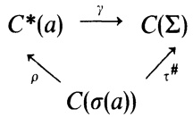

# VIII. C*-Algebras

# CHAPTER VIII

# $C^*$-Algebras

A $C^*$-algebra is a particular type of Banach algebra that is intimately connected with the theory of operators on a Hilbert space. If $\mathcal H$ is a Hilbert space, then $\mathcal B(\mathcal H)$ is an example of a $C^*$-algebra. Moreover, if $\mathcal A$ is any $C^*$-algebra, then it is isomorphic to a subalgebra of $\mathcal B(\mathcal H)$ (see Section 5). Some of the general theory developed in this chapter will be used in the next chapter to prove the Spectral Theorem, which reveals the structure of normal operators.

A more thorough treatment of $C^*$-algebras is available in Arveson [1976] or Sakai [1971].

## §1. Elementary Properties and Examples

If $\mathcal A$ is a Banach algebra, an *involution* is a map $a\mapsto a^*$ of $\mathcal A$ into $\mathcal A$ such that the following properties hold for $a$ and $b$ in $\mathcal A$ and $\alpha$ in $\mathbb C$:

(i) $(a^*)^*=a$;  
(ii) $(ab)^*=b^*a^*$;  
(iii) $(\alpha a+b)^*=\bar\alpha a^*+b^*$.

Note that if $\mathcal A$ has involution and an identity, then $1^*\cdot a=(1^*\cdot a)^{**}=(a^*\cdot1)^*=(a^*)^*=a$; similarly, $a\cdot1^*=a$. Since the identity is unique, $1^*=1$. Also, for any $\alpha$ in $\mathbb C$, $\alpha^*=\bar\alpha$.

**1.1. Definition.** A $C^*$-algebra is a Banach algebra $\mathcal A$ with an involution such that for every $a$ in $\mathcal A$,

$$
\|a^*a\|=\|a\|^2.
$$

**1.2. Example.** If $\mathcal H$ is a Hilbert space, $\mathcal A=\mathcal B(\mathcal H)$ is a $C^*$-algebra where for each $A$ in $\mathcal B(\mathcal H)$, $A^*=$ the adjoint of $A$. (See Proposition II.2.7.)

**1.3. Example.** If $\mathcal H$ is a Hilbert space, $\mathcal B_0(\mathcal H)$ is a $C^*$-subalgebra of $\mathcal B(\mathcal H)$, though $\mathcal B_0(\mathcal H)$ does not have an identity if $\mathcal H$ is infinite dimensional.

**1.4. Example.** If $X$ is a compact space, $C(X)$ is a $C^*$-algebra where $f^*(x)=\overline{f(x)}$ for $f$ in $C(X)$ and $x$ in $X$.

**1.5. Example.** If $(X,\Omega,\mu)$ is a $\sigma$-finite measure space, $L^\infty(X,\Omega,\mu)$ is a $C^*$-algebra where the involution is defined as in (1.4).

**1.6. Example.** If $X$ is locally compact but not compact, $C_0(X)$ is a $C^*$-algebra without identity.

**1.7. Proposition.** *If $\mathcal A$ is a $C^*$-algebra and $a\in\mathcal A$, then $\|a^*\|=\|a\|$.*

**Proof.** Note that $\|a\|^2=\|a^*a\|\leqslant\|a^*\|\|a\|$; so $\|a\|\leqslant\|a^*\|$. Since $a=a^{**}$, substituting $a^*$ for $a$ in this inequality gives $\|a^*\|\leqslant\|a\|$. $\blacksquare$

**1.8. Proposition.** *If $\mathcal A$ is a $C^*$-algebra and $a\in\mathcal A$, then*
$$
\begin{aligned}
\|a\|&=\sup\{\|ax\|:x\in\mathcal A,\ \|x\|\leqslant 1\}\\
&=\sup\{\|xa\|:x\in\mathcal A,\ \|x\|\leqslant 1\}.
\end{aligned}
$$

**Proof.** Let $\alpha=\sup\{\|ax\|:x\in\mathcal A,\ \|x\|\leqslant 1\}$. Then $\|ax\|\leqslant\|a\|\|x\|$ for any $x$ in $\mathcal A$; hence $\alpha\leqslant\|a\|$. If $x=a^*/\|a\|$, then $\|x\|=1$ by the preceding proposition. For this $x$, $\|ax\|=\|a\|$, so $\alpha=\|a\|$. The proof of the other equality is similar. $\blacksquare$

This last proposition has an alternative formulation that is useful. If $a\in\mathcal A$, define $L_a:\mathcal A\to\mathcal A$ by $L_a(x)=ax$. By (1.8), $L_a\in\mathcal B(\mathcal A)$ and $\|L_a\|=\|a\|$. If $\rho:\mathcal A\to\mathcal B(\mathcal A)$ is defined by $\rho(a)=L_a$, then $\rho$ is a homomorphism and an isometry. That is, $\mathcal A$ is isometrically isomorphic to a subalgebra of $\mathcal B(\mathcal A)$. The map $\rho$ is called the *left regular representation* of $\mathcal A$.

The left regular representation can be used to discuss the process of adjoining an identity to $\mathcal A$. Since $\mathcal A$ is isomorphic to a subalgebra $\mathcal B(\mathcal A)$ and $\mathcal B(\mathcal A)$ has an identity, why not just look at the subalgebra of $\mathcal B(\mathcal A)$ generated by $\mathcal A$ and the identity operator? Why not, indeed. This is just what is done below.

If $\mathcal A$ and $\mathcal C$ are Banach algebras and $\nu:\mathcal A\to\mathcal C$, then $\nu$ is $*$-homomorphism if $\nu$ is an algebra homomorphism such that $\nu(a^*)=\nu(a)^*$ for all $a$ in $\mathcal A$.

**1.9. Proposition.** *If $\mathcal A$ is a $C^*$-algebra, then there is a $C^*$-algebra $\mathcal A_1$ with an identity such that $\mathcal A_1$ contains $\mathcal A$ as an ideal. If $\mathcal A$ does not have an identity, then $\mathcal A_1/\mathcal A$ is one dimensional. If $\mathcal C$ is a $C^*$-algebra with identity, and $\nu:\mathcal A\to\mathcal C$*

is a $*$-homomorphism, then $v_1:\mathcal A_1\to\mathcal C$, defined by $v_1(a+\alpha)=v(a)+\alpha$ for $a$ in $\mathcal A$ and $\alpha$ in $\mathbb C$, is a $*$-homomorphism.

**Proof.** It may be assumed that $\mathcal A$ does not have an identity. Let $\mathcal A_1=\{a+\alpha:a\in\mathcal A,\alpha\in\mathbb C\}$ ($a+\alpha$ is just a formal sum). Define multiplication and addition in the obvious way. Let $(a+\alpha)^*=a^*+\bar\alpha$ and define the norm on $\mathcal A_1$ by

$$
\|a+\alpha\|=\sup\{\|ax+\alpha x\|:x\in\mathcal A,\ \|x\|\leqslant1\}.
$$

Clearly, this is a norm on $\mathcal A_1$. It must be shown that $\|y^*y\|=\|y\|^2$ for every $y$ in $\mathcal A_1$.

Fix $a$ in $\mathcal A$ and $\alpha$ in $\mathbb C$. If $\varepsilon>0$, then there is an $x$ in $\mathcal A$ such that $\|x\|\leqslant1$ and

$$
\begin{aligned}
\|a+\alpha\|^2-\varepsilon
&<\|ax+\alpha x\|^2
 =\|(x^*a^*+\bar\alpha x^*)(ax+\alpha x)\|\\
&=\|x^*(a+\alpha)^*(a+\alpha)x\|
 \leqslant\|(a+\alpha)^*(a+\alpha)\|.
\end{aligned}
$$

Thus $\|a+\alpha\|^2\leqslant\|(a+\alpha)^*(a+\alpha)\|$.

It is left to the reader to prove that the norm on $\mathcal A_1$ makes $\mathcal A_1$ a Banach algebra. For the other inequality, note that $\|(a+\alpha)^*(a+\alpha)\|\leqslant\|(a+\alpha)^*\|\|a+\alpha\|$. So the proof will be complete if it can be shown that $\|(a+\alpha)^*\|\leqslant\|a+\alpha\|$. Now if $x,y\in\mathcal A$ and $\|x\|,\|y\|\leqslant1$, then $\|y(a+\alpha)^*x\|=\|ya^*x+\bar\alpha yx\|=\|x^*ay^*+\alpha x^*y^*\|=\|x^*(a+\alpha)y^*\|\leqslant\|a+\alpha\|$. Taking the supremum over all such $x,y$ gives the desired inequality.

It remains to prove the statement concerning the $*$-homomorphism $v$, that $v(a^*)=v(a)^*$. The details are left to the reader. $\blacksquare$

If $\mathcal A$ is a $C^*$-algebra with identity and $a\in\mathcal A$, then $\sigma(a)$, the spectrum of $a$, is well defined. If $\mathcal A$ does not have an identity, $\sigma(a)$ is defined as the spectrum of $a$ as an element of the $C^*$-algebra $\mathcal A_1$ obtained in Proposition 1.9.

**1.10. Definition.** If $\mathcal A$ is a $C^*$-algebra and $a\in\mathcal A$, then (a) $a$ is *hermitian* if $a=a^*$; (b) $a$ is *normal* if $a^*a=aa^*$; (c) $a$ is *unitary* if $a^*a=aa^*=1$ (this only makes sense if $\mathcal A$ has an identity).

**1.11. Proposition.** *Let $\mathcal A$ be a $C^*$-algebra and let $a\in\mathcal A$.*

(a) *If $a$ is invertible, then $a^*$ is invertible and $(a^*)^{-1}=(a^{-1})^*$.*

(b) *$a=x+iy$ where $x$ and $y$ are hermitian elements of $\mathcal A$.*

(c) *If $u$ is a unitary element of $\mathcal A$, $\|u\|=1$.*

(d) *If $\mathcal B$ is a $C^*$-algebra and $\rho:\mathcal A\to\mathcal B$ is a $*$-homomorphism, then $\|\rho(a)\|\leqslant\|a\|$.*

(e) *If $a=a^*$, then $\|a\|=r(a)$.*

**Proof.** The proofs of (a), (b), and (c) are left as exercises.

(e) Since $a^*=a$, $\|a^2\|=\|a^*a\|=\|a\|^2$; by induction, $\|a^{2^n}\|=\|a\|^{2^n}$ for $n\geqslant1$. That is, $\|a^{2^n}\|^{1/2^n}=\|a\|$ for $n\geqslant1$. Hence $r(a)=\lim\|a^{2^n}\|^{1/2^n}=\|a\|$.

(d) If $\mathcal A$ has an identity, it is not assumed that $\rho(1)=$ the identity of $\mathcal B$. However, it is easy to see that $\rho(1)$ is the identity for $\operatorname{cl}\rho(\mathcal A)$. If $\mathcal A$ does not have an identity, then $\rho$ can be extended to a $*$-homomorphism $\rho_1:\mathcal A_1\to\mathcal B_1$

such that $\rho_1(1)=1$ (1.9). Thus it suffices to prove the proposition under the additional assumption that $\mathcal A$ and $\mathcal B$ have identities and $\rho(1)=1$.

If $x\in\mathcal A$, then it follows that $\sigma(\rho(x))\subseteq\sigma(x)$ (Verify!) and hence $r(\rho(x))\leq r(x)$. So, using part (e) and the fact that $a^*a$ is hermitian, $\|\rho(a)\|^2=\|\rho(a^*a)\|=r(\rho(a^*a))\leq r(a^*a)=\|a^*a\|=\|a\|^2$. ■

**1.12. Proposition.** *If $\mathcal A$ is a $C^*$-algebra and $h:\mathcal A\to\mathbb C$ is a non-zero homomorphism, then:*

(a) $h(a)\in\mathbb R$ whenever $a=a^*$;

(b) $h(a^*)=\overline{h(a)}$ for all $a$ in $\mathcal A$;

(c) $h(a^*a)\geq 0$ for all $a$ in $\mathcal A$;

(d) if $1\in\mathcal A$ and $u$ is unitary, then $|h(u)|=1$.

**Proof.** If $\mathcal A$ has no identity, extend $h$ to $\mathcal A_1$ by letting $h(1)=1$. Thus, we may assume that $\mathcal A$ has an identity. By Exercise VII.8.1, $\|h\|=1$. If $a=a^*$ and $t\in\mathbb R$,

$$
\begin{aligned}
|h(a+it)|^2
&\leq \|a+it\|^2=\|(a+it)^*(a+it)\|\\
&=\|(a-it)(a+it)\|\\
&=\|a^2+t^2\|\leq\|a\|^2+t^2.
\end{aligned}
$$

If $h(a)=\alpha+i\beta$, $\alpha,\beta$ in $\mathbb R$, then this yields

$$
\begin{aligned}
\|a\|^2+t^2
&\geq|\alpha+i(\beta+t)|^2\\
&=\alpha^2+(\beta+t)^2\\
&=\alpha^2+\beta^2+2\beta t+t^2;
\end{aligned}
$$

hence $\|a\|^2\geq\alpha^2+\beta^2+2\beta t$ for all $t$ in $\mathbb R$. If $\beta\neq 0$, then letting $t\to\pm\infty$, depending on the sign of $\beta$, gives a contradiction. Therefore $\beta=0$ or $h(a)\in\mathbb R$. This proves (a).

Let $a=x+iy$, where $x$ and $y$ are hermitian. Since $h(x),h(y)\in\mathbb R$ by (a) and $a^*=x-iy$, (b) follows. Also, $h(a^*a)=h(a^*)h(a)=|h(a)|^2\geq 0$, so (c) holds. Finally, if $u$ is unitary, $|h(u)|^2=h(u^*)h(u)=h(u^*u)=h(1)=1$. ■

Note that part (b) of the preceding proposition implies that any homomorphism $h:\mathcal A\to\mathbb C$ is a $*$-homomorphism. This, coupled with (VII.8.6), gives the following corollary.

**1.13. Corollary.** *If $\mathcal A$ is an abelian $C^*$-algebra and $a$ is a hermitian element of $\mathcal A$, then $\sigma(a)\subseteq\mathbb R$.*

This corollary is short-lived as the conclusion remains valid even if $\mathcal A$ is not abelian.

**1.14. Proposition.** *Let $\mathcal A$ and $\mathcal B$ be $C^*$-algebras with a common identity and norm such that $\mathcal A\subseteq\mathcal B$. If $a\in\mathcal A$, then $\sigma_{\mathcal A}(a)=\sigma_{\mathcal B}(a)$.*

**PROOF.** First assume that $a$ is hermitian and let $\mathcal C=C^*(a)$, the $C^*$-algebra generated by $a$ and $1$. So $\mathcal C$ is abelian. By Corollary 1.13 $\sigma_{\mathcal C}(a)\subseteq\mathbb R$. By Theorem VII.5.4, $\sigma_{\mathcal A}(a)\subseteq\sigma_{\mathcal C}(a)=\partial\sigma_{\mathcal C}(a)\subseteq\sigma_{\mathcal A}(a)$; so $\sigma_{\mathcal A}(a)=\sigma_{\mathcal C}(a)\subseteq\mathbb R$. By similar reasoning, $\sigma_{\mathcal B}(a)=\sigma_{\mathcal C}(a)$, and hence $\sigma_{\mathcal A}(a)=\sigma_{\mathcal B}(a)$.

Now let $a$ be arbitrary. It suffices to show that if $a$ is invertible in $\mathcal B$, $a$ is invertible in $\mathcal A$. So suppose there is a $b$ in $\mathcal B$ such that $ab=ba=1$. Thus, $(a^*a)(bb^*)=(bb^*)(a^*a)=1$. Since $a^*a$ is hermitian, the first part of the proof implies $a^*a$ is invertible in $\mathcal A$. But inverses are unique, so $bb^*=(a^*a)^{-1}\in\mathcal A$. Hence $b=b(b^*a^*)=(bb^*)a^*\in\mathcal A$. ■

This result must, of course, be contrasted with Theorem VII.5.4.

## EXERCISES

1. Verify the statements made in Examples 1.2 through 1.6.

2. Let $\mathcal A=\{f\in C(\operatorname{cl}\mathbb D): f\text{ is analytic in }\mathbb D\}$ and for $f$ in $\mathcal A$ define $f^*$ by $f^*(z)=\overline{f(\bar z)}$. Show that $\mathcal A$ is a Banach algebra, $f^*\in\mathcal A$ when $f\in\mathcal A$, and $\|f^*\|=\|f\|$, but $\mathcal A$ is not a $C^*$-algebra.

3. If $\{\mathcal A_i:i\in I\}$ is a collection of $C^*$-algebras, show that $\bigoplus_\infty\mathcal A_i$ and $\bigoplus_0\mathcal A_i$ are $C^*$-algebras.

4. Let $X$ be a locally compact space and let $\mathcal A$ be a $C^*$-algebra. If $C_b(X,\mathcal A)=$ the collection of bounded continuous functions from $X\to\mathcal A$, show that $C_b(X,\mathcal A)$ is a $C^*$-algebra. Let $C_0(X,\mathcal A)=$ all of the continuous functions $f:X\to\mathcal A$ such that for every $\varepsilon>0$, $\{x\in X:\|f(x)\|\geq\varepsilon\}$ is compact. Show that $C_0(X,\mathcal A)$ is a $C^*$-algebra.

## §2. Abelian $C^*$-Algebras and the Functional Calculus in $C^*$-Algebras

<!-- BEGIN BACKGROUND BG-VIII.block1 -->

### Definition BG-VIII.1 — Uniform convergence and approximation algebras

For functions on a set $K$, $f_n\to f$ **uniformly** means that for every $\varepsilon>0$ there is one $n_0$ such that $|f_n(x)-f(x)|<\varepsilon$ for every $x\in K$ and $n\geq n_0$. Equivalently, $\|f_n-f\|_\infty\to0$. Pointwise convergence permits $n_0$ to depend on $x$ and is strictly weaker: $x^n$ on $[0,1]$ converges pointwise to a discontinuous function. An algebra of functions **separates points** if each distinct pair $x,y$ is distinguished by some member of the algebra.

### Lemma BG-VIII.2 — Uniform limits, completeness, and closed isometric images

A uniform limit of continuous functions is continuous. Consequently $C(K)$ is complete in the supremum norm when $K$ is compact. An isometry from a Banach space into a normed space has closed image.

**Proof.** Given $x$ and $\varepsilon>0$, choose $n$ with $\|f_n-f\|_\infty<\varepsilon/3$ and a neighborhood on which $|f_n(y)-f_n(x)|<\varepsilon/3$. The triangle inequality proves continuity of $f$. A uniformly Cauchy sequence has a pointwise limit by completeness of $\mathbb C$; letting the second index tend to infinity in its Cauchy estimate proves uniform convergence. Finally, if $Tx_n\to y$ and $T$ is an isometry, $x_n$ is Cauchy and converges to $x$; continuity gives $y=Tx$. $\square$

### Theorem BG-VIII.3 — The complex Stone–Weierstrass theorem

If $K$ is compact Hausdorff and $\mathcal A\subset C(K,\mathbb C)$ is an algebra containing the constants, separating points, and closed under conjugation, then its uniform closure is $C(K,\mathbb C)$.

**Proof.** First recall polynomial approximation on a real compact interval. For $h\in C[0,1]$, the Bernstein polynomial is $B_nh(t)=\sum_{k=0}^nh(k/n)\binom nk t^k(1-t)^{n-k}$. Its nonnegative weights sum to one and satisfy $\sum(k/n-t)^2\binom nk t^k(1-t)^{n-k}=t(1-t)/n$. Uniform continuity of $h$ gives, after splitting $|k/n-t|<\delta$ and its complement,
$$
|B_nh(t)-h(t)|\leq\varepsilon+2\|h\|_\infty/(4n\delta^2).
$$
Thus these polynomials converge uniformly; rescaling proves the interval assertion.

Let $\mathcal R$ be the uniform closure of the real-valued part of $\mathcal A$. Polynomial approximation of $|t|$ on an interval containing the range of $u\in\mathcal R$ implies $|u|\in\mathcal R$. Hence $\mathcal R$ is closed under finite maxima and minima, using $\max(u,v)=(u+v+|u-v|)/2$. Conjugation ensures that real or imaginary parts of a separating function separate each pair, so for every $x,y$ and real continuous $f$ there is $u_{x,y}\in\mathcal R$ taking the values $f(x),f(y)$ at those points (use an affine function of a separator; a constant handles $x=y$).

Fix $x$ and $\varepsilon>0$. The open sets where $u_{x,y}>f-\varepsilon$ cover $K$; take a finite subcover and their maximum $g_x$. Then $g_x>f-\varepsilon$ everywhere and $g_x(x)=f(x)$. The sets where $g_x<f+\varepsilon$ cover $K$ as $x$ varies. Take a finite subcover and its corresponding minimum $g$. We obtain $f-\varepsilon<g<f+\varepsilon$ everywhere. Thus every real continuous $f$ lies in $\mathcal R$. Applying this to real and imaginary parts proves the theorem. $\square$

In the next proof, Lemma BG-VIII.2 supplies **closed range** and Theorem BG-VIII.3 supplies **dense range**. Both are necessary. On $K\subset\mathbb C$, polynomials in $z$ and $\bar z$ satisfy the theorem; polynomials in $z$ alone need not.
<!-- END BACKGROUND BG-VIII.block1 -->

The next theorem is the basic result of this section. It will be used to develop a functional calculus for normal elements that extends the Riesz Functional Calculus.

**2.1. Theorem.** *If $\mathcal A$ is an abelian $C^*$-algebra with identity and $\Sigma$ is its maximal ideal space, then the Gelfand transform $\gamma:\mathcal A\to C(\Sigma)$ is an isometric $*$-isomorphism of $\mathcal A$ onto $C(\Sigma)$.*

**PROOF.** By Theorem VII.8.9, $\|\hat x\|_\infty\leq\|x\|$ for every $x$ in $\mathcal A$. But $\|\hat x\|_\infty$ is the spectral radius of $x$, so by (1.11e), $\|x\|=\|\hat x\|_\infty$ for every hermitian element $x$ of $\mathcal A$. In particular, $\|x^*x\|=\|\widehat{x^*x}\|_\infty$ for every $x$ in $\mathcal A$.

If $a\in\mathcal A$ and $h\in\Sigma$, then $\widehat{a^*}(h)=h(a^*)=\overline{h(a)}=\overline{\hat a(h)}$. That is, $\widehat{a^*}=\overline{\hat a}$. Equivalently, $\gamma(a^*)=\gamma(a)^*$ since the involution on $C(\Sigma)$ is defined by complex conjugation. Thus, $\gamma$ is a $*$-homomorphism. Also, $\|a\|^2=\|a^*a\|=\|\widehat{a^*a}\|_\infty=\||\hat a|^2\|_\infty=\|\hat a\|_\infty^2$; therefore $\|a\|=\|\hat a\|_\infty$ and $\gamma$ is an isometry.

Because $\gamma$ is an isometry, it has closed range. To show that $\gamma$ is surjective, therefore, it suffices to show that it has dense range. This is accomplished by applying the Stone–Weierstrass Theorem. Note that $\hat{1}=1$, so $\gamma(\mathcal A)$ is a subalgebra of $C(\Sigma)$ containing the constants. Because $\gamma$ preserves the involution, $\gamma(\mathcal A)$ is closed under complex conjugation. It remains to show that $\gamma(\mathcal A)$ separates the points of $\Sigma$. But if $h_1$ and $h_2$ are distinct homomorphisms in $\Sigma$, they are distinct because there is an $a$ in $\mathcal A$ such that $h_1(a)\ne h_2(a)$. Hence $\hat a(h_1)\ne\hat a(h_2)$. $\blacksquare$

By combining the preceding theorem with Proposition 1.9 and Exercise VII.8.6, the following is obtained.

**2.2. Corollary.** *If $\mathcal A$ is an abelian $C^*$-algebra without identity and $\Sigma$ is its maximal ideal space, then the Gelfand transform $\gamma:\mathcal A\to C_0(\Sigma)$ is an isometric $*$-isomorphism of $\mathcal A$ onto $C_0(\Sigma)$.*

In order to focus our attention on the key concepts and not be distracted by peripheral considerations, we now make the following.

**Assumption.** *All $C^*$-algebras that are considered have an identity.*

Let $\mathcal B$ be an arbitrary $C^*$-algebra and let $a$ be a normal element of $\mathcal B$. So if $\mathcal A=C^*(a)$, the $C^*$-algebra generated by $a$ (and 1), $\mathcal A$ is abelian. Hence $\mathcal A\cong C(\Sigma)$, where $\Sigma$ is the maximal ideal space of $\mathcal A$. So by Theorem 2.1 if $f\in C(\Sigma)$, there is a unique element $x$ of $\mathcal A$ such that $\hat x=f$. We want to think of $x$ as $f(a)$ and thus define a functional calculus for normal elements of a $C^*$-algebra. To be useful, however, we should have a ready way of identifying $\Sigma$. Moreover, since $\mathcal A=C^*(a)$ and thus depends on $a$, it should be that $\Sigma$ depends on $a$ in a clear way. The idea embodied in Proposition VII.8.10 that $\Sigma$ and $\sigma(a)$ are homeomorphic via a natural map is the key here, although (VII.8.10) is not directly applicable here since $a$ is not a generator of $C^*(a)$ as a Banach algebra but only as a $C^*$-algebra. [If $a=a^*$, then $a$ is a generator of $C^*(a)$ as a Banach algebra.] Nevertheless the result is true.

**2.3. Proposition.** *If $\mathcal A$ is an abelian $C^*$-algebra with maximal ideal space $\Sigma$ and $a\in\mathcal A$ such that $\mathcal A=C^*(a)$, then the map $\tau:\Sigma\to\sigma(a)$ defined by $\tau(h)=h(a)$ is a homeomorphism. If $p(z,\bar z)$ is a polynomial in $z$ and $\bar z$ and $\gamma:\mathcal A\to C(\Sigma)$ is the Gelfand transform, then $\gamma(p(a,a^*))=p\circ\tau$.*

The proof of this result follows, with a few variations, along the lines of the proof of Proposition VII.8.10 and is left to the reader.

If $\tau:\Sigma\to\sigma(a)$ is defined as in the preceding proposition, then $\tau^\#:C(\sigma(a))\to C(\Sigma)$ is defined by $\tau^\#(f)=f\circ\tau$. Note that $\tau^\#$ is a $*$-isomorphism and an isometry, because $\tau$ is a homeomorphism. Note that $\mathcal A=C^*(a)$ is the closure of $\{p(a,a^*):p(z,\bar z)\text{ is a polynomial in }z\text{ and }\bar z\}$. Now such a polynomial $p(z,\bar z)$

is, of course, a function on $\sigma(a)$. [Just evaluate the polynomial at any $z$ in $\sigma(a)$.] The last part of (2.3) says that $\gamma(p(a,a^*))=\tau^\#(p)$. We define a map $\rho\colon C(\sigma(a))\to C^*(a)$ so that the following diagram commutes:

**2.4**
$$
\begin{array}{ccc}
C^*(a)&\xrightarrow{\gamma}&C(\Sigma)\\
{}_{\rho}\nwarrow&&\nearrow_{\tau^\#}\\
&C(\sigma(a))&
\end{array}
$$

Note that if $\mathcal B$ is any $C^*$-algebra and $a$ is a normal element of $\mathcal B$, then $\mathcal A=C^*(a)$ is an abelian $C^*$-algebra contained in $\mathcal B$ and so (2.4) applies. Moreover, in light of Proposition 1.14, the spectrum of $a$ does not depend on whether $a$ is considered as an element of $\mathcal A$ or $\mathcal B$. The following definition is, therefore, unambiguous.

**2.5. Definition.** If $\mathcal B$ is a $C^*$-algebra with identity and $a$ is a normal element of $\mathcal B$, let $\rho\colon C(\sigma(a))\to C^*(a)\subseteq\mathcal B$ be as in (2.4). If $f\in C(\sigma(a))$ define

$$
f(a)\equiv\rho(f).
$$

The map $f\mapsto f(a)$ of $C(\sigma(a))\to\mathcal B$ is called the *functional calculus for $a$*.

Note that if $p(z,\bar z)$ is a polynomial in $z$ and $\bar z$, then $\rho(p(z,\bar z))=p(a,a^*)$. In particular, $\rho(z^n\bar z^m)=a^na^{*m}$ so that $\rho(z)=a$ and $\rho(\bar z)=a^*$. Also, $\rho(1)=1$.

The properties of this functional calculus can be obtained from the fact that $\rho$ is an isometric $*$-isomorphism of $C(\sigma(a))$ into $\mathcal B$—with one exception. How does this functional calculus compare with the Riesz Functional Calculus? If $f\in\operatorname{Hol}(a)$, $f|_{\sigma(a)}\in C(\sigma(a))$; so $f(a)$ has two possible interpretations. Or does it?

**2.6. Theorem.** *If $\mathcal B$ is a $C^*$-algebra and $a$ is a normal element of $\mathcal B$, then the functional calculus has the following properties.*

(a) *$f\mapsto f(a)$ is a $*$-monomorphism.*

(b) $\|f(a)\|=\|f\|_\infty$.

(c) *$f\mapsto f(a)$ is an extension of the Riesz Functional Calculus.*

*Moreover, the functional calculus is unique in the sense that if $\tau\colon C(\sigma(a))\to C^*(a)$ is a $*$-homomorphism that extends the Riesz Functional Calculus, then $\tau(f)=f(a)$ for every $f$ in $C(\sigma(a))$.*

**Proof.** Let $\rho\colon C(\sigma(a))\to C^*(a)$ be the map defined by $\rho(f)=f(a)$. From (2.4), (a) and (b) are immediate.

Let $\pi\colon\operatorname{Hol}(a)\to\mathcal A\subseteq\mathcal B$ denote the map defined by the Riesz Functional Calculus. Since $\rho(z)=\pi(z)=a$, an algebraic manipulation gives that $\rho(f)=\pi(f)$ for every rational function $f$ with poles off $\sigma(a)$. If $f\in\operatorname{Hol}(a)$, then by Runge’s Theorem there is a sequence $\{f_n\}$ of such rational functions such that $f_n(z)\to f(z)$ uniformly in a neighborhood of $\sigma(a)$. Thus $\pi(f_n)\to\pi(f)$. By (b), $\rho(f_n)\to\rho(f)$. Thus $\rho(f)=\pi(f)$.

To prove uniqueness, let $\tau\colon C(\sigma(a))\to\mathcal B$ be a $*$-homomorphism that extends

§2. Abelian $C^*$-Algebras and the Functional Calculus in $C^*$-Algebras 239

the Riesz Functional Calculus. If $f\in C(\sigma(a))$, then there is a sequence $\{p_n\}$ of polynomials in $z$ and $\bar z$ such that $p_n(z,\bar z)\to f(z)$ uniformly on $\sigma(a)$. But $\tau(p_n)=p_n(a,a^*)$, $\tau(p_n)\to\tau(f)$ (1.11d), and $p_n(a,a^*)\to f(a)$. Hence $\tau(f)=f(a)$. $\blacksquare$

Because of the uniqueness statement in the preceding theorem, it is not necessary to remember the form of the functional calculus $f\mapsto f(a)$, but only the fact that it is an isometric *-monomorphism that extends the Riesz Functional Calculus. Indeed, by the uniqueness of the Riesz Functional Calculus, it suffices to have that $f\mapsto f(a)$ is an isometric *-monomorphism such that if $f(z)\equiv 1$, then $f(a)=1$, and if $f(z)=z$, then $f(a)=a$. Any properties or applications of the functional calculus can be derived or justified using only these properties. There may, however, be an occasion when the precise form of the functional calculus [viz., (2.4)] facilitates a proof. There are also situations in which the definition of the functional calculus gets in the way of a proof and the properties in (2.6) give the clean way of applying this powerful tool.

**2.7. Spectral Mapping Theorem.** *If $\mathcal A$ is a $C^*$-algebra and $a$ is a normal element of $\mathcal A$, then for every $f$ in $C(\sigma(a))$,*

$$
\sigma(f(a))=f(\sigma(a)).
$$

**Proof.** Let $\rho\colon C(\sigma(a))\to C^*(a)$ be defined by $\rho(f)=f(a)$. So $\rho$ is a *-isomorphism. Hence $\sigma(f(a))=\sigma(\rho(f))=\sigma(f)$. But $\sigma(f)=f(\sigma(a))$ (VII.3.2). $\blacksquare$

Once again (1.14) was used implicitly in the preceding proof.

## Exercises

1. Prove a converse to Proposition 2.3. If $K$ is a compact subset of $\mathbb C$, $C(K)$ is a singly generated $C^*$-algebra.

2. If $\mathcal A$ is an abelian $C^*$-algebra with a finite number of $C^*$-generators $a_1,\ldots,a_n$, then there is a compact subset $X$ of $\mathbb C^n$ and an isometric *-isomorphism $\rho\colon\mathcal A\to C(X)$ such that $\rho(a_k)=z_k$, $1\leq k\leq n$, where $z_k(\lambda_1,\ldots,\lambda_n)=\lambda_k$ (see Exercise VII.8.12).

3. If $X$ is a compact Hausdorff space, show that $X$ is totally disconnected if and only if $C(X)$ is the closed linear span of its projections ($\equiv$ hermitian idempotents).

4. Using the terminology of Exercise 3, show that if $(X,\Omega,\mu)$ is a $\sigma$-finite measure space, the maximal ideal space of $L^\infty(X,\Omega,\mu)$ is totally disconnected.

5. If $\mathcal A$ is a $C^*$-algebra with identity and $a=a^*$, show that $\exp(ia)=u$ is unitary. Is the converse true?

6. Let $X$ be compact and fix a point $x_0$ in $X$. Let $\mathcal A=\{\{f_n\}: f_n\in C(X),\ \sup_n\|f_n\|<\infty,\text{ and }\{f_n(x_0)\}\text{ is a convergent sequence}\}$. Show that $\mathcal A$ is an abelian $C^*$-algebra with identity and find its maximal ideal space.

   
7. If $X$ is completely regular, then $C_b(X)$ is a $C^*$-algebra and its maximal ideal space is the Stone–Čech compactification of $X$.

## §3. The Positive Elements in a $C^*$-Algebra

<!-- BEGIN BACKGROUND BG-VIII.block2 -->

### Lemma BG-VIII.4 — Transferring scalar inequalities through functional calculus

For a normal element $a$, uniform convergence $f_n\to f$ on $\sigma(a)$ implies $f_n(a)\to f(a)$ in norm. For self-adjoint $a$ and real continuous $f\geq0$ on $\sigma(a)$, $f(a)=g(a)^*g(a)$ with $g=\sqrt f$. If $a\geq0$, this constructs its positive square root.

**Proof.** The isometry of the calculus gives $\|f_n(a)-f(a)\|=\|f_n-f\|_\infty$. The scalar square root is continuous on $[0,\infty)$, so $g$ is continuous and multiplicativity gives $g(a)^*g(a)=(\bar gg)(a)=f(a)$. Its spectrum is $f(\sigma(a))\subset[0,\infty)$ by the continuous spectral mapping theorem. Applied to $g$, this also makes $g(a)$ positive. Notice that this is continuous calculus, not selection of a holomorphic square-root branch on a complex neighborhood. $\square$
<!-- END BACKGROUND BG-VIII.block2 -->

This section is an application of the functional calculus developed in the preceding section. The results here are very useful in the study of operators on Hilbert space and they demonstrate the power of the functional calculus.

If $\mathscr{A}$ is a $C^*$-algebra, let $\operatorname{Re}\mathscr{A}$ denote the hermitian elements of $\mathscr{A}$.

**3.1. Definition.** If $\mathscr{A}$ is a $C^*$-algebra and $a\in\mathscr{A}$, then $a$ is *positive* if $a\in\operatorname{Re}\mathscr{A}$ and $\sigma(a)\subseteq[0,\infty)$. If $a$ is positive, this is denoted by $a\geq 0$. Let $\mathscr{A}_+$ be the set of all positive elements of $\mathscr{A}$.

**3.2. Example.** If $\mathscr{A}=C(X)$, then $f$ is positive in $\mathscr{A}$ if and only if $f(x)\geq 0$ for all $x$ in $X$.

**3.3. Example.** If $\mathscr{A}=L^\infty(\mu)$ and $f\in L^\infty(\mu)$, then $f\geq 0$ if and only if $f(x)\geq 0$ a.e. $[\mu]$.

**3.4. Proposition.** *If $a\in\operatorname{Re}\mathscr{A}$, then there are unique positive elements $u,v$ in $\mathscr{A}$ such that $a=u-v$ and $uv=vu=0$.*

**Proof.** Let $f(t)=\max(t,0)$, $g(t)=-\min(t,0)$. Then $f,g\in C(\mathbb{R})$ and $f(t)-g(t)=t$. Using the functional calculus, let $u=f(a)$ and $v=g(a)$. So $u$ and $v$ are hermitian and by the Spectral Mapping Theorem $u,v\geq 0$. Also, $u-v=f(a)-g(a)=a$ and $uv=vu=(gf)(a)=0$ since $fg\equiv 0$.

To show uniqueness, let $u_1,v_1\in\mathscr{A}_+$ such that $u_1-v_1=a$ and $u_1v_1=v_1u_1=0$. Let $\{p_n\}$ be a sequence of polynomials such that $p_n(0)=0$ for all $n$ and $p_n(t)\to f(t)$ uniformly on $\sigma(a)$. Hence $p_n(a)\to u$ in $\mathscr{A}$. But $u_1a=au_1$. So $u_1p_n(a)=p_n(a)u_1$ for all $n$; hence $u_1u=uu_1$. Similarly, it follows that $a,u,v,u_1$, and $v_1$ are pairwise commuting hermitian elements of $\mathscr{A}$. Let $\mathscr{B}=$ the $C^*$-algebra generated by $a,u,v,u_1$, and $v_1$; so $\mathscr{B}$ is abelian. Hence $\mathscr{B}\cong C(\Sigma)$ where $\Sigma$ is the maximal ideal space of $\mathscr{B}$. The uniqueness now follows from the uniqueness statement for $C(\Sigma)$ (Exercise 1). $\blacksquare$

The next result follows in a similar way.

**3.5. Proposition.** *If $a\in\mathscr{A}_+$ and $n\geq 1$, there is a unique element $b$ in $\mathscr{A}_+$ such that $a=b^n$.*

The decomposition $a=u-v$ of a hermitian element $a$ is sometimes called the orthogonal decomposition of $a$. The elements $u$ and $v$ are called the

positive and negative parts of $a$ and are denoted by $u=a_+$ and $v=a_-$. Note that $a_-\geq 0$.

If $a\in\mathcal A_+$, then the unique $b$ obtained in (3.5) is called the $n$th root of $a$ and is denoted by $b=a^{1/n}$. Note that if $b$ is not assumed to be positive, it is not necessarily unique (see Exercise 5).

If $X$ is compact and $f\in C(X)_+$, then notice that $|f(x)-t|\leq t$ for every real number $t\geq\|f\|$. Conversely, if $|f(x)-t|\leq t$ for some $t\geq\|f\|$, then $f(x)\geq 0$ for all $x$ and so $f\geq 0$. These observations are behind some of the statements in the next result.

**3.6. Theorem.** *If $\mathcal A$ is a $C^*$-algebra and $a\in\mathcal A$, then the following statements are equivalent.*

(a) $a\geq 0$.

(b) $a=b^2$ for some $b$ in $\operatorname{Re}\mathcal A$.

(c) $a=x^*x$ for some $x$ in $\mathcal A$.

(d) $a=a^*$ and $\|t-a\|\leq t$ for all $t\geq\|a\|$.

(e) $a=a^*$ and $\|t-a\|\leq t$ for some $t\geq\|a\|$.

**Proof.** It is clear that (b) implies (c) and (d) implies (e). By (3.5), (a) implies (b).

(e)$\Rightarrow$(a): Since $a=a^*$, $C^*(a)$ is abelian. If $X=\sigma(a)$, $X\subseteq\mathbb R$ and $f\mapsto f(a)$ is a $*$-isomorphism of $C(X)$ onto $C^*(a)$. Using this isomorphism and (e), $|t-x|\leq t$ for some $t\geq\|a\|=\sup\{|s|:s\in X\}$ and all $x$ in $X$. From the discussions preceding this theorem (with $f(x)=x$), $x\geq 0$ for all $x$ in $X$. That is, $X=\sigma(a)\subseteq[0,\infty)$. Hence $a\geq 0$.

(a)$\Rightarrow$(d): This proof follows the lines of the preceding paragraph and is left to the reader.

(c)$\Rightarrow$(a): If $a=x^*x$ for some $x$ in $\mathcal A$, then it is clear that $a=a^*$. Let $a=u-v$, where $u,v\geq 0$ and $uv=vu=0$. It must be shown that $v=0$.

If $xv^{1/2}=b+ic$, where $b,c\in\operatorname{Re}\mathcal A$, then $(xv^{1/2})^*(xv^{1/2})=(b-ic)(b+ic)=b^2+c^2+i(bc-cb)$. But also $(xv^{1/2})^*(xv^{1/2})=v^{1/2}x^*xv^{1/2}=v^{1/2}(u-v)v^{1/2}=-v^2$. Hence $i(bc-cb)=-v^2-b^2-c^2$. By Proposition 3.7 below, $i(bc-cb)\leq 0$. Also $(xv^{1/2})^*(xv^{1/2})=-v^2\leq 0$ because (a) and (b) are equivalent. By Exercise VII.3.7, $(xv^{1/2})(xv^{1/2})^*\leq 0$. Put $(xv^{1/2})(xv^{1/2})^*=-y$, where $y\in\mathcal A_+$. So $-y=(b+ic)(b-ic)=b^2+c^2-i(bc-cb)$. Hence $i(bc-cb)=b^2+c^2+y\in\mathcal A_+$ by (3.7). Therefore $i(bc-cb)\in(-\mathcal A_+)\cap\mathcal A_+=(0)$. But this implies that $-v^2=(xv^{1/2})^*(xv^{1/2})=b^2+c^2\in(-\mathcal A_+)\cap\mathcal A_+$, so that $v^2=0$. But $v\leq 0$ so $v=0$. That is, $a=u\geq 0$. $\blacksquare$

The next result will be proved only using the equivalence of (a), (d), and (e) from the preceding theorem.

**3.7. Proposition.** *If $\mathcal A$ is a $C^*$-algebra, then $\mathcal A_+$ is a closed cone.*

**Proof.** Let $\{a_n\}\subseteq\mathcal A_+$ and suppose $a_n\to a$. Clearly $a\in\operatorname{Re}\mathcal A$. By (3.6d), $\|a_n-\|a_n\|\|\leq\|a_n\|$. Hence $\|a-\|a\|\|\leq\|a\|$, so by (3.6e), $a\geq 0$.

Clearly, $\lambda a\geq 0$ if $a\geq 0$ and $\lambda\geq 0$. Let $a,b\in\mathcal A_+$; it must be shown that $a+b\geq 0$. It suffices to assume that $\|a\|,\|b\|\leq 1$. But $\|1-\frac12(a+b)\|=\frac12\|(1-a)+(1-b)\|\leq 1$ by (3.6d). So by (3.6e), $\frac12(a+b)\geq 0$.

If $a\in\mathcal A_+\cap(-\mathcal A_+)$, then $a=a^*$ and $\sigma(a)=\{0\}$. But $\|a\|=r(a)$ (1.11e). ■

Now to look at one more example—a very important one.

**3.8. Theorem.** *If $\mathcal H$ is a Hilbert space and $A\in\mathcal B(\mathcal H)$, then $A\geq 0$ if and only if $\langle Ah,h\rangle\geq 0$ for all $h$ in $\mathcal H$.*

**PROOF.** If $A\geq 0$, then (3.6c) $A=T^*T$ for some $T$ in $\mathcal B(\mathcal H)$. Hence $\langle Ah,h\rangle=\|Th\|^2\geq 0$. Conversely, suppose $\langle Ah,h\rangle\geq 0$ for all $h$ in $\mathcal H$. By (II.2.12), $A=A^*$. It remains to show that $\sigma(A)\subseteq[0,\infty)$. If $h\in\mathcal H$ and $\lambda<0$, then

$$
\begin{aligned}
\|(A-\lambda)h\|^2
&=\|Ah\|^2-2\lambda\langle Ah,h\rangle+\lambda^2\|h\|^2\\
&\geq-2\lambda\langle Ah,h\rangle+\lambda^2\|h\|^2
\geq\lambda^2\|h\|^2
\end{aligned}
$$

since $\lambda<0$ and $\langle Ah,h\rangle\geq 0$. By (VII.6.4), $\lambda\notin\sigma_{ap}(A)$. But this implies that $A-\lambda$ is left invertible (Exercise VII.6.5). Since $A-\lambda$ is self-adjoint, $A-\lambda$ is also right invertible. Thus $\lambda\notin\sigma(A)$ and $A\geq 0$. ■

**3.9. Definition.** If $\mathcal A$ is a $C^*$-algebra and $a,b\in\operatorname{Re}\mathcal A$, then $a\leq b$ if $b-a\in\mathcal A_+$.

This ordering makes a $C^*$-algebra as well as $\operatorname{Re}a$ into ordered vector spaces.

Note that if $A$ and $B$ are hermitian operators on the Hilbert space $\mathcal H$, then $A\leq B$ if and only if $\langle Ah,h\rangle\leq\langle Bh,h\rangle$ for all $h$ in $\mathcal H$.

This section closes with an application of positivity to obtain the polar decomposition of an operator. If $\lambda\in\mathbb C$, then $\lambda=|\lambda|e^{i\theta}$ for some $\theta$; this is the polar decomposition of $\lambda$. Can an analogue be found for operators? To answer this question we might first ask what is the analogue of $|\lambda|$ and $e^{i\theta}$ among operators. If $A\in\mathcal B(\mathcal H)$, then the proper definition for $|A|$ would seem to be $|A|\equiv(A^*A)^{1/2}$ [see (3.5)]. How about an analogue of $e^{i\theta}$? Should it be a unitary operator? An isometry? For an arbitrary operator neither of these is appropriate. The following new class of operators is needed.

**3.10. Definition.** A *partial isometry* is an operator $W$ such that for $h$ in $(\ker W)^\perp$, $\|Wh\|=\|h\|$. The space $(\ker W)^\perp$ is called the *initial space* of $W$ and the space $\operatorname{ran}W$ is called the *final space* of $W$. See Exercises 15–20 for more on partial isometries.

**3.11. Polar Decomposition.** *If $A\in\mathcal B(\mathcal H)$, then there is a partial isometry $W$ with $(\ker A)^\perp$ as its initial space and $\operatorname{cl}(\operatorname{ran}A)$ as its final space such that $A=W|A|$. Moreover, if $A=UP$ where $P\geq 0$ and $U$ is a partial isometry with $\ker U=\ker P$, then $P=|A|$ and $U=W$.*

**PROOF.** If $h\in\mathcal H$, then $\|Ah\|^2=\langle Ah,Ah\rangle=\langle A^*Ah,h\rangle=\langle |A|h,|A|h\rangle$. Thus

$$
\tag{3.12}
\|Ah\|^2=\||A|h\|^2.
$$

Since $(\operatorname{ran}A^*)^\perp=\ker A$, $\operatorname{ran}A^*$ is dense in $(\ker A)^\perp$. If $f\in\operatorname{ran}A^*$, $f=A^*g$ for $g$ in $(\ker A^*)^\perp=\operatorname{cl}\operatorname{ran}A$. Therefore, $\{A^*Ak:k\in\mathcal H\}$ is dense in $\operatorname{cl}[\operatorname{ran}A^*]=(\ker A)^\perp$. But $A^*Ak=|A|^2k=|A|h$, where $h=|A|k$. That is, $\{|A|h:h\in\mathcal H\}$ is dense in $(\ker A)^\perp$. If $W:\operatorname{ran}|A|\to\operatorname{ran}A$ is defined by

$$
\tag{3.13}
W(|A|h)=Ah,
$$

then (3.12) implies that $W$ is a well-defined isometry. Thus $W$ extends to an isometry $W:(\ker A)^\perp\to\operatorname{cl}(\operatorname{ran}A)$. If $Wh$ is defined to be $0$ for $h$ in $\ker A$, $W$ is a partial isometry. By (3.13), $W|A|=A$.

For the uniqueness, note that $A^*A=PU^*UP$. Now $U^*U=E\equiv$ the projection onto the initial space of $U$ (Exercise 16), $(\ker U)^\perp=(\ker P)^\perp=\operatorname{cl}(\operatorname{ran}P)$. Thus $A^*A=PEP=P^2$. By the uniqueness of the positive square root, $P=|A|$. Since $A=U|A|$, $U|A|h=Ah=W|A|h$. That is, $U$ and $W$ agree on a dense subset of their common initial space. Hence $U=W$. ■

## Exercises

1. Prove the uniqueness statement in Proposition 3.4 for the case that $\mathcal A$ is abelian.

2. Prove Proposition 3.5.

3. Let $A\in\mathcal B(L^2(0,1))$ be defined by $(Af)(t)=tf(t)$. Show that $A\geq 0$ and find $A^{1/n}$.

4. Let $(X,\Omega,\mu)$ be a $\sigma$-finite measure space, let $\phi\in L^\infty(X,\Omega,\mu)$, and define $M_\phi$ as in Theorem II.1.5. Show that $M_\phi\geq 0$ if and only if $\phi(x)\geq 0$ a.e. $[\mu]$. What is $M_\phi^{1/n}$? If $M_\phi\in\operatorname{Re}\mathcal B(\mathcal H)$, find the positive and negative parts of $M_\phi$.

5. Find an example of a positive operator on a Hilbert space that has a nonhermitian square root.

6. If $a\in\operatorname{Re}\mathcal A$, show that $|a|\equiv(a^2)^{1/2}=a_++a_-$.

7. If $a\in\mathcal A_+$, show that $x^*ax\in\mathcal A_+$ for every $x$ in $\mathcal A$.

8. If $a,b\in\mathcal A$, $0\leq a\leq b$, and $a$ is invertible, then $b$ is invertible and $b^{-1}\leq a^{-1}$.

9. If $a,b\in\operatorname{Re}\mathcal A$, $a\leq b$, and $ab=ba$, then $f(a)\leq f(b)$ for every increasing continuous function $f$ on $\mathbb R$.

10. If $a\in\operatorname{Re}\mathcal A$ and $\|a\|\leq 1$, show that $a$ is the sum of two unitaries. (Hint: First solve this for $\mathcal A=\mathbb C$.)

11. If $\alpha>0$, define $f_\alpha:(-\alpha^{-1},\infty)\to\mathbb R$ by $f_\alpha(t)=t/(1+\alpha t)=\alpha^{-1}[1-(1+\alpha t)^{-1}]$. Show:

    (a) If $0\leq a\leq b$ in $\mathcal A$, $f_\alpha(a)\leq f_\alpha(b)$ for all $\alpha>0$;

    (b) $f_\alpha(t)<\min\{t,\alpha^{-1}\}$ for $t>0$;

    (c) $\lim_{\alpha\to 0}f_\alpha(t)=t$ uniformly on bounded intervals in $[0,\infty)$;

    (d) if $0\leq\alpha\leq\beta$, $f_\alpha\leq f_\beta$ on $[0,\infty)$;

    (e) $f_\alpha\circ f_\beta=f_{\alpha+\beta}$;

    (f) $\lim_{\alpha\to\infty}\alpha f_\alpha(t)=1$ uniformly on bounded intervals in $[0,\infty)$.

    
12. If $a,b\in\mathcal A_+$ and $a\leq b$, show that $a^\beta\leq b^\beta$ for $0\leq\beta\leq1$. ($a^\beta=f(a)$ where $f(t)=t^\beta$.) (Hint: Let $f_\alpha$ be as in Exercise 11 and show that $\int_0^\infty f_\alpha(t)\alpha^{-\beta}\,d\alpha=\gamma t^\beta$ where $\gamma>0$. Use the definition of the improper integral and the functional calculus.)

13. Give an example of a C*-algebra $\mathcal A$ and positive elements $a,b$ in $\mathcal A$ such that $a\leq b$ but $b^2-a^2\notin\mathcal A_+$.

14. Let $\mathcal A=\mathcal B(l^2)$, let $a=$ the unilateral shift on $l^2$, and let $b=a^*$. Show that $\sigma(ab)\neq\sigma(ba)$.

15. Let $W\in\mathcal B(\mathcal H)$ and show that the following statements are equivalent: (a) $W$ is a partial isometry; (b) $W^*$ is a partial isometry; (c) $W^*W$ is a projection; (d) $WW^*$ is a projection; (e) $WW^*W=W$; (f) $W^*WW^*=W^*$.

16. If $W$ is a partial isometry, show that $W^*W$ is the projection onto the initial space of $W$ and $WW^*$ is the projection onto the final space of $W$.

17. If $W_1,W_2$ are partial isometries, define $W_1\lesssim W_2$ to mean that $W_1^*W_1\leq W_2^*W_2$, $W_1W_1^*\leq W_2W_2^*$, and $W_2h=W_1h$ whenever $h$ is in the initial space of $W_1$. Show that $\lesssim$ is a partial ordering on the set of partial isometries and that a partial isometry $W$ is a maximal element in this ordering if and only if either $W$ or $W^*$ is an isometry.

18. Using the terminology of Exercise 17, show that the extreme points of ball $\mathcal B(\mathcal H)$ are the maximal partial isometries. (See Exercise V.7.10.)

19. Find the polar decomposition of each of the following operators: (a) $M_\phi$ as defined in (II.1.5); (b) the unilateral shift; (c) the weighted unilateral shift $[A(x_1,x_2,\ldots)=(0,\alpha_1x_1,\alpha_2x_2,\ldots)$ for $x$ in $l^2$ and $\sup_n|\alpha_n|<\infty]$ with nonzero weights; (d) $A\oplus\alpha$ (in terms of the polar decomposition of $A$).

20. Let $A\in\mathcal B(\mathcal H)$ such that $\ker A=(0)$ and $A\geq0$ and define $S$ on $\mathcal K=\mathcal H\oplus\mathcal H\oplus\cdots$ by $S(h_1,h_2,\ldots)=(0,Ah_1,Ah_2,\ldots)$. Find the polar decomposition of $S$, $S=W|S|$, and show that $S=|S|W$.

21. Show that the parts of the polar decomposition of a normal operator commute.

22. If $A\in\mathcal B(\mathcal H)$, show that there is a positive operator $P$ and a partial isometry $W$ such that $A=PW$. Discuss the uniqueness of $P$ and $W$.

23. If $A$ is normal and invertible, show that the parts of the polar decomposition of $A$ belong to $C^*(A)$.

24. Give an example of a normal operator $A$ such that the partial isometry in the polar decomposition of $A$ does not belong to $C^*(A)$.

25. Show that for an arbitrary C*-algebra $\mathcal A$ it is not necessarily true that $ab\in\mathcal A_+$ whenever $a$ and $b\in\mathcal A_+$. If, however, $a,b\in\mathcal A_+$ and $ab=ba$, then $ab\in\mathcal A_+$.

# §4*. Ideals and Quotients of $C^*$-Algebras

We begin with a basic result.

**4.1. Proposition.** *If $I$ is a closed left or right ideal in the $C^*$-algebra $\mathcal A$, $a\in I$ with $a=a^*$, and if $f\in C(\sigma(a))$ with $f(0)=0$, then $f(a)\in I$.*

**Proof.** Note that if $I$ is proper, then $0\in\sigma(a)$ since $a$ cannot be invertible. Since $\sigma(a)\subseteq\mathbb R$, the Weierstrass Theorem implies there is a sequence $\{p_n\}$ of polynomials such that $p_n(t)\to f(t)$ uniformly for $t$ in $\sigma(a)$. Hence $p_n(0)\to f(0)=0$. Thus $q_n(t)=p_n(t)-p_n(0)\to f(t)$ uniformly on $\sigma(a)$ and $q_n(0)=0$ for all $n$. Thus $q_n(a)\in I$ and by the functional calculus, $\|q_n(a)-f(a)\|\to0$. Hence $f(a)\in I$. $\blacksquare$

**4.2. Corollary.** *If $I$ is a closed left or right ideal, $a\in I$ with $a=a^*$, then $a_+$, $a_-$, $|a|$, and $|a|^{1/2}\in I$.*

Note that if $I$ is a left ideal of $\mathcal A$, then $\{a^*:a\in I\}$ is a right ideal. Therefore a left ideal $I$ is an ideal if $a^*\in I$ whenever $a\in I$.

**4.3. Theorem.** *If $I$ is a closed ideal in the $C^*$-algebra $\mathcal A$, then $a^*\in I$ whenever $a\in I$.*

**Proof.** Fix $a$ in $I$. Thus $a^*a\in I$ since $I$ is an ideal. The idea is to construct a sequence $\{u_n\}$ of continuous functions defined on $[0,\infty)$ such that

$$
\begin{aligned}
\text{(i)}\quad &u_n(0)=0\text{ and }u_n(t)\geq0\text{ for all }t;\\
\text{(ii)}\quad &\|au_n(a^*a)-a\|\to0\text{ as }n\to\infty.
\end{aligned}
\tag{4.4}
$$

Note that if such a sequence $\{u_n\}$ can be constructed, then $u_n(a^*a)\geq0$ and $u_n(a^*a)\in I$ by Proposition 4.1. Also, $u_n(a^*a)a^*\in I$ since $I$ is an ideal and $\|u_n(a^*a)a^*-a^*\|=\|au_n(a^*a)-a\|\to0$ by (ii). Thus $a^*\in I$ whenever $a\in I$. It remains to construct the sequence $\{u_n\}$.

Note that

$$
\begin{aligned}
\|au_n(a^*a)-a\|^2
&=\|[au_n(a^*a)-a]^*[au_n(a^*a)-a]\|\\
&=\|u_n(a^*a)a^*au_n(a^*a)-a^*au_n(a^*a)-u_n(a^*a)a^*a+a^*a\|.
\end{aligned}
$$

If $b=a^*a$, then the fact that $bu_n(b)=u_n(b)b$ implies that $\|au_n(a^*a)-a\|^2=\|f_n(b)\|\leq\sup\{|f_n(t)|:t\geq0\}$, where $f_n(t)=tu_n(t)^2-2tu_n(t)+t=t[u_n(t)-1]^2$. If $u_n(t)=nt$ for $0\leq t\leq n^{-1}$ and $u(t)=1$ for $t\geq n^{-1}$, then it is seen that $\sup\{|f_n(t)|:t\geq0\}=4/27n\to0$ as $n\to\infty$; so (4.4) is satisfied. $\blacksquare$

Notice that the construction of the sequence $\{u_n\}$ satisfying (4.4) actually proves more. It shows that there is a “local” approximate identity. That is, the proof of the preceding theorem shows that the following holds.

**4.5. Proposition.** If $\mathcal A$ is a $C^*$-algebra and $I$ is an ideal of $\mathcal A$, then for every $a$ in $I$ there is a sequence $\{e_n\}$ of positive elements in $I$ such that:

(a) $e_1\leq e_2\leq\cdots$ and $\|e_n\|\leq 1$ for all $n$;  
(b) $\|ae_n-a\|\to 0$ as $n\to\infty$.

In the preceding proposition the sequence $\{e_n\}$ depends on the element $a$. It is also true that there is a positive increasing net $\{e_i\}$ in $I$ such that $\|e_i a-a\|\to 0$ and $\|ae_i-a\|\to 0$ for every $a$ in $I$ (see p. 36 of Arveson [1976]).

We turn now to an important consequence of Theorem 4.3.

**4.6. Theorem.** If $\mathcal A$ is a $C^*$-algebra and $I$ is a closed ideal of $\mathcal A$, then for each $a+I$ in $\mathcal A/I$ define $(a+I)^*=a^*+I$. Then $\mathcal A/I$ with its quotient norm is a $C^*$-algebra.

To prove (4.6), a lemma is needed.

**4.7. Lemma.** If $I$ is an ideal in a $C^*$-algebra $\mathcal A$ and $a\in\mathcal A$, then
$$
\|a+I\|=\inf\{\|a-ax\|:x\in I,\ x\geq 0,\text{ and }\|x\|\leq 1\}.
$$

**Proof.** If $(\operatorname{ball} I)_+=\{x\in\operatorname{ball} I:x\geq 0\}$, then clearly $\|a+I\|\leq\inf\{\|a-ax\|:x\in(\operatorname{ball} I)_+\}$ since $aI\subseteq I$. Let $y\in I$ and let $\{e_n\}$ be a sequence in $(\operatorname{ball} I)_+$ such that $\|y-ye_n\|\to 0$ as $n\to\infty$. Now $0\leq 1-e_n\leq 1$, so $\|(a+y)(1-e_n)\|\leq\|a+y\|$. Hence
$$
\begin{aligned}
\|a+y\|&\geq\liminf\|(a+y)(1-e_n)\|\\
&=\liminf\|(a-ae_n)+(y-ye_n)\|\\
&=\liminf\|a-ae_n\|
\end{aligned}
$$
since $\|y-ye_n\|\to 0$. Thus $\|a+y\|\geq\inf_n\|a-ae_n\|\geq\inf\{\|a-ax\|:x\in(\operatorname{ball} I)_+\}$. Taking the infimum over all $y$ in $I$ gives the desired remaining inequality. ■

**Proof of Theorem 4.6.** The only difficult part of this proof is to show that $\|a+I\|^2=\|a^*a+I\|$ for every $a$ in $\mathcal A$. Since $x^*\in I$ whenever $x\in I$ (4.3), $\|a^*+I\|=\|a+I\|$ for all $a$ in $\mathcal A$. Thus the submultiplicativity of the norm in $\mathcal A/I$ (VII.2.6) implies
$$
\begin{aligned}
\|a^*a+I\|&=\|(a^*+I)(a+I)\|\\
&\leq\|a^*+I\|\|a+I\|\\
&=\|a+I\|^2.
\end{aligned}
$$

On the other hand, the preceding lemma gives that
$$
\begin{aligned}
\|a+I\|^2
&=\inf\{\|a-ax\|^2:x\in(\operatorname{ball} I)_+\}\\
&=\inf\{\|a(1-x)\|^2:x\in(\operatorname{ball} I)_+\}\\
&=\inf\{\|(1-x)a^*a(1-x)\|:x\in(\operatorname{ball} I)_+\}.
\end{aligned}
$$

$$
\begin{aligned}
&\leq \inf\{\|a^*a(1-x)\|:x\in(\operatorname{ball}I)_+\}\\
&=\inf\{\|a^*a-a^*ax\|:x\in(\operatorname{ball}I)_+\}\\
&=\|a^*a+I\|.
\end{aligned}
\qquad\blacksquare
$$

If $\mathcal A,\mathcal B$ are C*-algebras with ideals $I,J$, respectively, and $\rho:\mathcal A\to\mathcal B$ is a *-homomorphism such that $\rho(I)\subseteq J$, then $\rho$ induces a *-homomorphism $\tilde\rho:\mathcal A/I\to\mathcal B/J$ defined by $\tilde\rho(a+I)=\rho(a)+J$. In particular, if $I=\ker\rho$ and $J=(0)$, then $\tilde\rho:\mathcal A/\ker\rho\to\mathcal B$ is a *-homomorphism and $\tilde\rho\circ\pi=\rho$, where $\pi:\mathcal A\to\mathcal A/\ker\rho$ is the natural map. Keep these facts in mind when reading the proof of the next result.

**4.8. Theorem.** *If $\mathcal A,\mathcal B$ are C*-algebras and $\rho:\mathcal A\to\mathcal B$ is a *-homomorphism, then $\|\rho(a)\|\leq\|a\|$ for all $a$ and $\operatorname{ran}\rho$ is closed in $\mathcal B$. If $\rho$ is a *-monomorphism, then $\rho$ is an isometry.*

**Proof.** The fact that $\|\rho(a)\|\leq\|a\|$ is a restatement of (1.11d). Now assume that $\rho$ is a *-monomorphism. As in the proof of (1.11d), it suffices to assume that $\mathcal A$ and $\mathcal B$ have identities and $\rho(1)=1$. (Why?)

If $a\in\mathcal A$ and $a=a^*$, then it is easy to see that $\rho(a)=\rho(a)^*$ and $\sigma(\rho(a))\subseteq\sigma(a)$. If $\sigma(\rho(a))\ne\sigma(a)$, there is a continuous function $f$ on $\sigma(a)$ such that $f(t)=0$ for all $t$ in $\sigma(\rho(a))$ but $f$ is not identically zero on $\sigma(a)$. Thus $f(\rho(a))=0$, but $f(a)\ne0$. Let $\{p_n\}$ be polynomials such that $p_n(t)\to f(t)$ uniformly on $\sigma(a)$. Thus $p_n(a)\to f(a)$ and $p_n(\rho(a))\to f(\rho(a))=0$. But $p_n(\rho(a))=\rho(p_n(a))\to\rho(f(a))$. Thus $\rho(f(a))=f(\rho(a))=0$. Since $\rho$ was assumed injective, $f(a)=0$, a contradiction. Hence $\sigma(a)=\sigma(\rho(a))$ if $a=a^*$. Thus by (1.11e), $\|a\|=r(a)=r(\rho(a))=\|\rho(a)\|$ if $a=a^*$. But then for arbitrary $a$, $\|a\|^2=\|a^*a\|=\|\rho(a^*a)\|=\|\rho(a)^*\rho(a)\|=\|\rho(a)\|^2$ and $\rho$ is an isometry.

To complete the proof let $\rho:\mathcal A\to\mathcal B$ be a *-homomorphism and let $\tilde\rho:\mathcal A/\ker\rho\to\mathcal B$ be the induced *-monomorphism. So $\tilde\rho$ is an isometry and hence $\operatorname{ran}\tilde\rho$ is closed. But $\operatorname{ran}\tilde\rho=\operatorname{ran}\rho$. $\blacksquare$

We turn now to some specific examples of C*-algebras and their ideals.

**4.9. Proposition.** *If $X$ is compact and $I$ is a closed ideal of $C(X)$, then there is a closed subset $F$ of $X$ such that $I=\{f\in C(X):f(x)=0\text{ for all }x\text{ in }F\}$. Moreover, $C(X)/I$ is isometrically isomorphic to $C(F)$.*

**Proof.** Let $F=\{x\in X:f(x)=0\text{ for all }f\text{ in }I\}$, so $F$ is a closed subset of $X$. If $\mu\in M(X)$ and $\mu\perp I$, then $\int|f|^2\,d\mu=0$ for every $f$ in $I$ since $|f|^2=f\bar f\in I$ whenever $f\in I$. Thus each $f$ must vanish on the support of $\mu$; hence $|\mu|(X\setminus F)=0$. Conversely, if $\mu\in M(X)$ and the support of $\mu$ is contained in $F$, $\int f\,d\mu=0$ for every $f$ in $I$. Thus $I^\perp=\{\mu\in M(X):|\mu|(X\setminus F)=0\}$. Since $I$ is closed, $I={}^{\perp}(I^\perp)=\{f\in C(X):f(x)=0\text{ for all }x\text{ in }F\}$. The remainder of the proof is left to the reader. $\blacksquare$

**4.10. Proposition.** *If $I$ is a closed ideal of $\mathcal B(\mathcal H)$, then $I\supseteq\mathcal B_0(\mathcal H)$ or $I=(0)$.*

**Proof.** Suppose $I\ne(0)$ and let $T$ be a nonzero operator in $I$. Thus there are vectors $f_0,f_1$ in $\mathcal H$ such that $Tf_0=f_1\ne0$. Let $g_0,g_1$ be arbitrary nonzero vectors $\mathcal H$. Define $A:\mathcal H\to\mathcal H$ by letting $Ah=\|g_0\|^{-2}\langle h,g_0\rangle f_0$. Then $Ag_0=f_0$ and $Ah=0$ if $h\perp g_0$. Define $B:\mathcal H\to\mathcal H$ by letting $Bh=\|f_1\|^{-2}\langle h,f_1\rangle g_1$. So $Bf_1=g_1$ and $Bh=0$ if $h\perp f_1$. Thus $BTAh=0$ if $h\perp g_0$ and $BTAg_0=g_1$. Hence for any pair of nonzero vectors $g_0,g_1$ in $\mathcal H$ the rank-one operator that takes $g_0$ to $g_1$ and is zero on $[g_0]^\perp$ belongs to $I$. From here it easily follows that $I$ contains all finite-rank operators. Since $I$ is closed, $I\supseteq\mathcal B_0(\mathcal H)$. $\blacksquare$

It will be shown in (IX.4.2), after we have spectral theorem, that if $I$ is a closed ideal in $\mathcal B(\mathcal H)$ and $\mathcal H$ is separable, then $I=(0)$, $\mathcal B_0(\mathcal H)$, or $\mathcal B(\mathcal H)$.

## Exercises

1. Complete the proof of Proposition 4.9.

2. Show that $M_n(\mathbb C)$ has no nontrivial ideals. Find all of the left ideals.

3. If $\alpha$ is an infinite cardinal number, let $I_\alpha=\{A\in\mathcal B(\mathcal H):\dim\operatorname{cl}(\operatorname{ran}A)\leq\alpha\}$. Show that $I_\alpha$ is a closed ideal in $\mathcal B(\mathcal H)$.

4. Let $S$ be the unilateral shift on $l^2$. Show that $C^*(S)\supseteq\mathcal B_0(l^2)$ and $C^*(S)/\mathcal B_0(l^2)$ is abelian. Show that the maximal ideal space of $C^*(S)/\mathcal B_0(l^2)$ is homeomorphic to $\partial\mathbb D$.

5. If $V$ is the Volterra operator on $L^2(0,1)$, show that $C^*(V)=\mathbb C+\mathcal B_0(L^2(0,1))$.

6. If $\mathcal A$ is a $C^*$-algebra, $I$ is a closed ideal of $\mathcal A$, and $\mathcal B$ is a $C^*$-subalgebra of $\mathcal A$, show that the $C^*$-algebra generated by $I\cup\mathcal B$ is $I+\mathcal B$.

7. If $\mathcal A$ is a $C^*$-algebra and $I$ and $J$ are closed ideals in $\mathcal A$, show that $I+J$ is a closed ideal of $\mathcal A$.

# §5*. Representations of $C^*$-Algebras and the Gelfand–Naimark–Segal Construction

<!-- BEGIN BACKGROUND BG-VIII.block3 -->

### Lemma BG-VIII.5 — Completing the quotient in a positive-form construction

Let $[\cdot,\cdot]$ be a positive semidefinite sesquilinear form, linear in the first variable, on $V$. Set $N=\{x:[x,x]=0\}$. Then the induced form on $V/N$ is a well-defined inner product. If $T$ satisfies $[Tx,Tx]\leq C^2[x,x]$, it induces a bounded operator on $V/N$ and extends uniquely to its Hilbert-space completion.

**Proof.** Positivity of $[x+ty,x+ty]$ for every complex $t$, minimizing the resulting quadratic when $[y,y]>0$, proves $|[x,y]|^2\leq[x,x][y,y]$. If $[y,y]=0$, varying the magnitude and phase of $t$ instead forces $[x,y]=0$. Thus vectors in $N$ pair to zero with every vector. This proves that $N$ is a subspace and the quotient form is independent of representatives and positive definite. The estimate gives $TN\subset N$. For a Cauchy sequence $x_n+N$, its images are Cauchy; define the extension by their limit. The same estimate shows independence of sequence and boundedness; density proves uniqueness. $\square$

In GNS the relevant norm is $\sqrt{f(x^*x)}$ on the quotient, **not** the Banach-space quotient norm inherited from the original algebra. For the concrete $C(X)$ example, the density of continuous functions in $L^2(\mu)$ is proved in [Appendix C](appendix-c.md).
<!-- END BACKGROUND BG-VIII.block3 -->

**5.1. Definition.** A *representation* of a $C^*$-algebra is a pair $(\pi,\mathcal H)$, where $\mathcal H$ is a Hilbert space and $\pi:\mathcal A\to\mathcal B(\mathcal H)$ is a *-homomorphism. If $\mathcal A$ has an identity, it is assumed that $\pi(1)=1$. (The algebras considered in this book are assumed to have an identity. The reader should be aware that not all authors make this assumption and so he should be cautious when consulting the literature.) Often mention of $\mathcal H$ is suppressed and we say that $\pi$ is a representation.

**5.2. Example.** If $\mathcal H$ is a Hilbert space and $\mathcal A$ is a $C^*$-subalgebra of $\mathcal B(\mathcal H)$, then the inclusion map $\mathcal A\hookrightarrow\mathcal B(\mathcal H)$ is a representation.

**5.3. Example.** If $n$ is any cardinal number and $\mathcal H$ is a Hilbert space, let $\mathcal H^{(n)}$ denote the direct sum of $\mathcal H$ with itself $n$ times. If $A\in\mathcal B(\mathcal H)$, then $A^{(n)}$ is the

direct sum of $A$ with itself $n$ times; so $A^{(n)}\in\mathcal B(\mathcal H^{(n)})$ and $\|A^{(n)}\|=\|A\|$. The operator $A^{(n)}$ is called the *inflation* of $A$. If $\pi:\mathcal A\to\mathcal B(\mathcal H)$ is a representation, the inflation of $\pi$ is the map $\pi^{(n)}:\mathcal A\to\mathcal B(\mathcal H^{(n)})$ defined by $\pi^{(n)}(a)=\pi(a)^{(n)}$ for all $a$ in $\mathcal A$.

**5.4. Example.** If $(X,\Omega,\mu)$ is a $\sigma$-finite measure space and $\mathcal H=L^2(\mu)$, then $\pi:L^\infty(\mu)\to\mathcal B(\mathcal H)$ defined by $\pi(\phi)=M_\phi$ is a representation.

**5.5. Example.** If $X$ is a compact space and $\mu$ is a positive Borel measure on $X$, then $\pi:C(X)\to\mathcal B(L^2(\mu))$ defined by $\pi(f)=M_f$ is a representation.

**5.6. Definition.** A representation $\pi$ of a $C^*$-algebra $\mathcal A$ is *cyclic* if there is a vector $e$ in $\mathcal H$ such that $\operatorname{cl}[\pi(\mathcal A)e]=\mathcal H$; $e$ is said to be a *cyclic vector* for the representation $\pi$.

Note that the representations in Examples 5.4 and 5.5 are cyclic (Exercises 2 and 3). Also, the identity representation $i:\mathcal B(\mathcal H)\to\mathcal B(\mathcal H)$ is cyclic and every nonzero vector is a cyclic vector for this representation. If $\mathcal A=\mathbb C+\mathcal B_0(\mathcal H)$, then the identity representation is cyclic. On the other hand, if $n\geqslant2$, then the inflation $\pi^{(n)}$ of a representation of $C(X)$ is never cyclic (Exercise 4).

There is another way to obtain representations.

**5.7. Definition.** If $\{(\pi_i,\mathcal H_i):i\in I\}$ is a family of representations of $\mathcal A$, then the *direct sum* of this family is the representation $(\pi,\mathcal H)$, where $\mathcal H=\bigoplus_i\mathcal H_i$ and $\pi(a)=\{\pi_i(a)\}$ for every $a$ in $\mathcal A$.

Note that since $\|\pi_i(a)\|\leqslant\|a\|$ for every $i$ (4.8), $\pi(a)$ is a bounded operator on $\mathcal H$. It is easy to check that $\pi$ is a representation.

**5.8. Example.** Let $X$ be a compact space and let $\{\mu_n\}$ be a sequence of measures on $X$. For each $n$ let $\pi_n:C(X)\to\mathcal B(L^2(\mu_n))$ be defined by $\pi_n(f)=M_f$ on $L^2(\mu_n)$. Then $\pi=\bigoplus_n\pi_n$ is a representation. If the measures $\{\mu_n\}$ are pairwise mutually singular, then $\pi$ is equivalent (below) to the representation $f\to M_f$ of $C(X)\to\mathcal B(L^2(\mu))$, where $\mu=\sum_{n=1}^{\infty}\mu_n/2^n\|\mu_n\|$ (Exercise 5).

The concept of equivalence for representations is that of unitary equivalence. That is, two representations of a $C^*$-algebra $\mathcal A$, $(\pi_1,\mathcal H_1)$ and $(\pi_2,\mathcal H_2)$, are *equivalent* if there is an isomorphism $U:\mathcal H_1\to\mathcal H_2$ such that $U\pi_1(a)U^{-1}=\pi_2(a)$ for every $a$ in $\mathcal A$. The importance of cyclic representations arises from the fact, given in the next result, that every representation is equivalent to the direct sum of cyclic representations.

**5.9. Theorem.** If $\pi$ is a representation of the $C^*$-algebra $\mathcal A$, then there is a family of cyclic representations $\{\pi_i\}$ of $\mathcal A$ such that $\pi$ and $\bigoplus_i\pi_i$ are equivalent.

**Proof.** let $\mathcal E$ = the collection of all subsets $E$ of nonzero vectors in $\mathcal H$ such that $\pi(\mathcal A)e\perp\pi(\mathcal A)f$ for $e,f$ in $E$ with $e\ne f$. Order $\mathcal E$ by inclusion. An

application of Zorn’s Lemma implies that $\mathcal E$ has a maximal element $E_0$. Let $\mathcal H_0=\bigoplus\{\operatorname{cl}[\pi(\mathcal A)e]:e\in E_0\}$. If $h\in\mathcal H\ominus\mathcal H_0$, then $0=\langle\pi(a)e,h\rangle$ for every $a$ in $\mathcal A$ and $e$ in $E_0$. So if $a,b\in\mathcal A$ and $e\in E_0$, $0=\langle\pi(b^*a)e,h\rangle=\langle\pi(b)^*\pi(a)e,h\rangle=\langle\pi(a)e,\pi(b)h\rangle$. That is, $\pi(\mathcal A)e\perp\pi(\mathcal A)h$ for all $e$ in $E_0$. Hence $E_0\cup\{h\}\in\mathcal E$; by the maximality of $E_0$ it must be that $h=0$. Therefore $\mathcal H=\mathcal H_0$.

For $e$ in $E_0$ let $\mathcal H_e=\operatorname{cl}[\pi(\mathcal A)e]$. If $a\in\mathcal A$, clearly $\pi(a)\mathcal H_e\subseteq\mathcal H_e$. Since $a^*\in\mathcal A$ and $\pi(a)^*=\pi(a^*)$, $\mathcal H_e$ reduces $\pi(a)$. So if $\pi_e:\mathcal A\to\mathcal B(\mathcal H_e)$ is defined by $\pi_e(a)=\pi(a)|\mathcal H_e$, $\pi_e$ is a representation of $a$. Clearly $\pi=\bigoplus\{\pi_e:e\in E_0\}$. $\blacksquare$

In light of the preceding theorem, it becomes important to understand cyclic representations. To do this, let $\pi:\mathcal A\to\mathcal B(\mathcal H)$ be a cyclic representation with cyclic vector $e$. Define $f:\mathcal A\to\mathbb C$ by $f(a)=\langle\pi(a)e,e\rangle$. Note that $f$ is a bounded linear functional on $\mathcal A$ with $\|f\|\leq\|e\|^2$. Since $f(1)=\|e\|^2$, $\|f\|=\|e\|^2$. Moreover, $f(a^*a)=\langle\pi(a^*a)e,e\rangle=\langle\pi(a)^*\pi(a)e,e\rangle=\|\pi(a)e\|^2\geq 0$.

**5.10. Definition.** If $\mathcal A$ is a $C^*$-algebra, a linear functional $f:\mathcal A\to\mathbb C$ is *positive* if $f(a)\geq 0$ whenever $a\in\mathcal A_+$. A *state* on $\mathcal A$ is a positive linear functional on $\mathcal A$ of norm 1.

**5.11. Proposition.** *If $f$ is a positive linear functional on a $C^*$-algebra $\mathcal A$, then*

$$
|f(y^*x)|^2\leq f(y^*y)f(x^*x)
$$

*for every $x,y$ in $\mathcal A$.*

**Proof.** If $[x,y]=f(y^*x)$ for $x,y$ in $\mathcal A$, then $[\cdot,\cdot]$ is a semi-inner product on $\mathcal A$. The proposition now follows by the CBS inequality (I.1.4). $\blacksquare$

**5.12. Corollary.** *If $f$ is a non-zero positive linear functional on the $C^*$-algebra $\mathcal A$, then $f$ is bounded and $\|f\|=f(1)$.*

**5.13. Example.** If $X$ is a compact space, then the positive linear functionals on $C(X)$ correspond to the positive measures on $X$. The states correspond to the probability measures on $X$.

As was shown above, each cyclic representation gives rise to a positive linear functional. It turns out that each positive linear functional gives rise to a cyclic representation.

**5.14. Gelfand–Naimark–Segal Construction.** *Let $\mathcal A$ be a $C^*$-algebra with identity.*

(a) *If $f$ is a positive linear functional on $\mathcal A$, then there is a cyclic representation $(\pi_f,\mathcal H_f)$ of $\mathcal A$ with cyclic vector $e$ such that $f(a)=\langle\pi_f(a)e,e\rangle$ for all $a$ in $\mathcal A$.*

(b) *If $(\pi,\mathcal H)$ is a cyclic representation of $\mathcal A$ with cyclic vector $e$ and*

*$f(a)\equiv\langle\pi(a)e,e\rangle$ and if $(\pi_f,\mathcal H_f)$ is constructed as in (a), then $\pi$ and $\pi_f$ are equivalent.*

Before beginning the proof, it will be helpful if the theorem is examined when $\mathcal A$ is abelian. So let $\mathcal A=C(X)$ where $X$ is compact. If $f$ is a positive linear functional on $\mathcal A$, then there is a positive measure $\mu$ on $X$ such that $f(\phi)=\int\phi\,d\mu$ for all $\phi$ in $\mathcal A$. The representation $(\pi_f,\mathcal H_f)$ is the one obtained by letting $\mathcal H_f=L^2(\mu)$ and $\pi_f(\phi)=M_\phi$, but let us look a little closer. One way to obtain $L^2(\mu)$ from $C(X)$ and $\mu$ is to let $\mathcal L=\{\phi\in C(X):\int|\phi|^2\,d\mu=0\}$. Note that $\mathcal L$ is an ideal in $C(X)$. Define an inner product on $C(X)/\mathcal L$ by $\langle\phi+\mathcal L,\psi+\mathcal L\rangle=\int\phi\bar\psi\,d\mu$. The completion of $C(X)/\mathcal L$ with respect to this inner product is $L^2(\mu)$.

To see part (b) in the abelian case, let $\pi:C(X)\to\mathcal B(\mathcal H)$ be a cyclic representation with cyclic vector $e$. Let $\mu$ be the positive measure on $X$ such that $\int\phi\,d\mu=\langle\pi(\phi)e,e\rangle=f(\phi)$. Now define $U_1:C(X)\to\mathcal H$ by $U_1(\phi)=\pi(\phi)e$. Note that $U_1$ is linear and has dense range. If $\mathcal L$ is in the preceding paragraph and $\phi\in\mathcal L$, then $\|U_1(\phi)\|^2=\langle\pi(\phi)e,\pi(\phi)e\rangle=\langle\pi(\phi^*\phi)e,e\rangle=\int|\phi|^2\,d\mu=0$. So $U_1\mathcal L=0$. Thus $U_1$ induces a linear map $U:C(X)/\mathcal L\to\mathcal H$ where $U(\phi+\mathcal L)=\pi(\phi)e$. If $\langle\phi+\mathcal L,\psi+\mathcal L\rangle\equiv\int\phi\bar\psi\,d\mu$, then $\langle U(\phi+\mathcal L),U(\psi+\mathcal L)\rangle=\langle\pi(\phi)e,\pi(\psi)e\rangle=\langle\pi(\phi\psi^*)e,e\rangle=\int\phi\bar\psi\,d\mu=\langle\phi+\mathcal L,\psi+\mathcal L\rangle$. Thus $U$ extends to an isomorphism $U$ from the completion of $\mathcal A/\mathcal L=L^2(\mu)$ onto $\mathcal H$. So $U:L^2(\mu)\to\mathcal H$ and if $\phi\in C(X)$ and we think of $C(X)$ as a (dense) subset of $L^2(\mu)$, $U\phi=\pi(\phi)e$. If $\phi,\psi\in C(X)$, then $UM_\phi\psi=U(\phi\psi)=\pi(\phi\psi)e=\pi(\phi)\pi(\psi)e=\pi(\phi)U(\psi)$; that is, $UM_\phi=\pi(\phi)U$ on a dense subset of $L^2(\mu)$ and, hence, $UM_\phi=\pi(\phi)U$ for every $\phi$ in $C(X)$. In other words, $\pi$ is equivalent to the representation $\phi\mapsto M_\phi$.

**Proof of Theorem 5.14.** Let $f$ be a positive linear functional on $\mathcal A$ and put $\mathcal L=\{x\in\mathcal A:f(x^*x)=0\}$. It is easy to see that $\mathcal L$ is closed in $\mathcal A$. Also if $a\in\mathcal A$ and $x\in\mathcal L$, then (5.11) implies that

$$
\begin{aligned}
f((ax)^*(ax))^2
&=f(x^*(a^*ax))^2\\
&\leqslant f(x^*x)f(x^*a^*aa^*ax)\\
&=0.
\end{aligned}
$$

That is, $\mathcal L$ is a closed left ideal in $\mathcal A$. Now consider $\mathcal A/\mathcal L$ as a vector space. (Since $\mathcal L$ is only a left ideal, $\mathcal A/\mathcal L$ is not an algebra.) For $x,y$ in $\mathcal A$, define

$$
\langle x+\mathcal L,y+\mathcal L\rangle=f(y^*x).
$$

It is left as an exercise for the reader to show that $\langle\cdot;\cdot\rangle$ is a well-defined inner product on $\mathcal A/\mathcal L$. Let $\mathcal H_f$ be the completion of $\mathcal A/\mathcal L$ with respect to the norm defined on $\mathcal A/\mathcal L$ by this inner product.

Because $\mathcal L$ is a left ideal of $\mathcal A$, $x+\mathcal L\mapsto ax+\mathcal L$ is a well-defined linear transformation on $\mathcal A/\mathcal L$. Also, $\|ax+\mathcal L\|^2=\langle ax+\mathcal L,ax+\mathcal L\rangle=f(x^*a^*ax)$. Now if $\|aa^*\|$ is considered as an element of $\mathcal A$ (it is a multiple of the identity), then an appeal to the functional calculus for $a^*a$ shows that $\|a^*a\|-a^*a\geqslant0$.

Hence (Exercise 3.7) $0\leq x^*(\|a^*a\|-a^*a)x=\|a\|^2x^*x-x^*a^*ax$; that is, $x^*a^*ax\leq\|a\|^2x^*x$. Therefore $\|ax+\mathcal L\|^2\leq\|a\|^2f(x^*x)=\|a\|^2\|x+\mathcal L\|^2$. Thus if $\pi_f(a):\mathcal A/\mathcal L\to\mathcal A/\mathcal L$ is defined by $\pi_f(a)(x+\mathcal L)=ax+\mathcal L$, $\pi_f(a)$ is a bounded linear operator with $\|\pi_f(a)\|\leq\|a\|$. Hence $\pi_f(a)$ extends to an element of $\mathcal B(\mathcal H_f)$. It is left to the reader to verify that $\pi_f:\mathcal A\to\mathcal B(\mathcal H_f)$ is a representation.

Put $e=1+\mathcal L$ in $\mathcal H_f$. Then $\pi_f(\mathcal A)e=\{a+\mathcal L:a\in\mathcal A\}=\mathcal A/\mathcal L$ which, by definition, is dense in $\mathcal H_f$. Thus $e$ is a cyclic vector for $\pi_f$. [Also note that $\langle\pi_f(a)e,e\rangle=f(a)$.] This proves (a).

Now let $(\pi,\mathcal H)$, $e$, and $f$ be as in (b) and let $(\pi_f,\mathcal H_f)$ be the representation constructed. Let $e_f$ be the cyclic vector for $\pi_f$ so that $f(a)=\langle\pi_f(a)e_f,e_f\rangle$ for all $a$ in $\mathcal A$. Hence $\langle\pi_f(a)e_f,e_f\rangle=\langle\pi(a)e,e\rangle$ for all $a$ in $\mathcal A$. Define $U$ on the dense manifold $\pi_f(\mathcal A)e_f$ in $\mathcal H_f$ by $U\pi_f(a)e_f=\pi(a)e$. Note that $\|\pi(a)e\|^2=\langle\pi(a)e,\pi(a)e\rangle=\langle\pi(a^*a)e,e\rangle=\langle\pi_f(a^*a)e_f,e_f\rangle=\|\pi_f(a)e_f\|^2$. This implies that $U$ is well defined and an isometry. Thus $U$ extends to an isomorphism of $\mathcal H_f$ onto $\mathcal H$. If $x,a\in\mathcal A$, then $U\pi_f(a)\pi_f(x)e_f=U\pi_f(ax)e_f=\pi(a)\pi(x)e=\pi(a)U\pi_f(x)e_f$. Thus $\pi(a)U=U\pi_f(a)$ so that $\pi$ and $\pi_f$ are equivalent. $\blacksquare$

The Gelfand–Naimark–Segal construction is often called the GNS construction.

It is not difficult to show that if $f$ is a positive linear functional on $\mathcal A$ and $\alpha>0$, then the representations $\pi_f$ and $\pi_{\alpha f}$ are equivalent (Exercise 8). So it is appropriate to only consider the cyclic representations corresponding to states. If $\mathcal A$ is a $C^*$-algebra, let $S_{\mathcal A}=$ the collection of all states on $\mathcal A$. Note that $S_{\mathcal A}\subseteq\operatorname{ball}\mathcal A^*$. $S_{\mathcal A}$ is called the *state space* of $\mathcal A$.

**5.15. Proposition.** *If $\mathcal A$ is a $C^*$-algebra with identity, then $S_{\mathcal A}$ is a weak$^*$ compact convex subset of $\mathcal A^*$ and if $a\in\mathcal A_+$, then $\|a\|=\sup\{f(a):f\in S_{\mathcal A}\}$ and this supremum is attained.*

**Proof.** Since $S_{\mathcal A}\subseteq\operatorname{ball}\mathcal A^*$, to show that $S_{\mathcal A}$ is weak$^*$ compact, it suffices to show that $S_{\mathcal A}$ is weak$^*$ closed. The reader can supply this proof using nets. Clearly $S_{\mathcal A}$ is convex.

If $\mathcal A=C(X)$ with $X$ compact and $f\in C(X)_+$, then there is a point $x$ in $X$ such that $f(x)=\|f\|$. Thus $\|f\|=\int f\,d\delta_x=\sup\{\int f\,d\mu:\mu\in(\operatorname{ball}M(X))_+\}$. If $\mathcal A$ is arbitrary and $a\in\mathcal A_+$, then $\|a\|\geq\sup\{f(a):f\in S_{\mathcal A}\}$. Also, from the argument in the abelian case, there is a state $f_1$ on $C^*(a)$ such that $f_1(a)=\|a\|$. If we can show that $f_1$ extends to a state $f$ on $\mathcal A$, the proof is complete. That this can be done is a consequence of the next result. $\blacksquare$

**5.16. Proposition.** *Let $\mathcal A,\mathcal B$ be $C^*$-algebras with $\mathcal B\subseteq\mathcal A$. If $f_1$ is a state on $\mathcal B$, then there is a state $f$ on $\mathcal A$ such that $f|_{\mathcal B}=f_1$.*

**Proof.** Consider the real linear spaces $\operatorname{Re}\mathcal A$ and $\operatorname{Re}\mathcal B$. If $a\in\mathcal A_+$, then $a\leq\|a\|$ in $\mathcal A$. Since $1\in\operatorname{Re}\mathcal B$, $\operatorname{Re}\mathcal B$ has an order unit. By Corollary III.9.12,

if $f_1\in S_{\mathcal B}$ there is a positive linear functional $f$ on $\operatorname{Re}\mathcal A$ such that $f|_{\operatorname{Re}\mathcal B}=f_1$. Since $1\in\mathcal B$, $f(1)=f_1(1)=1$. Now let $f(a)=f((a+a^*)/2)+if((a-a^*)/2i)$ for an arbitrary $a$ in $\mathcal A$. It follows that $f\in S_{\mathcal A}$ and $f|_{\mathcal B}=f_1$. ■

The next result says that every $C^*$-algebra is isomorphic to a $C^*$-algebra contained in $\mathcal B(\mathcal H)$ for some $\mathcal H$. Thus each $C^*$-algebra “is” an algebra of operators.

**5.17. Theorem.** *If $\mathcal A$ is a $C^*$-algebra, then there is a representation $(\pi,\mathcal H)$ of $\mathcal A$ such that $\pi$ is an isometry. If $\mathcal A$ is separable, then $\mathcal H$ can be chosen separable.*

**Proof.** Let $F$ be a weak* dense subset of $S_{\mathcal A}$ and let $\pi=\bigoplus\{\pi_f:f\in F\}$, $\mathcal H=\bigoplus\{\mathcal H_f:f\in F\}$. Thus $\|a\|^2\geq\|\pi(a)\|^2=\sup_f\|\pi_f(a)\|^2$. If $e_f$ is the cyclic vector for $\pi_f$, then $\|e_f\|^2=\langle e_f,e_f\rangle=\langle\pi_f(1)e_f,e_f\rangle=f(1)=1$. Hence $\|\pi_f(a)\|^2\geq\|\pi_f(a)e_f\|^2=\langle\pi_f(a^*a)e_f,e_f\rangle=f(a^*a)$, and $\|a\|^2\geq\|\pi(a)\|^2\geq\sup\{f(a^*a):f\in F\}$. Since $F$ is weak* dense in $S_{\mathcal A}$, Proposition 5.15 implies $\sup\{f(a^*a):f\in F\}=\|a^*a\|=\|a\|^2$. Hence $\pi$ is an isometry.

If $\mathcal A$ is separable, $(\operatorname{ball}\mathcal A^*,\mathrm{wk}^*)$ is a compact metric space (V.5.1). Hence $S_{\mathcal A}$ is weak* separable so that the set $F$ of the preceding paragraph can be chosen to be countable. Now if $f\in F$, $\pi(\mathcal A)e_f$ is a separable dense submanifold in $\mathcal H_f$ since $\mathcal A$ is separable. Thus $\mathcal H_f$ is separable. It follows that $\mathcal H$ is separable. ■

Actually, more can be said if $\mathcal A$ is separable. In fact, every separable $C^*$-algebra has a cyclic representation that is isometric (Exercise 11).

## Exercises

1. Let $\mathcal A$ be a $C^*$-algebra with identity and let $\pi:\mathcal A\to\mathcal B(\mathcal H)$ be a *-homomorphism [but don’t assume that $\pi(1)=1$]. Let $P_1=\pi(1)$. Show that $P_1$ is a projection and $\mathcal H_1\equiv P_1\mathcal H$ reduces $\pi(\mathcal A)$. If $\pi_1(a)=\pi(a)|_{\mathcal H_1}$, show that $\pi_1:\mathcal A\to\mathcal B(\mathcal H_1)$ is a representation.

2. Show that the representation in Example 5.4 is a cyclic representation and find all of the cyclic vectors.

3. Show that the representation in Example 5.5 is a cyclic representation and find all the cyclic vectors.

4. If $X$ is compact and $\mu$ is a positive measure on $X$, let $\pi_\mu:C(X)\to\mathcal B(L^2(\mu))$ be the representation defined in Example 5.5. If $\mu,\nu$ are positive measures on $X$ show that $\pi_\mu\oplus\pi_\nu$ is cyclic if and only if $\mu\perp\nu$. If $\mu\perp\nu$, then $\pi_\mu\oplus\pi_\nu$ is equivalent to $\pi_{\mu+\nu}$. Also, $\pi_\mu^{(n)}$ is not cyclic if $n\geq2$.

5. Verify the statements in Example 5.8.

6. If $\mathcal A=\mathbb C+\mathcal B_0(\mathcal H)$ and $\pi:\mathcal A\to\mathcal B(\mathcal H)$ is the identity representation, show that $\pi^{(\infty)}$ is a cyclic representation.

7. Fix a Banach limit LIM on $l^\infty(\mathbb N)$ and let $\mathcal H$ be a separable Hilbert space with an orthonormal basis $\{e_n\}$. Define $f:\mathcal B(\mathcal H)\to\mathbb C$ by $f(T)=\operatorname{LIM}\{\langle Te_n,e_n\rangle\}$. Show

   
   that $f$ is a state on $\mathcal{B}(\mathcal{H})$. If $\pi_f$ is the corresponding cyclic representation, show that $\ker \pi_f=\mathcal{B}_0(\mathcal{H})$. Hence $\pi_f$ induces a cyclic representation of $\mathcal{B}(\mathcal{H})/\mathcal{B}_0(\mathcal{H})$ that is isometric. Is $\mathcal{H}_f$ separable?

8. If $f$ is a positive linear functional on $\mathcal{A}$ and $\alpha\in(0,\infty)$, show that $\pi_f$ and $\pi_{\alpha f}$ are equivalent representations.

9. If $a\in\mathcal{A}$, then $a\geqslant 0$ if and only if $f(a)\geqslant 0$ for every state $f$.

10. If $a\in\mathcal{A}$ and $a\neq 0$, then there is a state $f$ on $\mathcal{A}$ such that $f(a)\neq 0$.

11. If $\mathcal{A}$ is a separable C*-algebra and $\{f_n\}$ is a countable weak* dense subset of $S_{\mathcal{A}}$, let $f=\sum_n 2^{-n}f_n$. Show that $\pi_f$ is an isometry.

<!-- BEGIN SOLUTIONS VIII -->

## Exercise Solutions

These added solutions use the chapter's unital convention for $C^*(a)$
and for representations, except when a nonunital algebra is explicitly
specified. Functional calculus is the continuous calculus for normal
elements. Positive means self-adjoint with nonnegative spectrum.

### §1. Examples of C*-algebras

#### Solution VIII.1.1 — The basic examples

For bounded Hilbert-space operators, adjunction is conjugate linear,
involutive, and reverses products; the identity
$\|A^*A\|=\|A\|^2$ follows from
$\|Ah\|^2=\langle A^*Ah,h\rangle$ and the reverse operator norm bound.
Compact operators form a norm-closed ideal and are closed under adjunction
by Schauder's theorem, so form a C*-subalgebra. On $C(X),C_0(X)$ and
$L^\infty$, complex conjugation has the involution properties and
$\|\bar f f\|=\||f|^2\|=\|f\|^2$. These spaces are complete and closed
under products. An identity for $C_0(X)$ must equal 1 at every point by
bump functions, so exists exactly when $X$ is compact; an identity for
compact operators must be the ambient identity, compact exactly in finite
dimension.

#### Solution VIII.1.2 — An isometric involution is not enough

Uniform limits preserve continuity on the closed disk and holomorphy in
the disk by Cauchy's formula, so the disk algebra is a closed Banach
subalgebra. Reflection and conjugation send a Taylor series
$\sum a_nz^n$ to $\sum\bar a_nz^n$, hence preserve holomorphy, and preserve
the supremum norm. They define a conjugate-linear involution.
For $f(z)=1+iz$, however, $\|f\|=2$, while
$f^*f=(1-iz)(1+iz)=1+z^2$ has norm 2. Thus
$\|f^*f\|\ne\|f\|^2$, so this is not a C*-algebra.

#### Solution VIII.1.3 — Direct sums

Give each direct sum the coordinate involution. It preserves bounded
families and families vanishing at infinity, since $\|a_i^*\|=\|a_i\|$.
The Banach-algebra properties were proved in VII.1.5, and
$$\|a^*a\|=\sup_i\|a_i^*a_i\|=\sup_i\|a_i\|^2=\|a\|^2.$$
Thus both direct sums are C*-algebras.

#### Solution VIII.1.4 — Algebra-valued functions

Use pointwise operations, pointwise involution, and the supremum norm.
Uniform limits of continuous $A$-valued functions are continuous and the
complete target gives completeness. Norm continuity of multiplication
and involution gives closure under these operations. The level-set
condition for $C_0(X,A)$ is preserved under uniform limits, products,
and involution, so it is a closed *-subalgebra of $C_b(X,A)$.
Finally $\|f^*f\|=\sup_x\|f(x)^*f(x)\|=\|f\|^2$.

### §2. Commutative C*-algebras

#### Solution VIII.2.1 — A single normal generator

The coordinate $z$ and its adjoint $\bar z$ generate a unital self-adjoint
algebra separating points of compact $K$. Stone–Weierstrass makes its
uniform closure all of $C(K)$. Thus the coordinate is a single C*-generator.
The star operation is essential: polynomial generation alone need not hold.

#### Solution VIII.2.2 — Finitely many generators

On the compact character space $\Sigma$ define
$\tau(h)=(h(a_1),\ldots,h(a_n))$. Characters of a C*-algebra preserve
adjoints, so equality of these values implies equality on all
*-polynomials, then on their closure, and hence on $A$.
Thus $\tau$ is a continuous injection and a homeomorphism onto compact
$X=\tau(\Sigma)\subset\mathbb C^n$. Compose the isometric Gelfand
*-isomorphism with this change of variables to obtain $\rho$.
By construction $\rho(a_k)=z_k$. This uses the unital generator convention;
in a nonunital formulation the natural space is locally compact instead.

#### Solution VIII.2.3 — Projections and clopen sets

Projections in $C(X)$ are precisely indicators of clopen sets, since
$p=\bar p=p^2$ forces values 0 and 1. If $X$ has a clopen neighborhood
base, finite clopen partitions approximate each continuous function
uniformly by step functions, as in V.7.5. Thus their span is dense.
Conversely, given $x\in U$ open choose continuous $f$ with $f(x)=1$ and
$f=0$ off $U$. Approximate $f$ within $1/3$ by a finite linear combination
of clopen indicators. The common partition cell containing $x$ is clopen;
on it the approximant has a constant value of modulus greater than $2/3$,
so the cell cannot meet $X\setminus U$. This supplies the clopen base.

#### Solution VIII.2.4 — The spectrum of Linfinity is totally disconnected

Every essentially bounded measurable function is uniformly approximable
in essential supremum by simple functions, by dividing a bounded scalar
range into finitely many small sets. Simple functions are linear
combinations of measurable-set indicators, which are projections.
The commutative C*-representation transfers this dense span to $C(\Sigma)$.
VIII.2.3 implies $\Sigma$ is totally disconnected.

#### Solution VIII.2.5 — Exponentials of self-adjoint elements

If $a=a^*$, then $(e^{ia})^*=e^{-ia}$ and the commuting exponential
series give $e^{ia}e^{-ia}=1$. Thus it is unitary.
The converse, interpreted as every unitary being $e^{ia}$ for a
self-adjoint $a$ in the algebra, is false. The coordinate unitary in
$C(\mathbb T)$ has no continuous real logarithm: a putative
$a(e^{it})$ satisfies $a(e^{it})-t\in2\pi\mathbb Z$, constant for
$0\leq t\leq2\pi$, but endpoint equality for $a$ contradicts the
increase by $2\pi$. In $\mathcal B(H)$ a bounded Borel spectral logarithm
exists, but that is a different assertion.

#### Solution VIII.2.6 — Identifying a constrained sequence algebra

Let $Y=\mathbb N\times X$ be the disjoint union of copies of $X$ and
$D=\{(n,x_0):n\in\mathbb N\}$. Then bounded sequences of functions are
$C_b(Y)=C(\beta Y)$. The closure of $D$ in $\beta Y$ is $\beta\mathbb N$:
every bounded function on $D$ extends constantly on each copy of $X$.
Put $F=\overline D\setminus D$. A sequence of scalars converges exactly
when its extension to $\beta\mathbb N$ is constant on $F$. Indeed, if it
does not converge to that constant, an infinite set of terms staying a
fixed distance away has a cluster point in $F$, a contradiction.
Thus the algebra in the exercise is exactly the continuous functions on
$\beta Y$ constant on the closed set $F$. It is a closed unital
self-adjoint subalgebra, hence a C*-algebra. Its maximal ideal space is
the compact Hausdorff quotient $\beta Y/F$ obtained by collapsing $F$
to one point. Continuous functions on that quotient are precisely this
algebra, by the quotient property and separation.

#### Solution VIII.2.7 — The Stone–Čech character space

Pointwise conjugation and the supremum norm make $C_b(X)$ a C*-algebra.
Every bounded continuous function extends uniquely to $\beta X$, and
density of $X$ preserves the norm and pointwise operations, including
conjugation. Hence $C_b(X)\cong C(\beta X)$ isometrically as *-algebras.
VII.8.7 for compact spaces identifies its character space with $\beta X$.

### §3. Positivity and polar decomposition

#### Solution VIII.3.1 — Uniqueness of positive and negative parts

In an abelian algebra identify the elements with continuous functions.
If $a=u-v$, $u,v\geq0$, and $uv=0$, then at each point at most one of
$u,v$ is positive. Therefore $u=\max(a,0)$ and $v=\max(-a,0)$ pointwise.
These formulas determine them uniquely and transfer back through the
Gelfand isomorphism.

#### Solution VIII.3.2 — Positive nth roots

Existence is $b=f(a)$ for $f(t)=t^{1/n}$ on $\sigma(a)\subset[0,\infty)$;
the calculus gives $b\geq0$ and $b^n=a$.
If $c\geq0$ and $c^n=a$, continuous calculus in $C^*(c)$ gives
$(c^n)^{1/n}=c$. The root function on $\sigma(a)$ is uniformly
approximable by polynomials, so its value is independent of whether the
calculus is performed in $C^*(a)$ or $C^*(c)$. Hence $c=b$.
In a nonunital algebra $f(0)=0$ ensures the root remains in that algebra.

#### Solution VIII.3.3 — Multiplication by t

$\langle Af,f\rangle=\int_0^1t|f(t)|^2\,dt\geq0$, and $A$ is
self-adjoint. Multiplication by $t^{1/n}$ is positive and its $n$th power
is $A$, so uniqueness gives $(A^{1/n}f)(t)=t^{1/n}f(t)$.

#### Solution VIII.3.4 — Positive multipliers and their parts

If $\phi\geq0$ almost everywhere, the quadratic form
$\int\phi|f|^2$ is nonnegative. Conversely self-adjointness forces
$\phi$ to be real almost everywhere; if $\phi<0$ on a positive set,
a finite positive-measure subset where $\phi\leq-1/n$ supplies an indicator
with negative quadratic form. Thus positivity is exactly nonnegativity
almost everywhere. Its root is $M_{\phi^{1/n}}$. For real $\phi$, the
positive and negative parts are $M_{\max(\phi,0)}$ and
$M_{\max(-\phi,0)}$, whose product is zero and whose difference is $M_\phi$.

#### Solution VIII.3.5 — A nonself-adjoint square root

On $\mathbb C^2$ let $B=\begin{bmatrix}1&1\\0&-1\end{bmatrix}$.
Direct multiplication gives $B^2=I\geq0$, but $B\ne B^*$.
Thus uniqueness of positive square roots does not extend to arbitrary
square roots, even of the identity.

#### Solution VIII.3.6 — Absolute value

The positive and negative parts commute and have product zero. Thus
$(a_++a_-)^2=a_+^2+a_-^2=(a_+-a_-)^2=a^2$.
Their sum is positive, so uniqueness of the positive square root gives
$|a|=a_++a_-$.

#### Solution VIII.3.7 — Positive congruences

Write $a=b^*b$ with $b=a^{1/2}$. Then
$x^*ax=(bx)^*(bx)$ is positive by the characterization of the positive
cone as elements of the form $c^*c$. No commutation is required.

#### Solution VIII.3.8 — Inversion reverses positive order

Put $c=a^{-1/2}ba^{-1/2}\geq1$ by VIII.3.7. Its spectrum lies in
$[1,\infty)$, so it is invertible and $0\leq c^{-1}\leq1$ by continuous
calculus. The factorization $b=a^{1/2}ca^{1/2}$ proves invertibility and
$b^{-1}=a^{-1/2}c^{-1}a^{-1/2}\leq a^{-1}$ by positive congruence.

#### Solution VIII.3.9 — Increasing functions of commuting elements

The unital C*-algebra generated by commuting self-adjoint $a,b$ is
abelian. Under its Gelfand representation they become real functions
with $a(x)\leq b(x)$. An increasing continuous $f$ preserves this
inequality pointwise. The calculus and the representation preserve
positivity, giving $f(a)\leq f(b)$.

#### Solution VIII.3.10 — A sum of two unitaries

Let $c=a/2$ and $d=(1-c^2)^{1/2}$. They commute and are self-adjoint.
The elements $u=c+id$ and $v=c-id$ satisfy
$u^*u=uu^*=c^2+d^2=1$, and likewise for $v$. Thus both are unitary and
$u+v=2c=a$. This proves the stated sum, rather than just an average of
unitaries; in fact the argument works for $\|a\|\leq2$.

#### Solution VIII.3.11 — The functions t/(1+alpha t)

(a) Positive inverse order, VIII.3.8, applied to
$1+\alpha a\leq1+\alpha b$ gives the assertion after subtraction from 1
and division by $\alpha$. (b) Both strict scalar bounds follow directly
from $1+\alpha t>1$ and $\alpha t/(1+\alpha t)<1$.
(c) On $[0,R]$, $0\leq t-f_\alpha(t)\leq\alpha R^2$.
(d) The printed direction is reversed: for $0\leq\alpha\leq\beta$,
$f_\alpha(t)\geq f_\beta(t)$ for $t\geq0$, strictly for $t>0$ and
$\alpha<\beta$. (e) Substitution gives
$f_\alpha(f_\beta(t))=t/[1+(\alpha+\beta)t]$.
(f) The claim on intervals containing zero is false, since
$\alpha f_\alpha(0)=0$. The correct limit is 1 for $t>0$, uniformly on
each $[\delta,R]$ with $\delta>0$, since the error is
$1/(1+\alpha t)\leq1/(1+\alpha\delta)$. At zero the limit remains zero.

#### Solution VIII.3.12 — Fractional powers preserve order

For $0<\beta<1$, substituting $u=\alpha t$ gives
$$\int_0^\infty\frac{t}{1+\alpha t}\alpha^{-\beta}\,d\alpha
=t^\beta\gamma,\qquad
\gamma=\int_0^\infty\frac{u^{-\beta}}{1+u}\,du\in(0,\infty).$$
The identity also holds at $t=0$. On $[0,R]$ the missing integral near
zero is bounded by $R\int_0^\delta\alpha^{-\beta}d\alpha$, and the tail
by $\int_M^\infty\alpha^{-1-\beta}d\alpha$. Both vanish uniformly.
Continuous calculus therefore transfers the integral identity in norm
to positive elements. Each truncated integral preserves order by
VIII.3.11(a), and the positive cone is norm closed; hence
$a^\beta\leq b^\beta$. At $\beta=1$ this is the hypothesis, and at
$\beta=0$ use the constant function $t^0=1$, giving equality.

#### Solution VIII.3.13 — Squaring is not operator monotone

Take $a=\begin{bmatrix}1&0\\0&0\end{bmatrix}$ and
$b=\begin{bmatrix}2&1\\1&1\end{bmatrix}$. Then $a\geq0$ and
$b-a=\begin{bmatrix}1&1\\1&1\end{bmatrix}\geq0$.
But $b^2-a^2=\begin{bmatrix}4&3\\3&2\end{bmatrix}$ has determinant
$8-9=-1$, so has a negative eigenvalue. It is not positive.

#### Solution VIII.3.14 — Reversing a shift product

For the unilateral shift $S$, $S^*S=I$, whereas
$SS^*=I-P_{e_1}$. The first has spectrum $\{1\}$, the second $\{0,1\}$
by VII.6.16's projection calculation (or directly on its range and
kernel). Thus the two spectra differ at zero.

#### Solution VIII.3.15 — Equivalent partial-isometry equations

If $W$ is isometric on $(\ker W)^\perp$ and zero on its kernel, inner
products show $W^*W=P_{(\ker W)^\perp}$, and hence $WW^*W=W$.
Conversely if $W^*W=P$ is a projection, then
$\|Wh\|^2=\langle Ph,h\rangle$, so $W$ vanishes on $\ker P$ and is
isometric on $PH$. If $WW^*W=W$, multiplication by $W^*$ gives
$(W^*W)^2=W^*W$, so (e) implies (c). Taking adjoints gives the equivalent
(f), and repeating the same argument for $W^*$ proves equivalence with
(b) and (d). Thus all six conditions are equivalent.

#### Solution VIII.3.16 — Initial and final projections

The first projection was identified in VIII.3.15. The range of a partial
isometry is closed, because it is the isometric image of its closed
initial space. For $Wh$ in that range,
$WW^*(Wh)=Wh$, while vectors perpendicular to the range lie in
$\ker W^*$ and are sent to zero. Hence $WW^*$ is the orthogonal projection
onto the final space.

#### Solution VIII.3.17 — Maximal partial isometries

Reflexivity of the order is immediate. If each of $W_1,W_2$ extends the
other, their initial spaces coincide and they agree there; both vanish
on its orthogonal complement, so are equal. Extension of the spaces and
agreement on the smaller space are transitive, proving a partial order.
If both the initial and final spaces of $W$ have nonzero orthogonal
complements, choose unit vectors in those complements and extend $W$ by
mapping one to the other. This is a proper partial-isometry extension.
If either complement is zero, no extension is possible: any extra initial
vector would need an orthogonal extra final vector. Thus maximality is
exactly that $W$ or $W^*$ is an isometry.

#### Solution VIII.3.18 — Extreme contractions

Maximal partial isometries are extreme by V.7.10. Conversely write a
contraction as $A=W|A|$. If $|A|$ is not a projection, its spectrum meets
$(0,1)$. Choose a nonzero continuous nonnegative $g$ supported in that
interval with $g(t)\leq\min(t,1-t)$ and $g(|A|)\ne0$.
Then $A_\pm=W(|A|\pm g(|A|))$ are contractions with midpoint $A$ and
are distinct: the perturbation is supported in the initial space, where
$W$ is isometric. Thus an extreme $A$ must have $|A|$ a projection and
be a partial isometry. If it is not maximal, choose unit $u\in\ker A$
and $v\perp\operatorname{ran}A$. The operators
$A\pm(v\otimes u)$ are contractions on the orthogonal initial pieces
and are distinct with midpoint $A$. This excludes nonmaximal ones.

#### Solution VIII.3.19 — Concrete polar decompositions

(a) $|M_\phi|=M_{|\phi|}$ and $W=M_\theta$, where
$\theta=\phi/|\phi|$ on $\{\phi\ne0\}$ and zero elsewhere.
(b) For $S$, $|S|=I$ and $W=S$.
(c) For nonzero weighted shift entries,
$|A|e_n=|\alpha_n|e_n$ and $We_n=(\alpha_n/|\alpha_n|)e_{n+1}$.
(d) If $A=W_A|A|$, then
$|A\oplus\alpha|=|A|\oplus|\alpha|$ and its partial isometry is
$W_A\oplus\theta$, with $\theta=\alpha/|\alpha|$ for $\alpha\ne0$ and
$\theta=0$ otherwise. In each case squaring the proposed positive part
gives the adjoint product, and the proposed $W$ vanishes exactly on the
kernel, verifying the canonical polar decomposition.

#### Solution VIII.3.20 — A constant positive operator weight

Here $S^*S$ is diagonal with entries $A^2$, so
$|S|=A\oplus A\oplus\cdots$. Since $\ker A=0$, its range is dense, and
the canonical partial isometry is the isometric shift
$W(h_1,h_2,\ldots)=(0,h_1,h_2,\ldots)$.
Direct coordinate computation gives $S=W|S|=|S|W$.

#### Solution VIII.3.21 — Commutation for a normal operator

Normality makes $A$ commute with $A^*A$, hence with $|A|$ by polynomial
approximation of the square root. The kernel reduces $A$, and
$W|A|h=Ah$. On the dense range of $|A|$ in its support,
$W|A|^2h=A|A|h=|A|Ah=|A|W|A|h$.
Thus $W|A|=|A|W$ on that support by continuity, and both sides vanish
on the kernel. This proves the claim without assuming invertibility.

#### Solution VIII.3.22 — Left polar decomposition

Apply the usual polar decomposition to $A^*$ and take adjoints to get
$A=PW$, where $P=(AA^*)^{1/2}$ and $W$ is the canonical partial isometry
for $A$, with initial space $(\ker A)^\perp$ and final space
$\overline{\operatorname{ran}A}$. These specifications give uniqueness:
$AA^*=P^2$ on that support and $W$ is determined by the adjoint equation
on the dense range of $P$, and is zero on $\ker A$.
Without support conditions, uniqueness is false. For example for $A=0$
one can take $W=0$ and any positive $P$, or $P=0$ and any partial isometry.
Even for nonzero $A$, extra positive action outside the final support can
be invisible to $PW$.

#### Solution VIII.3.23 — Invertible normal polar factors

Continuous calculus on $\sigma(A)$ gives
$|A|=(z\mapsto|z|)(A)$ and
$W=(z\mapsto z/|z|)(A)$. Invertibility ensures zero is outside the
spectrum, so both scalar functions are continuous there. Hence both
factors belong to $C^*(A)$.

#### Solution VIII.3.24 — The polar factor may be discontinuous

On $\ell^2$ take the self-adjoint diagonal operator
$Ae_n=(-1)^n e_n/n$. Its spectrum is $\{0\}\cup\{(-1)^n/n:n\geq1\}$.
The canonical polar factor is $We_n=(-1)^ne_n$, since $A$ has zero
kernel. If $W\in C^*(A)$, continuous calculus would give a continuous
function on this spectrum with values alternating $\pm1$ at points
tending to zero. No such continuous function exists. Thus $W\notin C^*(A)$.

#### Solution VIII.3.25 — Products of positive elements

In $M_2$, the positive matrices
$a=\begin{bmatrix}1&0\\0&0\end{bmatrix}$ and
$b=\begin{bmatrix}1&1\\1&1\end{bmatrix}$ have product
$ab=\begin{bmatrix}1&1\\0&0\end{bmatrix}$, which is not self-adjoint
and hence not positive. If positive $a,b$ commute, so do $a^{1/2},b$ by
continuous calculus, and $ab=a^{1/2}ba^{1/2}\geq0$ by VIII.3.7.

### §4. Ideals

#### Solution VIII.4.1 — The quotient by a vanishing ideal

VII.8.8 proves the characterization $I=\{f:f|_F=0\}$ without relying on
cancellation in integrals of complex measures. Restriction to $F$ is a
surjective *-homomorphism by the Tietze extension theorem, including its
complex-valued version preserving the sup norm (extend real and imaginary
parts and retract onto the scalar disk if needed).
Its kernel is $I$. Every representative of a coset has norm at least
$\|f|_F\|$, while a norm-preserving extension attains that bound.
Thus the induced bijection $C(X)/I\to C(F)$ is isometric and multiplicative.

#### Solution VIII.4.2 — Matrix ideals and left ideals

Two-sided simplicity is the matrix-unit argument in VII.2.5.
Every left ideal is the set of matrices whose rows belong to a fixed
subspace $E\subseteq(\mathbb C^n)^*$. Indeed multiplying by $E_{ij}$
isolates any row and places it in any desired row position, so every
combination of rows occurring in the ideal is allowed independently.
Conversely such row-restricted matrices form a left ideal. Equivalently
these are $M_nP$, where $P$ ranges over orthogonal projections, or the
operators vanishing on a fixed subspace $E^\perp$.

#### Solution VIII.4.3 — Ideals determined by a cardinal bound

The closed span of two subspaces of Hilbert dimension at most an infinite
cardinal $\alpha$ again has dimension at most $\alpha$, giving closure
under sums. Multiplying on the right cannot enlarge the closed range;
multiplying on the left sends a dense set of size at most $\alpha$ to
one of size at most $\alpha$. Thus both ideal properties hold.
For $A_n\to A$ in norm, let $M$ be the closed span of the ranges of all
$A_n$. Its dimension is at most $\alpha\cdot\aleph_0=\alpha$, and
$Ah=\lim A_nh\in M$. Thus the set is norm closed. Adjoint invariance
also follows since the initial and final supports in the polar
decomposition have equal Hilbert dimension.

#### Solution VIII.4.4 — The Toeplitz algebra quotient

$P=I-SS^*$ is the rank-one first-coordinate projection, and
$S^iP(S^*)^j$ are matrix units. Their span is norm dense in the compact
operators, so $C^*(S)$ contains them. In the quotient the image $u$ of
$S$ is unitary, so the quotient is the abelian C*-algebra generated by
one unitary. Its spectrum is the full unit circle: for each
$|\lambda|=1$ choose normalized long, far-out blocks with phases making
$\|(S-\lambda)x_n\|\to0$ and $x_n\rightharpoonup0$.
If $u-\lambda$ were invertible, lifting an inverse would give
$B(S-\lambda)=I+K$ with $K$ compact. Acting on $x_n$ contradicts
$Kx_n\to0$. Thus continuous calculus identifies the quotient with
$C(\mathbb T)$, whose character space is $\mathbb T$.

#### Solution VIII.4.5 — The Volterra-generated C*-algebra

$V$ is compact, so $C^*(V)\subseteq\mathbb CI+\mathcal K$.
Also $(V+V^*)f=\int_0^1f$, the rank-one projection onto the constant 1.
Since $V^n1=t^n/n!$, the operators $V^n(V+V^*)(V^*)^m$ are scalar
multiples of rank-one operators between monomials. Polynomials are dense
in $L^2[0,1]$, so their linear span is norm dense in all finite-rank
operators, then in $\mathcal K$. The unital convention supplies $I$,
proving equality.

#### Solution VIII.4.6 — Adding an ideal and a subalgebra

Let $q:A\to A/I$ be the quotient *-homomorphism. Its restriction to $B$
has kernel $B\cap I$, so induces an injective *-homomorphism
$B/(B\cap I)\to A/I$, which is isometric and has closed image.
Thus $I+B=q^{-1}(q(B))$ is closed. It is a *-subalgebra because mixed
products lie in $I$. It contains $I\cup B$ and is contained in every
C*-subalgebra containing that union, proving the assertion.

#### Solution VIII.4.7 — Sums of closed ideals

Apply VIII.4.6 with $B=J$ to obtain closedness of $I+J$.
For $a\in A$ and $i+j\in I+J$, both $a(i+j)$ and $(i+j)a$ remain in
the sum by the individual ideal properties. Thus the sum is a closed
(two-sided, self-adjoint) ideal.

### §5. Representations and states

#### Solution VIII.5.1 — Removing a degenerate summand

$P_1^2=\pi(1)^2=\pi(1)$ and $P_1^*=P_1$, so it is a projection.
For all $a$, $P_1\pi(a)=\pi(a)P_1=\pi(a)$, hence $P_1H$ and its
orthogonal complement are invariant, and the action on the latter is
zero. Restriction to $H_1=P_1H$ preserves products and adjoints and sends
1 to $I_{H_1}$, giving the required representation.

#### Solution VIII.5.2 — Cyclic vectors for measurable multipliers

A vector $h\in L^2(\mu)$ is cyclic exactly when $h\ne0$ almost everywhere.
Necessity follows since all $\phi h$ vanish on its zero set. For
sufficiency, given $g\in L^2$, truncate the measurable quotient $g/h$:
$\phi_n=(g/h)\chi_{\{|g/h|\leq n\}}\in L^\infty$.
Then $\phi_nh\to g$ in $L^2$ by dominated convergence with majorant
$|g|^2$. Sigma-finiteness guarantees an almost-everywhere positive
$L^2$ function, by assigning sufficiently small positive constants on
a countable disjoint finite-measure exhaustion. Thus cyclic vectors exist.

#### Solution VIII.5.3 — Cyclic vectors for continuous multipliers

Again the criterion is $h\ne0$ almost everywhere. Necessity is as above.
For sufficiency, the map $g\mapsto g/h$ is an isometry from $L^2(\mu)$
onto $L^2(|h|^2\mu)$. Continuous functions are dense in the latter finite
regular-measure $L^2$ space; multiplying approximants by $h$ gives
$C(X)h$ dense in $L^2(\mu)$. In particular $h=1$ is cyclic when the
positive regular measure on compact $X$ is finite, the convention used
for Example 5.5.

#### Solution VIII.5.4 — When a double representation is cyclic

Let $\lambda=\mu+\nu$, $r=d\mu/d\lambda$, and $s=d\nu/d\lambda$.
The direct sum is represented as two measurable scalar fibers, with
multiplication acting diagonally. If $r,s>0$ on a positive-measure set,
a candidate cyclic vector $(h,k)$ has at most a one-dimensional fiber
span there, leaving a nonzero measurable orthogonal vector. Explicitly
in the unweighted fiber coordinates $(h\sqrt r,k\sqrt s)$ use a bounded
normalization of $(-\overline{k\sqrt s},\overline{h\sqrt r})$ on a set
where this vector is nonzero; if both vanish, any nonzero vector works.
Thus cyclicity requires $rs=0$ almost everywhere, which is $\mu\perp\nu$.
If the measures are singular, choose disjoint full-measure supports;
gluing functions on them gives a unitary to $L^2(\mu+\nu)$ intertwining
multiplication. VIII.5.3 proves cyclicity. Repeating the same nonzero
measure $n\geq2$ times creates overlapping fibers, so is not cyclic.
The zero-measure representation is the harmless degenerate exception.

#### Solution VIII.5.5 — Countably many mutually singular measures

Discard zero measures. Countable mutual singularity permits pairwise
disjoint measurable sets $E_n$ with $\mu_n$ concentrated on $E_n$:
intersect the countably many separating full-measure sets and remove
previous ones. Put $c_n=2^{-n}/\|\mu_n\|$ and
$\mu=\sum c_n\mu_n$. Define $U((h_n))$ on $E_n$ by $c_n^{-1/2}h_n$.
Then $\|U(h_n)\|_{L^2(\mu)}^2=\sum_n\|h_n\|_{L^2(\mu_n)}^2$;
restriction with factors $c_n^{1/2}$ is its inverse. Multiplication by
a continuous function commutes with this map, proving the stated unitary
equivalence and cyclicity.

#### Solution VIII.5.6 — A cyclic infinite amplification

The assertion requires $H$ to be infinite dimensional. Choose orthonormal
$e_n\in H$ and nonzero square-summable scalars $c_n$, and set
$\xi=(c_ne_n)_n\in H^{(\infty)}$.
For any finitely supported target $(y_1,\ldots,y_N,0,\ldots)$, the
finite-rank operator $T$ taking $e_j$ to $y_j/c_j$ for $j\leq N$ and
vanishing on their orthogonal complement satisfies
$T^{(\infty)}\xi=(y_1,\ldots,y_N,0,\ldots)$.
Such targets are dense, so $\xi$ is cyclic. If $0<\dim H=d<\infty$,
the algebra has dimension $d^2$, and the orbit span of any vector has
dimension at most $d^2$ inside infinite-dimensional $H^{(\infty)}$;
cyclicity is impossible. Thus that case disproves the unqualified wording.

#### Solution VIII.5.7 — A singular state and its representation

Positivity of the Banach limit gives $f(T)\geq0$ for $T\geq0$;
$f(I)=1$ and $|f(T)|\leq\|T\|$, so $f$ is a state. For compact $K$,
$\|Ke_n\|\to0$, so $f(K)=0$. In fact for every bounded $B$,
$f(B^*K^*KB)=0$, since that operator is compact. The GNS norm formula
therefore puts $K$ in $\ker\pi_f$.
The kernel is a proper closed two-sided ideal of $\mathcal B(H)$.
For separable infinite-dimensional $H$, the only nonzero proper such
ideal is $\mathcal K(H)$ (the ideal theorem proved later in IX.4.2).
Hence $\ker\pi_f=\mathcal K(H)$ and the induced Calkin representation
is injective, thus isometric. This use of IX.4.2 is a forward dependency.

Its Hilbert space cannot be separable. There is an uncountable family
of pairwise almost disjoint infinite subsets of $\mathbb N$: encode finite
binary strings by integers and use the prefix sets of infinite binary
sequences. Their coordinate projections have nonzero images in the
Calkin algebra, and pairwise products have finite rank and hence zero
images. A faithful representation therefore has uncountably many nonzero
mutually orthogonal projection ranges. Choosing one unit vector in each
contradicts separability.

#### Solution VIII.5.8 — Rescaling a positive functional

The GNS null spaces agree because
$\alpha f(a^*a)=0$ exactly when $f(a^*a)=0$.
On the quotient define $U[a]_f=\alpha^{-1/2}[a]_{\alpha f}$.
The norm formula shows it is an isometry with dense range and thus extends
to a unitary of completions. Left multiplication commutes with the scalar
factor, so $U\pi_f(b)=\pi_{\alpha f}(b)U$. The representations are equivalent.

#### Solution VIII.5.9 — States detect positivity

Positive elements have nonnegative values under states by definition.
For the converse, use the faithful representation given by the direct
sum of all GNS representations (the Gelfand–Naimark theorem of this
section). Every unit-vector functional in any representation is a state.
The hypothesis therefore gives
$\langle\pi(a)h,h\rangle\geq0$ for all $h$ in the faithful representation.
Polarization implies $\pi(a)$ is self-adjoint and this quadratic form
makes it positive. An injective *-homomorphism preserves and reflects
spectra of self-adjoint elements, so $a$ is positive. This also verifies
that an initially non-self-adjoint $a$ cannot evade the criterion.

#### Solution VIII.5.10 — States separate elements

If all states vanished on $a$, every vector functional in a faithful
representation would give $\langle\pi(a)h,h\rangle=0$.
The complex polarization identity, applied to $h+i^kv$, would imply
$\langle\pi(a)h,v\rangle=0$ for all $h,v$, hence $\pi(a)=0$.
Faithfulness would give $a=0$, a contradiction. Thus a state with
$f(a)\ne0$ exists, even when $a$ is not self-adjoint.

#### Solution VIII.5.11 — A faithful state from a dense sequence

The norm-convergent positive sum $f=\sum2^{-n}f_n$ is a state.
If $f(a^*a)=0$, positivity of every term implies $f_n(a^*a)=0$ for every
$n$. Weak-star density and continuity of evaluation imply this for every
state. VIII.5.9, or state separation, gives $a^*a=0$, hence $a=0$.
If $\pi_f(a)=0$, applying it to the cyclic vector gives
$f(a^*a)=0$, so $a=0$. Therefore $\pi_f$ is injective and the C*-norm
uniqueness theorem for injective *-homomorphisms makes it isometric.
<!-- END SOLUTIONS VIII -->
