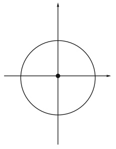
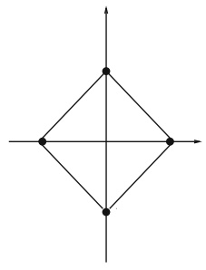

# 3. Weak Topologies. Reflexive Spaces. Separable Spaces. Uniform Convexity

<!-- PDF page 70; unreviewed OCR draft -->

# Weak Topologies. Reflexive Spaces. Separable Spaces. Uniform Convexity

## 3.1 The Coarsest Topology for Which a Collection of Maps Becomes Continuous

We begin this chapter by recalling a well-known concept in topology. Suppose X is a set (without any structure) and $( Y _ { i } ) _ { i \in I }$ is a collection of topological spaces. We are given a collection of maps $( \varphi _ { i } ) _ { i \in I }$ such that for every $i \in I$ , $\varphi _ { i }$ maps X into $Y _ { i }$ and we consider the following:

**Problem 1.** Construct a topology on X that makes all the maps $( \varphi _ { i } ) _ { i \in I }$ continuous. If possible, find a topology $\mathcal { T }$ that is the most economical in the sense that it has the fewest open sets.

Note that if we equip X with the discrete topology (i.e., every subset of X is open), then every map $\varphi _ { i }$ is continuous; of course, this topology is far from being the “cheapest”; in fact, it is the most expensive one! As we shall see, there is always a (unique) “cheapest” topology $\mathcal { T }$ on X for which every map $\varphi _ { i }$ is continuous. It is called the coarsest or weakest topology (or sometimes the initial topology) associated to the collection $( \varphi _ { i } ) _ { i \in I }$

If $\omega _ { i } \subset Y _ { i }$ is any open set, then $\varphi _ { i } ^ { - 1 } ( \omega _ { i } )$ is necessarily an open set in ${ \mathcal { T } } .   { \mathrm { A s } }$ ωi runs through the family of open sets of $Y _ { i }$ and i runs through I we obtain a family of subsets of $X ,$ each of which must be open in the topology $\mathcal { T }$ . Let us denote this family by $( U _ { \lambda } ) _ { \lambda \in \Lambda }$ . Of course, this family need not be a topology. Therefore, we are led to the following:

**Problem 2.** Given a set X and a family $( U _ { \lambda } ) _ { \lambda \in \Lambda }$ of subsets in X, construct the cheapest topology $\mathcal { T }$ on X in which $U _ { \lambda }$ is open for all $\lambda \in \Lambda$

In other words, we must find the cheapest family $\mathcal { F }$ of subsets of X that is $s t a b l e ^ { 1 }$ by $\Gamma _ { \mathrm { f i n i t e } }$ and $\mathrm { U _ { a r b i t r a r y } }$ and with the property that $U _ { \lambda }   \in   \mathcal { F }$ for every $\lambda \in \Lambda$ . The construction goes as follows. First,consider finite intersections of sets in $( U _ { \lambda } ) _ { \lambda \in \Lambda }$ i.e., $\cap _ { \lambda \in \Gamma } U _ { \lambda }$ where $\Gamma \subset \Lambda$ is finite. In this way we obtain a new family, called , of

<small>F</small>

<small>F</small>

<small>1 Meaning that a finite intersection of sets in F and an arbitrary union of sets in F both belong F to .</small>

<!-- PDF page 71; unreviewed OCR draft -->

subsets of X which includes $( U _ { \lambda } ) _ { \lambda \in \Lambda }$ and which is stable under $\cap _ { \mathrm { f i n i t e } }$ . However, it need not be stable under $\mathrm { U _ { a r b i t r a r y } }$ . Therefore, we consider next the family $\mathcal { F }$ obtained by forming arbitrary unions of elements from . It is clear that $\mathcal { F }$ is stable under $\mathrm { U _ { a r b i t r a r y } }$ . It is not clear whether $\mathcal { F }$ is stable under $\cap _ { \mathrm { f i n i t e } }$ ; but indeed we have the following result:

## Lemma 3.1. The family $\mathcal { F }$ is stable under ∩finite.

The proof of Lemma 3.1—a delightful exercise in set theory—is left to the reader; see e.g., G. Folland [2]. It is now obvious that the above construction gives the cheapest topology with the required property.

Remark 1. One cannot reverse the order of operations in the construction of $\mathcal { F }$ . It would have been equally natural to start with $\mathrm { U _ { a r b i t r a r y } }$ and then to take $\cap _ { \mathrm { f i n i t e } }$ . The outcome is a family that is stable under $\cap _ { \mathrm { f i n i t e } } ;$ but it is not stable under $\mathrm { U _ { a r b i t r a r y } . }$ One would have to consider once more $\mathrm { U _ { a r b i t r a r y } }$ and the process then stabilizes.

To summarize this discussion we find that the open sets of the topology $\mathcal { T }$ are obtained by considering first $\cap _ { \mathrm { f i n i t e } }$ of sets of the form $\varphi _ { i } ^ { - 1 } ( \omega _ { i } )$ and then $\mathrm { U _ { a r b i t r a r y } }$ . It follows that for every $x \in X$ , we obtain a basis of neighborhoods of x for the topology $\mathcal { T }$ by considering sets of the form ∩finite $\varphi _ { i } ^ { - 1 } ( V _ { i } )$ , where $V _ { i }$ is a neighborhood of $\varphi _ { i } ( x )$ in $Y _ { i }$ . Recall that in a topological space, a basis of neighborhoods of a point x is a family of neighborhoods of x, such that every neighborhood of x contains a neighborhood from the basis.

In what follows we equip X with the topology $\mathcal { T }$ that is the weakest topology associated to the collection $( \varphi _ { i } ) _ { i \in I }$ . Here are two simple properties of the topology $\mathcal { T }$

• **Proposition 3.1.** Let $( x _ { n } )$ be a sequence in X. Then $x _ { n } \rightarrow x ( i n \mathcal { T } )$ if and only if $\varphi _ { i } ( x _ { n } ) \to \varphi _ { i } ( x )$ for every $i \in I$

Proof. If $x _ { n } \to x$ , then $\varphi _ { i } ( x _ { n } ) \to \varphi _ { i } ( x )$ for each i, since each $\varphi _ { i }$ is continuous for $\mathcal { T }$ . Conversely, let U be a neighborhood of x. From the preceding discussion, we may always assume that U has the form $U = \cap _ { i \in J } \varphi _ { i } ^ { - 1 } ( V _ { i } )$ with $J \subset I$ finite. For each $i   \in   J$ there is some integer $N _ { i }$ such that $\varphi _ { i } ( x _ { n } ) \in V _ { i }$ for $n \geq N _ { i }$ . It follows that $x _ { n } \in U$ for $n \geq N = \operatorname* { m a x } _ { i \in J } N _ { i }$

• **Proposition 3.2.** Let Z be a topological space and let ψ be a map from $Z$ into X. Then ψ is continuous if and only if ϕi ◦ ψ is continuous from Z into $Y _ { i }   f _ { } { o r }$ every $i \in I$

Proof. If ψ is continuous then $\varphi _ { i } \circ$ ψ is also continuous for every $i \in I$ . Conversely, we have to prove that $\psi ^ { - 1 } ( U )$ is open (in Z) for every open set U (in X). But we know that $U$ has the form $U = \cup _ { \mathrm { a r b i t r a r y } }$ ∩finite $\varphi _ { i } ^ { - 1 } \dot { ( \omega _ { i } ) }$ , where $\omega _ { i }$ is open in $Y _ { i }$ . Therefore

$$
\psi ^ { - 1 } ( U ) = \underset { \mathrm { a r b i t r a r y } } { \cup } \underset { \mathrm { f i n i t e } } { \cap } \psi ^ { - 1 } [ \varphi _ { i } ^ { - 1 } ( \omega _ { i } ) ] = \underset { \mathrm { a r b i t r a r y } } { \cup } \underset { \mathrm { f i n i t e } } { \cap } ( \varphi _ { i } \circ \psi ) ^ { - 1 } ( \omega _ { i } ) ,
$$

which is open in $Z$ since every map $\varphi _ { i } \circ \psi$ is continuous.

<!-- PDF page 72; unreviewed OCR draft -->

## 3.2 Definition and Elementary Properties of the Weak Topology $\sigma ( E , E ^ { \star } )$

Let E be a Banach space and let $f   \in   E ^ { \star }$ . We denote by $\varphi _ { f } : E   \to   \mathbb { R }$ the linear functional $\varphi _ { f } ( x ) = \langle f , x \rangle . \operatorname { A s }   j$ runs through $E ^ { \star }$ we obtain a collection $( \varphi _ { f } ) _ { f \in E ^ { \star } }$ of maps from E into R. We now ignore the usual topology on E (associated to ) and define a new topology on the set E as follows:

**Definition.** The weak topology $\sigma ( E , E ^ { \star } )$ on E is the coarsest topology associated to the collection $( \varphi _ { f } ) _ { f \in E ^ { \star } }$ (in the sense of Section 3.1 with $X = E ,   Y_i = \mathbb{R}$ , for each i, and $I = E ^ { \star } )$

Note that every map $\varphi _ { f }$ is continuous for the usual topology and therefore the weak topology is weaker than the usual topology.

## Proposition 3.3. The weak topology $\sigma ( E , E ^ { \star } )$ is Hausdorff.

Proof. Given $x _ { 1 } , x _ { 2 }   \in   E$ with $x _ { 1 } \neq x _ { 2 }$ we have to find two open sets $O _ { 1 }$ and $O _ { 2 }$ for the weak topology $\sigma ( E , E ^ { \star } )$ such that $x _ { 1 }   \in   O _ { 1 } ,   x _ { 2 }   \in   O _ { 2 }$ , and $O _ { 1 } \cap O _ { 2 } = \emptyset .$ By Hahn–Banach (second geometric form) there exists a closed hyperplane strictly separating $\{ x _ { 1 } \}$ and $\{ x _ { 2 } \}$ . Thus, there exist some $f \in E ^ { \star }$ and some $\alpha \in \mathbb { R }$ such that

$$
\langle f , x _ { 1 } \rangle < \alpha < \langle f , x _ { 2 } \rangle .
$$

Set

$$
\begin{aligned} &O_{1} = \left\{ x \in E; \left\langle f, x \right\rangle < \alpha \right\} = \varphi_{f}^{-1} \left( \left( -\infty, \alpha \right) \right), \\&O_{2} = \left\{ x \in E; \left\langle f, x \right\rangle > \alpha \right\} = \varphi_{f}^{-1} \left( \left( \alpha, +\infty \right) \right).\\ \end{aligned}
$$

Clearly, $O _ { 1 }$ and $O _ { 2 }$ are open for $\sigma ( E , E ^ { \star } )$ and they satisfy the required properties.

• **Proposition 3.4.** Let $x _ { 0 } \in E ;   g i v e n \; \varepsilon   >   0$ and a **finite** set $\{ f _ { 1 } ,   f _ { 2 } ,   \ldots ,   f _ { k } \}$ in $E ^ { \star }$ consider

$$
V = V ( f _ { 1 } , f _ { 2 } , \ldots , f _ { k } ;   \varepsilon ) = \{ x \in E ; \quad | \langle f _ { i } , x - x _ { 0 } \rangle | < \varepsilon \quad \forall i = 1 , 2 , \ldots , k \}   .
$$

Then V is a neighborhood of x0 for the topology $\sigma ( E , E ^ { \star } )$ . Moreover, we obtain a **basis of neighborhoods** of x0 for $\sigma ( E , E ^ { \star } )$ by varying ε, k, and the $f _ { i } ^ { \mathrm { ~ , ~ } } s$ in $E ^ { \star }$

Proof. Clearly $V = \cap _ { i = 1 } ^ { k } \varphi _ { f _ { i } } ^ { - 1 } ( ( a _ { i } - \varepsilon , a _ { i } + \varepsilon ) )$ , with $a _ { i } = \langle f _ { i } , x _ { 0 } \rangle$ , is open for the topology $\sigma ( E , E ^ { \star } )$ and contains x0. Conversely, let U be a neighborhood of $x _ { 0 }$ for $\sigma ( E , E ^ { \star } )$ . From the discussion in Section 3.1 we know that there exists an open set W containing $x _ { 0 } , W \subset U$ , of the form $W = \cap _ { \mathrm { f i n i t e } } \varphi _ { f _ { i } } ^ { - 1 } ( \omega _ { i } )$ , where $\omega _ { i }$ is a neighborhood (in R) of $a _ { i } = \langle f _ { i } , x _ { 0 } \rangle$ . Hence there exists $\varepsilon > 0$ such that $( a _ { i } - \varepsilon , a _ { i } + \varepsilon ) \subset \omega _ { i }$ for every i. It follows that $x _ { 0 } \in V \subset W \subset U$

**Notation.** If a sequence $( x _ { n } )$ in E converges to x in the weak topology $\sigma ( E , E ^ { \star } )$ we shall write

<!-- PDF page 73; unreviewed OCR draft -->

$$
\boxed { x _ { n } \rightharpoonup x . }
$$

To avoid any confusion we shall sometimes say, $\text{" } x_{n} \text{→ } x$ weakly in $\sigma ( E , E ^ { \star } )$ ” In order to be totally clear we shall sometimes emphasize strong convergence by saying, $\text{" } x_{n} \rightarrow x$ strongly,” meaning that $\| x _ { n } - x \| \to 0$

## • Proposition 3.5. Let $( x _ { n } )$ be a sequence in E. Then

(i) $[ x _ { n } \rightharpoonup x \quad w e a k l y \quad i n \quad \sigma ( E , E ^ { \star } ) ] \Leftrightarrow [ \langle f , x _ { n } \rangle \rightarrow \langle f , x \rangle \quad \forall f \in E ^ { \star } ] .$

(ii) $I f x _ { n } \to x$ strongly, then $x _ { n } \rightharpoonup x$ weakly in $\sigma ( E , E ^ { \star } )$

(iii) $I f x _ { n } \rightharpoonup x$ weakly in $\sigma ( E , E ^ { \star } )$ , then $( \| x _ { n } \| )$ is bounded and $\| x \| \leq$ lim inf $\| x _ { n } \|$

(iv) $I f x _ { n } \rightharpoonup x$ weakly in σ $( E , E ^ { \star } )$ and if $[ f _ { n } \rightarrow f$ strongly in $E ^ { \star } \left( i . e . ,   \| f _ { n }   -   f \| _ { E ^ { \star } } \right) \rightarrow$ 0), then $\langle f _ { n } , x _ { n } \rangle \to \langle f , x \rangle$

Proof.

(i) f ll f P iti 3 1 d th d fi iti f th k t l o ows rom ropos on . an e e n on o e wea opo ogy $\sigma ( E , E ^ { \star } )$

(ii) follows from (i), since $\left| \left\langle f, x_n \right\rangle - \left\langle f, x \right\rangle \right| \leq \left\| f \right\| \left\| x_n - x \right\|$ ; it is also clear from the fact that the weak topology is weaker than the strong topology.

(iii) follows from the uniform boundedness principle (see Corollary 2.4), since for every $f \in E ^ { \star }$ the set $( \langle f , x _ { n } \rangle ) _ { n }$ is bounded. Passing to the limit in the inequality

$$
| \langle f , x _ { n } \rangle | \leq \| f \| \| x _ { n } \| ,
$$

we obtain

$$
| \langle f , x \rangle | \leq \| f \| \liminf \| x _ { n } \| ,
$$

which implies (by Corollary 1.4) that

$$
\| x \| = \sup_{\| f \| \leq 1} | \langle f, x \rangle | \leq \liminf_{n \to \infty} \| x_n \|.
$$

(iv) follows from the inequality

$$
| \langle f _ { n } , x _ { n } \rangle - \langle f , x \rangle | \leq | \langle f _ { n } - f , x _ { n } \rangle | + | \langle f , x _ { n } - x \rangle | \leq \| f _ { n } - f \| \| x _ { n } \| + | \langle f , x _ { n } - x \rangle | ,
$$

combined with (i) and (iii).

• **Proposition 3.6.** When E is **finite-dimensional**, the weak topology $\sigma ( E , E ^ { \star } )$ and the usual topology are the **same**. In particular, a sequence $( x _ { n } )$ converges weakly if and only if it converges strongly.

Proof. Since the weak topology has always fewer open sets than the strong topology, it suffices to check that every strongly open set is weakly open. Let $x _ { 0 } \in E$ and let $U$ be a neighborhood of $x _ { 0 }$ in the strong topology. We have to find a neighborhood V of $x _ { 0 }$ in the weak topology $\sigma ( E , E ^ { \star } )$ such that $V \subset U$ . In other words, we have to find $f _ { 1 } ,   f _ { 2 } , \ldots ,   f _ { k }$ in $E ^ { \star }$ and $\varepsilon > 0$ such that

$$
V = \{ x \in E ; | \langle f _ { i } , x - x _ { 0 } \rangle | < \varepsilon \quad \forall i = 1 , 2 , \ldots , k \} \subset U .
$$

<!-- PDF page 74; unreviewed OCR draft -->

Fix $r ~ > ~ 0$ such that $B ( x _ { 0 } , r ) \; \subset \; U$ . Pick a basis $e _ { 1 } , e _ { 2 } , \ldots , e _ { k }$ in E such that $\| e _ { i } \| = 1$ , ∀i. Every $x \in E$ admits a decomposition $\textstyle x = \sum _ { i = 1 } ^ { k } x _ { i } e _ { i }$ , and the maps $x \mapsto x _ { i }$ are continuous linear functionals on $E$ denoted by $f _ { i }$ . We have

$$
\| x - x _ { 0 } \| \leq \sum _ { i = 1 } ^ { k } \lvert \langle f _ { i } , x - x _ { 0 } \rangle \rvert < k \varepsilon .
$$

for every $x \in V$ . Choosing $\varepsilon = r / k$ , we obtain $V \subset U$

Remark 2. Open (resp. closed) sets in the weak topology $\sigma ( E , E ^ { \star } )$ are always open (resp. closed) in the strong topology. In any infinite-dimensional space the weak topology is strictly coarser than the strong topology; i.e., there exist open (resp. closed) sets in the strong topology that are not open (resp. closed) in the weak topology. Here are two examples:

Example 1. The unit sphere $S = \{ x \in E ; \| x \| = 1 \}$ , with E infinite-dimensional, is never closed in the weak topology $\sigma ( E , E ^ { \star } )$ . More precisely, we have

$$
\overline { { S } } ^ { \sigma ( E , E ^ { \star } ) } = B _ { E } ,\tag{1}
$$

where $\overline { { S } } ^ { \sigma ( E , E ^ { \star } ) }$ denotes the closure of S in the topology $\sigma ( E , E ^ { \star } )$ and $B _ { E }$ (already defined in Chapter 2) denotes the closed unit ball in $E$ ,

$$
B _ { E } = \{ x \in E ; \| x \| \leq 1 \} .
$$

First let us check that every $x _ { 0 } \in E$ with $\| x _ { 0 } \| < 1$ belongs to $\overline { { S } } ^ { \sigma ( E , E ^ { \star } ) }$ . Indeed, let V be a neighborhood of $x _ { 0 }$ in $\sigma ( E , E ^ { \star } )$ . We have to prove that $V \cap S \neq \emptyset$ . In view of Proposition 3.4 we may always assume that V has the form

$$
V = \{ x \in E ; | \langle f _ { i } , x - x _ { 0 } \rangle | < \varepsilon \quad \forall i = 1 , 2 , \ldots , k \}
$$

with $\varepsilon > 0$ and $f _ { 1 } ,   f _ { 2 } ,   \ldots ,   f _ { k } \in E ^ { \star }$ . Fix $y _ { 0 } \in E ,   y _ { 0 } \neq 0$ , such that

$$
\langle f _ { i } , y _ { 0 } \rangle = 0 \qquad \forall i = 1 , 2 , \ldots , k .
$$

[Such a $y _ { 0 }$ exists; otherwise, the map $\varphi \quad : \quad E \quad \to \quad \mathbb { R } ^ { k }$ defined by $\varphi ( x ) ~ = ~$ $( \langle f _ { i } , x \rangle ) _ { 1 \leq i \leq k }$ would be injective and $\varphi$ would be an isomorphism from E onto $\varphi ( E )$ , and thus dim $E \leq k$ , which contradicts the assumption that $E$ is infinitedimensional. $1 ] ^ { 2 }$ The function $g(t) = \left\| x_{0} + t y_{0} \right\|$ is continuous on $[ 0 , \infty )$ with $g ( 0 ) < 1$ and $\begin{array} { r } { \operatorname* { l i m } _ { t \to + \infty }   g ( t ) = + \infty } \end{array}$ . Hence there exists some $t _ { 0 } > 0$ such that $\left\| x_{0} +  t_{0} y_{0} \right\| = 1$ It follows that $x _ { 0 } + t _ { 0 } y _ { 0 } \in V \cap S$ , and thus we have established that

$$
S \subset B _ { E } \subset \overline { { S } } ^ { \sigma ( E , E ^ { \star } ) } .
$$

<small>V</small>

<small>x0</small>

<small>0.</small>

<small>σ ( , -)</small>

<small>x0,</small>

<small>2 The geometric interpretation of this construction is the following. When E is infinite-dimensional, every neighborhood V of in the topology E E contains a line passing through even a “huge” affine space passing through x</small>

<!-- PDF page 75; unreviewed OCR draft -->

In order to complete the proof of (1) it suffices to know that $B _ { E }$ is closed in the topology $\sigma ( E , E ^ { \star } )$ . But we have

$$
B _ { E } = \bigcap _ { \substack { f \in E ^ { \star } \\ \| f \| \leq 1 } } \{ x \in E ; \; | \langle f , x \rangle | \leq 1 \} ,
$$

which is an intersection of weakly closed sets.

Example 2. The unit ball $U = \{ x   \in   E ; \; \| x \|   <   1 \}$ , with E infinite-dimensional, is never open in the weak topology $\sigma ( E , E ^ { \star } )$ . Suppose, by contradiction, that $U$ is weakly open. Then its complement $U ^ { c }   =   \{ x   \in   E ;   \| x \|   \geq   1 \}$ is weakly closed. It follows that $S = B _ { E } \cap U ^ { c }$ is also weakly closed; this contradicts Example 1.

\- Remark 3. In infinite-dimensional spaces the weak topology is never metrizable, i.e., there is no metric (and a fortiori no norm) on E that induces on E the weak topology $\sigma ( E , E ^ { \star } )$ ; see Exercise 3.8. However, as we shall see later (Theorem 3.29), if $E ^ { \star }$ is separable one can define a norm on E that induces on bounded sets of E the weak topology $\sigma ( E , E ^ { \star } )$

\- Remark 4. Usually, in infinite-dimensional spaces, there exist sequences that converge weakly and do not converge strongly. For example, if $E ^ { \star }$ is separable or if E is reflexive one can construct a sequence $( x _ { n } )$ in E such that $\| x _ { n } \| = 1$ and $x _ { n } \rightharpoonup 0$ weakly (see Exercise 3.22). However, there are infinite-dimensional spaces with the property that every weakly convergent sequence is strongly convergent. For example, $\ell ^ { 1 }$ has that unusual property (see Problem 8). Such spaces are quite “rare” and somewhat “pathological.” This strange fact does not contradict Remark 2, which asserts that in infinite-dimensional spaces, the weak topology and the strong topology are always distinct: the weak topology is strictly coarser than the strong topology. Keep in mind that two metric (or metrizable) spaces with the same convergent sequences have identical topologies; however, if two topological spaces have the same convergent sequences they need not have identical topologies.

## 3.3 Weak Topology, Convex Sets, and Linear Operators

Every weakly closed set is strongly closed and the converse is false in infinitedimensional spaces (see Remark 2). However, it is very useful to know that for convex sets, weakly closed = strongly closed:

• **Theorem 3.7.** Let C be a convex subset of E. Then C is closed in the weak topology $\sigma ( E , E ^ { \star } )$ if and only if it is closed in the strong topology.

Proof. Assume that C is closed in the strong topology and let us prove that C is closed in the weak topology. We shall check that the complement $C ^ { c }$ of C is open in the weak topology. To this end, let $x _ { 0 } \notin C$ . By Hahn–Banach there exists a closed

<!-- PDF page 76; unreviewed OCR draft -->

hyperplane strictly separating $\{ x _ { 0 } \}$ and C. Thus, there exist some $f \in E ^ { \star }$ and some $\alpha \in \mathbb { R }$ such that

$$
\langle f , x _ { 0 } \rangle < \alpha < \langle f , y \rangle \quad \forall y \in C .
$$

Set

$$
V = \{ x \in E ; \langle f , x \rangle < \alpha \} ;
$$

so that $x _ { 0 } \in V ,   V \cap C = \varnothing   ( \mathrm { i . e . , }   V \subset C ^ { c } )$ and V is open in the weak topology.

**Corollary 3.8 (Mazur).** Assume $( x _ { n } )$ converges **weakly** to x. Then there exists a sequence $( y _ { n } )$ made up of convex combinations of the $x _ { n }   { \dot { s } }$ that converges **strongly** to x.

Proof. Let $C = \operatorname { \mathsf { c o n v } } ( \cup _ { p = 1 } ^ { \infty } \{ x _ { p } \} )$ denote the convex hull of the ${ x _ { n } } ^ { \prime } \mathbf { s }$ . Since x belongs to the weak closure of $\dot { \cup } _ { p = 1 } ^ { \infty } \{ x _ { p } \}$ it belongs a fortiori to the weak closure of C. By Theorem $3 . 7 , x \in \overline { { C } }$ , the strong closure of C, and the conclusion follows.

Remark 5. There are some variants of Corollary 3.8 (see Exercises 3.4 and 5.24). Also, note that the proof of Theorem 3.7 shows that every closed convex set C coincides with the intersection of all the closed half-spaces containing C.

• **Corollary 3.9.** Assume that $\varphi : E \to ( - \infty + \infty ]$ is convex and l.s.c. in the strong topology. Then ϕ is l.s.c. in the weak topology $\sigma ( E , E ^ { \star } )$ .

Proof. For every $\lambda \in \mathbb { R }$ the set

$$
A = \{ x \in E ; \varphi ( x ) \leq \lambda \}
$$

is convex and strongly closed. By Theorem 3.7 it is weakly closed and thus $\varphi$ is weakly l.s.c.

• Remark 6. It may be rather difficult in practice to prove that a function is l.s.c. in the weak topology. Corollary 3.9 is often used as follows:

ϕ convex and strongly continuous ⇒ ϕ weakly l.s.c.

For example, the function $\varphi ( x ) = \| x \|$ is convex and strongly continuous; thus it is weakly l.s.c. In particular, if $x _ { n } \rightharpoonup x$ weakly, it follows that $\| x \| \leq \operatorname* { l i m }$ inf $\| x _ { n } \|$ (see also Proposition 3.5).

**Theorem 3.10.** Let E and F be two Banach spaces and let T be a linear operator from E into F. Assume that T is continuous in the strong topologies. Then $T$ is continuous from E weak σ $( E , E ^ { \star } )$ into F weak $\sigma ( F , F ^ { \star } )$ and conversely.

Proof. In view of Proposition 3.2 it suffices to check that for every $f \in F ^ { \star }$ the map $x \mapsto \langle f , T x \rangle$ is continuous from E weak $\sigma ( E , E ^ { \star } )$ into R. But the map $x \mapsto \langle f , T x \rangle$ is a continuous linear functional on E. Therefore, it is also continuous in the weak topology $\sigma ( E , E ^ { \star } )$

<!-- PDF page 77; unreviewed OCR draft -->

Conversely, suppose that T is continuous from E weak into F weak. Then $G ( T )$ is closed in $E \times F$ equipped with the product topology $\sigma ( E , E ^ { \star } ) \times \sigma ( F , F ^ { \star } )$ , which is clearly the same as $\sigma ( E \times F , ( E \times F ) ^ { \star } )$ . It follows that $G ( T )$ is strongly closed (any weakly closed set is strongly closed). We conclude with the help of the closed graph theorem (Theorem 2.9) that T is continuous from E strong into F strong.

Remark 7. The argument above shows more: that if a linear operator T is continuous from E strong into F weak then T is continuous from $E$ strong into $F$ strong. As a consequence, for linear operators, the following continuity properties are all the same: $S   \to   S ,   W   \to   W ,   S   \to   W   ( S   = \mathrm { s t r o n g } ,   W   = \mathrm { w e a k } )$ . On the other hand, very few linear operators are continuous $W \to S ;$ this happens if and only if T is continuous $S \rightarrow S$ and, moreover, dim $R ( T ) < \infty$ (see Exercise 6.7).

Also, note that in general, nonlinear maps that are continuous from E strong into $F$ strong are not continuous from E weak into F weak (see, e.g., Exercise 4.20). This is a major source of difficulties in nonlinear problems.

## 3.4 The Weak- Topology σ $( E ^ { \star } , E )$

So far, we have two topologies on $E ^ { \star }$ :

(a) the usual (strong) topology associated to the norm of $E ^ { \star }$ ,

(b) the weak topology $\sigma ( E ^ { \star } , E ^ { \star \star } )$ , obtained by performing on $E ^ { \star }$ the construction of Section 3.3.

We are now going to define a third topology on $E ^ { \star }$ called the weak- topology and denoted by $\sigma ( E ^ { \star } , E )$ (the - is here to remind us that this topology is defined only on dual spaces). For every $x \in E$ consider the linear functional $\varphi _ { x } : E ^ { \star } \to$ R defined by $f \mapsto \varphi _ { x } ( f ) = \langle f , x \rangle$ . As x runs through E we obtain a collection $( \varphi _ { x } ) _ { x \in E }$ of maps from $E ^ { \star }$ into R.

**Definition.** The $w e a k ^ { \star }   t o p o l o g y , \sigma ( E ^ { \star } , E )$ , is the coarsest topology on $E ^ { \star }$ associated to the collection $( \varphi _ { x } ) _ { x \in E }$ (in the sense of Section 3.1 with $X = E ^ { \star } , Y _ { i } = \mathbb { R }$ , for all i, and $I = E )$ .

Since $E \subset E ^ { \star \star }$ , it is clear that the topology $\sigma ( E ^ { \star } , E )$ is coarser than the topology $\sigma ( E ^ { \star } , E ^ { \star \star } ) ; \mathrm { i . e . }$ , the topology $\sigma ( E ^ { \star } , E )$ has fewer open sets (resp. closed sets) than the topology $\sigma ( E ^ { \star } , E ^ { \star \star } )$ , which in turn has fewer open sets (resp. closed sets) than the strong topology.

Remark 8. The reader probably wonders why there is such hysteria over weak topologies! The reason is the following: a coarser topology has more compact sets. For example, the closed unit ball $B _ { E ^ { \star } }$ in $E ^ { \star }$ , which is never compact in the strong topology (unless dim $E < \infty ;$ see Theorem 6.5), is always compact in the weak- topology (see Theorem 3.16). Knowing the basic role of compact sets—for example, in existence mechanisms such as minimization—it is easy to understand the importance of the weak- topology.

**Proposition 3.11.** *The weak* topology is Hausdorff.*

Proof. Given $f _ { 1 } ,   f _ { 2 } \in E ^ { \star }$ with $f _ { 1 } \neq f _ { 2 }$ there exists some $x \in E$ such that $\langle f _ { 1 } , x \rangle \neq$ $\langle f _ { 2 } , x \rangle$ (this does not use Hahn–Banach, but just the fact that $f _ { 1 } \neq f _ { 2 } )$ . Assume for example that $\langle f _ { 1 } , x \rangle < \langle f _ { 2 } , x \rangle$ and choose α such that

$$
\langle f _ { 1 } , x \rangle < \alpha < \langle f _ { 2 } , x \rangle .
$$

Set

$$
O _ { 1 } = \{ f \in E ^ { \star } ; \langle f , x \rangle < \alpha \} = \varphi _ { x } ^ { - 1 } ( ( - \infty , \alpha ) ) ,
$$

$$
O _ { 2 } = \{ f \in E ^ { \star } ; \langle f , x \rangle > \alpha \} = \varphi _ { x } ^ { - 1 } ( ( \alpha , + \infty ) ) .
$$

Then $O _ { 1 }$ and $O _ { 2 }$ are open sets in $\sigma ( E ^ { \star } , E )$ such that $f _ { 1 } \in O _ { 1 } ,   f _ { 2 } \in O _ { 2 }$ , and $O _ { 1 } \cap O _ { 2 } = \varnothing .$

**Proposition 3.12.** Let $f _ { 0 } \in E ^ { \star }$ ; given a **finite** set $\{ x _ { 1 } , x _ { 2 } , \ldots , x _ { k } \}$ in E and $\varepsilon > 0 ,$ consider

$$
V = V ( x _ { 1 } , x _ { 2 } , \ldots , x _ { k } ; \varepsilon ) = \left\{ f \in E ^ { \star } ; | \langle f - f _ { 0 } , x _ { i } \rangle | < \varepsilon \quad \forall i = 1 , 2 , \ldots , k \right\} .
$$

Then $V$ is a neighborhood of $f_0$ for the topology $\sigma(E^*,E)$. Moreover, we obtain a **basis of neighborhoods** of $f_0$ for $\sigma(E^*,E)$ by varying $\varepsilon$, $k$, and the $x_i$’s in $E$.

Proof. Same as the proof of Proposition 3.4.

**Notation.** If a sequence $(f_n)$ in $E^*$ converges to $f$ in the weak* topology we shall write

$$
\boxed { f _ { n } \stackrel { \star } { \rightharpoonup } f . }
$$

To avoid any confusion we shall sometimes emphasize “$f_n\stackrel{*}{\rightharpoonup}f$ in $\sigma(E^*,E)$,” “$f_n\rightharpoonup f$ in $\sigma(E^*,E^{**})$,” and “$f_n\to f$ strongly.”

• **Proposition 3.13.** Let $( f _ { n } )$ be a sequence in $E ^ { \star }$ . Then

(i) $[f_n\stackrel{*}{\rightharpoonup}f\text{ in }\sigma(E^*,E)]\Longleftrightarrow[\langle f_n,x\rangle\to\langle f,x\rangle,\ \forall x\in E]$.

(ii) If $f_n\to f$ strongly, then $f_n\rightharpoonup f$ in $\sigma(E^*,E^{**})$.

If $f_n\rightharpoonup f$ in $\sigma(E^*,E^{**})$, then $f_n\stackrel{*}{\rightharpoonup}f$ in $\sigma(E^*,E)$.

(iii) If $f_n\stackrel{*}{\rightharpoonup}f$ in $\sigma(E^*,E)$, then $(\|f_n\|)$ is bounded and $\|f\|\leq\liminf\|f_n\|$.

(iv) If $f_n\stackrel{*}{\rightharpoonup}f$ in $\sigma(E^*,E)$ and if $x_n\to x$ strongly in $E$, then $\langle f_n,x_n\rangle\to\langle f,x\rangle$.

Proof. Copy the proof of Proposition 3.5.

Remark 9. Assume $f _ { n } \stackrel { \star } { \rightharpoonup } f$ in $\sigma ( E ^ { \star } , E )$ (or even $f _ { n } \rightharpoonup f$ in $\sigma ( E ^ { \star } , E ^ { \star \star } ) )$ and $x _ { n } \rightharpoonup x$ in $\sigma ( E , E ^ { \star } )$ . One cannot conclude, in general, that $\langle f _ { n } , x _ { n } \rangle \to \langle f , x \rangle$ (it is very easy to construct an example in Hilbert spaces).

*Remark 10.* When $E$ is a finite-dimensional space the three topologies (strong, weak, weak*) on $E^*$ coincide. Indeed, the canonical injection $J:E\to E^{**}$ (see Section 1.3) is surjective (since $\dim E=\dim E^{**}$) and therefore $\sigma(E^*,E)=\sigma(E^*,E^{**})$.

⋆ **Proposition 3.14.** *Let $\varphi:E^*\to\mathbb{R}$ be a linear functional that is continuous for the weak* topology. Then there exists some $x_0\in E$ such that*

$$
\varphi ( f ) = \langle f , x _ { 0 } \rangle \quad \forall f \in E ^ { \star } .
$$

The proof relies on the following useful algebraic lemma:

**Lemma 3.2.** Let X be a vector space and let $\varphi , \varphi _ { 1 } , \varphi _ { 2 } , \ldots , \varphi _ { k }$ be $( k + 1 )$ linear functionals on X such that

$$
[ \varphi _ { i } ( v ) = 0 \quad \forall i = 1 , 2 , \ldots , k ] \Rightarrow [ \varphi ( v ) = 0 ] .\tag{2}
$$

Then there exist constants $\lambda _ { 1 } , \lambda _ { 2 } , \ldots , \lambda _ { k } \in \mathbb { R }$ such that $\begin{array} { r } { \varphi = \sum _ { i = 1 } ^ { k } \lambda _ { i } \varphi _ { i } } \end{array}$

Proof of Lemma 3.2. Consider the map $F : X \to \mathbb { R } ^ { k + 1 }$ defined by

$$
F ( u ) = [ \varphi ( u ) , \varphi _ { 1 } ( u ) , \varphi _ { 2 } ( u ) , \ldots , \varphi _ { k } ( u ) ] .
$$

It follows from assumption (2) that $a=[1,0,0,\ldots,0]$ does not belong to $R(F)$. Thus, one can strictly separate $\{a\}$ and $R(F)$ by some hyperplane in $\mathbb{R}^{k+1}$; i.e., there exist constants $\lambda,\lambda_1,\lambda_2,\ldots,\lambda_k$ and $\alpha$ such that

$$
\lambda < \alpha < \lambda \varphi ( u ) + { \sum _ { i = 1 } ^ { k } } \lambda _ { i } \varphi _ { i } ( u ) \quad \forall u \in X .
$$

It follows that

$$
\lambda \varphi ( u ) + { \sum _ { i = 1 } ^ { k } } \lambda _ { i } \varphi _ { i } ( u ) = 0 \quad \forall u \in X
$$

and also $\lambda<0$ (so that $\lambda\neq0$).

Proof of Proposition 3.14. Since $\varphi$ is continuous for the weak* topology, there exists a neighborhood V of 0 for $\sigma ( E ^ { \star } , E )$ such that

$$
| \varphi ( f ) | < 1 \quad \forall f \in V .
$$

We may always assume that

$$
V = \{ f \in E ^ { \star } ;   | \langle f , x _ { i } \rangle | < \varepsilon \quad \forall i = 1 , 2 , \ldots , k \}
$$

with $x _ { i } \in E$ and $\varepsilon > 0$ . In particular,

$$
[ \langle f , x _ { i } \rangle = 0 \quad \forall i = 1 , 2 , \ldots , k ] \Rightarrow [ \varphi ( f ) = 0 ] .
$$

It follows from Lemma 3.2 that

$$
\varphi ( f ) = { \sum _ { i = 1 } ^ { k } } \lambda _ { i } \langle f , x _ { i } \rangle = \left\langle f , { \sum _ { i = 1 } ^ { k } } \lambda _ { i } x _ { i } \right\rangle \quad { \forall } f \in E ^ { \star } .
$$

⋆ **Corollary 3.15.** *Assume that $H$ is a hyperplane in $E^*$ that is closed in $\sigma(E^*,E)$. Then $H$ has the form*

$$
H = \{ f \in E ^ { \star } ;   \langle f , x _ { 0 } \rangle = \alpha \}
$$

*for some $x_0\in E$, $x_0\neq0$, and some $\alpha\in\mathbb{R}$.*

Proof. H may be written as

$$
H = \{ f \in E ^ { \star } ; \varphi ( f ) = \alpha \} ,
$$

where $\varphi$ is a linear functional on $E ^ { \star } , \varphi \not \equiv 0 .$ . Let $f _ { 0 } \notin H$ and let V be a neighborhood of $f _ { 0 }$ for the topology $\sigma ( E ^ { \star } , E )$ such that $V \subset H ^ { c }$ . We may assume that

$$
V = \{ f \in E ^ { \star } ;   | \langle f - f _ { 0 } , x _ { i } \rangle | < \varepsilon \quad \forall i = 1 , 2 , \ldots , k \} .
$$

Since V is convex we find that either

$$
\varphi(f) < \alpha \quad \forall f \in V\tag{3}
$$

or

(3′)

$$
\varphi(f) > \alpha \quad \forall f \in V.
$$

Assuming, for example, that (3) holds, we obtain

$$
\varphi ( g ) < \alpha - \varphi ( f _ { 0 } ) \quad \forall g \in W = V - f _ { 0 } ,
$$

and since $- W = W$ we are led to

$$
| \varphi ( g ) | \leq | \alpha - \varphi ( f _ { 0 } ) | \quad \forall g \in W .\tag{4}
$$

It follows from (4) that $\varphi$ is continuous at 0 for the topology $\sigma ( E ^ { \star } , E )$ (since $W$ is a neighborhood of 0). Applying Proposition 3.14, we conclude that there is some $x _ { 0 } \in E$ such that

$$
\varphi ( f ) = \langle f , x _ { 0 } \rangle \quad \forall f \in E ^ { \star } .
$$

Remark 11. Assume that the canonical injection $J \; : \; E \; \rightarrow \; E ^ { \star \star }$ is not surjective. Then the topology $\sigma ( E ^ { \star } , E )$ is strictly coarser than the topology $\sigma ( E ^ { \star } , E ^ { \star \star } )$ . For example, let $\xi \in E ^ { \star \star }$ with $\xi \notin J ( E )$ . Then the set

$$
H = \{ f \in E ^ { \star } ; \langle \xi , f \rangle = 0 \}
$$

is closed in $\sigma(E^*,E^{**})$ but—in view of Corollary 3.15—it is not closed in $\sigma(E^*,E)$. We also learn from this example that convex sets that are closed in the strong topology

need *not* be closed in the weak* topology. There are *two types of closed convex sets* in $E^*$:

(a) the convex sets that are strongly closed (= closed in the topology $\sigma ( E ^ { \star } , E ^ { \star \star } )$ by Theorem 3.7),

(b) the convex sets that are closed in $\sigma ( E ^ { \star } , E )$

• **Theorem 3.16 (Banach–Alaoglu–Bourbaki).** The closed unit ball

$$
B _ { E ^ { \star } } = \{ f \in E ^ { \star } ; \| f \| \leq 1 \}
$$

*is compact in the weak* topology $\sigma(E^*,E)$.*

*Remark 12.* The *compactness* of $B_{E^*}$ is the *most essential* property of the weak* topology; see also Remark 8.

Proof. Consider the Cartesian product $Y=\mathbb{R}^E$, which consists of all maps from $E$ into $\mathbb{R}$; we denote elements of $Y$ by $\omega=(\omega_x)_{x\in E}$ with $\omega_x\in\mathbb{R}$. The space $Y$ is equipped with the standard *product topology* (see, e.g., H. L. Royden [1], J. R. Munkres [1], A. Knapp [1], or J. Dixmier [1]), i.e., the coarsest topology on $Y$ associated to the collection of maps $\omega\mapsto\omega_x$ (as $x$ runs through $E$), which is, of course, the same as the topology of pointwise convergence (see, e.g., J. R. Munkres [1]). In what follows $E^*$ is systematically equipped with the weak* topology $\sigma(E^*,E)$. Since $E^*$ consists of special maps from $E$ into $\mathbb{R}$ (i.e., continuous linear maps), we may consider $E^*$ as a subset of $Y$. More precisely, let $\Phi:E^*\to Y$ be the canonical injection from $E^*$ into $Y$, so that $\Phi(f)=(\omega_x)_{x\in E}$ with $\omega_x=\langle f,x\rangle$. Clearly, $\Phi$ is continuous from $E^*$ into $Y$ (use Proposition 3.2 and note that for every fixed $x\in E$ the map $f\in E^*\mapsto(\Phi(f))_x=\langle f,x\rangle$ is continuous). The inverse map $\Phi^{-1}$ is also continuous from $\Phi(E^*)$ (equipped with the $Y$ topology) into $E^*$; indeed, using Proposition 3.2 once more, it suffices to check that for every fixed $x\in E$ the map $\omega\mapsto\langle\Phi^{-1}(\omega),x\rangle$ is continuous on $\Phi(E^*)$, which is obvious since $\langle\Phi^{-1}(\omega),x\rangle=\omega_x$ (note that $\omega=\Phi(f)$ for some $f\in E^*$ and $\langle\Phi^{-1}(\omega),x\rangle=\langle f,x\rangle=\omega_x$). In other words, $\Phi$ is a homeomorphism from $E^*$ onto $\Phi(E^*)$. On the other hand, it is clear that $\Phi(B_{E^*})=K$, where $K$ is defined by

$$
K = \left\{ \omega \in Y \middle| \begin{aligned} & \left| \omega_{x} \right| \leq \| x \|, \omega_{x + y} = \omega_{x} + \omega_{y} \\ &  and   \omega_{\lambda x} = \lambda \omega_{x} \ \forall \lambda \in \mathbb{R}, \ \forall x,   y \in E \end{aligned} \right\}.
$$

In order to complete the proof of Theorem 3.16 it suffices to check that K is a compact subset of Y . Write K as $K = K _ { 1 } \cap K _ { 2 }$ , where

$$
K_{1} = \left\{ \omega \in Y; |\omega_{x}| \leq \|x\| \quad \forall x \in E \right\}
$$

and

$$
K _ { 2 } = \left\{ \omega \in Y ; \omega _ { x + y } = \omega _ { x } + \omega _ { y } \; \mathrm { a n d } \; \omega _ { \lambda x } = \lambda \omega _ { x } \quad \forall \lambda \in \mathbb { R } , \quad \forall x , y \in E \right\} .
$$

The set $K _ { 1 }$ may also be written as a product of compact intervals

$$
K _ { 1 } = \prod _ { x \in E } [ - \| x \| , + \| x \| ] .
$$

Let us recall that (arbitrary) products of compact spaces are compact—a deep theorem due to Tychonoff; see, e.g., H. L. Royden [1], G. B. Folland [2], J. R. Munkres [1], A. Knapp [1], or J. Dixmier [1]. Therefore $K _ { 1 }$ is compact. On the other hand, $K _ { 2 }$ is closed in Y ; indeed, for each fixed $\lambda \in \mathbb { R } , x , y \in E$ the sets

$$
\begin{aligned} &A_{x,y} = \{ \omega \in Y; \omega_{x+y} - \omega_x - \omega_y = 0 \}, \\&B_{\lambda,x} = \{ \omega \in Y; \omega_{\lambda x} - \lambda \omega_x = 0 \},\\ \end{aligned}
$$

are closed in Y (since the maps ω $\mapsto \omega _ { x + y } - \omega _ { x } - \omega _ { y }$ and $\omega \mapsto \omega _ { \lambda x } - \lambda \omega _ { x }$ are continuous on Y ) and we may write $K _ { 2 }$ as

$$
K _ { 2 } = \Bigl [ \bigcap _ { x , y \in E } A _ { x , y } \Bigr ] \cap \Bigl [ \bigcap _ { \stackrel { x \in E } { \lambda \in \mathbb { R } } } B _ { \lambda , x } \Bigr ] .
$$

Finally, $K$ is compact since it is the intersection of a compact set ($K_1$) and a closed set ($K_2$).

## 3.5 Reflexive Spaces

**Definition.** Let E be a Banach space and let $J : E \to E ^ { \star \star }$ be the canonical injection from E into $E ^ { \star \star }$ (see Section 1.3). The space E is said to be reflexive if J is surjective, $\mathrm { i . e . , } ~ J ( E ) = E ^ { \star \star }$

When E is reflexive, $E ^ { \star \star }$ is usually identified with E.

Remark 13. Many important spaces in analysis are reflexive. Clearly, finite-dimensional spaces are reflexive (since dim $E =$ dim $E ^ { \star } = \dim E ^ { \star \star } )$ . As we shall see in Chapter 4 (see also Chapter 11), $L ^ { p }$ (and $\ell ^ { p } )$ spaces are reflexive for $1 < p < \infty$ . In Chapter 5 we shall see that Hilbert spaces are reflexive. However, equally important spaces in analysis are not reflexive; for example:

• $L^1$ and $L^\infty$ (and $\ell^1,\ell^\infty$) are not reflexive (see Chapters 4 and 11);

• $C(K)$, the space of continuous functions on an infinite compact metric space $K$, is not reflexive (see Exercise 3.25).

⋆ *Remark 14.* It is essential to use $J$ in the above definition. R. C. James [1] has constructed a striking example of a nonreflexive space with the property that there exists a surjective isometry from $E$ onto $E^{**}$.

Our next result describes a basic property of reflexive spaces:

• **Theorem 3.17 (Kakutani).** Let E be a Banach space. Then E is reflexive if and only if

<!-- PDF page 83; unreviewed OCR draft -->

$$
B _ { E } = \{ x \in E ; \| x \| \leq 1 \}
$$

is compact in the weak topology $\sigma ( E , E ^ { \star } )$

Proof. Assume first that E is reflexive, so that $J ( B _ { E } )   =   B _ { E ^ { \star \star } }$ . We already know (by Theorem 3.16) that $B _ { E ^ { \star \star } }$ is compact in the topology $\sigma ( E ^ { \star \star } , E ^ { \star } )$ . Therefore, it suffices to check that $J ^ { - 1 }$ is continuous from $E ^ { \star \star }$ equipped with $\sigma ( E ^ { \star \star } , E ^ { \star } )$ with values in $E$ equipped with $\sigma ( E , E ^ { \star } )$ . In view of Proposition 3.2, we have only to prove that for every fixed $f   \in   E ^ { \star }$ the map $\xi   \mapsto   \langle f , J ^ { - 1 } \xi \rangle$ is continuous on $E ^ { \star \star }$ equipped with $\sigma ( E ^ { \star \star } , E ^ { \star } )$ . But $\langle f , J ^ { - 1 } \xi \rangle   =   \langle \xi , f \rangle$ , and the map $\xi \; \mapsto \; \langle \xi , f \rangle$ is indeed continuous on $E ^ { \star \star }$ for the topology $\sigma ( E ^ { \star \star } , E ^ { \star } )$ . Hence we have proved that $B _ { E }$ is compact in $\sigma ( E , E ^ { \star } )$

The converse is more delicate and relies on the following two lemmas:

**Lemma 3.3 (Helly).** Let E be a Banach space. Let $f _ { 1 } ,   f _ { 2 } , \ldots ,   f _ { k }$ be given in $E ^ { \star }$ and let $\gamma _ { 1 } , \gamma _ { 2 } , \ldots , \gamma _ { k }$ be given in R. The following properties are equivalent:

(i) $\forall \varepsilon > 0 \; \exists x _ { \varepsilon } \in E$ such that $\| x _ { \varepsilon } \| \leq 1$ and

$$
| \langle f _ { i } , x _ { \varepsilon } \rangle - \gamma _ { i } | < \varepsilon \quad \forall i = 1 , 2 , \ldots , k ,
$$

$$
\begin{array} { r } { \mathrm { ( i i ) } ~ | \sum _ { i = 1 } ^ { k } \beta _ { i } \gamma _ { i } | \leq \| \sum _ { i = 1 } ^ { k } \beta _ { i }   f _ { i } \| \quad \forall \beta _ { 1 } , \beta _ { 2 } , \ldots , \beta _ { k } \in \mathbb { R } . } \end{array}
$$

Proof. $( \mathrm { i } ) \Rightarrow ( \mathrm { \ddot { i } i } )$ . Fix $\beta _ { 1 } , \beta _ { 2 } , \ldots , \beta _ { k }$ in R and let $\begin{array} { r } { S = \sum _ { i = 1 } ^ { k } | \beta _ { i } | } \end{array}$ . It follows from (i) that

$$
{ \left| \sum _ { i = 1 } ^ { k } \right|} \beta _ { i } \langle f _ { i } , x _ { \varepsilon } \rangle - { \sum _ { i = 1 } ^ { k } } \beta _ { i } \gamma _ { i }  \leq \varepsilon S .
$$

and therefore

$$
\left| { \sum _ { i = 1 } ^ { k } } \beta _ { i } \gamma _ { i } \right| \leq \left\| { \sum _ { i = 1 } ^ { k } } \beta _ { i }   f _ { i } \right\| \left\| x _ { \varepsilon } \right\| + \varepsilon S \leq \left\| { \sum _ { i = 1 } ^ { k } } \beta _ { i }   f _ { i } \right\| + \varepsilon S .
$$

Since this holds for every $\varepsilon > 0$ , we obtain (ii).

$( \mathrm { \ddot { u } } ) \Rightarrow ( \mathrm { \dot { i } } )$ . Set $\gamma   =   ( \gamma _ { 1 } , \gamma _ { 2 } , \ldots , \gamma _ { k } )   \in   \mathbb { R } ^ { k }$ and consider the map $\varphi   :   E   \to   \mathbb { R } ^ { k }$ defined by

$$
\varphi ( x ) = ( \langle f _ { 1 } , x \rangle , \ldots , \langle f _ { k } , x \rangle ) .
$$

Property (i) sa<u>ys prec</u>isely that $\gamma   \in   \overline { { \varphi ( B _ { E } ) } }$ <u>.</u> Suppose, by contradiction, that (i) fails, so that $\gamma \notin \overline { { \varphi ( B _ { E } ) } }$ . Hence $\{ \gamma \}$ and $\overline { { \varphi ( B _ { E } ) } }$ may be strictly separated in $\mathbb { R } ^ { k }$ by some hyperplane; i.e., there exists some $\beta = ( \beta _ { 1 } , \beta _ { 2 } , \ldots , \beta _ { k } ) \in \mathbb { R } ^ { k }$ and some $\alpha \in \mathbb { R }$ such that

$$
\beta \cdot \varphi ( x ) < \alpha < \beta \cdot \gamma \quad \forall x \in B _ { E } .
$$

It follows that

$$
\left\langle { \sum _ { i = 1 } ^ { k } } \beta _ { i }   f _ { i } , x \right\rangle < \alpha < { \sum _ { i = 1 } ^ { k } } \beta _ { i } \gamma _ { i } \quad \forall x \in B _ { E } ,
$$

<!-- PDF page 84; unreviewed OCR draft -->

and therefore

$$
\left\| \sum _ { i = 1 } ^ { k }   \beta _ { i }   f _ { i } \right\| \leq \alpha < \sum _ { i = 1 } ^ { k }   \beta _ { i } \gamma _ { i } ,
$$

which contradicts (ii).

**Lemma 3.4 (Goldstine).** Let E be any Banach space. Then $J ( B _ { E } )$ is dense in $B _ { E ^ { \star } }$ - with respect to the topology $\sigma ( E ^ { \star \star } , E ^ { \star } )$ , and consequently $J ( E )$ is dense in $E ^ { \star \star }$ in the topology σ $( E ^ { \star \star } , E ^ { \star } )$

Proof. Let $\xi \in B _ { E ^ { \star } }$ and let V be a neighborhood of $\xi$ for the topology $\sigma ( E ^ { \star \star } , E ^ { \star } )$ We must prove that $V \cap J ( B _ { E } ) \neq \emptyset$ . As usual, we may assume that V is of the form

$$
V = \left\{ \eta \in E ^ { \star \star } ; \; | \langle \eta - \xi ,   f _ { i } \rangle | < \varepsilon \quad \forall i = 1 , 2 , \ldots , k \right\}
$$

for some given elements $f _ { 1 } ,   f _ { 2 } , \ldots ,   f _ { k }$ in $E ^ { \star }$ and some $\varepsilon > 0$ . We have to find some $x \in B _ { E }$ such that $J ( x ) \in V , \mathrm { i . e . }$ ,

$$
| \langle f _ { i } , x \rangle - \langle \xi , f _ { i } \rangle | < \varepsilon \quad \forall i = 1 , 2 , \ldots , k .
$$

Set $\gamma _ { i } = \langle \xi ,   f _ { i } \rangle$ . In view of Lemma 3.3 it suffices to check that

$$
\left| { \sum _ { i = 1 } ^ { k } } \beta _ { i } \gamma _ { i } \right| \leq \left\| { \sum _ { i = 1 } ^ { k } } \beta _ { i }   f _ { i } \right\|   ,
$$

which is clear since $\begin{array} { r } { \sum _ { i = 1 } ^ { k } \beta _ { i } \gamma _ { i } = \left\langle \xi , \sum _ { i = 1 } ^ { k } \beta _ { i }   f _ { i } \right\rangle } \end{array}$ and $\| \xi \| \leq 1$

Remark 15. Note that $J ( B _ { E } )$ is closed in $B _ { E ^ { \star } }$ - in the strong topology. Indeed, if $\xi _ { n } \; = \; J ( x _ { n } ) \; \rightarrow \; \xi$ we see that $( x _ { n } )$ is a Cauchy sequence in $B _ { E }$ (since J is an isometry) and therefore $x _ { n } \to x$ , so that $\xi = J x$ . It follows that $J ( B _ { E } )$ is not dense in $B _ { E ^ { \star \star } }$ in the strong topology, unless $J(B_{E}) = B_{E^{\star \star}}, \mathrm{i.e.}$ , E is reflexive.

Remark 16. See Problem 9 for an alternative proof of Lemma 3.4 (based on a variant of Hahn–Banach in $E ^ { \star \star } )$ .

Proof of Theorem 3.17, concluded. The canonical injection $J : E \to E ^ { \star \star }$ is always continuous from $\sigma ( E , E ^ { \star } )$ into $\sigma ( E ^ { \star \star } , E ^ { \star } )$ , since for every fixed $f \in E ^ { \star }$ the map $x \mapsto \langle J x ,   f \rangle = \langle f , x \rangle$ is continuous with respect to $\sigma ( E , E ^ { \star } )$ . Assuming that $B _ { E }$ is compact in the topology $\sigma ( E , E ^ { \star } )$ , we deduce that $J ( B _ { E } )$ is compact—and thus closed—in $E ^ { \star \star }$ with respect to the topology $\sigma ( E ^ { \star \star } , E ^ { \star } )$ . On the other hand, by Lemma $3 . 4 , J ( B _ { E } )$ is dense in $B _ { E ^ { \star } }$ - for the same topology. It follows that $J ( B _ { E } ) =$ $B _ { E ^ { \star \star } }$ and thus $J ( E ) = E ^ { \star \star }$

In connection with the compactness properties of reflexive spaces we also have the following two results:

• **Theorem 3.18.** Assume that E is a reflexive Banach space and let $( x _ { n } )$ be a bounded sequence in E. Then there exists a subsequence $( x _ { n _ { k } } )$ that converges in the weak topology $\sigma ( E , E ^ { \star } )$

<!-- PDF page 85; unreviewed OCR draft -->

The converse is also true, namely the following.

\- **Theorem 3.19 (Eberlein–Smulian).** ˇ Assume that E is a Banach space such that every bounded sequence in E admits a weakly convergent subsequence (in $\sigma ( E , E ^ { \star } ) )$ . Then E is reflexive.

The proof of Theorem 3.18 requires a little excursion through separable spaces and will be given in Section 3.6. The proof of Theorem 3.19 is rather delicate and is omitted; see, e.g., R. Holmes [1], K. Yosida [1], N. Dunford–J. T. Schwartz [1], J. Diestel [2], or Problem 10.

Remark 17. In order to clarify the connection between Theorems 3.17, 3.18, and 3.19 it is useful to recall the following facts:

(i) If X is a metric space, then

[X is compact] ⇔ [every sequence in X admits a convergent subsequence].

(ii) There exist compact topological spaces X and some sequences in X without any convergent subsequence. A typical example is $X = B _ { E ^ { \star } }$ , which is compact in the topology $\sigma ( E ^ { \star } , E )$ ; when $E = \ell ^ { \infty }$ it is easy to construct a sequence in X without any convergent subsequence (see Exercise 3.18).

(iii) If X is a topological space with the property that every sequence admits a convergent subsequence, then X need not be compact.

Here are some further properties of reflexive spaces.

• **Proposition 3.20.** Assume that E is a reflexive Banach space and let $M \subset E$ be a closed linear subspace of E. Then M is reflexive.

Proof. The space M—equipped with the norm of E—has a priori two distinct weak topologies:

(a) the topology induced by $\sigma ( E , E ^ { \star } )$

(b) its own weak topology $\sigma ( M , M ^ { \star } )$

In fact, these two topologies are the same (since, by Hahn–Banach, every continuous linear functional on M is the restriction to M of a continuous linear functional on $E )$ . In view of Theorem 3.17, we have to check that $B _ { M }$ is compact in the topology $\sigma ( M , M ^ { \star } )$ or equivalently in the topology $\sigma ( E , E ^ { \star } )$ . However, $B _ { E }$ is compact in the topology $\sigma ( E , E ^ { \star } )$ and M is closed in the topology $\sigma ( E , E ^ { \star } )$ (by Theorem 3.7). Therefore $B _ { M }$ is compact in the topology $\sigma ( E , E ^ { \star } )$

**Corollary 3.21.** A Banach space E is reflexive if and only if its dual space $E ^ { \star }$ is reflexive.

Proof. E reflexive $\Rightarrow E ^ { \star }$ reflexive. The idea of the proof is simple, since, roughly speaking, we have that $E ^ { \star \star } \; = \; E \; \Rightarrow \; E ^ { \star \star \star } \; = \; E ^ { \star }$ . More precisely, let J be the canonical isomorphism from E into $E ^ { \star \star }$ . Let $\varphi \in E ^ { \star \star \star }$ be given. The map $x \mapsto$ $\langle \varphi , J x \rangle$ is a continuous linear functional on E. Call it $f \in E ^ { \star }$ , so that

<!-- PDF page 86; unreviewed OCR draft -->

## 3.5 Reflexive Spaces

$$
\langle \varphi , J x \rangle = \langle f , x \rangle \quad \forall x \in E .
$$

But we also have

$$
\langle \varphi ,   J x \rangle = \langle J x ,   f \rangle \quad \forall x \in E .
$$

Since J is surjective, we infer that

$$
\langle \varphi ,   \xi \rangle = \langle \xi ,   f \rangle \quad \forall \xi \in E ^ { \star \star } ,
$$

which means precisely that the canonical injection from $E ^ { \star }$ into $E ^ { \star \star \star }$ is surjective. $E ^ { \star } \; { \it r e f l e x i v e } \Rightarrow E$ reflexive. From the step above we already know that $E ^ { \star \star }$ is reflexive. Since $J ( E )$ is a closed subspace of $E ^ { \star \star }$ in the strong topology, we conclude (by Proposition 3.20) that $J ( E )$ is reflexive. Therefore, E is reflexive.3

• **Corollary 3.22.** Let E be a reflexive Banach space. Let $K   \subset   E$ be a bounded, closed, and convex subset of E. Then K is compact in the topology $\sigma ( E , E ^ { \star } )$

Proof. K is closed for the topology $\sigma ( E , E ^ { \star } )$ (by Theorem 3.7). On the other hand, there exists a constant m such that $K \subset m B _ { E }$ , and m $B _ { E }$ is compact in $\sigma ( E , E ^ { \star } )$ (by Theorem 3.17).

• **Corollary 3.23.** Let E be a reflexive Banach space and let $A \subset E$ be a nonempty, closed, convex subset of E. Let ϕ $:A \rightarrow ( - \infty, + \infty ]$ be a convex l.s.c. function such that $\varphi \not \equiv + \infty$ and

$$
\lim_{\substack{x \in A \\ \|x\| \to \infty}} \varphi(x) = +\infty \quad (no \; assum ption \; if \; A \; is \; bounded).\tag{5}
$$

Then ϕ achieves its minimum on $A ,   i . e .$ , there exists some $x _ { 0 } \in A$ such that

$$
\varphi ( x _ { 0 } ) = \operatorname* { m i n } _ { A } \varphi .
$$

Proof. Fix any $a \in A$ such that $\varphi(a) < +\infty$ and consider the set

$$
{ \tilde { A } } = \{ x \in A ; \varphi ( x ) \leq \varphi ( a ) \} .
$$

Then $\tilde { A }$ is closed, convex, and bounded (by (5)) and thus it is compact in the topology $\sigma ( E , E ^ { \star } )$ (by Corollary 3.22). On the other hand, $\varphi$ is also l.s.c. in the topology $\sigma ( E , E ^ { \star } )$ (by Corollary 3.9). It follows that $\varphi$ achieves its minimum on $\tilde { A }$ (see property 5 following the definition of l.s.c. in Chapter 1), i.e., there exists $x _ { 0 }   \in   \tilde { A }$ such that

$$
\varphi ( x _ { 0 } ) \leq \varphi ( x ) \quad \forall x \in { \tilde { A } } .
$$

If $x \in A \backslash { \tilde { A } }$ , we have $\varphi ( x _ { 0 } ) \leq \varphi ( a ) < \varphi ( x )$ ; therefore

$$
\varphi ( x _ { 0 } ) \leq \varphi ( x ) \quad \forall x \in A .
$$

<small>F</small>

<small>T</small>

<small>E</small>

<small>,</small>

<small>3 It is clear that if E and F are Banach spaces, and  is a linear surjective isometry from  onto F then E is reflexive iff is reflexive. Of course, there is no contradiction with Remark 14!</small>

<!-- PDF page 87; unreviewed OCR draft -->

Remark 18. Corollary 3.23 is the main reason why reflexive spaces and convex functions are so important in many problems occurring in the calculus of variations and in optimization.

**Theorem 3.24.** Let E and F be two reflexive Banach spaces. Let $A : D ( A ) \subset E \to$ F be an unbounded linear operator that is densely defined and closed. Then $D ( A ^ { \star } )$ is dense in $F ^ { \star }$ . Thus $A ^ { \star \star }$ is well defined $( A ^ { \star \star } : D ( A ^ { \star \star } ) \subset E ^ { \star \star } \to F ^ { \star \star } )$ and it may also be viewed as an unbounded operator from E into F. Then we have

$$
\boxed { A ^ { \star \star } = A . }
$$

Proof.

1. $D ( A ^ { \star } )$ is dense in $F ^ { \star }$ . Let $\varphi$ be a continuous linear functional on $F ^ { \star }$ that vanishes on $D ( A ^ { \star } )$ . In view of Corollary 1.8 it suffices to prove that $\varphi \equiv 0$ on $F ^ { \star }$ . Since F is reflexive, $\varphi \in F$ and we have

$$
\langle w , \varphi \rangle = 0 \quad \forall w \in D ( A ^ { \star } ) .\tag{6}
$$

If $\varphi \neq 0$ then $[ 0 , \varphi ] \notin G ( A )$ in $E \times F$ . Thus, one may strictly separate $[ 0 , \varphi ]$ and $G ( A )$ by a closed hyperplane in $E \times F ; { \bf i . e . }$ , there exist some $[ f , v ] \in E ^ { \star } \times F ^ { \star }$ and some $\alpha \in \mathbb { R }$ such that

$$
\langle f , u \rangle + \langle v , A u \rangle < \alpha < \langle v , \varphi \rangle \quad \forall u \in D ( A ) .
$$

It follows that

$$
\langle f , u \rangle + \langle v , A u \rangle = 0 \quad \forall u \in D ( A )
$$

and

$$
\langle v , \varphi \rangle \neq 0 .
$$

Thus $v \in D ( A ^ { \star } )$ , and we are led to a contradiction by choosing $w = v$ in (6).

2. $A ^ { \star \star } = A$ . We recall (see Section 2.6) that

$$
I [ G ( A ^ { \star } ) ] = G ( A ) ^ { \perp }
$$

and

$$
I [ G ( A ^ { \star \star } ) ] = G ( A ^ { \star } ) ^ { \perp } .
$$

It follows that

$$
G ( A ^ { \star \star } ) = G ( A ) ^ { \perp \perp } = G ( A ) ,
$$

since A is closed.

## 3.6 Separable Spaces

**Definition.** We say that a metric space E is separable if there exists a subset $D \subset E$ that is countable and dense.

<!-- PDF page 88; unreviewed OCR draft -->

## 3.6 Separable Spaces

Many important spaces in analysis are separable. Clearly, finite-dimensional spaces are separable. As we shall see in Chapter 4 (see also Chapter 11), $L ^ { p }$ (and $\ell ^ { p } )$ spaces are separable for $1 \leq p < \infty$ . Also $C ( K )$ , the space of continuous functions on a compact metric space K, is separable (see Problem 24). However, $L ^ { \infty }$ and $\ell ^ { \infty }$ are not separable (see Chapters 4 and 11).

**Proposition 3.25.** Let E be a separable metric space and let $F \subset E$ be any subset. Then F is also separable.

Proof. Let $( u _ { n } )$ be a countable dense subset of E. Let $( r _ { m } )$ be any sequence of positive numbers such that $r _ { m } \rightarrow 0 .$ Choose any point $a _ { m , n } \in B ( u _ { n } , r _ { m } ) \cap F$ whenever this set is nonempty. The set $( a _ { m , n } )$ is countable and dense in $F$ .

**Theorem 3.26.** Let E be a Banach space such that $E ^ { \star }$ is separable. Then E is separable.

Remark 19. The converse is not true. As we shall see in Chapter 4, $E   =   L ^ { 1 }$ is separable but its dual space $E ^ { \star } = L ^ { \infty }$ is not separable.

Proof. Let $( f _ { n } ) _ { n \geq 1 }$ be countable and dense in $E ^ { \star }$ . Since

$$
\| f_n \| = \sup_{\substack{x \in E \\ \| x \| \leq 1}} \langle f_n, x \rangle,
$$

we can find some $x _ { n } \in E$ such that

$$
\| x _ { n } \| = 1 { \mathrm { ~ a n d ~ } } \langle f _ { n } , x _ { n } \rangle \geq { \frac { 1 } { 2 } } \| f _ { n } \| .
$$

Let us denote by $L _ { 0 }$ the vector space over Q generated by the $(x_n)_{n \geq 1}; \mathrm{i.e.}, L_0$ consists of all finite linear combinations with coefficients in $\mathbb { Q }$ of the elements $( x _ { n } ) _ { n \geq 1 }$ We claim that $L _ { 0 }$ is countable. Indeed, for every integer $n ,$ let $\Lambda _ { n }$ be the vector space over Q generated by the $( x _ { k } ) _ { 1 \leq k \leq n }$ . Clearly, $\Lambda _ { n }$ is countable and, moreover, $\begin{array} { r } { L _ { 0 } = \bigcup _ { n \geq 1 } \Lambda _ { n } } \end{array}$

Let L denote the vector space over R generated by the $( x _ { n } ) _ { n \geq 1 }$ . Of course, $L _ { 0 }$ is a dense subset of L. We claim that L is a dense subspace of E—and this will conclude the proof $( L _ { 0 }$ will be a dense countable subset of $E )$ . Let $f \in E ^ { \star }$ be a continuous linear functional that vanishes on $L 1$ ; in view of Corollary 1.8 we have to prove that $f = 0$ . Given any $\varepsilon > 0$ , there is some integer N such that $\| f - f _ { N } \| < \varepsilon$ . We have

$$
\frac { 1 } { 2 } \| f _ { N } \| \leq \langle f _ { N } , x _ { N } \rangle = \langle f _ { N } - f , x _ { N } \rangle < \varepsilon .
$$

(since $\langle f , x _ { N } \rangle = 0 )$ . It follows that $\| f \| \leq \| f - f_N \| + \| f_N \| < 3 \varepsilon$ . Thus $f = 0$

**Corollary 3.27.** Let E be a Banach space. Then

[E reflexive and separable] $\Leftrightarrow [ E ^ { \star }$ reflexive and separable].

<!-- PDF page 89; unreviewed OCR draft -->

Proof. We already know (Corollary 3.21 and Theorem 3.26) that

$[ E ^ { \star }$ reflexive and separable] ⇒ [E reflexive and separable].

Conversely, if E is reflexive and separable, so is $E ^ { \star \star } = J ( E )$ ; thus $E ^ { \star }$ is reflexive and separable.

Separability properties are closely related to the metrizability of the weak topologies. Let us recall that a topological space X is said to be metrizable if there is a metric on X that induces the topology of X.

**Theorem 3.28.** Let E be a separable Banach space. Then $B _ { E ^ { \star } }$ is metrizable in the weak- topology $\sigma ( E ^ { \star } , E )$

Conversely, if $B _ { E ^ { \star } }$ is metrizable in $\sigma ( E ^ { \star } , E )$ , then E is separable.

There is a “dual” statement.

**Theorem 3.29.** Let E be a Banach space such that $E ^ { \star }$ is separable. Then $B _ { E }$ is metrizable in the weak topology $\sigma ( E , E ^ { \star } )$

Conversely, $\mathit { i f }   B _ { E }$ is metrizable in $\sigma ( E , E ^ { \star } )$ , then $E ^ { \star }$ is separable.

Proof of Theorem 3.28. Let $( x _ { n } ) _ { n \geq 1 }$ be a dense countable subset of $B _ { E }$ . For every $f \in E ^ { \star }$ set

$$
[ f ] = \sum _ { n = 1 } ^ { \infty } { \frac { 1 } { 2 ^ { n } } } | \langle f , x _ { n } \rangle | .
$$

Clearly, [ ] is a norm on $E ^ { \star }$ and $[ f ]   \leq   \| f \|$ . Let $d ( f , g )   =   [ f   -   g ]$ be the corresponding metric. We shall prove that the topology induced by d on $B _ { E 1 }$ - is the same as the topology $\sigma ( E ^ { \star } , E )$ restricted to $B _ { E ^ { \star } }$

(a) Let $f _ { 0 } \in B _ { E ^ { \star } }$ and let V be a neighborhood of $f _ { 0 }$ for $\sigma ( E ^ { \star } , E )$ . We have to find some $r > 0$ such that

$$
U = \{ f \in B _ { E ^ { \star } } ;   d ( f ,   f _ { 0 } ) < r \} \subset V .
$$

As usual, we may assume that V has the form

$$
V = \{ f \in B _ { E ^ { \star } } ; | \langle f - f _ { 0 } , y _ { i } \rangle | < \varepsilon \quad \forall i = 1 , 2 , \ldots , k \}
$$

with $\varepsilon > 0$ and $y _ { 1 } , y _ { 2 } , \ldots , y _ { k } \in E$ . Without loss of generality we may assume that $\| y _ { i } \| \leq 1$ for every $i = 1 , 2 , \ldots , k$ . For every i there is some integer $n _ { i }$ such that

$$
\| y _ { i } - x _ { n _ { i } } \| < \varepsilon / 4
$$

(since the set $( x _ { n } ) _ { n \geq 1 }$ is dense in $B _ { E } )$ .

Choose $r > 0$ small enough that

$$
2 ^ { n _ { i } } r < \varepsilon / 2 \quad \forall i = 1 , 2 , \ldots , k .
$$

We claim that for such $r , U \subset V$ . Indeed, if $d ( f ,   f _ { 0 } ) < r$ , we have

<!-- PDF page 90; unreviewed OCR draft -->

## 3.6 Separable Spaces

$$
\frac{1}{2^{n_i}}|\langle f - f_0, x_{n_i} \rangle| < r \quad \forall i = 1,2,\ldots,k
$$

and therefore, $\forall i = 1 , 2 , \ldots , k$

$$
| \langle f - f _ { 0 } , y _ { i } \rangle | = | \langle f - f _ { 0 } , y _ { i } - x _ { n _ { i } } \rangle + \langle f - f _ { 0 } , x _ { n _ { i } } \rangle | < \frac { \varepsilon } { 2 } + \frac { \varepsilon } { 2 } .
$$

It follows that $f \in V$

(b) Let $f _ { 0 }   \in   B _ { E ^ { \star } }$ . Given $r   >   0 .$ , we have to find some neighborhood V of $f _ { 0 }$ for $\sigma ( E ^ { \star } , E )$ such that

$$
V \subset U = \left\{ f \in B_{E^{\star}}; d(f,   f_0) < r \right\}.
$$

We shall choose V to be

$$
V = \{ f \in B _ { E ^ { \star } } ; \; \langle f - f _ { 0 } , x _ { i } \rangle | < \varepsilon \quad \forall i = 1 , 2 , \ldots , k \}
$$

with ε and k to be determined in such a way that $V \subset U$ . For $f \in V$ we have

$$
\begin{align*}d(f,   f_0) &= \sum_{n=1}^{k} \frac{1}{2^n} |\langle f - f_0, x_n \rangle| + \sum_{n=k+1}^{\infty} \frac{1}{2^n} |\langle f - f_0, x_n \rangle| \\&< \varepsilon + 2 \sum_{n=k+1}^{\infty} \frac{1}{2^n} = \varepsilon + \frac{1}{2^{k-1}}.\end{align*}
$$

Thus, it suffices to take $\varepsilon = { \textstyle { \frac { r } { 2 } } }$ and k large enough that $\textstyle { \frac { 1 } { 2 ^ { k - 1 } } } < { \frac { r } { 2 } }$

-Conversely, suppose $B _ { E ^ { \star } }$ is metrizable in $\sigma ( E ^ { \star } , E )$ and let us prove that E is separable. Set

$$
U _ { n } = \{ f \in B _ { E ^ { \star } } ; \; d ( f , 0 ) < 1 / n \}
$$

and let $V _ { n }$ be a neighborhood of 0 in $\sigma ( E ^ { \star } , E )$ such that $V _ { n } \subset U _ { n }$ . We may assume that $V _ { n }$ has the form

$$
V _ { n } = \{ f \in B _ { E ^ { \star } } ; | \langle f , x \rangle | < \varepsilon _ { n } \quad \forall x \in \Phi _ { n } \}
$$

with $\varepsilon _ { n } > 0$ and $\Phi _ { n }$ is a finite subset of E. Set

$$
D = \bigcup _ { n = 1 } ^ { \infty } \Phi _ { n } ,
$$

so that D is countable.

We claim that the vector space generated by D is dense in E (which implies that E is separable). Indeed, suppose $f \in E ^ { \star }$ is such that $\langle f , x \rangle = 0 \quad \forall x \in D$ . It follows that $f \in V _ { n }$ ∀n and therefore $f \in U _ { n }$ ∀n, so that $f = 0$

Proof of Theorem 3.29. The proof of the implication

<!-- PDF page 91; unreviewed OCR draft -->

$$
[ E ^ { \star } { \mathrm { ~ s e p a r a b l e } } ] \Rightarrow [ B _ { E } { \mathrm { ~ i s ~ m e t r i z a b l e ~ i n ~ } } \sigma ( E , E ^ { \star } ) ]
$$

is exactly the same as above—just change the roles of E and $E ^ { \star }$ . The proof of the converse is more delicate (find where the proof above breaks down); we refer to N. Dunford–J. T. Schwartz [1] or Exercise 3.24.

Remark 20. One should emphasize again (see Remark 3) that in infinite-dimensional spaces the weak topology $\sigma ( E , E ^ { \star } )$ (resp. weak- topology $\sigma ( E ^ { \star } , E ) )$ on all of E (resp. $E ^ { \star } )$ is not metrizable; see Exercise 3.8. In particular, the topology induced by the norm [ ] on all of $E ^ { \star }$ does not coincide with the weak- topology.

**Corollary 3.30.** Let E be a separable Banach space and let $( f _ { n } )$ be a bounded sequence in $E ^ { \star }$ . Then there exists a subsequence $( f _ { n _ { k } } )$ that converges in the weaktopology $\sigma ( E ^ { \star } , E )$ .

Proof. Without loss of generality we may assume that $\| f _ { n } \| \leq 1$ for all n. The set $B _ { E ^ { \star } }$ is compact and metrizable for the topology $\sigma ( E ^ { \star } , E )$ (by Theorems 3.16 and 3.28). The conclusion follows.

We may now return to the proof of Theorem 3.18:

Proof of Theorem 3.18. Let $M _ { 0 }$ be the vector space generated by the ${ x _ { n } } ^ { \flat } \mathbf { S }$ and let $M = \overline { { M } } _ { 0 }$ . Clearly, M is separable (see the proof of Theorem 3.26). Moreover, M is reflexive (by Proposition 3.20). It follows that $B _ { M }$ is compact and metrizable in the weak topology $\sigma ( M , M ^ { \star } )$ , since $M ^ { \star }$ is separable (we use here Corollary 3.27 and Theorem 3.29). We may thus find a subsequence $( x _ { n _ { k } } )$ that converges weakly $\sigma ( M , M ^ { \star } )$ , and hence $( x _ { n _ { k } } )$ converges also weakly $\sigma ( E , E ^ { \star } )$ (as in the proof of Proposition 3.20).

## 3.7 Uniformly Convex Spaces

**Definition.** A Banach space is said to be uniformly convex if

$$
\forall \varepsilon > 0 \quad \exists \delta > 0 \quad \mathrm { s u c h \quad t h a t }
$$

$$
\left[ x , y \in E , \| x \| \leq 1 , \| y \| \leq 1 \; \mathrm { a n d } \; \| x - y \| > \varepsilon \right] \Rightarrow \left[ \left\| \frac { x + y } { 2 } \right\| < 1 - \delta \right] .
$$

The uniform convexity is a geometric property of the unit ball: if we slide a rule of length $\varepsilon   >   0$ in the unit ball, then its midpoint must stay within a ball of radius $( 1 - \delta )$ for some $\delta > 0$ . In particular, the unit sphere must be “round” and cannot include any line segment.

Example 1. Let $E = \mathbb { R } ^ { 2 }$ . The norm $\| x \| _ { 2 } = \left[ | x _ { 1 } | ^ { 2 } + | x _ { 2 } | ^ { 2 } \right] ^ { 1 / 2 }$ is uniformly convex, while the norm $\| x \| _ { 1 } = | x _ { 1 } | + | x _ { 2 } |$ and the norm $\| x \| _ { \infty } = \max ( | x _ { 1 } | , | x _ { 2 } | )$ are not uniformly convex. This can be easily seen by staring at the unit balls, as shown in Figure 3.

<!-- PDF page 92; unreviewed OCR draft -->

1        Unit ball of E for || ||

Fig. 3

Example 2. As we shall see in Chapters 4 and 5, the $L ^ { p }$ spaces are uniformly convex for $1 < p < \infty$ and Hilbert spaces are also uniformly convex.

• **Theorem 3.31 (Milman–Pettis).** Every uniformly convex Banach space is reflexive.

Remark 21. Uniform convexity is a geometric property of the norm; an equivalent norm need not be uniformly convex. On the other hand, reflexivity is a topological property: a reflexive space remains reflexive for an equivalent norm. It is a striking feature of Theorem 3.31 that a geometric property implies a topological property. Uniform convexity is often used as a tool to prove reflexivity; but it is not the ultimate tool—there are some weird reflexive spaces that admit no uniformly convex equivalent norm!

Proof. Let $\xi   \in   E ^ { \star \star }$ with $\| \xi \| = 1$ . We have to show that $\xi \in J ( B _ { E } )$ . Since $J ( B _ { E } )$ is closed in $E ^ { \star \star }$ in the strong topology, it suffices to prove that

$$
\forall \varepsilon > 0 \quad \exists x \in B _ { E } { \mathrm { ~ s u c h ~ t h a t ~ } } \| \xi - J ( x ) \| \leq \varepsilon .\tag{7}
$$

Fix $\varepsilon > 0$ and let δ > 0 $\delta > 0$ be the modulus of uniform convexity. Choose some $f \in E ^ { \star }$ such that $\| f \| = 1$ and

$$
\langle \xi ,   f \rangle > 1 - ( \delta / 2 )\tag{8}
$$

(which is possible, since $\| \xi \| = 1 )$ . Set

$$
V = \{ \eta \in E ^ { \star \star } ; ~ | \langle \eta - \xi ,   f \rangle | < \delta / 2 \} ,
$$

so that V is a neighborhood of $\xi$ in the topology $\sigma ( E ^ { \star \star } , E ^ { \star } )$ . Since $J ( B _ { E } )$ is dense in $B _ { E ^ { \star \star } }$ with respect to $\sigma ( E ^ { \star \star } , E ^ { \star } )$ (Lemma 3.4), we know that $V \cap J ( B _ { E } ) \neq \emptyset$ and thus there is some $x \in B _ { E }$ such that $J ( x ) \in V$ . We claim that this x satisfies (7).

Suppose, by contradiction, that $\| \xi - J x \| > \varepsilon , \mathrm { i . e . , } \xi \in ( J x + \varepsilon B _ { E ^ { \star \star } } ) ^ { c } = W$ . The set W is also a neighborhood of $\{ \xi$ in the topology $\sigma ( E ^ { \star \star } , E ^ { \star } )$ (since $B _ { E ^ { \star \star } }$ is closed in $\sigma ( E ^ { \star \star } , E ^ { \star } ) )$ . Using Lemma 3.4 once more, we know that $V \cap W \cap J(B_E) \neq \phi,  i.e.$ ,

<!-- PDF page 93; unreviewed OCR draft -->

there exists some $y \in B _ { E }$ such that $J ( y ) \in V \cap W$ . Writing that $J ( x ) , J ( y ) \in V$ we obtain

$$
| \langle f , x \rangle - \langle \xi , f \rangle | < \delta / 2
$$

and

$$
| \langle f , y \rangle - \langle \xi , f \rangle | < \delta / 2 .
$$

Adding these inequalities leads to

$$
2 \langle \xi , f \rangle < \langle f , x + y \rangle + \delta \leq \| x + y \| + \delta .
$$

Combining with (8), we obtain

$$
\left\| \frac{x + y}{2} \right\| > 1 - \delta.
$$

It follows (by uniform convexity) that $\| x - y \| \leq \varepsilon$ ; this is absurd, since $J ( y ) \in W$ $( \mathrm { i . e . , } ~ \| x - y \| > \varepsilon )$

We conclude with a useful property of uniformly convex spaces.

**Proposition 3.32.** Assume that E is a uniformly convex Banach space. $L e t \left( x _ { n } \right)$ be a sequence in E such that $x _ { n } \rightharpoonup x$ weakly σ $( E , E ^ { \star } )$ and

$$
\lim \sup \|x_n\| \leq \|x\|.
$$

Then $x _ { n } \to x$ strongly.

Proof. We may always assume that $x \neq 0$ (otherwise the conclusion is obvious). Set

$$
\lambda _ { n } = \max ( \| x _ { n } \| , \| x \| ) , \quad y _ { n } = \lambda _ { n } ^ { - 1 } x _ { n } , \mathrm { a n d } y = \| x \| ^ { - 1 } x ,
$$

so that $\lambda _ { n } \to \| x \|$ and $y _ { n } \rightharpoonup y$ weakly $\sigma ( E , E ^ { \star } )$ . It follows that

$$
\| y \| \leq \liminf_{n \to \infty} \| (y_n + y)/2 \|
$$

(see Proposition 3.5(iii)). On the other hand, $\| y \| = 1$ and $\| y _ { n } \| \leq 1$ , so that in fact, $\| ( y _ { n } + y ) / 2 \| \to 1 .   \mathrm { W e }$ deduce from the uniform convexity that $\| y _ { n } - y \| \to 0$ and thus $x _ { n } \to x$ strongly.

## Comments on Chapter 3

**1.** The topologies $\sigma ( E , E ^ { \star } ) , \sigma ( E ^ { \star } , E )$ , etc., are locally convex topologies. As such, they enjoy all the properties of locally convex spaces; for example, Hahn–Banach (geometric form), Krein–Milman, etc., still hold; see, e.g., N. Bourbaki [1], A. Knapp [2], and also Problem 9.

<!-- PDF page 94; unreviewed OCR draft -->

**2.** Here is another remarkable property of the weak- topology that is worth mentioning.

\- **Theorem 3.33 (Banach–Dieudonné–Krein–Smulian).** ˇ Let E be a Banach space and let $C \subset E ^ { \star }$ be convex. Assume that for every integer n the set $C \cap ( n B _ { E ^ { \star } } )$ is closed for the topology σ $( E ^ { \star } , E )$ . Then C is closed for the topology $\sigma ( E ^ { \star } , E )$

The proof may be found in, e.g., N. Bourbaki [1], R. Larsen [1], R. Holmes [1], N. Dunford–J. T. Schwartz [1], H. Schaefer [1], and Problem 11. The above references also include much material related to the Eberlein–Smulian theorem (Theorem 3.19). ˇ

**3.** The theory of vector spaces in duality—which extends the duality $\langle E , E ^ { \star } \rangle$ —was very popular in the late forties and early fifties, especially in connection with the theory of distributions. One says that two vector spaces X and Y are in duality if there is a bilinear form $\langle   ,   \rangle$ on $X \times Y$ that separates points $( \mathrm { i . e . } , \forall x \neq 0   \exists y$ such that $\langle x , y \rangle \neq 0$ and $\forall y \neq 0 \; \exists x$ such that $\langle x , y \rangle \neq 0 )$ . Many topologies may be defined on X (or Y ) such as the weak topology $\sigma ( X , Y )$ , Mackey’s topology $\tau ( X , Y )$ , and the strong topology $\beta ( X , Y )$ . These topologies are of interest in spaces that are not Banach spaces, such as the spaces used in the theory of distributions. On this subject the reader may consult, e.g., N. Bourbaki [1], H. Schaefer [1], G. Köthe [1], F. Treves [1], J. Kelley–I. Namioka [1], R. Edwards [1], J. Horváth [1], etc.

**4.** The properties of separability, reflexivity, and uniform convexity are also related to the differentiability properties of the function $x \mapsto \| x \|$ (see, e.g., J. Diestel [1], B. Beauzamy [1], and Problem 13). The existence of equivalent norms with nice geometric properties has been extensively studied. For example, how does one know whether a Banach space admits an equivalent uniformly convex norm? how useful is this information? (such spaces are called superreflexive; see, e.g., J. Diestel [1] or B. Beauzamy [1]). The geometry of Banach spaces has flourished since the early sixties and has become an active field associated with the names A. Dvoretzky, A. Grothendieck, R. C. James, J. Lindenstrauss, V. Milman, L. Tzafriri (and their group in Israel), A. Pelczynski, P. Enflo, L. Schwartz (and his group including G. Pisier, B. Maurey, B. Beauzamy), W. B. Johnson, H. P. Rosenthal, J. Bourgain, D. Preiss, M. Talagrand, T. Gowers, and many others. On this subject the reader may consult the books of B. Beauzamy [1], J. Diestel [1], [2], J. Lindenstrauss– L. Tzafriri [2], L. Schwartz [2], R. Deville–G. Godefroy–V. Zizler [1], Y. Benyamini and J. Lindenstrauss [1], F. Albiac and N. Kalton [1], A. Pietsch [1], etc.

## Exercises for Chapter 3

<u>3.1</u> Let E be a Banach space and let $A \subset E$ be a subset that is compact in the weak topology $\sigma ( E , E ^ { \star } )$ . Prove that A is bounded.

<u>3.2</u> Let E be a Banach space and let $( x _ { n } )$ be a sequence such that $x _ { n } \rightharpoonup x$ in the weak topology $\sigma ( E , E ^ { \star } )$ . Set

<!-- PDF page 95; unreviewed OCR draft -->

$$
\sigma _ { n } = { \frac { 1 } { n } } ( x _ { 1 } + x _ { 2 } + \cdots + x _ { n } ) .
$$

Prove that $\sigma _ { n } \rightharpoonup x$ in the weak topology $\sigma ( E , E ^ { \star } )$

$\boxed { 3 . 3 }$ Let E be a Banach space. Let $A \subset E$ be a convex subset. Prove that the closure of A in the strong topology and that in the weak topology $\sigma ( E , E ^ { \star } )$ are the same.

<u>3.4</u> Let E be a Banach space and let $( x _ { n } )$ be a sequence in E such that $x _ { n } \rightharpoonup x$ in the weak topology $\sigma ( E , E ^ { \star } )$

1. Prove that there exists a sequence $( y _ { n } )$ in E such that

(a)

$$
y_{n} \in \operatorname{conv}\left( \bigcup_{i = n}^{\infty} \{ x_{i} \} \right) \quad \forall n.
$$

and

(b)

$$
y _ { n } \to x \quad { \mathrm { s t r o n g l y } } .
$$

2. Prove that there exists a sequence $( z _ { n } )$ in E such that

(a’)

$$
z _ { n } \in \operatorname { c o n v } \left( \bigcup _ { i = 1 } ^ { n } \{ x _ { i } \} \right) \forall n .
$$

and

(b’)

$$
z _ { n } \rightarrow x \quad { \mathrm { s t r o n g l y } } .
$$

<u>3.5</u> Let E be a Banach space and let $K \subset E$ be a subset of E that is compact in the strong topology. Let $( x _ { n } )$ be a sequence in K such that $x _ { n } \rightharpoonup x$ weakly $\sigma ( E , E ^ { \star } )$ Prove that $x _ { n } \to x$ strongly.

[**Hint**: Argue by contradiction.]

<u>3.6</u> Let X be a topological space and let E be a Banach space. Let $u , v : X \to E$ be two continuous maps from X with values in E equipped with the weak topology $\sigma ( E , E ^ { \star } )$

1. Prove that the map $x   \mapsto   u ( x ) + v ( x )$ is continuous from X into E equipped with $\sigma ( E , E ^ { \star } )$

2. Let $a : X \to \mathbb { R }$ be a continuous function. Prove that the map $x \mapsto a ( x ) u ( x )$ is continuous from X into E equipped with $\sigma ( E , E ^ { \star } )$

$\boxed { 3 . 7 }$ Let E be a Banach space and let $A \subset E$ be a subset that is closed in the weak topology $\sigma ( E , E ^ { \star } )$ . Let $B \subset E$ be a subset that is compact in the weak topology $\sigma ( E , E ^ { \star } )$

<!-- PDF page 96; unreviewed OCR draft -->

## 3.7 Exercises for Chapter 3

1. Prove that $A + B$ is closed in $\sigma ( E , E ^ { \star } )$

2. Assume, in addition, that A and B are convex, nonempty, and disjoint. Prove that there exists a closed hyperplane strictly separating A and B.

<u>3.8</u> Let E be an infinite-dimensional Banach space. Our purpose is to show that E equipped with the weak topology is not metrizable. Suppose, by contradiction, that there is a metric $d ( x , y )$ on E that induces on E the same topology as $\sigma ( E , E ^ { \star } )$

1. For every integer $k \geq 1$ let $V _ { k }$ denote a neighborhood of 0 in the topology $\sigma ( E , E ^ { \star } )$ , such that

$$
V _ { k } \subset \left\{ x \in E ; d ( x , 0 ) < \frac { 1 } { k } \right\} .
$$

Prove that there exists a sequence $( f _ { n } )$ in $E ^ { \star }$ such that every $g \in E ^ { \star }$ is a (finite) linear combination of the $f _ { n } { } ^ { \prime } \mathbf { s }$

[**Hint**: Use Lemma 3.2.]

2. Deduce that $E ^ { \star }$ is finite-dimensional.

[**Hint**: Use the Baire category theorem as in Exercise 1.5.]

3. Conclude.

4. Prove by a similar method that $E ^ { \star }$ equipped with the weak- topology $\sigma ( E ^ { \star } , E )$ is not metrizable.

<u>3.9</u> Let E be a Banach space; let $M \subset E$ be a linear subspace, and let $f _ { 0 } \in E ^ { \star }$ Prove that there exists some $g _ { 0 } \in M ^ { \perp }$ such that

$$
\inf_{g \in M^{\perp}} \| f_0 - g \| = \| f_0 - g_0 \|.
$$

Two methods are suggested:

1. Use Theorem 1.12.

2. Use the weak- topology $\sigma ( E ^ { \star } , E )$

<u>3.10</u> Let E and $F$ be two Banach spaces. Let $T \in { \mathcal { L } } ( E , F )$ , so that $T ^ { \star } \in$ $\overline { { \mathcal { L } ( F ^ { \star } } } , E ^ { \star } )$ . Prove that $T ^ { \star }$ is continuous from $F ^ { \star }$ equipped with $\sigma ( F ^ { \star } , F )$ into $E ^ { \star }$ equipped with $\sigma ( E ^ { \star } , E )$

<u>3.11</u> Let E be a Banach space and let $A : E \to E ^ { \star }$ be a monotone map defined on ${ \overline { { D ( A ) } } } = E$ ; see Exercise 2.6. Assume that for every $x , y \in E$ the map

$$
t \in \mathbb { R } \mapsto \langle A ( x + t y ) , y \rangle
$$

is continuous at $t = 0$ . Prove that A is continuous from E strong into $E ^ { \star }$ equipped with $\sigma ( E ^ { \star } , E )$

$\boxed { 3 . 1 2 }$ Let E be a Banach space and let $x _ { 0 }   \in   E$ . Let $\varphi   :   E   \to   ( - \infty , + \infty ]$ be a convex l.s.c. function with $\varphi \not \equiv + \infty$

<!-- PDF page 97; unreviewed OCR draft -->

1. Show that the following properties are equivalent:

(A) $\exists R , \exists M < + \infty$ such that $\varphi ( x ) \leq M$ , $\forall x \in E$ with $\| x - x _ { 0 } \| \leq R$

(B)

$$
\lim _ { \substack { f \in E ^ { \star } \\ \| f \| \rightarrow \infty } } \left\{ \varphi ^ { \star } ( f ) - \langle f , x _ { 0 } \rangle \right\} = + \infty .
$$

2. Assuming (A) or (B) prove that

$$
\inf_{f \in E^{\star}} \{ \varphi^{\star}(f) - \langle f, x_0 \rangle \} \quad  is achieved .
$$

[**Hint**: Use the weak- topology $\sigma ( E ^ { \star } , E )$ or Theorem 1.12.]

What is the value of this inf?

<u>3.13</u> Let E be a Banach space. Let $( x _ { n } )$ be a sequence in E and let $x \in E$ . Set

$$
K _ { n } = { \overline { { \operatorname { c o n v } \left( \bigcup _ { i = n } ^ { \infty } \{ x _ { i } \} \right) } } } .
$$

1. Prove that if $x _ { n } \rightharpoonup x$ weakly $\sigma ( E , E ^ { \star } )$ , then

$$
\bigcap_{n = 1}^{\infty} K_{n} = \{ x \}.
$$

2. Assume that E is reflexive. Prove that if $( x _ { n } )$ is bounded and if $\textstyle \bigcap _ { n = 1 } ^ { \infty } K _ { n } = \{ x \}$ then $x _ { n } \rightharpoonup x$ weakly $\sigma ( E , E ^ { \star } )$

3. Assume that E is finite-dimensional and $\textstyle \bigcap _ { n = 1 } ^ { \infty } K _ { n } = \{ x \}$ . Prove that $x _ { n } \to x$ [Note that we do not assume here that $( x _ { n } )$ is bounded.]

4. In $\ell ^ { p } , 1 < p < \infty$ (see Chapter 11), construct a sequence $( x _ { n } )$ such that $\textstyle \bigcap _ { n = 1 } ^ { \infty } K _ { n } = \{ x \}$ , and $( x _ { n } )$ is not bounded.

[I owe the results of questions 3 and 4 to Guy Amram and Daniel Baffet.]

<u>3.14</u> Let E be a reflexive Banach space and let I be a set of indices. Consider a collection $( f _ { i } ) _ { i \in I }$ in $E ^ { \star }$ and a collection $( \alpha _ { i } ) _ { i \in I }$ in R. Let $M > 0$

Show that the following properties are equivalent:

There exists some $x \in E$ with $\| x \| \leq M$ such that $\langle f _ { i } , x \rangle = \alpha _ { i }$ (A) for every $i \in I$

One has $\begin{array} { r } { | \sum _ { i \in J } \beta _ { i } \alpha _ { i } | \leq M \| \sum _ { i \in J } \beta _ { i }   f _ { i } } \end{array}$ for every collection $( \beta _ { i } ) _ { i \in J }$ (B) in R with $J \subset I , J$ finite.

Compare with Exercises 1.10, 1.11 and Lemma 3.3.

<!-- PDF page 98; unreviewed OCR draft -->

$\boxed { 3 . 1 5 }$ Center of mass of a measure on a convex set.

Let E be a reflexive Banach space and let $K \subset E$ be bounded, closed, and convex. In the following K is equipped with $\sigma ( E , E ^ { \star } ) , \mathrm { s o }$ that K is compact. Let $F = C ( K )$ with its usual norm. Fix some $\mu \in F ^ { \star }$ with $\| \mu \| = 1$ and assume that $\mu \geq 0$ in the sense that

$$
\langle \mu , u \rangle \geq 0 \quad \forall u \in C ( K ) , \quad u \geq 0 \; { \mathrm { o n } } \; K .
$$

Prove that there exists a unique element $x _ { 0 } \in K$ such that

(1)

$$
\langle \mu ,   f _ { | K } \rangle = \langle f , x _ { 0 } \rangle \quad \forall f \in E ^ { \star } .
$$

[**Hint**: Find first some $x _ { 0 } \in E$ satisfying (1), and then prove that $x _ { 0 } \in K$ with the help of Hahn–Banach.]

<u>3.16</u> Let E be a Banach space.

1. Let $( f _ { n } )$ be a sequence in $( E ^ { \star } )$ such that for every $x \in E , \langle f _ { n } , x \rangle$ converges to a limit. Prove that there exists some $f \in E ^ { \star }$ such that $f _ { n } \stackrel { \star } { \rightharpoonup } f \mathrm { i n }   \sigma ( E ^ { \star } , E )$

2. Assume here that E is reflexive. Let $( x _ { n } )$ be a sequence in E such that for every $f \in E ^ { \star } ,   \langle f , x _ { n } \rangle$ converges to a limit. Prove that there exists some $x   \in   E$ such that $x _ { n } \rightharpoonup x$ in $\sigma ( E , E ^ { \star } )$

3. Construct an example in a nonreflexive space E where the conclusion of 2 fails. [**Hint**: Take $E = c _ { 0 }$ (see Section 11.3) and $x _ { n } = ( 1 , 1 , \dots , { 1 \atop ( n ) } , 0 , 0 , \dots ) . ]$

<u>3.17</u>

1. Let $( x ^ { n } )$ be a sequence in $\ell ^ { p }$ with $1 \leq p \leq \infty$ . Assuming $x ^ { n } \rightharpoonup x$ in $\sigma ( \ell ^ { p } , \ell ^ { p ^ { \prime } } )$ prove that:

(a) $( x ^ { n } )$ is bounded in $\ell ^ { p }$

(b) $x _ { i } ^ { n } \quad \xrightarrow [ n \to \infty ] { } \quad x _ { i }$ for every i, where $x ^ { n } \; = \; ( x _ { 1 } ^ { n } , x _ { 2 } ^ { n } , \dots , x _ { i } ^ { n } , \dots )$ and $x =$ $( x _ { 1 } , x _ { 2 } , \dots , x _ { i } , \dots ) .$

2. Conversely, suppose $( x ^ { n } )$ is a sequence in $\ell ^ { p }$ with $1 < p \leq \infty$ . Assume that (a) and (b) hold (for some limit denoted by $x _ { i } )$ . Prove that $x \in \ell ^ { p }$ and that $x ^ { n } \rightharpoonup x$ in $\sigma ( \ell ^ { p } , \ell ^ { p ^ { \prime } } )$

<u>3.18</u> For every integer $n \geq 1$ let

$$
e ^ { n } = ( 0 , 0 , \dots , \underset { ( n ) } { 1 } , 0 , \dots ) .
$$

1. Prove that $e ^ { n } \mathop { \to } _ { n \to \infty } 0$ in $\ell ^ { p }$ weakly $\sigma ( \ell ^ { p } , \ell ^ { p ^ { \prime } } )$ with $1 < p \leq \infty$

2. Prove that there is no subsequence $( e ^ { n _ { k } } )$ that converges in $\ell ^ { 1 }$ with respect to $\sigma ( \ell ^ { 1 } , \ell ^ { \infty } )$

3. Construct an example of a Banach space E and a sequence $( f _ { n } )$ in $E ^ { \star }$ such that $\| f _ { n } \|   =   1 \quad \forall n$ and such that $( f _ { n } )$ has no subsequence that converges in

<!-- PDF page 99; unreviewed OCR draft -->

$\sigma ( E ^ { \star } , E )$ . Is there a contradiction with the compactness of $B _ { E ^ { \star } }$ in the topology $\sigma ( E ^ { \star } , E ) ?$

[**Hint**: Take $E = \ell ^ { \infty } . ]$

<u>3.19</u> Let $E = \ell ^ { p }$ and $F = \ell ^ { q }$ with $1 < p < \infty$ and $1 < q < \infty$ . Let $a : \mathbb { R } \rightarrow \mathbb { R }$ be a continuous function such that

$$
| a ( t ) | \leq C | t | ^ { p / q } \quad \forall t \in \mathbb { R } .
$$

Given

$$
x = ( x _ { 1 } , x _ { 2 } , \dots , x _ { i } , \dots ) \in \ell ^ { p } ,
$$

set

$$
A x = { \big ( } a ( x _ { 1 } ) , a ( x _ { 2 } ) , \ldots , a ( x _ { i } ) , \ldots { \big ) } .
$$

1. Prove that $A x   \in   \ell ^ { q }$ and that the map $x \mapsto A x$ is continuous from $\ell ^ { p }$ (strong) into $\ell ^ { q }$ (strong).

2. Prove that if $( x ^ { n } )$ is a sequence in $\ell ^ { p }$ such that $x ^ { n } \; \rightharpoonup \; x \; \mathrm { i n } \; \sigma ( \ell ^ { p } , \ell ^ { p ^ { \prime } } )$ then $A x ^ { n } \rightharpoonup A x$ in $\sigma ( \ell ^ { q } , \ell ^ { q ^ { \prime } } )$

3. Deduce that A is continuous from $B _ { E }$ equipped with $\sigma ( E , E ^ { \star } )$ into $F$ equipped with $\sigma ( F , F ^ { \star } )$

<u>3.20</u> Let E be a Banach space.

1. Prove that there exist a compact topological space K and an isometry from E into $C ( K )$ equipped with its usual norm.

[**Hint**: Take $K = B _ { E ^ { \star } }$ equipped with $\sigma ( E ^ { \star } , E ) . ]$

2. Assuming that E is separable, prove that there exists an isometry from E into $\ell ^ { \infty }$

<u>3.21</u> Let E be a separable Banach space and let $( f _ { n } )$ be a bounded sequence in $E ^ { \star }$ . Prove directly—without using the metrizability of $E ^ { \star }$ —that there exists a subsequence $\left( f _ { n _ { k } } \right)$ that converges in $\sigma ( E ^ { \star } , E )$

[**Hint**: Use a diagonal process.]

<u>3.22</u> Let E be an infinite-dimensional Banach space satisfying one of the following assumptions:

(a) $E ^ { \star }$ is separable,

(b) E is reflexive.

Prove that there exists a sequence $( x _ { n } )$ in E such that

$$
\| x _ { n } \| = 1 \quad \forall n \quad \mathrm { a n d } \quad x _ { n } \rightharpoonup 0 \mathrm { w e a k l y } \sigma ( E , E ^ { \star } ) .
$$

$\boxed { 3 . 2 3 }$ The proof of Theorem 2.16 becomes much easier if E is reflexive. Find, in particular, a simple proof of $( \mathsf { b } ) \Rightarrow ( \mathsf { a } )$

<!-- PDF page 100; unreviewed OCR draft -->

<u>3.24</u> The purpose of this exercise is to sketch part of the proof of Theorem 3.29, i.e., if E is a Banach space such that $B _ { E }$ is metrizable with respect to $\sigma ( E , E ^ { \star } )$ , then $E ^ { \star }$ is separable. Let $d ( x , y )$ be a metric on $B _ { E }$ that induces on $B _ { E }$ the same topology as $\sigma ( E , E ^ { \star } )$ . Set

$$
U _ { n } = \left\{ x \in B _ { E } ; d ( x , 0 ) < \frac { 1 } { n } \right\} .
$$

Let $V _ { n }$ be a neighborhood of 0 for $\sigma ( E , E ^ { \star } )$ such that $V _ { n } \subset U _ { n }$ . We may assume that $V _ { n }$ has the form

$$
V _ { n } = \{ x \in E ; | \langle f , x \rangle | < \varepsilon _ { n } \quad \forall f \in \Phi _ { n } \}
$$

with $\varepsilon _ { n } > 0$ and $\Phi _ { n } \subset E ^ { \star }$ is some finite subset. Let $D = \cup _ { n = 1 } ^ { \infty } \Phi _ { n }$ and let $F$ denote the vector space generated by D. We claim that F is dense in $E ^ { \star }$ with respect to the strong topology. Suppose, by contradiction, that ${ \overline { { F } } } \neq E ^ { \star }$

1. Prove that there exist some $\xi \in E ^ { \star \star }$ and some $f _ { 0 } \in E ^ { \star }$ such that

$$
\langle \xi ,   f _ { 0 } \rangle > 1 , \quad \langle \xi ,   f \rangle = 0 \quad \forall f \in F , \quad \mathrm { a n d } \quad \| \xi \| = 1 .
$$

2. Let

$$
W = \left\{ x \in B _ { E } ; | \langle f _ { 0 } , x \rangle | < \frac { 1 } { 2 } \right\} .
$$

Prove that there is some integer $n _ { 0 } \geq 1$ such that $V _ { n _ { 0 } } \subset W$

3. Prove that there exists $x _ { 1 } \in B _ { E }$ such that

$$
\left\{ \begin{aligned} & | \langle f, x_1 \rangle - \langle \xi, f \rangle | < \varepsilon_{n_0} \quad \forall f \in \Phi_{n_0}, \\ & | \langle f_0, x_1 \rangle - \langle \xi, f_0 \rangle | < \frac{1}{2}. \end{aligned} \right.
$$

4. Deduce that $x _ { 1 } \in V _ { n _ { 0 } }$ and that $\begin{array} { r } { \langle f _ { 0 } , x _ { 1 } \rangle > \frac { 1 } { 2 } } \end{array}$

5. Conclude.

<u>3.25</u> Let K be a compact metric space that is not finite. Prove that $C ( K )$ is not reflexive.

[**Hint**: Let $( a _ { n } )$ be a sequence in K such that $a _ { n } \to a$ and $a _ { n } \neq a \forall n$ . Consider the linear functional $\begin{array} { r } { f ( u ) = \sum _ { n = 1 } ^ { \infty } \frac { 1 } { 2 ^ { n } } u ( a _ { n } ) , u \in C ( K ) } \end{array}$ , and proceed as in Exercises 1.3 and 1.4.]

<u>3.26</u> Let F be a separable Banach space and let $( a _ { n } )$ be a dense subset of $B _ { F }$ Consider the linear operator $T : \ell ^ { 1 } \to F$ defined by

$$
T x = \sum _ { i = 1 } ^ { \infty } x _ { i } a _ { i } \quad { \mathrm { w i t h } } \; x = ( x _ { 1 } , x _ { 2 } , \dots , x _ { n } , \dots ) \in \ell ^ { 1 } .
$$

1. Prove that T is bounded and surjective.

<!-- PDF page 101; unreviewed OCR draft -->

In what follows we assume, in addition, that F is infinite-dimensional and that $F ^ { \star }$ is separable.

2. Prove that T has no right inverse.

[**Hint**: Use the results of Exercise 3.22 and Problem 8.]

3. Deduce that $N ( T )$ has no complement in $\ell ^ { 1 }$ .

4. Determine $E ^ { \star }$

<u>3.27</u> Let E be a separable Banach space with norm $\| \|$ . The dual norm on $E ^ { \star }$ is also denoted by . The purpose of this exercise is to construct an equivalent norm on E that is strictly convex and whose dual norm is also strictly convex.

Let $( a _ { n } ) \subset B _ { E }$ be a dense subset of $B _ { E }$ with respect to the strong topology. Let $( b _ { n } ) \subset B _ { E ^ { \star } }$ be a countable subset of $B _ { E ^ { \star } }$ that is dense in $B _ { E ^ { \star } }$ for the weak- topology $\sigma ( E ^ { \star } , E )$ . Why does such a set exist?

Given $f \in E ^ { \star }$ , set

$$
\| f \| _ { 1 } = \left\{ \| f \| ^ { 2 } + \sum _ { n = 1 } ^ { \infty } \frac { 1 } { 2 ^ { n } } | \langle f , a _ { n } \rangle | ^ { 2 } \right\} ^ { 1 / 2 } .
$$

1. Prove that $\parallel \parallel _ { 1 }$ is a norm equivalent to .

2. Prove that $\parallel \parallel _ { 1 }$ is strictly convex.

[**Hint**: Use Exercise 1.26.]

Given $x \in E$ , set

$$
\| x \| _ { 2 } = \left\{ \| x \| _ { 1 } ^ { 2 } + \sum _ { n = 1 } ^ { \infty } \frac { 1 } { 2 ^ { n } } | \langle b _ { n } , x \rangle | ^ { 2 } \right\} ^ { 1 / 2 } ,
$$

where $\| x \| _ { 1 } = \operatorname* { s u p } _ { \| f \| _ { 1 } \leq 1 } \langle f , x \rangle$

3. Prove that 2 is a strictly convex norm that is equivalent to .

4. Prove that the dual norm of $\parallel \parallel _ { 2 }$ is also strictly convex.

[**Hint**: Use the result of Exercise 1.23, question 3.]

5. Find another approach based on the results of Problem 4.

<u>3.28</u> Let E be a uniformly convex Banach space. Let F denote the (multivalued) duality map from E into $E ^ { \star }$ , see Remark 2 following Corollary 1.3 and also Exercise 1.1.

Prove that for every $f \in E ^ { \star }$ there exists a unique $x \in E$ such that $f \in F x$

<u>3.29</u> Let E be a uniformly convex Banach space.

1. Prove that $\forall M > 0 , \forall \varepsilon > 0 , \exists \delta > 0$ such that

$$
\left\| \frac{x + y}{2} \right\|^2 \leq \frac{1}{2} \| x \|^2 + \frac{1}{2} \| y \|^2 - \delta
$$

$$
\forall x ,   y \in E \quad { \mathrm { w i t h } } \quad \| x \| \leq M ,   \| y \| \leq M \quad { \mathrm { a n d } } \quad \| x - y \| > \varepsilon .
$$

<!-- PDF page 102; unreviewed OCR draft -->

[**Hint**: Argue by contradiction.]

2. Same question when $\parallel \parallel ^ { 2 }$ is replaced by $\parallel \parallel ^ { p }$ with $1 < p < \infty$

<u>3.30</u> Let E be a Banach space with norm . Assume that there exists on $E$ an equivalent norm, denoted by | |, that is uniformly convex.

Prove that given any $k > 1$ k > , there exists a uniformly convex norm ||| ||| on E such that

$$
\| x \| \leq \| x \| \leq k \| x \| \quad \forall x \in E .
$$

[**Hint**: Set $\| x \| ^ { 2 }   =   \| x \| ^ { 2 } + \alpha | x | ^ { 2 }$ with $\alpha   >   0$ small enough and use Exercise 3.29.]

**Example**: $E = \mathbb { R } ^ { n }$

<u>3.31</u> Let E be a uniformly convex Banach space.

1. Prove that

$$
\forall \varepsilon > 0 , \quad \forall \alpha \in \left( 0 , \frac { 1 } { 2 } \right) , \quad \exists \delta > 0 \quad \mathrm { s u c h \: t h a t } .
$$

$$
\| t x + ( 1 - t ) y \| \leq 1 - \delta
$$

$\forall t \in [ \alpha , 1 - \alpha ] , \quad \forall x , y \in E$ with $\| x \| \leq 1, \| y \| \leq 1$ and $\| x - y \| \geq \varepsilon$

[**Hint**: If $\textstyle \alpha \leq t \leq { \frac { 1 } { 2 } }$ write $\textstyle t x + ( 1 - t ) y = { \frac { 1 } { 2 } } ( y + z ) . ]$

2. Deduce that E is strictly convex.

<u>3.32</u> Projection on a closed convex set in a uniformly convex Banach space.

Let E be a uniformly convex Banach space and $C \subset E$ a nonempty closed convex set.

1. Prove that for every $x \in E$

$$
\inf_{y \in C} \|x - y\|
$$

is achieved by some unique point in C, denoted by $P _ { C } x$

2. Prove that every minimizing sequence $( y _ { n } )$ in C converges strongly to $P _ { C } x$

3. Prove that the map $x \mapsto P _ { C } x$ is continuous from E strong into E strong.

4. More precisely, prove that $P _ { C }$ is uniformly continuous on bounded subsets of $E$ [**Hint**: Use Exercise 3.29.]

Let $\varphi:E\to(-\infty,+\infty]$ be a convex l.s.c. function, $\varphi \not \equiv + \infty$

5. Prove that for every $x \in E$ and every integer $n \geq 1$

$$
\inf_{y \in E} \left\{ n \| x - y \|^2 + \varphi(y) \right\}
$$

is achieved at some unique point, deno<u>ted by</u> $y _ { n }$

6. Prove that $y _ { n } \xrightarrow [ n \to \infty ] { } P _ { C } x$ , where $C = { \overline { { D ( \varphi ) } } }$

