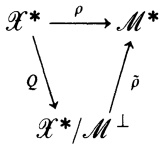
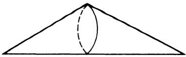

# V. Weak Topologies

CHAPTER V

# Weak Topologies

The principal objects of study in this chapter are the weak topology on a Banach space and the weak-star topology on its dual. In order to carry out this study efficiently, the first two sections are devoted to the study of the weak topology on a locally convex space.

## §1. Duality

As in §IV.4, for a LCS $\mathcal X$, let $\mathcal X^*$ denote the space of continuous linear functionals on $\mathcal X$. If $x^*,y^*\in\mathcal X^*$ and $\alpha\in\mathbb F$, then $(\alpha x^*+y^*)(x)\equiv\alpha x^*(x)+y^*(x)$, $x$ in $\mathcal X$, defines an element $\alpha x^*+y^*$ in $\mathcal X^*$. Thus $\mathcal X^*$ has a natural vector-space structure.

It is convenient and, more importantly, helpful to introduce the notation

$$
\langle x,x^*\rangle
$$

to stand for $x^*(x)$, for $x$ in $\mathcal X$ and $x^*$ in $\mathcal X^*$. Also, because of a certain symmetry, we will use $\langle x^*,x\rangle$ to stand for $x^*(x)$. Thus

$$
x^*(x)=\langle x,x^*\rangle=\langle x^*,x\rangle.
$$

We begin by recalling two definitions (IV.1.7 and IV.1.8).

**1.1. Definition.** If $\mathcal X$ is a LCS, the *weak topology* on $\mathcal X$, denoted by “wk” or $\sigma(\mathcal X,\mathcal X^*)$, is the topology defined by the family of seminorms $\{p_{x^*}:x^*\in\mathcal X^*\}$, where

$$
p_{x^*}(x)=|\langle x,x^*\rangle|.
$$

The *weak-star topology* on $\mathcal X^*$, denoted by “wk*” or $\sigma(\mathcal X^*,\mathcal X)$, is the

topology defined by the seminorms $\{p_x:x\in\mathcal X\}$, where

$$
p_x(x^*)=|\langle x,x^*\rangle|.
$$

So a subset $U$ of $\mathcal X$ is weakly open if and only if for every $x_0$ in $U$ there is an $\varepsilon>0$ and there are $x_1^*,\ldots,x_n^*$ in $\mathcal X^*$ such that

$$
\bigcap_{k=1}^{n}\{x\in\mathcal X:|\langle x-x_0,x_k^*\rangle|<\varepsilon\}\subseteq U.
$$

A net $\{x_i\}$ in $\mathcal X$ converges weakly to $x_0$ if and only if $\langle x_i,x^*\rangle\to\langle x_0,x^*\rangle$ for every $x^*$ in $\mathcal X^*$. (What are the analogous statements for the weak-star topology?)

Note that both $(\mathcal X,\mathrm{wk})$ and $(\mathcal X^*,\mathrm{wk}^*)$ are LCS’s. Also, $\mathcal X$ already possesses a topology so that $\mathrm{wk}$ is a second topology on $\mathcal X$. However, $\mathcal X^*$ has no topology to begin with so that $\mathrm{wk}^*$ is the only topology on $\mathcal X^*$. Of course if $\mathcal X$ is a normed space, this last statement is not correct since $\mathcal X^*$ is a Banach space (III.5.4). The reader should also be cautioned that some authors abuse the language and use the term weak topology to designate both the weak and weak-star topologies. Finally, pay attention to the positions of $\mathcal X$ and $\mathcal X^*$ in the notation $\sigma(\mathcal X,\mathcal X^*)=\mathrm{wk}$ and $\sigma(\mathcal X^*,\mathcal X)=\mathrm{wk}^*$.

If $\{x_i\}$ is a net in $\mathcal X$ and $x_i\to0$ in $\mathcal X$, then for every $x^*$ in $\mathcal X^*$, $\langle x_i,x^*\rangle\to0$. So if $\mathcal T$ is the topology on $\mathcal X$, $\mathrm{wk}\subseteq\mathcal T$ (A.2.9) and each $x^*$ in $\mathcal X^*$ is weakly continuous. The first result gives the converse of this.

**1.2. Theorem.** If $\mathcal X$ is a LCS, $(\mathcal X,\mathrm{wk})^*=\mathcal X^*$.

**Proof.** Since every weakly open set is open in the original topology, each $f$ in $(\mathcal X,\mathrm{wk})^*$ belongs to $\mathcal X^*$. The converse is even easier. $\blacksquare$

**1.3. Theorem.** If $\mathcal X$ is a LCS, $(\mathcal X^*,\mathrm{wk}^*)^*=\mathcal X$.

**Proof.** Clearly if $x\in\mathcal X$, $x^*\mapsto\langle x,x^*\rangle$ is a $\mathrm{wk}^*$ continuous functional on $\mathcal X^*$. Hence $\mathcal X\subseteq(\mathcal X^*,\mathrm{wk}^*)^*$. Conversely, if $f\in(\mathcal X^*,\mathrm{wk}^*)^*$, then (IV.3.1) implies there are vectors $x_1,\ldots,x_n$ in $\mathcal X$ such that $|f(x^*)|\leq\sum_{k=1}^{n}|\langle x_k,x^*\rangle|$ for all $x^*$ in $\mathcal X^*$. This implies that $\bigcap\{\ker x_k:1\leq k\leq n\}\subseteq\ker f$. By (A.1.4) there are scalars $\alpha_1,\ldots,\alpha_n$ such that $f=\sum_{k=1}^{n}\alpha_kx_k$; hence $f\in\mathcal X$. $\blacksquare$

So $\mathcal X$ is the dual of a LCS—$(\mathcal X^*,\mathrm{wk}^*)$—and hence has a weak-star topology—$\sigma((\mathcal X,\mathrm{wk}^*),\mathcal X^*)$. As an exercise in notational juggling, note that $\sigma((\mathcal X,\mathrm{wk}^*),\mathcal X^*)=\sigma(\mathcal X,\mathcal X^*)$.

All unmodified topological statements about $\mathcal X$ refer to its original topology. So if $A\subseteq\mathcal X$ and we say that it is closed, we mean that $A$ is closed in the original topology of $\mathcal X$. To say that $A$ is closed in the weak topology of $\mathcal X$ we say that $A$ is weakly closed or $\mathrm{wk}$-closed. Also $\operatorname{cl}A$ means the closure of $A$ in the original topology while $\mathrm{wk}-\operatorname{cl}A$ means the closure of $A$ in the weak topology. The next result shows that under certain circumstances this distinction is unnecessary.

**1.4. Theorem.** *If $\mathcal X$ is a LCS and $A$ is a convex subset of $\mathcal X$, then $\operatorname{cl}A=\mathrm{wk}\text{-}\operatorname{cl}A$.*

**Proof.** If $\mathcal T$ is the original topology of $\mathcal X$, then $\mathrm{wk}\subseteq\mathcal T$, hence $\operatorname{cl}A\subseteq\mathrm{wk}\text{-}\operatorname{cl}A$. Conversely, if $x\in\mathcal X\setminus\operatorname{cl}A$, then (IV.3.13) implies that there is an $x^*$ in $\mathcal X^*$, an $\alpha$ in $\mathbb R$, and an $\varepsilon>0$ such that

$$
\operatorname{Re}\langle a,x^*\rangle\leq\alpha<\alpha+\varepsilon\leq\operatorname{Re}\langle x,x^*\rangle
$$

for all $a$ in $\operatorname{cl}A$. Hence $\operatorname{cl}A\subseteq B\equiv\{y\in\mathcal X:\operatorname{Re}\langle y,x^*\rangle\leq\alpha\}$. But $B$ is clearly $\mathrm{wk}$-closed since $x^*$ is $\mathrm{wk}$-continuous. Thus $\mathrm{wk}\text{-}\operatorname{cl}A\subseteq B$. Since $x\notin B$, $x\notin\mathrm{wk}\text{-}\operatorname{cl}A$. ■

**1.5. Corollary.** *A convex subset of $\mathcal X$ is closed if and only if it is weakly closed.*

There is a useful observation that can be made here. Because of (III.6.3) it can be shown that if $\mathcal X$ is a complex linear space, then the weak topology on $\mathcal X$ is the same as the weak topology it has if it is considered as a real linear space (Exercise 4). This will be used in the future.

**1.6. Definition.** If $A\subseteq\mathcal X$, the *polar* of $A$, denoted by $A^\circ$, is the subset of $\mathcal X^*$ defined by

$$
A^\circ\equiv\{x^*\in\mathcal X^*:|\langle a,x^*\rangle|\leq 1\text{ for all }a\text{ in }A\}.
$$

If $B\subseteq\mathcal X^*$, the *prepolar* of $B$, denoted by ${}^\circ B$, is the subset of $\mathcal X$ defined by

$$
{}^\circ B\equiv\{x\in\mathcal X:|\langle x,b^*\rangle|\leq 1\text{ for all }b^*\text{ in }B\}.
$$

If $A\subseteq\mathcal X$ the *bipolar* of $A$ is the set ${}^\circ(A^\circ)$. If there is no confusion, then it is also denoted by ${}^\circ A^\circ$.

The prototype for this idea is that if $A$ is the unit ball in a normed space, $A^\circ$ is the unit ball in the dual space.

**1.7. Proposition.** *If $A\subseteq\mathcal X$, then*

(a) $A^\circ$ is convex and balanced.

(b) If $A_1\subseteq A$, then $A^\circ\subseteq A_1^\circ$.

(c) If $\alpha\in\mathbb F$ and $\alpha\ne 0$, $(\alpha A)^\circ=\alpha^{-1}A^\circ$.

(d) $A\subseteq{}^\circ A^\circ$.

(e) $A^\circ=({}^\circ A^\circ)^\circ$.

**Proof.** The proofs of parts (a) through (d) are left as an exercise. To prove (e) note that $A\subseteq{}^\circ A^\circ$ by (d), so $({}^\circ A^\circ)^\circ\subseteq A^\circ$ by (b). But $A^\circ\subseteq{}^\circ(A^\circ)^\circ$ by an analog of (d) for prepolars. Also, ${}^\circ(A^\circ)^\circ=({}^\circ A^\circ)^\circ$. ■

There is an analogous result for prepolars. In fact, it is more than analogy that is at work here. By Theorem 1.3, $(\mathcal X^*,\mathrm{wk}^*)^*=\mathcal X$. Thus the result for prepolars is a consequence of the preceding proposition.

If $A$ is a linear manifold in $\mathcal X$ and $x^*\in A^\circ$, then $ta\in A$ for all $t>0$ and $a$ in $A$. So $1\geqslant|\langle ta,x^*\rangle|=t|\langle a,x^*\rangle|$. Letting $t\to\infty$ show that $A^\circ=A^\perp$, where

$$
A^\perp\equiv\{x^*\text{ in }\mathcal X^*:\langle a,x^*\rangle=0\text{ for all }a\text{ in }A\}.
$$

Similarly, if $B$ is a linear manifold in $\mathcal X^*$, ${}^\circ B={}^\perp B$, where

$$
{}^\perp B\equiv\{x\text{ in }\mathcal X:\langle x,b^*\rangle=0\text{ for all }b^*\text{ in }B\}.
$$

The next result is a slight generalization of Corollary IV.3.12.

**1.8. Bipolar Theorem.** *If $\mathcal X$ is a LCS and $A\subseteq\mathcal X$, then ${}^\circ A^\circ$ is the closed convex balanced hull of $A$.*

**PROOF.** Let $A_1$ be the intersection of all closed convex balanced subsets of $\mathcal X$ that contain $A$. It must be shown that $A_1={}^\circ A^\circ$. Since ${}^\circ A^\circ$ is closed, convex, and balanced and $A\subseteq{}^\circ A^\circ$, it follows that $A_1\subseteq{}^\circ A^\circ$.

Now assume that $x_0\in\mathcal X\setminus A_1$. $A_1$ is a closed convex balanced set so by (IV.3.13) there is an $x^*$ in $\mathcal X^*$, an $\alpha$ in $\mathbb R$, and an $\varepsilon>0$ such that

$$
\operatorname{Re}\langle a_1,x^*\rangle<\alpha<\alpha+\varepsilon<\operatorname{Re}\langle x_0,x^*\rangle
$$

for all $a_1$ in $A_1$. Since $0\in A_1$, $0=\langle0,x^*\rangle<\alpha$. By replacing $x^*$ with $\alpha^{-1}x^*$ it follows that there is an $\varepsilon>0$ (not the same as the first $\varepsilon$) such that

$$
\operatorname{Re}\langle a_1,x^*\rangle<1<1+\varepsilon<\operatorname{Re}\langle x_0,x^*\rangle
$$

for all $a_1$ in $A_1$. If $a_1\in A_1$ and $\langle a_1,x^*\rangle=|\langle a_1,x^*\rangle|e^{-i\theta}$, then $e^{-i\theta}a_1\in A_1$ and so

$$
|\langle a_1,x^*\rangle|=\operatorname{Re}\langle e^{-i\theta}a_1,x^*\rangle<1<\operatorname{Re}\langle x_0,x^*\rangle
$$

for all $a_1$ in $A_1$. Hence $x^*\in A_1^\circ$, and $x_0\notin{}^\circ A^\circ$. That is, $\mathcal X\setminus A_1\subseteq\mathcal X\setminus{}^\circ A^\circ$. $\blacksquare$

**1.9. Corollary.** *If $\mathcal X$ is a LCS and $B\subseteq\mathcal X^*$, then $({}^\circ B)^\circ$ is the wk$^*$ closed convex balanced hull of $B$.*

Using the weak and weak$^*$ topologies and the concept of a bounded subset of a LCS (IV.2.5), it is possible to rephrase the results associated with the Principle of Uniform Boundedness (§III.14). As an example we offer the following reformulation of Corollary III.14.5 (which is, in fact, the most general form of the result).

**1.10. Theorem.** *If $\mathcal X$ is a Banach space, $\mathcal Y$ is a normed space, and $\mathcal A\subseteq\mathcal B(\mathcal X,\mathcal Y)$ such that for every $x$ in $\mathcal X$, $\{Ax:A\in\mathcal A\}$ is weakly bounded in $\mathcal Y$, then $\mathcal A$ is norm bounded in $\mathcal B(\mathcal X,\mathcal Y)$.*

## EXERCISES

1. Show that wk is the smallest topology on $\mathcal X$ such that each $x^*$ in $\mathcal X^*$ is continuous.
2. Show that wk$^*$ is the smallest topology on $\mathcal X^*$ such that for each $x$ in $\mathcal X$, $x^*\mapsto\langle x,x^*\rangle$ is continuous.

3. Prove Theorem 1.3.

4. Let $\mathscr{X}$ be a complex LCS and let $\mathscr{X}_{\mathbb R}^{*}$ denote the collection of all continuous real linear functionals on $\mathscr{X}$. Use the elements of $\mathscr{X}_{\mathbb R}^{*}$ to define seminorms on $\mathscr{X}$ and let $\sigma(\mathscr{X},\mathscr{X}_{\mathbb R}^{*})$ be the corresponding topology. Show that $\sigma(\mathscr{X},\mathscr{X}^{*})=\sigma(\mathscr{X},\mathscr{X}_{\mathbb R}^{*})$.

5. Prove the remainder of Proposition 1.7.

6. If $A\subseteq\mathscr{X}$, show that $A$ is weakly bounded if and only if $A^{\circ}$ is absorbing in $\mathscr{X}^{*}$.

7. Let $\mathscr{X}$ be a normed space and let $\{x_n\}$ be a sequence in $\mathscr{X}$ such that $x_n\to x$ weakly. Show that there is a sequence $\{y_n\}$ such that $y_n\in\operatorname{co}\{x_1,x_2,\ldots,x_n\}$ and $\|y_n-x\|\to0$. (Hint: use Theorem 1.4.)

8. If $\mathscr{H}$ is a Hilbert space and $\{h_n\}$ is a sequence in $\mathscr{H}$ such that $h_n\to h$ weakly and $\|h_n\|\to\|h\|$, then $\|h_n-h\|\to0$. (The same type of result is true for $L^p$-spaces if $1<p<\infty$. See W.P. Novinger [1972].)

9. If $\mathscr{X}$ is a normed space show that the norm on $\mathscr{X}$ is lower semicontinuous for the weak topology and the norm of $\mathscr{X}^{*}$ is lower semicontinuous for the weak-star topology.

10. Suppose $\mathscr{X}$ is an infinite-dimensional normed space. If $S=\{x\in\mathscr{X}:\|x\|=1\}$, then the weak closure of $S$ is $\{x:\|x\|\leqslant1\}$.

## §2. The Dual of a Subspace and a Quotient Space

In §III.4 the quotient of a normed space $\mathscr{X}$ by a closed subspace $\mathcal{M}$ was defined and in (III.10.2) it was shown that the dual of a quotient space $\mathscr{X}/\mathcal{M}$ is isometrically isomorphic to $\mathcal{M}^{\perp}$. These results are generalized in this section to the setting of a LCS and, moreover, it is shown that when $(\mathscr{X}/\mathcal{M})^{*}$ and $\mathcal{M}^{\perp}$ are identified, the weak-star topology on $(\mathscr{X}/\mathcal{M})^{*}$ is precisely the relative weak-star topology that $\mathcal{M}^{\perp}$ receives as a subspace of $\mathscr{X}^{*}$.

The first result was presented in abbreviated form as Exercise IV.1.16.

**2.1. Proposition.** *If $p$ is a seminorm on $\mathscr{X}$, $\mathcal{M}$ is a linear manifold in $\mathscr{X}$, and $\bar p:\mathscr{X}/\mathcal{M}\to[0,\infty)$ is defined by*

$$
\bar p(x+\mathcal{M})=\inf\{p(x+y):y\in\mathcal{M}\},
$$

*then $\bar p$ is a seminorm on $\mathscr{X}/\mathcal{M}$. If $\mathscr{X}$ is a locally convex space and $\mathcal{P}$ is the family of all continuous seminorms on $\mathscr{X}$, then the family $\bar{\mathcal{P}}\equiv\{\bar p:p\in\mathcal{P}\}$ defines the quotient topology on $\mathscr{X}/\mathcal{M}$.*

**Proof.** Exercise.

Thus if $\mathscr{X}$ is a LCS and $\mathcal{M}\leqslant\mathscr{X}$, then $\mathscr{X}/\mathcal{M}$ is a LCS. Let $f\in(\mathscr{X}/\mathcal{M})^{*}$. If $Q:\mathscr{X}\to\mathscr{X}/\mathcal{M}$ is the natural map, then $f\circ Q\in\mathscr{X}^{*}$. Moreover, $f\circ Q\in\mathcal{M}^{\perp}$. Hence $f\mapsto f\circ Q$ is a map of $(\mathscr{X}/\mathcal{M})^{*}\to\mathcal{M}^{\perp}\subseteq\mathscr{X}^{*}$.

**2.2. Theorem.** *If $\mathcal X$ is a LCS, $\mathcal M\leq\mathcal X$, and $Q:\mathcal X\to\mathcal X/\mathcal M$ is the natural map, then $f\mapsto f\circ Q$ defines a linear bijection between $(\mathcal X/\mathcal M)^*$ and $\mathcal M^\perp$. If $(\mathcal X/\mathcal M)^*$ has its weak-star topology $\sigma((\mathcal X/\mathcal M)^*,\mathcal X/\mathcal M)$ and $\mathcal M^\perp$ has the relative weak-star topology $\sigma(\mathcal X^*,\mathcal X)|\mathcal M^\perp$, then this bijection is a homeomorphism. If $\mathcal X$ is a normed space, then this bijection is an isometry.*

**Proof.** Let $\rho:(\mathcal X/\mathcal M)^*\to\mathcal M^\perp$ be defined by $\rho(f)=f\circ Q$. It was shown prior to the statement of the theorem that $\rho$ is well defined and maps $(\mathcal X/\mathcal M)^*$ into $\mathcal M^\perp$. It is easy to see that $\rho$ is linear and if $0=\rho(f)=f\circ Q$, then $f=0$ since $Q$ is surjective. So $\rho$ is injective. Now let $x^*\in\mathcal M^\perp$ and define $f:\mathcal X/\mathcal M\to\mathbb F$ by $f(x+\mathcal M)=\langle x,x^*\rangle$. Because $\mathcal M\subseteq\ker x^*$, $f$ is well defined and linear. Also, $Q^{-1}\{x+\mathcal M:|f(x+\mathcal M)|<1\}=\{x\in\mathcal X:|\langle x,x^*\rangle|<1\}$ and this is open in $\mathcal X$ since $x^*$ is continuous. Thus $\{x+\mathcal M:|f(x+\mathcal M)|<1\}$ is open in $\mathcal X/\mathcal M$ and so $f$ is continuous. Clearly $\rho(f)=x^*$, so $\rho$ is a bijection.

If $\mathcal X$ is a normed space, it was shown in (III.10.2) that $\rho$ is an isometry. It remains to show that $\rho$ is a weak-star homeomorphism. Let $\mathrm{wk}^*=\sigma(\mathcal X^*,\mathcal X)$ and let $\sigma^*=\sigma((\mathcal X/\mathcal M)^*,\mathcal X/\mathcal M)$. If $\{f_i\}$ is a net in $(\mathcal X/\mathcal M)^*$ and $f_i\to0(\sigma^*)$, then for each $x$ in $\mathcal X$, $\langle x,\rho(f_i)\rangle=f_i(Q(x))\to0$. Hence $\rho(f_i)\to0(\mathrm{wk}^*)$. Conversely, if $\rho(f_i)\to0(\mathrm{wk}^*)$, then for each $x$ in $\mathcal X$, $f_i(x+\mathcal M)=\langle x,\rho(f_i)\rangle\to0$; hence $f_i\to0(\sigma^*)$. ■

Once again let $\mathcal M\leq\mathcal X$. If $x^*\in\mathcal X^*$, then the restriction of $\mathcal X^*$ to $\mathcal M$, $x^*|\mathcal M$, belongs to $\mathcal M^*$. Also, the Hahn–Banach Theorem implies that the map $x^*\mapsto x^*|\mathcal M$ is surjective. If $\rho(x^*)=x^*|\mathcal M$, then $\rho:\mathcal X^*\to\mathcal M^*$ is clearly linear as well as surjective. It fails, however, to be injective. How does it fail? It’s easy to see that $\ker\rho=\mathcal M^\perp$. Thus $\rho$ induces a linear bijection $\tilde\rho:\mathcal X^*/\mathcal M^\perp\to\mathcal M^*$.

**2.3. Theorem.** *If $\mathcal X$ is a LCS, $\mathcal M\leq\mathcal X$, and $\rho:\mathcal X^*\to\mathcal M^*$ is the restriction map, then $\rho$ induces a linear bijection $\tilde\rho:\mathcal X^*/\mathcal M^\perp\to\mathcal M^*$. If $\mathcal X^*/\mathcal M^\perp$ has the quotient topology induced by $\sigma(\mathcal X^*,\mathcal X)$ and $\mathcal M^*$ has its weak-star topology $\sigma(\mathcal M^*,\mathcal M)$, then $\tilde\rho$ is a homeomorphism. If $\mathcal X$ is a normed space, then $\tilde\rho$ is an isometry.*

**Proof.** The fact that $\tilde\rho$ is an isometry when $\mathcal X$ is a normed space was shown in (III.10.1). Let $\mathrm{wk}^*=\sigma(\mathcal M^*,\mathcal M)$ and let $\eta^*$ be the quotient topology on $\mathcal X^*/\mathcal M^\perp$ defined by $\sigma(\mathcal X^*,\mathcal X)$. Let $Q:\mathcal X^*\to\mathcal X^*/\mathcal M^\perp$ be the natural map. Therefore the diagram

commutes. If $y\in\mathcal M$, then the commutativity of the diagram implies that

$$
\begin{aligned}
Q^{-1}\bigl(\tilde\rho^{-1}\{y^*\in\mathcal M^*:|\langle y,y^*\rangle|<1\}\bigr)
&=Q^{-1}\{x^*+\mathcal M^\perp:|\langle y,x^*\rangle|<1\}\\
&=\{x^*\in\mathcal X^*:|\langle y,x^*\rangle|<1\},
\end{aligned}
$$

which is weak-star open in $\mathcal X^*$. Hence $\tilde\rho:(\mathcal X^*/\mathcal M^\perp,\eta^*)\to(\mathcal M^*,\mathrm{wk}^*)$ is continuous.

How is the topology on $\mathcal X^*/\mathcal M^\perp$ defined? If $x\in\mathcal X$, $p_x(x^*)=|\langle x,x^*\rangle|$ is a typical seminorm on $\mathcal X^*$. By Proposition 2.1, the topology on $\mathcal X^*/\mathcal M^\perp$ is defined by the seminorms $\{\bar p_x:x\in\mathcal X\}$, where

$$
\bar p_x(x^*+\mathcal M^\perp)
=\inf\{|\langle x,x^*+z^*\rangle|:z^*\in\mathcal M^\perp\}.
$$

**2.4. Claim.** If $x\notin\mathcal M$, then $\bar p_x=0$.

In fact, let $\mathcal L=\{\alpha x:\alpha\in\mathbb F\}$. If $x\notin\mathcal M$, then $\mathcal L\cap\mathcal M=(0)$. Since $\dim\mathcal L<\infty$, $\mathcal M$ is topologically complemented in $\mathcal L+\mathcal M$. Let $x^*\in\mathcal X^*$ and define $f:\mathcal L+\mathcal M\to\mathbb F$ by $f(\alpha x+y)=\langle y,x^*\rangle$ for $y$ in $\mathcal M$ and $\alpha$ in $\mathbb F$. Because $\mathcal M$ is topologically complemented in $\mathcal L+\mathcal M$, if $\alpha_i x+y_i\to0$, then $y_i\to0$. Hence $f(\alpha_i x+y_i)=\langle y_i,x^*\rangle\to0$. Thus $f$ is continuous. By the Hahn–Banach Theorem, there is an $x_1^*$ in $\mathcal X^*$ that extends $f$. Note that $x^*-x_1^*\in\mathcal M^\perp$. Thus $\bar p_x(x^*+\mathcal M^\perp)=\bar p_x(x_1^*+\mathcal M^\perp)\leq p_x(x_1^*)=|\langle x,x_1^*\rangle|=0$. This proves (2.4).

Now suppose that $\{x_i^*+\mathcal M^\perp\}$ is a net in $\mathcal X^*/\mathcal M^\perp$ such that $\tilde\rho(x_i^*+\mathcal M^\perp)=x_i^*|_{\mathcal M}\to0(\mathrm{wk}^*)$ in $\mathcal M^*$. If $x\in\mathcal X$ and $x\notin\mathcal M$, the Claim (2.4) implies that $\bar p_x(x_i^*+\mathcal M^\perp)=0$. If $x\in\mathcal M$, then $\bar p_x(x_i^*+\mathcal M^\perp)\leq|\langle x,x_i^*\rangle|\to0$. Thus $x_i^*+\mathcal M^\perp\to0(\eta^*)$ and $\tilde\rho$ is a weak-star homeomorphism. ■

## Exercises

1. In relation to Claim 2.4, show that if $\mathcal L\leq\mathcal X$, $\dim\mathcal L<\infty$, and $\mathcal M\leq\mathcal X$, then $\mathcal L+\mathcal M$ is closed.

2. Show that if $\mathcal M\leq\mathcal X$ and $\mathcal M$ is topologically complemented in $\mathcal X$, then $\mathcal M^\perp$ is topologically complemented in $\mathcal X^*$ and that its complement is weak-star and linearly homeomorphic to $\mathcal X^*/\mathcal M^\perp$.

## §3. Alaoglu’s Theorem

If $\mathcal X$ is any normed space, let’s agree to denote by $\operatorname{ball}\mathcal X$ the closed unit ball in $\mathcal X$. So $\operatorname{ball}\mathcal X\equiv\{x\in\mathcal X:\|x\|\leq1\}$.

**3.1. Alaoglu’s Theorem.** *If $\mathcal X$ is a normed space, then $\operatorname{ball}\mathcal X^*$ is weak-star compact.*

**Proof.** For each $x$ in $\operatorname{ball}\mathcal X$, let $D_x\equiv\{\alpha\in\mathbb F:|\alpha|\leq1\}$ and put $D=\prod\{D_x:x\in\operatorname{ball}\mathcal X\}$. By Tychonoff’s Theorem, $D$ is compact. Define $\tau:\operatorname{ball}\mathcal X^*\to D$ by

$$
\tau(x^*)(x)=\langle x,x^*\rangle.
$$

That is, $\tau(x^*)$ is the element of the product space $D$ whose $x$ coordinate is $\langle x,x^*\rangle$. It will be shown that $\tau$ is a homeomorphism from $(\operatorname{ball}\mathcal X^*,\mathrm{wk}^*)$

onto $\tau(\operatorname{ball}\mathcal{X}^*)$ with the relative topology from $D$, and that $\tau(\operatorname{ball}\mathcal{X}^*)$ is closed in $D$. Thus it will follow that $\tau(\operatorname{ball}\mathcal{X}^*)$, and hence $\operatorname{ball}\mathcal{X}^*$, is compact.

To see that $\tau$ is injective, suppose that $\tau(x_1^*)=\tau(x_2^*)$. Then for each $x$ in $\operatorname{ball}\mathcal{X}$, $\langle x,x_1^*\rangle=\langle x,x_2^*\rangle$. It follows by definition that $x_1^*=x_2^*$.

Now let $\{x_i^*\}$ be a net in $\operatorname{ball}\mathcal{X}^*$ such that $x_i^*\to x^*$. Then for each $x$ in $\operatorname{ball}\mathcal{X}$, $\tau(x_i^*)(x)=\langle x,x_i^*\rangle\to\langle x,x^*\rangle=\tau(x^*)(x)$. That is, each coordinate of $\{\tau(x_i^*)\}$ converges to $\tau(x^*)$. Hence $\tau(x_i^*)\to\tau(x^*)$ and $\tau$ is continuous.

Let $x_i^*$ be a net in $\operatorname{ball}\mathcal{X}^*$, let $f\in D$, and suppose $\tau(x_i^*)\to f$ in $D$. So $f(x)=\lim\langle x,x_i^*\rangle$ exists for every $x$ in $\operatorname{ball}\mathcal{X}$. If $x\in\mathcal{X}$, let $\alpha>0$ such that $\|\alpha x\|\leq 1$. Then define $f(x)=\alpha^{-1}f(\alpha x)$. If also $\beta>0$ such that $\|\beta x\|\leq 1$, then $\alpha^{-1}f(\alpha x)=\alpha^{-1}\lim\langle\alpha x,x_i^*\rangle=\beta^{-1}\lim\langle\beta x,x_i^*\rangle=\beta^{-1}f(\beta x)$. So $f(x)$ is well defined. It is left as an exercise for the reader to show that $f:\mathcal{X}\to\mathbb{F}$ is a linear functional. Also, if $\|x\|\leq 1$, $f(x)\in D_x$ so $|f(x)|\leq 1$. Thus $x^*\in\operatorname{ball}\mathcal{X}^*$ and $\tau(x^*)=f$. Thus $\tau(\operatorname{ball}\mathcal{X}^*)$ is closed in $D$. This implies that $\tau(\operatorname{ball}\mathcal{X}^*)$ is compact. The proof that $\tau^{-1}$ is continuous is left to the reader. $\blacksquare$

## Exercises

1. Show that the functional $f$ occurring in the proof of Alaoglu’s Theorem is linear.

2. Let $\mathcal{X}$ be a LCS and let $V$ be an open neighborhood of $0$. Show that $V^\circ$ is weak-star compact in $\mathcal{X}^*$.

3. If $\mathcal{X}$ is a Banach space, show that there is a compact space $X$ such that $\mathcal{X}$ is isometrically isomorphic to a closed subspace of $C(X)$.

## §4. Reflexivity Revisited

In §III.11 a Banach space $\mathcal{X}$ was defined to be reflexive if the natural embedding of $\mathcal{X}$ into its double dual, $\mathcal{X}^{**}$, is surjective. Recall that if $x\in\mathcal{X}$, then the image of $x$ in $\mathcal{X}^{**}$, $\hat{x}$, is defined by (using our recent notation)

$$
\langle x^*,\hat{x}\rangle=\langle x,x^*\rangle
$$

for all $x^*$ in $\mathcal{X}^*$. Also recall that the map $x\mapsto\hat{x}$ is an isometry.

To begin, note that $\mathcal{X}^{**}$, being the dual space of $\mathcal{X}^*$, has its weak-star topology $\sigma(\mathcal{X}^{**},\mathcal{X}^*)$. Also note that if $\mathcal{X}$ is considered as a subspace of $\mathcal{X}^{**}$, then the topology $\sigma(\mathcal{X}^{**},\mathcal{X}^*)$ when relativized to $\mathcal{X}$ is $\sigma(\mathcal{X},\mathcal{X}^*)$, the weak topology on $\mathcal{X}$. This will be important later when it is combined with Alaoglu’s Theorem applied to $\mathcal{X}^{**}$ in the discussion of reflexivity. But now the next result must occupy us.

**4.1. Proposition.** *If $\mathcal{X}$ is a normed space, then $\operatorname{ball}\mathcal{X}$ is $\sigma(\mathcal{X}^{**},\mathcal{X}^*)$ dense in $\operatorname{ball}\mathcal{X}^{**}$.*

**Proof.** Let $B=$ the $\sigma(\mathcal{X}^{**},\mathcal{X}^*)$ closure of $\operatorname{ball}\mathcal{X}$ in $\mathcal{X}^{**}$; clearly, $B\subseteq\operatorname{ball}\mathcal{X}^{**}$. If there is an $x_0^{**}$ in $\operatorname{ball}\mathcal{X}^{**}\setminus B$, then the Hahn–Banach Theorem implies

there is an $x^*$ in $\mathcal X^*$, an $\alpha$ in $\mathbf R$, and an $\varepsilon>0$ such that

$$
\operatorname{Re}\langle x,x^*\rangle<\alpha<\alpha+\varepsilon<\operatorname{Re}\langle x^*,x_0^{**}\rangle
$$

for all $x$ in $\operatorname{ball}\mathcal X$. (Exactly how does the Hahn–Banach Theorem imply this?) Since $0\in\operatorname{ball}\mathcal X$, $0<\alpha$. Dividing by $\alpha$ and replacing $x^*$ by $\alpha^{-1}x^*$, it may be assumed that there is an $x^*$ in $\mathcal X^*$ and an $\varepsilon>0$ such that

$$
\operatorname{Re}\langle x,x^*\rangle<1<1+\varepsilon<\operatorname{Re}\langle x^*,x_0^{**}\rangle
$$

for all $x$ in $\operatorname{ball}\mathcal X$. Since $e^{i\theta}x\in\operatorname{ball}\mathcal X$ whenever $x\in\operatorname{ball}\mathcal X$, this implies that $|\langle x,x^*\rangle|\leq 1$ if $\|x\|\leq 1$. Hence $x^*\in\operatorname{ball}\mathcal X^*$. But then $1+\varepsilon<\operatorname{Re}\langle x^*,x_0^{**}\rangle\leq|\langle x^*,x_0^{**}\rangle|\leq\|x_0^{**}\|\leq 1$, a contradiction. ■

**4.2. Theorem.** *If $\mathcal X$ is a Banach space, the following statements are equivalent.*

(a) $\mathcal X$ is reflexive.

(b) $\mathcal X^*$ is reflexive.

(c) $\sigma(\mathcal X^*,\mathcal X)=\sigma(\mathcal X^*,\mathcal X^{**})$.

(d) $\operatorname{ball}\mathcal X$ is weakly compact.

**Proof.** (a)$\Rightarrow$(c): This is clear since $\mathcal X=\mathcal X^{**}$.

(d)$\Rightarrow$(a): Note that $\sigma(\mathcal X^{**},\mathcal X^*)|\mathcal X=\sigma(\mathcal X,\mathcal X^*)$. By (d), $\operatorname{ball}\mathcal X$ is $\sigma(\mathcal X^{**},\mathcal X^*)$ closed in $\operatorname{ball}\mathcal X^{**}$. But the preceding proposition implies $\operatorname{ball}\mathcal X$ is $\sigma(\mathcal X^{**},\mathcal X^*)$ dense in $\operatorname{ball}\mathcal X^{**}$. Hence $\operatorname{ball}\mathcal X=\operatorname{ball}\mathcal X^{**}$ and so $\mathcal X$ is reflexive.

(c)$\Rightarrow$(b): By Alaoglu’s Theorem, $\operatorname{ball}\mathcal X^*$ is $\sigma(\mathcal X^*,\mathcal X)$-compact. By (c), $\operatorname{ball}\mathcal X^*$ is $\sigma(\mathcal X^*,\mathcal X^{**})$ compact. Since it has already been shown that (d) implies (a), this implies that $\mathcal X^*$ is reflexive.

(b)$\Rightarrow$(a): Now $\operatorname{ball}\mathcal X$ is norm closed in $\mathcal X^{**}$; hence $\operatorname{ball}\mathcal X$ is $\sigma(\mathcal X^{**},\mathcal X^{***})$ closed in $\mathcal X^{**}$ (Corollary 1.5). Since $\mathcal X^*=\mathcal X^{***}$ by (b), this says that $\operatorname{ball}\mathcal X$ is $\sigma(\mathcal X^{**},\mathcal X^*)$ closed in $\mathcal X^{**}$. But, according to (4.1), $\operatorname{ball}\mathcal X$ is $\sigma(\mathcal X^{**},\mathcal X^*)$ dense in $\operatorname{ball}\mathcal X^{**}$. Hence $\operatorname{ball}\mathcal X=\operatorname{ball}\mathcal X^{**}$ and $\mathcal X$ is reflexive.

(a)$\Rightarrow$(d): By Alaoglu’s Theorem, $\operatorname{ball}\mathcal X^{**}$ is $\sigma(\mathcal X^{**},\mathcal X^*)$ compact. Since $\mathcal X=\mathcal X^{**}$, this says that $\operatorname{ball}\mathcal X$ is $\sigma(\mathcal X,\mathcal X^*)$ compact. ■

**4.3. Corollary.** *If $\mathcal X$ is a reflexive Banach space and $\mathcal M\leq\mathcal X$, then $\mathcal M$ is a reflexive Banach space.*

**Proof.** Note that $\operatorname{ball}\mathcal M=\mathcal M\cap[\operatorname{ball}\mathcal X]$, so $\operatorname{ball}\mathcal M$ is $\sigma(\mathcal X,\mathcal X^*)$ compact. It remains to show that $\sigma(\mathcal X,\mathcal X^*)|\mathcal M=\sigma(\mathcal M,\mathcal M^*)$. But this follows by (2.3). (How?) ■

Call a sequence $\{x_n\}$ in $\mathcal X$ a *weakly Cauchy sequence* if for every $x^*$ in $\mathcal X^*$, $\{\langle x_n,x^*\rangle\}$ is a Cauchy sequence in $\mathbf F$.

**4.4. Corollary.** *If $\mathcal X$ is reflexive, then every weakly Cauchy sequence in $\mathcal X$ converges weakly. That is, $\mathcal X$ is weakly sequentially complete.*

**Proof.** Since $\{\langle x_n,x^*\rangle\}$ is a Cauchy sequence in $\mathbf F$ for each $x^*$ in $\mathcal X^*$, $\{x_n\}$

is weakly bounded. By the PUB there is a constant $M$ such that $\|x_n\|\leq M$ for all $n\geq 1$. But $\{x\in\mathcal X:\|x\|\leq M\}$ is weakly compact since $\mathcal X$ is reflexive. Thus there is an $x$ in $\mathcal X$ such that $x_n\xrightarrow[\mathrm{cl}]{}x$ weakly. But for each $x^*$ in $\mathcal X^*$, $\lim\langle x_n,x^*\rangle$ exists. Hence $\langle x_n,x^*\rangle\to\langle x,x^*\rangle$, so $x_n\to x$ weakly. ■

Not all Banach spaces are weakly sequentially complete.

**4.5. Example.** $C[0,1]$ is not weakly sequentially complete. In fact, let $f_n(t)=(1-nt)$ if $0\leq t\leq 1/n$ and $f_n(t)=0$ if $1/n\leq t\leq 1$. If $\mu\in M[0,1]$, then $\int f_n\,d\mu\to\mu(\{0\})$ by the Monotone Convergence Theorem. Hence $\{f_n\}$ is a weakly Cauchy sequence. However, $\{f_n\}$ does not converge weakly to any continuous function on $[0,1]$.

**4.6. Corollary.** *If $\mathcal X$ is a reflexive Banach space, $\mathcal M\leq\mathcal X$, and $x_0\in\mathcal X\setminus\mathcal M$, then there is a point $y_0$ in $\mathcal M$ such that $\|x_0-y_0\|=\operatorname{dist}(x_0,\mathcal M)$.*

**PROOF.** $x\mapsto\|x-x_0\|$ is weakly lower semicontinuous (Exercise 1.9). If $d=\operatorname{dist}(x_0,\mathcal M)$, then $\mathcal M\cap\{x:\|x-x_0\|\leq 2d\}$ is weakly compact and a lower semicontinuous function attains its minimum on a compact set. ■

It is not generally true that the distance from a point to a linear subspace is attained. If $\mathcal M\subseteq\mathcal X$, call $\mathcal M$ *proximinal* if for every $x$ in $\mathcal X$ there is a $y$ in $\mathcal M$ such that $\|x-y\|=\operatorname{dist}(x,\mathcal M)$. So if $\mathcal X$ is reflexive, Corollary 4.6 implies that every closed linear subspace of $\mathcal X$ is proximinal. If $\mathcal X$ is any Banach space and $\mathcal M$ is a finite dimensional subspace, then it is easy to see that $\mathcal M$ is proximinal. How about if $\dim(\mathcal X/\mathcal M)<\infty$?

**4.7. Proposition.** *If $\mathcal X$ is a Banach space and $x^*\in\mathcal X^*$, then $\ker x^*$ is proximinal if and only if there is an $x$ in $\mathcal X$, $\|x\|=1$, such that $\langle x,x^*\rangle=\|x^*\|$.*

**PROOF.** Let $\mathcal M=\ker x^*$ and suppose that $\mathcal M$ is proximinal. If $f:\mathcal X/\mathcal M\to\mathbb F$ is defined by $f(x+\mathcal M)=\langle x,x^*\rangle$, then $f$ is a linear functional and $\|f\|=\|x^*\|$. Since $\dim\mathcal X/\mathcal M=1$, there is an $x$ in $\mathcal X$ such that $\|x+\mathcal M\|=1$ and $f(x+\mathcal M)=\|f\|$. Because $\mathcal M$ is proximinal, there is a $y$ in $\mathcal M$ such that $1=\|x+\mathcal M\|=\|x+y\|$. Thus $\langle x+y,x^*\rangle=\langle x,x^*\rangle=f(x+\mathcal M)=\|f\|=\|x^*\|$.

Now assume that there is an $x_0$ in $\mathcal X$ such that $\|x_0\|=1$ and $\langle x_0,x^*\rangle=\|x^*\|$. If $x\in\mathcal X$ and $\|x+\mathcal M\|=\alpha>0$, then $\|\alpha^{-1}x+\mathcal M\|=1$. But also $\|x_0+\mathcal M\|=1$. (Why?) Since $\dim\mathcal X/\mathcal M=1$, there is a $\beta$ in $\mathbb F$, $|\beta|=1$, such that $\alpha^{-1}x+\mathcal M=\beta(x_0+\mathcal M)$. Hence $\alpha^{-1}x-\beta x_0\in\mathcal M$, or, equivalently, $x-\alpha\beta x_0\in\mathcal M$. However, $\|x-(x-\alpha\beta x_0)\|=\|\alpha\beta x_0\|=\alpha=\operatorname{dist}(x,\mathcal M)$. So the distance from $x$ to $\mathcal M$ is attained at $x-\alpha\beta x_0$. ■

**4.8. Example.** If $L:C[0,1]\to\mathbb F$ is defined by

$$
L(f)=\int_0^{1/2}f(x)\,dx-\int_{1/2}^{1}f(x)\,dx,
$$

then $\ker L$ is not proximinal.

There is a result in James [1964b] that states that a Banach space is reflexive if and only if every closed hyperplane is proximinal. This result is very deep. A nice reference on reflexivity is Yang [1967].

## Exercises

1. Show that if $\mathcal X$ is reflexive and $\mathcal M\leqslant\mathcal X$, then $\mathcal X/\mathcal M$ is reflexive.

2. If $\mathcal X$ is a Banach space, $\mathcal M\leqslant\mathcal X$, and both $\mathcal M$ and $\mathcal X/\mathcal M$ are reflexive, must $\mathcal X$ be reflexive?

3. If $(X,\Omega,\mu)$ is a $\sigma$-finite measure space, show that $L^1(X,\Omega,\mu)$ is reflexive if and only if it is finite dimensional.

4. Give the details of the proofs of the statements made in Example 4.5.

5. Verify the statement made in Example 4.8.

6. If $(X,\Omega,\mu)$ is a $\sigma$-finite measure space, show that $L^\infty(\mu)$ is weak-star sequentially complete but is reflexive if and only if it is finite dimensional.

7. Let $X$ be compact and suppose there is a norm on $C(X)$ that is given by an inner product making $C(X)$ into a Hilbert space such that for every $x$ in $X$ the functional $f\mapsto f(x)$ on $C(X)$ is continuous with respect to the Hilbert space norm. Show that $X$ is finite.

## §5. Separability and Metrizability

The weak and weak-star topologies on an infinite dimensional Banach space are never metrizable. It is possible, however, to show that under certain conditions these topologies are metrizable when restricted to bounded sets. In applications this is often sufficient.

**5.1. Theorem.** *If $\mathcal X$ is a Banach space, then $\operatorname{ball}\mathcal X^*$ is weak-star metrizable if and only if $\mathcal X$ is separable.*

**Proof.** Assume that $\mathcal X$ is separable and let $\{x_n\}$ be a countable dense subset of $\operatorname{ball}\mathcal X$. For each $n$ let $D_n=\{\alpha\in\mathbb F:|\alpha|\leqslant1\}$. Put $X=\prod_{n=1}^{\infty}D_n$; $X$ is a compact metric space. So if $(\operatorname{ball}\mathcal X^*,\mathrm{wk}^*)$ is homeomorphic to a subset of $X$, $\operatorname{ball}\mathcal X^*$ is weak-star metrizable.

Define $\tau:\operatorname{ball}\mathcal X^*\to X$ by $\tau(x^*)=\{\langle x_n,x^*\rangle\}$. If $\{x_i^*\}$ is a net in $\operatorname{ball}\mathcal X^*$ and $x_i^*\to x^*\ (\mathrm{wk}^*)$, then for each $n\geqslant1$, $\langle x_n,x_i^*\rangle\to\langle x_n,x^*\rangle$; hence $\tau(x_i^*)\to\tau(x^*)$ and $\tau$ is continuous. If $\tau(x^*)=\tau(y^*)$, $\langle x_n,x^*-y^*\rangle=0$ for all $n$. Since $\{x_n\}$ is dense, $x^*-y^*=0$. Thus $\tau$ is injective. Since $\operatorname{ball}\mathcal X^*$ is $\mathrm{wk}^*$ compact, $\tau$ is a homeomorphism onto its image (A.2.8) and $\operatorname{ball}\mathcal X^*$ is $\mathrm{wk}^*$ metrizable.

Now assume that $(\operatorname{ball}\mathcal X^*,\mathrm{wk}^*)$ is metrizable. Thus there are open sets $\{U_n:n\geqslant1\}$ in $(\operatorname{ball}\mathcal X^*,\mathrm{wk}^*)$ such that $0\in U_n$ and $\bigcap_{n=1}^{\infty}U_n=(0)$. By the

definition of the relative weak-star topology on ball $\mathcal X^*$, for each $n$ there is a finite set $F_n$ contained in $\mathcal X$ such that $\{x^*\in\operatorname{ball}\mathcal X^*:|\langle x,x^*\rangle|<1\text{ for all }x\text{ in }F_n\}\subseteq U_n$. Let $F=\bigcup_{n=1}^{\infty}F_n$; so $F$ is countable. Also, ${}^{\perp}(F^{\perp})$ is the closed linear span of $F$ and this subspace of $\mathcal X$ is separable. But if $x^*\in F^{\perp}$, then for each $n\geqslant1$ and for each $x$ in $F_n$, $|\langle x,x^*/\|x^*\|\rangle|=0<1$. Hence $x^*/\|x^*\|\in U_n$ for all $n\geqslant1$; thus $x^*=0$. Since $F^{\perp}=(0)$, ${}^{\perp}(F^{\perp})=\mathcal X$ and $\mathcal X$ must be separable. $\blacksquare$

Is there a corresponding result for the weak topology? If $\mathcal X^*$ is separable, then the weak topology on ball $\mathcal X$ is metrizable. In fact, this follows from Theorem 5.1 if the embedding of $\mathcal X$ into $\mathcal X^{**}$ is considered. This result is not very useful since there are few examples of Banach spaces $\mathcal X$ such that $\mathcal X^*$ is separable. Of course if $\mathcal X$ is separable and reflexive, then $\mathcal X^*$ is separable (Exercise 3), but in this case the weak topology on $\mathcal X$ is the same as its weak-star topology when $\mathcal X$ is identified with $\mathcal X^{**}$. Thus (5.1) is adequate for a discussion of the weak topology on the unit ball of a separable reflexive space. If $\mathcal X=c_0$, then $\mathcal X^*=l^1$ and this is separable but not reflexive. This is one of the few nonreflexive spaces with a separable dual space.

If $\mathcal X$ is separable, is (ball $\mathcal X$, wk) metrizable? The answer is no, as the following result of Schur demonstrates.

**5.2. Proposition.** *If a sequence in $l^1$ converges weakly, it converges in norm.*

**Proof.** Recall that $l^\infty=(l^1)^*$. Since $l^1$ is separable, Theorem 5.1 implies that ball $l^\infty$ is $\mathrm{wk}^*$ metrizable. By Alaoglu’s Theorem, ball $l^\infty$ is $\mathrm{wk}^*$ compact. Hence (ball $l^\infty$, $\mathrm{wk}^*$) is a complete metric space and the Baire Category Theorem is applicable.

Let $\{f_n\}$ be a sequence of elements in $l^1$ such that $f_n\to0$ weakly and let $\varepsilon>0$. For each positive integer $m$ let

$$
F_m=\{\phi\in\operatorname{ball}l^\infty:|\langle f_n,\phi\rangle|\leqslant\varepsilon/3\text{ for }n\geqslant m\}.
$$

It is easy to see that $F_m$ is $\mathrm{wk}^*$ closed in ball $l^\infty$ and, because $f_n\to0(\mathrm{wk})$, $\bigcup_{m=1}^{\infty}F_m=\operatorname{ball}l^\infty$. By the theorem of Baire, there is an $F_m$ with non-empty weak-star interior.

An equivalent metric on (ball $l^\infty$, $\mathrm{wk}^*$) is given by

$$
d(\phi,\psi)=\sum_{j=1}^{\infty}2^{-j}|\phi(j)-\psi(j)|
$$

(see Exercise 4). Since $F_m$ has a nonempty $\mathrm{wk}^*$ interior, there is a $\phi$ in $F_m$ and a $\delta>0$ such that $\{\psi\in\operatorname{ball}l^\infty:d(\phi,\psi)<\delta\}\subseteq F_m$. Let $J\geqslant1$ such that $2^{-(J-1)}<\delta$. Fix $n\geqslant m$ and define $\psi$ in $l^\infty$ by $\psi(j)=\phi(j)$ for $1\leqslant j\leqslant J$ and $\psi(j)=\operatorname{sign}(f_n(j))$ for $j>J$. Thus $\psi(j)f_n(j)=|f_n(j)|$ for $j>J$. It is easy to see that $\psi\in\operatorname{ball}l^\infty$. Also, $d(\phi,\psi)=\sum_{j=J+1}^{\infty}2^{-j}|\phi(j)-\psi(j)|\leqslant2\cdot2^{-J}=2^{-(J-1)}<\delta$.

So $\psi\in F_m$ and hence $|\langle\psi,f_m\rangle|\leqslant\varepsilon/3$ for $n\geqslant m$. Thus

**5.3**
$$
\left|\sum_{j=1}^{J}\phi(j)f_n(j)+\sum_{j=J+1}^{\infty}|f_n(j)|\right|
\leqslant\frac{\varepsilon}{3}
$$

for $n\geqslant m$. But there is an $m_1\geqslant m$ such that for $n\geqslant m_1$, $\sum_{j=1}^{J}|f_n(j)|<\varepsilon/3$. (Why?) Combining this with (5.3) gives that

$$
\begin{aligned}
\|f_n\|
&=\sum_{j=1}^{\infty}|f_n(j)|\\
&<\frac{\varepsilon}{3}
+\left|\sum_{j=J+1}^{\infty}|f_n(j)|
+\sum_{j=1}^{J}\phi(j)f_n(j)\right|
+\left|\sum_{j=1}^{J}\phi(j)f_n(j)\right|\\
&<\frac{2\varepsilon}{3}+\sum_{j=1}^{J}|f_n(j)|\\
&<\varepsilon
\end{aligned}
$$

whenever $n\geqslant m_1$. $\blacksquare$

So if $(\operatorname{ball} l^1,\mathrm{wk})$ were metrizable, the preceding proposition would say that the weak and norm topologies on $l^1$ agree. But this is not the case (Exercise 1.10).

Also, note that the preceding result demonstrates in a dramatic way that in discussions concerning the weak topology it is essential to consider nets and not just sequences.

A proof of (5.2) that avoids the Baire Category Theorem can be found in Banach [1955], p. 218.

## Exercises

1. Let $B=\operatorname{ball} M[0,1]$ and for $\mu,\nu$ in $M[0,1]$ define
   $$
   d(\mu,\nu)=\sum_{n=0}^{\infty}2^{-n}
   \left|\int_0^1 x^n\,d\mu-\int_0^1 x^n\,d\nu\right|.
   $$
   Show that $d$ is a metric on $M[0,1]$ that defines the weak-star topology on $B$ but not on $M[0,1]$.

2. Let $X$ be a compact space and let $\mathcal U=\{(U,V): U,V\text{ are open subsets of }X\text{ and }\operatorname{cl}U\subseteq V\}$. For $u=(U,V)$ in $\mathcal U$, let $f_u:X\to[0,1]$ be a continuous function such that $f_u\equiv1$ on $\operatorname{cl}U$ and $f_u\equiv0$ on $X\setminus V$. Show: (a) the linear span of $\{f_u:u\in\mathcal U\}$ is dense in $C(X)$; (b) if $X$ is a metric space, then $C(X)$ is separable; (c) if $X$ is a $\sigma$-compact metrizable locally compact space, then $C_0(X)$ is separable. ($X$ is $\sigma$-compact if $X$ is the union of a countable number of compact subsets.)

3. If $\mathcal X$ is a Banach space and $\mathcal X^*$ is separable, show that (a) $\mathcal X$ is separable; (b) if $K$ is a weakly compact subset of $\mathcal X$, then $K$ with the relative weak topology is metrizable.

4. If $B=\operatorname{ball} l^\infty$, show that $d(\phi,\psi)=\sum_{j=1}^{\infty}2^{-j}|\phi(j)-\psi(j)|$ defines a metric on $B$ and that this metric defines the weak-star topology on $B$.

5. Use the type of argument used in the proof of the Principle of Uniform Boundedness to obtain a proof of Proposition 5.2 that does not need the Baire Category Theorem.

6. Show that Proposition 5.2 fails for $l^p$ if $1<p<\infty$.

# §6*. An Application: The Stone–Čech Compactification

Let $X$ be any topological space and consider the Banach space $C_b(X)$. Unless some assumption is made regarding $X$, it may be that $C_b(X)$ is “very small.” If, for example, it is assumed that $X$ is completely regular, then $C_b(X)$ has many elements. The next result says that this assumption is also necessary in order for $C_b(X)$ to be “large.” But first, here is some notation.

If $x\in X$, let $\delta_x:C_b(X)\to\mathbb F$ be defined by $\delta_x(f)=f(x)$ for every $f$ in $C_b(X)$. It is easy to see that $\delta_x\in C_b(X)^*$ and $\|\delta_x\|=1$. Let $\Delta:X\to C_b(X)^*$ be defined by $\Delta(x)=\delta_x$. If $\{x_i\}$ is a net in $X$ and $x_i\to x$, then $f(x_i)\to f(x)$ for every $f$ in $C_b(X)$. This says that $\delta_{x_i}\to\delta_x\;(\mathrm{wk}^*)$ in $C_b(X)^*$. Hence $\Delta:X\to(C_b(X)^*,\mathrm{wk}^*)$ is continuous. Is $\Delta$ a homeomorphism of $X$ onto $\Delta(X)$?

**6.1. Proposition.** *The map $\Delta:X\to(\Delta(X),\mathrm{wk}^*)$ is a homeomorphism if and only if $X$ is completely regular.*

**Proof.** Assume $X$ is completely regular. If $x_1\ne x_2$, then there is an $f$ in $C_b(X)$ such that $f(x_1)=1$ and $f(x_2)=0$; thus $\delta_{x_1}(f)\ne\delta_{x_2}(f)$. Hence $\Delta$ is injective. To show that $\Delta:X\to(\Delta(X),\mathrm{wk}^*)$ is an open map, let $U$ be an open subset of $X$ and let $x_0\in U$. Since $X$ is completely regular, there is an $f$ in $C_b(X)$ such that $f(x_0)=1$ and $f\equiv0$ on $X\setminus U$. Let $V_1=\{\mu\in C_b(X)^*:\langle f,\mu\rangle>0\}$. Then $V_1$ is $\mathrm{wk}^*$ open in $C_b(X)^*$ and $V_1\cap\Delta(X)=\{\delta_x:f(x)>0\}$. So if $V=V_1\cap\Delta(X)$, $V$ is $\mathrm{wk}^*$ open in $\Delta(X)$ and $\delta_{x_0}\in V\subseteq\Delta(U)$. Since $x_0$ was arbitrary, $\Delta(U)$ is open in $\Delta(X)$. Therefore $\Delta:X\to(\Delta(X),\mathrm{wk}^*)$ is a homeomorphism.

Now assume that $\Delta$ is a homeomorphism onto its image. Since $(\operatorname{ball}C_b(X)^*,\mathrm{wk}^*)$ is a compact space, it is completely regular. Since $\Delta(X)\subseteq\operatorname{ball}C_b(X)^*$, $\Delta(X)$ is completely regular (Exercise 2). Thus $X$ is completely regular. ■

**6.2. Stone–Čech Compactification.** *If $X$ is completely regular, then there is a compact space $\beta X$ such that:*

(a) *there is a continuous map $\Delta:X\to\beta X$ with the property that $\Delta:X\to\Delta(X)$ is a homeomorphism;*

(b) *$\Delta(X)$ is dense in $\beta X$;*

(c) *if $f\in C_b(X)$, then there is a continuous map $f^\beta:\beta X\to\mathbb F$ such that $f^\beta\circ\Delta=f$.*

*Moreover, if $\Omega$ is a compact space having these properties, then $\Omega$ is homeomorphic to $\beta X$.*

**Proof.** Let $\Delta:X\to C_b(X)^*$ be the map defined by $\Delta(x)=\delta_x$ and let $\beta X=$ the weak-star closure of $\Delta(X)$ in $C_b(X)^*$. By Alaoglu’s Theorem and the fact that $\|\delta_x\|=1$ for all $x$, $\beta X$ is compact. By the preceding proposition, (a) holds. Part (b) is true by definition. It remains to show (c).

Fix $f$ in $C_b(X)$ and define $f^\beta:\beta X\to\mathbb F$ by $f^\beta(\tau)=\langle f,\tau\rangle$ for every $\tau$ in $\beta X$. [Remember that $\beta X\subseteq C_b(X)^*$, so that this makes sense.] Clearly $f^\beta$ is continuous and $f^\beta\circ\Delta(x)=f^\beta(\delta_x)=\langle f,\delta_x\rangle=f(x)$. So $f^\beta\circ\Delta=f$ and (c) holds.

To show that $\beta X$ is unique, assume that $\Omega$ is a compact space and $\pi:X\to\Omega$ is a continuous map such that:

(a′) $\pi:X\to\pi(X)$ is a homeomorphism;

(b′) $\pi(X)$ is dense in $\Omega$;

(c′) if $f\in C_b(X)$, there is an $\tilde f$ in $C(\Omega)$ such that $\tilde f\circ\pi=f$.

Define $g:\Delta(X)\to\Omega$ by $g(\Delta(x))=\pi(x)$. In other words, $g=\pi\circ\Delta^{-1}$. The idea is to extend $g$ to a homeomorphism of $\beta X$ onto $\Omega$. If $\tau_0\in\beta X$, then (b) implies that there is a net $\{x_i\}$ in $X$ such that $\Delta(x_i)\to\tau_0$ in $\beta X$. Now $\{\pi(x_i)\}$ is a net in $\Omega$ and since $\Omega$ is compact, there is an $\omega_0$ in $\Omega$ such that $\pi(x_i)\xrightarrow[\mathrm{cl}]{}\omega_0$. If $F\in C(\Omega)$, let $f=F\circ\pi$; so $f\in C_b(X)$ (and $F=\tilde f$). Also, $f(x_i)=\langle f,\delta_{x_i}\rangle\to\langle f,\tau_0\rangle=f^\beta(\tau_0)$. But it is also true that $f(x_i)=F(\pi(x_i))\xrightarrow[\mathrm{cl}]{}F(\omega_0)$. Hence $F(\omega_0)=f^\beta(\tau_0)$ for any $F$ in $C(\Omega)$. This implies that $\omega_0$ is the unique cluster point of $\{\pi(x_i)\}$; thus $\pi(x_i)\to\omega_0$ (A.2.7). Let $g(\tau_0)=\omega_0$. It must be shown that the definition of $g(\tau_0)$ does not depend on the net $\{x_i\}$ in $X$ such that $\Delta(x_i)\to\tau_0$. This is left as an exercise. To summarize, it has been shown that

$$
\begin{gathered}
\text{There is a function }g:\beta X\to\Omega\\
\text{such that if }f\in C_b(X),\text{ then }f^\beta=\tilde f\circ g.
\end{gathered}
\tag{6.3}
$$

To show that $g:\beta X\to\Omega$ is continuous, let $\{\tau_i\}$ be a net in $\beta X$ such that $\tau_i\to\tau$. If $F\in C(\Omega)$, let $f=F\circ\pi$; so $f\in C_b(X)$ and $\tilde f=F$. Also, $f^\beta(\tau_i)\to f^\beta(\tau)$. But $F(g(\tau_i))=f^\beta(\tau_i)\to f^\beta(\tau)=F(g(\tau))$. It follows (6.1) that $g(\tau_i)\to g(\tau)$ in $\Omega$. Thus $g$ is continuous.

It is left as an exercise for the reader to show that $g$ is injective. Since $g(\beta X)\supseteq g(\Delta(X))=\pi(X)$, $g(\beta X)$ is dense in $\Omega$. But $g(\beta X)$ is compact, so $g$ is bijective. By (A.2.8), $g$ is a homeomorphism. ■

The compact set $\beta X$ obtained in the preceding theorem is called the *Stone–Čech compactification* of $X$. By properties (a) and (b), $X$ can be considered as a dense subset of $\beta X$ and the map $\Delta$ can be taken to be the inclusion map. With this convention, (c) can be interpreted as saying that every bounded continuous function on $X$ has a continuous extension to $\beta X$.

The space $\beta X$ is usually very much larger than $X$. In particular, it is almost never true that $\beta X$ is the one-point compactification of $X$. For example, if $X=(0,1]$, then the one-point compactification of $X$ is $[0,1]$. However, $\sin(1/x)\in C_b(X)$ but it has no continuous extension to $[0,1]$, so $\beta X\ne[0,1]$.

To obtain an idea of how large $\beta X\setminus X$ is, see Exercise 6, which indicates how to show that if $\mathbf N$ has the discrete topology, then $\beta\mathbf N\setminus\mathbf N$ has $2^{\aleph_0}$ pairwise disjoint open sets. The best source of information on the

§6. An Application: The Stone–Čech Compactification　139

Stone–Čech compactification is the book by Gillman and Jerison [1960], though the approach to $\beta X$ is somewhat different there than here. Two recent works on the Stone–Čech compactification are Johnstone [1982] and Walker [1974].

**6.4. Corollary.** *if $X$ is completely regular and $\mu\in M(\beta X)$, define $L_\mu:C_b(X)\to\mathbb F$ by*

$$
L_\mu(f)=\int_{\beta X}f^\beta\,d\mu
$$

*for each $f$ in $C_b(X)$. Then the map $\mu\mapsto L_\mu$ is an isometric isomorphism of $M(\beta X)$ onto $C_b(X)^*$.*

**Proof.** Define $V:C_b(X)\to C(\beta X)$ by $Vf=f^\beta$. It is easy to see that $V$ is linear. Considering $X$ as a subset of $\beta X$, the fact that $\beta X=\operatorname{cl}X$ implies that $V$ is an isometry. If $g\in C(\beta X)$ and $f=g|X$, then $g=f^\beta=Vf$; hence $V$ is surjective.

If $\mu\in M(\beta X)=C(\beta X)^*$, it is easy to check that $L_\mu\in C_b(X)^*$ and $\|L_\mu\|=\|\mu\|$ since $V$ is an isometry. Conversely, if $L\in C_b(X)^*$, then $L\circ V^{-1}\in C(\beta X)^*$ and $\|L\circ V^{-1}\|=\|L\|$. Hence there is a $\mu$ in $M(\beta X)$ such that $\int g\,d\mu=L\circ V^{-1}(g)$ for every $g$ in $C(\beta X)$. Since $V^{-1}g=|X$, it follows that $L=L_\mu$. ■

The next result is from topology. It may be known to the reader, but it is presented here for the convenience of those to whom it is not.

**6.5. Partition of Unity.** *If $X$ is normal and $\{U_1,\ldots,U_n\}$ is an open covering of $X$, then there are continuous functions $f_1,\ldots,f_n$ from $X$ into $[0,1]$ such that*

(a) $\sum_{k=1}^{n}f_k(x)=1$ *for all $x$ in $X$;*

(b) $f_k(x)=0$ *for $x$ in $X\setminus U_k$ and $1\leq k\leq n$.*

**Proof.** First observe that it may be assumed that $\{U_1,\ldots,U_n\}$ has no proper subcover. The proof now proceeds by induction.

If $n=1$, let $f_1\equiv1$. Suppose $n=2$. Then $X\setminus U_1$ and $X\setminus U_2$ are disjoint closed subsets of $X$. By Urysohn’s Lemma there is a continuous function $f_1:X\to[0,1]$ such that $f_1(x)=0$ for $x$ in $X\setminus U_1$ and $f_1(x)=1$ for $x$ in $X\setminus U_2$. Let $f_2=1-f_1$ and the proof of this case is complete.

Now suppose the theorem has been proved for some $n\geq2$ and $\{U_1,\ldots,U_{n+1}\}$ is an open cover of $X$ that is minimal. Let $F=X\setminus U_{n+1}$; then $F$ is closed, nonempty, and $F\subseteq\bigcup_{k=1}^{n}U_k$. Let $V$ be an open subset of $X$ such that $F\subseteq V\subseteq\operatorname{cl}V\subseteq\bigcup_{k=1}^{n}U_k$. Since $\operatorname{cl}V$ is normal and $\{U_1\cap\operatorname{cl}V,\ldots,U_n\cap\operatorname{cl}V\}$ is an open cover of $\operatorname{cl}V$, the induction hypothesis implies that there are continuous functions $g_1,\ldots,g_n$ on $\operatorname{cl}V$ such that $\sum_{k=1}^{n}g_k=1$ and for $1\leq k\leq n$, $0\leq g_k\leq1$, and $g_k(\operatorname{cl}V\setminus U_k)=0$. By Tietze’s Extension Theorem there are continuous functions $\tilde g_1,\ldots,\tilde g_n$ on $X$ such that $\tilde g_k=g_k$ on $\operatorname{cl}V$ and $0\leq\tilde g_k\leq1$ for $1\leq k\leq n$.

Also, there is a continuous function $h:X\to[0,1]$ such that $h=0$ on $X\setminus V$

and $h=1$ on $F$. Put $f_k=\tilde g_kh$ for $1\leqslant k\leqslant n$ and let $f_{n+1}=1-\sum_{k=1}^n f_k$. Clearly $0\leqslant f_k\leqslant 1$ if $1\leqslant k\leqslant n$. If $x\in\operatorname{cl}V$, then $f_{n+1}(x)=1-\left(\sum_{k=1}^n g_k(x)\right)h(x)=1-h(x)$; so $0\leqslant f_{n+1}(x)\leqslant 1$ on $\operatorname{cl}V$. If $x\in X\setminus V$, then $f_{n+1}(x)=1$ since $h(x)=0$. Hence $0\leqslant f_{n+1}\leqslant 1$.

Clearly (a) holds. Let $1\leqslant k\leqslant n$; if $x\in X\setminus U_k$, then either $x\in(\operatorname{cl}V)\setminus U_k$ or $x\in(X\setminus\operatorname{cl}V)\setminus U_k$. If the first alternative is the case, then $g_k(x)=0$, so $f_k(x)=0$. If the second alternative is true, then $h(x)=0$ so that $f_k(x)=0$. If $x\in X\setminus U_{n+1}=F$, then $h(x)=1$ and so $f_{n+1}(x)=1-\sum_{k=1}^n g_k(x)=0$. $\blacksquare$

Partitions of unity are a standard way to put together local results to obtain global results. If $\{f_k\}$ is related to $\{U_k\}$ as in the statement of (6.5), then $\{f_k\}$ is said to be a partition of unity *subordinate to the cover* $\{U_k\}$.

**6.6. Theorem.** *If $X$ is completely regular, then $C_b(X)$ is separable if and only if $X$ is a compact metric space.*

**Proof.** Suppose $X$ is a compact metric space with metric $d$. For each $n$, let $\{U_k^{(n)}:1\leqslant k\leqslant N_n\}$ be an open cover of $X$ by balls of radius $1/n$. Let $\{f_k^{(n)}:1\leqslant k\leqslant N_n\}$ be a partition of unity subordinate to $\{U_k^{(n)}:1\leqslant k\leqslant N_n\}$. Let $\mathscr{Y}$ be the rational (or complex-rational) linear span of $\{f_k^{(n)}:n\geqslant 1,\ 1\leqslant k\leqslant N_n\}$; thus $\mathscr{Y}$ is countable. It will be shown that $\mathscr{Y}$ is dense in $C(X)$.

Fix $f$ in $C(X)$ and $\varepsilon>0$. Since $f$ is uniformly continuous there is a $\delta>0$ such that $|f(x_1)-f(x_2)|<\varepsilon/2$ whenever $d(x_1,x_2)<\delta$. Choose $n>2/\delta$ and consider the cover $\{U_k^{(n)}:1\leqslant k\leqslant N_n\}$. If $x_1,x_2\in U_k^{(n)}$, $d(x_1,x_2)<2/n<\delta$; hence $|f(x_1)-f(x_2)|<\varepsilon/2$. Pick $x_k$ in $U_k^{(n)}$ and let $\alpha_k\in\mathbb{Q}+i\mathbb{Q}$ such that $|\alpha_k-f(x_k)|<\varepsilon/2$. Let $g=\sum_k\alpha_k f_k^{(n)}$, so $g\in\mathscr{Y}$. Therefore for every $x$ in $X$,

$$
\begin{aligned}
|f(x)-g(x)|
&=\left|\sum_k f(x)f_k^{(n)}(x)-\sum_k\alpha_k f_k^{(n)}(x)\right|\\
&\leqslant\sum_k|f(x)-\alpha_k|f_k^{(n)}(x).
\end{aligned}
$$

Examine each of these summands. If $x\in U_k^{(n)}$, then $|f(x)-\alpha_k|\leqslant|f(x)-f(x_k)|+|f(x_k)-\alpha_k|<\varepsilon$. If $x\notin U_k^{(n)}$, then $f_k^{(n)}(x)=0$. Hence $|f(x)-g(x)|<\sum_k\varepsilon f_k^{(n)}(x)=\varepsilon$. Thus $\|f-g\|<\varepsilon$ and $\mathscr{Y}$ is dense in $C(X)$. This shows that $C(X)$ is separable.

Now assume that $C_b(X)$ is separable. Thus $(\operatorname{ball}C_b(X)^*,\mathrm{wk}^*)$ is metrizable (5.1). Since $X$ is homeomorphic to a subset of $\operatorname{ball}C_b(X)^*$ (6.1), $X$ is metrizable. It also follows that $\beta X$ is metrizable. It must be shown that $X=\beta X$.

Suppose there is a $\tau$ in $\beta X\setminus X$. Let $\{x_n\}$ be a sequence in $X$ such that $x_n\to\tau$. It can be assumed that $x_n\ne x_m$ for $n\ne m$. Let $A=\{x_n:n\text{ is even}\}$ and $B=\{x_n:n\text{ is odd}\}$. Then $A$ and $B$ are disjoint closed subsets of $X$ (not closed in $\beta X$, but in $X$) since $A$ and $B$ contain all of their limit points in $X$. Since $X$ is normal, there is a continuous function $f:X\to[0,1]$ such that $f=0$ on $A$ and $f=1$ on $B$. But then $f^\beta(\tau)=\lim f(x_{2n})=0$ and $f^\beta(\tau)=\lim f(x_{2n+1})=1$, a contradiction. Thus $\beta X\setminus X=\square$. $\blacksquare$

## Exercises

1. If $x\in X$ and $\delta_x(f)=f(x)$ for all $f$ in $C_b(X)$, show that $\|\delta_x\|=1$.

2. Prove that a subset of a completely regular space is completely regular.

3. Fill in the details of the proof of Theorem 6.2.

4. If $X$ is completely regular, $\Omega$ is compact, and $f:X\to\Omega$ is continuous, show that there is a continuous map $f^\beta:\beta X\to\Omega$ such that $f^\beta|X=f$.

5. If $X$ is completely regular, show that $X$ is open in $\beta X$ if and only if $X$ is locally compact.

6. Let $\mathbf N$ have the discrete topology. Let $\{r_n:n\in\mathbf N\}$ be an enumeration of the rational numbers in $[0,1]$. Let $S=$ the irrational numbers in $[0,1]$ and for each $s$ in $S$ let $\{r_n:n\in N_s\}$ be a subsequence of $\{r_n\}$ such that $s=\lim\{r_n:n\in N_s\}$. Show: (a) if $s,t\in S$ and $s\ne t$, $N_s\cap N_t$ is finite; (b) if for each $s$ in $S$, $\operatorname{cl}N_s=$ the closure of $N_s$ in $\beta\mathbf N$ and $A_s=(\operatorname{cl}N_s)\setminus\mathbf N$, then $\{A_s:s\in S\}$ are pairwise disjoint subsets of $\beta\mathbf N\setminus\mathbf N$ that are both open and closed.

7. Show that if $X$ is normal, $\tau\in\beta X$, and there is a sequence $\{x_n\}$ in $X$ such that $x_n\to\tau$ in $\beta X$, then $\tau\in X$. If $X$ is not normal, is the result still true?

8. Let $X$ be the space of all ordinals less than the first uncountable ordinal and give $X$ the order topology. Show that $\beta X=$ the one point compactification of $X$. (You can find the pertinent definitions in Kelley [1955].)

## §7. The Krein–Milman Theorem

**7.1. Definition.** If $K$ is a convex subset of a vector space $\mathcal X$, then a point $a$ in $K$ is an *extreme point* of $K$ if there is no proper open line segment that contains $a$ and lies entirely in $K$. Let $\operatorname{ext}K$ be the set of extreme points of $K$.

Recall that an open line segment is a set of the form $(x_1,x_2)\equiv\{tx_2+(1-t)x_1:0<t<1\}$, and to say that this line segment is proper is to say that $x_1\ne x_2$.

**7.2. Examples.**

(a) If $\mathcal X=\mathbb R^2$ and $K=\{(x,y)\in\mathbb R^2:x^2+y^2\leqslant1\}$, then $\operatorname{ext}K=\{(x,y):x^2+y^2=1\}$.

(b) If $\mathcal X=\mathbb R^2$ and $K=\{(x,y)\in\mathbb R^2:x\leq0\}$, then $\operatorname{ext}K=\square$.

(c) If $\mathcal X=\mathbb R^2$ and $K=\{(x,y)\in\mathbb R^2:x<0\}\cup\{(0,0)\}$, then $\operatorname{ext}K=\{(0,0)\}$.

(d) If $K=$ the closed region in $\mathbb R^2$ bordered by a regular polygon, then $\operatorname{ext}K=$ the vertices of the polygon.

(e) If $\mathcal X$ is any normed space and $K=\{x\in\mathcal X:\|x\|\leqslant1\}$, then $\operatorname{ext}K\subseteq\{x:\|x\|=1\}$, though for all we know it may be that $\operatorname{ext}K=\square$.

(f) If $\mathcal X=L^1[0,1]$ and $K=\{f\in L^1[0,1]:\|f\|_1\leqslant1\}$, then $\operatorname{ext}K=\square$. This

last statement requires a bit of proof. Let $f\in L^1[0,1]$ such that $\|f\|_1=1$. Choose $x$ in $[0,1]$ such that $\int_0^x|f(t)|dt=\frac12$. Let $h(t)=2f(t)$ if $t\leq x$ and $0$ otherwise; let $g(t)=2f(t)$ if $t\geq x$ and $0$ otherwise. Then $\|h\|_1=\|g\|_1=1$ and $f=\frac12(h+g)$. So ball $L^1[0,1]$ has no extreme points.

The next proposition is left as an exercise.

**7.3. Proposition.** *If $K$ is a convex subset of a vector space $\mathcal X$ and $a\in K$, then the following statements are equivalent.*

(a) $a\in\operatorname{ext}K$.

(b) *If $x_1,x_2\in\mathcal X$ and $a=\frac12(x_1+x_2)$, then either $x_1\notin K$ or $x_2\notin K$ or $x_1=x_2=a$.*

(c) *If $x_1,x_2\in\mathcal X$, $0<t<1$, and $a=tx_1+(1-t)x_2$, then either $x_1\notin K$, $x_2\notin K$, or $x_1=x_2=a$.*

(d) *If $x_1,\ldots,x_n\in K$ and $a\in\operatorname{co}\{x_1,\ldots,x_n\}$, then $a=x_k$ for some $k$.*

(e) *$K\setminus\{a\}$ is a convex set.*

**7.4. The Krein–Milman Theorem.** *If $K$ is a nonempty compact convex subset of a LCS $\mathcal X$, then $\operatorname{ext}K\neq\square$ and $K=\overline{\operatorname{co}}(\operatorname{ext}K)$.*

**Proof.** (Léger [1968].) Note that (7.3e) says that a point $a$ is an extreme point if and only if $K\setminus\{a\}$ is a relatively open convex subset. We thus look for a maximal proper relatively open convex subset of $K$. Let $\mathcal U$ be all the proper relatively open convex subsets of $K$. Since $\mathcal X$ is a LCS and $K\neq\square$ (and let’s assume that $K$ is not a singleton), $\mathcal U\neq\square$. Let $\mathcal U_0$ be a chain in $\mathcal U$ and put $U_0=\bigcup\{U:U\in\mathcal U_0\}$. Clearly $U_0$ is open, and since $\mathcal U_0$ is a chain, $U_0$ is convex. If $U_0=K$, then the compactness of $K$ implies that there is a $U$ in $\mathcal U_0$ with $U=K$, a contradiction to the property of $U$. Thus $U_0\in\mathcal U$. By Zorn’s Lemma, $\mathcal U$ has a maximal element $U$.

If $x\in K$ and $0\leq\lambda\leq1$, let $T_{x,\lambda}:K\to K$ be defined by $T_{x,\lambda}(y)=\lambda y+(1-\lambda)x$. Note that $T_{x,\lambda}$ is continuous and $T_{x,\lambda}(\sum_{j=1}^n\alpha_jy_j)=\sum_{j=1}^n\alpha_jT_{x,\lambda}(y_j)$ whenever $y_1,\ldots,y_n\in K$, $\alpha_1,\ldots,\alpha_n\geq0$, and $\sum_{j=1}^n\alpha_j=1$. (This means that $T_{x,\lambda}$ is an *affine map* of $K$ into $K$.) If $x\in U$ and $0\leq\lambda<1$, then $T_{x,\lambda}(U)\subseteq U$. Thus $U\subseteq T_{x,\lambda}^{-1}(U)$ and $T_{x,\lambda}^{-1}(U)$ is an open convex subset of $K$. If $y\in(\operatorname{cl}U)\setminus U$, $T_{x,\lambda}(y)\in[x,y)\subseteq U$ by Proposition IV.1.11. So $\operatorname{cl}U\subseteq T_{x,\lambda}^{-1}(U)$ and hence the maximality of $U$ implies $T_{x,\lambda}^{-1}(U)=K$. That is,

$$
T_{x,\lambda}(K)\subseteq U
\quad\text{if}\quad x\in U
\quad\text{and}\quad 0\leq\lambda<1.
\tag{7.5}
$$

**Claim.** If $V$ is any open convex subset of $K$, then either $V\cup U=U$ or $V\cup U=K$.

In fact, (7.5) implies that $V\cup U$ is convex so that the claim follows from the maximality of $U$.

It now follows from the claim that $K\setminus U$ is a singleton. In fact, if $a,b\in K\setminus U$ and $a\neq b$, let $V_a,V_b$ be disjoint open convex subsets of $K$ such that $a\in V_a$

and $b\in V_b$. By the claim $V_a\cup U=K$ since $a\notin U$. But $b\notin V_a\cup U$, a contradiction. Thus $K\setminus U=\{a\}$ and $a\in\operatorname{ext}K$ by (7.3e). Hence $\operatorname{ext}K\ne\square$.

Note that we have actually proved the following.

**7.6** If $V$ is an open convex subset of $\mathcal X$ and $\operatorname{ext}K\subseteq V$, then $K\subseteq V$.

Assume (7.6) is false. That is, assume there is an open convex subset $V$ of $\mathcal X$ such that $\operatorname{ext}K\subseteq V$ but $V\cap K\ne K$. Then $V\cap K\in\mathcal U$ and is contained in a maximal element $U$ of $\mathcal U$. Since $K\setminus U=\{a\}$ for some $a$ in $\operatorname{ext}K$, this is a contradiction. Thus (7.6) holds.

Let $E=\overline{\operatorname{co}}(\operatorname{ext}K)$. If $x^*\in\mathcal X^*$, $\alpha\in\mathbb R$, and $E\subseteq\{x\in\mathcal X:\operatorname{Re}\langle x,x^*\rangle<\alpha\}=V$, then $K\subseteq V$ by (7.6). Thus the Hahn–Banach Theorem (IV.3.13) implies $E=K$. $\blacksquare$

The Krein–Milman Theorem seems innocent enough, but it has widespread application. Two such applications will be seen in Sections 8 and 10; another will occur later when $C^*$-algebras are studied. Here a small application is given.

If $\mathcal X$ is a Banach space, then $\operatorname{ball}\mathcal X^*$ is weak* compact by Alaoglu’s Theorem. By the Krein–Milman Theorem, $\operatorname{ball}\mathcal X^*$ has many extreme points. Keep this in mind.

**7.7. Example.** $c_0$ is not the dual of a Banach space. That is, $c_0$ is not isometrically isomorphic to the dual of a Banach space. In light of the preceding comments, in order to prove this statement, it suffices to show that $\operatorname{ball}c_0$ has few extreme points. In fact, $\operatorname{ball}c_0$ has no extreme points. Let $x\in\operatorname{ball}c_0$. It must be that $0=\lim x(n)$. Let $N$ be such that $|x(n)|<\frac12$ for $n\geq N$. Define $y_1,y_2$ in $c_0$ by letting $y_1(n)=y_2(n)=x(n)$ for $n\leq N$, and for $n>N$ let $y_1(n)=x(n)+2^{-n}$ and $y_2(n)=x(n)-2^{-n}$. It is easy to check that $y_1$ and $y_2\in\operatorname{ball}c_0$, $\frac12(y_1+y_2)=x$, and $y_1\ne x$.

In light of Example 7.2(f), $L^1[0,1]$ is not the dual of a Banach space.

The next two results are often useful in applying the Krein–Milman Theorem. Indeed, the first is often taken as part of that result.

**7.8. Theorem.** *If $\mathcal X$ is a LCS, $K$ is a compact convex subset of $\mathcal X$, and $F\subseteq K$ such that $K=\overline{\operatorname{co}}(F)$, then $\operatorname{ext}K\subseteq\operatorname{cl}F$.*

**Proof.** Clearly it suffices to assume that $F$ is closed. Suppose that there is an extreme point $x_0$ of $K$ such that $x_0\notin F$. Let $p$ be a continuous seminorm on $\mathcal X$ such that $F\cap\{x\in\mathcal X:p(x-x_0)<1\}=\square$. Let $U_0=\{x\in\mathcal X:p(x)<\frac13\}$. So $(x_0+U_0)\cap(F+U_0)=\square$; hence $x_0\notin\operatorname{cl}(F+U_0)$.

Because $F$ is compact, there are $y_1,\ldots,y_n$ in $F$ such that $F\subseteq\bigcup_{k=1}^{n}(y_k+U_0)$. Let $K_k=\overline{\operatorname{co}}(F\cap(y_k+U_0))$. Thus $K_k\subseteq y_k+\operatorname{cl}U_0$ (Why?), and $K_k\subseteq K$. Now that fact that $K_1,\ldots,K_n$ are compact and convex implies that $\overline{\operatorname{co}}(K_1\cup\cdots\cup K_n)=\operatorname{co}(K_1\cup\cdots\cup K_n)$ (Exercise 8). Therefore

$$
K=\overline{\operatorname{co}}(F)=\operatorname{co}(K_1\cup\cdots\cup K_n).
$$

Since $x_0\in K$, $x_0=\sum_{k=1}^{n}\alpha_kx_k$, $x_k\in K_k$, $\alpha_k\geqslant 0$, $\alpha_1+\cdots+\alpha_n=1$. But $x_0$ is an extreme point of $K$. Thus, $x_0=x_k\in K_k$ for some $k$. But this implies that $x_0\in K_k\subseteq y_k+\operatorname{cl}U_0\subseteq\operatorname{cl}(F+U_0)$, a contradiction. ■

You might think that the set of extreme points of a compact convex subset would have to be closed. This is untrue even if the LCS is finite dimensional, as Figure V-1 illustrates.

Figure V-1

**7.9. Proposition.** *If $K$ is a compact convex subset of a LCS $\mathcal X$, $\mathcal Y$ is a LCS, and $T:K\to\mathcal Y$ is a continuous affine map, then $T(K)$ is a compact convex subset of $\mathcal Y$ and if $y$ is an extreme point of $T(K)$, then there is an extreme point $x$ of $K$ such that $T(x)=y$.*

**PROOF.** Because $T$ is affine, $T(K)$ is convex and it is compact by the continuity of $T$. Let $y$ be an extreme point of $T(K)$. It is easy to see that $T^{-1}(y)$ is compact and convex. Let $x$ be an extreme point of $T^{-1}(y)$. It now follows that $x\in\operatorname{ext}K$ (Exercise 9). ■

Note that it is possible that there are extreme points $x$ of $K$ such that $T(x)$ is not an extreme point of $T(K)$. For example, let $T$ be the orthogonal projection of $\mathbb R^3$ onto $\mathbb R^2$ and let $K=\operatorname{ball}\mathbb R^3$.

## Exercises

1. If $(X,\Omega,\mu)$ is a $\sigma$-finite measure space and $1<p<\infty$, then the set of extreme points of $\operatorname{ball}L^p(\mu)$ is $\{f\in L^p(\mu):\|f\|_p=1\}$.

2. If $(X,\Omega,\mu)$ is a $\sigma$-finite measure space, the set of extreme points of $\operatorname{ball}L^1(\mu)$ is $\{\alpha\chi_E:E\text{ is an atom of }\mu,\ \alpha\in\mathbb F,\text{ and }|\alpha|=\mu(E)^{-1}\}$.

3. If $(X,\Omega,\mu)$ is a $\sigma$-finite measure space, the set of extreme points of $\operatorname{ball}L^\infty(\mu)$ is $\{f\in L^\infty(\mu):|f(x)|=1\text{ a.e. }[\mu]\}$.

4. If $X$ is completely regular, the set of extreme points of $\operatorname{ball}C_b(X)$ is $\{f\in C_b(X):|f(x)|=1\text{ for all }x\}$. So $\operatorname{ball}C_{\mathbb R}[0,1]$ has only two extreme points.

5. Let $X$ be a totally disconnected compact space. (That is, $X$ is compact and if $x\in X$ and $U$ is an neighborhood of $x$, then there is a subset $V$ of $X$ that is both open and closed and such that $x\in V\subseteq U$. The Cantor set is an example of such a space.) Show that $\operatorname{ball}C(X)$ is the norm closure of the convex hull of its extreme points. (If $\mathbb F=\mathbb C$, the result is true for all compact Hausdorff spaces $X$ (Phelps

[1965]). If $\mathbf F=\mathbf R$, then this characterizes totally disconnected compact spaces (Goodner [1964]).)

6. Show that ball $l^1$ is the norm closure of the convex hull of its extreme points.

7. Show that if $X$ is locally compact but not compact, then ball $C_0(X)$ has no extreme points.

8. If $\mathcal X$ is a LCS and $K_1,\ldots,K_n$ are compact convex subsets of $\mathcal X$, then $\overline{\operatorname{co}}(K_1\cup\cdots\cup K_n)=\operatorname{co}(K_1\cup\cdots\cup K_n)$ and this convex hull is compact.

9. Let $K$ be convex and let $T:K\to\mathcal Y$ be an affine map. If $y$ is an extreme point of $T(K)$ and $x$ is an extreme point of $T^{-1}(y)$, then $x$ is an extreme point of $K$.

10. If $\mathcal H$ is a Hilbert space and either $T$ or $T^*$ is an isometry, show that $T$ is an extreme point of the closed unit ball of $\mathcal B(\mathcal H)$. (The converse of this is also true, but it may be hard unless you use the Polar Decomposition of operators (VIII.3.11).)

## §8. An Application: The Stone–Weierstrass Theorem

If $f:X\to\mathbf C$ is a function, then $\bar f$ denotes the function from $X$ into $\mathbf C$ whose value at each $x$ is the complex conjugate of $f(x)$, $\overline{f(x)}$.

**8.1. The Stone–Weierstrass Theorem.** *If $X$ is compact and $\mathcal A$ is a closed subalgebra of $C(X)$ such that:*

(a) $1\in\mathcal A$;

(b) *if $x,y\in X$ and $x\ne y$, then there is an $f$ in $\mathcal A$ such that $f(x)\ne f(y)$;*

(c) *if $f\in\mathcal A$, then $\bar f\in\mathcal A$;*

*then $\mathcal A=C(X)$.*

If $C(X)$ is the algebra of continuous functions from $X$ into $\mathbf R$, then condition (c) is not needed. Also, an algebra in $C(X)$ that has property (b) is said to *separate the points* of $X$ (see Exercise 1).

The proof of this result that will be presented here makes use of the Krein–Milman Theorem and is due to L. de Branges [1959].

**Proof of the Stone–Weierstrass Theorem.** To prove the theorem it suffices to show that $\mathcal A^\perp=(0)$ (III.6.14). Suppose $\mathcal A^\perp\ne(0)$. By Alaoglu’s Theorem, ball $\mathcal A^\perp$ is weak* compact. By the Krein–Milman Theorem, there is an extreme point $\mu$ of ball $\mathcal A^\perp$. Let $K=$ the support of $\mu$. That is,

$$
K=X\setminus\bigcup\{V:V\text{ is open and }|\mu|(V)=0\}.
$$

Hence $|\mu|(X\setminus K)=0$ and $\int f\,d\mu=\int_K f\,d\mu$ for all continuous functions $f$ on $X$. Since $\mathcal A^\perp\ne(0)$, $\|\mu\|=1$ and $K\ne\Box$. Fix $x_0$ in $K$. It will be shown that $K=\{x_0\}$.

Let $x\in X$, $x\ne x_0$. By (b) there is an $f_1$ in $\mathcal A$ such that $f_1(x_0)\ne f_1(x)=\beta$. By (a), the function $\beta\in\mathcal A$. Hence $f_2=f_1-\beta\in\mathcal A$, $f_2(x_0)\ne 0=f_2(x)$. By (c), $f_3=|f_2|^2=f_2\overline{f_2}\in\mathcal A$. Also, $f_3(x)=0<f_3(x_0)$ and $f_3\geq 0$. Put $f=(\|f_3\|+1)^{-1}f_3$. Then $f\in\mathcal A$, $f(x)=0$, $f(x_0)>0$, and $0\leq f<1$ on $X$. Moreover, because $\mathcal A$ is an algebra, $gf$ and $g(1-f)\in\mathcal A$ for every $g$ in $\mathcal A$. Because $\mu\in\mathcal A^\perp$, $0=\int gf\,d\mu=\int g(1-f)\,d\mu$ for every $g$ in $\mathcal A$. Therefore $f\mu$ and $(1-f)\mu\in\mathcal A^\perp$.

(For any bounded Borel function $h$ on $X$, $h\mu$ denotes the measure whose value at a Borel set $\Delta$ is $\int_\Delta h\,d\mu$. Note that $\|h\mu\|=\int |h|\,d|\mu|$.)

Put $\alpha=\|f\mu\|=\int f\,d|\mu|$. Since $f(x_0)>0$, there is an open neighborhood $U$ of $x_0$ and an $\varepsilon>0$ such that $f(y)>\varepsilon$ for $y$ in $U$. Thus, $\alpha=\int f\,d|\mu|\geq\int_U f\,d|\mu|\geq\varepsilon|\mu|(U)>0$ since $U\cap K\ne\square$. Similarly, since $f(x_0)<1$, $\alpha<1$. Therefore, $0<\alpha<1$. Also, $1-\alpha=1-\int f\,d|\mu|=\int(1-f)\,d|\mu|=\|(1-f)\mu\|$. Since

$$
\mu=\alpha\left[\frac{f\mu}{\|f\mu\|}\right]+(1-\alpha)\left[\frac{(1-f)\mu}{\|(1-f)\mu\|}\right]
$$

and $\mu$ is an extreme point of ball $\mathcal A^\perp$, $\mu=f\mu\|f\mu\|^{-1}=\alpha^{-1}f\mu$. But the only way that the measures $\mu$ and $\alpha^{-1}f\mu$ can be equal is if $\alpha^{-1}f=1$ a.e. $[\mu]$. Since $f$ is continuous, it must be that $f=\alpha$ on $K$. Since $x_0\in K$, $f(x_0)=\alpha$. But $f(x_0)>f(x)=0$. Hence $x\notin K$. This establishes that $K=\{x_0\}$ and so $\mu=\gamma\delta_{x_0}$ where $|\gamma|=1$. But $\mu\in\mathcal A^\perp$ and $1\in\mathcal A$, so $0=\int 1\,d\mu=\gamma$, a contradiction. Therefore $\mathcal A^\perp=(0)$ and $\mathcal A=C(X)$. $\blacksquare$

With an important theorem it is good to ask what happens if part of the hypothesis is deleted. If $x_0\in X$ and $\mathcal A=\{f\in C(X):f(x_0)=0\}$, then $\mathcal A$ is a closed subalgebra of $C(X)$ that satisfies (b) and (c) but $\mathcal A\ne C(X)$. This is the worst that can happen.

**8.2. Corollary.** *If $X$ is compact and $\mathcal A$ is a closed subalgebra of $C(X)$ that separates the points of $X$ and is closed under complex conjugation, then either $\mathcal A=C(X)$ or there is a point $x_0$ in $X$ such that $\mathcal A=\{f\in C(X):f(x_0)=0\}$.*

**Proof.** Identify $\mathbb F$ and the one-dimensional subspace of $C(X)$ consisting of the constant functions. Since $\mathcal A$ is closed, $\mathcal A+\mathbb F$ is closed (III.4.3). It is easy to see that $\mathcal A+\mathbb F$ is an algebra and satisfies the hypothesis of the Stone–Weierstrass Theorem; hence $\mathcal A+\mathbb F=C(X)$. Suppose $\mathcal A\ne C(X)$. Then $C(X)/\mathcal A$ is one dimensional; thus $\mathcal A^\perp$ is one dimensional (Theorem 2.2). Let $\mu\in\mathcal A^\perp$, $\|\mu\|=1$. If $f\in\mathcal A$, then $f\mu\in\mathcal A^\perp$; hence there is an $\alpha$ in $\mathbb F$ such that $f\mu=\alpha\mu$. This implies that each $f$ in $\mathcal A$ is constant on the support of $\mu$. But the functions in $\mathcal A$ separate the points of $X$. Hence the support of $\mu$ is a single point $x_0$ and so $\mathcal A^\perp=\{\beta\delta_{x_0}:\beta\in\mathbb F\}$. Thus $\mathcal A={}_\perp\mathcal A^\perp=\{f\in C(X):f(x_0)=0\}$. $\blacksquare$

There are many examples of subalgebras of $C(X)$ that separate the points of $X$, contain the constants, but are not necessarily closed under complex

conjugation. Indeed, a subalgebra of $C(X)$ having these properties is called a *uniform algebra* or *function algebra* and their study forms a separate area of mathematics (Gamelin [1969]). One example (the most famous) is obtained by letting $X$ be a subset of $\mathbb{C}$ and letting $\mathcal{A}=R(X)\equiv$ the uniform closure of rational functions with poles off $X$.

Let $x_0,x_1\in X$, $x_0\ne x_1$, and let $\mathcal{A}\equiv\{f\in C(X):f(x_0)=f(x_1)\}$. Then $\mathcal{A}$ is a uniformly closed subalgebra of $C(X)$, contains the constant functions, and is closed under conjugation. In a certain sense this is the worst that can happen if the only hypothesis of the Stone–Weierstrass Theorem that does not hold is that $\mathcal{A}$ fails to separate the points of $X$ (see Exercise 4).

If $X$ is only assumed to be locally compact, then the story is similar.

**8.3. Corollary.** *If $X$ is locally compact and $\mathcal{A}$ is a closed subalgebra of $C_0(X)$ such that*

(a) *for each $x$ in $X$ there is an $f$ in $\mathcal{A}$ such that $f(x)\ne 0$;*  
(b) *$\mathcal{A}$ separates the points of $X$;*  
(c) *$\overline{f}\in\mathcal{A}$ whenever $f\in\mathcal{A}$;*

*then $\mathcal{A}=C_0(X)$.*

**Proof.** Let $X_\infty=$ the one point compactification of $X$ and identify $C_0(X)$ with $\{f\in C(X_\infty):f(\infty)=0\}$. So $\mathcal{A}$ becomes a subalgebra of $C(X_\infty)$. Now apply Corollary 8.2. The details are left to the reader. $\blacksquare$

What are the extreme points of the unit ball of $M(X)$? The characterization of these extreme points as well as the extreme points of the set $P(X)$ of probability measures on $X$ is given in the next theorem. [A probability measure is a positive measure $\mu$ such that $\mu(X)=1$.]

**8.4. Theorem.** *If $X$ is compact, then the set of extreme points of ball $M(X)$ is*

$$
\{\alpha\delta_x:|\alpha|=1\text{ and }x\in X\}.
$$

*The set of extreme points of $P(X)$, the probability measures on $X$, is*

$$
\{\delta_x:x\in X\}.
$$

**Proof.** It is left as an exercise for the reader to show that if $x\in X$, $\delta_x$ is an extreme point of $P(X)$ and $\alpha\delta_x$ is an extreme point of ball $M(X)$ (Exercise 3).

It will now be shown that if $\mu$ is an extreme point of $P(X)$, then $\mu$ is an extreme point of ball $M(X)$. Thus the first part of the theorem implies the second. Suppose $\mu$ is an extreme point of $P(X)$ and $\nu_1,\nu_2\in\operatorname{ball}M(X)$ such that $\mu=\frac12(\nu_1+\nu_2)$. Then $1=\|\mu\|\le\frac12(\|\nu_1\|+\|\nu_2\|)\le 1$; hence $\|\nu_1\|+\|\nu_2\|=2$ and so $\|\nu_1\|=\|\nu_2\|=1$. Also, $1=\mu(X)=\frac12(\nu_1(X)+\nu_2(X))$. Now $|\nu_1(X)|,|\nu_2(X)|\le 1$ and $1$ is an extreme point of $\{\alpha\in\mathbb{F}:|\alpha|\le 1\}$. Hence for $k=1,2$, $\|\nu_k\|=\nu_k(X)=1$. By Exercise III.7.2, $\nu_k\in P(X)$ for $k=1,2$. Since $\mu\in\operatorname{ext}P(X)$, $\mu=\nu_1=\nu_2$. So $\mu$ is an extreme point of ball $M(X)$. Thus it suffices to prove the first part of the theorem.

Suppose that $\mu$ is an extreme point of ball $M(X)$ and let $K$ be the support of $\mu$. It will be shown that $K$ is a singleton set.

Fix $x_0$ in $K$ and suppose there is a second point $x$ in $K$, $x\ne x_0$. Let $U$ and $V$ be open subsets of $X$ such that $x_0\in U$, $x\in V$, and $\operatorname{cl}U\cap\operatorname{cl}V=\square$. By Urysohn’s Lemma there is an $f$ in $C(X)$ such that $0\leq f\leq 1$, $f(y)=1$ for $y$ in $\operatorname{cl}U$, and $f(y)=0$ for $y$ in $\operatorname{cl}V$. Consider the measures $f\mu$ and $(1-f)\mu$. Put $\alpha=\|f\mu\|=\int|f|\,d|\mu|=\int f\,d|\mu|$. Then $\alpha=\int f\,d|\mu|\leq\|\mu\|=1$ and $\alpha=\int f\,d|\mu|\geq|\mu|(U)>0$ since $U$ is open and $U\cap K\ne\square$. Also, $1-\alpha=1-\int f\,d|\mu|=\int(1-f)\,d|\mu|=\|(1-f)\mu\|$ and so $1-\alpha\geq\int_V(1-f)\,d|\mu|=|\mu|(V)>0$ since $x\in K$. Hence $0<\alpha<1$.

But $f\mu/\alpha$ and $(1-f)\mu/(1-\alpha)\in\operatorname{ball}M(X)$ and

$$
\mu=\alpha\left[\frac{f\mu}{\alpha}\right]+(1-\alpha)\left[\frac{(1-f)\mu}{1-\alpha}\right].
$$

Since $\mu$ is an extreme point of ball $M(X)$ and $\alpha\ne0$, $\mu=f\mu/\alpha$. This can only happen if $f\equiv\alpha<1$ a.e. $[\mu]$. But $f\equiv1$ on $U$ and $|\mu|(U)>0$, a contradiction. Hence $K=\{x_0\}$.

Since the only measures whose support can be the singleton set $\{x_0\}$ have the form $\alpha\delta_{x_0}$, $\alpha$ in $\mathbb F$, the theorem is proved. $\blacksquare$

## Exercises

1. Suppose that $\mathcal A$ is a subalgebra of $C(X)$ that separates the points of $X$ and $1\in\mathcal A$. Show that if $x_1,\ldots,x_n$ are distinct points in $X$ and $\alpha_1,\ldots,\alpha_n\in\mathbb F$, there is an $f$ in $\mathcal A$ such that $f(x_j)=\alpha_j$ for $1\leq j\leq n$.

2. Give the details of the proof of Corollary 8.3.

3. If $X$ is compact, show that for each $x$ in $X$, $\delta_x$ is an extreme point of $P(X)$ and $\alpha\delta_x$, $|\alpha|=1$, is an extreme point of ball $M(X)$.

4. Let $X$ be compact and let $\mathcal A$ be a closed subalgebra of $C(X)$ such that $1\in\mathcal A$ and $\mathcal A$ is closed under conjugation. Define an equivalence relation $\sim$ on $X$ by declaring $x\sim y$ if and only if $f(x)=f(y)$ for all $f$ in $\mathcal A$. Let $X/{\sim}$ be the corresponding quotient space and let $\pi:X\to X/{\sim}$ be the natural map. Give $X/{\sim}$ the quotient topology. (a) Show that if $f\in\mathcal A$, then there is a unique function $\pi^*(f)$ in $C(X/{\sim})$ such that $\pi^*(f)\circ\pi=f$. (b) Show that $\pi^*:\mathcal A\to C(X/{\sim})$ is an isometry. (c) Show that $\pi^*$ is surjective. (d) Show that $\mathcal A=\{f\in C(X):f(x)=f(y)\text{ whenever }x\sim y\}$.

5. (This exercise requires Exercise IV.4.7.) Let $X$ be completely regular and topologize $C(X)$ as in Example IV.1.5. If $\mathcal A$ is a closed subalgebra of $C(X)$ such that $1\in\mathcal A$, $\mathcal A$ separates the points of $X$, and $\bar f\in\mathcal A$ whenever $f\in\mathcal A$, then $\mathcal A=C(X)$.

6. Let $X,Y$ be compact spaces and show that if $f\in C(X\times Y)$ and $\varepsilon>0$, then there are functions $g_1,\ldots,g_n$ in $C(X)$ and $h_1,\ldots,h_n$ in $C(Y)$ such that $\left|f(x,y)-\sum_{k=1}^n g_k(x)h_k(y)\right|<\varepsilon$ for all $(x,y)$ in $X\times Y$.

7. Let $\mathcal A$ be the uniformly closed subalgebra of $C_b(\mathbb R)$ generated by $\sin x$ and $\cos x$. Show that $\mathcal A=\{f\in C_b(\mathbb R):f(t)=f(t+2\pi)\text{ for all }t\text{ in }\mathbb R\}$.

8. If $K$ is a compact subset of $\mathbb C$, $f\in C(K)$, and $\varepsilon>0$, show that there is a polynomial $p(z,\bar z)$ in $z$ and $\bar z$ such that $|f(z)-p(z,\bar z)|<\varepsilon$ for all $z$ in $K$.

# §9*. The Schauder Fixed Point Theorem

Fixed-point theorems hold a fascination for mathematicians and they are very applicable to a variety of mathematical and physical situations. In this section and the next two such theorems are presented.

The results of this section are different from the rest of this book in an essential way. Although we will continue to look at convex subsets of Banach spaces, the functions will not be assumed to be linear or affine. This is a small part of nonlinear functional analysis.

To begin with, recall the following classical result whose proof can be found in any algebraic topology book. (Also see Dugundji [1966].)

**9.1. Brouwer’s Fixed Point Theorem.** *If $1\leq d<\infty$, $B=$ the closed unit ball of $\mathbb{R}^d$, and $f:B\to B$ is a continuous map, then there is a point $x$ in $B$ such that $f(x)=x$.*

**9.2. Corollary.** *If $K$ is a nonempty compact convex subset of a finite dimensional normed space $\mathcal{X}$ and $f:K\to K$ is a continuous function, then there is a point $x$ in $K$ such that $f(x)=x$.*

**Proof.** Since $\mathcal{X}$ is isomorphic to either $\mathbb{C}^d$ or $\mathbb{R}^d$, it is homeomorphic to either $\mathbb{R}^{2d}$ or $\mathbb{R}^d$. So it suffices to assume that $\mathcal{X}=\mathbb{R}^d$, $1\leq d<\infty$. If $K=\{x\in\mathbb{R}^d:\|x\|\leq r\}$, then the result is immediate from Brouwer’s Theorem (Exercise). If $K$ is any compact convex subset of $\mathbb{R}^d$, let $r>0$ such that $K\subseteq B\equiv\{x\in\mathbb{R}^d:\|x\|\leq r\}$. Let $\phi:B\to K$ be the function defined by $\phi(x)=$ the unique point $y$ in $K$ such that $\|x-y\|=\operatorname{dist}(x,K)$ (I.2.5). Then $\phi$ is continuous (Exercise) and $\phi(x)=x$ for each $x$ in $K$. (In topological parlance, $K$ is a retract of $B$.) Hence $f\circ\phi:B\to K\subseteq B$ is continuous. By Brouwer’s Theorem, there is an $x$ in $B$ such that $f(\phi(x))=x$. Since $f\circ\phi(B)\subseteq K$, $x\in K$. Hence $\phi(x)=x$ and $f(x)=x$. ■

Schauder’s Fixed Point Theorem is a generalization of the preceding corollary to infinite dimensional spaces.

**9.3. Definition.** If $\mathcal{X}$ is a normed space and $E\subseteq\mathcal{X}$, a function $f:E\to\mathcal{X}$ is said to be *compact* if $f$ is continuous and $\operatorname{cl}f(A)$ is compact whenever $A$ is a bounded subset of $E$.

If $E$ is itself a compact subset of $\mathcal{X}$, then every continuous function from $E$ into $\mathcal{X}$ is compact.

The following lemma will be needed in the proof of Schauder’s Theorem.

**9.4. Lemma.** *If $K$ is a compact subset of the normed space $\mathcal{X}$, $\varepsilon>0$, and $A$ is a finite subset of $K$ such that $K\subseteq\bigcup\{B(a;\varepsilon):a\in A\}$, define $\phi_A:K\to\mathcal{X}$ by*

$$
\phi_A(x)=\frac{\sum\{m_a(x)a:a\in A\}}{\sum\{m_a(x):a\in A\}},
$$

where $m_a(x)=0$ if $\|x-a\|\geq\varepsilon$ and $m_a(x)=\varepsilon-\|x-a\|$ if $\|x-a\|\leq\varepsilon$. Then $\phi_A$ is a continuous function and

$$
\|\phi_A(x)-x\|<\varepsilon
$$

for all $x$ in $K$.

**Proof.** Note that for each $a$ in $A$, $m_a(x)\geq 0$ and $\sum\{m_a(x):a\in A\}>0$ for all $x$ in $K$. So $\phi_A$ is well defined on $K$. The fact that $\phi_A$ is continuous follows from the fact that for each $a$ in $A$, $m_a:K\to[0,\varepsilon]$ is continuous. (Verify!)

If $x\in K$, then

$$
\phi_A(x)-x=
\frac{\sum\{m_a(x)[a-x]:a\in A\}}
{\sum\{m_a(x):a\in A\}}.
$$

If $m_a(x)>0$, then $\|x-a\|<\varepsilon$. Hence

$$
\|\phi_A(x)-x\|
\leq
\frac{\sum\{m_a(x)\|a-x\|:a\in A\}}
{\sum\{m_a(x):a\in A\}}
<\varepsilon.
$$

This concludes the proof. $\blacksquare$

**9.5. The Schauder Fixed Point Theorem.** Let $E$ be a closed bounded convex subset of a normed space $\mathscr{X}$. If $f:E\to\mathscr{X}$ is a compact map such that $f(E)\subseteq E$, then there is an $x$ in $E$ such that $f(x)=x$.

**Proof.** Let $K=\operatorname{cl}f(E)$, so $K\subseteq E$. For each positive integer $n$ let $A_n$ be a finite subset of $K$ such that $K\subseteq\bigcup\{B(a;1/n):a\in A_n\}$. For each $n$ let $\phi_n=\phi_{A_n}$ as in the preceding lemma. Now the definition of $\phi_n$ clearly implies that $\phi_n(K)\subseteq\operatorname{co}(K)\subseteq E$ since $E$ is convex; thus $f_n\equiv\phi_n\circ f$ maps $E$ into $E$. Also, Lemma 9.4 implies

$$
\|f_n(x)-f(x)\|<1/n\qquad\text{for }x\text{ in }E. \tag{9.6}
$$

Let $\mathscr{X}_n$ be the linear span of the set $A_n$ and put $E_n=E\cap\mathscr{X}_n$. So $\mathscr{X}_n$ is a finite dimensional normed space, $E_n$ is a compact convex subset of $\mathscr{X}_n$, and $f_n:E_n\to E_n$ (Why?) is continuous. By Corollary 9.2, there is a point $x_n$ in $E_n$ such that $f_n(x_n)=x_n$.

Now $\{f(x_n)\}$ is a sequence in the compact set $K$, so there is a point $x_0$ and a subsequence $\{f(x_{n_j})\}$ such that $f(x_{n_j})\to x_0$. Since $f_{n_j}(x_{n_j})=x_{n_j}$, (9.6) implies

$$
\begin{aligned}
\|x_{n_j}-x_0\|
&\leq \|f_{n_j}(x_{n_j})-f(x_{n_j})\|
   +\|f(x_{n_j})-x_0\|\\
&\leq \frac{1}{n_j}+\|f(x_{n_j})-x_0\|.
\end{aligned}
$$

Thus $x_{n_j}\to x_0$. Since $f$ is continuous, $f(x_0)=\lim f(x_{n_j})=x_0$. $\blacksquare$

There is a generalization of Schauder’s Theorem where $\mathscr{X}$ is only assumed to be a LCS. See Dunford and Schwartz [1958], p. 456.

EXERCISE

1. Let $E=\{x\in\ell^2(\mathbb N):\|x\|\leq 1\}$ and for $x$ in $E$ define $f(x)=((1-\|x\|^2)^{1/2},x(1),x(2),\ldots)$. Show that $f(E)\subseteq E$, $f$ is continuous, and $f$ has no fixed points.

## §10*. The Ryll–Nardzewski Fixed Point Theorem

This section begins by proving a fixed point theorem that in addition to being used to prove the result in the title of this section has some interest of its own. Recall that a map $T$ defined from a convex set $K$ into a vector space is said to be *affine* if $T(\sum\alpha_jx_j)=\sum\alpha_jT(x_j)$ when $x_j\in K$, $\alpha_j\geq 0$, and $\sum\alpha_j=1$.

**10.1. The Markov–Kakutani Fixed Point Theorem.** *If $K$ is a nonempty compact convex subset of a LCS $\mathscr X$ and $\mathscr F$ is a family of continuous affine maps of $K$ into itself that is abelian, then there is an $x_0$ in $K$ such that $T(x_0)=x_0$ for all $T$ in $\mathscr F$.*

**PROOF.** If $T\in\mathscr F$ and $n\geq 1$, define $T^{(n)}:K\to K$ by

$$
T^{(n)}=\frac{1}{n}\sum_{k=0}^{n-1}T^k.
$$

If $S$ and $T\in\mathscr F$ and $n,m\geq 1$, then it is easy to check that $S^{(n)}T^{(m)}=T^{(m)}S^{(n)}$. Let $\mathscr H=\{T^{(n)}(K):T\in\mathscr F,\ n\geq 1\}$. Each set in $\mathscr H$ is compact and convex. If $T_1,\ldots,T_p\in\mathscr F$ and $n_1,\ldots,n_p\geq 1$, then the commutativity of $\mathscr F$ implies that $T_1^{(n_1)}\cdots T_p^{(n_p)}(K)\subseteq\bigcap_{j=1}^p T_j^{(n_j)}(K)$. This says that $\mathscr H$ has the finite intersection property and hence there is an $x_0$ in $\bigcap\{B:B\in\mathscr H\}$. It is claimed that $x_0$ is the desired common fixed point for the maps in $\mathscr F$.

If $T\in\mathscr F$ and $n\geq 1$, then $x_0\in T^{(n)}(K)$. Thus there is an $x$ in $K$ such that

$$
x_0=T^{(n)}(x)=\frac{1}{n}\left[x+T(x)+\cdots+T^{n-1}(x)\right].
$$

Using this equation for $x_0$, it follows that

$$
\begin{aligned}
T(x_0)-x_0
&=\frac{1}{n}[T(x)+\cdots+T^n(x)]\\
&\quad-\frac{1}{n}[x+T(x)+\cdots+T^{n-1}(x)]\\
&=\frac{1}{n}[T^n(x)-x]\\
&\in\frac{1}{n}[K-K].
\end{aligned}
$$

Now $K$ is compact and so $K-K$ is also. If $U$ is an open neighborhood of $0$ in $\mathscr{X}$, there is an integer $n\geqslant 1$ such that $n^{-1}[K-K]\subseteq U$. Therefore $T(x_0)-x_0\in U$ for every open neighborhood $U$ of $0$. This implies that $T(x_0)-x_0=0$. $\blacksquare$

If $p$ is a seminorm on $\mathscr{X}$ and $A\subseteq\mathscr{X}$, define the $p$-diameter of $A$ to be the number
$$
p\text{-}\operatorname{diam} A\equiv\sup\{p(x-y):x,y\in A\}.
$$

**10.2. Lemma.** *If $\mathscr{X}$ is a LCS, $K$ is a nonempty separable weakly compact convex subset of $\mathscr{X}$, and $p$ is a continuous seminorm on $\mathscr{X}$, then for every $\varepsilon>0$ there is a closed convex subset $C$ of $K$ such that:*

(a) $C\neq K$;

(b) $p\text{-}\operatorname{diam}(K\setminus C)\leqslant\varepsilon$.

**Proof.** Let $S=\{x\in\mathscr{X}:p(x)\leqslant\varepsilon/4\}$ and let $D=$ the weak closure of the set of extreme points of $K$. Note that $D\subseteq K$. By hypothesis there is a countable subset $A$ of $K$ such that $D\subseteq K\subseteq\bigcup\{a+S:a\in A\}$. Now each $a+S$ is weakly closed. (Why?) Since $D$ is weakly compact, there is an $a$ in $A$ such that $(a+S)\cap D$ has interior in the relative weak topology of $D$ (Exercise 2). Thus, there is a weakly open subset $W$ of $\mathscr{X}$ such that

$$
\tag{10.3}
(a+S)\cap D\supseteq W\cap D\neq\square.
$$

Let $K_1=\overline{\operatorname{co}}(D\setminus W)$ and $K_2=\overline{\operatorname{co}}(D\cap W)$. Because $K_1$ and $K_2$ are compact and convex and $K_1\cup K_2$ contains the extreme points of $K$, the Krein–Milman Theorem and Exercise 7.8 imply $K=\operatorname{co}(K_1\cup K_2)$.

**10.4. Claim.** $K_1\neq K$.

In fact, if $K_1=K$, then $K=\overline{\operatorname{co}}(D\setminus W)$ so that $\operatorname{ext}K\subseteq D\setminus W$ (Theorem 7.8). This implies that $D\subseteq D\setminus W$, or that $W\cap D=\square$, a contradiction to (10.3).

Now (10.3) implies that $K_2\subseteq a+S$; so the definition of $S$ implies that $p\text{-}\operatorname{diam}K_2\leqslant\varepsilon/2$. Let $0<r\leqslant 1$ and define $f_r:K_1\times K_2\times[r,1]\to K$ by $f_r(x_1,x_2,t)=tx_1+(1-t)x_2$. So $f_r$ is continuous and $C_r\equiv f_r(K_1\times K_2\times[r,1])$ is weakly compact and convex. (Verify!)

**10.5. Claim.** $C_r\neq K$ for $0<r\leqslant 1$.

In fact, if $C_r=K$ and $e\in\operatorname{ext}K$, then $e=tx_1+(1-t)x_2$ for some $t$, $r\leqslant t\leqslant 1$, $x_j$ in $K_j$. Because $e$ is an extreme point and $t\neq 0$, $e=x_1$. Thus $\operatorname{ext}K\subseteq K_1$ and $K=K_1$, contradicting (10.4).

Let $y\in K\setminus C_r$. The definition of $C_r$ and the fact that $K=\operatorname{co}(K_1\cup K_2)$ imply $y=tx_1+(1-t)x_2$ with $x_j$ in $K_j$ and $0\leqslant t<r$. Hence $p(y-x_2)=p(t(x_1-x_2))=tp(x_1-x_2)\leqslant rd$, where $d=p\text{-}\operatorname{diam}K$. Therefore, if $y'=t'x'_1+(1-t')x'_2\in K\setminus C_r$, then $p(y-y')\leqslant p(y-x_2)+p(x_2-x'_2)+p(x'_2-y')\leqslant 2rd+p\text{-}\operatorname{diam}K_2\leqslant 2rd+\varepsilon/2$. Choosing $r=\varepsilon/4d$ and putting $C=C_r$, we have proved the lemma. $\blacksquare$

**10.6. Definition.** Let $\mathcal X$ be a LCS and let $Q$ be a nonempty subset of $\mathcal X$. If $\mathcal S$ is a family of maps (not necessarily linear) of $Q$ into $Q$, then $\mathcal S$ is said to be a *noncontracting family of maps* if for two distinct points $x$ and $y$ in $Q$,

$$
0\notin\operatorname{cl}\{T(x)-T(y):T\in\mathcal S\}.
$$

The next lemma has a straightforward proof whose discovery is left to the reader.

**10.7. Lemma.** *If $\mathcal X$ is a LCS, $Q\subseteq\mathcal X$, and $\mathcal S$ is a family of maps of $Q$ into $Q$, then $\mathcal S$ is a noncontracting family if and only if for every pair of distinct points $x$ and $y$ in $Q$ there is a continuous seminorm $p$ such that*

$$
\inf\{p(T(x)-T(y)):T\in\mathcal S\}>0.
$$

**10.8. The Ryll–Nardzewski Fixed Point Theorem.** *If $\mathcal X$ is a LCS, $Q$ is a weakly compact convex subset of $\mathcal X$, and $\mathcal S$ is a noncontracting semigroup of weakly continuous affine maps of $Q$ into $Q$, then there is a point $x_0$ in $Q$ such that $T(x_0)=x_0$ for every $T$ in $\mathcal S$.*

**Proof.** The proof begins by showing that every finite subset of $\mathcal S$ has a common fixed point.

**10.9. Claim.** If $\{T_1,\ldots,T_n\}\subseteq\mathcal S$, then there is an $x_0$ in $Q$ such that $T_kx_0=x_0$ for $1\leq k\leq n$.

Put $T_0=(T_1+\cdots+T_n)/n$; so $T_0:Q\to Q$ and $T_0$ is weakly continuous and affine. By (10.1), there is an $x_0$ in $Q$ such that $T_0(x_0)=x_0$. It will be shown that $T_k(x_0)=x_0$ for $1\leq k\leq n$. In fact, if $T_k(x_0)\ne x_0$ for some $k$, then by renumbering the $T_k$, it can be assumed that there is an integer $m$ such that $T_k(x_0)\ne x_0$ for $1\leq k\leq m$ and $T_k(x_0)=x_0$ for $m<k\leq n$. Let $T'_0=(T_1+\cdots+T_m)/m$. Then

$$
\begin{aligned}
x_0&=T_0(x_0)\\
&=\frac{1}{n}[T_1(x_0)+\cdots+T_m(x_0)]
+\left(\frac{n-m}{n}\right)x_0.
\end{aligned}
$$

Hence

$$
\begin{aligned}
T'_0(x_0)
&=\frac{1}{m}[T_1(x_0)+\cdots+T_m(x_0)]\\
&=\frac{n}{m}\frac{1}{n}[T_1(x_0)+\cdots+T_m(x_0)]\\
&=\frac{n}{m}\left[x_0-\left(\frac{n-m}{n}\right)x_0\right]\\
&=x_0.
\end{aligned}
$$

Thus it may be assumed that $T_k(x_0)\neq x_0$ for all $k$, but $T_0(x_0)=x_0$. Make this assumption.

By Lemma 10.7, there is an $\varepsilon>0$ and there is a continuous seminorm $p$ on $\mathcal X$ such that for every $T$ in $\mathcal S$ and $1\leq k\leq n$,

$$
p\bigl(T(T_k(x_0))-T(x_0)\bigr)>\varepsilon. \tag{10.10}
$$

Let $\mathcal S_1$ = the semigroup generated by $\{T_1,T_2,\ldots,T_n\}$. So $\mathcal S_1\subseteq\mathcal S$ and $\mathcal S_1=\{T_{l_1}\cdots T_{l_m}:m\geq1,\ 1\leq l_j\leq n\}$. Thus $\mathcal S_1$ is a countable subsemigroup of $\mathcal S$. Put $K=\overline{\operatorname{co}}\{T(x_0):T\in\mathcal S_1\}$. Therefore $K$ is a weakly compact convex subset of $Q$ and $K$ is separable. By Lemma 10.2, there is a closed convex subset $C$ of $K$ such that $C\neq K$ and $p\text{-}\operatorname{diam}(K\setminus C)\leq\varepsilon$.

Since $C\neq K$, there is an $S$ in $\mathcal S_1$ such that $S(x_0)\in K\setminus C$. Hence

$$
S(x_0)=ST_0(x_0)=\frac1n\bigl[ST_1(x_0)+\cdots+ST_n(x_0)\bigr]\in K\setminus C.
$$

Since $C$ is convex, there must be a $k$, $1\leq k\leq n$, such that $ST_k(x_0)\in K\setminus C$. But this implies that $p(S(T_k(x_0))-S(x_0))\leq p\text{-}\operatorname{diam}(K\setminus C)\leq\varepsilon$, contradicting (10.10). This establishes Claim 10.9.

Let $\mathcal F$ = all finite nonempty subsets of $\mathcal S$. If $F\in\mathcal F$, let $Q_F=\{x\in Q:T(x)=x\text{ for all }T\text{ in }F\}$. By Claim 10.9, $Q_F\neq\square$ for every $F$ in $\mathcal F$. Also, since each $T$ in $\mathcal S$ is weakly continuous and affine, $Q_F$ is convex and weakly compact. It is easy to see that $\{Q_F:F\in\mathcal F\}$ has the finite intersection property. Therefore, there is an $x_0$ in $\bigcap\{Q_F:F\in\mathcal F\}$. The point $x_0$ is the desired common fixed point for $\mathcal S$. $\blacksquare$

The original reference for this theorem is Ryll-Nardzewski [1967]; the treatment here is from Namioka and Asplund [1967]. Another proof can be found in Hansel and Troallic [1976]. An application of this theorem is given in the next section.

## Exercises

1. Was local convexity used in the proof of Theorem 10.1?
2. Show that if $X$ is locally compact and $X=\bigcup_{n=1}^{\infty}F_n$, where each $F_n$ is closed in $X$, then there is an integer $n$ such that $\operatorname{int}F_n\neq\square$. (Hint: Look at the proof of the Baire Category Theorem.)

## §11*. An Application: Haar Measure on a Compact Group

In this section the operation in all semigroups and groups is multiplication and is denoted by juxtaposition.

**11.1. Definition.** A *topological semigroup* is a semigroup $G$ that also is a topological space and such that the map $G\times G\to G$ defined by $(x,y)\mapsto xy$ is continuous. A *topological group* is a topological semigroup that is also a group such that the map $G\to G$ defined by $x\mapsto x^{-1}$ is continuous.

So a topological group is both a group and a topological space with a property that ties these two structures together.

$\mathbb{R}_{\geq 0}$ means the set of non-negative real numbers.

## 11.2. Examples

(a) $\mathbb{N}$ and $\mathbb{R}_{\geq 0}$ are topological semigroups under addition.

(b) $\mathbb{Z}$, $\mathbb{R}$, and $\mathbb{C}$ are topological groups under addition.

(c) $\partial\mathbb{D}$ is a topological group under multiplication.

(d) If $X$ is a topological space and $G=\{f\in C(X): f(X)\subset\partial\mathbb{D}\}$, define $(fg)(x)=f(x)g(x)$ for $f,g$ in $G$ and $x$ in $X$. Then $G$ is a group. If $G$ is given the topology of uniform convergence on $X$, $G$ is a topological group.

(e) For $n\geq 1$, let $M_n(\mathbb{C})=$ the $n\times n$ matrices with entries in $\mathbb{C}$; $O(n)\equiv\{A\in M_n(\mathbb{C}): A\text{ is invertible and }A^{-1}=A^*\}$; $SO(n)\equiv\{A\in O(n):\det A=1\}$. If $M_n(\mathbb{C})$ is given the usual topology, $O(n)$ and $SO(n)$ are compact topological groups under multiplication.

There are many more examples and the subject is a self-sustaining area of research. Some good references are Hewitt and Ross [1963] and Rudin [1962].

**11.3. Definition.** If $S$ is a semigroup and $f:S\to\mathbb{F}$, then for every $x$ in $S$ define $f_x:S\to\mathbb{F}$ and ${}_xf:S\to\mathbb{F}$ by $f_x(s)=f(sx)$ and ${}_xf(s)=f(xs)$ for all $s$ in $S$. If $S$ is also a group, let $f^\#(s)=f(s^{-1})$ for all $s$ in $S$.

**11.4. Theorem.** *If $G$ is a compact topological group, then there is a unique positive regular Borel measure $m$ on $G$ such that*

(a) $m(G)=1$;

(b) *if $U$ is a nonempty open subset of $G$, then* $m(U)>0$;

(c) *if $\Delta$ is any Borel subset of $G$ and $x\in G$, then* $m(\Delta)=m(\Delta x)=m(x\Delta)=m(\Delta^{-1})$, *where* $\Delta x\equiv\{ax:a\in\Delta\}$, $x\Delta\equiv\{xa:a\in\Delta\}$, *and* $\Delta^{-1}\equiv\{a^{-1}:a\in\Delta\}$.

The measure $m$ is called the *Haar measure* for $G$. If $G$ is locally compact, then it is also true that there is a positive Borel measure $m$ on $G$ satisfying (b) and such that $m(\Delta x)=m(\Delta)$ for all $x$ in $G$ and every Borel subset $\Delta$ of $G$. It is not necessarily true that $m(\Delta)=m(x\Delta)$, let alone that $m(\Delta)=m(\Delta^{-1})$ (see Exercise 4). The measure $m$ is necessarily unbounded if $G$ is not compact, so that (a) is not possible. Uniqueness, however, is still true in a modified form: if $m_1,m_2$ are two such measures, then $m_1=\alpha m_2$ for some $\alpha>0$.

By using the Riesz Representation Theorem for representing bounded linear functionals on $C(G)$, Theorem 11.4 is equivalent to the following.

**11.5. Theorem.** *If $G$ is a compact topological group, then there exists a unique positive linear functional $I:C(G)\to\mathbb F$ such that*

(a) $I(1)=1$;

(b) *if $f\in C(G)$, $f\geq 0$, and $f\neq 0$, then $I(f)>0$;*

(c) *if $f\in C(G)$ and $x\in G$, then $I(f)=I(f_x)=I({}_x f)=I(f^\#)$.*

Before proving Theorem 11.5, we need the following lemma. For a compact topological group $G$, if $x\in G$, define $L_x:M(G)\to M(G)$ and $R_x:M(G)\to M(G)$ by

$$
\langle f,L_x(\mu)\rangle=\int {}_x f\,d\mu,
$$

$$
\langle f,R_x(\mu)\rangle=\int f_x\,d\mu
$$

for $f$ in $C(G)$ and $\mu$ in $M(G)$. Define $S_0:M(G)\to M(G)$ by

$$
\langle f,S_0(\mu)\rangle=\int f^\#\,d\mu
$$

for $f$ in $C(G)$ and $\mu$ in $M(G)$. It is easy to check that $L_x$, $R_x$, and $S_0$ are linear isometries of $M(G)$ onto $M(G)$ (Exercise 5).

**11.6. Lemma.** *If $G$ is a compact topological group, $\mu\in M(G)$, and $\rho:G\times G\to(M(G),\mathrm{wk}^*)$ is defined by $\rho(x,y)=L_xR_y(\mu)$, then $\rho$ is continuous. Similarly, if $\rho_0:G\times G\to(M(G),\mathrm{wk}^*)$ is defined by $\rho_0(x,y)=S_0L_xR_y(\mu)$, then $\rho$ is continuous.*

**Proof.** Let $f\in C(G)$ and let $\varepsilon>0$. Then (Exercise 10) there is a neighborhood $U$ of $e$ (the identity of $G$) such that $|f(x)-f(y)|<\varepsilon$ whenever $xy^{-1}\in U$ or $x^{-1}y\in U$. Suppose $\{(x_i,y_i)\}$ is a net in $G\times G$ such that $(x_i,y_i)\to(x,y)$. Let $i_0$ be such that for $i\geq i_0$, $x_ix^{-1}\in U$ and $y_i^{-1}y\in U$. If $z\in G$, then
$$
|f(x_i z y_i)-f(xzy)|
\leq |f(x_i z y_i)-f(xzy_i)|+|f(xzy_i)-f(xzy)|.
$$
But if $i\geq i_0$ and $z\in G$, $(x_i z y_i)(xzy_i)^{-1}=x_ix^{-1}\in U$ and $(xzy_i)^{-1}(xzy)=y_i^{-1}y\in U$. Hence $|f(x_i z y_i)-f(xzy)|<2\varepsilon$ for $i\geq i_0$ and for all $z$ in $G$. Thus $\lim_i\int f(x_i z y_i)\,d\mu(z)=\int f(xzy)\,d\mu(z)$. Since $f$ was arbitrary, this implies that $\rho(x_i,y_i)\to\rho(x,y)$ $\mathrm{wk}^*$ in $M(G)$. The proof for $\rho_0$ is similar. $\blacksquare$

**Proof of Theorem 11.5.** If $e=$ the identity of $G$, then

$$
\tag{11.7}
\left\{
\begin{aligned}
L_xR_y&=R_yL_x\\
L_xL_y&=L_{yx}\\
R_xR_y&=R_{xy}\\
S_0^2&=L_e=R_e=\text{the identity on }M(G)\\
S_0L_xR_y&=L_{y^{-1}}R_{x^{-1}}S_0
\end{aligned}
\right.
$$

§11. An Application: Haar Measure on a Compact Group  157

for $x,y$ in $G$. Hence

$$
\begin{aligned}
(S_0L_xR_y)(S_0L_uR_v)
&=(L_{y^{-1}}R_{x^{-1}}S_0)(S_0L_uR_v)\\
&=L_{y^{-1}}R_{x^{-1}}L_uR_v\\
&=L_{y^{-1}}L_uR_{x^{-1}}R_v\\
&=L_{uy^{-1}}R_{x^{-1}v}.
\end{aligned}
$$

Hence if $S_1=$ the identity on $M(G)$,

$$
\mathcal{S}=\{S_iL_xR_y:i=0,1;\ x,y\in G\}
$$

is a group of surjective linear isometries of $M(G)$. Let $Q=$ the probability measures on $G$; that is, $Q=\{\mu\in M(G):\mu\geqslant0\text{ and }\mu(G)=1\}$. So $Q$ is a convex subset of $M(G)$ that is $\mathrm{wk}^{*}$ compact. Furthermore, $T(Q)\subseteq Q$ for every $T$ in $\mathcal{S}$.

**11.8. Claim.** If $\mu\in M(G)$ and $\mu\neq0$, then $0\notin$ the weak* closure of $\{T(\mu):T\in\mathcal{S}\}$.

In fact, Lemma 11.6 implies that $\{T(\mu):T\in\mathcal{S}\}$ is weak* closed. Since each $T$ in $\mathcal{S}$ is an isometry, $T(\mu)\neq0$ for every $T$ in $\mathcal{S}$.

By Claim 11.8, $\mathcal{S}$ is a noncontracting family of affine maps of $Q$ into itself. Moreover, if $T=S_0L_xR_y$ and $\{\mu_i\}$ is a net in $Q$ such that $\mu_i\to\mu(\mathrm{wk}^{*})$, then for every $f$ in $C(G)$, $\langle f,T(\mu_i)\rangle=\int f(xs^{-1}y)\,d\mu_i(s)\to\int f(xs^{-1}y)\,d\mu=\langle f,T(\mu)\rangle$. So each $T$ in $\mathcal{S}$ in $\mathrm{wk}^{*}$ continuous on $Q$. By the Ryll–Nardzewski Fixed Point Theorem, there is a measure $m$ in $Q$ such that $T(m)=m$ for all $T$ in $\mathcal{S}$.

By definition, (a) holds. Also, for any $x$ in $G$ and $f$ in $C(G)$, $\int f(xs)\,dm(s)=\langle f,L_x(m)\rangle=\int f\,dm$. By similar equations, (c) holds. Now suppose $f\in C(G)$, $f\geqslant0$, and $f\neq0$. Then there is an $\varepsilon>0$ such that $U=\{x\in G:f(x)>\varepsilon\}$ is nonempty. Since $U$ is open, $G=\bigcup\{Ux:x\in G\}$, and $G$ is compact, there are $x_1,x_2,\ldots,x_n$ in $G$ such that $G\subseteq\bigcup_{k=1}^{n}Ux_k$. (Why is $Ux$ open?) Define $g_k(x)=f(xx_k^{-1})$ and put $g=\sum_{k=1}^{n}g_k$. Then $g\in C(G)$ and $\int g\,dm=\sum_{k=1}^{n}\int g_k\,dm=n\int f\,dm$ by (c). But for any $x$ in $G$ there is an $x_k$ such that $xx_k^{-1}\in U$; hence $g(x)\geqslant g_k(x)=f(xx_k^{-1})>\varepsilon$. Thus

$$
\int f\,dm=\frac{1}{n}\int g\,dm\geqslant\varepsilon/n>0.
$$

This proves (b).

To prove uniqueness, let $\mu$ be a probability measure on $G$ having properties (a), (b), (c). If $f\in C(G)$ and $x\in G$, then $\int f\,d\mu=\int {}_x f\,d\mu$. Hence

$$
\begin{aligned}
\int f\,d\mu
&=\int\left[\int f(y)\,d\mu(y)\right]dm(x)\\
&=\int\left[\int f(xy)\,d\mu(y)\right]dm(x)
\end{aligned}
$$

$$
\begin{aligned}
&= \int \left[\int f(xy)\,dm(x)\right]d\mu(y)\\
&= \int \left[\int f(x)\,dm(x)\right]d\mu(y)\\
&= \int f\,dm.
\end{aligned}
$$

Hence $\mu=m$. $\blacksquare$

For further information on Haar measure see Nachbin [1965].

What happens if $G$ is only a semigroup? In this case $L_x$ and $R_x$ may not be isometries, so $\{L_xR_y:x,y\in G\}$ may not be noncontractive. However, there are measures for some semigroups that are invariant (see Exercise 7). For further reading see Greenleaf [1969].

## Exercises

1. Let $G$ be a group and a topological space. Show that $G$ is a topological group if and only if the map of $G\times G\to G$ defined by $(x,y)\mapsto x^{-1}y$ is continuous.

2. Verify the statements in (11.2).

3. Show that Theorems (11.4) and (11.5) are equivalent.

4. Let $G$ be a locally compact group. If $m$ is a regular Borel measure on $G$, show that any two of the following properties imply the third: (a) $m(\Delta x)=m(\Delta)$ for every Borel set $\Delta$ and every $x$ in $G$; (b) $m(x\Delta)=m(\Delta)$ for every Borel set $\Delta$ and every $x$ in $G$; (c) $m(\Delta)=m(\Delta^{-1})$ for every Borel set $\Delta$.

5. Show that the maps $S_0,L_x,R_x$ are linear isometries of $M(G)$ onto $M(G)$.

6. Prove (11.7).

7. Let $S$ be an abelian semigroup and show that there is a positive linear functional $L:l^\infty(S)\to\mathbb F$ such that (a) $L(1)=1$, (b) $L(f_x)=L(f)$ for every $f$ in $l^\infty(S)$.

8. If $S=\mathbb N$, what does Exercise 7 say about Banach limits?

9. If $G$ is a compact group, $f:G\to\mathbb F$ is a continuous function, and $\varepsilon>0$, show that there is a neighborhood $U$ of the identity in $G$ such that $|f(x)-f(y)|<\varepsilon$ whenever $xy^{-1}\in U$. (Note that this say that every continuous function on a compact group is uniformly continuous.)

10. If $G$ is a locally compact group and $f\in C_b(G)$, let $\mathcal O(f)\equiv$ the closure of $\{f_x:x\in G\}$ in $C_b(G)$. Let $AP(G)=\{f\in C_b(G):\mathcal O(f)\text{ is compact}\}$. Functions in $AP(G)$ are called *almost periodic*. (a) Show that every periodic function in $C_b(\mathbb R)$ belongs to $AP(\mathbb R)$. (b) If $G$ is compact, show that $AP(G)=C(G)$. (c) Show that if $f\in C_b(\mathbb R)$, then $f\in AP(\mathbb R)$ if and only if for every $\varepsilon>0$ there is a positive number $T$ such that in every interval of length $T$ there is a number $p$ such that $|f(x)-f(x+p)|<\varepsilon$ for all $x$ in $\mathbb R$. (d) If $G$ is not compact, then the only function in $AP(G)$ having compact support is the zero function. For more information on this topic, see Exercise 13.5 below.

# §12*. The Krein–Smulian Theorem

Let $A$ be a convex subset of a Banach space $\mathcal{X}$. If $A$ is weakly closed, then for every $r>0$, $A\cap\{x\in\mathcal{X}:\|x\|\leq r\}$ is weakly closed; this is clear since each of the sets in the intersection is weakly closed. But the converse of this is also true: if $A$ is convex and $A\cap\{X\in\mathcal{X}:\|x\|\leq r\}$ is weakly closed for every $r>0$, then $A$ is weakly closed. In fact, because $A$ is convex it suffices to prove that $A$ is norm closed (Corollary 1.5). If $\{x_n\}\subseteq A$ and $\|x_n-x_0\|\to0$, then there is a constant $r$ such that $\|x_n\|\leq r$ for all $n$. By hypothesis, $A\cap\{x\in\mathcal{X}:\|x\|\leq r\}$ is weakly closed and hence norm closed. Thus $x_0\in A$.

Now let $A$ be a convex subset of $\mathcal{X}^*$, $\mathcal{X}$ a Banach space. If $A\cap\{x^*\in\mathcal{X}^*:\|x^*\|\leq r\}$ is weak-star closed for every $r>0$, is $A$ weak-star closed? If $\mathcal{X}$ is reflexive, then this is the same question that was asked and answered affirmatively in the preceding paragraph. If $\mathcal{X}$ is not reflexive, then the preceding argument fails since there are norm closed convex subsets of $\mathcal{X}^*$ that are not weak-star closed. (Example: let $x^{**}\in\mathcal{X}^{**}\setminus\mathcal{X}$ and consider $A=\ker x^{**}$.) Nevertheless, even though the argument fails, the statement is true.

**12.1. The Krein–Smulian Theorem.** *If $\mathcal{X}$ is a Banach space and $A$ is a convex subset of $\mathcal{X}^*$ such that $A\cap\{x^*\in\mathcal{X}^*:\|x^*\|\leq r\}$ is weak-star closed for every $r>0$, then $A$ is weak-star closed.*

To prove this theorem, two lemmas are needed.

**12.2. Lemma.** *If $\mathcal{X}$ is a Banach space, $r>0$, and $\mathcal{F}_r$ is the collection of all finite subsets of $\{x\in\mathcal{X}:\|x\|\leq r^{-1}\}$, then*

$$
\bigcap\{F^\circ:F\in\mathcal{F}_r\}
=\{x^*\in\mathcal{X}^*:\|x^*\|\leq r\}.
$$

**Proof.** Let $E=\bigcap\{F^\circ:F\in\mathcal{F}_r\}$; it is easy to see that $r(\operatorname{ball}\mathcal{X}^*)\subseteq E$. If $x^*\notin r(\operatorname{ball}\mathcal{X}^*)$, then there is an $x$ in $\operatorname{ball}\mathcal{X}$ such that $|\langle x,x^*\rangle|>r$. Hence $|\langle r^{-1}x,x^*\rangle|>1$ and $x^*\notin E$. $\blacksquare$

**12.3. Lemma.** *If $A$ and $\mathcal{X}$ satisfy the hypothesis of the Krein–Smulian Theorem and, moreover, $A\cap\operatorname{ball}\mathcal{X}^*=\square$, then there is an $x$ in $\mathcal{X}$ such that*

$$
\operatorname{Re}\langle x,x^*\rangle\geq1
$$

*for all $x^*$ in $A$.*

**Proof.** The proof begins by showing that there are finite subsets $F_0,F_1,\ldots$ of $\mathcal{X}$ such that

$$
\tag{12.4}
\left\{
\begin{aligned}
\text{(i)}\quad &nF_n\subseteq\operatorname{ball}\mathcal{X};\\
\text{(ii)}\quad &n(\operatorname{ball}\mathcal{X}^*)\cap
\bigcap_{k=0}^{n-1}F_k^\circ\cap A=\square.
\end{aligned}
\right.
$$

To establish (12.4) use induction as follows. Let $F_0=(0)$. Suppose that $F_0,\ldots,F_{n-1}$ have been chosen satisfying (12.4) and set $Q=[(n+1)\operatorname{ball}\mathcal{X}^*]\cap$

$\bigcap_{k=0}^{n-1}F_k^\circ\cap A$. Note that $Q$ is $\mathrm{wk}^*$ compact. So if $Q\cap F^\circ\neq\square$ for every finite subset $F$ of $n^{-1}\operatorname{ball}\mathcal X$, then $\square\neq Q\cap\bigcap\{F^\circ:F\text{ is a finite subset of }n^{-1}(\operatorname{ball}\mathcal X)\}=Q\cap[n(\operatorname{ball}\mathcal X^*)]$ by the preceding lemma. This contradicts (12.4ii). Therefore there is a finite subset $F_n$ of $n^{-1}(\operatorname{ball}\mathcal X)$ such that $Q\cap F_n^\circ=\square$. This proves (12.4).

If $\{F_n\}_{n=1}^{\infty}$ satisfies (12.4), then $A\cap\bigcap_{n=1}^{\infty}F_n^\circ=\square$. Arrange the elements of $\bigcup_{n=1}^{\infty}F_n$ in a sequence and denote this sequence by $\{x_n\}$. Note that $\lim\|x_n\|=0$. Thus if $x^*\in\mathcal X^*$, $\{\langle x_n,x^*\rangle\}\in c_0$. Define $T:\mathcal X^*\to c_0$ by $T(x^*)=\{\langle x_n,x^*\rangle\}$. It is easy to see that $T$ is linear (and bounded, though this fact is unnecessary). Hence $T(A)$ is a convex subset of $c_0$. Also, from the construction of $\{x_n\}=\bigcup_{n=1}^{\infty}F_n$, for each $x^*$ in $A$, $\|T(x^*)\|=\sup_n|\langle x_n,x^*\rangle|>1$. That is, $T(A)\cap\operatorname{ball}c_0=\square$. Thus Theorem IV.3.7 applies to the sets $T(A)$ and $\operatorname{int}[\operatorname{ball}c_0]$ and there is an $f$ in $\ell^1=c_0^*$ and an $\alpha$ in $\mathbb R$ such that $\operatorname{Re}\langle\phi,f\rangle<\alpha\leq\operatorname{Re}\langle T(x^*),f\rangle$ for every $\phi$ in $\operatorname{int}[\operatorname{ball}c_0]$ and $x^*$ in $A$. That is

$$
\operatorname{Re}\sum_{n=1}^{\infty}\phi(n)f(n)
<\alpha\leq
\operatorname{Re}\sum_{n=1}^{\infty}\langle x_n,x^*\rangle f(n).
\tag{12.5}
$$

for every $\phi$ in $c_0$ with $\|\phi\|<1$ and for every $x^*$ in $A$. Replacing $f$ by $f/\|f\|$ and $\alpha$ by $\alpha/\|f\|$, it is clear that it may be assumed that (12.5) holds with $\|f\|=1$. If $\phi\in c_0$, $\|\phi\|<1$, let $\mu\in\mathbb F$ such that $|\mu|=1$ and $\langle\mu\phi,f\rangle=|\langle\phi,f\rangle|$. Applying this to (12.5) and taking the supremum over all $\phi$ in $\operatorname{int}[\operatorname{ball}c_0]$ gives that $1\leq\operatorname{Re}\sum_{n=1}^{\infty}\langle x_n,x^*\rangle f(n)$ for all $x^*$ in $A$. But $f\in\ell^1$ so $x=\sum_{n=1}^{\infty}f(n)x_n\in\mathcal X$ and $1\leq\operatorname{Re}\langle x,x^*\rangle$ for all $x^*$ in $A$. $\blacksquare$

Where was the completeness of $\mathcal X$ used in the preceding proof?

**Proof of the Krein–Smulian Theorem.** Let $x_0^*\in\mathcal X^*\setminus A$; it will be shown that $x_0^*\notin\mathrm{wk}^*-\operatorname{cl}A$. It is easy to see that $A$ is norm closed. So there is an $r>0$ such that $\{x^*\in\mathcal X^*:\|x^*-x_0^*\|\leq r\}\cap A=\square$. But this implies that $\operatorname{ball}\mathcal X^*\cap[r^{-1}(A-x_0^*)]=\square$. With this it is easy to see that $r^{-1}(A-x_0^*)$ satisfies the hypothesis of the preceding lemma. Therefore there is an $x$ in $\mathcal X$ such that $\operatorname{Re}\langle x,x^*\rangle\geq1$ for all $x^*$ in $r^{-1}(A-x_0^*)$. In particular, $0\notin\mathrm{wk}^*-\operatorname{cl}[r^{-1}(A-x_0^*)]$ and hence $x_0^*\notin\mathrm{wk}^*-\operatorname{cl}A$. $\blacksquare$

**12.6. Corollary.** *If $\mathcal X$ is a Banach space and $\mathcal Y$ is a linear manifold in $\mathcal X^*$, then $\mathcal Y$ is weak-star closed if and only if $\mathcal Y\cap\operatorname{ball}\mathcal X^*$ is weak-star closed.*

**12.7. Corollary.** *If $\mathcal X$ is a separable Banach space and $A$ is a convex subset of $\mathcal X^*$ that is weak-star sequentially closed, then $A$ is weak-star closed.*

**Proof.** Because $\mathcal X$ is separable, $r(\operatorname{ball}\mathcal X^*)$ is weak-star metrizable for every $r>0$ (Theorem 5.1). So if $A$ is weak-star sequentially closed, $A\cap[r(\operatorname{ball}\mathcal X^*)]$ is weak-star closed for every $r>0$. Hence the Krein–Smulian Theorem applies. $\blacksquare$

This last corollary is one of the most useful forms of the Krein–Smulian Theorem. To show that a convex subset $A$ of $\mathcal X^*$ is weak-star closed it is not necessary to show that every weak-star convergent net from $A$ has its limit in $A$; it suffices to prove this for sequences.

**12.8. Corollary.** *If $\mathcal X$ is a separable Banach space and $F:\mathcal X^*\to\mathbb F$ is a linear functional, then $F$ is weak-star continuous if and only if $F$ is weak-star sequentially continuous.*

**Proof.** By Theorem IV.3.1, $F$ is $\mathrm{wk}^*$ continuous if and only if $\ker F$ is $\mathrm{wk}^*$ closed. This corollary is, therefore, a direct consequence of the preceding one. $\blacksquare$

A proof of Corollary 12.8 that is independent of The Krein–Smulian Theorem can be found as a lemma in Whitley [1986].

There is a misinterpretation of the Krein–Smulian Theorem that the reader should be warned about. If $A$ is a weak-star closed convex balanced subset of ball $\mathcal X^*$, let $\mathcal M=\bigcup\{rA:r>0\}$. It is easy to see that $\mathcal M$ is a linear manifold, but it does not follow that $\mathcal M$ is weak-star closed. What is true is the following.

**12.9. Theorem.** *Let $\mathcal X$ be a Banach space and let $A$ be a weak-star closed subset of $\mathcal X^*$. If $\mathcal Y=$ the linear span of $A$, then $\mathcal Y$ is norm closed in $\mathcal X^*$ if and only if $\mathcal Y$ is weak-star closed.*

The proof will not be presented here. The interested reader can consult Dunford and Schwartz [1958], p. 429.

There is a method for finding the weak-star closure of a linear manifold that is quite useful despite its seemingly bizarre appearance. Let $\mathcal X$ be a Banach space and let $\mathcal M$ be a linear manifold in $\mathcal X^*$. For each ordinal number $\alpha$ define a linear manifold $\mathcal M_\alpha$ as follows. Let $\mathcal M_1=\mathcal M$. Suppose $\alpha$ is an ordinal number and $\mathcal M_\beta$ has been defined for each ordinal $\beta<\alpha$. If $\alpha$ has an immediate predecessor, $\alpha-1$, let $\mathcal M_\alpha$ be the weak-star sequential closure of $\mathcal M_{\alpha-1}$. If $\alpha$ is a limit ordinal and has no immediate predecessor, let $\mathcal M_\alpha=\bigcup\{\mathcal M_\beta:\beta<\alpha\}$. In each case $\mathcal M_\alpha$ is a linear manifold in $\mathcal X^*$ and $\mathcal M_\beta\subseteq\mathcal M_\alpha$ if $\beta\leq\alpha$.

**12.10. Theorem.** *If $\mathcal X$ is a separable Banach space, $\mathcal M$ is a linear manifold in $\mathcal X^*$, and $\mathcal M_\alpha$ is defined as above for every ordinal number $\alpha$, then $\mathcal M_\Omega$ is the weak-star closure of $\mathcal M$, where $\Omega$ is the first uncountable ordinal. Moreover, there is an ordinal number $\alpha<\Omega$ such that $\mathcal M_\alpha=\mathcal M_\Omega$.*

**Proof.** By Corollary 12.7 it suffices to show that $\mathcal M_\Omega$ is weak-star sequentially closed. Let $\{x_n^*\}$ be a sequence in $\mathcal M_\Omega$ such that $x_n^*\to x^*$ $(\mathrm{wk}^*)$. Since $\mathcal M_\Omega=\bigcup\{\mathcal M_\alpha:\alpha<\Omega\}$, for each $n$ there is an $\alpha_n<\Omega$ such that $x_n^*\in\mathcal M_{\alpha_n}$. But $\alpha=\sup_n\alpha_n<\Omega$. Hence $x_n^*\in\mathcal M_\alpha$ for all $n$; thus $x^*\in\mathcal M_{\alpha+1}\subseteq\mathcal M_\Omega$ and $\mathcal M_\Omega$ is weak-star closed.

To see that $\mathcal M_\Omega=\mathcal M_\alpha$ for some $\alpha<\Omega$, let $\{x_n^*\}$ be a countable wk* dense subset of $\operatorname{ball}\mathcal M_\Omega$. For each $n$ there is an $\alpha_n$ such that $x_n^*\in\mathcal M_{\alpha_n}$. But $\alpha=\sup_n\alpha_n$. So $\{x_n^*\}\subset\operatorname{ball}\mathcal M_\alpha$. But $\operatorname{ball}\mathcal M_\Omega$ is a compact metric space in the weak-star topology, so $\{x_n^*\}$ is wk* sequentially dense in $\operatorname{ball}\mathcal M_\Omega$. Therefore $\operatorname{ball}\mathcal M_\Omega\subseteq\operatorname{ball}\mathcal M_{\alpha+1}$ and $\mathcal M_\Omega=\mathcal M_{\alpha+1}$. ■

When is $\mathcal M$ weak-star sequentially dense in $\mathcal X^*$? The following result of Banach answers this question.

**12.11. Theorem.** *If $\mathcal X$ is a separable Banach space and $\mathcal M$ is a linear manifold in $\mathcal X^*$, then the following statements are equivalent.*

(a) $\mathcal M$ is weak-star sequentially dense in $\mathcal X^*$.

(b) There is a positive constant $c$ such that for every $x$ in $\mathcal X$,

$$
\|x\|\leqslant\sup\{|\langle x,x^*\rangle|:x^*\in\mathcal M,\ \|x^*\|\leqslant c\}.
$$

(c) There is a positive constant $c$ such that if $x^*\in\operatorname{ball}\mathcal X^*$, there is a sequence $\{x_k^*\}$ in $\mathcal M$, $\|x_k^*\|\leqslant c$, such that $x_k^*\to x^*$ (wk*).

**Proof.** It is clear that (c) implies (a). The proof will consist in showing that (a) implies (c) and that (b) and (c) are equivalent.

$(a)\Rightarrow(c)$: For each positive integer $n$, let $A_n=$ the wk* closure of $n(\operatorname{ball}\mathcal M)$. If $x^*\in\mathcal X^*$, let $\{x_k^*\}$ be a sequence in $\mathcal M$ such that $x_k^*\to x^*$ (wk*). By the PUB, there is an $n$ such that $\|x_k^*\|\leqslant n$ for all $k$. Hence $x^*\in A_n$. That is, $\bigcup_{n=1}^{\infty}A_n=\mathcal X^*$. Clearly each $A_n$ is norm closed, so the Baire Category Theorem implies that there is an $A_n$ that has interior in the norm topology. Thus there is an $x_0^*$ in $A_n$ and an $r>0$ such that $A_n\supseteq\{x^*\in\mathcal X^*:\|x^*-x_0^*\|\leqslant r\}$. Let $\{x_k^*\}\subseteq n(\operatorname{ball}\mathcal M)$ such that $x_k^*\to x_0^*$ (wk*). If $x^*\in\operatorname{ball}\mathcal X^*$, then $x_0^*+rx^*\in A_n$; hence there is a sequence $\{y_k^*\}$ in $n(\operatorname{ball}\mathcal M)$ such that $y_k^*\to x_0^*+rx^*$ (wk*). Thus $r^{-1}(y_k^*-x_k^*)\to x^*$ (wk*) and $r^{-1}(y_k^*-x_k^*)\in c(\operatorname{ball}\mathcal M)$, where $c=2n/r$ is independent of $x^*$.

$(c)\Rightarrow(b)$: If $x\in\mathcal X$, then Alaoglu’s Theorem implies there is an $x^*$ in $\operatorname{ball}\mathcal X^*$ such that $\langle x,x^*\rangle=\|x\|$. By (c), there is a sequence $\{x_k^*\}$ in $c(\operatorname{ball}\mathcal M)$ such that $x_k^*\to x^*$ (wk*). Thus $\langle x_k^*,x\rangle\to\|x\|$ and (b) holds.

$(b)\Rightarrow(c)$: According to (b), $\operatorname{ball}\mathcal X\supseteq{}^\circ[c(\operatorname{ball}\mathcal M)]$. Hence $\operatorname{ball}\mathcal X^*=(\operatorname{ball}\mathcal X)^\circ\subseteq{}^\circ[c(\operatorname{ball}\mathcal M)]^\circ$. By (1.8), ${}^\circ[c(\operatorname{ball}\mathcal M)]^\circ=$ the weak-star closure of $c(\operatorname{ball}\mathcal M)$. But bounded subsets of $\mathcal X^*$ are weak-star metrizable (5.1) and hence (c) follows. ■

## Exercises

1. Suppose $\mathcal X$ is a normed space and that the only hyperplanes $\mathcal M$ in $\mathcal X^*$ such that $\mathcal M\cap\operatorname{ball}\mathcal X^*$ is weak-star closed are those that are weak-star closed. Prove that $\mathcal X$ is a Banach space.

2. (von Neumann) Let $A$ be the subset of $l^2$ consisting of all vectors $\{x_{mn}:1\leqslant m<n<\infty\}$ where $x_{mn}(m)=1$, $x_{mn}(n)=m$, and $x_{mn}(k)=0$ if $k\ne m,n$. Show that $0\in\operatorname{wk\!-\!cl}A$ but no sequence in $A$ converges weakly to $0$.

3. Where were the hypotheses of the separability and completeness of $\mathcal X$ used in the proof of Theorem 12.11?

4. Let $\mathcal X$ be a separable Banach space. If $\mathcal M$ is a linear manifold in $\mathcal X^*$ give necessary and sufficient conditions that every functional in $\operatorname{wk}^*\text{-}\operatorname{cl}\mathcal M$ be the $\operatorname{wk}^*$ limit of a sequence from $\mathcal M$.

5. Let $\mathcal X$ be a normed space and let $\mathcal T$ be a locally convex topology on $\mathcal X$ such that $\operatorname{ball}\mathcal X$ is $\mathcal T$-compact. Show that there is a Banach space $\mathcal Y$ such that $\mathcal X$ is isometrically isomorphic to $\mathcal Y^*$. (Hint: Let $\mathcal Y=\{x^*\in\mathcal X^*:x^*|_{\operatorname{ball}\mathcal X}\text{ is }\mathcal T\text{-continuous}\}$.)

6. If $X$ is a compact connected topological space that is not a singleton, show that $C(X)$ is not the dual of a Banach space. (For $C_{\mathbb R}(X)$ this is a consequence of Exercise 7.4. For the complex case, show that if $C(X)$ is a dual space, then $C_{\mathbb R}(X)$ is a weak* closed real linear subspace of $C(X)$. Hint (S. Axler): Suppose $\{u_j\}$ is a net in $\operatorname{ball}C_{\mathbb R}(X)$ such that $u_j\to u+iv$ weak*. If $v(x)=t>0$, choose $n$ such that $1+n^2<(n+t)^2$ and examine the net $\{u_j+in\}$.)

## §13*. Weak Compactness

In this section, two results are stated without proof. These results are among the deepest in the study of weak topologies.

**13.1. The Eberlein–Smulian Theorem.** *If $\mathcal X$ is a Banach space and $A\subseteq\mathcal X$, then the following statements are equivalent.*

(a) *Each sequence of elements of $A$ has a subsequence that is weakly convergent.*

(b) *Each sequence of elements of $A$ has a weak cluster point.*

(c) *The weak closure of $A$ is weakly compact.*

An elementary proof of the Eberlein–Smulian Theorem can be found in Whitley [1967] and Kremp [1986]. Another proof can be found in Dunford and Schwartz [1958], p. 430. The serious student should examine Chapter V of Dunford and Schwartz [1958] for several results not presented here as well as for some of the history behind the material of this chapter.

The following is a consequence of the Eberlein–Smulian Theorem.

**13.2. Corollary.** *If $\mathcal X$ is a Banach space and $A\subseteq\mathcal X$, then $A$ is weakly compact if and only if $A\cap\mathcal M$ is weakly compact for every separable subspace $\mathcal M$ of $\mathcal X$.*

If $\mathcal X$ is Banach space and $A$ is a weakly compact subset of $\mathcal X$, then for each $x^*$ in $\mathcal X^*$ there is an $x_0$ in $A$ such that $|\langle x_0,x^*\rangle|=\sup\{|\langle x,x^*\rangle|:x\in A\}$. It is a rather deep fact due to R.C. James [1964a] that the converse is true.

**13.3. James’s Theorem.** *If $\mathcal X$ is a Banach space and $A$ is a closed convex subset of $\mathcal X$ such that for each $x^*$ in $\mathcal X^*$ there is an $x_0$ in $A$ with*

$$
|\langle x_0,x^*\rangle|=\sup\{|\langle x,x^*\rangle|:x\in A\},
$$

*then $A$ is weakly compact.*

A proof of James’s Theorem can be found in Pyrce [1966]. Another reference for a proof of this theorem as well as a number of other equivalent formulations of weak compactness and reflexivity is James [1964b]. Also, if $\mathcal X$ is only assumed to be a normed space in Theorem 13.2, the conclusion is false (see James [1971]).

The next result, presented with proof, is also called the Krein–Smulian Theorem and must not be confused with the theorem of the preceding section.

**13.4. Krein–Smulian Theorem.** *If $\mathcal X$ is a Banach space and $K$ is a weakly compact subset of $\mathcal X$, then $\overline{\operatorname{co}}(K)$ is weakly compact.*

**Proof.** *Case 1: $\mathcal X$ is separable.* Endow $K$ with the relative weak topology; so $M(K)=C(K)^*$. If $\mu\in M(K)$, define $F_\mu:\mathcal X^*\to\mathbb F$ by

$$
F_\mu(x^*)=\int_K\langle x,x^*\rangle\,d\mu(x).
$$

It is easy to see that $F_\mu$ is a bounded linear functional on $\mathcal X^*$ and $\|F_\mu\|\leq\|\mu\|\sup\{\|x\|:x\in K\}$.

**13.5. Claim.** $F_\mu:\mathcal X^*\to\mathbb F$ is weak-star continuous.

By (12.8) it suffices to show that $F_\mu$ is weak* sequentially continuous. Let $\{x_n^*\}$ be a sequence in $\mathcal X^*$ such that $x_n^*\to x^*$ (wk*). By the PUB, $M=\sup_n\|x_n^*\|<\infty$. Also, $\langle x,x_n^*\rangle\to\langle x,x^*\rangle$ for every $x$ in $K$. By the Lebesgue Dominated Convergence Theorem, $F_\mu(x_n^*)=\int\langle x,x_n^*\rangle\,d\mu(x)\to F_\mu(x^*)$. So (13.5) is established.

By (1.3), $F_\mu\in\mathcal X$. That is, there is an $x_\mu$ in $\mathcal X$ such that $F_\mu(x^*)=\langle x_\mu,x^*\rangle$. Define $T:M(K)\to\mathcal X$ by $T(\mu)=x_\mu$.

**13.6. Claim.** $T:(M(K),\mathrm{wk}^*)\to(\mathcal X,\mathrm{wk})$ is continuous.

In fact, this is clear. If $\mu_i\to0$ weak* in $M(K)$, then for each $x^*$ in $\mathcal X^*$, $x^*|K\in C(K)$. Hence $\langle T(\mu_i),x^*\rangle=\int\langle x,x^*\rangle\,d\mu_i(x)\to0$.

Let $\mathcal P=$ the probability measures on $K$. By Alaoglu’s Theorem $\mathcal P$ is weak* compact. Thus $T(\mathcal P)$ is weakly compact and convex. However, if $x\in K$, $\langle T(\delta_x),x^*\rangle=\langle x,x^*\rangle$; that is, $T(\delta_x)=x$. So $T(\mathcal P)\supseteq K$. Hence $T(\mathcal P)\supseteq\overline{\operatorname{co}}(K)$ and $\overline{\operatorname{co}}(K)$ must be compact.

*Case 2: $\mathcal X$ is arbitrary.* Let $\{x_n\}$ be a sequence in $\operatorname{co}(K)$. So for each $n$ there is a finite subset $F_n$ of $K$ such that $x_n\in\operatorname{co}(F_n)$. Let $F=\bigcup_{n=1}^{\infty}F_n$ and let $\mathcal M=\bigvee F$. Then $K_1=K\cap\mathcal M$ is weakly compact and $\{x_n\}\subseteq\operatorname{co}(K_1)$. Since $\mathcal M$ is separable, Case 1 implies that $\overline{\operatorname{co}}(K_1)$ is weakly compact. By the Eberlein–Smulian Theorem, there is a subsequence $\{x_{n_k}\}$ and an $x$ in $\overline{\operatorname{co}}(K_1)\subseteq\overline{\operatorname{co}}(K)$ such that $x_{n_k}\to x$. Thus $\overline{\operatorname{co}}(K)$ is weakly compact. $\blacksquare$

Another proof of the Krein–Smulian Theorem that avoids 13.1 and 12.8 can be found in Simons [1967].

## EXERCISES

1. Prove Corollary 13.2.

2. If $\mathcal X$ is a Banach space and $K$ is a compact subset of $\mathcal X$, prove that $\overline{\operatorname{co}}(K)$ is compact. (This will be proved in Theorem VI.4.8 below.)

3. In the proof of (13.4), if $\mathcal P=$ the probability measures on $K$, show that $T(\mathcal P)=\overline{\operatorname{co}}(K)$.

4. Prove the Eberlein–Smulian Theorem in the setting of Hilbert space.

5. Refer to the notation of Exercise 11.10. Prove that there is a bounded linear functional $L\colon AP(G)\to\mathbb F$ such that $L(1)=1$, $L(f)\geq 0$ if $f\geq 0$, and $L(f_x)=L(f)$ for all $f$ in $AP(G)$ and $x$ in $G$.

