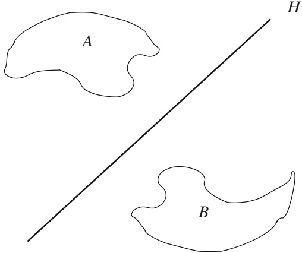

<!-- PDF page 21; unreviewed OCR draft -->

Fig. 1

$$
p ( x ) = \operatorname* { i n f } \{ \alpha > 0 ; \alpha ^ { - 1 } x \in C \}\tag{8}
$$

(p is called the gauge of C or the Minkowski functional of C).

Then p satisfies (1), (2), and the following properties:

(9) there is a constant M such that $0 \leq p ( x ) \leq M \| x \| \quad \forall x \in E$

$$
C = \{ x \in E   ;   p ( x ) < 1 \} .\tag{10}
$$

Proof of Lemma 1.2. It is obvious that (1) holds.

Proof of (9). Let $r > 0$ be such that $B ( 0 , r ) \subset C ;$ ; we clearly have

$$
p ( x ) \leq { \frac { 1 } { r } } \| x \| \quad \forall x \in E .
$$

Proof of (10). First, suppose that $x \in C ;$ since C is open, it follows that $( 1   +   \varepsilon ) x \in C$ for $\varepsilon   >   0$ small enough and therefore $\textstyle p ( x )   \leq   { \frac { 1 } { 1 + \varepsilon } }   <   1$ . Conversely, if $p ( x )   <   1$ there exists $\alpha \in ( 0 , 1 )$ such that $\alpha ^ { - 1 } x \in C$ , and thus $x = \alpha ( \alpha ^ { - 1 } x ) + ( 1 - \alpha ) 0 \in C$ Proof of(2). Let $x , y \in E$ and let $\varepsilon > 0$ . Using (1) and (10) we obtain that $\scriptstyle { \frac { x } { p ( x ) + \varepsilon } } \in C$ and $\scriptstyle { \frac { y } { p ( y ) + \varepsilon } } \; \in \; C$ . Thus $\begin{array} { r } { \frac { t x } { p ( x ) + \varepsilon } + \frac { ( 1 - t ) y } { p ( y ) + \varepsilon } \in C } \end{array}$ for all $t \in [ 0 , 1 ]$ . Choosing the value $\begin{array} { r } { t = \frac { p ( x ) + \varepsilon } { p ( x ) + p ( y ) + 2 \varepsilon } } \end{array}$ , we find that $\frac{x + y}{p(x) + p(y) + 2\varepsilon} \in C$ . Using (1) and (10) once more, we are led to $p(x+y)<p(x)+p(y)+2\varepsilon,\forall\varepsilon>0$

Lemma 1.3. Let $C \subset E$ be a nonempty open convex set and let $x _ { 0 } \in E$ with x0 $\notin C .$ Then there exists $f \in E ^ { \star }$ such that $f ( x ) \; < \; f ( x _ { 0 } ) \quad \forall x \; \in \; C$ . In particular, the hyperplane $[ f = f ( x _ { 0 } ) ]$ separates {x0} and C.

Proof of Lemma 1.3. After a translation we may always assume that $0   \in   C$ . We may thus introduce the gauge p of C (see Lemma 1.2). Consider the linear subspace $G = \mathbb { R } x _ { 0 }$ and the linear functional $g : G \to \mathbb { R }$ defined by
