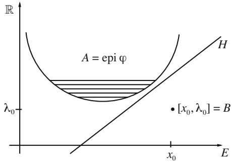

<!-- PDF page 27; unreviewed OCR draft -->

Fig. 2

$$
a b \leq \frac { 1 } { p } a ^ { p } + \frac { 1 } { p ^ { \prime } } b ^ { p ^ { \prime } } \quad \forall a , b \geq 0 .\tag{12}
$$

with $1 < p < \infty$ and $\textstyle { \frac { 1 } { p } }   +   { \frac { 1 } { p ^ { \prime } } } = 1$ . Inequality (12) becomes a special case of (11) with $E = E ^ { \star } = \mathbb { R }$ and $\varphi ( t ) = \frac { 1 } { p } | t | ^ { p } , \varphi ^ { \star } ( s ) = \frac { 1 } { p ^ { \prime } } | s | ^ { p ^ { \prime } }$ (see Exercise 1.18, question (h)).

**Proposition 1.10.** Assume that $\varphi:E\to(-\infty,+\infty]$ is convex $l . s . c .$ and $\varphi \not \equiv + \infty .$ Then $\varphi ^ { \star } \neq + \infty$ , and in particular, ϕ is bounded below by an affine continuous function.

Proof. Let $x _ { 0 } \in D ( \varphi )$ and let $\lambda _ { 0 }   <   \varphi ( x _ { 0 } )$ . We apply Theorem 1.7 (Hahn–Banach, second geometric form) in the space $E \times \mathbb { R }$ with $A   =   \mathrm { e p i }   \varphi$ and $B = \{ [ x _ { 0 } , \lambda _ { 0 } ] \}$ $\mathrm { S o } ,$ there exists a closed hyperplane $H = [ \Phi = \alpha ]$ in $E \times \mathbb { R }$ that strictly separates A and $B ;$ see Figure 2. Note that the function $x \in E \mapsto \Phi ( [ x , 0 ] )$ is a continuous linear functional on $E .$ and thus $\Phi ( [ x , 0 ] ) \: = \: \langle f , x \rangle$ for some $f \in E ^ { \star }$ . Letting $k = \Phi ( [ 0 , 1 ] )$ , we have

$$
\Phi ( [ x , \lambda ] ) = \langle f , x \rangle + k \lambda \quad \forall [ x , \lambda ] \in E \times \mathbb { R } .
$$

Writing that $\Phi > \alpha$ on A and $\Phi < \alpha$ on B, we obtain

$$
\langle f , x \rangle + k \lambda > \alpha , \quad \forall [ x , \lambda ] \in \operatorname { \mathsf { e p i } } \varphi ,
$$

and

$$
\langle f , x _ { 0 } \rangle + k \lambda _ { 0 } < \alpha .
$$

In particular, we have

$$
\langle f , x \rangle + k \varphi ( x ) > \alpha \quad \forall x \in D ( \varphi )\tag{13}
$$

and thus

$$
\langle f , x _ { 0 } \rangle + k \varphi ( x _ { 0 } ) > \alpha > \langle f , x _ { 0 } \rangle + k \lambda _ { 0 } .
$$

It follows that $k > 0$ . By (13) we have
