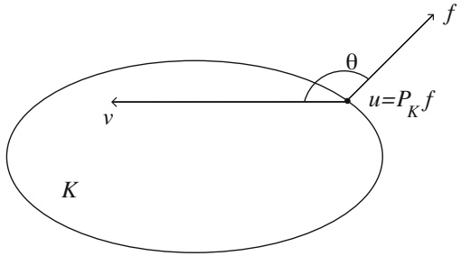

and

$$
[ u ] _ { \alpha } = \left( \int | u | ^ { \alpha } \right) ^ { 1 / \alpha } .
$$

1. Check that $L ^ { \alpha }$ is a vector space but that $\left[ \begin{array} { l } { \right] _ { \alpha } } \end{array}$ is not a norm. More precisely, prove that if $u , v \in L ^ { \alpha } ( \Omega ) , u \geq 0$ a.e. and $v \geq 0 \; { \mathrm { a . e . } }$ , then

$$
[ u + v ] _ { \alpha } \geq [ u ] _ { \alpha } + [ v ] _ { \alpha } .
$$

2. Prove that

$$
[ u + v ] _ { \alpha } ^ { \alpha } \leq [ u ] _ { \alpha } ^ { \alpha } + [ v ] _ { \alpha } ^ { \alpha } \quad \forall u , v \in L ^ { \alpha } ( \Omega ) .
$$

$\boxed { 4 . 1 2 }   L ^ { p }$ is uniformly convex for $1 < p \leq 2$ (by the method of C. Morawetz).

1. Let $1   <   p   <   \infty$ . Prove that there is a constant C (depending only on $p )$ such that

$$
| a - b | ^ { p } \leq C ( | a | ^ { p } + | b | ^ { p } ) ^ { 1 - s } \left( | a | ^ { p } + | b | ^ { p } - 2 \bigg | \frac { a + b } { 2 } \bigg | ^ { p } \right) ^ { s } \quad \forall a , b \in \mathbb { R } ,
$$

where $s = p / 2$

2. Deduce that $L ^ { p } ( \Omega )$ is uniformly convex for $1 < p \leq 2$

[**Hint:** Use question 1 and Hölder’s inequality.]

<u>4.13</u>

1. Check that

$$
\left| | a + b | - | a | - | b | \right| \leq 2 | b | \quad \forall a , b \in \mathbb { R } .
$$

2. Let $( f _ { n } )$ be a sequence in $L ^ { 1 } ( \Omega )$ such that

(i) $f _ { n } ( x ) \to f ( x ) \; { \mathrm { a . e . } }$ ,

(ii) $( f _ { n } )$ is bounded in $L ^ { 1 } ( \Omega )   \mathrm { i . e . , }   \| f _ { n } \| _ { 1 } \leq M \quad \forall n .$

Prove that $f \in L ^ { 1 } ( \Omega )$ and that

$$
\lim _ { n \rightarrow \infty } \int \left\{ \left| f _ { n } \right| - \left| f _ { n } - f \right| \right\} = \int | f | .
$$

[**Hint:** Use question 1 with $a = f _ { n } - f$ and $b = f$ , and consider the sequence $\varphi _ { n } = { \big | } | f _ { n } | - | f _ { n } - f | - | f | { \big | } . ]$

3. Let $( f _ { n } )$ be a sequence in $L ^ { 1 } ( \Omega )$ and let f be a function in $L ^ { 1 } ( \Omega )$ such that

(i) $f _ { n } ( x ) \to f ( x ) \; { \mathrm { a . e . } }$ ,

(ii) $\| f _ { n } \| _ { 1 } \to \| f \|$

Prove that $\| f _ { n } - f \| _ { 1 } = 0 .$

<u>4.14</u> The theorems of Egorov and Vitali.

Assume $| \Omega | \; < \; \infty$ . Let $( f _ { n } )$ be a sequence of measurable functions such that $f _ { n } \rightarrow f \; \mathrm { a . e }$ . (with $| f | < \infty \; \mathrm { a . e . } )$ .

1. Let $\alpha > 0$ be fixed. Prove that

$$
\mathrm { m e a s } [ | f _ { n } - f | > \alpha | ] \; \underset { n \to \infty } { \longrightarrow } \; 0 .
$$

2. More precisely, let

$$
S_{n}(\alpha)=\bigcup_{k \geq n}[|f_{k}-f|>\alpha].
$$

Prove that $| S _ { n } ( \alpha ) | \; \underset { n \to \infty } { \longrightarrow } \; 0$

3. (Egorov). Prove that

$$
\begin{cases}\forall \delta > 0 \quad \exists A \subset \Omega \quad  measurable such that  \\|A| < \delta  and  f_n \rightarrow f  uniformly on  \Omega \backslash A.\end{cases}
$$

[**Hint:** Given an integer $m   \geq   1$ , prove with the help of question 2 that there exists $\Sigma _ { m } \subset \Omega$ , measurable, such that $| \Sigma _ { m } | < \delta / 2 ^ { m }$ and there exists an integer $N _ { m }$ such that

$$
| f _ { k } ( x ) - f ( x ) | < \frac { 1 } { m } \quad \forall k \geq N _ { m } , \quad \forall x \in \Omega \backslash \Sigma _ { m } .   ]
$$

4. (Vitali). Let $( f _ { n } )$ be a sequence in $L ^ { p } ( \Omega )$ with $1 \leq p < \infty$ . Assume that

(i) $\forall \varepsilon > 0 \quad \exists \delta > 0$ such that $\begin{array} { r } { \int _ { A } | f _ { n } | ^ { p } < \varepsilon } \end{array}$ ∀n and $\forall A \subset \Omega$ measurable with $| A | < \delta .$

(ii) $f _ { n } \rightarrow f \; \mathrm { a . e }$

Prove that $f \in L ^ { p } ( \Omega )$ and that $f _ { n } \to f \; \mathrm { i n } \; L ^ { p } ( \Omega )$

<u>4.15</u> $L e t   \Omega = ( 0 , 1 )$

1. Consider the sequence $( f _ { n } )$ of functions defined by $f _ { n } ( x ) = n e ^ { - n x }$ . Prove that

(i) $f _ { n } \to 0 \; { \mathrm { a . e . } }$

(ii) $f _ { n }$ is bounded in $L ^ { 1 } ( \Omega )$

(iii) $f _ { n } \nrightarrow 0 \; \mathrm { i n } \; L ^ { 1 } ( \Omega )$ strongly.

(iv) $f _ { n } \neq 0$ weakly $\sigma ( L ^ { 1 } , L ^ { \infty } )$

More precisely, there is no subsequence that converges weakly $\sigma ( L ^ { 1 } , L ^ { \infty } )$

2. Let $1 < p <$ ∞ and consider the sequence $( g _ { n } )$ of functions defined by $g _ { n } ( x ) =$ $n ^ { 1 / p } e ^ { - n \bar { x } }$ . Prove that

(i) $g _ { n } \rightarrow 0 \; \mathrm { a . e . }$

(ii) $( g _ { n } )$ is bounded in $L ^ { p } ( \Omega )$

(iii) $g _ { n } \nrightarrow 0 \mathrm { i n } L ^ { p } ( \Omega )$ strongly.

(iv) $g _ { n } \rightharpoonup 0$ weakly $\sigma ( L ^ { p } , L ^ { p ^ { \prime } } )$

## 4.5 Exercises for Chapter 4

$\boxed { 4 . 1 6 }$ Let $1 < p < \infty .$ . Let $( f _ { n } )$ be a sequence in $L ^ { p } ( \Omega )$ such that

(i) $f _ { n }$ is bounded in $L ^ { p } ( \Omega )$

(ii) $f _ { n } \to f \; { \mathrm { a . e . \; o n } } \; \Omega$

1. Prove that $f _ { n } \rightharpoonup f$ weakly $\sigma ( L ^ { p } , L ^ { p ^ { \prime } } )$ [Hint: First show that if $f _ { n } \rightharpoonup \hat { f }$ weakly $\sigma ( L ^ { p } , L ^ { p ^ { \prime } } )$ and $f _ { n } \rightarrow f$ a.e., then $f = \widetilde { f }   \mathrm { a . e }$ . (use Exercise 3.4).]

2. Same conclusion if assumption (ii) is replaced by

(ii) $\| f _ { n } - f \| _ { 1 } \to 0 .$

3. Assume now (i), (ii), and $| \Omega | < \infty$ . Prove that $\| f _ { n } - f \| _ { q } \to 0$ for every $q$ with $1 \leq q < p .$ [**Hint:** Introduce the truncated functions $T _ { k } f _ { n }$ or alternatively use Egorov’s theorem.]

<u>4.17</u> Brezis–Lieb’s lemma.

Let $1 < p < \infty$

1. Prove that there is a constant C (depending on $p )$ such that

$$
\left| | a + b | ^ { p } - | a | ^ { p } - | b | ^ { p } \right| \leq C \left( | a | ^ { p - 1 } | b | + | a | | b | ^ { p - 1 } \right) \quad \forall a , b \in \mathbb { R } .
$$

2. Let $( f _ { n } )$ be a bounded sequence in $L ^ { p } ( \Omega )$ such that $f _ { n } \rightarrow f$ a.e. on $\Omega .$ Prove that $f \in L ^ { p } ( \Omega )$ and that

$$
\lim _ { n \rightarrow \infty } \int _ { \Omega } \left\{ | f _ { n } | ^ { p } - | f _ { n } - f | ^ { p } \right\} = \int _ { \Omega } | f | ^ { p } .
$$

[**Hint:** Use question 1 with $a = f _ { n } - f$ and $b = f$ . Note that by Exercise 4.16, $| f _ { n } - f | \rightharpoonup 0$ weakly in $L ^ { p }$ and $| f _ { n } - f | ^ { p - 1 } \rightharpoonup 0$ weakly in $L ^ { p ^ { \prime } } . ]$

3. Deduce that if $( f _ { n } )$ is a sequence in $L ^ { p } ( \Omega )$ satisfying

(i) $f _ { n } ( x ) \to f ( x ) \quad { \mathrm { ~ a . e . } }$ ,

(ii) $\| f _ { n } \| _ { p } \to \| f \| _ { p } ,$

then $\| f _ { n } - f \| _ { p } \to 0 .$

4. Find an alternative method for question 3.

## 4.18 Rademacher’s functions.

Let $1 \leq p \leq$ ∞ and let $f \in L _ { \mathrm { l o c } } ^ { p } ( \mathbb { R } )$ . Assume that f is T -periodic, i.e., $f(x{+}T)=$ $f ( x )$ $a . \mathbf { e . }   x \in \mathbb { R }$

Set

$$
\overline { { f } } = \frac { 1 } { T } \int _ { 0 } ^ { T } f ( t ) d t .
$$

Consider the sequence $( u _ { n } )$ in $L ^ { p } ( 0 , 1 )$ defined by

$$
u _ { n } ( x ) = f ( n x ) , \quad x \in ( 0 , 1 ) .
$$

1. Prove that $u _ { n } \rightharpoonup \overline { { f } }$ in $L ^ { p } ( 0 , 1 )$ with respect to the topology $\sigma ( L ^ { p } , L ^ { p ^ { \prime } } )$

2. Determine $\begin{array} { r } { \operatorname* { l i m } _ { n \to \infty }   \| u _ { n } - \overline { { f } } \| _ { p } } \end{array}$

3. Examine the following examples:

(i) $u _ { n } ( x ) = \sin n x$ ,

(ii) $u _ { n } ( x ) = f ( n x )$ where f is 1-periodic and

$$
f ( x ) = \begin{cases} { \alpha } & { \mathrm { f o r }   x \in ( 0 , 1 / 2 ) , } \\ { \beta } & { \mathrm { f o r }   x \in ( 1 / 2 , 1 ) . } \end{cases}
$$

The functions of example (ii) are called Rademacher’s functions.

<u>4.19</u>

1. Let $( f _ { n } )$ be a sequence in $L ^ { p } ( \Omega )$ with $1 < p <$ ∞ and let $f \in L ^ { p } ( \Omega )$ . Assume that

(i) $f _ { n } \rightharpoonup f \; \mathrm { w e a k l y } \; \sigma ( L ^ { p } , L ^ { p ^ { \prime } } ) ,$

(ii) $\| f _ { n } \| _ { p } \to \| f \| _ { p } .$

Prove that $f _ { n } \rightarrow f$ strongly in $L ^ { p } ( \Omega )$

2. Construct a sequence $( f _ { n } )$ in $L ^ { 1 } ( 0 , 1 ) ,   f _ { n } \geq 0$ , such that:

(i) $f _ { n } \rightharpoonup f \; \mathrm { w e a k l y } \; \sigma ( L ^ { 1 } , L ^ { \infty } )$ ,

(ii) $\| f _ { n } \| _ { 1 } \to \| f \| _ { 1 }$ ,

(iii) $\| f _ { n } - f \| _ { 1 } \nrightarrow 0 .$

Compare with the results of Exercise 4.13 and with Proposition 3.32.

<u>4.20</u> Assume $| \Omega | < \infty$ . Let $1 \leq p < \infty$ and $1 \leq q < \infty$

Let $a : \mathbb { R } \rightarrow \mathbb { R }$ be a continuous function such that

$$
| a ( t ) | \leq C \{ | t | ^ { p / q } + 1 \} \quad \forall t \in \mathbb { R } .
$$

Consider the (nonlinear) map $A : L ^ { p } ( \Omega ) \to L ^ { q } ( \Omega )$ defined by

$$
( A u ) ( x ) = a ( u ( x ) ) , \; x \in \Omega .
$$

1. Prove that A is continuous from $L ^ { p } ( \Omega )$ strong into $L ^ { q } ( \Omega )$ strong.

2. Take $\Omega   =   ( 0 , 1 )$ and assume that for every sequence $( u _ { n } )$ such that $u _ { n }   \rightharpoonup   u$ weakly $\sigma ( L ^ { p } , L ^ { p ^ { \prime } } )$ then $A u _ { n } \rightharpoonup A u$ weakly $\sigma ( L ^ { q } , L ^ { q ^ { \prime } } )$ Prove that a is an affine function.

[**Hint:** Use Rademacher’s functions; see Exercise 4.18.]

$\boxed { 4 . 2 1 }$ Given a function $u _ { 0 } : \mathbb { R } \to \mathbb { R }$ , set $u _ { n } ( x ) = u _ { 0 } ( x + n )$

1. Assume $u _ { 0 }   \in   L ^ { p } ( \mathbb { R } )$ with $1 \; < \; p \; < \; \infty$ . Prove that $u _ { n }   \rightharpoonup   0$ in $L ^ { p } ( \mathbb { R } )$ with respect to the weak topology $\sigma ( L ^ { p } , L ^ { p ^ { \prime } } )$

2. Assume $u _ { 0 } \in L ^ { \infty } ( \mathbb { R } )$ and that $u _ { 0 } ( x ) \to 0 \mathrm { ~ a s ~ } | x | \to \infty$ in the following weak sense:

for every $\delta > 0$ the set $[ | u _ { 0 } | > \delta ]$ has finite measure.

Prove that $u _ { n } \stackrel { \star } { \rightharpoonup } 0$ in $L ^ { \infty } ( \mathbb { R } )$ weak- $\sigma ( L ^ { \infty } , L ^ { 1 } )$

3. Take $u _ { 0 } = \chi _ { ( 0 , 1 ) }$

Prove that there exists no subsequence $( u _ { n _ { k } } )$ that converges in $L ^ { 1 } ( \mathbb { R } )$ with respect to $\sigma ( L ^ { 1 } , L ^ { \infty } )$

<u>4.22</u>

1. Let $( f _ { n } )$ be a sequence in $L ^ { p } ( \Omega )$ with $1 < p \leq \infty$ and let $f \in L ^ { p } ( \Omega )$ Show that the following properties are equivalent:

(A) $f _ { n } \rightharpoonup f \mathrm { ~ i n ~ } \sigma ( L ^ { p } , L ^ { p ^ { \prime } } )$

$$
\begin{array} { r } { \left\lfloor \int _ { E } f _ { n } \rightarrow \int _ { E } f \; \forall E \subset \Omega \right. } \end{array}
$$

$$
| E | < \infty
$$

2. If $p = 1$ and $| \Omega | < \infty$ prove that $( \mathrm { A } ) \Leftrightarrow ( \mathrm { B } )$

3. Assume p = 1 and $| \Omega | = \infty$ . Prove that $( \mathrm { A } ) \Rightarrow ( \mathrm { B } )$ Construct an example showing that in general, $\left(  B  \right) \nRightarrow \left(  A  \right)$ [**Hint:** Use Exercise 4.21, question 3.]

4. Let $( f _ { n } )$ be a sequence in $L ^ { 1 } ( \Omega )$ and let $f \in L ^ { 1 } ( \Omega )$ with $| \Omega | = \infty$ . Assume that

(a) $f _ { n } \geq 0$ ∀n and $f \geq 0 \; { \mathrm { a . e . \; o n } } \; \Omega$ ,

(b) $\begin{array} { r } { \int _ { \Omega } f _ { n } \rightarrow \int _ { \Omega } f , } \end{array}$ (c) $\begin{array} { r } { \widehat { \int _ { E } }   f _ { n } \rightarrow \widehat { \int _ { E } }   f \quad \forall E \subset \Omega } \end{array}$ , E measurable and $| E | < \infty$

Prove that $f _ { n } \rightharpoonup f$ in $L ^ { 1 } ( \Omega )$ weakly $\sigma ( L ^ { 1 } , L ^ { \infty } )$

[**Hint:** Show that $\begin{array} { r } { \int _ { F } f _ { n } \to \int _ { F } f \; \forall F \subset \Omega } \end{array}$ , F measurable and $| F | \leq \infty . ]$

<u>4.23</u> Let $f : \Omega \to$ R be a measurable function and let $1 \leq p \leq \infty$ . The purpose of this exercise is to show that the set

$$
C = \left\{ u \in L ^ { p } ( \Omega ) \quad ; \quad u \geq f \quad \mathrm { a . e . } \right\}
$$

is closed in $L ^ { p } ( \Omega )$ with respect to the topology $\sigma ( L ^ { p } , L ^ { p ^ { \prime } } )$

1. Assume first that $1 \leq p < \infty$ . Prove that C is convex and closed in the strong Lp topology. Deduce that C is closed in $\sigma ( L ^ { p } , L ^ { p ^ { \prime } } )$

2. Taking $p = \infty$ , prove that

$$
C = \left\{ u \in L ^ { \infty } ( \Omega ) \middle | \begin{aligned} & \int u \varphi \geq \int f \varphi \quad \forall \varphi \in L ^ { 1 } ( \Omega ) \\ & \mathrm { w i t h } \ f \varphi \in L ^ { 1 } ( \Omega ) \ \mathrm { a n d } \ \varphi \geq 0 \ \mathrm { a . e . } \end{aligned} \right\} .
$$

[**Hint:** Assume first that $f   \in   L ^ { \infty } ( \Omega )$ ; in the general case introduce the sets $\omega _ { n } = [ | f | < n ] . ]$

3. Deduce that when $p = \infty , C$ is closed in $\sigma ( L ^ { \infty } , L ^ { 1 } )$

4. Let $f _ { 1 } ,   f _ { 2 } \in L ^ { \infty }$ () with $f _ { 1 } \leq f _ { 2 }$ a.e. Prove that the set

$$
C = \left\{ u \in L ^ { \infty } ( \Omega ) \; ; \quad f _ { 1 } \leq u \leq f _ { 2 } \quad \mathrm { a . e . } \right\}
$$

is compact in $L ^ { \infty } ( \Omega )$ with respect to the topology $\sigma ( L ^ { \infty } , L ^ { 1 } )$

<u>4.24</u> Let $u \in L ^ { \infty } ( \mathbb { R } ^ { N } )$ . Let $( \rho _ { n } )$ be a sequence of mollifiers. Let $( \zeta _ { n } )$ be a sequence in $\overline { { L ^ { \infty } } } ( \mathbb { R } ^ { N } )$ such that

$$
\| \zeta _ { n } \| _ { \infty } \leq 1 \quad \forall n \quad \mathrm { a n d } \quad \zeta _ { n } \to \zeta \mathrm { a . e . o n } \mathbb { R } ^ { N } .
$$

Set

$$
v _ { n } = \rho _ { n } \star ( \zeta _ { n } u ) \quad \mathrm { a n d } \quad v = \zeta u .
$$

1. Prove that $v _ { n } \stackrel { \star } { \rightharpoonup } v$ in $L ^ { \infty } ( \mathbb { R } ^ { N } )$ weak- $\sigma ( L ^ { \infty } , L ^ { 1 } )$

2. Prove that $\begin{array} { r } { \int _ { B } | v _ { n } - v | \rightarrow 0 } \end{array}$ for every ball B.

<u>4.25</u> Regularization of functions in $L ^ { \infty } ( \Omega )$

Let $\Omega \subset \mathbb { R } ^ { N }$ be open.

1. Let $u \in L ^ { \infty } ( \Omega )$ . Prove that there exists a sequence $( u _ { n } )$ in $C _ { c } ^ { \infty } ( \Omega )$ such that

(a) $\| u _ { n } \| _ { \infty } \leq \| u \| _ { \infty } \quad \forall n ,$

(b) $u _ { n } \to u \mathrm { ~ a . e . ~ o n ~ } \Omega ,$

(c) $u _ { n } \stackrel { \star } { \rightharpoonup } u \mathrm { ~ i n ~ } L ^ { \infty } ( \Omega ) \mathrm { ~ w e a k } ^ { \star }   \sigma ( L ^ { \infty } , L ^ { 1 } )$

2. If $u \geq 0 \; \mathrm { a . e . \; o n } \; \Omega ,$ show that one can also take

(d) $u _ { n } \geq 0 \quad \mathrm { o n } \quad \Omega \quad \forall n .$

3. Deduce that $C _ { c } ^ { \infty } ( \Omega )$ is dense in $L ^ { \infty } ( \Omega )$ with respect to the topology $\sigma ( L ^ { \infty } , L ^ { 1 } )$

<u>4.26</u> Let $\Omega \subset \mathbb { R } ^ { N }$ be open and let $f \in L _ { \mathrm { l o c } } ^ { 1 } ( \Omega )$

1. Prove that $f \in L ^ { 1 } ( \Omega )$ iff

$$
A = \sup \left\{ \int f \varphi   ;   \varphi \in C_c(\Omega), \quad \| \varphi \|_{\infty} \leq 1 \right\} < \infty.
$$

If $f \in L ^ { 1 } ( \Omega )$ show that $A = \| f \| _ { 1 }$

2. Prove that $f ^ { + } \in L ^ { 1 } ( \Omega )$ iff

$$
B = \sup \left\{ \int f \varphi   ;   \varphi \in C_c(\Omega), \quad \| \varphi \|_{\infty} \leq 1 \quad  and   \varphi \geq 0 \right\} < \infty.
$$

If $f ^ { + } \in L ^ { 1 } ( \Omega )$ show that $B = \| f ^ { + } \| _ { 1 }$

3. Same questions when $C _ { c } ( \Omega )$ is replaced by $C _ { c } ^ { \infty } ( \Omega )$

4. Deduce that

$$
\left[ \int f \varphi = 0 \quad \forall \varphi \in C _ { c } ^ { \infty } ( \Omega ) \right] \Longrightarrow [ f = 0 \quad \mathrm { a . e . } ]
$$

and

$$
\left[ \int f \varphi \geq 0 \quad \forall \varphi \in C _ { c } ^ { \infty } ( \Omega ) , \varphi \geq 0 \right] \Longrightarrow \left[ f \geq 0 \quad \mathrm { a . e . } \right] .
$$

<u>4.27</u> Let $\Omega \subset \mathbb { R } ^ { N }$ be open. Let $u , v \in L _ { \mathrm { l o c } } ^ { 1 } ( \Omega )$ with $u \neq 0 \; \mathrm { a . e . }$ . on a set of positive measure. Assume that

$$
\left[ \varphi \in C _ { c } ^ { \infty } ( \Omega ) \mathrm { ~ a n d ~ } \int u \varphi > 0 \right] \Longrightarrow \left[ \int v \varphi \geq 0 \right] .
$$

Prove that there exists a constant $\lambda \geq 0$ such that $v = \lambda u$

<u>4.28</u> Let $\rho \in L ^ { 1 } ( \mathbb { R } ^ { N } )$ with $\textstyle \int \rho = 1$ . Set $\rho _ { n } ( x ) = n ^ { N } \rho ( n x )$ . Let $f \in L ^ { p } ( \mathbb { R } ^ { N } )$ with $1 \leq p < \infty$ . Prove that $\rho _ { n } \star f \rightarrow f$ in $L ^ { p } ( \mathbb { R } ^ { N } )$

<u>4.29</u> Let $K \; \subset \; \mathbb { R } ^ { N }$ be a compact subset. Prove that there exists a sequence of functions $( u _ { n } )$ in $C _ { c } ^ { \infty } ( \mathbb { R } ^ { N } )$ such that

(a) $0 \leq u _ { n } \leq 1 \; { \mathrm { o n } } \; \mathbb { R } ^ { N }$ ,

(b) $u _ { n } = 1 \; \mathrm { o n } \; K$ ,

(c) $\operatorname { s u p p } u _ { n } \subset K + B ( 0 , 1 / n ) ,$

(d) $| D ^ { \alpha } u _ { n } ( x ) | \leq C _ { \alpha } n ^ { | \alpha | } \; \forall x \in \mathbb { R } ^ { N }$ , ∀ multi-index α (where $C _ { \alpha }$ depends only on α and not on n).

[**Hint:** Let $\chi _ { n }$ be the characteristic function of $K + B ( 0 , 1 / 2 n )$ ; take $u _ { n } = \rho _ { 2 n } \star \chi _ { n } . ]$

<u>4.30</u> Young’s inequality.

Let $1 \leq p \leq \infty , 1 \leq q \leq \infty$ be such that $\begin{array} { r } { \frac { 1 } { p } + \frac { 1 } { q } \geq 1 } \end{array}$

Set $\textstyle { \frac { 1 } { r } } = { \frac { 1 } { p } } + { \frac { 1 } { q } } - 1$ , so that $1 \leq r \leq \infty .$

Let $f \in L ^ { p } ( \mathbb { R } ^ { N } )$ and $g \in L ^ { q } ( \mathbb { R } ^ { N } )$

1. Prove that for $\mathrm { a . e . }   x \in \mathbb { R } ^ { N }$ , the function $y \mapsto f ( x - y )   g ( y )$ is integrable on $\mathbb { R } ^ { N }$

[**Hint:** Set $\alpha = p / q ^ { \prime } , \beta = q / p ^ { \prime }$ and write

$$
| f ( x - y ) g ( y ) | = | f ( x - y ) | ^ { \alpha } | g ( y ) | ^ { \beta } \left( | f ( x - y ) | ^ { 1 - \alpha } | g ( y ) | ^ { 1 - \beta } \right) . ]
$$

2. Set

$$
( f \star g ) ( x ) = \int _ { \mathbb { R } ^ { N } } f ( x - y ) g ( y ) d y .
$$

Prove that $f \star g \in L ^ { r } ( \mathbb { R } ^ { N } )$ and that $\| f \star g \| _ { r } \leq \| f \| _ { p } \| g \| _ { q }$

3. Assume here that $\textstyle { \frac { 1 } { p } } + { \frac { 1 } { q } } = 1$ . Prove that

$$
f \star g \in C ( \mathbb { R } ^ { N } ) \cap L ^ { \infty } ( \mathbb { R } ^ { N } )
$$

and, moreover, if $1 < p < \infty$ then $( f \star g ) ( x ) \to 0 \; { \mathrm { a s } } \; | x | \to \infty$

<u>4.31</u> Let $f \in L ^ { p } ( \mathbb { R } ^ { N } )$ with $1 \leq p < \infty$ . For every $r > 0$ set

$$
f _ { r } ( x ) = \frac { 1 } { \left| B ( x , r ) \right| } \int _ { B ( x , r ) } f ( y ) d y , x \in \mathbb { R } ^ { N } .
$$

1. Prove that $f _ { r } \in L ^ { p } ( \mathbb { R } ^ { N } ) \cap C ( \mathbb { R } ^ { N } )$ and that $f _ { r } ( x )   \to   0 \mathrm { ~ a s ~ } | x |   \to   \infty \mathrm { ~ ( } r \mathrm { ~ b e i n g }$ fixed).

2. Prove that $f _ { r } \rightarrow f$ in $L ^ { p } ( \mathbb { R } ^ { N } )$ as $r \rightarrow 0$

[**Hint:** Write $f _ { r } = \varphi _ { r } \star f$ for some appropriate $\varphi _ { r } . ]$

<u>4.32</u>

1. Let $f , g \in L ^ { 1 } ( \mathbb { R } ^ { N } )$ and let $h \in L ^ { p } ( \mathbb { R } ^ { N } )$ with $1 \leq p \leq \infty$ . Show that $f \star g =$ $g \star f$ and $( f \star g ) \star h = f \star ( g \star h )$

2. Let $f \in L ^ { 1 } ( \mathbb { R } ^ { N } )$ . Assume that $f \star \varphi = 0 \quad \forall \varphi \in C _ { c } ^ { \infty } ( \mathbb { R } ^ { N } )$ . Prove that $f = 0$ a.e. on RN . Same question for $f \in L _ { \mathrm { l o c } } ^ { 1 } ( \mathbb { R } ^ { N } )$

3. Let $a   \in   L ^ { 1 } ( \mathbb { R } ^ { N } )$ be a fixed function. Consider the operator $T _ { a } : L ^ { 2 } ( \mathbb { R } ^ { N } ) \to$ $L ^ { 2 } ( \mathbb { R } ^ { N } )$ defined by

$$
T _ { a } ( u ) = a \star u .
$$

Check that $T _ { a }$ is bounded and that $\| T _ { a } \| _ { \mathcal { L } ( L ^ { 2 } ) }   \leq   \| a \| _ { L ^ { 1 } ( \mathbb { R } ^ { N } ) }$ . Compute $T _ { a } \circ T _ { b }$ and prove that $T _ { a } \circ T _ { b } = T _ { b } \circ T _ { a } \quad \forall a , b \in L ^ { 1 } ( \mathbb { R } ^ { N } )$ . Determine $( T _ { a } ) ^ { \star } , T _ { a } \circ ( T _ { a } ) ^ { \star }$ and $( T _ { a } ) ^ { \star } \circ T _ { a }$ . Under what condition on a is $( T _ { a } ) ^ { \star } = T _ { a } ?$

<u>4.33</u> Fix a function $\varphi \in C _ { c } ( \mathbb { R } ) , \varphi \not \equiv 0$ , and consider the family of functions

$$
\mathcal { F } = \bigcup _ { n = 1 } ^ { \infty } \{ \varphi _ { n } \} ,
$$

where $\varphi _ { n } ( x ) = \varphi ( x + n ) , x \in \mathbb { R } .$

1. Assume $1 \leq p < \infty$ . Prove that $\forall \varepsilon > 0 \; \exists \delta > 0$ such that

$$
\| \tau _ { h } f - f \| _ { p } < \varepsilon \quad \forall f \in \mathcal { F } \quad \mathrm { a n d } \quad \forall h \in \mathbb { R } \quad \mathrm { w i t h } \quad | h | < \delta .
$$

2. Prove that $\mathcal { F }$ does not have compact closure in $L ^ { p } ( \mathbb { R } )$

<u>4.34</u> Let $1 \leq p <$ ∞ and let $\mathcal { F } \subset L ^ { p } ( \mathbb { R } ^ { N } )$ be a compact subset of $L ^ { p } ( \mathbb { R } ^ { N } )$

1. Prove that $\mathcal { F }$ is bounded in $L ^ { p } ( \mathbb { R } ^ { N } )$

2. Prove that $\forall \varepsilon > 0 \quad \exists \delta > 0$ such that

$$
\| \tau _ { h } f - f \| _ { p } < \varepsilon \quad \forall f \in \mathcal { F } \; \mathrm { a n d } \; \forall h \in \mathbb { R } ^ { N } \; \mathrm { w i t h } \; | h | < \delta .
$$

3. Prove that $\forall \varepsilon > 0 \quad \exists \Omega \subset \mathbb { R } ^ { N }$ bounded, open, such that

$$
\left\| f \right\|_{L^p(\mathbb{R}^N \setminus \Omega)} < \varepsilon \quad \forall f \in \mathcal{F}.
$$

Compare with Corollary 4.27.

<u>4.35</u> Fix a function $G \in L ^ { p } ( \mathbb { R } ^ { N } )$ with $1 \leq p < \infty$ and let $\mathcal { F } = G \star \mathcal { B }$ , where $\mathcal { B }$ is a bounded set in $L ^ { 1 } ( \mathbb { R } ^ { N } )$

Prove that $\mathcal { F } _ { | \Omega }$ has compact closure in $L ^ { p } ( \Omega )$ for any measurable set $\Omega \subset \mathbb { R } ^ { N }$ with finite measure. Compare with Corollary 4.28.

<u>4.36</u> Equi-integrable families.

A subset $\mathcal { F }   \subset   L ^ { 1 } ( \Omega )$ is said to be equi-integrable if it satisfies the following properties:6

(a)

$\mathcal { F }$ is bounded in $L ^ { 1 } ( \Omega )$

(b)

$$
\begin{cases}\forall \varepsilon > 0 \quad \exists \delta > 0 \quad  such that  \int_{E} |f| < \varepsilon \\\forall f \in \mathcal{F}, \quad \forall E \subset \Omega, E  measurable and  |E| < \delta,\end{cases}\tag{c}
$$

$$
\begin{cases}\forall \varepsilon > 0 \quad \exists \omega \subset \Omega   measurable with   |\omega| < \infty, \\ such that   \int_{\Omega \setminus \omega} |f| < \varepsilon \quad \forall f \in \mathcal{F}.\end{cases}
$$

Let $( \Omega _ { n } )$ be a nondecreasing sequence of measurable sets in  with $| \Omega _ { n } | ~ <$ ∞ ∀n and such that $\begin{array} { r } { \Omega = \bigcup _ { n } \Omega _ { n } } \end{array}$

1. Prove that $\mathcal { F }$ is equi-integrable iff

$$
\lim_{t \to \infty} \sup_{f \in \mathcal{F}} \int_{[|f| > t]} |f| = 0.\tag{d}
$$

and

(e)

$$
\lim _ { n \rightarrow \infty } \sup _ { f \in \mathcal { F } } \int _ { \Omega \backslash \Omega _ { n } } | f | = 0.
$$

2. Prove that if $\mathcal { F } \subset L ^ { 1 } ( \Omega )$ is compact, then $\mathcal { F }$ is equi-integrable. Is the converse true?

<u>4.37</u> Fix a function $f \in L ^ { 1 } ( \mathbb { R } )$ such that

$$
\int _ { - \infty } ^ { + \infty } f ( t ) d t = 0 \quad \mathrm { a n d } \quad \int _ { 0 } ^ { + \infty } f ( t ) d t > 0 ,
$$

and let $u _ { n } ( x ) = n f ( n x )$ for $x \in I = ( - 1 , + 1 )$

1. Prove that

$$
\lim _ { n \rightarrow \infty } \int _ { I } u _ { n } ( x ) \varphi ( x ) d x = 0 \quad \forall \varphi \in C ( [ - 1 , + 1 ] ) .
$$

<small>RN</small>

<small>6 One can show that (a) follows from (b) and (c) if the measure space  is diffuse (i.e.,  has no atoms). Consider for example  = with the Lebesgue measure.</small>

2. Check that the sequence $( u _ { n } )$ is bounded in $L ^ { 1 } ( I )$ . Show that no subsequence of $( u _ { n } )$ is equi-integrable.

3. Prove that there exists no function $u \in L ^ { 1 } ( I )$ such that

$$
\lim _ { k \rightarrow \infty } \int _ { I } u _ { n _ { k } } ( x ) \varphi ( x ) d x = \int _ { I } u ( x ) \varphi ( x ) d x \quad \forall \varphi \in L ^ { \infty } ( I ) ,
$$

along some subsequence $( u _ { n _ { k } } )$

4. Compare with the Dunford–Pettis theorem (see question A3 in Problem 23).

5. Prove that there exists a subsequence $( u _ { n _ { k } } )$ such that $u _ { n _ { k } } ( x ) \to 0$ a.e. on I as $k \to \infty$

[**Hint:** Compute $\textstyle \int _ { [ n ^ { - 1 / 2 } < | x | < 1 ] } | u _ { n } ( x ) | d x$ and apply Theorem 4.9.]

<u>4.38</u> Set $I = ( 0 , 1 )$ and consider the sequence $( u _ { n } )$ of functions in $L ^ { 1 } ( I )$ defined by

$$
u _ { n } ( x ) = \begin{cases} { n } & { \mathrm { ~ i f ~ } x \in \bigcup \limits _ { j = 0 } ^ { n - 1 } \left( \frac { j } { n } , \frac { j } { n } + \frac { 1 } { n ^ { 2 } } \right) , } \\ { 0 } & { \mathrm { ~ o t h e r w i s e . } } \end{cases}
$$

1. Check that | supp $\begin{array} { r } { | u _ { n } | = \frac { 1 } { n } } \end{array}$ and $\| u _ { n } \| _ { 1 } = 1$

2. Prove that

$$
\lim _ { n \rightarrow + \infty } \int _ { I } u _ { n } ( x ) \varphi ( x ) d x = \int _ { I } \varphi ( x ) d x \quad \forall \varphi \in C ( [ 0 , 1 ] ) .
$$

[**Hint:** Start with the case $\varphi \in C ^ { 1 } ( [ 0 , 1 ] ) . ]$

3. Show that no subsequence of $( u _ { n } )$ is equi-integrable.

4. Prove that there exists no function $u \in L ^ { 1 } ( I )$ such that

$$
\lim _ { k \rightarrow \infty } \int _ { I } u _ { n _ { k } } ( x ) \varphi ( x ) d x = \int _ { I } u ( x ) \varphi ( x ) d x \quad \forall \varphi \in L ^ { \infty } ( I ) ,
$$

along some subsequence $( u _ { n _ { k } } )$

[**Hint:** Use a further subsequence $( u _ { n _ { k } ^ { \prime } } )$ such that $\sum _ { k } |$ supp $| u _ { n _ { k } ^ { \prime } } | < 1 . ]$

5. Prove that there exists a subsequence $( u _ { n _ { k } } )$ such that $u _ { n _ { k } } ( x )   \to   0 \; \mathrm { a . e . }$ . on I as $k \to \infty$

## 5.1 Definitions and Elementary Properties. Projection onto a Closed Convex Set

**Definition.** Let H be a vector space. A scalar product $( u , v )$ is a bilinear form on $H \times H$ with values in R (i.e., a map from $H \times H$ to R that is linear in both variables) such that

$$
\begin{aligned} &(u, v) = (v, u) & &\forall u, v \in H \quad & ( symmetry ), \\&(u, u) \geq 0 & &\forall u \in H \quad & ( positive ), \\&(u, u) \neq 0 & &\forall u \neq 0 \quad & ( definite ).\\ \end{aligned}
$$

Let us recall that a scalar product satisfies the Cauchy–Schwarz inequality

$$
| ( u , v ) | \leq ( u , u ) ^ { 1 / 2 } ( v , v ) ^ { 1 / 2 } \quad \forall u , v \in H .
$$

[It is sometimes useful to keep in mind that the proof of the Cauchy–Schwarz inequality does not require the assumption $( u , u ) \neq 0 \; \forall u \neq 0 . ]$ It follows from the Cauchy–Schwarz inequality that the quantity

$$
\boxed { | u | = ( u , u ) ^ { 1 / 2 } }
$$

is a norm—we shall often denote by | | (instead of ) norms arising from scalar products. Indeed, we have

$$
|u + v|^2 = (u + v, u + v) = |u|^2 + (u, v) + (v, u) + |v|^2 \leq |u|^2 + 2|u| |v| + |v|^2,
$$

and thus $| u + v | \leq | u | + | v |$

Let us recall the classical parallelogram law:

$$
\left| \frac{a + b}{2} \right|^2 + \left| \frac{a - b}{2} \right|^2 = \frac{1}{2} (|a|^2 + |b|^2) \quad \forall a, b \in H.\tag{1}
$$

**Definition.** A Hilbert space is a vector space H equipped with a scalar product such that H is complete for the norm | |.

In what follows, H will always denote a Hilbert space.

**Basic example.** $L ^ { 2 } ( \Omega )$ equipped with the scalar product

$$
( u , v ) = \int _ { \Omega } u ( x ) v ( x ) d \mu .
$$

is a Hilbert space. In particular, $\ell ^ { 2 }$ is a Hilbert space. The Sobolev space $H ^ { 1 }$ studied in Chapters 8 and 9 is another example of a Hilbert space; it is “modeled” on $L ^ { 2 } ( \Omega )$

• **Proposition 5.1.** H is uniformly convex, and thus it is reflexive.

Proof. Let $\varepsilon > 0$ and $u , v \in H$ satisfy $| u | \leq 1 , | v | \leq 1$ , and $| u - v | > \varepsilon$ . In view of the parallelogram law we have

$$
\left| \frac{u + v}{2} \right|^2 < 1 - \frac{\varepsilon^2}{4}  and thus  \left| \frac{u + v}{2} \right| < 1 - \delta  with  \delta = 1 - \left( 1 - \frac{\varepsilon^2}{4} \right)^{1/2} > 0.
$$

• **Theorem 5.2 (projection onto a closed convex set).** Let $K \subset H$ be a nonempty closed convex set. Then for every $f \in H$ there exists a unique element $u \in K$ such that

$$
| f - u | = \operatorname* { m i n } _ { v \in K } | f - v | = \operatorname { d i s t } ( f , K ) .\tag{2}
$$

Moreover, u is **characterized** by the property

$$
u \in K \quad a n d \quad ( f - u , v - u ) \leq 0 \quad \forall v \in K .\tag{3}
$$

**Notation.** The above element u is called the projection of f onto K and is denoted by

$$
\boxed { u = P _ { K } f . }
$$

Inequality (3) says that the scalar product of the vector $\overrightarrow { u f }$ with any vector $\overrightarrow { u v } ( v \in$ K) is $\leq 0 , \mathrm { i . e . }$ , the angle θ determined by these two vectors $\mathbf { i } \mathrm { s } \geq \pi / 2 ;$ see Figure 4.

Proof. (a) Existence. We shall present two different proofs:

1. The function $\varphi ( v ) = | f - v |$ is convex, continuous and $\begin{array} { r } { \operatorname* { l i m } _ { | v | \to \infty } \varphi ( v ) = + \infty } \end{array}$ It follows from Corollary 3.23 that ϕ achieves its minimum on K since H is reflexive.

2. The second proof does not rely on the theory of reflexive and uniformly convex spaces. It is a direct argument. Let $( v _ { n } )$ be a minimizing sequence for (2), i.e., $v _ { n } \in K$ and

$$
d _ { n } = | f - v _ { n } | \to d = \operatorname* { i n f } _ { v \in K } | f - v | .
$$

We claim that $( v _ { n } )$ is a Cauchy sequence. Indeed, the parallelogram law applied with $a = f - v _ { n }$ and $b = f - v _ { m }$ leads to

Fig. 4

$$
\left| f - \frac{v_n + v_m}{2} \right|^2 + \left| \frac{v_n - v_m}{2} \right|^2 = \frac{1}{2}(d_n^2 + d_m^2).
$$

But $\scriptstyle { \frac { v _ { n } + v _ { m } } { 2 } } \in K$ and thus $\begin{array} { r } { \left| f - \frac { v _ { n } + v _ { m } } { 2 } \right| \geq d } \end{array}$ . It follows that

$$
\left| \frac{v_n - v_m}{2} \right|^2 \leq \frac{1}{2}(d_n^2 + d_m^2) - d^2   and   \lim_{m,n \to \infty} |v_n - v_m| = 0.
$$

Therefore the sequence $( v _ { n } )$ converges to some limit $u \in K$ with $d = | f - u |$

(b) Equivalence of (2) and (3).

Assume that $u \in K$ satisfies (2) and let $w \in K$ . We have

$$
v = (1 - t)u + tw \in K \quad \forall t \in [0,1]
$$

and thus

$$
| f - u | \leq | f - [ ( 1 - t ) u + t w ] | = | ( f - u ) - t ( w - u ) | .
$$

Therefore

$$
| f - u | ^ { 2 } \leq | f - u | ^ { 2 } - 2 t ( f - u , w - u ) + t ^ { 2 } | w - u | ^ { 2 } ,
$$

which implies that $2 ( f   -   u , w   -   u ) \; \leq \; t | w   -   u | ^ { 2 } \quad \forall t   \in   ( 0 ,   1 ] . \mathrm { ~ A s ~ } t   \to   0 \mathrm { ~ w e ~ }$ obtain (3).

Conversely, assume that u satisfies (3). Then we have

$$
| u - f | ^ { 2 } - | v - f | ^ { 2 } = 2 ( f - u , v - u ) - | u - v | ^ { 2 } \leq 0 \quad \forall v \in K ;
$$

which implies (2).

(c) Uniqueness.

Assume that $u _ { 1 }$ and $u _ { 2 }$ satisfy (3). We have

(4)

$$
( f - u _ { 1 } , v - u _ { 1 } ) \leq 0 \quad \forall v \in K ,\tag{5}
$$

$$
( f - u _ { 2 } , v - u _ { 2 } ) \leq 0 \quad \forall v \in K .
$$

Choosing $v = u _ { 2 } \ln { ( 4 ) }$ and $v = u _ { 1 }$ in (5) and adding the corresponding inequalities, we obtain $| u _ { 1 } - u _ { 2 } | ^ { 2 } \leq 0$

Remark 1. It is not surprising to find that a minimization problem is connected with a system of inequalities. Let us recall a well-known example. Suppose $F : \mathbb { R } \to \mathbb { R }$ is a differentiable function and suppose $u   \in   [ 0 , 1 ]$ is a point where F achieves its minimum on [0, 1]. Then either $u \in ( 0 , 1 )$ and $F ^ { \prime } ( u ) = 0 , \mathrm { o r }   u = 0$ and $F ^ { \prime } ( u ) \leq 0$ or $u = 1$ and $F ^ { \prime } ( u ) = 1$ . These three cases are summarized by saying that $u \in [ 0 , 1 ]$ and $F ^ { \prime } ( u ) ( v - u ) \leq 0 \quad \forall v \in [ 0 , 1 ]$ ; see also Exercise 5.10.

Remark 2. Let $K \subset E$ be a nonempty closed convex set in a uniformly convex Banach space E. Then for every $f   \in   E$ there exists a unique element $u   \in   E$ such that

$$
\| f - u \| = \min_{v \in K} \| f - v \| =  dist (f, K);
$$

see Exercise 3.32.

**Proposition 5.3.** Let $K \subset H$ be a nonempty closed convex set. Then $P _ { K }$ does not increase distance, i.e.,

$$
| P _ { K }   f _ { 1 } - P _ { K }   f _ { 2 } | \leq | f _ { 1 } - f _ { 2 } | \quad \forall f _ { 1 } ,   f _ { 2 } \in H .
$$

Proof. Set $u _ { 1 } = P _ { K }   f _ { 1 }$ and $u _ { 2 } = P _ { K } f _ { 2 }$ . We have

(6)

$$
\begin{aligned} &\left( f_{1} - u_{1}, v - u_{1} \right) \leq 0 \quad \forall v \in K \\&\left( f_{2} - u_{2}, v - u_{2} \right) \leq 0 \quad \forall v \in K.\\ \end{aligned}\tag{7}
$$

Choosing $v = u _ { 2 }$ in (6) and $v = u _ { 1 }$ in (5) and adding the corresponding inequalities, we obtain

$$
| u _ { 1 } - u _ { 2 } | ^ { 2 } \leq ( f _ { 1 } - f _ { 2 } , u _ { 1 } - u _ { 2 } ) .
$$

It follows that $| u _ { 1 } - u _ { 2 } | \leq | f _ { 1 } - f _ { 2 } |$

**Corollary 5.4.** Assume that $M \subset H$ is a closed linear **subspace**. Let $f \in H$ . Then $u = P _ { M } f$ is characterized by

$$
\boxed { u \in M \quad a n d \quad ( f - u , v ) = 0 \quad \forall v \in M . }\tag{8}
$$

Moreover, $P _ { M }$ is a linear operator, called the **orthogonal projection**.

Proof. By (3) we have

$$
( f - u , v - u ) \leq 0 \quad \forall v \in M
$$

and thus

$$
( f - u , t v - u ) \leq 0 \quad \forall v \in M , \quad \forall t \in \mathbb { R } .
$$

It follows that (8) holds.

Conversely, if u satisfies (8) we have

$$
( f - u , v - u ) = 0 \quad \forall v \in M .
$$

It is obvious that $P _ { M }$ is linear.

## 5.2 The Dual Space of a Hilbert Space

It is very easy, in a Hilbert space, to write down continuous linear functionals. Pick any $$f \: \in \: H ;$$ then the map $u \mapsto ( f , u )$ is a continuous linear functional on H. It is a remarkable fact that all continuous linear functionals on H are obtained in this fashion:

• **Theorem 5.5 (Riesz–Fréchet representation theorem).** Given any $\varphi \in H ^ { \star }$ there exists a unique $f \in H$ such that

$$
\langle \varphi , u \rangle = ( f , u ) \quad \forall u \in H .
$$

Moreover,

$$
| f | = \| \varphi \| _ { H ^ { \star } } .
$$

Proof. Once more we shall present two proofs:

1. The first one is almost identical to the proof of Theorem 4.11. Consider the map $T : H \to H ^ { \star }$ defined as follows: given any $f \in H$ , the map $u \mapsto ( f , u )$ is a continuous linear functional on H. It defines an element of $H ^ { \star }$ , which we denote by $T f$ , so that

$$
\langle T f , u \rangle = ( f , u ) \quad \forall u \in H .
$$

It is clear that $\| T f \| _ { H ^ { \star } } = | f |$ . Thus T is a linear isometry from H onto $T ( H )$ a closed subspace of $H ^ { \star }$ . In order to conclude, it suffices to show that $T ( H )$ is dense in $H ^ { \star }$ . Assume that h is a continuous linear functional on $H ^ { \star }$ that vanishes on $T ( H )$ . Since H is reflexive, h belongs to H and satisfies $\langle T f , h \rangle = 0   \forall f \in H$ It follows that $( f , h ) = 0   \forall f \in H$ and thus $h = 0$

2. The second proof is a more direct argument that avoids any use of reflexivity. Let $M = \varphi ^ { - 1 } ( \{ 0 \} )$ , so that M is a closed subspace of H. We may always assume that $M \neq H$ (otherwise $\varphi \equiv 0$ and the conclusion of Theorem 5.5 is obvious—just take $f = 0 )$ . We claim that there exists some element $g \in H$ such that

$$
| g | = 1 { \mathrm { ~ a n d ~ } } ( g , v ) = 0 \quad \forall v \in M   ( { \mathrm { a n d ~ t h u s ~ } } g \notin M ) .
$$

Indeed, let $g _ { 0 } \in H$ with g0 ∈/ M. Let $g _ { 1 } = P _ { M } g _ { 0 }$ . Then

$$
g = ( g _ { 0 } - g _ { 1 } ) / | g _ { 0 } - g _ { 1 } |
$$

satisfies the required properties.

Given any $u \in H$ , set

$$
v = u - \lambda g \qquad { \mathrm { w i t h } }   \lambda = { \frac { \langle \varphi ,   u \rangle } { \langle \varphi ,   g \rangle } } .
$$

Note that v is well defined, since $\langle \varphi , g \rangle \neq 0$ , and, moreover, $v \in M$ , since $\langle \varphi , v \rangle = 0 .$ It follows that $( g , v ) = 0 , \mathrm { i . e . }$ ,

$$
\langle \varphi , u \rangle = \langle \varphi , g \rangle ( g , u ) \quad \forall u \in H ,
$$

which concludes the proof with $f = \langle \varphi , g \rangle g$

• Remark 3. H and $H ^ { \star }$ : to identify or not to identify? The triplet $V \subset H \subset V ^ { \star }$ Theorem 5.5 asserts that there is a canonical isometry from H onto $H ^ { \star }$ . It is therefore “legitimate” to identify H and $H ^ { \star }$ . We shall often do so but not always. Here is a typical situation—which arises in many applications—where one should be cautious with identifications. Assume that H is a Hilbert space with a scalar product $(   ,   )$ and a corresponding norm | |. Assume that $V \subset H$ is a linear subspace that is dense in H. Assume that V has its own norm and that V is a Banach space with. Assume that the injection $V \subset H$ is continuous, i.e.,

$$
| v | \leq C \| v \| \quad \forall v \in V .
$$

[For example, $H = L ^ { 2 } ( 0 , 1 )$ and $V = L ^ { p } ( 0 , 1 )$ with $p > 2$ or $V = C ( [ 0 , 1 ] ) . ]$

There is a canonical map $T : H ^ { \star } \to V ^ { \star }$ that is simply the restriction to $V$ of continuous linear functionals ϕ on H, i.e.,

$$
\langle T \varphi , v \rangle _ { V ^ { \star } , V } = \langle \varphi , v \rangle _ { H ^ { \star } , H } .
$$

It is easy to see that T has the following properties:

(i) $\| T \varphi \| _ { V ^ { \star } } \leq C | \varphi | _ { H ^ { \star } } \quad \forall \varphi \in H ^ { \star } ,$

(ii) T is injective,

(iii) $R ( T )$ is dense in $V ^ { \star } { \mathrm { ~ i f ~ } } V$ is reflexive.1

Identifying $H ^ { \star }$ with H and using $T$ as a canonical embedding from $H ^ { \star }$ into $V ^ { \star }$ , one usually writes

$$
\boxed { V \subset H \simeq H ^ { \star } \subset V ^ { \star } } ,\tag{9}
$$

where all the injections are continuous and dense (provided V is reflexive). One says that H is the pivot space. Note that the scalar products $\langle   ,   \rangle _ { V ^ { \star } , V }$ and ( , ) coincide whenever both make sense, i.e.,

$$
\langle f , v \rangle _ { V ^ { \star } , V } = ( f , v ) \quad \forall f \in H , \quad \forall v \in V .
$$

<small>1 However, T is not surjective in general.</small>

The situation becomes more delicate if V turns out to be a Hilbert space with its own scalar product $( (   ,   ) )$ associated to the norm . We could, of course, identify V and $V ^ { \star }$ with the help of $( (   ,   ) )$ . However, (9) becomes absurd. This shows that one cannot identify simultaneously V and H with their dual spaces: one has to make a choice. The common habit is to identify $H ^ { \star }$ with H, to write (9), and not to identify $V ^ { \star }$ with V [naturally, there is still an isometry from V onto $V ^ { \star }$ , but it is not viewed as the identity map]. Here is a very instructive example.

Let

$$
H = \ell ^ { 2 } = \left\{ u = ( u _ { n } ) _ { n \geq 1 }   ; \sum _ { n = 1 } ^ { \infty } u _ { n } ^ { 2 } < \infty \right\} .
$$

equipped with the scalar product $\begin{array} { r } { ( u , v ) = \sum _ { n = 1 } ^ { \infty } u _ { n } v _ { n } } \end{array}$

Let

$$
V = \left\{ u = (u_n)_{n \geq 1}; \sum_{n = 1}^{\infty} n^2 u_n^2 < \infty \right\}.
$$

equipped with the scalar product $\begin{array} { r } { ( ( u , v ) ) = \sum _ { n = 1 } ^ { \infty } n ^ { 2 } u _ { n } v _ { n } } \end{array}$

Clearly $V \subset H$ with continuous injection and V is dense in H. Here we identify $H ^ { \star }$ with H, while $V ^ { \star }$ is identified with the space

$$
V ^ { \star } = \left\{ f = ( f _ { n } ) _ { n \geq 1 } \; ; \; \sum _ { n = 1 } ^ { \infty } \frac { 1 } { n ^ { 2 } } f _ { n } ^ { 2 } < \infty \right\} ,
$$

which is bigger than H. The scalar product $\langle   ,   \rangle _ { V ^ { \star } , V }$ is given by

$$
\langle f , v \rangle _ { V ^ { \star } , V } = \sum _ { n = 1 } ^ { \infty } f _ { n } v _ { n } ,
$$

and the Riesz–Fréchet isomorphism $T : V \to V ^ { \star }$ is given by

$$
u = ( u _ { n } ) _ { n \geq 1 } \mapsto T u = ( n ^ { 2 } u _ { n } ) _ { n \geq 1 } .
$$

Remark 4. It is easy to prove that Hilbert spaces are reflexive without invoking the theory of uniformly convex spaces. It suffices to use twice the Riesz–Fréchet isomorphism (from H onto $H ^ { \star }$ and then from $H ^ { \star }$ onto $H ^ { \star \star } )$ .

Remark 5. Assume that H is a Hilbert space identified with its dual space $H ^ { \star }$ . Let M be a subspace of H. We have already defined $M ^ { \perp }$ (in Section 1.3) as a subspace of $H ^ { \star }$ . We may now consider it as a subspace of H, namely

$$
M ^ { \perp } = \{ u \in H ;   ( u , v ) = 0 \quad \forall v \in M \} .
$$

Clearly we have $M { \cap } M ^ { \perp } = \{ 0 \}$ . Moreover, ifM is closed we also have $M { + } M ^ { \perp } = H$ Indeed, every $f \in H$ may be written as

$$
f = ( P _ { M } f ) + ( f - P _ { M } f )
$$

and $f - P_M f \in M^{\perp}$ ; more precisely, $f - P _ { M } f = P _ { M ^ { \perp } } f$

It follows that in a Hilbert space every closed subspace has a complement (in the sense of Section 2.4).

## 5.3 The Theorems of Stampacchia and Lax–Milgram

**Definition.** A bilinear form $a : H \times H \to \mathbb { R }$ is said to be

(i) continuous if there is a constant C such that

$$
| a ( u , v ) | \leq C | u |   | v | \quad \forall u , v \in H ;
$$

(ii) coercive if there is a constant $\alpha > 0$ such that

$$
a ( v , v ) \geq \alpha | v | ^ { 2 } \quad \forall v \in H .
$$

**Theorem 5.6 (Stampacchia).** Assume that $a ( u , v )$ is a continuous coercive bilinear form on H. Let $K \subset H$ be a nonempty closed and convex subset. Then, given any $\varphi \in H ^ { \star }$ , there exists a unique element $u \in K$ such that

$$
a ( u , v - u ) \geq \langle \varphi , v - u \rangle \quad \forall v \in K .\tag{10}
$$

Moreover, if a is symmetric, then u is characterized by the property

$$
\boxed { u \in K \quad { a n d } \quad \frac { 1 } { 2 } a ( u , u ) - \langle \varphi , u \rangle = \operatorname* { m i n } _ { v \in K } \left\{ \frac { 1 } { 2 } a ( v , v ) - \langle \varphi , v \rangle \right\} . }\tag{11}
$$

The proof of Theorem 5.6 relies on the following very classical result.

• **Theorem 5.7 (Banach fixed-point theorem—the contraction mapping principle).** Let X be a nonempty complete metric space and let $S : X \to X$ be a strict contraction, i.e.,

$$
d ( S v _ { 1 } , S v _ { 2 } ) \leq k   d ( v _ { 1 } , v _ { 2 } ) \quad \forall v _ { 1 } , v _ { 2 } \in X   w i t h   k < 1 .
$$

Then S has a unique fixed point, $u = S u .$

For a proof see, e.g., T. M. Apostol [1], G. Choquet [1], A. Friedman [3].

Proof of Theorem 5.6. From the Riesz–Fréchet representation theorem (Theorem 5.5) we know that there exists a unique $f \in H$ such that

$$
\langle \varphi ,   v \rangle = ( f ,   v ) \quad \forall v \in H .
$$

On the other hand, if we fix $u   \in   H$ , the map $v   \mapsto   a ( u , v )$ is a continuous linear functional on H. Using once more the Riesz–Fréchet representation theorem we find some unique element in H, denoted by Au, such that $a ( u , v ) = ( A u , v ) \; \forall v \in H$ Clearly A is a linear operator from H into H satisfying

(12)

$$
| A u | \leq C | u | \quad \forall u \in H ,\tag{13}
$$

$$
( A u , u ) \geq \alpha | u | ^ { 2 } \quad \forall u \in H .
$$

Problem (10) amounts to finding some $u \in K$ such that

$$
( A u , v - u ) \geq ( f , v - u ) \quad \forall v \in K .\tag{14}
$$

Let $\rho > 0$ be a constant (to be determined later). Note that (14) is equivalent to

$$
( \rho f - \rho A u + u - u , v - u ) \leq 0 \quad \forall v \in K ,\tag{15}
$$

i.e.,

$$
u = P _ { K } ( \rho f - \rho A u + u ) .
$$

For every $v \in K$ , set $S v = P _ { K } ( \rho f - \rho A v + v )$ . We claim that if $\rho > 0$ is properly chosen then S is a strict contraction. Indeed, since $P _ { K }$ does not increase distance (see Proposition 5.3) we have

$$
| S v _ { 1 } - S v _ { 2 } | \leq | ( v _ { 1 } - v _ { 2 } ) - \rho ( A v _ { 1 } - A v _ { 2 } ) |
$$

and thus

$$
\begin{align*}|Sv_1 - Sv_2|^2 &= |v_1 - v_2|^2 - 2\rho(Av_1 - Av_2, v_1 - v_2) + \rho^2|Av_1 - Av_2|^2 \\&\leq |v_1 - v_2|^2(1 - 2\rho\alpha + \rho^2C^2).\end{align*}
$$

Choosing $\rho > 0$ in such a way that $k ^ { 2 } = 1 - 2 \rho \alpha + \rho ^ { 2 } C ^ { 2 } < 1   ( \mathrm { i . e . } , 0 < \rho < 2 \alpha / C ^ { 2 } )$ we find that S has a unique fixed point.2

Assume now that the form $a ( u , v )$ is also symmetric. Then $a ( u , v )$ defines a new scalar product on H; the corresponding norm $\left[ a ( u , u ) ^ { 1 / 2 } \right.$ is equivalent to the original norm $| u |$ . It follows that H is also a Hilbert space for this new scalar product. Using the Riesz–Fréchet theorem we may now represent the functional ϕ through the new scalar product, i.e., there exists some unique element $g \in H$ such that

$$
\langle \varphi , v \rangle = a ( g , v ) \quad \forall v \in H .
$$

Problem (10) amounts to finding some $u \in K$ such that

$$
a ( g - u , v - u ) \leq 0 \quad \forall v \in K .\tag{16}
$$

The solution of (16) is an old friend: u is simply the projection onto K of g for the new scalar product a. We also know (by Theorem 5.2) that u is the unique element K that achieves

<small>ρ = α/C</small>

<small>2 If one has to compute the fixed point numerically, it pays to choose 2 in order to minimize k and to accelerate the convergence of the iterates of S.</small>

$$
\operatorname* { m i n } _ { v \in K } a ( g - v , g - v ) ^ { 1 / 2 } .
$$

This amounts to minimizing on K the function

$$
v \mapsto a ( g - v , g - v ) = a ( v , v ) - 2 a ( g , v ) + a ( g , g ) = a ( v , v ) - 2 \langle \varphi , v \rangle + a ( g , g ) ,
$$

or equivalently the function

$$
v \mapsto { \frac { 1 } { 2 } } a ( v , v ) - \langle \varphi , v \rangle .
$$

Remark 6. It is easy to check that if $a ( u , v )$ is a bilinear form with the property

$$
a ( v , v ) \geq 0 \quad \forall v \in H
$$

then the function $v \mapsto a ( v , v )$ is convex.

• **Corollary 5.8 (Lax–Milgram).** Assume that $a ( u , v )$ is a continuous coercive bilinear form on H. Then, given any $\varphi   \in   H ^ { \star }$ , there exists a unique element $u   \in   H$ such that

$$
a ( u , v ) = \langle \varphi , v \rangle \quad \forall v \in H .\tag{17}
$$

Moreover, if a is symmetric, then u is characterized by the property

$$
\boxed { u \in H \quad a n d \quad \frac { 1 } { 2 } a ( u , u ) - \langle \varphi , u \rangle = \operatorname* { m i n } _ { v \in H } \left\{ \frac { 1 } { 2 } a ( v , v ) - \langle \varphi , v \rangle \right\} . }\tag{18}
$$

Proof. Use Theorem 5.6 with $K = H$ and argue as in the proof of Corollary 5.4.

Remark 7. The Lax–Milgram theorem is a very simple and efficient tool for solving linear elliptic partial differential equations (see Chapters 8 and 9). It is interesting to note the connection between equation (17) and the minimization problem (18). When such questions arise in mechanics or in physics they often have a natural interpretation: least action principle, minimization of the energy, etc. In the language of the calculus of variations one says that (17) is the Euler equation associated with the minimization problem (18). Roughly speaking, (17) says that $\text{" }F^{\prime}(u)=0 ,$ where F is the function $\begin{array} { r } { F ( v ) = \frac { 1 } { 2 } a ( v , v ) - \langle \varphi , v \rangle } \end{array}$

Remark 8. There is a direct and elementary argument proving that (17) has a unique solution. Indeed, this amounts to showing that

$$
\forall f \in H \quad \exists u \in H \quad { \mathrm { u n i q u e ~ s u c h ~ t h a t ~ } } A u = f ,
$$

i.e., A is bijective from H onto H. This is a trivial consequence of the following facts:

(a) A is injective (since A is coercive),

(b) $R ( A )$ is closed, since $\alpha | v | \leq | A v |   \forall v \in H$ (a consequence of the coerciveness),

(c) $R ( A )$ is dense; indeed, suppose $v \in H$ satisfies

$$
( A u , v ) = 0 \quad \forall u \in H ,
$$

then $v = 0 .$

## 5.4 Hilbert Sums. Orthonormal Bases

**Definition.** Let $( E _ { n } ) _ { n \geq 1 }$ be a sequence of closed subspaces of H. One says that H is the Hilbert sum of the $E _ { n }   ^ { \prime } \mathbf { s }$ and one writes $H = \oplus _ { n } E _ { n }$ if

(a) the spaces $E _ { n }$ are mutually orthogonal, i.e.,

$$
( u , v ) = 0 \quad \forall u \in E _ { n } , \quad \forall v \in E _ { m } , \quad m \neq n ,
$$

(b) the linear space spanned by $\textstyle \bigcup _ { n = 1 } ^ { \infty } E _ { n }$ is dense in $H . ^ { 3 }$

• **Theorem 5.9.** Assume that H is the Hilbert sum of the $E _ { n }$ ’s. Given $u \in H$ , set

$$
u _ { n } = P _ { E _ { n } } u
$$

and

$$
S _ { n } = \sum _ { k = 1 } ^ { n } u _ { k } .
$$

Then we have

$$
\operatorname* { l i m } _ { n \to \infty } S _ { n } = u\tag{19}
$$

and

$$
\sum _ { k = 1 } ^ { \infty } | u _ { k } | ^ { 2 } = | u | ^ { 2 } \quad ( B e s s e l { - } P a r s e v a l ^ { \prime } s \; i d e n t i t y ) .\tag{20}
$$

It is convenient to use the following lemma.

**Lemma 5.1.** Assume that $( v _ { n } )$ is any sequence in H such that

(21)

$$
( v _ { m } , v _ { n } ) = 0 \quad \forall m \neq n ,\tag{22}
$$

$$
\sum_{k = 1}^{\infty}|v_{k}|^{2} < \infty.
$$

<small>Set</small>

<small>n</small>

<small>En .</small>

<small>3 The linear space spanned by the E ’s is understood in the algebraic sense, i.e., finite linear combinations of elements belonging to the spaces ( )</small>

$$
S _ { n } = \sum _ { k = 1 } ^ { n } v _ { k } .
$$

Then

$$
S = \operatorname* { l i m } _ { n \to \infty } S _ { n } \quad e x i s t s
$$

and, moreover,

$$
| S | ^ { 2 } = \sum _ { k = 1 } ^ { \infty } | v _ { k } | ^ { 2 } .\tag{23}
$$

Proof of Lemma 5.1. Note that for $m > n$ we have

$$
| S _ { m } - S _ { n } | ^ { 2 } = \sum _ { k = n + 1 } ^ { m } | v _ { k } | ^ { 2 } .
$$

It follows that $S _ { n }$ is a Cauchy sequence and thus $\begin{array} { r } { S = \operatorname* { l i m } _ { n \to \infty } S _ { n } } \end{array}$ exists. On the other hand, we have

$$
| S _ { n } | ^ { 2 } = \sum _ { k = 1 } ^ { n } | v _ { k } | ^ { 2 } .
$$

As $n \to \infty$ we obtain (23).

Proof of Theorem 5.9. Since $u _ { n } = P _ { E _ { n } } u$ , we have (by (8))

$$
( u - u _ { n } , v ) = 0 \quad \forall v \in E _ { n } ,\tag{24}
$$

and in particular,

$$
( u , u _ { n } ) = | u _ { n } | ^ { 2 } .
$$

Adding these equalities, we find that

$$
( u ,   S _ { n } ) = \sum _ { k = 1 } ^ { n } | u _ { k } | ^ { 2 } .
$$

But we also have

$$
\sum _ { k = 1 } ^ { n } | u _ { k } | ^ { 2 } = | S _ { n } | ^ { 2 } ,\tag{25}
$$

and thus we obtain

$$
( u ,   S _ { n } ) = | S _ { n } | ^ { 2 } .
$$

It follows that $| S _ { n } | \leq | u |$ and therefore $\begin{array} { r } { \sum _ { k = 1 } ^ { n } | u _ { k } | ^ { 2 } \leq | u | ^ { 2 } } \end{array}$

Hence, we may apply Lemma 5.1 and conclude that $\begin{array} { r } { S = \operatorname* { l i m } _ { n \to \infty } S _ { n } } \end{array}$ exists. Let us identify S even without assumption (b). Let F be the linear space spanned by the $E _ { n }   ^ { \prime } \mathrm { s }$ . We claim that

$$
S = P _ { \overline { { { F } } } } u .\tag{26}
$$

Indeed, we have

$$
( u - S _ { n } , v ) = 0 \qquad \forall v \in E _ { m } , \quad m \leq n
$$

(just write $\begin{array} { r } { u - S _ { n } = ( u - u _ { m } ) - \sum _ { k \neq m } u _ { k } ) } \end{array}$ . As n → ∞ we obtain

$$
( u - S , v ) = 0 \quad \forall v \in E _ { m } , \quad \forall m
$$

and thus

$$
( u - S , v ) = 0 \quad \forall v \in F ,
$$

which implies that

$$
( u - S , v ) = 0 \quad \forall v \in { \overline { { F } } } .
$$

On the other hand, $S _ { n } \in F \; \forall n$ , and at the limit $S \in { \overline { { F } } }$ . This proves (26). Of course, if (b) holds, then $\overline { { F } } = H$ and thus $S = u$ . Passing to the limit as $n \to \infty$ in (25) we obtain (20).

**Definition.** A sequence $( e _ { n } ) _ { n \geq 1 }$ in H is said to be an orthonormal basis of H (or a Hilbert $b a s i s ^ { 4 }$ or simply a basis when there is no confusion)5 if it satisfies the following properties:

(i) $| e _ { n } | = 1   \forall n$ and $( e _ { m } , e _ { n } ) = 0   \forall m \neq n ,$

(ii) the linear space spanned by the ${ e _ { n } } ^ { \prime } \mathbf { \dot { s } }$ is dense in H.

• **Corollary 5.10.** Let $( e _ { n } )$ be an orthonormal basis. Then for every $u \in H$ , we have

$$
u = \sum_{k = 1}^{\infty}(u, e_{k})e_{k}, \quad i.e.,   u = \lim_{n \rightarrow \infty}\sum_{k = 1}^{n}(u, e_{k})e_{k}
$$

and

$$
| u | ^ { 2 } = \sum _ { k = 1 } ^ { \infty } | ( u , e _ { k } ) | ^ { 2 } .
$$

Conversely, given any sequence $( \alpha _ { n } ) \in \ell ^ { 2 }$ , the series $\textstyle \sum _ { k = 1 } ^ { \infty } \alpha _ { k } e _ { k }$ converges to some element $u \in H$ such that $( u , e _ { k } ) = \alpha _ { k }$ ∀k and $| u | ^ { 2 } \stackrel { \rightharpoonup \kappa = 1 } { = } \textstyle \sum _ { k = 1 } ^ { \kappa = 1 } \alpha _ { k } ^ { 2 } ,$

Proof. Note that H is the Hilbert sum of the spaces $E _ { n } = \mathbb { R } e _ { n }$ and that $P _ { E _ { n } } u   =$ $( u , e _ { n } ) e _ { n }$ . Use Theorem 5.9 and Lemma 5.1.

Remark 9. In general, the series $\sum u _ { k }$ in Theorem 5.9 and the series $\textstyle \sum ( u , e _ { k } ) e _ { k }$ in Corollary 5.10 are not absolutely convergent, i.e., it may happen that $\begin{array} { r } { \sum _ { k = 1 } ^ { \infty } | u _ { k } | = \infty } \end{array}$ or that $\begin{array} { r } { \sum _ { k = 1 } ^ { \infty } | ( u , e _ { k } ) | = \infty } \end{array}$

• **Theorem 5.11.** Every separable Hilbert space has an orthonormal basis.

<small>u ∈ H</small>

<small>(= ame )</small>

<small>ei i∈I</small>

<small>(en)</small>

<small>i ’</small>

<small>4 Not to be confused with an algebraic  H l basis, which is a family ( ) in H such that every u ∈ can be uniquely written as a finite linear combination of the e s (see Exercise 1.5).</small>

<small>5 Some authors say that  is a complete orthonormal system.</small>

Proof. Let $( v _ { n } )$ be a countable dense subset of H. Let $F _ { k }$ denote the linear space spanned by $\{ v _ { 1 } , v _ { 2 } , \ldots , v _ { k } \}$ . The sequence $( F _ { k } )$ is a nondecreasing sequence of finitedimensional spaces such that $\textstyle \bigcup _ { k = 1 } ^ { \infty } F _ { k }$ is dense in H. Pick any unit vector $e _ { 1 }$ in $F _ { 1 }$ If $F _ { 2 } \neq F _ { 1 }$ there is some vector $e _ { 2 }$ in $F _ { 2 }$ such that $\{ e _ { 1 } , e _ { 2 } \}$ is an orthonormal basis of $F _ { 2 }$ . Repeating the same construction, one obtains an orthonormal basis of H.

Remark 10. Theorem 5.11 combined with Corollary 5.10 shows that all separable Hilbert spaces are isomorphic and isometric with the space $\ell ^ { 2 }$ . Despite this seemingly spectacular result it is still very important to consider other Hilbert spaces such as $L ^ { 2 } ( \Omega )$ (or the Sobolev space $H ^ { 1 } ( \Omega ) , \operatorname { \mathsf { e t c . } ) }$ . The reason is that many nice linear (or nonlinear) operators may look dreadful when they are written in a basis.

Remark 11. If H is a nonseparable Hilbert space—a rather unusual situation—one may still prove (with the help of $\mathrm { Z o r n ^ { \circ } s }$ lemma) the existence of an uncountable orthonormal basis $( e _ { i } ) _ { i \in I } ; \mathrm { s e e , e . g . }$ , W. Rudin [2], A. E. Taylor–D. C. Lay [1], G. B. Folland [2], G. Choquet [1].

## Comments on Chapter 5

## 1. Characterization of Hilbert spaces.

It is sometimes useful to know whether a given norm on a vector space E is a Hilbert norm, i.e., whether there exists a scalar product ( , ) on E such that $\| u \| = ( u , u ) ^ { 1 / 2 }   \forall u \in E$ . Various criteria are known:

(a) **Theorem 5.12 (Fréchet–von Neumann–Jordan).** Assume that the norm satisfies the parallelogram law (1). Then is a Hilbert norm. For a proof see K. Yosida [1] or Exercise 5.1.

(b) **Theorem 5.13 (Kakutani [1]).** Assume that E is a normed space with dim $E \geq$ 3. Assume that every subspace F of dimension 2 has a projection operator $o f$ norm 1 (i.e., there exists a bounded linear projection operator $P : E \to F$ such that $P u = u \; \forall u \in F$ and $\| P \| \leq 1 )$ .6 Then is a Hilbert norm.

(c) **Theorem 5.14 (de Figueiredo–Karlovitz [1]).** Let E be a normed space with dim $E \geq 3 .$ . Consider the radial projection on the unit ball, i.e.,

$$
T u = \begin{cases} u & \textit { i f } \| u \| \leq 1, \\ u / \| u \| & \textit { i f } \| u \| > 1. \end{cases}
$$

Assume7 that

<small>6 Let us point out that every subspace of dimension 1 has always a projection operator of norm 1. (Use Hahn–Banach.)</small>

<small>7 One can show that in an arbitrary normed space, T satisfies</small>

<small>Tu − Tv≤ 2 u − v∀u, v ∈ E</small>

<small>and the constant 2 cannot be improved; see Exercise 5.6.</small>

$$
\| T u - T v \| \leq \| u - v \| \quad \forall u , v \in E .
$$

Then is a Hilbert norm.

Finally, let us recall a result that has already been mentioned (Remark 2.8).

(d) **Theorem 5.15 (Lindenstrauss–Tzafriri [1]).** Assume that E is a Banach space such that every closed subspace has a complement.8 Then E is Hilbertizable, i.e., there exists an equivalent Hilbert norm.

## 2. Variational inequalities.

Stampacchia’s theorem is the starting point of the theory of variational inequalities (see, e.g., D. Kinderlehrer–G. Stampacchia [1]), which has numerous applications in mechanics and in physics (see, e.g., G. Duvaut–J. L. Lions [1]), in free boundary value problems (see, e.g., C. Baiocchi–A. Capelo [1] and A. Friedman [4]), in optimal control (see, e.g., J.-L. Lions [2] and V. Barbu [2]), in stochastic control (see A. Bensoussan–J.-L. Lions [1]).

## 3. Nonlinear equations associated with monotone operators.

The theorems of Stampacchia and Lax–Milgram extend to some classes of nonlinear operators. Let us mention the following, for example.

**Theorem 5.16 (Minty–Browder).** Let E be a reflexive Banach space. Let $A : E \to$ $E ^ { \star }$ be a continuous nonlinear map such that

$$
\langle A v _ { 1 } - A v _ { 2 } , v _ { 1 } - v _ { 2 } \rangle > 0 \quad \forall v _ { 1 } , v _ { 2 } \in E , \quad v _ { 1 } \neq v _ { 2 } ,
$$

and

$$
\operatorname* { l i m } _ { \| v \| \to \infty } { \frac { \langle A v , v \rangle } { \| v \| } } = \infty .
$$

Then for every $f \in E ^ { \star }$ there exists a unique solution $u \in E$ of the equation $A u = f$

The interested reader will find in F. Browder [1] and J.-L. Lions [3] a proof of Theorem 5.16 as well as many extensions and applications; see also Problem 31.

## 4. Special orthonormal bases. Fourier series. Wavelets.

In Chapter 6 we shall present a very powerful technique for constructing orthonormal bases, namely by taking the eigenvectors of a compact self-adjoint operator. In practice one very often uses special bases of $L ^ { 2 } ( \Omega )$ that consist of eigenfunctions of differential operators (see Sections 8.6 and 9.8). The orthonormal basis on $L ^ { 2 } ( 0 , \pi )$ defined by

$$
e _ { n } ( x ) = \sqrt { 2 / \pi } \sin n x , n \geq 1 , \quad \mathrm { o r } \quad e _ { n } ( x ) = \sqrt { 2 / \pi } \cos n x , n \geq 0 ,
$$

is quite beloved, since it leads to Fourier series and harmonic analysis, a major field in its own right; see, e.g., J. M. Ash [1], H. Dym–H. P. McKean [1], Y. Katznelson [1], C. S. Rees–S. M. Shah–C. V. Stanojevic [1].

<small>P≤ 1.</small>

<small>8 It is equivalent to say that every closed subspace has a bounded projection operator P. Note that here—in contrast to Theorem 5.13—we do not assume that</small>

Here is a question that puzzled analysts for decades. Given $u \in L ^ { 2 } ( 0 , \pi )$ , consider its Fourier series $\begin{array} { r } { S _ { n } = \sum _ { k = 1 } ^ { n } ( u , e _ { k } ) e _ { k } } \end{array}$ . One knows (see Corollary 5.10) that $S _ { n } \to u$ in $L ^ { 2 } ( 0 , \pi )$ . It follows that a subsequence $S _ { n _ { k } } \to u \; { \mathrm { a . e . } } \; { \mathrm { o n } } \; ( 0 , \pi )$ (see Theorem 4.9). But can one say that the full sequence $S _ { n } \to u { \mathrm { ~ a . e . ~ o n ~ } } ( 0 , \pi ) ?$ The answer is given by the following very deep result:

## Theorem 5.17 (Carleson [1]). If $u \in L ^ { 2 } ( 0 , \pi )$ then $S _ { n } \rightarrow u \; \mathrm { a . e }$

Other classical bases of $L ^ { 2 } ( 0 , 1 )$ or $L ^ { 2 } ( \mathbb { R } )$ are associated with the names of Bessel, Legendre, Hermite, Laguerre, Chebyshev, Jacobi, etc. We refer the interested reader to R. Courant–D. Hilbert [1], Volume 1, and R. Dautray–J.-L. Lions [1], Chapter VIII; see also the comments at the end of Chapter 8 (spectral properties of the Sturm– Liouville operator). Recently, there has also been much interest in the Haar and the Walsh bases of $L ^ { 2 } ( 0 , 1 )$ , which consist of step functions; see, e.g., Exercises 5.31, 5.32, G. Alexits [1], H. F. Harmuth [1].

The theory of wavelets provides a very important and beautiful new type of bases. It is a powerful tool in decomposing functions, signals, speech, images, etc. The interested reader may consult the recent books of Y. Meyer [1], [2], [3], R. Coifman and Y. Meyer [1], I. Daubechies [1], G. David [1], C. K. Chui [1], M. B. Ruskai et al. [1], J. J. Benedetto–M. W. Frazier [1], G. Kaiser [1], J. P. Kahane–P. G. Lemarié- Rieusset [1], S. Mallat [1], G. Bachman–L. Narici–E. Beckenstein [1], T. F. Chan– J. Shen [1], P. Wojtaszczyk [1], E. Hernandez–G. Weiss [1], and their references.

## 5. Schauder bases in Banach spaces.

Let E be a Banach space. A sequence $( e _ { n } ) _ { n \geq 1 }$ is said to be a Schauder basis if for every $u \in E$ there exists a unique sequence $( \alpha _ { n } ) _ { n \geq 1 }$ in R such that $\begin{array} { r } { u = \sum _ { k = 1 } ^ { \infty } \alpha _ { k } e _ { k } } \end{array}$ $\begin{array} { r } { ( \mathrm { i . e . , } ~ u = \operatorname* { l i m } _ { n \to \infty } \sum _ { k = 1 } ^ { n } \alpha _ { k } e _ { k } ) } \end{array}$ . Such bases play an important role in the geometry of Banach spaces (see, e.g., B. Beauzamy [1], J. Lindenstrauss–L. Tzafriri [2], J. Diestel [2], R. C. James [2]). All classical (separable) Banach spaces used in analysis have a Schauder basis (see, e.g., I. Singer [1]). This fact led Banach to conjecture that every separable Banach space has a basis. After a few decades of unavailing efforts a counterexample was discovered by P. Enflo [1]. One can even construct closed subspaces of $\ell ^ { p }$ (with $1   <   p   <   \infty ,   p   \neq   2 )$ without a Schauder basis (see J. Lindenstrauss–L. Tzafriri [2]). A. Szankowski [1] has found another surprising example: $\mathcal { L } ( H )$ (with its usual norm) has no Schauder basis when H is an infinitedimensional separable Hilbert space. In Chapter 6 we shall see that a related problem for compact operators also has a negative answer.

## Exercises for Chapter 5

In what follows, H will always denote a Hilbert space equipped with the scalar product ( , ) and the corresponding norm | |.

<u>5.1</u> The parallelogram law.

## 5.4 Exercises for Chapter 5

Suppose E is a vector space equipped with a norm  satisfying the parallelogram law, i.e.,

$$
\| a + b \| ^ { 2 } + \| a - b \| ^ { 2 } = 2 ( \| a \| ^ { 2 } + \| b \| ^ { 2 } ) \quad \forall a , b \in E .
$$

Our purpose is to show that the quantity defined by

$$
( u , v ) = \frac { 1 } { 2 } ( \| u + v \| ^ { 2 } - \| u \| ^ { 2 } - \| v \| ^ { 2 } ) \quad u , v \in E ,
$$

is a scalar product such that $( u , u ) = \| u \| ^ { 2 }$

## 1. Check that

$$
( u , v ) = ( v , u ) , ( - u , v ) = - ( u , v ) \; \mathrm { a n d } \; ( u , 2 v ) = 2 ( u , v ) \quad \forall u , v \in E .
$$

2. Prove that

$$
( u + v , w ) = ( u , w ) + ( v , w ) \quad \forall u , v , w \in E .
$$

[**Hint**: Use the parallelogram law successively with (i) $a = u , b = v ; \mathrm { ( i i ) }   a =$ $u + w , b = v + w , \mathrm { a n d } \left( \mathrm { i i i } \right) a = u + v + w , b = w . ]$

3. Prove that $( \lambda u , v ) = \lambda ( u , v )   \forall \lambda \in \mathbb { R } ,   \forall u ,   v \in E .$

[**Hint**: Consider first the case $\lambda \in \mathbb { N }$ , then $\lambda \in \mathbb { Q }$ , and finally $\lambda \in \mathbb { R } . ]$

4. Conclude.

<u>5.2</u> $L ^ { p }$ is not a Hilbert space for $p \neq 2$

Let  be a measure space and assume that there exists a measurable set $A \subset \Omega$ such that $0 < | A | < | \Omega |$

Prove that the $\parallel \parallel p$ norm does not satisfy the parallelogram law for any $1 \leq p \leq$ ∞, $p \neq 2$

[**Hint**: Use functions with disjoint supports.]

<u>5.3</u> Let $( u _ { n } )$ be a sequence in H and let $( t _ { n } )$ be a sequence in $( 0 , \infty )$ such that

$$
\left( t _ { n } u _ { n } - t _ { m } u _ { m } , u _ { n } - u _ { m } \right) \leq 0 \quad \forall m , n .
$$

1. Assume that the sequence $( t _ { n } )$ is nondecreasing (possibly unbounded). Prove that the sequence $( u _ { n } )$ converges. [**Hint**: Show that the sequence $( | u _ { n } | )$ is nonincreasing.]

2. Assume that the sequence $( t _ { n } )$ is nonincreasing. Prove that the following alternative holds:

(i) either $| u _ { n } | \to \infty ,$

(ii) or $( u _ { n } )$ converges.

If $t _ { n } \rightarrow t > 0$ , prove that $( u _ { n } )$ converges, and if $t _ { n } \to 0$ , prove that both cases (i) and (ii) may occur.

<u>5.4</u> Let $K \subset H$ be a nonempty closed convex set. Let $f \in H$ and let $u = P _ { K } f$ Prove that

$$
\left| v - u \right|^2 \leq \left| v - f \right|^2 - \left| u - f \right|^2 \quad \forall v \in K.
$$

Deduce that

$$
| v - u | \leq | v - f | \quad \forall v \in K .
$$

Give a geometric interpretation.

<u>5.5</u>

1. Let $( K _ { n } )$ be a nonincreasing sequence of closed convex sets in H such that $\cap _ { n } K _ { n } \neq \emptyset .$

Prove that for every $f \in H$ the sequence $u _ { n } = P _ { K _ { n } } f$ converges (strongly) to a limit and identify the limit.

2. Let $( K _ { n } )$ be a nondecreasing sequence of nonempty closed convex sets in H.

Prove that for every $f \in H$ the sequence $u _ { n } = P _ { K _ { n } } f$ converges (strongly) to a limit and identify the limit.

Let $\varphi : H \to \mathbb { R }$ be a continuous function that is bounded from below. Prove that the sequence $\alpha _ { n } = \operatorname* { i n f } _ { K _ { n } } \varphi$ converges and identify the limit.

<u>5.6</u> The radial projection onto the unit ball.

Let E be a vector space equipped with the norm .

Set

$$
Tu=\begin{cases}u & \quad  if   \|u\| \leq 1, \\u/\|u\| & \quad  if   \|u\| > 1.\end{cases}
$$

1. Prove that $\| T u - T v \| \leq 2 \| u - v \| \quad \forall u , v \in E .$

2. Show that in general, the constant 2 cannot be improved.

[**Hint**: Take $E = \mathbb { R } ^ { 2 }$ with the norm $\| u \| = | u _ { 1 } | + | u _ { 2 } | . ]$

3. What happens $\mathrm { i f } \parallel \parallel$ is a Hilbert norm?

<u>5.7</u> Projection onto a convex cone.

Let $K \subset H$ be a convex cone with vertex at 0, i.e.,

$$
0 \in K \quad { \mathrm { a n d } } \quad \lambda u + \mu v \in K \quad \forall \lambda , \mu > 0 , \quad \forall u , v \in K ;
$$

assume in addition that K is closed.

Given $f \in H$ , prove that $u = P _ { K } f$ is characterized by the following properties:

$$
u \in K , ( f - u , v ) \leq 0 \quad \forall v \in K \quad { \mathrm { a n d } } \quad ( f - u , u ) = 0 .
$$

<u>5.8</u> Let  be a measure space and let $h : \Omega \to [ 0 , + \infty )$ be a measurable function. Let

$$
K = \{ u \in L ^ { 2 } ( \Omega ) ; \quad | u ( x ) | \leq h ( x ) \; \mathrm { a . e . \; o n } \; \Omega \} .
$$

Check that K is a nonempty closed convex set in $H = L ^ { 2 } ( \Omega )$ . Determine $P _ { K }$

<u>5.9</u> Let $A \subset H$ and $B \subset H$ be two nonempty closed convex set such that $A \cap B = \varnothing$ and B is bounded.

Set

$$
C = A - B .
$$

1. Show that C is closed and convex.

2. Set $u = P _ { C } 0$ and write $u = a _ { 0 }   -   b _ { 0 }$ for some $a _ { 0 } \in A$ and $b _ { 0 } \in B$ (this is possible since $u \in C )$

$$
| a _ { 0 } - b _ { 0 } | = \mathrm { d i s t } ( A , B ) = \mathrm { i n f } _ { a \in A , b \in B } | a - b | .
$$

Determine $P _ { A } b _ { 0 }$ and $P _ { B } a _ { 0 }$

3. Suppose $a _ { 1 } \in A$ and $b _ { 1 }   \in   B$ is another pair such that $| a _ { 1 } - b _ { 1 } | = \operatorname { d i s t } ( A , B )$ Prove that $u = a _ { 1 } - b _ { 1 }$

Draw some pictures where the pair $[ a _ { 0 } , b _ { 0 } ]$ is unique (resp. nonunique).

4. Find a simple proof of the Hahn–Banach theorem, second geometric form, in the case of a Hilbert space.

<u>5.10</u> Let $F : H \to \mathbb { R }$ be a convex function of class $C ^ { 1 }$ . Let $K \subset H$ be convex and let $u \in H$ . Show that the following properties are equivalent:

(i) $F ( u ) \leq F ( v ) \quad \forall v \in K ,$

(ii) $( F ^ { \prime } ( u ) , v - u ) \geq 0 \quad \forall v \in K .$

**Example**: $F ( v ) = | v - f | ^ { 2 }$ with $f \in H$ given.

<u>5.11</u> Let $M \subset H$ be a closed linear subspace that is not reduced to {0}. Let $f \in H ,   f \notin M ^ { \perp }$

1. Prove that

$$
m = \inf_{\substack{u \in M \\ |u| = 1}} (f, u)
$$

is uniquely achieved.

2. Let $\varphi _ { 1 } , \varphi _ { 2 } , \varphi _ { 3 } \in H$ be given and let E denote the linear space spanned by $\{ \varphi _ { 1 } , \varphi _ { 2 } , \varphi _ { 3 } \}$ . Determine m in the following cases:

(i) $M = E ,$

(ii) $M = E ^ { \perp }$

3. Examine the case in which $H = L^{2}(0,1), \varphi_{1}(t) = t, \varphi_{2}(t) = t^{2}$ , and $\varphi _ { 3 } ( t ) = t ^ { 3 }$

$\boxed { 5 . 1 2 }$ Completion of a pre-Hilbert space.

Let E be a vector space equipped with the scalar product $(   ,   )$ . One does not assume that E is complete for the norm $| u | = ( u , u ) ^ { 1 / 2 }$ (E is said to be a pre-Hilbert space).

Recall that the dual space $E ^ { \star }$ , equipped with the dual norm $\| f \| _ { E ^ { \star } }$ , is complete. Let $T : E \to E ^ { \star }$ be the map defined by

$$
\langle T u , v \rangle _ { E ^ { \star } , E } = ( u , v ) \quad \forall u , v \in E .
$$

Check that T is a linear isometry. Is $T$ surjective?

Our purpose is to show that $R ( T )$ is dense in $E ^ { \star }$ and that $\parallel \parallel   E ^ { \star }$ is a Hilbert norm.

1. Transfer to $R ( T )$ the scalar product of E and ex<u>tend</u> it to $\overline { { R ( T ) } }$ . The resulting scalar product is denoted by $( ( f , g ) )$ with $f , g \in { \overline { { R ( T ) } } }$ Check that the corresponding norm $( ( f , f ) ) ^ { 1 / 2 }$ coincides on $\overline { { R ( T ) } }$ with $\| f \| _ { E ^ { \star } }$ Prove that

$$
\langle f , v \rangle = ( ( f , T v ) ) \quad \forall v \in E , \quad \forall f \in \overline { { R ( T ) } } .
$$

2. Prove that $\overline { { R ( T ) } } = E ^ { \star }$

[**Hint**: Given $f \in E ^ { \star }$ , transfer f to a linear functional on $R ( T )$ and use the Riesz–Fréchet representation theorem in $\overline { { R ( T ) } } . ]$ Deduce that $E ^ { \star }$ is a Hilbert space for the norm $\parallel \parallel   E ^ { \star }$

3. Conclude that the completion of E can be identified with $E ^ { \star }$ . (For the definition of the completion see, e.g., A. Friedman [3].)

<u>5.13</u> Let E be a vector space equipped with the norm $\parallel \parallel  \boldsymbol { E }$ . The dual norm is denoted by $\parallel \parallel E ^ { \star }$ . Recall that the (multivalued) duality map is defined by

$$
F ( u ) = \{ f \in E ^ { \star } ; \| f \| _ { E ^ { \star } } = \| u \| _ { E } { \mathrm { ~ a n d ~ } } \langle f , u \rangle = \| u \| _ { E } ^ { 2 } \} .
$$

1. Assume that F satisfies the following property:

$$
F ( u ) + F ( v ) \subset F ( u + v ) \quad \forall u , v \in E .
$$

Prove that the norm $\parallel \parallel E$ arises from a scalar product.

[**Hint**: Use Exercise 5.1.]

2. Conversely, if the norm $\parallel \parallel  \boldsymbol { E }$ arises from a scalar product, what can one say about $F ?$

[**Hint**: Use Exercise 5.12 and 1.1.]

<u>5.14</u> Let $a : H \times H \rightarrow$ R be a bilinear continuous form such that

$$
a ( v , v ) \geq 0 \quad \forall v \in H .
$$

Prove that the function $v \mapsto F ( v ) = a ( v , v )$ is convex, of class $C ^ { 1 }$ , and determine its differential.

<u>5.15</u> Let $G \subset H$ be a linear subspace of a Hilbert space $H ; G$ is equipped with the norm of H. Let F be a Banach space. Let $S : G \rightarrow F$ be a bounded linear operator.

Prove that there exists a bounded linear operator $T : H \to F$ that extends S and such that

$$
{ \big \| } T { \big \| } _ { { \mathcal { L } } ( H , F ) } = { \big \| } S { \big \| } _ { { \mathcal { L } } ( G , F ) } .
$$

<u>5.16</u> The triplet $V \subset H \subset V ^ { \star }$

Let H be a Hilbert space equipped with the scalar product $(   ,   )$ and the corresponding norm | |. Let $V \subset H$ be a linear subspace that is dense in V . Assume that V has its own norm and that V is a Banach space for . Assume also that the injection $V   \subset   H$ is continuous, i.e., $| v |   \leq   C \| v \|     \forall v   \in   V$ . Consider the operator

T : $H \rightarrow V ^ { \star }$ defined by

$$
\langle T u , v \rangle _ { V ^ { \star } , V } = ( u , v ) \quad \forall u \in H , \quad \forall v \in V .
$$

1. Prove that $\| T u \| _ { V ^ { \star } } \leq C | u |   \forall u \in H$

2. Prove that T is injective.

3. Prove that R(T ) is dense in V - if V is reflexive.

4. Given $f \; \in \; V ^ { \star }$ , prove that $f \; \in \; R ( T )$ iff there is a constant $a   \geq   0$ such that $| \langle f , v \rangle _ { V ^ { \star } , V } | \leq a | v | \; \forall v \in V$

<u>5.17</u> Let $M , N \subset H$ be two closed linear subspaces.

Assume that $( u , v ) = 0   \forall u \in M ,   \forall v \in N$ . Prove that $M + N$ is closed.

<u>5.18</u> Let E be a Banach space and let H be a Hilbert space. Let $T \in \mathcal { L } ( E , H )$ Show that the following properties are equivalent:

(i) T admits a left inverse,

(ii) there exists a constant C such that $\| u \| \leq C | T u |   \forall u \in E$

<u>5.19</u> Let $( u _ { n } )$ be a sequence in H such that $u _ { n } \mathrm { ~ \scriptsize ~ \frown ~ } ~ u$ weakly. Assume that lim sup $| u _ { n } | \leq | u |$ . Prove that $u _ { n } \to u$ strongly without relying on Proposition 3.32.

<u>5.20</u> Assume that $S \in { \mathcal { L } } ( H )$ satisfies $( S u , u ) \geq 0   \forall u \in H$

1. Prove that $N ( S ) = R ( S ) ^ { \perp }$

2. Prove that $I + t S$ is bijective for every $t > 0$

3. Prove that

$$
\operatorname* { l i m } _ { t \to + \infty } ( I + t S ) ^ { - 1 } f = P _ { N ( S ) } f \quad \forall f \in H .
$$

[**Hint**: Two methods are possible:

(a) Consider the cases $f \in N ( S )$ and $f \in R ( S )$

(b) Use weak convergence.]

<u>5.21</u> Iterates of linear contractions. The ergodic theorem of Kakutani–Yosida.

Let $T \; \in \; { \mathcal { L } } ( H )$ be such that $\| T \| \leq 1$ . Given $f \in H$ and given an integer $n \geq 1$ , set

$$
\sigma _ { n } ( f ) = \frac { 1 } { n } ( f + T f + T ^ { 2 } f + \cdots + T ^ { n - 1 } f )
$$

and

$$
\mu _ { n } ( f ) = \left( { \frac { I + T } { 2 } } \right) ^ { n } f .
$$

Our purpose is to show that

$$
{ \underset { n \to \infty } { \operatorname* { l i m } } } \sigma _ { n } ( f ) = { \underset { n \to \infty } { \operatorname* { l i m } } } \mu _ { n } ( f ) = P _ { N ( I - T ) } f .
$$

1. Check that $N(I - T) = R(I - T)^{\perp}$

2. Assume that $f \in R ( I { - } T )$ . Prove that there exists a constant C such that $| \sigma _ { n } ( f ) | \leq$ $C / n \; \forall n \geq 1$

3. Deduce that for every $f \in H$ , one has

$$
{ \underset { n \to \infty } { \operatorname* { l i m } } } \sigma _ { n } ( f ) = P _ { N ( I - T ) } f .
$$

4. Set $S = \frac { 1 } { 2 } ( I + T )$ . Prove that

(1)

$$
\left| u - S u \right| ^ { 2 } + \left| S u \right| ^ { 2 } \leq \left| u \right| ^ { 2 } \quad \forall u \in H .
$$

Deduce that

$$
\sum _ { i = 0 } ^ { \infty } | S ^ { i } u - S ^ { i + 1 } u | ^ { 2 } \leq | u | ^ { 2 } \quad \forall u \in H .
$$

and that

$$
| S ^ { n } ( u - S u ) | \leq { \frac { | u | } { \sqrt { n + 1 } } } \quad \forall u \in H \quad \forall n \geq 1 .
$$

5. Assume that $f \in R ( I   -   T )$ . Prove that there exists a constant C such that $| \mu _ { n } ( f ) | \leq C / { \sqrt { n } } \; \forall n \geq 1$

6. Deduce that for every $f \in H$ , one has

$$
\underset { n \to \infty } { \operatorname* { l i m } } \mu _ { n } ( f ) = P _ { N ( I - T ) } f .
$$

<u>5.22</u> Let $C \subset H$ be a nonempty closed convex set and let $T \: : \: C \: \rightarrow \: C$ be a nonlinear contraction, i.e.,

$$
| T u - T v | \leq | u - v | \quad \forall u , v \in C .
$$

1. Let $( u _ { n } )$ be a sequence in C such that

$$
u _ { n } \rightharpoonup u \mathrm { w e a k l y ~ a n d } ( u _ { n } - T u _ { n } ) \rightarrow f \mathrm { s t r o n g l y } .
$$

Prove that $u - T u = f$

[**Hint**: Start with the case $C = H$ and use the inequality $( ( u   -   T u )   -   ( v   -   T v ) , u   -$ $v ) \geq 0   \forall u , v . ]$

2. Deduce that if C is bounded and $T ( C ) \subset C$ , then T has a fixed point.

[**Hint**: Consider $T _ { \varepsilon } u = ( 1   -   \varepsilon ) T u   +   \varepsilon a$ with $a \in C$ being fixed and $\varepsilon > 0 , \varepsilon \to 0 . ]$

<u>5.23</u> Zarantonello’s inequality.

Let $T : H \rightarrow H$ be a (nonlinear) contraction. Assume that $\alpha _ { 1 } , \alpha _ { 2 } , \ldots , \alpha _ { n } \in$ R are such that $\alpha _ { i } \geq 0   \forall i$ and $\textstyle \sum _ { i = 1 } ^ { n } \alpha _ { i } = 1$ . Assume that $u _ { 1 } , u _ { 2 } , \ldots , u _ { n } \in H$ and set

$$
\sigma = { \sum _ { i = 1 } ^ { n } } \alpha _ { i } u _ { i } .
$$