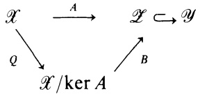

To see that $\mathcal { M } _ { \Omega } = \mathcal { M } _ { \alpha }$ for some $\alpha < \Omega ,$ let $\{ x _ { n } ^ { * } \}$ be a countable $\mathbf { w } \mathbf { k } ^ { * }$ dense subset of ball $\mathcal { M } _ { \mathbf { \Omega } }$ . For each n there is an $\alpha _ { n }$ such that $x _ { n } ^ { * } \in \mathcal { M } _ { \alpha _ { n } }$ . But $\alpha =$ ${ \mathfrak { s u p } } _ { n } \alpha _ { n } .$ So $\{ x _ { n } ^ { * } \} \subset$ ball $\mathcal { M } _ { \alpha }$ But ball $\mathcal { M } _ { \mathbf { \Omega } }$ is a compact metric space in the weak-star topology, so $\{ x _ { n } ^ { * } \}$ is $\mathbf { w } \mathbf { k } ^ { * }$ sequentially dense in ball $\mathcal { M } _ { \Omega }$ . Therefore ball $\mathcal { M } _ { \Omega } \subseteq \mathrm { b a l l } \mathcal { M } _ { \alpha + 1 }$ and $\mathcal { M } _ { \Omega } = \mathcal { M } _ { \alpha + 1 }$ ■

When is M weak-star sequentially dense in $\mathcal { X } ^ { * } ?$ The following result of Banach answers this question.

12.11. Theorem. If X is a separable Banach space and $\mathcal { M }$ is a linear manifold in $\mathcal { X } ^ { * }$ , then the following statements are equivalent.

(a) M is weak-star sequentially dense in $\mathcal { X } ^ { * }$

(b) There is a positive constant c such that for every x in $\mathcal { X } .$

$$
\| x \| \leqslant \sup \{ | \langle x , x ^ { * } \rangle | : x ^ { * } \in \mathcal { M } , \| x ^ { * } \| \leqslant c \}.
$$

(c) There is a positive constant c such that $\mathit { i f } \; x ^ { * }   \in   \mathsf { b a l l } \; \mathcal { X } ^ { * }$ , there is a sequence $\left\{ x _ { k } ^ { * } \right\}$ in $\mathcal { M } , \| x _ { k } ^ { * } \| \leqslant c ,$ such that $x _ { k } ^ { * }   \rightarrow   x ^ { * } \left( \mathbf { w } \mathbf { k } ^ { * } \right)$

ProoF. It is clear that (c) implies (a). The proof will consist in showing that (a) implies (c) and that (b) and (c) are equivalent.

$(a) \Rightarrow (c)$ : For each positive integer n, let $A _ { n } =$ the wk\* closure of n(ball M). If $x ^ { * } { \in } { \mathcal { X } } ^ { * }$ , let $\left\{ \boldsymbol { x } _ { k } ^ { * } \right\}$ be a sequence in $\mathcal { M }$ such that $x _ { k } ^ { * }   \rightarrow   x ^ { * } \left( \mathbf { w } \mathbf { k } ^ { * } \right)$ . By the PUB, there is an n such that $\| x _ { k } ^ { * } \| \leqslant n$ for all k. Hence $x ^ { * } { \in } A _ { n }$ That is, $\bigcup_{n = 1}^{\infty} A_{n} = \mathcal{X}^{*}$ Clearly each $A _ { n }$ is norm closed, so the Baire Category Theorem implies that there is an $A _ { n }$ that has interior in the norm topology. Thus there is an $x _ { 0 } ^ { * }$ in $A _ { n }$ and an $r   >   0$ such that $A _ { \mathfrak { n } } \supseteq \left\{ x ^ { \ast } { \in } { \mathcal { X } } ^ { \ast } { : ~ } \|   x ^ { \ast } - x _ { 0 } ^ { \ast }   \| \leqslant r \right\}$ . Let $\{ x _ { k } ^ { * } \} \subseteq$ $n ( \mathrm { b a l l } \mathcal { M } )$ such that $x _ { k } ^ { * }   \to   x _ { 0 } ^ { * } ( \mathbf { w } \mathbf { k } ^ { * } )$ . If x\*∈ball ${ \mathcal { X } } ^ { * } .$ , then $x _ { 0 } ^ { * } + r x ^ { * }   \in   \overline { { A } } _ { n } ;$ hence there is a sequence $\{ y _ { k } ^ { * } \}$ in n(ball $\mathcal { M } \}$ such that $y _ { k } ^ { * }   \rightarrow   x _ { 0 } ^ { * } + r x ^ { * } \; ( \mathbf { w } \mathbf { k } ^ { * } )$ . Thus $r ^ { - 1 } ( y _ { k } ^ { * } - x _ { k } ^ { * } ) \to x ^ { * }$ (wk\*) and $r^{-1}(y_k^* - x_k^*) \in c(\mathrm{bal}\mathcal{M})$ , where $c = 2 n / r$ is independent of $x ^ { * }$

$(c) \Rightarrow (b) : \mathrm{If} x \in \mathcal{X}$ , then Alaoglu's Theorem implies there is an $x ^ { * }$ in ball $\mathcal { X } ^ { * }$ such that $\langle x , x ^ { * } \rangle = \| x \|$ . By (c), there is a sequence $\left\{ \mathbf { x } _ { k } ^ { * } \right\}$ in c(ball M) such that $x _ { k } ^ { * }   \rightarrow   x ^ { * } \left( \mathbf { w } \mathbf { k } ^ { * } \right)$ . Thus $\langle x _ { k } ^ { * } , x \rangle   \to   \| x \|$ and (b) holds.

(b)⇒(c): According to (b), ball $\mathcal { X } \supseteq { } ^ { \circ } [ c ( \mathrm { b a l l } \mathcal { M } ) ]$ . Hence ball ${ \mathcal { X } } ^ { * } =$ (ball $\mathcal { X } ) ^ { \circ } \subseteq ^ { \circ } [ c ( \mathrm { b a l l } \mathcal { M } ) ] ^ { \circ }$ . By (1.8), $\mathrm{^{\circ}[c(ball\mathcal{M})]^{\circ}=the}$ weak-star closure of $c ( \mathrm { b a l l } \mathcal { M } )$ . But bounded subsets of $\mathcal { X } ^ { * }$ are weak-star metrizable (5.1) and hence (c) follows.

## EXERCISES

1. Suppose $\mathcal { X }$ is a normed space and that the only hyperplanes $\mathcal { M }$ in $\mathcal { X } ^ { * }$ such that $\mathcal { M } _ { 0 }$ ball $\mathcal { X } ^ { * }$ is weak-star closed are those that are weak-star closed. Prove that $\mathcal { X }$ is a Banach space.

2. (von Neumann) Let A be the subset of $l ^ { 2 }$ consisting of all vectors $\{ x _ { m n } \}$ $1 \leqslant m < n < \infty$ where $x_{mn}(m)=1, x_{mn}(n)=m,$ and $x_{mn}(k) = 0   if   k \neq m, n.$ Show that $0 \in \mathbf { w } \mathbf { k } - \mathbf { c } \mathbf { l } \mathbf { \nabla } A$ but no sequence in A converges weakly to 0.

3. Where were the hypotheses of the separability and completeness of $\mathcal { X }$ used in the proof of Theorem 12.11?

4. Let $\mathcal { X }$ be a separable Banach space. If M is a linear manifold in $\mathcal { X } ^ { * }$ give necessary and sufficient conditions that every functional in $\mathbf { w } \mathbf { k } ^ { * } - \mathbf { c } \mathbf { l } \mathcal { M }$ be the wk\* limit of a sequence from $\mathcal { M }$

5. Let $\mathcal { X }$ be a normed space and let $\mathcal { T }$ be a locally convex topology on $\mathcal { X }$ such that ball X is $\mathcal { T }$ -compact. Show that there is a Banach space $\pmb { y }$ such that $\mathcal { X }$ is isometrically isomorphic to $\mathcal { G } ^ { * }$ . (Hint: Let ${ \mathcal { Y } } = \left\{ x ^ { \star } { \in } { \mathcal { X } } ^ { \star } { : } x ^ { \star } \right\}$ ball X is $\scriptstyle { \mathcal { T } } - \scriptstyle { \mathsf { c o n t i n u o u s } } \} .$

6. If X is a compact connected topological space that is not a singleton, show that $C ( X )$ is not the dual of a Banach space. (For $C _ { \mathbb { R } } ( X )$ this is a consequence of Exercise 7.4. For the complex case, show that if C(X) is a dual space, then $C _ { \mathbb { R } } ( X )$ is a weak\* closed real linear subspace of C(X). Hint (S. Axler): Suppose $\{ u _ { j } \}$ is a net in ball $C _ { \mathbb { R } } ( X )$ such that $u _ { j }   \rightarrow   u + i$ v weak\*. If $v ( x ) = t > 0 .$ , choose n such that $1 + n ^ { 2 } < ( n + t ) ^ { 2 }$ and examine the net $\{ u _ { j } + i n \} .$ 1

## §13\*. Weak Compactness

In this section, two results are stated without proof. These results are among the deepest in the study of weak topologies.

13.1. The Eberlein-Smulian Theorem. $I f \mathcal { X }$ is a Banach space and $A \subseteq { \mathcal { X } }$ , then the following statements are equivalent.

(a) Each sequence of elements of A has a subsequence that is weakly convergent.

(b) Each sequence of elements of A has a weak cluster point.

(c) The weak closure of A is weakly compact.

An elementary proof of the Eberlein-Smulian Theorem can be found in Whitley [1967] and Kremp [1986]. Another proof can be found in Dunford and Schwartz [1958], p. 430. The serious student should examine Chapter V of Dunford and Schwartz [1958] for several results not presented here as well as for some of the history behind the material of this chapter.

The following is a consequence of the Eberlein-Smulian Theorem.

13.2. Corollary. $I f \mathcal { X }$ is a Banach space and $A \subseteq { \mathcal { X } }$ , then A is weakly compact if and only $\mathit { i f } A \cap \mathcal { M }$ is weakly compact for every separable subspace M of $\mathcal { X }$

If $\mathcal { X }$ is Banach space and A is a weakly compact subset of $\mathcal { X } .$ , then for each $x ^ { * }$ in $\mathcal { X } ^ { * }$ there is an $x _ { 0 }$ in A such that $| \langle x _ { 0 } , x ^ { * } \rangle | = \operatorname* { s u p } \{ | \langle x , x ^ { * } \rangle | : x \in A \}$ It is a rather deep fact due to R.C. James [1964a] that the converse is true.

13.3. James's Theorem. If X is a Banach space and A is a closed convex subset of $\mathcal { X }$ such that for each $x ^ { * }$ in $\mathcal { X } ^ { * }$ there is an $x _ { 0 }$ in A with

$$
| \langle x _ { 0 } , x ^ { * } \rangle | = \operatorname* { s u p } \{ | \langle x , x ^ { * } \rangle | : x \in A \} ,
$$

then A is weakly compact.

A proof of James's Theorem can be found in Pyrce [1966]. Another reference for a proof of this theorem as well as a number of other equivalent formulations of weak compactness and reflexivity is James [1964b]. Also, if $\mathcal { A }$ is only assumed to be a normed space in Theorem 13.2, the conclusion is false (see James [1971]).

The next result, presented with proof, is also called the Krein-Smulian Theorem and must not be confused with the theorem of the preceding section.

13.4. Krein-Smulian Theorem. If F is a Banach space and K is a weakly compact subset of X, then čo(K) is weakly compact.

PROOF. Case $I \colon \mathcal { X }$ is separable. Endow K with the relative weak topology; sO $M(K) = C(K)^*$ . If $\mu   \in   M ( K )$ , define $F _ { \mu } \colon { \mathcal { X } } ^ { * }   \to   \mathbb { F }$ by

$$
F _ { \mu } ( x ^ { * } ) = \int _ { K } \langle x , x ^ { * } \rangle d \mu ( x ) .
$$

It is easy to see that $F _ { \mu }$ is a bounded linear functional on $\mathcal { X } ^ { * }$ and $\| F _ { \mu } \| \leqslant$二 $\mu \left\| \operatorname{supp} \left\{ \left\| x \right\| : x \in K \right\} \right.$

13.5. Claim. $F _ { \mu } \colon { \mathcal { X } } ^ { * }   \to   \mathbb { F }$ is weak-star continuous.

By (12.8) it suffices to show that $F _ { \mu }$ is weak\* sequentially continuous. Let $\{ x _ { n } ^ { * } \}$ be a sequence in $\mathcal { X } ^ { * }$ such that $x _ { n } ^ { * }   \to   x ^ { * } \left( \mathbf { w } \mathbf { k } ^ { * } \right)   ,$ By the PUB, $M =$ $\operatorname { s u p } _ { n } \| x _ { n } ^ { \star } \| < \infty$ . Also, $\langle x , x _ { n } ^ { * } \rangle   \rightarrow   \langle x , x ^ { * } \rangle$ for every x in K. By the Lebesgue Dominated Convergence Theorem, $F _ { \mu } ( x _ { n } ^ { * } ) = \int \langle x , x _ { n } ^ { * } \rangle   d \mu ( x ) \to F _ { \mu } ( x ^ { * } )$ So (13.5) is established.

By (1.3), $F _ { \mu } { \in } { \mathcal { X } }$ . That is, there is an $x _ { \mu }$ in $\mathcal { X }$ such that $F _ { \mu } ( x ^ { * } ) = \langle x _ { \mu } , x ^ { * } \rangle$ Define T: $\dot { M ( K ) }   \rightarrow   \mathcal { X }$ by $T ( \mu ) = x _ { \mu }$

## 13.6. Claim. T: (M(K), wk\*) → (X, wk) is continuous.

In fact, this is clear. If $\mu _ { i }   \rightarrow   0$ weak\* in $M ( K ) ,$ then for each $x ^ { * }$ in $\mathcal { X } ^ { * }$ $x ^ { * } | K { \in } C ( K )$ . Hence $\langle T ( \mu _ { i } ) , x ^ { * } \rangle = \int \langle x , x ^ { * } \rangle d \mu _ { i } ( x ) \to 0$

Let $\mathcal { P } =$ the probability measures on K. By Alaoglu's Theorem $\mathcal { P }$ is weak\* compact. Thus $T ( { \mathcal { P } } )$ is weakly compact and convex. However, if $x { \in } K$ $\langle T ( \delta _ { x } ) , x ^ { * } \rangle = \langle x , x ^ { * } \rangle ;$ that is, $T ( \delta _ { x } ) = x$ So $T ( { \mathcal { P } } ) \supseteq K$ . Hence $T ( { \mathcal { P } } ) \supseteq { \overline { { \operatorname { c o } } } } ( K )$ and co(K) must be compact.

Case 2: $\mathcal { X }$ is arbitrary. Let $\{ x _ { n } \}$ be a sequence in co(K). So for each n there is a finite subset $F _ { n }$ of K such that $x_{n} \in \mathrm{co}(F_{n}).$ Let $F = \bigcup_{n = 1}^{\infty} F_{n}$ and let $\mathcal { H } = \vee   F$ . Then $K _ { 1 } = K \cap \mathcal { M }$ is weakly compact and $\{ x _ { n } \} \subseteq \operatorname { c o } ( K _ { 1 } )$ . Since l is separable, Case 1 implies that $\overline { { \mathbf { c o } } } ( K _ { 1 } )$ is weakly compact. By the Eberlein-Smulian Theorem, there is a subsequence $\left\{ x _ { n _ { k } } \right\}$ and an x in co $( K _ { 1 } )   \subseteq$ ${ \overline { { \mathbf { c o } } } } ( K )$ such that $x _ { n _ { k } }   \rightarrow   x$ Thus ${ \overline { { \mathbf { c o } } } } ( K )$ is weakly compact.

## §13. Weak Compactness

Another proof of the Krein-Smulian Theorem that avoids 13.1 and 12.8 can be found in Simons [1967].

## EXERCISES

1. Prove Corollary 13.2.

2. If $\mathcal { X }$ is a Banach space and K is a compact subset of $\mathcal { X } ,$ prove that ${ \overline { { \mathbf { c o } } } } ( K )$ is compact. (This will be proved in Theorem VI.4.8 below.)

3. In the proof of (13.4), if $\mathcal { P } =$ the probability measures on K, show that $T ( { \mathcal { P } } ) =$ ${ \overline { { \mathbf { c o } } } } ( K )$

4. Prove the Eberlein-Smulian Theorem in the setting of Hilbert space.

5. Refer to the notation of Exercise 11.10. Prove that there is a bounded linear functional $L \colon A P ( G ) \to \mathbb { F }$ such that $L(1)=1,L(f)\geqslant 0  if   f\geqslant 0$ , and $L ( f _ { x } ) = L ( f )$ for all $f$ in $A P ( G )$ and x in G.

# CHAPTER VI Linear Operators on a Banach Space

As has been said before in this book, the theory of bounded linear operators on a Banach space has seen relatively little activity owing to the difficult geometric problems inherent in the concept of a Banach space. In this chapter several of the general concepts of this theory are presented. When combined with the few results from the next chapter, they constitute essentially the whole of the general theory of these operators.

We begin with a study of the adjoint of a Banach space operator. Unlike the adjoint of an operator on a Hilbert space (Section II.2), the adjoint of a bounded linear operator on a Banach space does not operate on the space but on the dual space.

## §1. The Adjoint of a Linear Operator

Suppose $\mathcal { X }$ and $\mathcal { Y }$ are vector spaces and $T \colon { \mathcal { X } }   \to   { \mathcal { Y } }$ is a linear transformation. Let $\mathcal { Y } ^ { \prime } = \mathrm { a l l }$ of the linear functionals of $\mathcal { Y } \rightarrow \mathbb { F }$ If $y ^ { \prime } \in \mathcal { Y } ^ { \prime }$ , then $y ^ { \prime } \circ T \colon { \mathcal { X } } \to \mathbb { F }$ is easily seen to be a linear functional on $\mathcal { X } .$ That is, $y ^ { \prime }   \circ T   \in   \mathcal { X } ^ { \prime }$ . This defines a map

$$
T ^ { \prime } \colon { \mathcal { Y } } ^ { \prime }   \to   { \mathcal { X } } ^ { \prime }
$$

by $T ^ { \prime } ( y ^ { \prime } ) = y ^ { \prime } \circ T .$ The first result shows that if $\mathcal { X }$ and $\theta$ are Banach spaces, then the map $T ^ { \prime }$ can be used to determine when $T$ is bounded. Another equivalent formulation of boundedness is given by means of the weak topology.

1.1. Theorem. If $\mathcal { X }$ and $\theta$ are Banach spaces and $T { \colon } { \mathcal { X } }   { \to }   { \mathcal { Y } }$ is a linear transformation, then the following statements are equivalent.

(a) T is bounded.

(b) $T ^ { \prime } ( { \mathcal { Y } } ^ { * } )   \subseteq   { \mathcal { X } } ^ { * }$

(c) $T \colon ( \mathcal { X } , \mathrm { w e a k } ) \to ( \mathcal { G } )$ ,weak) is continuous.

PROOF. $( \mathsf { a } ) { \Rightarrow } ( \mathsf { b } ) { : }   \mathbf { I f }   y ^ { * } { \in } { \mathcal { Y } } ^ { * }$ , then $T ^ { \prime } ( y ^ { * } ) { \in } { \mathcal { X } } ^ { \prime }$ ; it must be shown that $T ^ { \prime } ( y ^ { \star } ) { \in } { \mathcal { X } } ^ { \star }$ But $| T ^ { \prime } ( y ^ { \star } ) ( x ) | = | y ^ { \star } \circ T ( x ) | = | \zeta T ( x ) , y ^ { \star } \rangle | \leqslant \| T ( x ) \| \| y ^ { \star } \| \leqslant \| T \| \| y ^ { \star } \| \| x \|$ So $T ^ { \prime } ( y ^ { \star } ) { \in } { \mathcal { X } } ^ { \star }$

$(b) \Rightarrow (c);$ If $\left\{ x _ { i } \right\}$ is a net in $\mathcal { X }$ and $x _ { i }   \to   0$ weakly, then for $y ^ { * }$ in $\mathcal { B } ^ { * }$ $\langle T(x_i), y^* \rangle = \widetilde{T'(y^*)}(x_i) \to 0$ since $T ^ { \prime } ( y ^ { \ast } ) { \in } { \mathcal { X } } ^ { \ast }$ . Hence $T ( x _ { i } )   \rightarrow   0$ weakly in Y. $$( \mathtt { c } ) { \Rightarrow } ( \mathtt { b } ) { : } \operatorname { I f } y ^ { \ast } { \in } { \mathcal { Y } } ^ { \ast }$$ , then $y ^ { * } \circ T \colon { \mathcal { X } } \to \mathbb { F }$ is weakly continuous by (c). Hence $T ^ { \prime } ( y ^ { * } ) = y ^ { * } \circ T \in \mathcal { X } ^ { * }$ by (V.1.2).

(b)⇒(a): Let $y ^ { * } \in \mathcal { Y } ^ { * }$ and put $x ^ { * } = T ^ { \prime } ( y ^ { * } )$ . So $x ^ { * } { \in } { \mathcal { X } } ^ { * }$ by (b). So if $x \in$ ball $\mathcal { X }$ $| \langle T ( x ) , y ^ { * } \rangle | = | \langle x , x ^ { * } \rangle | \leqslant \| x ^ { * } \|$ . That is, sup $\{ | \langle T ( x ) , y ^ { * } \rangle | :$ x∈ball $x \} < \infty$ Hence T(ball X) is weakly bounded; by the PUB, T(ball ) is norm bounded and so $\| T \| < \infty$

The preceding result is useful, though strictly speaking it is not necessary for the purpose of defining the adjoint of an operator A in $\mathcal { B } ( \mathcal { X } , \mathcal { Y } )$ , which we now turn to. If $A   \in   \mathcal { B } ( \mathcal { X } , \mathcal { Y } )$ and $y ^ { * } \in \mathcal { Y } ^ { * }$ , then $y ^ { * } \circ A = A ^ { \prime } ( y ^ { * } ) { \in } { \mathcal { X } } ^ { * }$ . This defines a map $A ^ { * } \colon { \mathcal { Y } } ^ { * }   \to   { \mathcal { X } } ^ { * }$ , where $A ^ { * } = A ^ { \prime } | \mathcal { Y } ^ { * }$ . Hence

## 1.2

$$
\langle x , A ^ { * } ( y ^ { * } ) \rangle = \langle A ( x ) , y ^ { * } \rangle
$$

for x in $\mathcal { X }$ and $y ^ { * }$ in ${ \mathcal { Y } } ^ { * } . A ^ { * }$ is called the adjoint of A.

Before exploring the concept let's see how this compares with the definition of the adjoint of an operator on Hilbert space given in §II.2. There is a difference, but only a small one. When $\mathcal { H }$ is identified with $\mathcal { H } ^ { * }$ , the dual space of $\mathcal { H } ,$ the identification is not linear but conjugate linear $( \mathrm { i f } \mathbb { F } = \mathbb { C } )$ The isometry $h   \mapsto   L _ { h }$ of $\mathcal { H }$ onto $\mathcal { H } ^ { * }$ , where $L _ { h } ( f ) = \langle f , h \rangle$ , satisfies $L _ { \alpha h } = \bar { \alpha } L _ { h }$ Thus the definition of $A ^ { * }$ given in (1.2) above is not the same as the adjoint of an operator on Hilbert space, since in (1.2) $A ^ { * }$ is defined on $\mathcal { B } ^ { * }$ and not some conjugate-linear isomorphic image of it. In particular, if the definition (1.2) is applied to a matrix A acting on $\mathbf { C } ^ { d }$ considered as a Banach space, its adjoint corresponds to the transpose of A. If $\mathbf { C } ^ { d }$ is considered as a Hilbert space, then the matrix of $A ^ { * }$ is the conjugate transpose of the matrix of A. This difference will not confuse us but it will serve to explain minor differences that will appear in the treatment of the two types of adjoints. The first of these occurs in the next result.

1.3. Proposition. If X and Y are Banach spaces, A, $B \in \mathcal { B } ( \mathcal { X } , \mathcal { Y } )$ , and $\alpha , \beta   \in   \mathbf { F } .$ then $( \alpha A + \beta B ) ^ { * } = \alpha A ^ { * } + \beta B ^ { * }$ . Moreover, $A ^ { * } \colon ( \mathcal { B } ^ { * } , \mathrm { w } \mathbf { k } ^ { * } ) { \rightarrow } ( \mathcal { X } ^ { * } , \mathrm { w } \mathbf { k } ^ { * } )$ is continuous.

Note the absence of conjugates. The proof is left to the reader.

If $A \in \mathcal{B}(\mathcal{X}, \mathcal{Y})$ , then it is easy to see that $A ^ { * } { \in } { \mathcal { B } } ( { \mathcal { Y } } ^ { * } , { \mathcal { X } } ^ { * } )$ In fact, if $y ^ { * } \epsilon$ ball $\mathcal { B } ^ { * }$ and x∈ball $\mathcal { X }$ , then $\left| \left\langle x, A^{*} y^{*} \right\rangle \right| = \left| \left\langle A x, y^{*} \right\rangle \right| \leqslant \left\| A x \right\| \leqslant \left\| A \right\|$ . Hence $\|   A ^ { \star } y ^ { \star }   \| \leqslant \|   A   \| \quad \mathrm { i f } \quad y ^ { \star }$ εball $\mathcal { B } ^ { * }$ so that $\| A ^ { \star } \| \leqslant \| A \|$ . This implies that

$( A ^ { * } ) ^ { * } \equiv A ^ { * * }$ can be defined,

$$
A ^ { * * } \colon \mathcal { X } ^ { * * } \to \mathcal { Y } ^ { * * } ,
$$

$$
\langle A ^ { * * } x ^ { * * } , y ^ { * } \rangle = \langle x ^ { * * } , A ^ { * } y ^ { * } \rangle
$$

for $x ^ { * * }$ in $\mathcal { X } ^ { * * }$ and $y ^ { * }$ in $\mathcal { Y } ^ { * } ,$

Suppose $x { \in } { \mathcal { X } }$ and consider x as an element of $\mathcal { X } ^ { * * }$ via the natural embedding of X into its double dual. What is $A ^ { * * } ( x ) ?$ For $y ^ { * }$ in $\mathcal { Q } *$

$$
\begin{aligned}\langle   A^{**}(x), y^* \rangle &= \langle   x, A^* y^* \rangle \\&= \langle   Ax, y^* \rangle.\end{aligned}
$$

That is, $A ^ { * * } | { \mathcal { X } } = A$ . This is the first part of the next proposition.

1.4. Proposition. If X and Y are Banach spaces and $A   \in   \mathcal { B } ( \mathcal { X } , \mathcal { Y } )$ , then:

(a) $A ^ { * * } | { \mathcal { X } } = A ;$

(b) $\| A ^ { * } \| = \| A \|$ 2

(c) $\boldsymbol { i } f A$ is invertible, then $A ^ { * }$ is invertible and $(A^{*})^{-1} = (A^{-1})^{*}$

(d) if X is a Banach space and $B \in \mathcal { B } ( \mathcal { Y } , \mathcal { X } ) ,$ then $( B A ) ^ { * } = A ^ { * } B ^ { * }$

ProoF. Part (a) was proved above. It was shown that $\left\| A ^ { * } \right\| \leqslant \left\| A \right\|$ . Thus $\left\| \boldsymbol{A}^{* *} \right\| \leqslant \left\| \boldsymbol{A}^{*} \right\|$ . So if x∈ball $\mathcal { X } ,$ then (a) implies that $\| A x \| = \| A^{**} x \| \leqslant$ $\left\|   A^{* *} \right\| \leqslant \left\|   A^{*} \right\|$ . Hence $\| A \| \leqslant \| A^{*} \|$

The remainder of the proof is left to the reader.

1.5. Example. Let $( X , \Omega , \mu )$ and $M _ { \phi } : L ^ { p } ( \mu ) \to L ^ { p } ( \mu )$ be as in Example III.2.2. If $1 \leqslant p < \infty$ and $1 / p + 1 / q = 1$ , then $M _ { \phi } ^ { * } \colon L ^ { q } ( \mu )   \to   L ^ { q } ( \mu )$ is given by $M _ { \phi } ^ { * } f = \phi f .$ That is, $M _ { \phi } ^ { * }   =   M _ { \phi }$

1.6. Example. Let K and k be as in Example III.2.3. If $1 \leqslant p < \infty$ and $1 / p + 1 / q = 1$ , then $K ^ { * } \colon L ^ { q } ( \mu ) \to L ^ { q } ( \mu )$ is the integral operator with kernel $k ^ { * } ( x , y ) \equiv k ( y , x )$

1.7. Example. Let $X , Y , \tau ,$ and A be as in Example III.2.4. Then $A ^ { * } \colon M ( Y ) \to$ $M ( X )$ is given by

$$
( A ^ { * } \mu ) ( \Delta ) = \mu ( \tau ^ { - 1 } ( \Delta ) )
$$

for every Borel subset ∆ of X and every μ in $M ( Y )$

Compare (1.5) and (1.6) with (II.2.8) and (II.2.9) to see the contrast between the adjoint of an operator on a Banach space with the adjoint of a Hilbert space operator.

1.8. Proposition. $If A \in \mathcal{B}(\mathcal{X}, \mathcal{Y})$ , then ker $A^{*} = (\mathrm{rank} A)^{\perp}$ and ker $A = \mathrm{^{\perp}}(\mathrm{rank}   A^{*})$

The proof of this useful result is similar to that of Proposition II.2.19 and is left to the reader.

This enables us to prove the converse of Proposition 1.4c.

1.9. Proposition. If $A   \in   \mathcal { B } ( \mathcal { X } , \mathcal { Y } )$ , then A is invertible if and only if $A ^ { * }$ is invertible.

PRoOF. In light of (1.4c) it suffices to assume that $A ^ { * }$ is invertible and show that A is invertible. Since $A ^ { * }$ is an open mapping, there is a constant $c > 0$ such that $A ^ { * } ,$ (ball $\mathcal { B } ^ { \star } \big )   \supseteq   \big \{ x ^ { \star } { \in } \mathcal { X } ^ { \star } \colon \|   x ^ { \star }   \| \leqslant c \big \}$ . So if $x   \in   \mathcal { X }$ , then

$$
\begin{align*}\|Ax\| &= \sup \{|\langle Ax, y^*\rangle| \colon y^* \in \mathrm{ball} \mathcal{Y}^*\} \\&= \sup \{|\langle x, A^* y^*\rangle| \colon y^* \in \mathrm{ball} \mathcal{Y}^*\} \\&\geqslant \sup \{|\langle x, x^*\rangle| \colon x^* \in \mathcal{X}^* \mathrm{and} \|x^*\| \leqslant c\} \\&= c^{-1}\|x\|.\end{align*}
$$

Thus ker $A = ( 0 )$ and ran A is closed. (Why?) On the other hand, $( \mathrm{ran}   A )^{\perp} = \mathrm{ker}   A^{*} = ( 0 )$ since $A ^ { * }$ is invertible. Thus ran A is also dense. This implies that A is surjective and thus invertible.

This section concludes with the following useful result that seems to be somewhat unfamiliar to parts of the mathematical community.

1.10. Theorem. If X and Y are Banach spaces and $A   \in   \mathcal { B } ( \mathcal { X } , \mathcal { Y } ) .$ then the following statements are equivalent.

(a) ran A is closed.

(b) ran $A ^ { * }$ is weak\* closed.

(c) ran $A ^ { * }$ is norm closed.

PRooF. It is clear that (b) implies (c), so it will be shown that (a) implies (b) and (c) implies (a). Before this is done, it will be shown that it suffices to prove the theorem under the additional hypothesis that A is injective and has dense range.

Let $\mathcal{L} = \mathrm{cl}(\mathrm{rank}   A)$ Thus $A { \colon }   { \mathcal { X } }   { \to }   { \mathcal { L } }$ induces a bounded linear map B: ${ \mathcal { X } } / \ker A \to { \mathcal { X } }$ defined by $B(x + \ker A) = Ax$ If $\mathcal { Q } \colon \mathcal { X }   \to   \mathcal { X } /$ ker A is the natural map, the diagram

commutes. (Why is B bounded?) It is easy to see that B is injective and that B has dense range. In fact, ran $B = \tan A$ so ran A is closed if and only if ran B is closed. Let's examine $B ^ { * } \colon \mathcal { X } ^ { * } \to ( \mathcal { X } / \ker A ) ^ { * } . \mathrm { ~ B y ~ ( V . 2 . 2 ) , ( \mathcal { X } / \ker A ) ^ { * } = }$ $( \ker A ) ^ { \perp } = \operatorname { w k } ^ { * } \operatorname { c l } ( \operatorname { r a n } A ^ { * } ) \subseteq { \mathcal { X } } ^ { * }$ by (1.8). Also by (V.2.3), since $\mathcal { L } \leqslant \mathcal { Y }$ $\mathcal { I } ^ { * } = \mathcal { A } ^ { * } / \mathcal { J } ^ { \perp } = \mathcal { A } ^ { * } / ( \operatorname { r a n } A ) ^ { \perp } = \mathcal { A } ^ { * } ,$ /ker $A ^ { * }$ by (1.8). Thus,

$$
B ^ { * } \colon { \mathcal { A } } ^ { * } / \ker A ^ { * } \to ( \ker A ) ^ { \perp } .
$$