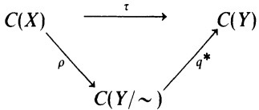

$\rho ( T ) = T \oplus T$ .Then $\rho$ is a \*-isomorphism. However, $\mathcal { A } _ { \mu }$ and $\mathcal { A } _ { \boldsymbol { \mu } } ^ { ( 2 ) }$ are not spatially isomorphic. That is, there is no Hilbert space isomorphism $U ;$ $\dot { L } ^ { 2 } ( \mu ) \to L ^ { 2 } ( \mu ) \oplus L ^ { 2 } ( \mu )$ such that $U \mathcal { A } _ { \mu } U ^ { - 1 } = \mathcal { A } _ { \mu } ^ { ( 2 ) }$ . Why? One way to see that no such U exists is to note that $\alpha _ { \mu }$ has a cyclic vector (give an example). However, $\mathcal { A } _ { \mu } ^ { ( 2 ) }$ does not have a cyclic vector as shall be seen presently (Theorem 7.8).

7.5. Definition. If $\mathcal { A } \subseteq \mathcal { B } ( \mathcal { H } )$ and $e _ { 0 } \in \mathcal { H }$ , then $e _ { 0 }$ is a separating vector for $\varkappa$ if the only operator A in $\varkappa$ such that $A e _ { 0 } = 0$ is the operator $A   =   0$

If $( X , \Omega , \mu )$ is a $\sigma - \mathrm { f i n i t e }$ measure space and $f   \in   L ^ { 2 } ( \mu )$ such that $\mu ( \{ x { \in } X$ $f(x) = 0 \} = 0$ (Why does such an f exist?), then f is a separating vector for $\mathcal { A } _ { \mu }$ as well as a cyclic vector. If $\mathcal { A } = \mathcal { B } ( \mathcal { H } )$ , then no vector in $\mathcal { H }$ is separating for  while every nonzero vector is a cyclic vector. If $\mathbf { \mathcal { A } } = \mathbf { C }$ and dim $\mathcal { H } > 1$ then  has no cyclic vectors but every nonzero vector is separating for .

7.6. Proposition. $\mathit { I f } \: e _ { 0 }$ is a cyclic vector for $\alpha ,$ then $e _ { 0 }$ is a separating vector for $\alpha ^ { \prime }$

PROOF. If $T \in \mathcal { A } ^ { \prime }$ and $T e _ { 0 }   =   0 ,$ then for every A in , $T A e _ { 0 } = A T e _ { 0 } = 0$ Since $\nabla \mathcal { A } e _ { 0 } = \mathcal { H } , \; T = 0$

7.7. Corollary. If A is an abelian subalgebra of $\mathcal { B } ( \mathcal { H } )$ , then every cyclic vector for A is a separating vector for $\alpha$

PRoOF. Because is abelian, $\mathcal { A } \subseteq \mathcal { A } ^ { \prime }$

Since $\mathcal { B } ( \mathcal { H } ) ^ { \prime } = \mathbb { C }$ , Proposition 7.6 explains some of the duality exhibited prior to $(7.6)$ . Also note that if $( X , \Omega , \mu )$ is a finite measure space, 1  0, 0  1, and $1 \oplus 1$ are all separating vectors for $\mathcal { A } _ { \mu } ^ { ( 2 ) }$ . Because $\mathcal { A } _ { \mu } ^ { ( 2 ) } \neq ( \mathcal { A } _ { \mu } ^ { ( 2 ) } ) ^ { \prime }$ , the next theorem says that $\mathcal { A } _ { \boldsymbol { \mu } } ^ { ( 2 ) }$ has no cyclic vector.

Although it is easy to see that conditions (a) and (b) in the next result are equivalent, irrespective of any assumption on $\mathcal { H } ,$ the equivalence of the remaining parts to (a) and (b) is not true unless some additional assumption is made on $\mathcal { H }$ or $\varkappa$ (see Exercise 5). We are content to assume that $\mathcal { H }$ is separable.

7.8. Theorem. Assume that $\mathcal { H }$ is separable and A is an abelian $C ^ { * }$ -subalgebra of $\mathcal { B } ( \mathcal { H } )$ . The following statements are equivalent.

(a) A is a maximal abelian von Neumann algebra.

(b) $\mathcal { A } = \mathcal { A } ^ { \prime } .$

(c) $\varkappa$ has a cyclic vector, contains 1, and is SOT closed.

(d) There is a compact metric space X, a positive Borel measure $\mu$ with support X, and an isomorphism U: $L ^ { 2 } ( \mu ) \to \mathcal { H }$ such that $U \mathcal { A } _ { \mu } U ^ { - 1 } = \mathcal { A }$

ProoF. The proof that (a) and (b) are equivalent is left as an exercise.

(b)⇒(c): By Zorn's Lemma and the separability of $\mathcal { H } ,$ , there is a maximal sequence of unit vectors $\{ e _ { n } \}$ such that for $n \neq m ,$ cl $[ \mathcal { A } e _ { n } ] \bot \mathrm { c l } [ \mathcal { A } e _ { m } ]$ . It follows from the maximality of $\{ e _ { n } \}$ that $\mathcal { H } = \oplus _ { n = 1 } ^ { \infty } \operatorname { c l } [ \mathcal { A } e _ { n } ]$

Let $e_{0}=\sum_{n = 1}^{\infty}e_{n}/\sqrt{2^{n}}$ Since $e _ { n } \bot e _ { m }$ for $n \neq m, \quad \| e_0 \|^2 = \sum 2^{-n} = 1$ . Let $P _ { n }   =$ the projection of $\mathcal { H }$ onto $\mathcal { H } _ { n } = \mathrm { c l } [ \mathcal { A } e _ { n } ]$ Clearly $\varkappa$ leaves $\mathcal { H } _ { n }$ invariant and so, since $\alpha$ is a \*-algebra, $\mathcal { H } _ { n }$ reduces $\alpha ,$ Thus $P _ { n } \in \mathcal { A } ^ { \prime } = \mathcal { A }$ and C $\mathrm { l } [ \mathcal { A } e _ { 0 } ] \supseteq \mathrm { c l } [ \mathcal { A } P _ { n } e _ { 0 } ] = \mathrm { c l } [ \mathcal { A } e _ { n } ] = \mathcal { H } _ { n } .$ Therefore cl $[ \mathcal { A } e _ { 0 } ] = \mathcal { H }$ and $e _ { 0 }$ is a cyclic vector for $\varkappa$

(c)⇒(d): Since $\mathcal { H }$ is separable, ball $\varkappa$ is WOT metrizable and compact (1.3 and 5.5). By picking a countable WOT dense subset of ball $\alpha$ and letting $\mathcal { A } _ { 1 }$ be the $C ^ { * }$ -algebra generated by this countable dense subset, it follows that $\mathcal { A } _ { 1 }$ is a separable C\*-algebra whose SOT closure is $\varkappa$ Let X be the maximal ideal space of $\alpha _ { j }$ and let $\rho \colon C ( X ) \to \mathcal { A } _ { 1 } \subseteq \mathcal { A } \subseteq \mathcal { B } ( \mathcal { H } )$ be the inverse of the Gelfand map. By Theorem 1.14 there is a spectral measure E defined on the Borel subsets of X such that $\rho ( u ) = \int u   d E$ for u in C(X). If $\phi   \in   B ( X )$ and $\{ u _ { i } \}$ is a net in C(X) such that $\int u _ { i }   d v \to \int \phi   d v$ for every v in M(X), then $\rho ( u _ { i } ) = \int u _ { i } d E \to \int \phi d E$ (WOT). Thus $\left\{ \int \phi   d E : \phi \in B ( X ) \right\} \subseteq \mathcal { A }$ since $\alpha$ is SOT closed.

Let $e _ { 0 }$ be a cyclic vector for $\varkappa$ and put $\mu ( \Delta ) = \| E ( \Delta ) e _ { 0 } \| ^ { 2 } = \langle E ( \Delta ) e _ { 0 } , e _ { 0 } \rangle$ Thus $\langle ( \int \phi   d E ) e _ { 0 } , e _ { 0 } \rangle = \int \phi   d \mu$ for every $\phi$ in B(X). Consider $B ( X )$ as a linear manifold in $L ^ { 2 } ( \mu )$ by identifying functions that agree a.e. [μ]. If $\phi   \in   B ( X ) ,$ , then

$$
\begin{align*}\left\| \left( \int \phi   dE \right) e_0 \right\|^2 &= \left\langle \left( \int \phi   dE \right)^* \left( \int \phi   dE \right) e_0, e_0 \right\rangle \\&= \int |\phi|^2 d\mu.\end{align*}
$$

This says two things. First, if $\phi = 0 \mathrm { a . e . } [ \mu ] ,$ then $\left( \int \phi   d E \right) e _ { 0 } = 0$ Hence $U ;$ $B ( X ) \to { \mathcal { H } }$ defined by $U \phi = ( \int \phi   d E ) e _ { 0 }$ is a well-defined map from the dense manifold B(X) in $L ^ { 2 } ( \mu )$ into $\mathcal { H }$ . Second, U is an isometry. Since the domain and range of $U$ are dense (Why?), U extends to an isomorphism $U \colon L ^ { 2 } ( \mu ) \to { \mathcal { H } }$

$\mathbf { I f } \quad \phi \in { \pmb B } ( X )$ and $\psi   \in   L ^ { \infty } ( \mu ) ,$ then $U M _ { \psi } \phi = U ( \psi \phi ) = ( \int \psi \phi   d E ) e _ { 0 } =$ $( \int \psi   d E ) ( \int \phi   d E ) e _ { 0 } = ( \int \psi   d E ) U \phi$ . Hence $U M _ { \psi } U ^ { - 1 } = \int \psi d E$ and $U \mathcal { A } _ { \mu } U ^ { - 1 } \subseteq \mathcal { A }$ On the other hand, $\left[ U \mathcal { A } _ { \mu } U ^ { - 1 } \right.$ is a SOT closed $C ^ { * }$ -subalgebra of $\mathcal { B } ( \mathcal { H } )$ that contains $U C ( X ) U ^ { - 1 } = \dot { \mathcal { A } } _ { 1 }$ . (Why?) So $U \mathcal { A } _ { \mu } U ^ { - 1 } = \mathcal { A } .$

Because $\mathcal { A } _ { 1 }$ is separable, X is metrizable.

(d)⇒(b): This is a consequence of Theorem 6.6 and Proposition 7.4.

Mercer (1986) shows that for a maximal abelian von Neumann algebra $\alpha ,$ there is an orthonormal basis for the underlying Hilbert space consisting of vectors that are cyclic and separating for $\varkappa$

7.9. Corollary. If A is an abelian $C ^ { * }$ -subalgebra of $\mathcal { B } ( \mathcal { H } )$ and $\mathcal { H }$ is separable, then $\alpha$ has a separating vector.

PRoOF. By Zorn's Lemma, $\varkappa$ is contained in a maximal abelian $C^{*} - \mathrm{algebra}$ $\mathcal { A } _ { m }$ It is easy to see that $\mathcal { A } _ { m }$ must be SOT closed, so $\alpha _ { m }$ is a maximal abelian von Neumann algebra. By the preceding theorem, there is a cyclic vector $e _ { 0 }$ for $\mathcal { A } _ { m }$ But (7.7) $e _ { 0 }$ is separating for $\mathcal { A } _ { m }$ and hence for any subset of $\mathcal { A } _ { m }$

The preceding corollary may seem innocent, but it is, in fact, the basis for the next section.

## EXERCISES

1. Prove Proposition 7.3.

2. Prove Proposition 7.4.

3. Why are $\alpha _ { \mu }$ and $\mathcal { A } _ { \mu } ^ { ( 2 ) }$ not spatially isomorphic?

4. Show that if X is any compact metric space, there is a separable Hilbert space $\mathcal { H }$ and a \*-monomorphism $\tau \colon C ( X ) \to { \mathcal { B } } ( { \mathcal { H } } )$ . Find the spectral measure for τ.

5. Let be an abelian $C ^ { * }$ -subalgebra of $\mathcal { B } ( \mathcal { H } )$ such that $\alpha ^ { \prime }$ contains no uncountable collection of pairwise orthogonal projections. Show that the following statements are equivalent: (a) $\alpha$ is a maximal abelian von Neumann algebra; (b) $\mathcal { A } = \mathcal { A } _ { 2 } ^ { \prime }$ (c) $\alpha$ has a cyclic vector and is SOT closed; (d) there is a finite measure space $( X , \Omega , \mu )$ and an isomorphism U: $L ^ { 2 } ( \mu ) \to \mathcal { H }$ such that $U \mathcal { A } _ { \mu } U ^ { - 1 } = \mathcal { A } .$

6. Let $\{ P _ { n } \}$ be a sequence of commuting projections in $\mathcal { B } ( \mathcal { H } )$ and put $A =$ $\sum_{n = 1}^{\infty}3^{- n}(2P_{n} - 1)$ .Show that $C ^ { * } ( A )$ is the $C^{*} - \mathrm{algebra}$ generated by $\{ P _ { n } \}$ . (Do you see a connection between A and the Cantor-Lebesgue function?)

7. If $\varkappa$ is an abelian von Neumann algebra on a separable Hilbert space $\mathcal { H }$ ,show that there is a hermitian operator A such that $\varkappa$ equals the smallest von Neumann algebra containing A. (Hint: Let $\{ P _ { n } \}$ be a countable WOT dense subset of the set projections in $\varkappa$ and use Exercise 6. This proof is due to Rickart [1960], pp. 293–294. Also see Jenkins [1972].)

8. If X is a compact space, show that C(X) is generated as a $C ^ { * } .$ -algebra by its characteristic functions if and only if X is totally disconnected. If A is as in Exercise 6, show that $\sigma ( A )$ is totally disconnected.

9. If X and Y are compact spaces and $\tau \colon C ( X ) \to C ( Y )$ is a homomorphism with $\tau ( 1 ) = 1$ , show that there is a continuous function φ: $Y   \rightarrow   X$ such that $\tau ( u ) = u \circ \phi$ for every u in C(X). Show that τ is injective if and only if $\phi$ is surjective, and, in this case, τ is an isometry. Show that τ is surjective if and only if $\phi$ is injective.

10. Let X and Z be compact spaces, $Y = X \times Z ,$ and let φ: Y → X be the projection onto the first coordinate. Define τ: C(X) → C(Y) by τ(u) = u° φ. Describe the range of τ.

11. Adopt the notation of Exercise 9. Define an equilvalence relation \~ on Y by saying $y _ { 1 } \sim y _ { 2 }$ if and only if $\phi ( y _ { 1 } ) = \phi ( y _ { 2 } )$ . Let q: $Y   \to   Y /   \sim$ be the natural map and $q ^ { * } \colon C ( Y / \sim ) \to C ( Y )$ the induced homomorphism. Show that there is a \*-epimorphism $\rho \colon C ( X ) \to C ( Y / \sim )$ such that the diagram

commutes. Find the corresponding injection $Y / { \sim } \to X .$

12. If X is any compact metric space, show that there is a totally disconnected compact metric space Y and a continuous surjection $\phi \colon Y   \to   X$ . (Hint: Start by embedding C(X) into $\mathcal { B } ( \mathcal { H } )$ and use Exercises 7 and 8.)

13. Show that every totally disconnected compact metric space is the continuous image of the Cantor ternary set. (Do this directly; do not try to use $C^{*} -algebrs.$ Combine this with Exercise 12 to get that every compact metric space is the continuous image of the Cantor set.

14. If  is an abelian von Neumann algebra and X is its maximal ideal space, then X is a Stonean space; that is, if U is open in X, then cl U is open in X.

15. This exercise assumes Exercise 2.21 where it was proved that $\mathcal { B } _ { 1 } ^ { * } = \mathcal { B } .$ When referring to the weak\* topology on $\mathcal { B } = \mathcal { B } ( \mathcal { H } )$ , we mean the topology  has as the Banach dual of $\mathcal { B } _ { 1 }$ (a) Show that on bounded subsets of $\pmb { \mathscr { B } }$ the weak\* topology = WOT. (b) Show that a C\*-subalgebra of $\mathcal { B } ( \mathcal { H } )$ is von Neumann algebra if and only if $\varkappa$ is weak\* closed. (c) Show that WOT and the weak\* topology agree on abelian von Neumann algebras (See Takeda [1951] and Pallu de la Barrière [1954].) (d) Give an example of a weak\* closed subspace of  that is not WOT closed. (See von Neumann [1936].)

16. Prove the converse of Proposition 7.6.

## §8. The Functional Calculus for Normal Operators: The Conclusion of the Saga

## In this section it will always be assumed that

## all Hilbert spaces are separable.

Indeed, this assumption will remain in force for the rest of the chapter. This assumption is necessary for the validity of some of the results and minimizes the technical details in others.

If N is a normal operator on $\mathcal { H }$ , let $W ^ { * } ( N )$ be the von Neumann algebra generated by N. That is, $W ^ { * } ( N )$ is the intersection of all of the von Neumann algebras containing N. Hence $W ^ { * } ( N )$ is the WOT closure of $\left\{ p ( N , N ^ { * } ) : p ( z , \bar { z } ) \right.$ is a polynomial in z and $\bar { z } \}$

8.1. Proposition. If N is a normal operator, then $W ^ { * } ( N ) = \{ N \} ^ { \prime \prime } \supseteq \{ \phi ( N ) :$ $\phi   \in   B ( \sigma ( N ) )   \big \}$

ProoF. The equality results from combining the Double Commutant

Theorem and the Fuglede-Putnam Theorem. If $\phi   \in   B ( \sigma ( N ) )$ $N = \int z   d E ( z ) ,$ and $T   \in   \left\{ N \right\} ^ { \prime }$ then $T { \in } \{ N , N ^ { * } \} ^ { \prime }$ by the Fuglede-Putnam Theorem and $T E ( \Delta ) = E ( \Delta ) T$ for every Borel set $\pmb { \Delta }$ by the Spectral Theorem. Hence $T \phi ( N ) = \phi ( N ) T$ since $\phi ( N ) = \int \phi   d E$

The purpose of this section is to prove that the containment in the preceding proposition is an equality. In fact, more will be proved. A measure $\mu$ whose support is $\sigma ( N )$ will be found such that $\phi ( N )$ is well defined if $\phi   \in   L ^ { \infty } ( \mu )$ and the map $\phi { \mapsto } \phi ( N )$ is a \*-isomorphism of $L ^ { \infty } ( \mu )$ onto $W ^ { * } ( N )$ To find $\mu ,$ Corollary 7.9 (which requires the separability of $\mathcal { H } )$ is used.

By Corollary $7 . 9 ,   W ^ { * } ( N ) ,$ , being an abelian von Neumann algebra, has a separating vector $e _ { 0 }$ . Define a measure $\mu$ on $\sigma ( N )$ by

$$
\mu ( \Delta ) = \langle E ( \Delta ) e _ { 0 } , e _ { 0 } \rangle = \| E ( \Delta ) e _ { 0 } \| ^ { 2 } .
$$

## 8.3. Proposition. $\mu ( \Delta ) = 0$ if and only if $E ( \Delta ) = 0$

PROOF. If $\mu ( \Delta ) = 0 ,$ then $E ( \Delta ) e _ { 0 } = 0 .$ But $E ( \Delta ) = \chi _ { \Delta } ( N ) \in W ^ { * } ( N )$ .Since $e _ { 0 }$ is a separating vector, $E ( \Delta ) = 0 .$ The reverse implication is clear.

8.4. Definition. A scalar-valued spectral measure for N is a positive Borel measure $\mu$ on $\sigma ( N )$ such that $\mu ( \Delta ) = 0$ if and only if $E ( \Delta ) = 0 ;$ that is, $\mu$ and E are mutually absolutely continuous.

So Proposition 8.3 says that scalar-valued spectral measures exist. It will be shown (8.9) that every scalar-valued spectral measure is defined by (8.2) where $e _ { 0 }$ is a separating vector for $W ^ { * } ( N )$ . In the process additional information is obtained about a normal operator and its functional calculus.

$\operatorname { I f } h \in { \mathcal { H } }$ , let $\mu _ { h } \equiv E _ { h , h }$ and let $\mathcal { H } _ { h } \equiv \mathrm { c l } \left[ W ^ { * } ( N ) h \right]$ . Note that $\mathcal { H } _ { h }$ is the smallest reducing subspace for N that contains h. Let $N _ { h } \equiv N | \mathcal { H } _ { h }$ Thus $N _ { h }$ is a \*-cyclic normal operator with \*-cyclic vector h. The uniqueness of the spectral measure for a normal operator implies that the spectral measure for $N _ { h }$ is $E ( \Delta ) | \mathcal { H } _ { h } |$ that is, $\chi _ { \Delta } ( N _ { h } ) = \chi _ { \Delta } ( N ) | \mathcal { H } _ { h } = E ( \Delta ) | \mathcal { H } _ { h } |$ Thus Theorem 3.4 implies there is a unique isomorphism $U _ { h } : \mathcal { H } _ { h } \to L ^ { 2 } ( \mu _ { h } )$ such that $U _ { h } { \dot { h } } = 1$ and $U _ { h } N _ { h } U _ { h } ^ { - 1 } f = z f$ for all f in $L ^ { 2 } ( \mu _ { h } )$ . The notation of this paragraph is used repeatedly in this section.

The way to understand what is going on is to consider each $N _ { h }$ as a localization of N. Since $N _ { h }$ is unitarily equivalent to $M _ { z }$ on $L ^ { 2 } ( \mu _ { h } )$ we can agree that we thoroughly understand the local behavior of N. Can we put together this local behavior of N to understand the global behavior of N? This is precisely what is done in $\S 1 0$

In the present section the objective is to show that if h is a separating vector for $W ^ { * } ( N )$ , then the functional calculus for N is completely determined by the functional calculus for $N _ { h }$ The sense in which this “determination" is made is the following. If $A   \in   W ^ { * } ( N )$ , then the definition of $\mathcal { H } _ { \pmb { h } }$ shows that $A \mathcal { H } _ { h } \subseteq \mathcal { H } _ { h ^ { \prime } }$ Since $A ^ { * }   \in   W ^ { * } ( N ) , \; \mathcal { H } _ { h }$ reduces each operator in $W ^ { * } ( N ) ;$ thus

$A | \mathcal { H } _ { h }$ is meaningful. It will be shown that the map $A   \rightarrow   A   |   \mathcal { H } _ { \pmb { h } }$ is a \*-isomorphism of $W ^ { * } ( N )$ onto $W ^ { * } ( N _ { h } )$ if h is a separating vector for $W ^ { * } ( N )$ Since $N _ { h }$ is \*-cyclic, Theorem 6.6 and Corollary 6.9 show how to determine $W ^ { * } ( N _ { h } )$

We begin with a modest lemma.

8.5. Lemma. If h∈H and $\rho _ { h } \colon W ^ { * } ( N )   \to   W ^ { * } ( N _ { h } )$ is defined by $\rho _ { h } ( A ) = A \left| \mathcal { H } _ { h } \right|$ then $\rho _ { h }$ is a \*-epimorphism that is WOT-continuous. Moreover, $I f \psi   \in   B ( \sigma ( N ) )$ then $\rho _ { h } ( \psi ( N ) ) = \psi ( N _ { h } )$ and if $A   \in   \mathbb { W } ^ { * } ( N )$ , then there is a φ in $B ( \sigma ( N _ { h } ) )$ such that $\rho _ { h } ( A ) = \phi ( N _ { h } )$

ProOF. First let us see that $\rho _ { h }$ maps $W ^ { * } ( N )$ into $W ^ { * } ( N _ { h } ) .$ If $p ( z , \bar { z } )$ is a polynomial in z and ž then $\rho _ { h } [ p ( N , N ^ { * } ) ] = p ( N _ { h } , N _ { h } ^ { * } )$ as an algebraic manipulation shows. If $\left\{ p _ { i } \right\}$ is a net of such polynomials such that $p _ { i } ( N , N ^ { * } ) \to A ( \mathrm { W O T } )$ , then for f, g in $\mathcal { H } _ { h } ,   \langle p _ { i } ( N , N ^ { * } ) f , g \rangle \to \langle A f , g \rangle ;$ thus $p _ { i } ( N _ { h } , N _ { h } ^ { * } )   \rightarrow   \rho _ { h } ( A ) ( \mathrm { W O T } )$ and so $\rho _ { h } ( A )   \in   W ^ { * } ( N _ { h } ) .$ It is left as an exercise for the reader to show that $\rho _ { h }$ is a \*-homomorphism. Also, the preceding argument can be used to show that $\rho _ { h }$ is WOT continuous.

If $\psi   \in   { \pmb B } ( \sigma ( N ) ) ,$ , there is a net $\left\{ p _ { i } ( z , \bar { z } ) \right\}$ of polynomials in z and ž such that $\int p _ { i }   d v \rightarrow \int \psi   d v$ for every ν in M(σ(N)). (Why?) Since $\sigma ( N _ { h } ) \subseteq \sigma ( N )$ (Why?), $\int p _ { i }   d \eta \to \int \psi$ dη for every η in $M ( \sigma ( N _ { h } ) )$ . Therefore $p _ { i } ( N , N ^ { * } )   \rightarrow   \psi ( N ) ( \mathrm { W O T } )$ and $p _ { i } ( N _ { h } , N _ { h } ^ { * } ) \rightarrow \psi ( N _ { h } ) ( \mathrm { W O T } )$ . But $\rho _ { h } ( p _ { i } ( N , N ^ { * } ) ) = p _ { i } ( N _ { h } , N _ { h } ^ { * } )$ and $\rho _ { h } ( p _ { i } ( N , N ^ { * } ) ) \to$ $\rho _ { h } ( \psi ( N ) ) ;$ hence $\rho _ { h } ( \psi ( N ) ) = \psi ( N _ { h } )$

Let $U _ { h } : \mathcal { H } _ { h } \to L ^ { 2 } ( \mu _ { h } )$ be the isomorphism such that $U _ { h } h   =   1$ and $U _ { h } N _ { h } U _ { h } ^ { - 1 } = N _ { \mu _ { h } } .$ If $A   \in   \mathbb { W } ^ { * } ( N )$ and $A _ { h } = \rho _ { h } ( A )$ ,then $A _ { h } N _ { h } = N _ { h } A _ { h } ;$ thus $U_{h}A_{h}U_{h}^{-1}\in\left\{N_{\mu_{h}}\right\}^{\prime}$ . By Corollary 6.9, there is a φ in $B ( \sigma ( N _ { h } ) )$ such that $U _ { h } A _ { h } U _ { h } ^ { - 1 } = \dot { M } _ { \phi }$ It follows (How?) that $A _ { h } = \phi ( N _ { h } )$

Finally, to show that $\rho _ { h }$ is surjective note that if $B   \in   W ^ { * } ( N _ { h } )$ , then (use the argument in the preceding paragraph) $B = \psi ( N _ { h } )$ for some ψ in $B ( \sigma ( N _ { h } ) )$ Extend ψ to σ(N) by letting $\psi = 0$ on $\sigma ( N ) \backslash \sigma ( N _ { h } )$ Then $\psi ( N )   \in   W ^ { * } ( N )$ and $\rho _ { h } ( \psi ( N ) ) = \psi ( N _ { h } ) = B .$ ■

8.6. Lemma. If $e \in \mathcal { H }$ such that $\mu _ { e }$ is a scalar-valued spectral measure for N and if v is a positive measure on $\sigma ( N )$ such that $\pmb { \nu } \ll \pmb { \mu } _ { e } ,$ then there is an h in $\mathcal { H } _ { e }$ such that $\nu = \mu _ { h }$

ProoF. This proof is just an application of the Radon-Nikodym Theorem once certain identifications are made; namely, $f = [ d v / d \mu _ { e } ] ^ { 1 / 2 } \in L ^ { 2 } ( \mu _ { e } )$ , so put $\boldsymbol { h } = \boldsymbol { U } _ { e } ^ { - 1 } \boldsymbol { f }$ . Hence $h \in \mathcal { H } _ { e }$ For any Borel set $\Delta , v ( \Delta ) = \int \chi _ { \Delta } d v = \int \chi _ { \Delta } f f d \mu _ { e } =$ $\langle M_{\chi_{\Delta}}f,f\rangle=\langle U_{e}^{-1}M_{\chi_{\Delta}}f,U_{e}^{-1}f\rangle=\langle E(\Delta)h,h\rangle=\mu_{h}(\Delta).$ ■

## 8.7. Lemma. $W ^ { * } ( N ) = \{ \phi ( N ) \colon \phi   \in   B ( \sigma ( N ) ) \}$

PROOF. Let $\mathcal { A } = \left\{ \phi ( N ) ;   \phi   \in   B ( \sigma ( N ) ) \right\}$ . Hence  is a \*-algebra and $\mathcal { A } \subseteq W ^ { * } ( N )$ by Proposition 8.1. Since $N \in \mathcal { A }$ it suffices to prove that $\varkappa$ is WOT closed. Let $\{ \phi _ { i } \}$ be a net in $B ( \sigma ( N ) )$ such that $\phi _ { i } ( N )   \rightarrow   A ( \mathrm { W O T } ) ;$ so $A   \in   \mathbb { W } ^ { * } ( N )$ . By (8.5) $\phi _ { i } ( N _ { h } ) \to A | \mathcal { H } _ { h } ( \mathrm { W O T } )$ for any h in $\mathcal { H } ,$ Also, by Lemma 8.5. for every h in $\mathcal { H }$ there is a $\phi _ { h }$ in $B ( \mathbf { C } )$ such that $A | \mathcal { H } _ { h } = \phi _ { h } ( N _ { h } )$ Fix a separating vector $e$ for $W ^ { * } ( N ) ;$ hence $\mu _ { e }$ is a scalar-valued spectral measure for N.

If $h \in \mathcal { H }$ , then the fact that $\phi _ { i } ( N _ { h } ) \rightarrow \phi _ { h } ( N _ { h } ) ( \mathrm { W O T } )$ implies $\phi _ { i }   \rightarrow   \phi _ { h }$ weak\* in $L ^ { \infty } ( \mu _ { h } )$ Also, $\phi _ { i }   \rightarrow   \phi _ { e }$ wea ${ \bf k } ^ { * }$ in $L ^ { \infty } ( \mu _ { e } )$ . But $\mu _ { h }   \ll   \mu _ { e }$ so that $d \mu _ { h } / d \mu _ { e } \in L ^ { 1 } ( \mu _ { e } ) ;$ hence for any Borel set $\pmb { \Delta }$

$$
\int _ { \Delta } \phi _ { i } d \mu _ { h } = \int _ { \Delta } \phi _ { i } \frac { d \mu _ { h } } { d \mu _ { e } } d \mu _ { e } \rightarrow \int _ { \Delta } \phi _ { e } d \mu _ { h } .
$$

But also

$$
\int _ { \Delta } \phi _ { i } d \mu _ { h }   \rightarrow   \int _ { \Delta } \phi _ { h } d \mu _ { h } .
$$

So $0 = \int _ { \Lambda } ( \phi _ { e } - \phi _ { h } ) d \mu _ { h }$ for every Borel set ∆. Therefore $\phi _ { h } = \phi _ { e } \mathrm { ~ a . e . ~ } [ \mu _ { h } ]$ . But if $g \in \mathcal { H } _ { h } ;$ then $\langle \phi _ { h } ( N _ { h } ) g , g \rangle = \langle \phi _ { h } ( N ) g , g \rangle = \int \phi _ { h } d \mu _ { g } = \int \phi _ { e } d \mu _ { g }$ since $\mu _ { g }   \ll   \mu _ { h ^ { * } }$ Thus $\langle \phi _ { h } ( N _ { h } ) g , g \rangle = \langle \phi _ { e } ( N _ { h } ) g , g \rangle$ ; that is, $\phi _ { h } ( N _ { h } ) = \phi _ { e } ( N _ { h } )$ In particular, $A h = \phi _ { h } ( N _ { h } ) h = \phi _ { e } ( N _ { h } ) h = \phi _ { e } ( N ) h$ Since h was arbitrary, $A = \phi _ { e } ( N )$ ■

8.8. Corollary. If $\rho _ { h } \colon W ^ { * } ( N )   \to   W ^ { * } ( N _ { h } )$ is the \*-epimorphism of Lemma 8.5, then ker $\rho _ { h } = \{ \phi ( N ) : \phi = 0 \mathrm { ~ a . e . ~ } [ \mu _ { h } ] \}$

8.9. Theorem. If N is a normal operator and $e e \mathcal { H }$ , the following statements are equivalent.

(a) e is a separating vector for $W ^ { * } ( N )$

(b) $\mu _ { e }$ is a scalar-valued spectral measure for N.

(c) The map $\rho _ { e } \colon W ^ { * } ( N )   \to W ^ { * } ( N _ { e } )$ defined in (8.5) is a \*-isomorphism.

(d) $\left\{ \phi   \in   B ( \sigma ( N ) ) ; \; \phi ( N )   =   0 \right\} = \left\{ \phi   \in   B ( \sigma ( N ) ) ; \; \phi   =   0 \mathrm { ~ a . e . ~ } \left[ \mu _ { e } \right] \right\}$

PRoOF. (a)⇒(b): Proposition 8.3.

(b)⇒(c): By Lemma 8.5, ρe is a \*-epimorphism. By Corollary 8.8, ker $\rho _ { e } = \{ \phi ( N ) : \phi = 0 \mathrm { ~ a . e . ~ } [ \mu _ { e } ] \}$ . But if $\phi = 0 \mathrm { a . e . } [ \mu _ { e } ] ,$ (b) implies that $\phi = 0$ off a set ∆ such that $E ( \Delta ) = 0 .$ Thus $\phi ( N ) = \int _ { \Lambda } \phi   d E = 0 .$

(c)⇒(d): Combine (c) with Corollary 8.8.

(d)⇒(a): Suppose $A   \in   \mathbb { W } ^ { * } ( N )$ and $A e = 0$ .By Lemma 8.7, there is a $\phi$ in B(σ(N)) such that $\phi ( N ) = A .$ Thus, $0 = \| A e \| ^ { 2 } = \langle A ^ { * } A e , e \rangle = \int | \phi | ^ { 2 } d \mu _ { e }$ . So $\phi = 0 \mathrm { a . e . } [ \mu _ { e } ]$ . By (d), A = 0.

These results can now be combined to yield the final statement of the functional calculus for normal operators.

8.10. The Functional Calculus for a Normal Operator. If N is a normal operator on the separable Hilbert space $\mathcal { H }$ and $\mu$ is a scalar-valued spectral measure for N, then there is a well-defined map ρ: $L ^ { \infty } ( \mu )   \to   W ^ { * } ( N )$ given by the formula $\rho ( \phi ) = \phi ( N )$ such that

(a) $\rho$ is a \*-isomorphism and an isometry;

(b) $\rho \colon ( L ^ { \infty } ( \mu )$ , weak\*) →(W\*(N), WOT) is a homeomorphism.

PROOF. Let $e$ be a separating vector such that $\mu = \mu _ { e }$ [by (8.6) and (8.9)]. If $\phi   \in   B ( \sigma ( N ) )$ and $\phi = 0 \mathrm { a . e . } [ \mu ]$ , then $\phi ( N ) = 0$ by (8.9d); so $\rho ( \phi ) = \phi ( N )$ is a well-defined map. It is left to the reader to show that $\rho$ is a \*-homomorphism. By Lemma $8 . 7 , \rho$ is surjective. Also, if $\rho ( \phi ) = \phi ( N ) = 0 .$ , then $\phi = 0$ a.e. [µ] by (8.9d). Thus $\rho$ is a \*-isomorphism. By (VIII.4.8) $\rho$ is an isometry. (A proof avoiding (VIII.4.8) is possible—it is left as an exercise.) This proves (a).

Let $\left\{ \phi _ { i } \right\}$ be a net in $L ^ { \infty } ( \mu )$ and suppose that $\phi _ { i } ( N )   \rightarrow   0 ( \mathrm { W O T } )$ . If $f   \in   L ^ { 1 } ( \mu )$ and $f \geqslant 0 ,   f \mu \ll \mu = \mu _ { e }$ . By Lemma 8.6 there is a vector h such that $f \mu = \mu _ { h } .$ Thus $\int \phi _ { i } f d \mu = \int \phi _ { i } d \mu _ { h } = \langle \phi _ { i } ( N ) h , h \rangle \rightarrow 0$ Thus $\phi _ { i }   \rightarrow   0   ( \mathrm { w e a k } ^ { * } )$ in $L ^ { \infty } ( \mu )$ . This proves half of (b); the other half is left as an exercise. ■

8.11. The Spectral Mapping Theorem. If N is a normal operator on a separable space and $\mu$ is $a$ scalar-valued spectral measure for N and if $\phi   \in   L ^ { \infty } ( \mu )$ , then $\sigma ( \phi ( N ) ) = t h e$ μ-essential range of $\phi .$

PRooF. Use (8.10) and the fact (2.6) that the µ-essential range of $\phi$ is the spectrum of $\phi$ as an element of $L ^ { \infty } ( \mu )$

8.12. Proposition. Let N, µ, φ be as in (8.11). If $N = \int z   d E ,$ , then $\mu \circ \phi ^ { - 1 }$ is a scalar-valued spectral measure for φ(N) and $E   \circ   \phi ^ { - 1 }$ is its spectral measure.

## EXERCISES

1. What is a scalar-valued spectral measure for a diagonalizable normal operator?

2. Let $N _ { 1 }$ and $N _ { z }$ be normal operators with scalar-valued spectral measures $\mu _ { 1 }$ and $\mu _ { 2 } ,$ What is a scalar spectral measure for $N _ { 1 } \oplus N _ { 2 } ?$

3. Let $\{ e _ { n } \}$ be an orthonormal basis for $\mathcal { H }$ and put $\begin{array} { r } { \mu ( \Delta ) = \sum _ { n = 1 } ^ { \infty } 2 ^ { - n } \| E ( \Delta ) e _ { n } \| ^ { 2 } } \end{array}$ .Show that $\mu$ is a scalar-valued spectral measure for N.

4. Give an example of a normal operator on a nonseparable space which has no scalar-valued spectral measure.

5. Prove that the map $\rho$ in (8.10) is an isometry without using (VIII.4.8)

6. Prove Proposition 8.12.

7. Show that if $\mu$ and v are compactly supported measures on $\mathbf { C } ,$ the following statements are equivalent: (a) $N _ { \mu } \oplus N _ { \nu }$ is \*-cyclic; (b) $W ^ { * } ( N _ { \mu } \oplus N _ { \nu } ) = W ^ { * } ( N _ { \mu } ) \oplus$ $W ^ { * } ( N _ { v } ) ; ( \mathrm { c } ) \mu \perp v .$

8. If M and N are normal operators with scalar-valued spectral measures μ and v, respectively, show that the following are equivalent: (a) $W ^ { * } ( M \oplus N ) = W ^ { * } ( M )$ $W ^ { * } ( N ) ; ( \mathsf { b } ) \left\{ M \oplus N \right\} ^ { \prime } = \{ M \} ^ { \prime } \oplus \{ N \} ^ { \prime } ; ( \mathsf { c } )$ there is no operator A such that $MA = AN$ other than $A = 0 ; ( \mathbf { d } ) \mu \perp \nu$

9. If M and N are normal operators, show that $C ^ { * } ( M \oplus N ) = C ^ { * } ( M ) \oplus C ^ { * } ( N )$ if and only if $\sigma ( M ) \cap \sigma ( N ) = \square$