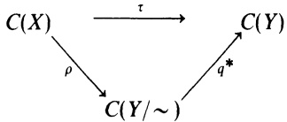

commutes. Find the corresponding injection $Y / { \sim } \to X .$

12. If X is any compact metric space, show that there is a totally disconnected compact metric space Y and a continuous surjection $\phi \colon Y   \to   X$ . (Hint: Start by embedding C(X) into $\mathcal { B } ( \mathcal { H } )$ and use Exercises 7 and 8.)

13. Show that every totally disconnected compact metric space is the continuous image of the Cantor ternary set. (Do this directly; do not try to use $C^{*} -algebrs.$ Combine this with Exercise 12 to get that every compact metric space is the continuous image of the Cantor set.

14. If  is an abelian von Neumann algebra and X is its maximal ideal space, then X is a Stonean space; that is, if U is open in X, then cl U is open in X.

15. This exercise assumes Exercise 2.21 where it was proved that $\mathcal { B } _ { 1 } ^ { * } = \mathcal { B } .$ When referring to the weak\* topology on $\mathcal { B } = \mathcal { B } ( \mathcal { H } )$ , we mean the topology  has as the Banach dual of $\mathcal { B } _ { 1 }$ (a) Show that on bounded subsets of $\pmb { \mathscr { B } }$ the $\mathbf { w e a k ^ { * } }$ topology = WOT. (b) Show that a C\*-subalgebra of $\mathcal { B } ( \mathcal { H } )$ is von Neumann algebra if and only if $\varkappa$ is weak\* closed. (c) Show that WOT and the weak\* topology agree on abelian von Neumann algebras (See Takeda [1951] and Pallu de la Barrière [1954].) (d) Give an example of a weak\* closed subspace of  that is not WOT closed. (See von Neumann [1936].)

16. Prove the converse of Proposition 7.6.

## §8. The Functional Calculus for Normal Operators: The Conclusion of the Saga

## In this section it will always be assumed that

## all Hilbert spaces are separable.

Indeed, this assumption will remain in force for the rest of the chapter. This assumption is necessary for the validity of some of the results and minimizes the technical details in others.

If N is a normal operator on $\mathcal { H }$ , let $W ^ { * } ( N )$ be the von Neumann algebra generated by N. That is, $W ^ { * } ( N )$ is the intersection of all of the von Neumann algebras containing N. Hence $W ^ { * } ( N )$ is the WOT closure of $\left\{ p ( N , N ^ { * } ) : p ( z , \bar { z } ) \right.$ is a polynomial in z and $\bar { z } \}$

8.1. Proposition. If N is a normal operator, then $W ^ { * } ( N ) = \{ N \} ^ { \prime \prime } \supseteq \{ \phi ( N ) :$ $\phi   \in   B ( \sigma ( N ) )   \big \}$

ProoF. The equality results from combining the Double Commutant