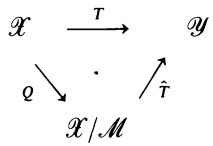

<!-- PDF page 385; unreviewed OCR draft -->

Conversely, if $\mathcal { X }$ is the linear span of $E ,$ then for every x in $\mathcal { X } \backslash E ,   E \cup \{ x \}$ is not linearly independent. Thus E is a basis.

1.2. Proposition. If $E _ { 0 }$ is a linearly independent subset of $\mathcal { X }$ , then there is a basis E that contains $E _ { 0 }$

PRoOF. Use Zorn's Lemma.

A linear functional on $\mathcal { X }$ is a function $f \colon { \mathcal { X } }   \to   \mathbb { F }$ such that $f(\alpha x + \beta y) = \alpha f(x) + \beta f(y)$ for $x , y$ in $\mathcal { X }$ and $\alpha , \beta$ in F. If $\mathcal { X }$ and $\pmb { y }$ are vector spaces over $\mathbb { F } ,$ a linear transformation from $\mathcal { X }$ into $\pmb { y }$ is a function $T \colon { \mathcal { X } }   \to   { \mathcal { Y } }$ such that $T(\alpha_{1}x_{1} + \alpha_{2}x_{2}) = \alpha_{1}T(x_{1}) + \alpha_{2}T(x_{2})   for   x_{1},x_{2}$ in $\mathcal { X }$ and $\alpha _ { 1 } , \alpha _ { 2 }$ in $\mathbb { F } .$

If $A , B \subseteq { \mathcal { X } }$ , then $A + B \equiv \{ a + b \colon a { \in } A ,   b { \in } B \} ;   A - B \equiv \{ a - b \colon a { \in } A ,   b { \in } B \}$ For α in F and $A \subseteq \mathcal{X}, \alpha A \equiv \{ \alpha a : a \in A \}$ . If M is a linear manifold in $\mathcal { X }$ (that is, $\mathcal { M } \subseteq \mathcal { X }$ and M is also a vector space with the same operations defined on $\mathcal { X } ) ,$ , then define $x / M$ to be the collection of all the subsets of $\mathcal { X }$ of the form $x + \mathcal { M }$ A set of the form $x + \mathcal { M }$ is called a coset of $\mathcal { M } ,$ Note that $( x + \mathcal { M } ) + ( y + \mathcal { M } ) = ( x + y ) + \mathcal { M }$ and $\alpha ( x + \mathcal { M } ) = \alpha x + \mathcal { M }$ since $\mathcal { M }$ is a linear manifold. Hence $x / M$ becomes a vector space over $\mathbb { E }$ It is called the quotient space of $\mathcal { X }$ mod $\mathcal { M }$

Define Q: $\mathcal { X } \rightarrow \mathcal { X } / \mathcal { M }$ by $Q ( x ) = x + { \mathcal { M } }$ . It is easy to see that $Q$ is a linear transformation. It is called the quotient map.

If $T \colon { \mathcal { X } }   \to   { \mathcal { Y } }$ is a linear transformation,

$$
\begin{aligned}\ker T & \equiv \{ x { \in } { \mathcal { X } } { : } \; T x = 0 \} , \\\operatorname { r a n } T & \equiv \{ T x { : } \; x { \in } { \mathcal { X } } \} ;\end{aligned}
$$

ker T is the kernel of T and ran T is the range of T. If ran $T = \mathcal { Y } ,$ T is surjective; if ker $T = ( 0 ) ,$ T is injective. If T is both injective and surjective, then $T$ is bijective. It is easy to see that the natural map $\mathcal { Q } \colon \mathcal { X } \to \mathcal { X } / \mathcal { M }$ is surjective and ker $Q = M$

Suppose now that $T \colon { \mathcal { X } }   \to   { \mathcal { Y } }$ is a linear transformation and M is a linear manifold in $\mathcal { X } .$ We want to define a map $\hat { T } : \mathcal { X } / \mathcal { M } \rightarrow \mathcal { Y }$ by $\hat { T } ( x + \mathcal { M } ) = T x .$ But $\hat { T }$ may not be well defined. To ensure that it is we must have $T x _ { 1 } = T x _ { 2 }$ i $x _ { 1 } + \mathcal { M } = x _ { 2 } + \mathcal { M }$ But $x _ { 1 } + \mathcal { M } = x _ { 2 } + \mathcal { M }$ if and only if $x _ { 1 } - x _ { 2 } \in \mathcal { M }$ , and $T x _ { 1 } = T x _ { 2 }$ if and only if $x _ { 1 } - x _ { 2 }$ eker T. So $\hat { T }$ is well defined if $\mathcal { M } \subseteq \ker T$ It is easy to check that if $\hat { T }$ is well defined, $\hat { T }$ is linear.

1.3. Proposition. If $T \colon { \mathcal { X } }   \to   { \mathcal { Y } }$ is a linear transformation and $\mathcal { M }$ is a linear manifold in $\mathcal { X }$ contained in ker $T ,$ then there is a linear transformation $\hat { T } ;$ $\mathcal { X } / \mathcal { M } \rightarrow \mathcal { Y }$ such that the diagram

commutes.
